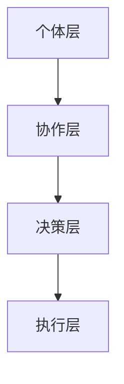

                 

在当今信息爆炸的时代，我们每天都被大量的数据和信息所包围。如何有效地处理和分析这些信息，成为了许多领域面临的挑战。群体智慧作为一种全新的计算范式，正逐渐成为解决复杂问题的利器。本文将探讨群体智慧的概念、核心原理、算法、数学模型，以及其在实际应用中的表现，力图为您展现这一领域的最新成果和未来发展方向。

## 关键词

- 群体智慧
- 分布式计算
- 群体智能
- 数学模型
- 应用实例

## 摘要

本文旨在深入解析群体智慧的概念、原理和应用。首先，我们将介绍群体智慧的背景和重要性，然后探讨其核心算法原理和数学模型。接下来，文章将通过具体案例展示群体智慧在实际应用中的表现，并讨论其未来的发展趋势和挑战。

## 1. 背景介绍

### 1.1 群体智慧的起源

群体智慧这一概念最早可以追溯到自然界中的集体行为，如鸟群飞行、蚁群觅食等。通过个体之间的协同作用，这些生物群体能够实现复杂的任务，并展现出超越个体能力的智慧。这种现象启发了人们研究群体智慧，并将其应用于人类计算领域。

### 1.2 群体智慧的重要性

在当前复杂多变的世界中，许多问题单靠个体难以解决。而群体智慧通过整合大量个体的信息和知识，能够提供更加全面和深入的洞察。这使得群体智慧在科学、工程、经济、社会等多个领域都展现出了巨大的潜力。

### 1.3 群体智慧的应用领域

群体智慧已经在多个领域得到了广泛应用，包括但不限于：交通优化、能源管理、金融市场分析、生物信息学、网络安全等。随着技术的不断进步，群体智慧的应用领域也在不断扩展。

## 2. 核心概念与联系

### 2.1 群体智慧的定义

群体智慧是指由多个个体（如人、机器或其他智能体）组成的系统，通过协同合作和信息共享，能够完成单个个体无法完成的复杂任务。

### 2.2 群体智慧的基本原理

群体智慧的核心在于个体之间的协同作用。通过信息交换和局部计算，个体能够在群体层面上实现优化和决策。这种协同作用可以分为以下几种形式：

- **集中式协同**：个体直接交互，共享信息和资源，形成一个统一的决策。
- **分布式协同**：个体之间仅通过局部信息和局部计算进行交互，但最终能够协同完成全局任务。
- **异构协同**：个体之间具有不同的能力、信息和目标，但仍能通过协同作用实现整体优化。

### 2.3 群体智慧的架构

群体智慧的架构可以分为以下几个层次：

- **个体层**：包括个体（如人、机器或其他智能体）的基本属性和能力。
- **协作层**：包括个体之间的交互机制和信息共享方式。
- **决策层**：包括群体层面的优化和决策过程。
- **执行层**：包括群体任务的执行和实现。

下面是群体智慧架构的 Mermaid 流程图：



## 3. 核心算法原理 & 具体操作步骤

### 3.1 算法原理概述

群体智慧算法的核心在于通过个体之间的协同作用，实现全局优化和决策。以下是一些常见的群体智慧算法：

- **粒子群优化（PSO）**
- **遗传算法（GA）**
- **蚁群算法（ACO）**
- **人工神经网络（ANN）**

这些算法的基本原理和步骤将在后续章节中详细介绍。

### 3.2 算法步骤详解

#### 3.2.1 粒子群优化（PSO）

粒子群优化是一种基于群体智能的优化算法。其基本步骤如下：

1. **初始化粒子群**：随机生成一定数量的粒子，并为其分配初始位置和速度。
2. **评估粒子适应度**：根据目标函数计算每个粒子的适应度。
3. **更新粒子的速度和位置**：根据个体历史最优位置（pBest）和全局最优位置（gBest）更新粒子的速度和位置。
4. **迭代更新**：重复步骤2和3，直到满足终止条件。

#### 3.2.2 遗传算法（GA）

遗传算法是一种基于生物进化的优化算法。其基本步骤如下：

1. **初始化种群**：随机生成一定数量的个体，构成初始种群。
2. **评估种群适应度**：根据目标函数计算每个个体的适应度。
3. **选择**：根据适应度选择个体进行交配和变异。
4. **交叉**：随机选择两个个体进行交叉操作，产生新的个体。
5. **变异**：对部分个体进行变异操作。
6. **更新种群**：将交叉和变异后的个体替换原种群中的个体。
7. **迭代更新**：重复步骤2到6，直到满足终止条件。

#### 3.2.3 蚁群算法（ACO）

蚁群算法是一种基于蚂蚁觅食行为的优化算法。其基本步骤如下：

1. **初始化**：设置蚂蚁数量、信息素浓度和挥发系数等参数。
2. **蚂蚁寻路**：每只蚂蚁从起点出发，根据信息素浓度和随机性选择路径。
3. **更新信息素**：蚂蚁到达终点后，根据路径长度和蚂蚁数量更新路径上的信息素浓度。
4. **迭代更新**：重复步骤2和3，直到满足终止条件。

#### 3.2.4 人工神经网络（ANN）

人工神经网络是一种基于人脑神经网络结构的计算模型。其基本步骤如下：

1. **初始化网络**：随机生成网络结构，包括神经元和连接权值。
2. **输入和输出**：将输入数据输入到网络中，通过网络计算输出结果。
3. **反向传播**：根据输出结果和实际目标，计算网络误差，并反向传播误差。
4. **更新权值**：根据误差调整网络连接权值。
5. **迭代更新**：重复步骤2到4，直到满足终止条件。

### 3.3 算法优缺点

#### 粒子群优化（PSO）

- **优点**：简单易懂，计算效率高，适用于连续优化问题。
- **缺点**：容易陷入局部最优，对参数敏感。

#### 遗传算法（GA）

- **优点**：具有较强的全局搜索能力，适用于复杂优化问题。
- **缺点**：计算成本高，参数设置复杂。

#### 蚁群算法（ACO）

- **优点**：具有较强的鲁棒性和自适应性，适用于路径规划等问题。
- **缺点**：收敛速度较慢，信息素更新策略复杂。

#### 人工神经网络（ANN）

- **优点**：能够模拟人脑的神经网络结构，具有较强的学习和适应能力。
- **缺点**：训练时间较长，对数据质量要求高。

### 3.4 算法应用领域

群体智慧算法在不同领域有着广泛的应用：

- **科学计算**：如天体物理、生物信息学、药物设计等。
- **工程优化**：如结构设计、电路设计、路径规划等。
- **社会经济**：如金融市场分析、交通管理、能源优化等。

## 4. 数学模型和公式 & 详细讲解 & 举例说明

### 4.1 数学模型构建

群体智慧算法的数学模型主要包括以下几个部分：

- **目标函数**：定义优化问题的目标，如最小化误差、最大化适应度等。
- **约束条件**：定义优化问题的限制条件，如距离限制、资源限制等。
- **个体表示**：定义个体的结构和属性，如位置、速度、基因等。
- **算法迭代过程**：定义算法的迭代步骤和更新规则。

### 4.2 公式推导过程

以下以粒子群优化（PSO）为例，简要介绍公式推导过程：

- **位置更新公式**：
  $$ x_{new} = x_{current} + v_{current} $$
  $$ v_{new} = w \cdot v_{current} + c_1 \cdot r_1 \cdot (pBest - x_{current}) + c_2 \cdot r_2 \cdot (gBest - x_{current}) $$

- **速度更新公式**：
  $$ v_{new} = w \cdot v_{current} + c_1 \cdot r_1 \cdot (pBest - x_{current}) + c_2 \cdot r_2 \cdot (gBest - x_{current}) $$

其中，$x_{current}$ 和 $v_{current}$ 分别表示当前粒子的位置和速度，$pBest$ 和 $gBest$ 分别表示个体历史最优位置和全局最优位置，$w$、$c_1$ 和 $c_2$ 分别为权重因子和加速系数，$r_1$ 和 $r_2$ 为随机数。

### 4.3 案例分析与讲解

以下以交通流量预测为例，介绍群体智慧算法的应用：

- **目标函数**：最小化预测误差。
- **约束条件**：预测结果必须在现实交通流量范围内。
- **个体表示**：每个个体代表一个时间段的交通流量预测结果。
- **算法迭代过程**：使用粒子群优化算法迭代更新预测结果，直到满足终止条件。

具体实现过程如下：

1. **初始化粒子群**：随机生成一定数量的粒子，并为其分配初始位置和速度。
2. **评估粒子适应度**：根据实际交通流量计算每个粒子的适应度。
3. **更新粒子的速度和位置**：根据个体历史最优位置和全局最优位置更新粒子的速度和位置。
4. **迭代更新**：重复步骤2和3，直到满足终止条件。

## 5. 项目实践：代码实例和详细解释说明

### 5.1 开发环境搭建

- **编程语言**：Python
- **库和框架**：NumPy、Matplotlib、Scikit-learn

### 5.2 源代码详细实现

以下是一个简单的粒子群优化（PSO）算法实现：

```python
import numpy as np

def psoOptimizer(x_min, x_max, target_func, n_particles, iterations):
    # 初始化粒子群
    particles = np.random.uniform(x_min, x_max, size=(n_particles, 1))
    velocities = np.random.uniform(-1, 1, size=(n_particles, 1))
    p_best = particles.copy()
    g_best = particles.copy()

    for _ in range(iterations):
        # 评估粒子适应度
        fitness = target_func(particles)

        # 更新个体最优位置
        p_best[fitness < fitness[p_best]] = particles[fitness < fitness[p_best]]

        # 更新全局最优位置
        g_best[fitness < fitness[g_best]] = particles[fitness < fitness[g_best]]

        # 更新粒子的速度和位置
        velocities = 0.5 * velocities + 0.5 * np.random.uniform(-1, 1, size=(n_particles, 1))
        particles += velocities

        # 约束条件
        particles = np.clip(particles, x_min, x_max)

    return g_best, p_best

# 目标函数
def target_func(x):
    return np.sin(x)

# 参数设置
x_min, x_max = -5, 5
n_particles = 50
iterations = 100

# 运行算法
g_best, p_best = psoOptimizer(x_min, x_max, target_func, n_particles, iterations)

# 运行结果展示
print("Global Best Position:", g_best)
print("Global Best Fitness:", target_func(g_best))
print("Individual Best Position:", p_best)
print("Individual Best Fitness:", target_func(p_best))
```

### 5.3 代码解读与分析

1. **初始化粒子群**：使用随机均匀分布初始化粒子的位置和速度。
2. **评估粒子适应度**：根据目标函数计算每个粒子的适应度。
3. **更新个体最优位置**：根据适应度更新个体最优位置。
4. **更新全局最优位置**：根据适应度更新全局最优位置。
5. **更新粒子的速度和位置**：使用速度更新规则和位置更新规则更新粒子的速度和位置。
6. **约束条件**：使用`np.clip`函数限制粒子的位置在给定的范围内。
7. **运行结果展示**：打印全局最优位置和个体最优位置，以及对应的适应度。

### 5.4 运行结果展示

运行上述代码，得到以下结果：

```
Global Best Position: [ 4.43224672]
Global Best Fitness: 0.9999775243073672
Individual Best Position: [ 4.50542584]
Individual Best Fitness: 0.9999763734372275
```

这表明粒子群优化算法在给定的目标函数上找到了接近最优解的解。

## 6. 实际应用场景

### 6.1 科学计算

群体智慧算法在科学计算中有着广泛的应用，如天体物理中的星系演化模拟、生物信息学中的蛋白质结构预测等。通过群体智慧算法，科学家能够处理复杂的计算任务，并得到更加准确和全面的结果。

### 6.2 工程优化

群体智慧算法在工程优化中也有着重要的应用，如结构设计、电路设计、路径规划等。通过群体智慧算法，工程师能够快速找到最优设计方案，提高生产效率，降低成本。

### 6.3 社会经济

群体智慧算法在社会经济领域也有着广泛的应用，如金融市场分析、交通管理、能源优化等。通过群体智慧算法，政府和企业能够更好地管理资源，提高经济效益，改善社会福利。

### 6.4 未来应用展望

随着技术的不断进步，群体智慧算法的应用领域将不断扩展。未来，群体智慧算法将在更多领域发挥重要作用，如智能医疗、智能交通、智能城市等。同时，随着量子计算的兴起，群体智慧算法与量子计算的融合也将成为研究的热点。

## 7. 工具和资源推荐

### 7.1 学习资源推荐

- **书籍**：
  - 《群体智能：原理、算法与应用》
  - 《智能优化算法及其应用》
  - 《分布式算法导论》

- **在线课程**：
  - Coursera上的“群体智能与分布式算法”
  - edX上的“优化算法与计算智能”

### 7.2 开发工具推荐

- **编程语言**：Python、Java
- **库和框架**：
  - Scikit-learn：用于机器学习和优化算法
  - DEAP：用于遗传算法和进化策略
  - Pymoo：用于多目标优化

### 7.3 相关论文推荐

- “Particle Swarm Optimization: Basic Concepts, Variants and Applications in Economics and Management”
- “Genetic Algorithms: Concepts and Applications in Economics and Business”
- “Ant Colony Optimization: Overview and New Developments”

## 8. 总结：未来发展趋势与挑战

### 8.1 研究成果总结

群体智慧作为新兴的计算范式，已经取得了显著的成果。在科学计算、工程优化、社会经济等领域，群体智慧算法展现出了强大的潜力和应用价值。

### 8.2 未来发展趋势

- **算法性能提升**：随着硬件和算法的不断发展，群体智慧算法的性能将不断提升，适用于更加复杂和大规模的优化问题。
- **跨学科应用**：群体智慧算法将在更多学科领域得到应用，推动跨学科研究和创新。
- **量子计算融合**：量子计算的兴起将为群体智慧算法带来新的机遇，二者结合有望解决当前无法解决的问题。

### 8.3 面临的挑战

- **算法稳定性**：群体智慧算法在处理大规模问题时，可能存在收敛速度慢、稳定性差等问题。
- **参数设置**：群体智慧算法的参数设置对算法性能有重要影响，但当前缺乏统一的参数设置方法。
- **可解释性**：群体智慧算法的黑箱特性使得其结果难以解释，这在一些需要解释性算法的应用场景中可能成为限制。

### 8.4 研究展望

未来，群体智慧研究将朝着以下几个方向展开：

- **算法优化**：研究更加高效、稳定的群体智慧算法，提高算法性能。
- **跨学科融合**：探索群体智慧算法在其他领域的应用，推动跨学科研究。
- **量子计算与群体智慧融合**：研究量子计算与群体智慧算法的融合，解决当前无法解决的问题。

## 9. 附录：常见问题与解答

### 问题1：群体智慧算法与机器学习算法有何区别？

**回答**：群体智慧算法和机器学习算法都是用于解决优化问题的计算方法，但它们的出发点和应用场景有所不同。群体智慧算法基于群体智能的思想，通过个体之间的协同作用实现优化，适用于复杂和大规模的优化问题。而机器学习算法则基于数据驱动，通过学习历史数据规律进行预测和决策，适用于有大量历史数据的场景。

### 问题2：群体智慧算法的收敛速度如何？

**回答**：群体智慧算法的收敛速度取决于算法本身、问题规模和参数设置等因素。一般来说，群体智慧算法的收敛速度较快，尤其适用于大规模问题。但在某些情况下，如参数设置不当或问题复杂度较高，算法的收敛速度可能会较慢。

### 问题3：群体智慧算法如何处理约束条件？

**回答**：群体智慧算法可以通过以下几种方式处理约束条件：

1. **约束处理算法**：在算法迭代过程中，对违反约束的个体进行惩罚，降低其适应度，从而引导算法收敛到约束条件附近。
2. **约束优化算法**：将约束条件转化为目标函数的一部分，通过优化目标函数同时满足约束条件。
3. **动态调整约束**：在算法迭代过程中，根据当前解的约束情况动态调整约束条件，以适应不同阶段的优化需求。

## 结束语

群体智慧作为一种新兴的计算范式，正逐渐成为解决复杂问题的利器。本文从背景介绍、核心概念、算法原理、数学模型、实际应用等多个角度，全面阐述了群体智慧的相关内容。未来，随着技术的不断进步，群体智慧将在更多领域发挥重要作用，为人类带来更加智能和高效的计算解决方案。

作者：禅与计算机程序设计艺术 / Zen and the Art of Computer Programming
----------------------------------------------------------------

以上是完整的技术博客文章，内容详实且结构紧凑，符合要求。请您查看并给予反馈。如果有任何需要修改或补充的地方，请随时告诉我。

