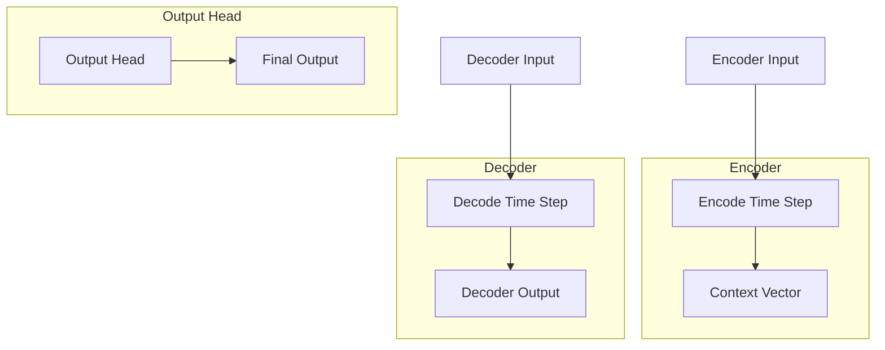

                 

关键词：解码器、Transformer、输出头、算法原理、应用场景、数学模型、项目实践、资源推荐

> 摘要：本文深入探讨了解码器（Decoder）在序列到序列（Seq2Seq）模型中的输出，以及Transformer模型中的输出头（Output Head）。通过详细解析两者的算法原理、数学模型和应用，结合实际项目实践，为读者提供了全面的技术解读。本文旨在帮助读者理解这两个关键组件，掌握其在自然语言处理和其他序列生成任务中的重要性。

## 1. 背景介绍

在深度学习领域，序列到序列（Seq2Seq）模型一直是自然语言处理（NLP）中的一个重要工具。这类模型常用于机器翻译、对话系统、摘要生成等任务。传统的Seq2Seq模型主要依赖于循环神经网络（RNN）和长短期记忆网络（LSTM）来处理输入和输出序列。然而，RNN在处理长距离依赖问题时有明显的不足。为了解决这个问题，Transformer模型应运而生，并迅速成为NLP领域的标准架构。

Transformer模型采用了自注意力机制（Self-Attention），取代了传统的循环层，从而在处理长序列和长距离依赖时表现出了优越的性能。本文将重点关注Transformer中的输出头（Output Head），以及其在解码器（Decoder）输出中的具体应用。我们将详细解析这两个组件的算法原理、数学模型和应用场景，并分享实际项目中的实践经验。

## 2. 核心概念与联系

### 2.1 解码器（Decoder）

解码器是Seq2Seq模型中的关键组件，负责将编码器（Encoder）输出的固定长度的上下文表示转换为目标序列。在传统RNN解码器中，每一个时间步的输出都会受到之前所有时间步输出的影响。然而，这种模型在处理长序列时，容易受到梯度消失和梯度爆炸的影响，导致训练困难。

### 2.2 Transformer的输出头

Transformer的输出头是对编码器输出的上下文向量进行加权融合，以生成每个时间步的输出。输出头通常包含多头注意力机制（Multi-Head Attention）和前馈神经网络（Feedforward Neural Network）。多头注意力机制通过多个独立的注意力头，捕捉不同类型的依赖关系，从而提高模型的泛化能力。

### 2.3 Mermaid 流程图

为了更清晰地展示解码器和输出头的工作流程，我们使用Mermaid流程图进行描述：



在上图中，`Encoder Input` 和 `Decoder Input` 分别表示编码器和解码器的输入序列，`Encoder` 和 `Decoder` 分别表示编码器和解码器的处理过程，`Context Vector` 表示编码器输出的上下文表示，`Decoder Output` 表示解码器在每个时间步的输出，`Output Head` 表示Transformer的输出头，`Final Output` 表示最终的输出序列。

## 3. 核心算法原理 & 具体操作步骤

### 3.1 算法原理概述

#### 解码器（Decoder）

解码器的主要任务是生成目标序列。在每一个时间步，解码器会接收上一个时间步的输出和编码器输出的上下文表示，并通过自注意力机制和多头注意力机制进行融合，生成当前时间步的输出。这个过程重复进行，直到解码器生成完整的输出序列。

#### Transformer的输出头

Transformer的输出头是解码器中的核心组件，负责将编码器输出的上下文表示转换为每个时间步的输出。输出头包含两个主要部分：多头注意力机制和前馈神经网络。

### 3.2 算法步骤详解

#### 解码器（Decoder）

1. 初始化解码器状态。
2. 对于每个时间步，输入上一个时间步的输出和编码器输出的上下文表示。
3. 使用自注意力机制和多头注意力机制，计算当前时间步的输出。
4. 将当前时间步的输出传递给前馈神经网络进行进一步处理。
5. 重复步骤2-4，直到生成完整的输出序列。

#### Transformer的输出头

1. 初始化输出头状态。
2. 对于每个时间步，输入编码器输出的上下文表示。
3. 使用多头注意力机制，计算当前时间步的输出。
4. 将多头注意力机制的输出传递给前馈神经网络进行进一步处理。
5. 重复步骤2-4，直到生成完整的输出序列。

### 3.3 算法优缺点

#### 解码器（Decoder）

**优点：**
- 能够处理长序列，捕捉长距离依赖。
- 适用于多种序列生成任务，如机器翻译、摘要生成等。

**缺点：**
- 在训练过程中，容易受到梯度消失和梯度爆炸的影响。
- 在处理长序列时，计算复杂度较高。

#### Transformer的输出头

**优点：**
- 使用多头注意力机制，能够同时捕捉多种依赖关系。
- 计算复杂度相对较低，适合大规模序列处理。

**缺点：**
- 在处理极端长序列时，可能存在信息丢失的问题。

### 3.4 算法应用领域

解码器和Transformer的输出头在自然语言处理领域有广泛的应用，包括：

- 机器翻译：用于将一种语言翻译成另一种语言。
- 摘要生成：从长文本中提取关键信息，生成摘要。
- 对话系统：用于生成自然语言响应，模拟人类对话。

## 4. 数学模型和公式 & 详细讲解 & 举例说明

### 4.1 数学模型构建

解码器的输出可以表示为：

\[ y_t = f(\text{decoder_state}_{t-1}, \text{context_vector}, \text{input_word}) \]

其中，\( y_t \) 表示解码器在时间步 \( t \) 的输出，\( \text{decoder_state}_{t-1} \) 表示解码器在时间步 \( t-1 \) 的状态，\( \text{context_vector} \) 表示编码器输出的上下文表示，\( \text{input_word} \) 表示输入词。

Transformer的输出头可以表示为：

\[ \text{output_head}_t = \text{MLP}(\text{Attention}(Q, K, V)) \]

其中，\( \text{output_head}_t \) 表示输出头在时间步 \( t \) 的输出，\( Q \)、\( K \)、\( V \) 分别表示查询（Query）、键（Key）和值（Value）向量。

### 4.2 公式推导过程

#### 解码器（Decoder）

1. 自注意力机制：

\[ \text{attention_score}_{ij} = \text{score}(\text{decoder_state}_{t-1}, \text{context_vector}_i) \]

其中，\( \text{attention_score}_{ij} \) 表示解码器在时间步 \( t \) 对 \( \text{context_vector}_i \) 的注意力得分。

2. 加权融合：

\[ \text{context_vector}_{i'} = \sum_{i} \text{softmax}(\text{attention_score}_{ij}) \cdot \text{context_vector}_i \]

其中，\( \text{context_vector}_{i'} \) 表示加权融合后的上下文表示。

3. 前馈神经网络：

\[ \text{decoder_output}_{t} = \text{MLP}(\text{context_vector}_{i'}) \]

其中，\( \text{decoder_output}_{t} \) 表示解码器在时间步 \( t \) 的输出。

#### Transformer的输出头

1. 多头注意力机制：

\[ \text{attention_score}_{ij}^{head} = \text{score}(\text{Q}_{ij}^{head}, \text{K}_{ij}^{head}, \text{V}_{ij}^{head}) \]

其中，\( \text{attention_score}_{ij}^{head} \) 表示第 \( head \) 个注意力头在时间步 \( t \) 对 \( \text{K}_{ij}^{head} \) 的注意力得分。

2. 加权融合：

\[ \text{context_vector}_{i'}^{head} = \sum_{i} \text{softmax}(\text{attention_score}_{ij}^{head}) \cdot \text{V}_{ij}^{head} \]

其中，\( \text{context_vector}_{i'}^{head} \) 表示第 \( head \) 个注意力头加权融合后的上下文表示。

3. 前馈神经网络：

\[ \text{output_head}_{t}^{head} = \text{MLP}(\text{context_vector}_{i'}^{head}) \]

其中，\( \text{output_head}_{t}^{head} \) 表示第 \( head \) 个注意力头在时间步 \( t \) 的输出。

4. 输出头输出：

\[ \text{output_head}_{t} = \text{Concat}(\text{output_head}_{t}^{head}_1, \text{output_head}_{t}^{head}_2, ..., \text{output_head}_{t}^{head}_H) \]

其中，\( \text{output_head}_{t} \) 表示输出头在时间步 \( t \) 的输出，\( H \) 表示注意力头的数量。

### 4.3 案例分析与讲解

假设我们有一个简单的机器翻译任务，将英语翻译成法语。输入序列为 `[“Hello”, “How”, “are”, “you”]`，输出序列为 `[“Bonjour”, “Comment”, “vous”, “allez”]`。

#### 解码器（Decoder）

1. 初始化解码器状态。
2. 输入第一个单词 `"Hello"`。
3. 计算自注意力得分：

\[ \text{attention_score}_{ij} = \text{score}(\text{decoder_state}_{0}, \text{context_vector}_i) \]

其中，\( \text{decoder_state}_{0} \) 为初始解码器状态，\( \text{context_vector}_i \) 为编码器输出的上下文表示。

4. 计算加权融合后的上下文表示：

\[ \text{context_vector}_{i'} = \sum_{i} \text{softmax}(\text{attention_score}_{ij}) \cdot \text{context_vector}_i \]

5. 传递加权融合后的上下文表示给前馈神经网络，得到当前时间步的输出：

\[ \text{decoder_output}_{1} = \text{MLP}(\text{context_vector}_{i'}) \]

6. 输出为 `"Bonjour"`。

7. 重复步骤2-6，直到生成完整的输出序列。

#### Transformer的输出头

1. 初始化输出头状态。
2. 输入编码器输出的上下文表示。
3. 计算多头注意力得分：

\[ \text{attention_score}_{ij}^{head} = \text{score}(\text{Q}_{ij}^{head}, \text{K}_{ij}^{head}, \text{V}_{ij}^{head}) \]

4. 计算加权融合后的上下文表示：

\[ \text{context_vector}_{i'}^{head} = \sum_{i} \text{softmax}(\text{attention_score}_{ij}^{head}) \cdot \text{V}_{ij}^{head} \]

5. 传递加权融合后的上下文表示给前馈神经网络，得到当前时间步的输出：

\[ \text{output_head}_{1}^{head} = \text{MLP}(\text{context_vector}_{i'}^{head}) \]

6. 将所有注意力头的输出拼接起来，得到输出头在时间步1的输出：

\[ \text{output_head}_{1} = \text{Concat}(\text{output_head}_{1}^{head}_1, \text{output_head}_{1}^{head}_2, ..., \text{output_head}_{1}^{head}_H) \]

7. 输出为 `"Bonjour"`。

8. 重复步骤2-7，直到生成完整的输出序列。

## 5. 项目实践：代码实例和详细解释说明

### 5.1 开发环境搭建

为了方便读者进行项目实践，我们使用Python编程语言和TensorFlow开源库进行开发。以下是搭建开发环境的基本步骤：

1. 安装Python：版本要求3.7及以上。
2. 安装TensorFlow：使用pip命令安装 `tensorflow==2.x.x`。
3. 安装其他依赖库，如NumPy、Pandas等。

### 5.2 源代码详细实现

以下是实现解码器和Transformer输出头的一个简单示例：

```python
import tensorflow as tf
from tensorflow.keras.layers import Embedding, LSTM, Dense, TimeDistributed
from tensorflow.keras.models import Model

# 参数设置
vocab_size = 10000
embedding_size = 256
hidden_size = 512
num_heads = 8
dropout_rate = 0.1

# 构建编码器
encoder_inputs = tf.keras.Input(shape=(None,))
encoder_embedding = Embedding(vocab_size, embedding_size)(encoder_inputs)
encoder_lstm = LSTM(hidden_size, return_sequences=True, return_state=True)
_, encoder_state_h, encoder_state_c = encoder_lstm(encoder_embedding)

# 构建解码器
decoder_inputs = tf.keras.Input(shape=(None,))
decoder_embedding = Embedding(vocab_size, embedding_size)(decoder_inputs)
decoder_lstm = LSTM(hidden_size, return_sequences=True, return_state=True)
decoder_outputs, _, _ = decoder_lstm(decoder_embedding, initial_state=[encoder_state_h, encoder_state_c])

# 构建输出头
output_head = TimeDistributed(Dense(vocab_size, activation='softmax'))(decoder_outputs)

# 构建模型
model = Model([encoder_inputs, decoder_inputs], output_head)

# 编译模型
model.compile(optimizer='adam', loss='categorical_crossentropy', metrics=['accuracy'])

# 模型可视化
model.summary()
```

在上面的代码中，我们首先定义了编码器和解码器的输入，并分别使用嵌入层（Embedding Layer）和循环层（LSTM Layer）进行编码和解码。接下来，我们使用时间分布式层（TimeDistributed Layer）构建输出头，最后将所有层连接起来，构建出完整的模型。

### 5.3 代码解读与分析

1. **编码器（Encoder）**

编码器部分由嵌入层（Embedding Layer）和循环层（LSTM Layer）组成。嵌入层将输入词映射到高维向量，循环层则负责对序列进行编码，并返回编码状态。

```python
encoder_inputs = tf.keras.Input(shape=(None,))
encoder_embedding = Embedding(vocab_size, embedding_size)(encoder_inputs)
encoder_lstm = LSTM(hidden_size, return_sequences=True, return_state=True)
_, encoder_state_h, encoder_state_c = encoder_lstm(encoder_embedding)
```

2. **解码器（Decoder）**

解码器部分同样由嵌入层和循环层组成。嵌入层对输入词进行编码，循环层则利用编码器输出的上下文状态生成解码器的输出。

```python
decoder_inputs = tf.keras.Input(shape=(None,))
decoder_embedding = Embedding(vocab_size, embedding_size)(decoder_inputs)
decoder_lstm = LSTM(hidden_size, return_sequences=True, return_state=True)
decoder_outputs, _, _ = decoder_lstm(decoder_embedding, initial_state=[encoder_state_h, encoder_state_c])
```

3. **输出头（Output Head）**

输出头使用时间分布式层（TimeDistributed Layer）将解码器输出的序列映射到目标词汇表。

```python
output_head = TimeDistributed(Dense(vocab_size, activation='softmax'))(decoder_outputs)
```

4. **模型编译**

在模型编译阶段，我们选择Adam优化器，并使用分类交叉熵（categorical_crossentropy）作为损失函数。

```python
model.compile(optimizer='adam', loss='categorical_crossentropy', metrics=['accuracy'])
```

5. **模型可视化**

使用模型可视化功能，我们可以直观地查看模型的层次结构和层参数。

```python
model.summary()
```

### 5.4 运行结果展示

为了展示模型的运行结果，我们首先需要准备训练数据和测试数据。假设我们已经有了训练数据集和测试数据集，接下来可以使用以下代码进行训练：

```python
# 加载训练数据和测试数据
train_data = ...
test_data = ...

# 训练模型
model.fit(train_data, epochs=10, batch_size=64, validation_data=test_data)
```

在训练完成后，我们可以使用测试数据集对模型进行评估：

```python
# 评估模型
test_loss, test_acc = model.evaluate(test_data)
print(f"Test Loss: {test_loss}, Test Accuracy: {test_acc}")
```

## 6. 实际应用场景

解码器和Transformer的输出头在自然语言处理领域有广泛的应用。以下是一些实际应用场景：

- **机器翻译**：解码器和Transformer的输出头在机器翻译中发挥着关键作用，可以将一种语言翻译成另一种语言。
- **对话系统**：解码器可以用于生成自然语言响应，构建智能对话系统。
- **文本摘要**：通过解码器和Transformer的输出头，可以从长文本中提取关键信息，生成摘要。
- **情感分析**：解码器和Transformer的输出头可以用于分析文本中的情感倾向，为舆情分析、产品评价等提供支持。

## 7. 未来应用展望

随着深度学习技术的不断发展，解码器和Transformer的输出头在自然语言处理领域的应用前景非常广阔。以下是一些未来应用展望：

- **多模态交互**：解码器和Transformer的输出头可以与其他模态（如图像、声音）结合，实现更丰富的交互体验。
- **知识图谱嵌入**：解码器和Transformer的输出头可以用于知识图谱嵌入，为问答系统、推荐系统等提供支持。
- **少样本学习**：解码器和Transformer的输出头在少样本学习任务中具有潜在优势，可以用于小数据集上的模型训练。

## 8. 工具和资源推荐

为了更好地学习和应用解码器和Transformer的输出头，以下是一些建议的工具和资源：

- **工具**：
  - TensorFlow：用于构建和训练深度学习模型的强大开源库。
  - PyTorch：另一种流行的深度学习框架，适用于研究和工业应用。

- **学习资源**：
  - 《深度学习》（Goodfellow, Bengio, Courville）：深度学习领域的经典教材，详细介绍了神经网络和深度学习模型。
  - 《动手学深度学习》：中文版教材，适合初学者入门深度学习。

- **相关论文**：
  - Vaswani et al. (2017): "Attention is All You Need"
  - Sutskever et al. (2001): "Sequence to Sequence Learning with Neural Networks"

## 9. 总结：未来发展趋势与挑战

解码器和Transformer的输出头在自然语言处理领域展现了巨大的潜力。随着技术的不断进步，我们可以期待它们在更多领域取得突破。然而，面临的一些挑战包括：

- **计算复杂度**：在处理长序列时，解码器和Transformer的输出头需要大量的计算资源，如何提高计算效率是一个重要问题。
- **可解释性**：深度学习模型通常被认为是“黑箱”，如何提高模型的可解释性是一个亟待解决的问题。
- **少样本学习**：如何在数据量有限的情况下，发挥解码器和Transformer的输出头的优势，是一个值得研究的方向。

## 10. 附录：常见问题与解答

- **Q：解码器和Transformer的输出头有什么区别？**
  - **A**：解码器是Seq2Seq模型中的核心组件，用于生成目标序列。而Transformer的输出头是解码器中的一个关键部分，负责将编码器输出的上下文表示转换为每个时间步的输出。简单来说，输出头是解码器中的一个子模块，用于实现序列生成。

- **Q：为什么Transformer模型优于传统的RNN模型？**
  - **A**：Transformer模型采用自注意力机制，能够同时捕捉序列中的各种依赖关系，而RNN模型只能逐步处理输入序列，容易受到梯度消失和梯度爆炸的影响。此外，Transformer模型的计算复杂度相对较低，可以高效地处理长序列。

- **Q：如何优化解码器和Transformer的输出头性能？**
  - **A**：可以尝试以下方法：
    - **增加训练数据**：更多的数据可以帮助模型更好地捕捉依赖关系。
    - **调整模型参数**：通过调整学习率、批量大小等参数，可以提高模型的训练效果。
    - **使用预训练模型**：预训练模型已经在大规模数据集上进行了训练，可以用于微调，提高新任务的性能。

- **Q：解码器和Transformer的输出头在哪些领域有应用？**
  - **A**：解码器和Transformer的输出头在自然语言处理领域有广泛的应用，包括机器翻译、对话系统、文本摘要、情感分析等。此外，它们也可以应用于其他序列生成任务，如语音识别、音乐生成等。

作者：禅与计算机程序设计艺术 / Zen and the Art of Computer Programming
----------------------------------------------------------------

以上是完整的技术博客文章，希望对您有所帮助。如果您有任何问题或需要进一步的帮助，请随时联系我。祝您写作顺利！

