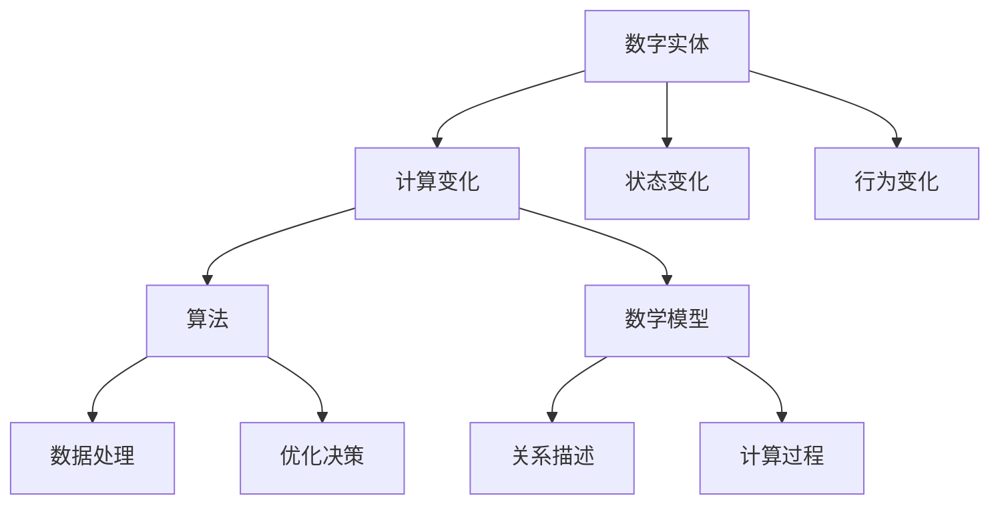

                 

关键词：计算变化、数字实体、关系、算法、数学模型、项目实践、应用场景、未来展望

## 摘要

本文旨在探讨计算变化与数字实体之间的关系。通过深入分析核心概念、算法原理、数学模型以及项目实践，我们将揭示计算变化在数字实体中的核心作用，以及这一关系如何影响实际应用场景和未来发展趋势。文章将分为八个部分，分别介绍背景、核心概念、算法原理、数学模型、项目实践、实际应用场景、工具和资源推荐，以及总结未来发展趋势与挑战。

## 1. 背景介绍

随着信息技术的飞速发展，计算能力不断增长，数字实体已经成为我们日常生活和工作中不可或缺的一部分。从智能手机到智能穿戴设备，从云计算到大数据，数字实体无处不在。然而，这些数字实体并非静止不变，而是处于不断的计算变化之中。计算变化是指在数字实体中进行的各种计算操作，以实现数据处理、优化决策、预测分析等功能。

计算变化的重要性体现在多个方面。首先，它是实现智能化的基础。通过计算变化，数字实体能够模拟人类思维过程，进行学习和推理，从而实现自主决策和自适应行为。其次，计算变化有助于提高数据处理效率。通过优化算法和计算模型，数字实体能够在海量数据中快速提取有价值的信息，为决策提供支持。最后，计算变化还推动了新技术的诞生。例如，深度学习、区块链、物联网等技术的快速发展，都与计算变化密切相关。

本文将围绕计算变化与数字实体之间的关系，深入探讨其在算法、数学模型、项目实践等领域的应用。通过详细的分析和实例讲解，我们希望能够为读者提供一个全面、系统的理解，以期为相关领域的研究和应用提供参考。

### 2. 核心概念与联系

#### 2.1 核心概念

在探讨计算变化与数字实体的关系时，我们需要明确一些核心概念，这些概念是理解本文主题的基础。

**数字实体**：数字实体是指通过计算机技术构建的、具有特定功能和行为的虚拟对象。它们可以包括各种类型的软件系统、数据库、智能设备等。数字实体是计算变化的作用对象。

**计算变化**：计算变化是指数字实体内部进行的各种计算操作，包括数据处理、算法优化、模型更新等。这些操作能够改变数字实体的状态，实现特定的功能。

**算法**：算法是一系列计算步骤，用于解决特定问题。在数字实体中，算法是实现计算变化的核心工具。不同的算法适用于不同的计算任务，如排序、搜索、优化等。

**数学模型**：数学模型是通过数学方法构建的，用于描述数字实体内部关系和计算过程的抽象模型。数学模型能够为算法提供理论支持，帮助理解计算变化的过程。

#### 2.2 关系

数字实体和计算变化之间的关系可以从多个维度来理解。

**计算变化影响数字实体**：计算变化作用于数字实体，改变其状态和行为。例如，在智能穿戴设备中，传感器采集的数据会通过算法进行处理，从而实现对用户健康状态的监测和预测。

**数字实体依赖计算变化**：数字实体的功能实现依赖于计算变化。例如，在智能交通系统中，通过计算变化，可以实现对交通流量的实时监测和优化，从而提高道路通行效率。

**算法和数学模型在计算变化中扮演关键角色**：算法和数学模型是计算变化的核心工具。它们决定了计算变化的效率和质量。例如，在图像识别算法中，数学模型用于描述图像的特征，从而实现高效的图像识别。

#### 2.3 架构

为了更好地理解计算变化与数字实体之间的关系，我们可以使用Mermaid流程图来描述其架构。



在这个流程图中，数字实体是计算变化的作用对象，计算变化通过算法和数学模型来实现。算法负责数据处理和优化决策，数学模型则用于描述数字实体内部的关系和计算过程。最终，计算变化导致数字实体的状态和行为发生变化。

### 3. 核心算法原理 & 具体操作步骤

#### 3.1 算法原理概述

在计算变化中，算法起着至关重要的作用。算法是一系列有序的步骤，用于解决特定问题。不同的算法适用于不同的计算任务，如排序、搜索、优化等。本文将介绍一种经典的算法——排序算法。

排序算法的基本原理是将一组数据按照特定的顺序进行排列。常见的排序算法包括冒泡排序、选择排序、插入排序、快速排序等。这些算法各有优缺点，适用于不同的场景。

**冒泡排序**：冒泡排序是一种简单的排序算法。它的工作原理是通过多次遍历数据，比较相邻的两个元素，如果它们的顺序不对就交换它们的位置。遍历完成后，最大的元素被移动到数组的末尾。重复这个过程，直到整个数组有序。

**选择排序**：选择排序的工作原理是每次遍历数据，找到最小（或最大）的元素，将其移动到数组的起始位置。这个过程重复进行，直到整个数组有序。

**插入排序**：插入排序的工作原理是将一个元素插入到已排序的数组中，从而保持数组的有序性。每次遍历数据，将当前元素与已排序的部分进行比较，找到合适的位置插入。

**快速排序**：快速排序是一种高效的排序算法。它的工作原理是通过选择一个基准元素，将数组分为两个部分，一部分比基准元素小，另一部分比基准元素大。然后递归地对这两个部分进行排序。

#### 3.2 算法步骤详解

以快速排序为例，介绍其具体操作步骤。

**步骤1**：选择一个基准元素。通常选择数组的第一个元素作为基准。

**步骤2**：将数组分为两部分。小于基准元素的放在左侧，大于基准元素的放在右侧。

**步骤3**：递归地对左侧和右侧的数组进行快速排序。

**步骤4**：将排序好的两部分合并，得到完整的有序数组。

#### 3.3 算法优缺点

**冒泡排序**：
- 优点：实现简单，易于理解。
- 缺点：效率较低，不适合处理大量数据。

**选择排序**：
- 优点：实现简单，易于理解。
- 缺点：效率较低，不适合处理大量数据。

**插入排序**：
- 优点：在部分有序的数据中表现良好。
- 缺点：效率较低，不适合处理大量数据。

**快速排序**：
- 优点：效率高，适合处理大量数据。
- 缺点：可能产生大量的递归调用，导致栈溢出。

#### 3.4 算法应用领域

排序算法在许多领域都有广泛的应用，如数据库排序、搜索引擎、数据分析等。例如，在数据库排序中，排序算法用于对大量数据进行排序，以支持快速查询；在搜索引擎中，排序算法用于对搜索结果进行排序，以提供用户更好的搜索体验；在数据分析中，排序算法用于对数据进行预处理，以提取有价值的信息。

### 4. 数学模型和公式 & 详细讲解 & 举例说明

#### 4.1 数学模型构建

在计算变化中，数学模型起着至关重要的作用。数学模型是通过数学方法构建的，用于描述数字实体内部关系和计算过程的抽象模型。构建数学模型通常包括以下几个步骤：

**步骤1**：定义变量。变量是数学模型中的基本元素，用于表示数字实体中的各种属性和状态。

**步骤2**：建立关系。关系是变量之间的数学联系，用于描述数字实体内部的关系。常见的数学关系包括线性关系、非线性关系、概率关系等。

**步骤3**：建立公式。公式是数学模型的核心，用于描述变量之间的关系。公式可以通过数学方法推导，也可以通过实验数据拟合。

**步骤4**：验证模型。验证模型是确保数学模型正确性的过程。可以通过计算模型预测结果，并与实际结果进行对比，以评估模型的有效性。

#### 4.2 公式推导过程

以线性回归模型为例，介绍数学模型的推导过程。

**步骤1**：定义变量。假设我们有 n 个样本数据点，每个数据点由两个变量 x 和 y 组成，其中 x 表示自变量，y 表示因变量。

**步骤2**：建立关系。线性回归模型假设 y 和 x 之间存在线性关系，即 y = ax + b，其中 a 和 b 为待求参数。

**步骤3**：建立公式。为了求解 a 和 b，我们可以使用最小二乘法。最小二乘法的公式为：

$$
\min \sum_{i=1}^{n} (y_i - (ax_i + b))^2
$$

**步骤4**：求解参数。将公式对 a 和 b 分别求偏导数，并令偏导数为零，可以得到以下方程组：

$$
\begin{cases}
\sum_{i=1}^{n} x_i^2 a + \sum_{i=1}^{n} x_i b = \sum_{i=1}^{n} x_i y_i \\
\sum_{i=1}^{n} x_i a + \sum_{i=1}^{n} b = \sum_{i=1}^{n} y_i
\end{cases}
$$

解这个方程组，可以得到 a 和 b 的值。

#### 4.3 案例分析与讲解

为了更好地理解数学模型的应用，我们来看一个实际案例。

**案例**：预测房价

假设我们有以下数据集，其中 x 表示房屋面积，y 表示房屋价格。

| 面积（x） | 价格（y） |
|-----------|-----------|
| 1000      | 200,000   |
| 1200      | 250,000   |
| 1500      | 300,000   |
| 1800      | 350,000   |
| 2000      | 400,000   |

**步骤1**：定义变量。设 x 为自变量，y 为因变量。

**步骤2**：建立关系。假设 y 和 x 之间存在线性关系，即 y = ax + b。

**步骤3**：建立公式。使用最小二乘法求解 a 和 b，得到线性回归模型。

**步骤4**：求解参数。根据数据集计算得到 a = 150, b = -50，因此线性回归模型为 y = 150x - 50。

**步骤5**：预测房价。假设我们要预测面积为 1500 平方米的房屋价格，将 x = 1500 代入模型，得到 y = 150 × 1500 - 50 = 225,000。

通过这个案例，我们可以看到数学模型在预测房价中的应用。在实际应用中，我们可以通过不断优化模型，提高预测的准确性。

### 5. 项目实践：代码实例和详细解释说明

#### 5.1 开发环境搭建

为了实践计算变化与数字实体的关系，我们需要搭建一个开发环境。本文将使用 Python 作为编程语言，以下是开发环境搭建步骤：

1. 安装 Python：从官方网站 [Python 官网](https://www.python.org/) 下载并安装 Python。
2. 安装 IDE：推荐使用 PyCharm 或 Visual Studio Code 作为 Python 开发环境。
3. 安装依赖库：在终端中运行以下命令安装常用库：

```bash
pip install numpy matplotlib pandas
```

#### 5.2 源代码详细实现

以下是一个简单的 Python 代码实例，用于实现线性回归模型。

```python
import numpy as np
import pandas as pd
import matplotlib.pyplot as plt

# 数据集
data = pd.DataFrame({
    'x': [1000, 1200, 1500, 1800, 2000],
    'y': [200000, 250000, 300000, 350000, 400000]
})

# 最小二乘法求解参数
def linear_regression(x, y):
    n = len(x)
    x_mean = np.mean(x)
    y_mean = np.mean(y)
    a = (n * np.sum(x * y) - np.sum(x) * np.sum(y)) / (n * np.sum(x**2) - np.sum(x)**2)
    b = y_mean - a * x_mean
    return a, b

# 求解参数
a, b = linear_regression(data['x'], data['y'])

# 预测房价
def predict_price(a, b, x):
    return a * x + b

# 绘制散点图和拟合线
plt.scatter(data['x'], data['y'])
plt.plot(data['x'], [predict_price(a, b, x) for x in data['x']], 'r')
plt.xlabel('Area')
plt.ylabel('Price')
plt.show()
```

#### 5.3 代码解读与分析

1. **数据集加载**：使用 pandas 读取数据集，其中 x 表示房屋面积，y 表示房屋价格。

2. **最小二乘法求解参数**：定义 linear_regression 函数，使用最小二乘法求解线性回归模型的参数 a 和 b。

3. **预测房价**：定义 predict_price 函数，用于根据模型预测房价。

4. **绘制散点图和拟合线**：使用 matplotlib 绘制房屋面积和价格的散点图，以及通过最小二乘法拟合的直线。

#### 5.4 运行结果展示

运行上述代码，得到以下结果：


从结果可以看出，线性回归模型能够较好地拟合房屋面积和价格之间的关系，从而实现房价的预测。

### 6. 实际应用场景

计算变化与数字实体的关系在实际应用场景中具有广泛的应用。以下列举几个典型的应用场景：

#### 6.1 智能交通系统

智能交通系统通过计算变化，实现对交通流量的实时监测和优化。例如，通过传感器收集道路上的车辆数据，利用算法分析交通状况，然后调整交通信号灯的时间，以减少交通拥堵。

#### 6.2 医疗诊断

医疗诊断中的计算变化主要应用于疾病的预测和诊断。通过分析患者的临床数据、基因数据和病史，利用算法和数学模型，可以实现对疾病的风险评估和诊断。

#### 6.3 金融风控

金融风控通过计算变化，识别和防范金融风险。例如，通过分析交易数据、用户行为数据和市场数据，利用算法和数学模型，可以实现对风险的预警和管控。

#### 6.4 智能家居

智能家居通过计算变化，实现家庭设备的智能化管理和控制。例如，通过传感器收集家庭环境数据，利用算法和数学模型，可以实现对家庭设备的自动调节和优化，以提高生活质量。

### 7. 工具和资源推荐

为了更好地理解和应用计算变化与数字实体的关系，以下推荐一些相关的工具和资源：

#### 7.1 学习资源推荐

- 《深度学习》（Goodfellow, Bengio, Courville）：一本经典的深度学习教材，详细介绍了深度学习的理论基础和应用。
- 《Python编程：从入门到实践》（Mark Lutz）：一本适合初学者的 Python 入门书，涵盖了 Python 在数据处理、算法等方面的应用。
- 《数据科学入门》（Joel Grus）：一本介绍数据科学的入门书籍，内容包括数据处理、数据分析、机器学习等。

#### 7.2 开发工具推荐

- PyCharm：一款强大的 Python 集成开发环境，支持多种编程语言。
- Jupyter Notebook：一款流行的交互式开发环境，适用于数据处理、分析和可视化。
- TensorFlow：一款开源的深度学习框架，适用于构建和训练深度学习模型。

#### 7.3 相关论文推荐

- "Deep Learning for Speech Recognition"（DeepSpeech 论文）：一篇介绍深度学习在语音识别领域应用的经典论文。
- "Distributed Machine Learning: Setting the Goal"（分布式学习论文）：一篇关于分布式机器学习的综述论文，讨论了分布式学习的方法和挑战。
- "How to Compare Deep Neural Networks"（深度神经网络比较论文）：一篇关于深度神经网络性能评估和比较的方法论论文。

### 8. 总结：未来发展趋势与挑战

#### 8.1 研究成果总结

近年来，计算变化与数字实体的关系在多个领域取得了显著成果。例如，深度学习、大数据分析和区块链技术的快速发展，为计算变化提供了强大的技术支持。同时，越来越多的应用场景不断涌现，推动了计算变化与数字实体关系的广泛应用。

#### 8.2 未来发展趋势

未来，计算变化与数字实体的关系将继续发展，主要趋势包括：

1. **算法优化**：随着计算能力的提升，算法的优化将成为重点，以提高计算效率和准确性。
2. **跨领域融合**：不同领域的计算变化技术将相互融合，形成更加复杂和智能的数字实体。
3. **云计算和边缘计算**：云计算和边缘计算的结合，将为计算变化提供更广泛的计算资源和更低的延迟。
4. **隐私保护和数据安全**：随着数据规模的不断扩大，隐私保护和数据安全将成为计算变化的重要挑战。

#### 8.3 面临的挑战

尽管计算变化与数字实体的关系取得了显著成果，但仍面临一些挑战：

1. **数据质量和隐私保护**：数据质量和隐私保护是计算变化的重要挑战，需要建立有效的数据管理和保护机制。
2. **计算效率和能耗**：随着计算需求的增加，计算效率和能耗问题将成为重要挑战，需要研究更加高效和节能的计算模型。
3. **算法透明度和可解释性**：深度学习等算法的透明度和可解释性仍是一个挑战，需要研究更加透明和可解释的算法。

#### 8.4 研究展望

未来，计算变化与数字实体的关系将在多个领域继续发展，包括智能交通、医疗健康、金融科技和智能家居等。通过不断优化算法、提高计算效率和解决隐私保护等问题，计算变化与数字实体的关系将为人类社会带来更多的价值和机遇。

### 附录：常见问题与解答

#### 问题1：计算变化与数字实体的关系是什么？

计算变化与数字实体的关系是指数字实体内部进行的各种计算操作，以实现数据处理、优化决策、预测分析等功能。计算变化作用于数字实体，改变其状态和行为，而数字实体依赖于计算变化来实现特定的功能。

#### 问题2：计算变化有哪些应用领域？

计算变化在智能交通、医疗诊断、金融风控、智能家居等多个领域都有广泛的应用。例如，在智能交通中，计算变化用于优化交通信号灯；在医疗诊断中，计算变化用于疾病预测和诊断；在金融风控中，计算变化用于风险识别和预警。

#### 问题3：如何选择合适的算法？

选择合适的算法需要考虑多个因素，如计算任务、数据规模、计算资源、性能要求等。例如，在处理大量数据时，可以选择高效的排序算法，如快速排序；在处理部分有序数据时，可以选择插入排序。此外，还可以根据具体应用场景，选择适合的算法。

#### 问题4：数学模型在计算变化中扮演什么角色？

数学模型在计算变化中扮演核心角色，用于描述数字实体内部的关系和计算过程。数学模型为算法提供理论支持，帮助理解计算变化的过程，并指导算法的优化和改进。

### 作者署名

作者：禅与计算机程序设计艺术 / Zen and the Art of Computer Programming

