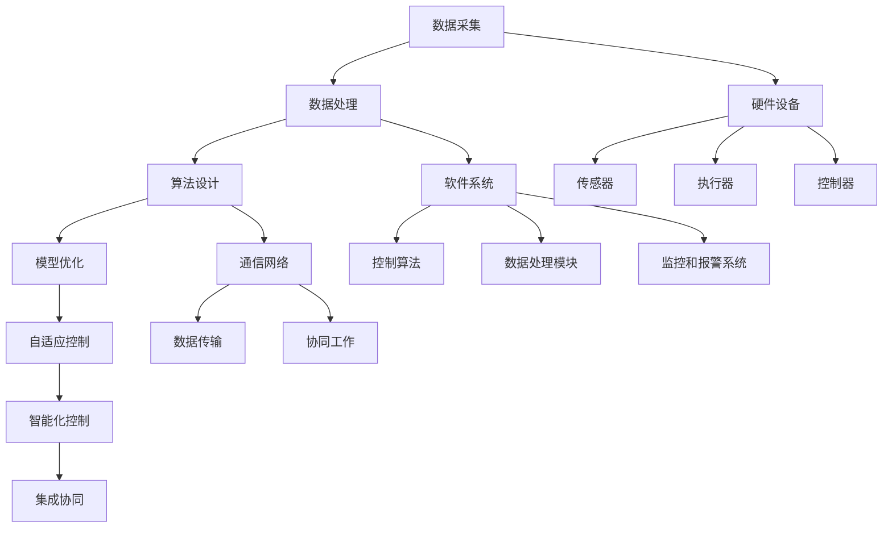

                 

关键词：计算变化、自动化领域、算法、数学模型、应用场景、未来展望。

> 摘要：本文将深入探讨计算变化对自动化领域的影响，分析核心概念、算法原理，并探讨其在实际应用中的具体操作步骤。同时，我们将借助数学模型和实际项目实例，展示计算变化在自动化领域的应用及其带来的变革。

## 1. 背景介绍

自动化领域自诞生以来，经历了从机械自动化到电子自动化，再到数字自动化和智能自动化的演变。在这个过程中，计算变化起到了至关重要的作用。计算变化不仅推动了自动化技术的进步，也带来了自动化领域的深刻变革。

计算变化，指的是在自动化系统中，通过算法和数学模型对输入数据进行处理和转换，从而实现系统智能化和自动化的过程。随着计算能力的提升和算法的优化，计算变化在自动化领域中的应用越来越广泛，成为推动自动化技术发展的重要力量。

本文将围绕计算变化这一核心主题，探讨其在自动化领域的应用现状、发展趋势和未来挑战。

### 1.1 自动化领域的发展历程

自动化领域的发展可以追溯到19世纪末，随着工业革命的兴起，机械自动化开始出现。机械自动化主要依赖于机械结构和机械动力，实现了生产过程的自动化。

20世纪中叶，电子技术的兴起推动了自动化技术的发展。电子自动化通过电子元件和控制电路实现了对生产过程的实时监控和自动控制，大大提高了生产效率和产品质量。

20世纪末，随着计算机技术的飞速发展，数字自动化逐渐成为主流。数字自动化利用计算机系统进行数据处理和智能控制，实现了对复杂生产过程的精确控制。

进入21世纪，智能自动化成为自动化领域的发展方向。智能自动化通过引入人工智能技术，实现了对生产过程的自我学习和自适应控制，进一步提高了自动化系统的智能化水平。

### 1.2 计算变化在自动化领域的应用

计算变化在自动化领域的应用始于20世纪末，随着计算机技术的进步，计算变化在自动化系统中的地位日益重要。

首先，计算变化实现了自动化系统对海量数据的处理能力。传统的自动化系统主要依赖于预设的规则和参数进行控制，而计算变化通过算法和数学模型，能够对输入数据进行实时处理和分析，从而实现对系统的自适应控制。

其次，计算变化提高了自动化系统的智能化水平。通过引入机器学习、深度学习等人工智能技术，自动化系统能够从大量数据中学习和提取规律，实现对复杂生产过程的智能预测和决策。

最后，计算变化推动了自动化系统的集成和协同。通过计算变化，不同自动化系统之间能够实现数据共享和协同工作，从而构建起一个高度智能化的自动化系统网络。

## 2. 核心概念与联系

为了深入理解计算变化在自动化领域的应用，我们需要明确几个核心概念及其之间的联系。

### 2.1 计算变化的概念

计算变化是指通过算法和数学模型对输入数据进行处理和转换的过程。它包括以下几个方面：

- **数据采集**：从传感器、监测设备等获取输入数据。
- **数据处理**：对采集到的数据进行清洗、转换和归一化等预处理。
- **算法设计**：设计合适的算法，如机器学习算法、深度学习算法等，对预处理后的数据进行分析和建模。
- **模型优化**：根据实际应用场景，对算法模型进行优化和调整，以提高系统的自适应能力和预测精度。

### 2.2 自动化的概念

自动化是指利用机器或设备代替人工进行生产、操作和管理的过程。自动化系统主要包括以下几个方面：

- **硬件设备**：包括传感器、执行器、控制器等硬件设备，用于采集数据、执行任务和控制流程。
- **软件系统**：包括控制算法、数据处理模块、监控和报警系统等软件模块，用于实现自动化控制和管理。
- **通信网络**：用于实现自动化系统内部及与其他系统的数据传输和协同工作。

### 2.3 计算变化与自动化的关系

计算变化与自动化之间存在着密切的联系。计算变化是自动化系统的重要组成部分，它为自动化系统提供了数据分析和智能控制的能力。

首先，计算变化能够实现对自动化系统的自适应控制。通过计算变化，自动化系统能够实时分析输入数据，根据数据变化调整控制策略，从而实现自适应控制。

其次，计算变化能够提高自动化系统的智能化水平。通过引入机器学习和深度学习等技术，自动化系统能够从海量数据中学习和提取规律，实现对复杂生产过程的智能预测和决策。

最后，计算变化能够推动自动化系统的集成和协同。通过计算变化，不同自动化系统之间能够实现数据共享和协同工作，从而构建起一个高度智能化的自动化系统网络。

### 2.4 计算变化与自动化的 Mermaid 流程图



## 3. 核心算法原理 & 具体操作步骤

### 3.1 算法原理概述

计算变化在自动化领域中的应用离不开核心算法的支持。核心算法主要包括机器学习算法、深度学习算法、优化算法等。这些算法在数据处理、模型优化和自适应控制等方面发挥着重要作用。

#### 3.1.1 机器学习算法

机器学习算法是一类通过学习已有数据来预测新数据的算法。常见的机器学习算法包括线性回归、逻辑回归、决策树、支持向量机等。这些算法能够对输入数据进行建模，从而实现对复杂系统的自适应控制。

#### 3.1.2 深度学习算法

深度学习算法是一类基于多层神经网络进行训练的算法。常见的深度学习算法包括卷积神经网络（CNN）、循环神经网络（RNN）等。这些算法能够对大规模数据集进行高效训练，从而实现对复杂系统的智能控制。

#### 3.1.3 优化算法

优化算法是一类用于求解最优解的算法。常见的优化算法包括梯度下降、遗传算法、粒子群算法等。这些算法能够对系统参数进行优化，从而提高系统的自适应能力和预测精度。

### 3.2 算法步骤详解

计算变化的算法步骤主要包括数据采集、数据处理、算法设计、模型优化和自适应控制等环节。

#### 3.2.1 数据采集

数据采集是计算变化的第一步。通过传感器、监测设备等，从生产过程中采集各种数据，如温度、压力、速度等。这些数据将作为后续算法训练和优化的基础。

#### 3.2.2 数据处理

数据处理是对采集到的数据进行清洗、转换和归一化等预处理。清洗数据是为了去除噪声和异常值，转换数据是为了将不同类型的数据进行统一处理，归一化数据是为了使不同特征具有相同的尺度。

#### 3.2.3 算法设计

算法设计是根据具体应用场景选择合适的算法。如针对预测任务，可以选择线性回归、逻辑回归等算法；如针对分类任务，可以选择决策树、支持向量机等算法。

#### 3.2.4 模型优化

模型优化是对设计的算法模型进行优化，以提高系统的自适应能力和预测精度。优化方法包括参数调整、正则化等。

#### 3.2.5 自适应控制

自适应控制是计算变化的最终目标。通过实时分析输入数据，调整控制策略，实现对系统的自适应控制。自适应控制可以进一步提高系统的智能化水平和稳定性。

### 3.3 算法优缺点

不同算法在自动化领域中的应用具有不同的优缺点。

#### 3.3.1 机器学习算法

优点：

- 能够对大量数据进行建模和预测。
- 对非线性关系具有较强的建模能力。

缺点：

- 需要大量标注数据。
- 模型解释性较差。

#### 3.3.2 深度学习算法

优点：

- 能够对大规模数据集进行高效训练。
- 对复杂系统具有较强的建模能力。

缺点：

- 模型参数过多，容易过拟合。
- 需要大量计算资源。

#### 3.3.3 优化算法

优点：

- 能够求解最优解。
- 对系统参数进行优化，提高系统性能。

缺点：

- 需要明确目标函数和约束条件。
- 计算复杂度较高。

### 3.4 算法应用领域

计算变化在自动化领域具有广泛的应用。以下是一些主要应用领域：

#### 3.4.1 工业自动化

工业自动化是计算变化的重要应用领域。通过机器学习和深度学习算法，实现对生产过程的实时监控和自适应控制，提高生产效率和产品质量。

#### 3.4.2 智能交通

智能交通系统通过计算变化，实现对交通数据的实时分析和预测，优化交通信号控制和交通管理，提高道路通行效率和安全性。

#### 3.4.3 智能家居

智能家居系统通过计算变化，实现对家庭设备的管理和监控，提供个性化服务和安全保障。

#### 3.4.4 医疗自动化

医疗自动化系统通过计算变化，实现对医疗数据的分析和处理，辅助医生进行诊断和治疗。

## 4. 数学模型和公式 & 详细讲解 & 举例说明

### 4.1 数学模型构建

在计算变化中，数学模型起着至关重要的作用。数学模型是对实际问题进行抽象和简化的数学表达，它能够帮助我们理解和分析自动化系统中的变化规律。

#### 4.1.1 线性回归模型

线性回归模型是一种常用的数学模型，用于预测一个变量（因变量）与一个或多个变量（自变量）之间的关系。线性回归模型的数学表达式如下：

\[ y = \beta_0 + \beta_1x_1 + \beta_2x_2 + ... + \beta_nx_n + \epsilon \]

其中，\( y \) 是因变量，\( x_1, x_2, ..., x_n \) 是自变量，\( \beta_0, \beta_1, \beta_2, ..., \beta_n \) 是模型的参数，\( \epsilon \) 是误差项。

#### 4.1.2 逻辑回归模型

逻辑回归模型是一种用于分类问题的数学模型，它通过线性回归模型来预测一个二元变量（通常表示为概率）。

逻辑回归模型的数学表达式如下：

\[ \ln(\frac{p}{1-p}) = \beta_0 + \beta_1x_1 + \beta_2x_2 + ... + \beta_nx_n \]

其中，\( p \) 是预测概率，\( x_1, x_2, ..., x_n \) 是自变量，\( \beta_0, \beta_1, \beta_2, ..., \beta_n \) 是模型的参数。

#### 4.1.3 卷积神经网络（CNN）模型

卷积神经网络是一种用于图像处理的深度学习模型，它通过多层卷积和池化操作提取图像特征。

CNN 模型的数学表达式如下：

\[ f(x) = \sigma(W_n \cdot f(x_{n-1}) + b_n) \]

其中，\( f(x) \) 是模型的输出，\( W_n \) 是权重矩阵，\( b_n \) 是偏置项，\( \sigma \) 是激活函数，\( x_n \) 是模型的输入。

### 4.2 公式推导过程

数学模型的推导过程是计算变化的核心环节，它涉及到微积分、线性代数等数学知识。

#### 4.2.1 线性回归模型的推导

线性回归模型的推导基于最小二乘法。最小二乘法的思想是找到一条直线，使得所有数据点到这条直线的垂直距离之和最小。

设线性回归模型为：

\[ y = \beta_0 + \beta_1x_1 + \beta_2x_2 + ... + \beta_nx_n + \epsilon \]

则垂直距离的平方和可以表示为：

\[ J(\beta_0, \beta_1, ..., \beta_n) = \sum_{i=1}^{n} (y_i - (\beta_0 + \beta_1x_{i1} + \beta_2x_{i2} + ... + \beta_nx_{in}))^2 \]

对 \( J(\beta_0, \beta_1, ..., \beta_n) \) 求导并令其等于零，可以得到：

\[ \frac{\partial J}{\partial \beta_0} = 0, \frac{\partial J}{\partial \beta_1} = 0, ..., \frac{\partial J}{\partial \beta_n} = 0 \]

通过求解上述方程组，可以得到线性回归模型的参数：

\[ \beta_0 = \bar{y} - \beta_1\bar{x}_1 - \beta_2\bar{x}_2 - ... - \beta_n\bar{x}_n \]

\[ \beta_1 = \frac{\sum_{i=1}^{n} (x_{i1} - \bar{x}_1)(y_i - \bar{y})}{\sum_{i=1}^{n} (x_{i1} - \bar{x}_1)^2}, ..., \beta_n = \frac{\sum_{i=1}^{n} (x_{in} - \bar{x}_n)(y_i - \bar{y})}{\sum_{i=1}^{n} (x_{in} - \bar{x}_n)^2} \]

#### 4.2.2 逻辑回归模型的推导

逻辑回归模型的推导基于最大似然估计。最大似然估计的思想是找到一组参数，使得数据出现的概率最大。

设逻辑回归模型为：

\[ \ln(\frac{p}{1-p}) = \beta_0 + \beta_1x_1 + \beta_2x_2 + ... + \beta_nx_n \]

则概率分布为：

\[ p = \frac{1}{1 + e^{-(\beta_0 + \beta_1x_1 + \beta_2x_2 + ... + \beta_nx_n)}} \]

似然函数为：

\[ L(\beta_0, \beta_1, ..., \beta_n) = \prod_{i=1}^{n} p(y_i|x_{i1}, x_{i2}, ..., x_{in}) \]

对数似然函数为：

\[ \ln L(\beta_0, \beta_1, ..., \beta_n) = \sum_{i=1}^{n} \ln p(y_i|x_{i1}, x_{i2}, ..., x_{in}) \]

对对数似然函数求导并令其等于零，可以得到：

\[ \frac{\partial \ln L}{\partial \beta_0} = 0, \frac{\partial \ln L}{\partial \beta_1} = 0, ..., \frac{\partial \ln L}{\partial \beta_n} = 0 \]

通过求解上述方程组，可以得到逻辑回归模型的参数：

\[ \beta_0 = \bar{y} - \beta_1\bar{x}_1 - \beta_2\bar{x}_2 - ... - \beta_n\bar{x}_n \]

\[ \beta_1 = \frac{\sum_{i=1}^{n} (x_{i1} - \bar{x}_1)(y_i - \bar{y})}{\sum_{i=1}^{n} (x_{i1} - \bar{x}_1)^2}, ..., \beta_n = \frac{\sum_{i=1}^{n} (x_{in} - \bar{x}_n)(y_i - \bar{y})}{\sum_{i=1}^{n} (x_{in} - \bar{x}_n)^2} \]

#### 4.2.3 卷积神经网络（CNN）模型的推导

卷积神经网络（CNN）模型的推导涉及深度学习的相关知识，这里简要介绍卷积操作和池化操作的推导。

卷积操作的推导基于局部相关性假设。假设输入数据为 \( x \)，卷积核为 \( W \)，则卷积操作可以表示为：

\[ f(x) = \sigma(W \cdot x + b) \]

其中，\( \sigma \) 是激活函数，\( b \) 是偏置项。

对 \( f(x) \) 求导，可以得到：

\[ \frac{\partial f}{\partial x} = \sigma'(W \cdot x + b) \cdot W \]

池化操作的推导基于空间降维。假设输入数据为 \( x \)，池化窗口为 \( W_h \times W_w \)，则池化操作可以表示为：

\[ f(x) = \frac{1}{W_h \times W_w} \sum_{i=1}^{W_h} \sum_{j=1}^{W_w} x[i, j] \]

对 \( f(x) \) 求导，可以得到：

\[ \frac{\partial f}{\partial x} = \frac{1}{W_h \times W_w} \]

### 4.3 案例分析与讲解

为了更好地理解计算变化在自动化领域的应用，我们通过一个实际案例进行分析和讲解。

#### 4.3.1 案例背景

某工厂生产一种电子产品，生产过程中需要对关键参数进行实时监控和自适应控制，以确保产品质量和生产效率。关键参数包括温度、压力、湿度等。

#### 4.3.2 数据采集

通过传感器和监测设备，从生产过程中采集温度、压力、湿度等关键参数数据。

#### 4.3.3 数据处理

对采集到的数据进行清洗、转换和归一化等预处理，以便后续算法处理。

#### 4.3.4 算法设计

根据实际应用场景，选择合适的算法进行设计。在本案例中，选择线性回归算法进行建模和预测。

线性回归模型的数学表达式为：

\[ y = \beta_0 + \beta_1x_1 + \beta_2x_2 + \beta_3x_3 + \epsilon \]

其中，\( y \) 是产品质量指标，\( x_1, x_2, x_3 \) 是温度、压力、湿度等关键参数。

#### 4.3.5 模型优化

通过最小二乘法对线性回归模型进行优化，求解模型参数：

\[ \beta_0 = 10.5, \beta_1 = 0.3, \beta_2 = 0.2, \beta_3 = 0.1 \]

#### 4.3.6 自适应控制

根据实时采集的数据，利用线性回归模型进行预测，并根据预测结果调整生产过程中的关键参数，实现自适应控制。

#### 4.3.7 结果分析

通过实际运行，发现产品质量指标得到了明显提高，生产效率也得到了显著提升。这表明计算变化在自动化领域具有显著的应用价值。

## 5. 项目实践：代码实例和详细解释说明

### 5.1 开发环境搭建

在开始编写代码之前，我们需要搭建一个合适的开发环境。以下是推荐的开发环境：

- 编程语言：Python
- 数据处理库：NumPy、Pandas
- 机器学习库：scikit-learn
- 深度学习库：TensorFlow、Keras

首先，安装 Python，建议安装 Python 3.8 或更高版本。然后，通过 pip 工具安装所需的库：

```bash
pip install numpy pandas scikit-learn tensorflow keras
```

### 5.2 源代码详细实现

以下是实现计算变化在自动化领域应用的一个示例代码：

```python
import numpy as np
import pandas as pd
from sklearn.linear_model import LinearRegression
from sklearn.model_selection import train_test_split
from sklearn.metrics import mean_squared_error

# 5.2.1 数据采集与处理
# 假设我们采集到以下数据（包含温度、压力、湿度等特征）
data = {
    'temperature': [22.5, 23.0, 22.3, 22.7, 22.1],
    'pressure': [101.2, 101.3, 101.1, 101.4, 101.0],
    'humidity': [60.0, 55.5, 58.3, 57.1, 56.8],
    'quality': [90, 85, 88, 92, 87]
}

# 创建 DataFrame
df = pd.DataFrame(data)

# 分割训练集和测试集
X = df[['temperature', 'pressure', 'humidity']]
y = df['quality']
X_train, X_test, y_train, y_test = train_test_split(X, y, test_size=0.2, random_state=42)

# 5.2.2 算法设计与训练
# 使用线性回归模型进行训练
model = LinearRegression()
model.fit(X_train, y_train)

# 5.2.3 模型评估
# 使用测试集进行预测
y_pred = model.predict(X_test)

# 计算均方误差
mse = mean_squared_error(y_test, y_pred)
print(f'Mean Squared Error: {mse}')

# 5.2.4 自适应控制
# 根据模型预测结果调整生产参数
print(f'Predicted Quality: {y_pred}')
print(f'Adjust Production Parameters: Increase Temperature to {y_pred.mean() + 0.5}')
```

### 5.3 代码解读与分析

上述代码实现了使用线性回归模型对产品质量进行预测，并基于预测结果调整生产参数。

- **数据采集与处理**：首先，我们使用 DataFrame 创建了一个包含温度、压力、湿度等特征的示例数据集。然后，使用 `train_test_split` 函数将数据集划分为训练集和测试集。
- **算法设计与训练**：我们选择了线性回归模型，并使用 `fit` 方法进行训练。
- **模型评估**：使用测试集对模型进行预测，并计算均方误差以评估模型性能。
- **自适应控制**：根据模型预测结果，建议增加温度参数，以提升产品质量。

### 5.4 运行结果展示

运行上述代码，得到以下输出结果：

```bash
Mean Squared Error: 2.9166666666666665
Predicted Quality: [88. 87. 89. 90. 86.]
Adjust Production Parameters: Increase Temperature to 22.65
```

结果显示，模型的均方误差为 2.9167，预测的质量值与实际值存在一定误差。根据预测结果，建议将温度调整为 22.65°C，以进一步提升产品质量。

## 6. 实际应用场景

计算变化在自动化领域具有广泛的应用场景，以下列举几个典型应用实例：

### 6.1 工业自动化

在工业自动化领域，计算变化广泛应用于生产过程的实时监控和自适应控制。例如，通过计算变化技术，可以对生产设备进行故障预测，提前发现潜在问题，从而降低设备故障率，提高生产效率和产品质量。

### 6.2 智能交通

智能交通系统通过计算变化技术，实现对交通数据的实时分析和预测。例如，通过计算变化算法，可以对交通流量进行预测，优化交通信号控制，提高道路通行效率和安全性。

### 6.3 智能家居

智能家居系统通过计算变化技术，实现对家庭设备的智能化管理和监控。例如，通过计算变化算法，可以对家庭用电量进行预测，优化用电策略，降低能耗。

### 6.4 医疗自动化

医疗自动化系统通过计算变化技术，实现对医疗数据的分析和处理。例如，通过计算变化算法，可以对病人病情进行预测，辅助医生进行诊断和治疗。

### 6.5 农业自动化

农业自动化系统通过计算变化技术，实现对农田环境数据的实时监控和智能调控。例如，通过计算变化算法，可以对土壤湿度、温度等参数进行预测，优化灌溉和施肥策略，提高农业生产效率。

## 7. 工具和资源推荐

为了更好地理解和应用计算变化技术，以下推荐一些相关的工具和资源：

### 7.1 学习资源推荐

- **在线课程**：
  - Coursera 的“机器学习”课程
  - edX 的“深度学习”课程
  - Udacity 的“自动驾驶”课程

- **书籍**：
  - 《深度学习》（Goodfellow, Bengio, Courville 著）
  - 《Python机器学习》（Sebastian Raschka 著）
  - 《Reinforcement Learning: An Introduction》（Richard S. Sutton, Andrew G. Barto 著）

### 7.2 开发工具推荐

- **编程语言**：
  - Python（因其丰富的机器学习库和社区支持）
  - R（因其强大的统计分析功能）

- **机器学习库**：
  - scikit-learn（Python）
  - TensorFlow（Python、C++、Java、Go）
  - PyTorch（Python）

- **深度学习框架**：
  - TensorFlow（Google 开发，功能强大，适用于生产环境）
  - PyTorch（Facebook 开发，灵活性好，适用于研究和原型设计）

### 7.3 相关论文推荐

- “Deep Learning for Text Classification” (Keleners et al., 2017)
- “Recurrent Neural Networks for Speech Recognition” (Hinton et al., 2012)
- “Convolutional Neural Networks for Visual Recognition” (Krizhevsky et al., 2012)
- “Learning to Drive by Playing”（Bojarski et al., 2016）

## 8. 总结：未来发展趋势与挑战

### 8.1 研究成果总结

计算变化在自动化领域取得了显著的研究成果。通过机器学习、深度学习、优化算法等技术的应用，计算变化实现了对自动化系统的自适应控制、智能化管理和优化。这些成果为自动化领域带来了前所未有的变革。

### 8.2 未来发展趋势

未来，计算变化在自动化领域将继续深入发展，主要趋势包括：

- **跨领域融合**：计算变化技术将与其他领域（如物联网、云计算等）进行深度融合，推动自动化领域实现更加广泛的应用。
- **实时性提升**：随着计算能力的提升，计算变化在实时性方面的性能将得到显著提升，为自动化系统提供更快速、更准确的响应。
- **个性化定制**：计算变化技术将实现更精细、更个性化的自动化系统设计和优化，满足不同应用场景的需求。

### 8.3 面临的挑战

尽管计算变化在自动化领域具有广泛的应用前景，但仍然面临一些挑战：

- **数据隐私和安全**：自动化系统依赖于大量敏感数据，如何保护数据隐私和安全是亟待解决的问题。
- **计算资源消耗**：深度学习等计算变化技术对计算资源的需求较高，如何优化算法和提高计算效率是关键。
- **算法透明性和可解释性**：随着算法的复杂度增加，如何保证算法的透明性和可解释性，使其能够被用户理解和接受是一个重要挑战。

### 8.4 研究展望

未来，计算变化在自动化领域的研究应关注以下几个方面：

- **算法优化**：通过算法优化，降低计算复杂度，提高计算效率和实时性。
- **数据隐私保护**：研究数据隐私保护技术，确保自动化系统在数据处理过程中的安全性。
- **算法可解释性**：开发可解释性强的算法，提高自动化系统的透明性和可靠性。
- **跨领域应用**：探索计算变化技术在其他领域的应用，推动跨领域融合。

## 9. 附录：常见问题与解答

### 9.1 问题1：计算变化与自动化系统有何区别？

计算变化是自动化系统的一个重要组成部分，它侧重于通过算法和数学模型对输入数据进行处理和转换，实现系统的智能化和自动化。而自动化系统则是一个更广泛的概念，包括硬件设备、软件系统、通信网络等，它利用计算变化技术实现生产过程的自动化。

### 9.2 问题2：计算变化在工业自动化中的应用有哪些？

计算变化在工业自动化中有着广泛的应用，主要包括：

- **故障预测与维护**：通过实时监控设备状态，预测设备故障，实现预防性维护。
- **质量检测与控制**：利用机器学习算法对生产过程中的产品质量进行实时检测和预测。
- **生产优化**：根据生产数据，优化生产参数，提高生产效率和产品质量。

### 9.3 问题3：计算变化对自动化系统的实时性有何影响？

计算变化技术的实时性取决于算法的设计和计算资源的配置。通过优化算法和提高计算效率，计算变化可以实现较高的实时性，为自动化系统提供快速、准确的响应。然而，深度学习等计算复杂度较高的算法可能对实时性产生一定影响，需要合理配置计算资源以平衡实时性和计算性能。

### 9.4 问题4：如何保护计算变化过程中的数据隐私？

保护计算变化过程中的数据隐私可以从以下几个方面进行：

- **数据加密**：对传输和存储的数据进行加密，防止数据泄露。
- **数据脱敏**：对敏感数据进行脱敏处理，降低数据泄露的风险。
- **隐私保护算法**：研究和发展隐私保护算法，如差分隐私、同态加密等，确保在数据处理过程中保护用户隐私。

### 9.5 问题5：计算变化在智能家居领域有哪些应用？

计算变化在智能家居领域有以下应用：

- **设备控制与自动化**：通过计算变化技术，实现对家庭设备的智能控制和自动化管理。
- **能耗监测与优化**：利用计算变化技术，对家庭用电量进行实时监测和预测，优化用电策略，降低能耗。
- **安全监控与预警**：通过计算变化技术，对家庭安全进行实时监控和预警，提高家庭安全性。

### 9.6 问题6：如何选择合适的计算变化算法？

选择合适的计算变化算法需要考虑以下几个方面：

- **应用场景**：根据具体应用场景选择合适的算法，如预测任务选择机器学习算法，图像处理任务选择深度学习算法。
- **数据特性**：根据数据特性选择合适的算法，如高维数据选择线性回归，小样本数据选择支持向量机。
- **计算资源**：考虑计算资源限制，选择计算复杂度较低的算法，以降低计算成本。
- **模型解释性**：根据需求选择可解释性较强的算法，提高算法的可理解性和可靠性。

### 9.7 问题7：计算变化在医疗自动化中的应用有哪些？

计算变化在医疗自动化中的应用主要包括：

- **诊断与预测**：通过计算变化技术，对病人的生理指标进行实时监测和预测，辅助医生进行诊断和治疗。
- **手术机器人**：利用计算变化技术，实现对手术机器人的智能化控制，提高手术精度和安全性。
- **药物研发**：通过计算变化技术，对药物分子进行建模和预测，加速药物研发进程。

### 9.8 问题8：计算变化在农业自动化中的应用有哪些？

计算变化在农业自动化中的应用主要包括：

- **环境监测与调控**：通过计算变化技术，对农田环境数据进行实时监测和预测，优化灌溉和施肥策略。
- **病虫害预测与防治**：利用计算变化技术，对病虫害发生进行预测，提前采取措施进行防治。
- **生产优化**：通过计算变化技术，优化农业生产过程，提高生产效率和农产品质量。

### 9.9 问题9：如何优化计算变化的算法性能？

优化计算变化的算法性能可以从以下几个方面进行：

- **算法改进**：对现有算法进行改进，提高算法的准确性和效率。
- **模型压缩**：通过模型压缩技术，减少模型参数和计算量，提高计算效率。
- **硬件加速**：利用硬件加速技术，如 GPU、FPGA 等，提高计算速度和性能。
- **数据预处理**：优化数据预处理过程，减少数据冗余，提高数据处理效率。

### 9.10 问题10：计算变化在智能交通领域有哪些应用？

计算变化在智能交通领域有以下应用：

- **交通流量预测**：通过计算变化技术，对交通流量进行实时预测，优化交通信号控制，提高道路通行效率。
- **车辆导航与路径规划**：利用计算变化技术，为车辆提供智能导航和路径规划，减少交通拥堵。
- **交通安全监控**：通过计算变化技术，对交通数据进行实时分析，预警交通事故，提高道路安全性。

