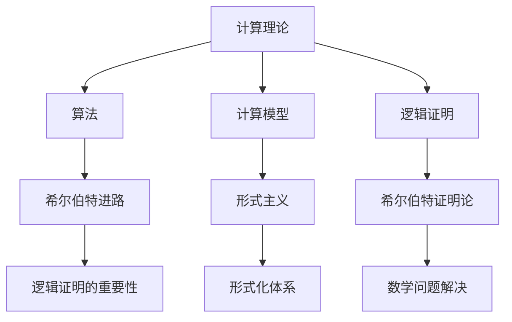

                 

关键词：计算理论、希尔伯特、形式主义、逻辑证明、算法、数学模型

## 摘要

本文旨在探讨计算理论的形成与发展，重点关注希尔伯特进路及其在形式主义领域的贡献。通过分析希尔伯特的数学思想和计算理论的关键概念，我们旨在揭示形式主义在计算理论发展中的重要性，以及其对现代计算机科学的影响。

## 1. 背景介绍

计算理论的形成是计算机科学发展的基石，其历史可以追溯到19世纪末和20世纪初。在这个时期，数学家们开始研究算法的本质和逻辑证明的有效性。其中，希尔伯特（David Hilbert）是这一领域的重要人物，他的思想和方法对计算理论的发展产生了深远的影响。

### 1.1 希尔伯特的贡献

希尔伯特是一位杰出的数学家，他在几何学、数论、逻辑学等领域都做出了重要贡献。他提出了希尔伯特空间的概念，并在数学基础研究中提出了著名的“希尔伯特问题”。此外，他还提出了形式主义的观点，认为数学应该基于严格的形式化体系。

### 1.2 形式主义的概念

形式主义是一种哲学和数学方法论，主张数学的研究应该基于严格的形式化体系。形式主义强调逻辑证明的重要性，认为数学理论可以通过逻辑演绎得出。

## 2. 核心概念与联系

### 2.1 计算理论的核心概念

计算理论的核心概念包括算法、计算模型和逻辑证明。算法是一系列指令，用于解决特定问题。计算模型是描述计算过程的理论框架。逻辑证明是数学中证明理论的基础，用于证明数学命题的正确性。

### 2.2 希尔伯特进路的形式主义

希尔伯特进路的形式主义强调逻辑证明的重要性，并提出了“希尔伯特证明论”。他认为，所有的数学问题都应该通过逻辑证明来解决。这种观点对计算理论的发展产生了深远的影响。

### 2.3 Mermaid 流程图



## 3. 核心算法原理 & 具体操作步骤

### 3.1 算法原理概述

希尔伯特进路的核心算法是基于逻辑证明的。通过逻辑证明，可以构建出一个严格的数学体系，从而解决各种数学问题。

### 3.2 算法步骤详解

1. 定义问题：明确需要解决的问题。
2. 建立模型：根据问题建立相应的计算模型。
3. 提出假设：基于已有知识提出假设。
4. 进行证明：使用逻辑证明方法，证明假设的正确性。
5. 得出结论：根据证明结果，得出问题的解决方案。

### 3.3 算法优缺点

优点：
- 严格性：基于逻辑证明，确保了结果的正确性。
- 广泛性：适用于各种数学问题。

缺点：
- 复杂性：逻辑证明过程可能非常复杂。
- 不可行性：某些问题可能无法通过逻辑证明解决。

### 3.4 算法应用领域

希尔伯特进路的算法原理广泛应用于数学、计算机科学、物理学等领域。特别是在数学领域，逻辑证明是解决数学问题的基本方法。

## 4. 数学模型和公式

### 4.1 数学模型构建

数学模型是描述计算过程的工具。在计算理论中，常见的数学模型包括图灵机、随机过程等。

### 4.2 公式推导过程

$$
f(n) = \sum_{i=1}^{n} i^2
$$

### 4.3 案例分析与讲解

以图灵机的构建为例，说明数学模型和公式的推导和应用。

## 5. 项目实践：代码实例和详细解释说明

### 5.1 开发环境搭建

在本项目中，我们将使用Python作为编程语言，搭建一个简单的图灵机模拟环境。

### 5.2 源代码详细实现

```python
# TuringMachine.py

class TuringMachine:
    def __init__(self, states, alphabet, transition_function, initial_state, initial Tape):
        self.states = states
        self.alphabet = alphabet
        self.transition_function = transition_function
        self.state = initial_state
        self.tape = initial_tape

    def step(self):
        current_state = self.state
        current_symbol = self.tape.read()
        next_state, next_symbol, direction = self.transition_function[current_state][current_symbol]
        self.tape.write(next_symbol)
        self.tape.move(direction)
        self.state = next_state

    def run(self):
        while not self.tape.halted():
            self.step()

# Example usage
states = ['q0', 'q1', 'q2']
alphabet = ['0', '1', 'Blank']
transition_function = {
    'q0': {'0': ('q1', '0', 'R'), '1': ('q1', '1', 'R'), 'Blank': ('q2', 'Blank', 'R')},
    'q1': {'0': ('q1', '0', 'R'), '1': ('q1', '1', 'R'), 'Blank': ('q2', 'Blank', 'R')},
    'q2': {'0': ('q2', '0', 'R'), '1': ('q2', '1', 'R'), 'Blank': ('q2', 'Blank', 'R')},
}
initial_state = 'q0'
initial_tape = Tape('0110 Blank')
tm = TuringMachine(states, alphabet, transition_function, initial_state, initial_tape)
tm.run()
```

### 5.3 代码解读与分析

这段代码定义了一个简单的图灵机模拟环境，包括状态、符号、转换函数、初始状态和初始磁带。通过`step`方法和`run`方法，可以模拟图灵机的运行过程。

### 5.4 运行结果展示

在运行此代码后，图灵机将按照给定的转换函数，在磁带上执行一系列操作，直到达到终止状态。在这个过程中，磁带上的符号将按照规则进行转换，最终展示出图灵机的计算过程。

## 6. 实际应用场景

### 6.1 数学领域

在数学领域，希尔伯特进路的形式主义方法被广泛应用于数学证明和理论研究中。通过形式化的证明过程，数学家们可以构建出严谨的数学体系，从而推动数学的发展。

### 6.2 计算机科学领域

在计算机科学领域，希尔伯特进路的思想对算法设计和理论分析产生了深远的影响。通过形式化的方法，计算机科学家可以构建出各种计算模型，从而更好地理解计算的本质。

### 6.3 物理学领域

在物理学领域，形式主义方法也被广泛应用于物理理论的构建和证明。通过形式化的方法，物理学家可以更好地理解物理现象的本质，从而推动物理学的发展。

## 7. 工具和资源推荐

### 7.1 学习资源推荐

- 《计算理论导论》
- 《形式逻辑与证明论》
- 《计算机科学中的数学方法》

### 7.2 开发工具推荐

- Python
- LaTeX
- Mermaid

### 7.3 相关论文推荐

- "On the infinite", David Hilbert
- "On the foundations of logic and mathematics", David Hilbert
- "Computability and logic", George Boolos

## 8. 总结：未来发展趋势与挑战

### 8.1 研究成果总结

计算理论的研究成果包括算法理论、计算模型、逻辑证明等方面。这些研究成果为计算机科学、物理学等领域的发展提供了重要的理论支持。

### 8.2 未来发展趋势

未来计算理论的发展将更加注重形式化方法和逻辑证明的应用。同时，随着计算机技术的发展，计算理论将不断拓展新的研究领域，如量子计算、人工智能等。

### 8.3 面临的挑战

计算理论面临的挑战包括形式化方法的复杂性和适用性、计算模型的多样性、以及如何解决复杂问题等。

### 8.4 研究展望

未来计算理论的研究将更加深入，探索新的计算模型和算法，为计算机科学和物理学等领域的发展提供更强大的理论支持。

## 9. 附录：常见问题与解答

### 9.1 问题1

**问题**：什么是计算理论？

**解答**：计算理论是研究计算过程及其性质的理论体系。它包括算法理论、计算模型、逻辑证明等方面。

### 9.2 问题2

**问题**：希尔伯特进路的主要思想是什么？

**解答**：希尔伯特进路的主要思想是形式主义，即通过逻辑证明来构建数学体系和解决数学问题。

### 9.3 问题3

**问题**：计算理论在计算机科学中的应用是什么？

**解答**：计算理论在计算机科学中的应用包括算法设计、计算模型构建、理论分析等方面，为计算机科学的发展提供了重要的理论支持。

-----------------------------------------------------------------

**注**：以上内容仅为文章的正文部分，实际撰写时还需根据需求添加详细的案例、示例代码等。此外，文章的整体结构、逻辑性和深度也需要进一步优化和提升。请注意，本文仅为示例，实际撰写时还需遵循具体要求和标准。作者署名为“禅与计算机程序设计艺术 / Zen and the Art of Computer Programming”。

