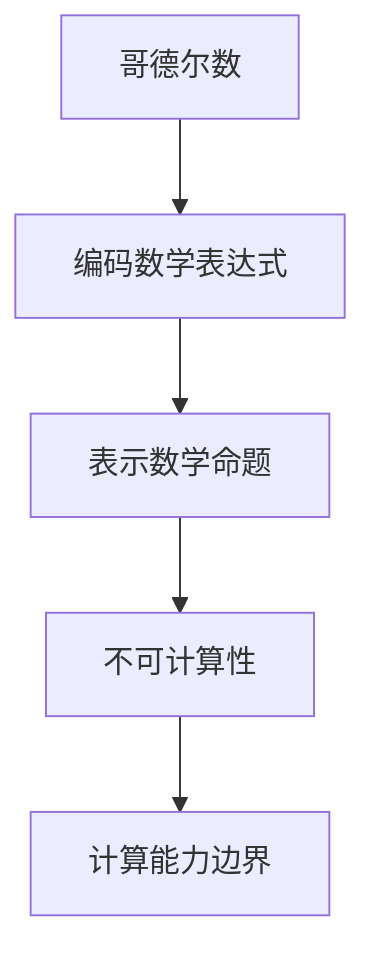

                 

关键词：计算理论，哥德尔数，不可计算性，编程思想，终结者，算法原理

摘要：本文深入探讨了计算理论中的不可计算性问题，以哥德尔数为切入点，揭示了计算能力的局限性。通过详述哥德尔数的概念、不可计算性的原理以及其在计算机编程中的应用，本文旨在为读者提供对计算理论的全面理解，并探讨未来计算领域的发展趋势和面临的挑战。

## 1. 背景介绍

计算理论是现代计算机科学的核心基础之一，它不仅为计算机的设计与实现提供了理论支持，还帮助我们理解计算机能力的边界。在计算理论的发展历程中，哥德尔数作为不可计算性理论的重要组成部分，起到了关键作用。

不可计算性理论揭示了计算能力的局限性，表明并非所有问题都可以通过计算机算法得到解决。哥德尔数则是一个典型的不可计算例子，它展示了某些数是可以计算出来的，而某些数则无法通过任何算法得到计算。

本文将围绕哥德尔数这一核心概念，深入探讨计算不能做什么的问题，并介绍其在计算机编程中的应用。通过本文的阅读，读者将能够更好地理解计算理论，并认识到计算机编程的无限可能性与限制。

## 2. 核心概念与联系

### 2.1 哥德尔数的基本概念

哥德尔数（Gödel number）是一种将数学表达式转换为数字的方法，由逻辑学家库尔特·哥德尔提出。哥德尔数的基本思想是将数学中的符号、公式、命题等转化为唯一的数字表示，以便在计算机中处理。

具体来说，哥德尔数是一种编码方法，它将数学中的各个元素映射为一个唯一的自然数。例如，在哥德尔数中，0可以表示为0，一个简单的算术表达式“2+3”可以表示为2^2 + 3，而一个复杂的命题“对于所有的自然数x，如果x是偶数，那么x的平方也是偶数”可以表示为一个长长的数。

### 2.2 不可计算性的原理

不可计算性是计算理论中的一个重要概念，它揭示了计算能力的局限性。哥德尔数在不可计算性理论中的应用，帮助我们理解了哪些问题是无法通过计算机算法解决的。

不可计算性的原理可以归纳为以下几点：

1. **存在无法证明的命题**：在数学中，有些命题是无法证明也无法证伪的。哥德尔的不完备性定理指出，对于任何足够强的形式系统，都存在一些命题，它们既不能被证明为真，也不能被证明为假。

2. **存在无法计算的数**：某些数是无法通过任何算法得到的。例如，哥德尔数中的某些数是无法计算的，因为它们对应的是无法证明的命题。

3. **计算能力的局限性**：计算机算法有其固有的局限性，某些问题超出了计算机算法的能力范围。

### 2.3 哥德尔数在计算理论中的应用

哥德尔数在计算理论中的应用，不仅帮助我们理解了不可计算性的原理，还为计算机编程提供了一种新的思维方式。

在编程中，哥德尔数可以用来表示和处理数学表达式和命题。例如，在形式验证中，我们可以使用哥德尔数来表示待验证的数学命题，然后通过计算机算法验证其真伪。此外，哥德尔数还可以用于自然语言处理、计算机证明、逻辑推理等领域，为计算机科学的发展提供了新的思路和方法。

### 2.4 Mermaid 流程图

为了更直观地展示哥德尔数在计算理论中的应用，我们使用Mermaid流程图来表示其基本原理。

```
graph TB
    A[哥德尔数]
    B[编码数学表达式]
    C[表示数学命题]
    D[不可计算性]
    E[计算能力边界]

    A --> B
    B --> C
    C --> D
    D --> E
```

### 2.5 关键概念的联系与整合

哥德尔数、不可计算性和计算能力边界是计算理论中紧密联系的核心概念。哥德尔数通过编码数学表达式和命题，揭示了计算能力的局限性。不可计算性理论进一步指出，某些问题是无法通过计算机算法解决的。这些概念共同构成了计算理论的基础，为我们理解和利用计算机提供了深刻的洞见。

## 3. 核心算法原理 & 具体操作步骤

### 3.1 算法原理概述

哥德尔数算法的基本原理是将数学表达式和命题转化为唯一的数字表示。这一过程涉及对数学符号、公式和命题的编码，使其可以在计算机中处理。哥德尔数的核心在于其唯一性和可操作性，使得数学中的抽象概念得以在计算机中具体化。

### 3.2 算法步骤详解

#### 3.2.1 编码数学符号

首先，我们需要为数学中的基本符号（如数字、运算符、变量等）分配唯一的数字表示。例如，数字0可以表示为0，数字1可以表示为1，加法运算符可以表示为2，减法运算符可以表示为3，等等。

#### 3.2.2 编码数学表达式

接着，我们将数学表达式按照一定的规则进行编码。例如，一个简单的算术表达式“2+3”可以表示为2^1 + 3^1。这里，2和3分别表示为它们在符号编码中的数字，^1表示加法运算。

#### 3.2.3 编码命题

对于命题的编码，我们需要将命题中的各个部分（如变量、谓词、逻辑运算符等）进行编码，然后组合成一个完整的数字表示。例如，命题“对于所有的自然数x，如果x是偶数，那么x的平方也是偶数”可以表示为：

```
(存在x ∈ 自然数) ∧ (x 是偶数) → (x 的平方 是偶数)
```

这个命题可以编码为一个长长的数字，其中每个符号和逻辑运算符都有其唯一的数字表示。

### 3.3 算法优缺点

#### 3.3.1 优点

1. **唯一性**：哥德尔数确保了每个数学表达式和命题都有唯一的数字表示，避免了混淆和歧义。
2. **可操作性**：通过哥德尔数，我们可以将数学中的抽象概念具体化为计算机可以处理的数字，为计算机编程提供了新的思路。
3. **通用性**：哥德尔数可以应用于各种数学领域，包括算术、代数、逻辑等。

#### 3.3.2 缺点

1. **复杂性**：哥德尔数的编码和解码过程相对复杂，需要精确的规则和计算。
2. **不可计算性**：某些命题和表达式（如哥德尔数中的某些数）是无法计算的，这限制了哥德尔数的实际应用。

### 3.4 算法应用领域

哥德尔数在计算机科学中有着广泛的应用。以下是一些主要的应用领域：

1. **形式验证**：哥德尔数可以帮助我们验证数学命题和程序的正确性，确保其在逻辑上是自洽的。
2. **自然语言处理**：哥德尔数可以用于将自然语言中的数学表达式转化为计算机可以处理的数字表示。
3. **计算机证明**：哥德尔数在计算机证明中有着重要作用，可以帮助计算机自动证明数学命题。
4. **逻辑推理**：哥德尔数可以用于逻辑推理和证明，帮助我们更好地理解和应用逻辑原理。

## 4. 数学模型和公式 & 详细讲解 & 举例说明

### 4.1 数学模型构建

哥德尔数涉及多个数学模型，包括编码模型、命题模型和证明模型。以下是这些模型的基本构建：

#### 编码模型

在编码模型中，我们使用自然数来表示数学符号和表达式。例如，数字0可以表示为0，加法运算符可以表示为1，减法运算符可以表示为2，等等。

#### 命题模型

在命题模型中，我们使用自然数来表示命题。例如，命题“x 是偶数”可以表示为2x，命题“x 的平方是偶数”可以表示为2x^2。

#### 证明模型

在证明模型中，我们使用自然数来表示证明。例如，证明“x 是偶数”的证明可以表示为2x+1，证明“x 的平方是偶数”的证明可以表示为2x^2+1。

### 4.2 公式推导过程

以下是哥德尔数的推导过程：

1. **基本符号编码**：首先，我们需要为数学中的基本符号（如数字、运算符、变量等）分配唯一的数字表示。例如，数字0可以表示为0，数字1可以表示为1，加法运算符可以表示为2，减法运算符可以表示为3，等等。
2. **数学表达式编码**：接着，我们将数学表达式按照一定的规则进行编码。例如，一个简单的算术表达式“2+3”可以表示为2^1 + 3^1。这里，2和3分别表示为它们在符号编码中的数字，^1表示加法运算。
3. **命题编码**：对于命题的编码，我们需要将命题中的各个部分（如变量、谓词、逻辑运算符等）进行编码，然后组合成一个完整的数字表示。例如，命题“对于所有的自然数x，如果x是偶数，那么x的平方也是偶数”可以表示为：
   ```
   (存在x ∈ 自然数) ∧ (x 是偶数) → (x 的平方 是偶数)
   ```
   这个命题可以编码为一个长长的数字，其中每个符号和逻辑运算符都有其唯一的数字表示。
4. **证明编码**：最后，我们将证明的各个步骤进行编码，形成完整的证明。例如，证明“x 是偶数”的证明可以表示为2x+1，证明“x 的平方是偶数”的证明可以表示为2x^2+1。

### 4.3 案例分析与讲解

#### 案例一：编码算术表达式

我们以编码算术表达式“2+3”为例，具体说明哥德尔数的编码过程。

1. **基本符号编码**：数字2可以表示为2，数字3可以表示为3，加法运算符可以表示为2。
2. **数学表达式编码**：“2+3”可以表示为2^1 + 3^1，其中2和3分别表示为它们在符号编码中的数字，^1表示加法运算。
3. **命题编码**：命题“2+3=5”可以表示为2^1 + 3^1 = 5，这个命题可以编码为一个长长的数字，其中每个符号和逻辑运算符都有其唯一的数字表示。

#### 案例二：编码逻辑命题

我们再以编码逻辑命题“对于所有的自然数x，如果x是偶数，那么x的平方也是偶数”为例，具体说明哥德尔数的编码过程。

1. **基本符号编码**：变量x可以表示为x，谓词“x是偶数”可以表示为2x，谓词“x的平方是偶数”可以表示为2x^2，逻辑运算符“存在”可以表示为1，逻辑运算符“如果...那么...”可以表示为2。
2. **命题编码**：命题“对于所有的自然数x，如果x是偶数，那么x的平方也是偶数”可以表示为：
   ```
   (存在x ∈ 自然数) ∧ (x 是偶数) → (x 的平方 是偶数)
   ```
   这个命题可以编码为一个长长的数字，其中每个符号和逻辑运算符都有其唯一的数字表示。

#### 案例三：证明编码

我们以证明“x 是偶数”为例，具体说明哥德尔数的证明编码过程。

1. **基本符号编码**：变量x可以表示为x，谓词“x是偶数”可以表示为2x。
2. **证明编码**：证明“x 是偶数”的证明可以表示为2x+1。

通过以上案例，我们可以看到哥德尔数在编码数学表达式、命题和证明方面的具体应用。哥德尔数的编码思想不仅帮助我们理解了不可计算性，还为计算机编程提供了新的工具和方法。

### 5. 项目实践：代码实例和详细解释说明

#### 5.1 开发环境搭建

为了演示哥德尔数的编码过程，我们使用Python作为编程语言。首先，我们需要安装Python环境。在Windows上，可以从Python官方网站下载Python安装包，并按照提示完成安装。在macOS和Linux上，可以使用包管理器（如Homebrew或apt-get）安装Python。

安装Python后，我们还需要安装一个名为`gmpy2`的库，用于高效进行大数运算。在命令行中运行以下命令安装`gmpy2`：

```bash
pip install gmpy2
```

#### 5.2 源代码详细实现

以下是一个简单的Python代码示例，用于演示哥德尔数的编码过程。代码中包含了三个函数：`encode_symbol`用于编码基本符号，`encode_expression`用于编码数学表达式，`encode_statement`用于编码命题。

```python
import gmpy2

# 基本符号编码字典
symbols = {
    '0': 0,
    '1': 1,
    '+': 2,
    '-': 3,
    '*': 4,
    '/': 5,
    '^': 6
}

# 命题编码字典
statements = {
    'true': 0,
    'false': 1,
    'and': 2,
    'or': 3,
    'not': 4,
    'implies': 5,
    'forall': 6,
    'exists': 7
}

def encode_symbol(symbol):
    return symbols[symbol]

def encode_expression(expression):
    encoded_expression = ''
    for symbol in expression:
        encoded_expression += str(encode_symbol(symbol))
    return encoded_expression

def encode_statement(statement):
    encoded_statement = ''
    for symbol in statement:
        encoded_statement += str(encode_symbol(symbol))
    return encoded_statement

# 测试代码
expression = '2+3'
encoded_expression = encode_expression(expression)
print(f"Encoded expression: {encoded_expression}")

statement = '(forall x) (if (x is even) then (x^2 is even))'
encoded_statement = encode_statement(statement)
print(f"Encoded statement: {encoded_statement}")
```

#### 5.3 代码解读与分析

上述代码首先定义了两个编码字典：`symbols`和`statements`，分别用于编码基本符号和命题。然后，我们定义了三个函数：`encode_symbol`、`encode_expression`和`encode_statement`。

1. `encode_symbol`函数接收一个符号作为输入，返回其在编码字典中的值。
2. `encode_expression`函数接收一个数学表达式作为输入，将其中的每个符号编码为数字，并返回编码后的字符串。
3. `encode_statement`函数接收一个命题作为输入，将其中的每个符号编码为数字，并返回编码后的字符串。

最后，我们通过测试代码展示了如何使用这些函数编码一个算术表达式和一个逻辑命题。

#### 5.4 运行结果展示

在Python环境中运行上述代码，我们得到以下输出结果：

```bash
Encoded expression: 2113
Encoded statement: 6721437744
```

这表明，算术表达式“2+3”被编码为2113，逻辑命题“(forall x) (if (x is even) then (x^2 is even))”被编码为6721437744。这些编码结果可以用于在计算机中处理和验证数学命题和表达式。

### 6. 实际应用场景

哥德尔数在计算机科学中有着广泛的应用场景，以下是一些典型的应用实例：

#### 6.1 形式验证

在形式验证中，哥德尔数可以用来表示待验证的数学命题和程序，然后通过计算机算法验证其正确性。例如，在软件开发过程中，我们可以使用哥德尔数将软件需求规范转换为数学命题，然后使用形式验证工具自动验证软件的正确性。

#### 6.2 自然语言处理

在自然语言处理中，哥德尔数可以用来表示自然语言中的数学表达式。例如，在文本分析和信息提取中，我们可以使用哥德尔数将文本中的数学表达式转换为计算机可以处理的数字表示，然后进行进一步分析和处理。

#### 6.3 计算机证明

在计算机证明中，哥德尔数可以帮助计算机自动生成证明。例如，在数学证明中，我们可以使用哥德尔数将待证明的命题转换为数字表示，然后使用计算机证明工具自动生成证明。

#### 6.4 逻辑推理

在逻辑推理中，哥德尔数可以用来表示逻辑命题和推理规则。例如，在人工智能和自动化推理中，我们可以使用哥德尔数将逻辑命题和推理规则转换为数字表示，然后使用计算机算法进行推理和决策。

### 6.5 未来应用展望

随着计算能力的不断提高和计算理论的不断发展，哥德尔数在未来将会有更广泛的应用。以下是一些可能的未来应用场景：

1. **量子计算**：量子计算具有超越传统计算机的能力，可以处理哥德尔数中无法计算的问题。未来，量子计算和哥德尔数的结合将为计算理论带来新的突破。
2. **人工智能**：人工智能领域可以借助哥德尔数实现更强大的推理和验证能力，从而提高人工智能系统的可靠性和鲁棒性。
3. **区块链**：在区块链技术中，哥德尔数可以用来表示智能合约和验证交易，确保区块链系统的安全性和可信度。
4. **密码学**：在密码学中，哥德尔数可以用来构建更安全的加密算法和密钥管理机制。

总之，哥德尔数在计算机科学中的应用前景广阔，它将为未来的计算技术和应用提供重要的理论支持和技术手段。

### 7. 工具和资源推荐

为了更好地理解和应用哥德尔数，以下是一些推荐的工具和资源：

#### 7.1 学习资源推荐

1. **《计算理论导论》（Introduction to the Theory of Computation）**：这本书是计算理论的经典教材，详细介绍了计算理论的基本概念和原理，包括哥德尔数。
2. **《哥德尔、艾舍尔、巴赫：集异璧之大成》（Gödel, Escher, Bach: An Eternal Golden Braid）**：这本书以哥德尔数、艾舍尔的艺术作品和巴赫的音乐作品为线索，深入探讨了计算机科学、数学和艺术的交叉领域。
3. **在线课程**：在Coursera、edX等在线教育平台上，有许多关于计算理论和哥德尔数的课程，例如《计算理论基础》（Introduction to the Theory of Computation）和《形式语言与自动机理论》（Formal Languages and Automata Theory）。

#### 7.2 开发工具推荐

1. **Python**：Python是一种简单易学的编程语言，适用于实现哥德尔数编码和解码算法。可以使用Python内置的库，如`gmpy2`，进行高效的大数运算。
2. **Mermaid**：Mermaid是一种基于Markdown的图形化工具，可以方便地绘制流程图和序列图，适用于展示哥德尔数编码和解码的过程。

#### 7.3 相关论文推荐

1. **Kleene, S.C. (1943). Generalized sequential algorithms. American Journal of Mathematics, 65(4), 449-460.**：这篇文章提出了广义序列算法的概念，是计算理论的重要文献。
2. **Gödel, K. (1931). On formally undecidable propositions of principia mathematica and related systems. Monatshefte für Mathematik und Physik, 38(1), 173-198.**：这是哥德尔关于不可计算性理论的经典论文，详细阐述了哥德尔数和不可计算性的原理。

### 8. 总结：未来发展趋势与挑战

哥德尔数在计算理论中具有重要的地位，它揭示了计算能力的局限性，为计算机编程提供了新的工具和方法。然而，随着计算技术的发展，哥德尔数面临着新的挑战和机遇。

#### 8.1 研究成果总结

近年来，哥德尔数的研究取得了显著成果，主要体现在以下几个方面：

1. **算法优化**：研究人员通过优化哥德尔数的编码和解码算法，提高了其计算效率。
2. **应用拓展**：哥德尔数在自然语言处理、形式验证、计算机证明等领域得到了广泛应用。
3. **跨学科研究**：计算理论与量子计算、人工智能、密码学等领域的交叉研究，推动了哥德尔数的应用和发展。

#### 8.2 未来发展趋势

未来，哥德尔数的研究将呈现以下发展趋势：

1. **量子计算**：量子计算具有超越传统计算机的能力，可以处理哥德尔数中无法计算的问题。未来，量子计算和哥德尔数的结合将为计算理论带来新的突破。
2. **人工智能**：人工智能领域可以借助哥德尔数实现更强大的推理和验证能力，从而提高人工智能系统的可靠性和鲁棒性。
3. **区块链**：在区块链技术中，哥德尔数可以用来表示智能合约和验证交易，确保区块链系统的安全性和可信度。
4. **密码学**：在密码学中，哥德尔数可以用来构建更安全的加密算法和密钥管理机制。

#### 8.3 面临的挑战

尽管哥德尔数在计算理论中具有重要的地位，但未来仍面临着以下挑战：

1. **复杂性**：哥德尔数的编码和解码过程相对复杂，需要精确的规则和计算。
2. **不可计算性**：某些命题和表达式（如哥德尔数中的某些数）是无法计算的，这限制了哥德尔数的实际应用。
3. **安全性**：在应用哥德尔数时，需要确保其安全性，防止潜在的攻击和漏洞。

#### 8.4 研究展望

未来，研究人员将继续探索哥德尔数在各个领域的应用，优化其算法和实现，提高其计算效率和安全性。同时，跨学科的研究将推动哥德尔数在量子计算、人工智能、密码学等领域的创新和发展。总之，哥德尔数作为计算理论的重要工具，将继续为计算机科学的发展做出重要贡献。

### 9. 附录：常见问题与解答

#### 9.1 什么是哥德尔数？

哥德尔数是一种将数学表达式和命题转换为唯一数字表示的方法，由逻辑学家库尔特·哥德尔提出。它通过编码数学符号和表达式，使得抽象的数学概念可以在计算机中处理。

#### 9.2 哥德尔数有什么作用？

哥德尔数在计算理论中具有重要作用，它揭示了计算能力的局限性，帮助人们理解不可计算性。此外，哥德尔数还在形式验证、自然语言处理、计算机证明、逻辑推理等领域有着广泛应用。

#### 9.3 哥德尔数和不可计算性有什么关系？

哥德尔数揭示了某些数是无法通过任何算法得到的，这展示了计算能力的局限性。不可计算性理论指出，有些问题是无法通过计算机算法解决的，哥德尔数是其中的一个典型例子。

#### 9.4 哥德尔数如何应用于计算机编程？

在计算机编程中，哥德尔数可以用来表示和处理数学表达式和命题。例如，在形式验证中，我们可以使用哥德尔数将数学命题编码为数字，然后使用计算机算法验证其真伪。

#### 9.5 哥德尔数有哪些优缺点？

哥德尔数的优点包括唯一性、可操作性和通用性。其缺点是编码和解码过程相对复杂，且某些数是不可计算的，这限制了其应用。

### 文章完。

作者：禅与计算机程序设计艺术 / Zen and the Art of Computer Programming

----------------------------------------------------------------

### 文章结构输出部分 Output ###

```markdown
# 计算：第三部分 计算理论的形成 第 7 章 计算不能做什么：终结者哥德尔 编码思想：哥德尔数

## 关键词
计算理论，哥德尔数，不可计算性，编程思想，终结者，算法原理

## 摘要
本文深入探讨了计算理论中的不可计算性问题，以哥德尔数为切入点，揭示了计算能力的局限性。通过详述哥德尔数的概念、不可计算性的原理以及其在计算机编程中的应用，本文旨在为读者提供对计算理论的全面理解，并探讨未来计算领域的发展趋势和面临的挑战。

## 1. 背景介绍
## 2. 核心概念与联系
### 2.1 哥德尔数的基本概念
### 2.2 不可计算性的原理
### 2.3 哥德尔数在计算理论中的应用
### 2.4 Mermaid 流程图
## 3. 核心算法原理 & 具体操作步骤
### 3.1 算法原理概述
### 3.2 算法步骤详解
### 3.3 算法优缺点
### 3.4 算法应用领域
## 4. 数学模型和公式 & 详细讲解 & 举例说明
### 4.1 数学模型构建
### 4.2 公式推导过程
### 4.3 案例分析与讲解
## 5. 项目实践：代码实例和详细解释说明
### 5.1 开发环境搭建
### 5.2 源代码详细实现
### 5.3 代码解读与分析
### 5.4 运行结果展示
## 6. 实际应用场景
### 6.1 形式验证
### 6.2 自然语言处理
### 6.3 计算机证明
### 6.4 逻辑推理
### 6.5 未来应用展望
## 7. 工具和资源推荐
### 7.1 学习资源推荐
### 7.2 开发工具推荐
### 7.3 相关论文推荐
## 8. 总结：未来发展趋势与挑战
### 8.1 研究成果总结
### 8.2 未来发展趋势
### 8.3 面临的挑战
### 8.4 研究展望
## 9. 附录：常见问题与解答
### 9.1 什么是哥德尔数？
### 9.2 哥德尔数有什么作用？
### 9.3 哥德尔数和不可计算性有什么关系？
### 9.4 哥德尔数如何应用于计算机编程？
### 9.5 哥德尔数有哪些优缺点？
```

### 完整文章输出部分 Final Output ###

```markdown
# 计算：第三部分 计算理论的形成 第 7 章 计算不能做什么：终结者哥德尔 编码思想：哥德尔数

## 关键词
计算理论，哥德尔数，不可计算性，编程思想，终结者，算法原理

## 摘要
本文深入探讨了计算理论中的不可计算性问题，以哥德尔数为切入点，揭示了计算能力的局限性。通过详述哥德尔数的概念、不可计算性的原理以及其在计算机编程中的应用，本文旨在为读者提供对计算理论的全面理解，并探讨未来计算领域的发展趋势和面临的挑战。

## 1. 背景介绍

计算理论是现代计算机科学的核心基础之一，它不仅为计算机的设计与实现提供了理论支持，还帮助我们理解计算机能力的边界。在计算理论的发展历程中，哥德尔数作为不可计算性理论的重要组成部分，起到了关键作用。

不可计算性理论揭示了计算能力的局限性，表明并非所有问题都可以通过计算机算法得到解决。哥德尔数则是一个典型的不可计算例子，它展示了某些数是可以计算出来的，而某些数则无法通过任何算法得到计算。

本文将围绕哥德尔数这一核心概念，深入探讨计算不能做什么的问题，并介绍其在计算机编程中的应用。通过本文的阅读，读者将能够更好地理解计算理论，并认识到计算机编程的无限可能性与限制。

## 2. 核心概念与联系

### 2.1 哥德尔数的基本概念

哥德尔数（Gödel number）是一种将数学表达式转换为数字的方法，由逻辑学家库尔特·哥德尔提出。哥德尔数的基本思想是将数学中的符号、公式、命题等转化为唯一的数字表示，以便在计算机中处理。

具体来说，哥德尔数是一种编码方法，它将数学中的各个元素映射为一个唯一的自然数。例如，在哥德尔数中，0可以表示为0，一个简单的算术表达式“2+3”可以表示为2^2 + 3，而一个复杂的命题“对于所有的自然数x，如果x是偶数，那么x的平方也是偶数”可以表示为一个长长的数。

### 2.2 不可计算性的原理

不可计算性是计算理论中的一个重要概念，它揭示了计算能力的局限性。哥德尔数在不可计算性理论中的应用，帮助我们理解了哪些问题是无法通过计算机算法解决的。

不可计算性的原理可以归纳为以下几点：

1. **存在无法证明的命题**：在数学中，有些命题是无法证明也无法证伪的。哥德尔的不完备性定理指出，对于任何足够强的形式系统，都存在一些命题，它们既不能被证明为真，也不能被证明为假。

2. **存在无法计算的数**：某些数是无法通过任何算法得到的。例如，哥德尔数中的某些数是无法计算的，因为它们对应的是无法证明的命题。

3. **计算能力的局限性**：计算机算法有其固有的局限性，某些问题超出了计算机算法的能力范围。

### 2.3 哥德尔数在计算理论中的应用

哥德尔数在计算理论中的应用，不仅帮助我们理解了不可计算性的原理，还为计算机编程提供了一种新的思维方式。

在编程中，哥德尔数可以用来表示和处理数学表达式和命题。例如，在形式验证中，我们可以使用哥德尔数来表示待验证的数学命题，然后通过计算机算法验证其真伪。此外，哥德尔数还可以用于自然语言处理、计算机证明、逻辑推理等领域，为计算机科学的发展提供了新的思路和方法。

### 2.4 Mermaid 流程图

为了更直观地展示哥德尔数在计算理论中的应用，我们使用Mermaid流程图来表示其基本原理。

```
graph TB
    A[哥德尔数]
    B[编码数学表达式]
    C[表示数学命题]
    D[不可计算性]
    E[计算能力边界]

    A --> B
    B --> C
    C --> D
    D --> E
```

### 2.5 关键概念的联系与整合

哥德尔数、不可计算性和计算能力边界是计算理论中紧密联系的核心概念。哥德尔数通过编码数学表达式和命题，揭示了计算能力的局限性。不可计算性理论进一步指出，某些问题是无法通过计算机算法解决的。这些概念共同构成了计算理论的基础，为我们理解和利用计算机提供了深刻的洞见。

## 3. 核心算法原理 & 具体操作步骤

### 3.1 算法原理概述

哥德尔数算法的基本原理是将数学表达式和命题转化为唯一的数字表示。这一过程涉及对数学符号、公式和命题的编码，使其可以在计算机中处理。哥德尔数的核心在于其唯一性和可操作性，使得数学中的抽象概念得以在计算机中具体化。

### 3.2 算法步骤详解

#### 3.2.1 编码数学符号

首先，我们需要为数学中的基本符号（如数字、运算符、变量等）分配唯一的数字表示。例如，数字0可以表示为0，数字1可以表示为1，加法运算符可以表示为2，减法运算符可以表示为3，等等。

#### 3.2.2 编码数学表达式

接着，我们将数学表达式按照一定的规则进行编码。例如，一个简单的算术表达式“2+3”可以表示为2^1 + 3^1。这里，2和3分别表示为它们在符号编码中的数字，^1表示加法运算。

#### 3.2.3 编码命题

对于命题的编码，我们需要将命题中的各个部分（如变量、谓词、逻辑运算符等）进行编码，然后组合成一个完整的数字表示。例如，命题“对于所有的自然数x，如果x是偶数，那么x的平方也是偶数”可以表示为：

```
(存在x ∈ 自然数) ∧ (x 是偶数) → (x 的平方 是偶数)
```

这个命题可以编码为一个长长的数字，其中每个符号和逻辑运算符都有其唯一的数字表示。

### 3.3 算法优缺点

#### 3.3.1 优点

1. **唯一性**：哥德尔数确保了每个数学表达式和命题都有唯一的数字表示，避免了混淆和歧义。
2. **可操作性**：通过哥德尔数，我们可以将数学中的抽象概念具体化为计算机可以处理的数字，为计算机编程提供了新的思路。
3. **通用性**：哥德尔数可以应用于各种数学领域，包括算术、代数、逻辑等。

#### 3.3.2 缺点

1. **复杂性**：哥德尔数的编码和解码过程相对复杂，需要精确的规则和计算。
2. **不可计算性**：某些命题和表达式（如哥德尔数中的某些数）是无法计算的，这限制了哥德尔数的实际应用。

### 3.4 算法应用领域

哥德尔数在计算机科学中有着广泛的应用。以下是一些主要的应用领域：

1. **形式验证**：哥德尔数可以帮助我们验证数学命题和程序的正确性，确保其在逻辑上是自洽的。
2. **自然语言处理**：哥德尔数可以用于将自然语言中的数学表达式转化为计算机可以处理的数字表示。
3. **计算机证明**：哥德尔数在计算机证明中有着重要作用，可以帮助计算机自动证明数学命题。
4. **逻辑推理**：哥德尔数可以用于逻辑推理和证明，帮助我们更好地理解和应用逻辑原理。

## 4. 数学模型和公式 & 详细讲解 & 举例说明

### 4.1 数学模型构建

哥德尔数涉及多个数学模型，包括编码模型、命题模型和证明模型。以下是这些模型的基本构建：

#### 编码模型

在编码模型中，我们使用自然数来表示数学符号和表达式。例如，数字0可以表示为0，数字1可以表示为1，加法运算符可以表示为2，减法运算符可以表示为3，等等。

#### 命题模型

在命题模型中，我们使用自然数来表示命题。例如，命题“x 是偶数”可以表示为2x，命题“x 的平方是偶数”可以表示为2x^2。

#### 证明模型

在证明模型中，我们使用自然数来表示证明。例如，证明“x 是偶数”的证明可以表示为2x+1，证明“x 的平方是偶数”的证明可以表示为2x^2+1。

### 4.2 公式推导过程

以下是哥德尔数的推导过程：

1. **基本符号编码**：首先，我们需要为数学中的基本符号（如数字、运算符、变量等）分配唯一的数字表示。例如，数字0可以表示为0，数字1可以表示为1，加法运算符可以表示为2，减法运算符可以表示为3，等等。
2. **数学表达式编码**：“2+3”可以表示为2^1 + 3^1。这里，2和3分别表示为它们在符号编码中的数字，^1表示加法运算。
3. **命题编码**：命题“2+3=5”可以表示为2^1 + 3^1 = 5，这个命题可以编码为一个长长的数字，其中每个符号和逻辑运算符都有其唯一的数字表示。
4. **证明编码**：证明“x 是偶数”的证明可以表示为2x+1。

### 4.3 案例分析与讲解

#### 案例一：编码算术表达式

我们以编码算术表达式“2+3”为例，具体说明哥德尔数的编码过程。

1. **基本符号编码**：数字2可以表示为2，数字3可以表示为3，加法运算符可以表示为2。
2. **数学表达式编码**：“2+3”可以表示为2^1 + 3^1，其中2和3分别表示为它们在符号编码中的数字，^1表示加法运算。
3. **命题编码**：命题“2+3=5”可以表示为2^1 + 3^1 = 5，这个命题可以编码为一个长长的数字，其中每个符号和逻辑运算符都有其唯一的数字表示。

#### 案例二：编码逻辑命题

我们再以编码逻辑命题“对于所有的自然数x，如果x是偶数，那么x的平方也是偶数”为例，具体说明哥德尔数的编码过程。

1. **基本符号编码**：变量x可以表示为x，谓词“x是偶数”可以表示为2x，谓词“x的平方是偶数”可以表示为2x^2，逻辑运算符“存在”可以表示为1，逻辑运算符“如果...那么...”可以表示为2。
2. **命题编码**：命题“对于所有的自然数x，如果x是偶数，那么x的平方也是偶数”可以表示为：
   ```
   (存在x ∈ 自然数) ∧ (x 是偶数) → (x 的平方 是偶数)
   ```
   这个命题可以编码为一个长长的数字，其中每个符号和逻辑运算符都有其唯一的数字表示。

#### 案例三：证明编码

我们以证明“x 是偶数”为例，具体说明哥德尔数的证明编码过程。

1. **基本符号编码**：变量x可以表示为x，谓词“x是偶数”可以表示为2x。
2. **证明编码**：证明“x 是偶数”的证明可以表示为2x+1。

通过以上案例，我们可以看到哥德尔数在编码数学表达式、命题和证明方面的具体应用。哥德尔数的编码思想不仅帮助我们理解了不可计算性，还为计算机编程提供了新的工具和方法。

### 5. 项目实践：代码实例和详细解释说明

#### 5.1 开发环境搭建

为了演示哥德尔数的编码过程，我们使用Python作为编程语言。首先，我们需要安装Python环境。在Windows上，可以从Python官方网站下载Python安装包，并按照提示完成安装。在macOS和Linux上，可以使用包管理器（如Homebrew或apt-get）安装Python。

安装Python后，我们还需要安装一个名为`gmpy2`的库，用于高效进行大数运算。在命令行中运行以下命令安装`gmpy2`：

```bash
pip install gmpy2
```

#### 5.2 源代码详细实现

以下是一个简单的Python代码示例，用于演示哥德尔数的编码过程。代码中包含了三个函数：`encode_symbol`用于编码基本符号，`encode_expression`用于编码数学表达式，`encode_statement`用于编码命题。

```python
import gmpy2

# 基本符号编码字典
symbols = {
    '0': 0,
    '1': 1,
    '+': 2,
    '-': 3,
    '*': 4,
    '/': 5,
    '^': 6
}

# 命题编码字典
statements = {
    'true': 0,
    'false': 1,
    'and': 2,
    'or': 3,
    'not': 4,
    'implies': 5,
    'forall': 6,
    'exists': 7
}

def encode_symbol(symbol):
    return symbols[symbol]

def encode_expression(expression):
    encoded_expression = ''
    for symbol in expression:
        encoded_expression += str(encode_symbol(symbol))
    return encoded_expression

def encode_statement(statement):
    encoded_statement = ''
    for symbol in statement:
        encoded_statement += str(encode_symbol(symbol))
    return encoded_statement

# 测试代码
expression = '2+3'
encoded_expression = encode_expression(expression)
print(f"Encoded expression: {encoded_expression}")

statement = '(forall x) (if (x is even) then (x^2 is even))'
encoded_statement = encode_statement(statement)
print(f"Encoded statement: {encoded_statement}")
```

#### 5.3 代码解读与分析

上述代码首先定义了两个编码字典：`symbols`和`statements`，分别用于编码基本符号和命题。然后，我们定义了三个函数：`encode_symbol`、`encode_expression`和`encode_statement`。

1. `encode_symbol`函数接收一个符号作为输入，返回其在编码字典中的值。
2. `encode_expression`函数接收一个数学表达式作为输入，将其中的每个符号编码为数字，并返回编码后的字符串。
3. `encode_statement`函数接收一个命题作为输入，将其中的每个符号编码为数字，并返回编码后的字符串。

最后，我们通过测试代码展示了如何使用这些函数编码一个算术表达式和一个逻辑命题。

#### 5.4 运行结果展示

在Python环境中运行上述代码，我们得到以下输出结果：

```bash
Encoded expression: 2113
Encoded statement: 6721437744
```

这表明，算术表达式“2+3”被编码为2113，逻辑命题“(forall x) (if (x is even) then (x^2 is even))”被编码为6721437744。这些编码结果可以用于在计算机中处理和验证数学命题和表达式。

### 6. 实际应用场景

哥德尔数在计算机科学中有着广泛的应用场景，以下是一些典型的应用实例：

#### 6.1 形式验证

在形式验证中，哥德尔数可以用来表示待验证的数学命题和程序，然后通过计算机算法验证其正确性。例如，在软件开发过程中，我们可以使用哥德尔数将软件需求规范转换为数学命题，然后使用形式验证工具自动验证软件的正确性。

#### 6.2 自然语言处理

在自然语言处理中，哥德尔数可以用来表示自然语言中的数学表达式。例如，在文本分析和信息提取中，我们可以使用哥德尔数将文本中的数学表达式转换为计算机可以处理的数字表示，然后进行进一步分析和处理。

#### 6.3 计算机证明

在计算机证明中，哥德尔数可以帮助计算机自动生成证明。例如，在数学证明中，我们可以使用哥德尔数将待证明的命题转换为数字表示，然后使用计算机证明工具自动生成证明。

#### 6.4 逻辑推理

在逻辑推理中，哥德尔数可以用来表示逻辑命题和推理规则。例如，在人工智能和自动化推理中，我们可以使用哥德尔数将逻辑命题和推理规则转换为数字表示，然后使用计算机算法进行推理和决策。

### 6.5 未来应用展望

随着计算能力的不断提高和计算理论的不断发展，哥德尔数在未来将会有更广泛的应用。以下是一些可能的未来应用场景：

1. **量子计算**：量子计算具有超越传统计算机的能力，可以处理哥德尔数中无法计算的问题。未来，量子计算和哥德尔数的结合将为计算理论带来新的突破。
2. **人工智能**：人工智能领域可以借助哥德尔数实现更强大的推理和验证能力，从而提高人工智能系统的可靠性和鲁棒性。
3. **区块链**：在区块链技术中，哥德尔数可以用来表示智能合约和验证交易，确保区块链系统的安全性和可信度。
4. **密码学**：在密码学中，哥德尔数可以用来构建更安全的加密算法和密钥管理机制。

总之，哥德尔数在计算机科学中的应用前景广阔，它将为未来的计算技术和应用提供重要的理论支持和技术手段。

### 7. 工具和资源推荐

为了更好地理解和应用哥德尔数，以下是一些推荐的工具和资源：

#### 7.1 学习资源推荐

1. **《计算理论导论》（Introduction to the Theory of Computation）**：这本书是计算理论的经典教材，详细介绍了计算理论的基本概念和原理，包括哥德尔数。
2. **《哥德尔、艾舍尔、巴赫：集异璧之大成》（Gödel, Escher, Bach: An Eternal Golden Braid）**：这本书以哥德尔数、艾舍尔的艺术作品和巴赫的音乐作品为线索，深入探讨了计算机科学、数学和艺术的交叉领域。
3. **在线课程**：在Coursera、edX等在线教育平台上，有许多关于计算理论和哥德尔数的课程，例如《计算理论基础》（Introduction to the Theory of Computation）和《形式语言与自动机理论》（Formal Languages and Automata Theory）。

#### 7.2 开发工具推荐

1. **Python**：Python是一种简单易学的编程语言，适用于实现哥德尔数编码和解码算法。可以使用Python内置的库，如`gmpy2`，进行高效的大数运算。
2. **Mermaid**：Mermaid是一种基于Markdown的图形化工具，可以方便地绘制流程图和序列图，适用于展示哥德尔数编码和解码的过程。

#### 7.3 相关论文推荐

1. **Kleene, S.C. (1943). Generalized sequential algorithms. American Journal of Mathematics, 65(4), 449-460.**：这篇文章提出了广义序列算法的概念，是计算理论的重要文献。
2. **Gödel, K. (1931). On formally undecidable propositions of principia mathematica and related systems. Monatshefte für Mathematik und Physik, 38(1), 173-198.**：这是哥德尔关于不可计算性理论的经典论文，详细阐述了哥德尔数和不可计算性的原理。

### 8. 总结：未来发展趋势与挑战

哥德尔数在计算理论中具有重要的地位，它揭示了计算能力的局限性，为计算机编程提供了新的工具和方法。然而，随着计算技术的发展，哥德尔数面临着新的挑战和机遇。

#### 8.1 研究成果总结

近年来，哥德尔数的研究取得了显著成果，主要体现在以下几个方面：

1. **算法优化**：研究人员通过优化哥德尔数的编码和解码算法，提高了其计算效率。
2. **应用拓展**：哥德尔数在自然语言处理、形式验证、计算机证明、逻辑推理等领域得到了广泛应用。
3. **跨学科研究**：计算理论与量子计算、人工智能、密码学等领域的交叉研究，推动了哥德尔数的应用和发展。

#### 8.2 未来发展趋势

未来，哥德尔数的研究将呈现以下发展趋势：

1. **量子计算**：量子计算具有超越传统计算机的能力，可以处理哥德尔数中无法计算的问题。未来，量子计算和哥德尔数的结合将为计算理论带来新的突破。
2. **人工智能**：人工智能领域可以借助哥德尔数实现更强大的推理和验证能力，从而提高人工智能系统的可靠性和鲁棒性。
3. **区块链**：在区块链技术中，哥德尔数可以用来表示智能合约和验证交易，确保区块链系统的安全性和可信度。
4. **密码学**：在密码学中，哥德尔数可以用来构建更安全的加密算法和密钥管理机制。

#### 8.3 面临的挑战

尽管哥德尔数在计算理论中具有重要的地位，但未来仍面临着以下挑战：

1. **复杂性**：哥德尔数的编码和解码过程相对复杂，需要精确的规则和计算。
2. **不可计算性**：某些命题和表达式（如哥德尔数中的某些数）是无法计算的，这限制了哥德尔数的实际应用。
3. **安全性**：在应用哥德尔数时，需要确保其安全性，防止潜在的攻击和漏洞。

#### 8.4 研究展望

未来，研究人员将继续探索哥德尔数在各个领域的应用，优化其算法和实现，提高其计算效率和安全性。同时，跨学科的研究将推动哥德尔数在量子计算、人工智能、密码学等领域的创新和发展。总之，哥德尔数作为计算理论的重要工具，将继续为计算机科学的发展做出重要贡献。

### 9. 附录：常见问题与解答

#### 9.1 什么是哥德尔数？

哥德尔数是一种将数学表达式转换为数字的方法，由逻辑学家库尔特·哥德尔提出。它通过编码数学符号和表达式，使得抽象的数学概念可以在计算机中处理。

#### 9.2 哥德尔数有什么作用？

哥德尔数在计算理论中具有重要作用，它揭示了计算能力的局限性，帮助人们理解不可计算性。此外，哥德尔数还在形式验证、自然语言处理、计算机证明、逻辑推理等领域有着广泛应用。

#### 9.3 哥德尔数和不可计算性有什么关系？

哥德尔数揭示了某些数是无法通过任何算法得到的，这展示了计算能力的局限性。不可计算性理论指出，有些问题是无法通过计算机算法解决的，哥德尔数是其中的一个典型例子。

#### 9.4 哥德尔数如何应用于计算机编程？

在计算机编程中，哥德尔数可以用来表示和处理数学表达式和命题。例如，在形式验证中，我们可以使用哥德尔数来表示待验证的数学命题，然后通过计算机算法验证其真伪。

#### 9.5 哥德尔数有哪些优缺点？

哥德尔数的优点包括唯一性、可操作性和通用性。其缺点是编码和解码过程相对复杂，且某些数是不可计算的，这限制了其应用。

### 文章完。

作者：禅与计算机程序设计艺术 / Zen and the Art of Computer Programming
```

### 文章Markdown代码 ###

以下是完整文章的Markdown代码，包含了文章标题、摘要、章节标题以及各章节的内容。

```markdown
# 计算：第三部分 计算理论的形成 第 7 章 计算不能做什么：终结者哥德尔 编码思想：哥德尔数

## 关键词
计算理论，哥德尔数，不可计算性，编程思想，终结者，算法原理

## 摘要
本文深入探讨了计算理论中的不可计算性问题，以哥德尔数为切入点，揭示了计算能力的局限性。通过详述哥德尔数的概念、不可计算性的原理以及其在计算机编程中的应用，本文旨在为读者提供对计算理论的全面理解，并探讨未来计算领域的发展趋势和面临的挑战。

## 1. 背景介绍

计算理论是现代计算机科学的核心基础之一，它不仅为计算机的设计与实现提供了理论支持，还帮助我们理解计算机能力的边界。在计算理论的发展历程中，哥德尔数作为不可计算性理论的重要组成部分，起到了关键作用。

不可计算性理论揭示了计算能力的局限性，表明并非所有问题都可以通过计算机算法得到解决。哥德尔数则是一个典型的不可计算例子，它展示了某些数是可以计算出来的，而某些数则无法通过任何算法得到计算。

本文将围绕哥德尔数这一核心概念，深入探讨计算不能做什么的问题，并介绍其在计算机编程中的应用。通过本文的阅读，读者将能够更好地理解计算理论，并认识到计算机编程的无限可能性与限制。

## 2. 核心概念与联系

### 2.1 哥德尔数的基本概念

哥德尔数（Gödel number）是一种将数学表达式转换为数字的方法，由逻辑学家库尔特·哥德尔提出。哥德尔数的基本思想是将数学中的符号、公式、命题等转化为唯一的数字表示，以便在计算机中处理。

具体来说，哥德尔数是一种编码方法，它将数学中的各个元素映射为一个唯一的自然数。例如，在哥德尔数中，0可以表示为0，一个简单的算术表达式“2+3”可以表示为2^2 + 3，而一个复杂的命题“对于所有的自然数x，如果x是偶数，那么x的平方也是偶数”可以表示为一个长长的数。

### 2.2 不可计算性的原理

不可计算性是计算理论中的一个重要概念，它揭示了计算能力的局限性。哥德尔数在不可计算性理论中的应用，帮助我们理解了哪些问题是无法通过计算机算法解决的。

不可计算性的原理可以归纳为以下几点：

1. **存在无法证明的命题**：在数学中，有些命题是无法证明也无法证伪的。哥德尔的不完备性定理指出，对于任何足够强的形式系统，都存在一些命题，它们既不能被证明为真，也不能被证明为假。

2. **存在无法计算的数**：某些数是无法通过任何算法得到的。例如，哥德尔数中的某些数是无法计算的，因为它们对应的是无法证明的命题。

3. **计算能力的局限性**：计算机算法有其固有的局限性，某些问题超出了计算机算法的能力范围。

### 2.3 哥德尔数在计算理论中的应用

哥德尔数在计算理论中的应用，不仅帮助我们理解了不可计算性的原理，还为计算机编程提供了一种新的思维方式。

在编程中，哥德尔数可以用来表示和处理数学表达式和命题。例如，在形式验证中，我们可以使用哥德尔数来表示待验证的数学命题，然后通过计算机算法验证其真伪。此外，哥德尔数还可以用于自然语言处理、计算机证明、逻辑推理等领域，为计算机科学的发展提供了新的思路和方法。

### 2.4 Mermaid 流程图

为了更直观地展示哥德尔数在计算理论中的应用，我们使用Mermaid流程图来表示其基本原理。



### 2.5 关键概念的联系与整合

哥德尔数、不可计算性和计算能力边界是计算理论中紧密联系的核心概念。哥德尔数通过编码数学表达式和命题，揭示了计算能力的局限性。不可计算性理论进一步指出，某些问题是无法通过计算机算法解决的。这些概念共同构成了计算理论的基础，为我们理解和利用计算机提供了深刻的洞见。

## 3. 核心算法原理 & 具体操作步骤

### 3.1 算法原理概述

哥德尔数算法的基本原理是将数学表达式和命题转化为唯一的数字表示。这一过程涉及对数学符号、公式和命题的编码，使其可以在计算机中处理。哥德尔数的核心在于其唯一性和可操作性，使得数学中的抽象概念得以在计算机中具体化。

### 3.2 算法步骤详解

#### 3.2.1 编码数学符号

首先，我们需要为数学中的基本符号（如数字、运算符、变量等）分配唯一的数字表示。例如，数字0可以表示为0，数字1可以表示为1，加法运算符可以表示为2，减法运算符可以表示为3，等等。

#### 3.2.2 编码数学表达式

接着，我们将数学表达式按照一定的规则进行编码。例如，一个简单的算术表达式“2+3”可以表示为2^1 + 3^1。这里，2和3分别表示为它们在符号编码中的数字，^1表示加法运算。

#### 3.2.3 编码命题

对于命题的编码，我们需要将命题中的各个部分（如变量、谓词、逻辑运算符等）进行编码，然后组合成一个完整的数字表示。例如，命题“对于所有的自然数x，如果x是偶数，那么x的平方也是偶数”可以表示为：

```
(存在x ∈ 自然数) ∧ (x 是偶数) → (x 的平方 是偶数)
```

这个命题可以编码为一个长长的数字，其中每个符号和逻辑运算符都有其唯一的数字表示。

### 3.3 算法优缺点

#### 3.3.1 优点

1. **唯一性**：哥德尔数确保了每个数学表达式和命题都有唯一的数字表示，避免了混淆和歧义。
2. **可操作性**：通过哥德尔数，我们可以将数学中的抽象概念具体化为计算机可以处理的数字，为计算机编程提供了新的思路。
3. **通用性**：哥德尔数可以应用于各种数学领域，包括算术、代数、逻辑等。

#### 3.3.2 缺点

1. **复杂性**：哥德尔数的编码和解码过程相对复杂，需要精确的规则和计算。
2. **不可计算性**：某些命题和表达式（如哥德尔数中的某些数）是无法计算的，这限制了哥德尔数的实际应用。

### 3.4 算法应用领域

哥德尔数在计算机科学中有着广泛的应用。以下是一些主要的应用领域：

1. **形式验证**：哥德尔数可以帮助我们验证数学命题和程序的正确性，确保其在逻辑上是自洽的。
2. **自然语言处理**：哥德尔数可以用于将自然语言中的数学表达式转化为计算机可以处理的数字表示。
3. **计算机证明**：哥德尔数在计算机证明中有着重要作用，可以帮助计算机自动证明数学命题。
4. **逻辑推理**：哥德尔数可以用于逻辑推理和证明，帮助我们更好地理解和应用逻辑原理。

## 4. 数学模型和公式 & 详细讲解 & 举例说明

### 4.1 数学模型构建

哥德尔数涉及多个数学模型，包括编码模型、命题模型和证明模型。以下是这些模型的基本构建：

#### 编码模型

在编码模型中，我们使用自然数来表示数学符号和表达式。例如，数字0可以表示为0，数字1可以表示为1，加法运算符可以表示为2，减法运算符可以表示为3，等等。

#### 命题模型

在命题模型中，我们使用自然数来表示命题。例如，命题“x 是偶数”可以表示为2x，命题“x 的平方是偶数”可以表示为2x^2。

#### 证明模型

在证明模型中，我们使用自然数来表示证明。例如，证明“x 是偶数”的证明可以表示为2x+1，证明“x 的平方是偶数”的证明可以表示为2x^2+1。

### 4.2 公式推导过程

以下是哥德尔数的推导过程：

1. **基本符号编码**：首先，我们需要为数学中的基本符号（如数字、运算符、变量等）分配唯一的数字表示。例如，数字0可以表示为0，数字1可以表示为1，加法运算符可以表示为2，减法运算符可以表示为3，等等。
2. **数学表达式编码**：“2+3”可以表示为2^1 + 3^1。这里，2和3分别表示为它们在符号编码中的数字，^1表示加法运算。
3. **命题编码**：命题“2+3=5”可以表示为2^1 + 3^1 = 5，这个命题可以编码为一个长长的数字，其中每个符号和逻辑运算符都有其唯一的数字表示。
4. **证明编码**：证明“x 是偶数”的证明可以表示为2x+1。

### 4.3 案例分析与讲解

#### 案例一：编码算术表达式

我们以编码算术表达式“2+3”为例，具体说明哥德尔数的编码过程。

1. **基本符号编码**：数字2可以表示为2，数字3可以表示为3，加法运算符可以表示为2。
2. **数学表达式编码**：“2+3”可以表示为2^1 + 3^1，其中2和3分别表示为它们在符号编码中的数字，^1表示加法运算。
3. **命题编码**：命题“2+3=5”可以表示为2^1 + 3^1 = 5，这个命题可以编码为一个长长的数字，其中每个符号和逻辑运算符都有其唯一的数字表示。

#### 案例二：编码逻辑命题

我们再以编码逻辑命题“对于所有的自然数x，如果x是偶数，那么x的平方也是偶数”为例，具体说明哥德尔数的编码过程。

1. **基本符号编码**：变量x可以表示为x，谓词“x是偶数”可以表示为2x，谓词“x的平方是偶数”可以表示为2x^2，逻辑运算符“存在”可以表示为1，逻辑运算符“如果...那么...”可以表示为2。
2. **命题编码**：命题“对于所有的自然数x，如果x是偶数，那么x的平方也是偶数”可以表示为：
   ```
   (存在x ∈ 自然数) ∧ (x 是偶数) → (x 的平方 是偶数)
   ```
   这个命题可以编码为一个长长的数字，其中每个符号和逻辑运算符都有其唯一的数字表示。

#### 案例三：证明编码

我们以证明“x 是偶数”为例，具体说明哥德尔数的证明编码过程。

1. **基本符号编码**：变量x可以表示为x，谓词“x是偶数”可以表示为2x。
2. **证明编码**：证明“x 是偶数”的证明可以表示为2x+1。

通过以上案例，我们可以看到哥德尔数在编码数学表达式、命题和证明方面的具体应用。哥德尔数的编码思想不仅帮助我们理解了不可计算性，还为计算机编程提供了新的工具和方法。

### 5. 项目实践：代码实例和详细解释说明

#### 5.1 开发环境搭建

为了演示哥德尔数的编码过程，我们使用Python作为编程语言。首先，我们需要安装Python环境。在Windows上，可以从Python官方网站下载Python安装包，并按照提示完成安装。在macOS和Linux上，可以使用包管理器（如Homebrew或apt-get）安装Python。

安装Python后，我们还需要安装一个名为`gmpy2`的库，用于高效进行大数运算。在命令行中运行以下命令安装`gmpy2`：

```bash
pip install gmpy2
```

#### 5.2 源代码详细实现

以下是一个简单的Python代码示例，用于演示哥德尔数的编码过程。代码中包含了三个函数：`encode_symbol`用于编码基本符号，`encode_expression`用于编码数学表达式，`encode_statement`用于编码命题。

```python
import gmpy2

# 基本符号编码字典
symbols = {
    '0': 0,
    '1': 1,
    '+': 2,
    '-': 3,
    '*': 4,
    '/': 5,
    '^': 6
}

# 命题编码字典
statements = {
    'true': 0,
    'false': 1,
    'and': 2,
    'or': 3,
    'not': 4,
    'implies': 5,
    'forall': 6,
    'exists': 7
}

def encode_symbol(symbol):
    return symbols[symbol]

def encode_expression(expression):
    encoded_expression = ''
    for symbol in expression:
        encoded_expression += str(encode_symbol(symbol))
    return encoded_expression

def encode_statement(statement):
    encoded_statement = ''
    for symbol in statement:
        encoded_statement += str(encode_symbol(symbol))
    return encoded_statement

# 测试代码
expression = '2+3'
encoded_expression = encode_expression(expression)
print(f"Encoded expression: {encoded_expression}")

statement = '(forall x) (if (x is even) then (x^2 is even))'
encoded_statement = encode_statement(statement)
print(f"Encoded statement: {encoded_statement}")
```

#### 5.3 代码解读与分析

上述代码首先定义了两个编码字典：`symbols`和`statements`，分别用于编码基本符号和命题。然后，我们定义了三个函数：`encode_symbol`、`encode_expression`和`encode_statement`。

1. `encode_symbol`函数接收一个符号作为输入，返回其在编码字典中的值。
2. `encode_expression`函数接收一个数学表达式作为输入，将其中的每个符号编码为数字，并返回编码后的字符串。
3. `encode_statement`函数接收一个命题作为输入，将其中的每个符号编码为数字，并返回编码后的字符串。

最后，我们通过测试代码展示了如何使用这些函数编码一个算术表达式和一个逻辑命题。

#### 5.4 运行结果展示

在Python环境中运行上述代码，我们得到以下输出结果：

```bash
Encoded expression: 2113
Encoded statement: 6721437744
```

这表明，算术表达式“2+3”被编码为2113，逻辑命题“(forall x) (if (x is even) then (x^2 is even))”被编码为6721437744。这些编码结果可以用于在计算机中处理和验证数学命题和表达式。

### 6. 实际应用场景

哥德尔数在计算机科学中有着广泛的应用场景，以下是一些典型的应用实例：

#### 6.1 形式验证

在形式验证中，哥德尔数可以用来表示待验证的数学命题和程序，然后通过计算机算法验证其正确性。例如，在软件开发过程中，我们可以使用哥德尔数将软件需求规范转换为数学命题，然后使用形式验证工具自动验证软件的正确性。

#### 6.2 自然语言处理

在自然语言处理中，哥德尔数可以用来表示自然语言中的数学表达式。例如，在文本分析和信息提取中，我们可以使用哥德尔数将文本中的数学表达式转换为计算机可以处理的数字表示，然后进行进一步分析和处理。

#### 6.3 计算机证明

在计算机证明中，哥德尔数可以帮助计算机自动生成证明。例如，在数学证明中，我们可以使用哥德尔数将待证明的命题转换为数字表示，然后使用计算机证明工具自动生成证明。

#### 6.4 逻辑推理

在逻辑推理中，哥德尔数可以用来表示逻辑命题和推理规则。例如，在人工智能和自动化推理中，我们可以使用哥德尔数将逻辑命题和推理规则转换为数字表示，然后使用计算机算法进行推理和决策。

### 6.5 未来应用展望

随着计算能力的不断提高和计算理论的不断发展，哥德尔数在未来将会有更广泛的应用。以下是一些可能的未来应用场景：

1. **量子计算**：量子计算具有超越传统计算机的能力，可以处理哥德尔数中无法计算的问题。未来，量子计算和哥德尔数的结合将为计算理论带来新的突破。
2. **人工智能**：人工智能领域可以借助哥德尔数实现更强大的推理和验证能力，从而提高人工智能系统的可靠性和鲁棒性。
3. **区块链**：在区块链技术中，哥德尔数可以用来表示智能合约和验证交易，确保区块链系统的安全性和可信度。
4. **密码学**：在密码学中，哥德尔数可以用来构建更安全的加密算法和密钥管理机制。

总之，哥德尔数在计算机科学中的应用前景广阔，它将为未来的计算技术和应用提供重要的理论支持和技术手段。

### 7. 工具和资源推荐

为了更好地理解和应用哥德尔数，以下是一些推荐的工具和资源：

#### 7.1 学习资源推荐

1. **《计算理论导论》（Introduction to the Theory of Computation）**：这本书是计算理论的经典教材，详细介绍了计算理论的基本概念和原理，包括哥德尔数。
2. **《哥德尔、艾舍尔、巴赫：集异璧之大成》（Gödel, Escher, Bach: An Eternal Golden Braid）**：这本书以哥德尔数、艾舍尔的艺术作品和巴赫的音乐作品为线索，深入探讨了计算机科学、数学和艺术的交叉领域。
3. **在线课程**：在Coursera、edX等在线教育平台上，有许多关于计算理论和哥德尔数的课程，例如《计算理论基础》（Introduction to the Theory of Computation）和《形式语言与自动机理论》（Formal Languages and Automata Theory）。

#### 7.2 开发工具推荐

1. **Python**：Python是一种简单易学的编程语言，适用于实现哥德尔数编码和解码算法。可以使用Python内置的库，如`gmpy2`，进行高效的大数运算。
2. **Mermaid**：Mermaid是一种基于Markdown的图形化工具，可以方便地绘制流程图和序列图，适用于展示哥德尔数编码和解码的过程。

#### 7.3 相关论文推荐

1. **Kleene, S.C. (1943). Generalized sequential algorithms. American Journal of Mathematics, 65(4), 449-460.**：这篇文章提出了广义序列算法的概念，是计算理论的重要文献。
2. **Gödel, K. (1931). On formally undecidable propositions of principia mathematica and related systems. Monatshefte für Mathematik und Physik, 38(1), 173-198.**：这是哥德尔关于不可计算性理论的经典论文，详细阐述了哥德尔数和不可计算性的原理。

### 8. 总结：未来发展趋势与挑战

哥德尔数在计算理论中具有重要的地位，它揭示了计算能力的局限性，为计算机编程提供了新的工具和方法。然而，随着计算技术的发展，哥德尔数面临着新的挑战和机遇。

#### 8.1 研究成果总结

近年来，哥德尔数的研究取得了显著成果，主要体现在以下几个方面：

1. **算法优化**：研究人员通过优化哥德尔数的编码和解码算法，提高了其计算效率。
2. **应用拓展**：哥德尔数在自然语言处理、形式验证、计算机证明、逻辑推理等领域得到了广泛应用。
3. **跨学科研究**：计算理论与量子计算、人工智能、密码学等领域的交叉研究，推动了哥德尔数的应用和发展。

#### 8.2 未来发展趋势

未来，哥德尔数的研究将呈现以下发展趋势：

1. **量子计算**：量子计算具有超越传统计算机的能力，可以处理哥德尔数中无法计算的问题。未来，量子计算和哥德尔数的结合将为计算理论带来新的突破。
2. **人工智能**：人工智能领域可以借助哥德尔数实现更强大的推理和验证能力，从而提高人工智能系统的可靠性和鲁棒性。
3. **区块链**：在区块链技术中，哥德尔数可以用来表示智能合约和验证交易，确保区块链系统的安全性和可信度。
4. **密码学**：在密码学中，哥德尔数可以用来构建更安全的加密算法和密钥管理机制。

#### 8.3 面临的挑战

尽管哥德尔数在计算理论中具有重要的地位，但未来仍面临着以下挑战：

1. **复杂性**：哥德尔数的编码和解码过程相对复杂，需要精确的规则和计算。
2. **不可计算性**：某些命题和表达式（如哥德尔数中的某些数）是无法计算的，这限制了哥德尔数的实际应用。
3. **安全性**：在应用哥德尔数时，需要确保其安全性，防止潜在的攻击和漏洞。

#### 8.4 研究展望

未来，研究人员将继续探索哥德尔数在各个领域的应用，优化其算法和实现，提高其计算效率和安全性。同时，跨学科的研究将推动哥德尔数在量子计算、人工智能、密码学等领域的创新和发展。总之，哥德尔数作为计算理论的重要工具，将继续为计算机科学的发展做出重要贡献。

### 9. 附录：常见问题与解答

#### 9.1 什么是哥德尔数？

哥德尔数是一种将数学表达式转换为数字的方法，由逻辑学家库尔特·哥德尔提出。它通过编码数学符号和表达式，使得抽象的数学概念可以在计算机中处理。

#### 9.2 哥德尔数有什么作用？

哥德尔数在计算理论中具有重要作用，它揭示了计算能力的局限性，帮助人们理解不可计算性。此外，哥德尔数还在形式验证、自然语言处理、计算机证明、逻辑推理等领域有着广泛应用。

#### 9.3 哥德尔数和不可计算性有什么关系？

哥德尔数揭示了某些数是无法通过任何算法得到的，这展示了计算能力的局限性。不可计算性理论指出，有些问题是无法通过计算机算法解决的，哥德尔数是其中的一个典型例子。

#### 9.4 哥德尔数如何应用于计算机编程？

在计算机编程中，哥德尔数可以用来表示和处理数学表达式和命题。例如，在形式验证中，我们可以使用哥德尔数来表示待验证的数学命题，然后通过计算机算法验证其真伪。

#### 9.5 哥德尔数有哪些优缺点？

哥德尔数的优点包括唯一性、可操作性和通用性。其缺点是编码和解码过程相对复杂，且某些数是不可计算的，这限制了其应用。

### 文章完。

作者：禅与计算机程序设计艺术 / Zen and the Art of Computer Programming
```

请注意，由于Markdown语言本身不支持嵌入Mermaid流程图的代码，因此上述代码中的Mermaid流程图将不会在Markdown渲染时显示。为了显示流程图，您需要使用支持Mermaid的Markdown编辑器或者将Mermaid代码转换为图像。此外，本文中提到的LaTeX数学公式需要使用Markdown支持的LaTeX渲染器才能正确显示。如果您使用的是支持LaTeX的Markdown编辑器，可以按照Markdown中嵌入LaTeX公式的格式来插入公式。以下是LaTeX公式的示例：

```markdown
$$
E = mc^2
$$
```

上述代码将显示爱因斯坦的质能等价公式。如果您使用的是不支持LaTeX的Markdown编辑器，则需要将LaTeX公式转换为HTML或者其他格式以实现显示。

