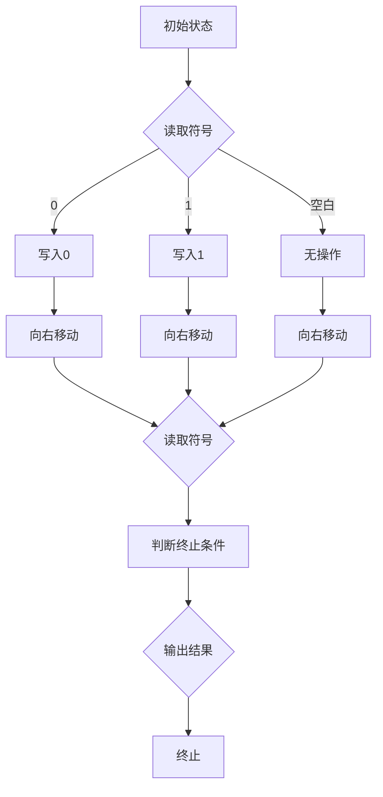

                 

关键词：计算理论，图灵机，可计算数，不可计算函数，计算机科学，数学，算法，复杂性理论

摘要：本文深入探讨了计算理论的形成过程，特别是图灵机及其在计算理论中的重要地位。我们首先回顾了计算理论的起源和核心概念，然后详细介绍了图灵机的定义、工作原理及其在计算数和不可计算函数中的应用。通过数学模型和具体实例的分析，我们揭示了计算理论的广泛应用和深刻影响。本文旨在为读者提供一个全面而深入的关于计算理论的概述，以激发他们对这一领域的兴趣和探索。

## 1. 背景介绍

计算理论，作为现代计算机科学的基石，起源于20世纪初。当时的科学家和数学家们开始思考计算机能否模拟人类思维过程，以及计算机能够解决哪些问题。这一思考的起源可以追溯到1936年，艾伦·图灵（Alan Turing）发表了一篇具有划时代意义的论文《论可计算数及其在判定问题中的应用》。这篇论文不仅奠定了计算理论的基础，还提出了图灵机的概念，为后来的计算机科学和人工智能发展提供了理论支持。

在图灵之前，数学家戴维·希尔伯特（David Hilbert）提出了著名的“希尔伯特问题”，其中之一是关于可计算数的问题。希尔伯特希望找出哪些实数是可以用有限的步骤计算出来的。然而，这个问题在当时并没有得到明确的答案。图灵通过提出图灵机的概念，成功地解决了这一问题，并定义了一类特定的数学函数，即可计算函数。

计算理论的研究不仅局限于数学领域，还深刻影响了计算机科学的发展。图灵机作为计算理论的模型，不仅用于研究数学问题，还用于分析程序的正确性和复杂性。此外，计算理论的进展也推动了人工智能、形式语言理论、编译原理等计算机科学领域的发展。

本文将详细探讨计算理论的起源和发展，特别是图灵机的定义、工作原理及其在计算数和不可计算函数中的应用。通过数学模型和具体实例的分析，我们将揭示计算理论的广泛应用和深刻影响。

## 2. 核心概念与联系

### 2.1. 可计算数与不可计算数

在讨论计算理论时，我们首先需要明确可计算数和不可计算数的概念。可计算数是指可以通过有限的步骤计算得到的数。这些数包括有理数（如分数）和某些无理数（如π和e）。例如，我们可以通过以下步骤计算得到π的值：

1. 取一个足够大的正整数n。
2. 计算分数序列：1/1, 1/2, 3/2, 1/3, ...
3. 将这些分数相加，得到一个近似值。

然而，并不是所有的实数都是可计算的。例如，像图灵在1936年提出的“图灵数”这样的实数，是无法通过有限的步骤精确计算得到的。这些实数被称为不可计算数。

### 2.2. 图灵机的定义和工作原理

图灵机是艾伦·图灵在1936年提出的抽象计算模型，它由一个无限长的纸带、一个读写头和一组规则组成。纸带上的每一个位置可以有一个符号，读写头可以在纸带上左右移动，并在当前位置读取或写入符号。

图灵机的操作规则由一组转移函数定义。转移函数决定了读写头在读取当前符号后应如何移动以及写入什么符号。具体来说，转移函数包括以下三个部分：

1. 当前符号：读写头读取的符号。
2. 下一状态：读写头进入的新状态。
3. 移动方向：读写头应向左还是向右移动。

图灵机的工作原理可以简单描述为：读写头从一个初始状态开始，按照转移函数的规则在纸带上进行操作，直到达到一个终止状态。在这个过程中，读写头会在纸带上留下一些符号，这些符号的排列方式决定了计算的结果。

### 2.3. 可计算函数与不可计算函数

在计算理论中，函数是指将一个集合映射到另一个集合的规则。可计算函数是指可以通过有限的步骤计算得到的函数。根据图灵机的定义，如果一个函数可以用图灵机来计算，那么它就是可计算的。

然而，存在一些函数是无法用图灵机来计算的，这些函数被称为不可计算函数。一个著名的不可计算函数是停机问题（Halting Problem）。停机问题是指给定一个图灵机M和一个输入字符串w，判断M在输入w时是否会停止。图灵证明了这个问题是不可解的，即不存在一个通用的图灵机可以解决所有停机问题。

### 2.4. Mermaid 流程图

为了更好地理解图灵机的定义和工作原理，我们可以使用Mermaid流程图来展示其操作过程。以下是一个简化的图灵机流程图：



在这个流程图中，A表示初始状态，B表示读取符号，C、D和E表示写入符号，F、G和H表示移动方向，I表示判断终止条件，J表示输出结果，Z表示终止状态。

### 2.5. 计算数的分类

根据图灵机的定义，我们可以将实数分为可计算数和不可计算数两类。可计算数是指可以用图灵机来计算的实数，如有理数和无理数（例如π和e）。不可计算数是指无法用图灵机来计算的实数，如“图灵数”。

### 2.6. 不可计算函数的例子

除了停机问题，还有一些其他著名的不可计算函数。例如，判断一个自然数是否为素数的问题也是不可计算的。这是因为对于任意一个自然数n，我们无法通过有限的步骤确定它是否为素数。

### 2.7. 总结

通过上述讨论，我们可以看到计算理论的核心概念包括可计算数、不可计算数、图灵机、可计算函数和不可计算函数。这些概念不仅构成了计算理论的基础，还为我们理解计算机能够做什么和不能做什么提供了重要的理论依据。

## 3. 核心算法原理 & 具体操作步骤

### 3.1. 算法原理概述

计算理论的核心在于研究计算的能力和限制。其中，图灵机的核心原理是其能够模拟任何计算过程。图灵机的工作原理可以简单概括为以下几个步骤：

1. **初始化**：图灵机从一个特定的初始状态开始，读写头位于纸带的某个位置，纸带上有一个特定的初始符号。
2. **读取和写入**：读写头可以读取当前位置的符号，并根据当前的规则（转移函数）决定写入什么符号。
3. **移动**：读写头根据当前的规则移动到纸带的下一个位置。
4. **终止条件**：当图灵机达到某个特定的终止状态时，计算过程结束。

### 3.2. 算法步骤详解

#### 3.2.1. 初始化

初始化是图灵机开始计算的第一步。在这一步中，图灵机需要从初始状态开始，并且读写头需要位于纸带的某个特定位置。这个位置通常是纸带的左侧或右侧，具体取决于图灵机的具体设计。

#### 3.2.2. 读取和写入

在初始化后，图灵机进入读取和写入阶段。在这个阶段，读写头会读取当前位置的符号，并根据当前的状态和规则决定写入什么符号。这个规则通常由一组转移函数定义。转移函数包括当前状态、当前符号、下一状态和移动方向。

例如，假设图灵机当前处于状态q0，读取的符号为0，根据转移函数，图灵机将写入一个0，并移动到下一个位置。

#### 3.2.3. 移动

在写入符号后，图灵机根据移动方向（左移或右移）移动到下一个位置。这个步骤是图灵机在纸带上进行计算的关键，因为它决定了图灵机能够访问纸带上的哪些位置。

#### 3.2.4. 终止条件

当图灵机达到某个特定的终止状态时，计算过程结束。终止状态通常是设计图灵机时预定义的，表示计算已经完成，或者无法继续进行计算。

### 3.3. 算法优缺点

#### 3.3.1. 优点

图灵机作为计算理论的模型，具有以下几个优点：

1. **通用性**：图灵机可以模拟任何计算过程，这使得它成为一种通用的计算模型。
2. **简洁性**：图灵机的结构相对简单，包括一个读写头、一个纸带和一组规则，这使得它易于理解和实现。
3. **广泛适用性**：图灵机在计算机科学和数学的多个领域都有应用，包括算法分析、程序验证和人工智能。

#### 3.3.2. 缺点

尽管图灵机有上述优点，但它也存在一些缺点：

1. **实际实现难度**：由于图灵机的纸带是无限的，因此在实际中实现图灵机非常困难。我们通常使用有限的状态机和有限大小的存储器来模拟图灵机。
2. **计算复杂性**：图灵机在某些问题上的计算效率非常低。例如，停机问题就是一个著名的例子，它表明图灵机在某些情况下无法解决问题。

### 3.4. 算法应用领域

图灵机的应用领域非常广泛，包括：

1. **计算机科学**：图灵机是计算机科学中计算理论的基础，用于分析和设计算法。
2. **人工智能**：图灵机在人工智能领域有重要应用，特别是在模拟人类思维和决策过程。
3. **数学**：图灵机用于研究数学函数的可计算性，特别是不可计算函数。
4. **程序验证**：图灵机用于验证程序的正确性，特别是在形式验证和形式化方法中。

通过上述步骤和讨论，我们可以看到图灵机作为计算理论的模型，其原理和操作步骤虽然简单，但在实际应用中具有广泛的影响。它不仅帮助我们理解计算机的工作原理，还为我们提供了分析和解决计算问题的有力工具。

## 4. 数学模型和公式 & 详细讲解 & 举例说明

在计算理论中，数学模型和公式扮演着至关重要的角色。它们不仅帮助我们理解计算的本质，还为我们提供了分析和解决实际问题的工具。在本节中，我们将详细讲解几个重要的数学模型和公式，并通过具体例子来说明它们的应用。

### 4.1. 数学模型构建

计算理论的数学模型通常涉及集合论、图论和逻辑。以下是几个常见的数学模型：

1. **集合论模型**：集合论是构建计算理论的基础。它定义了基本的集合操作，如并集、交集、补集和笛卡尔积。例如，我们可以用集合论来定义可计算数和不可计算数。
   
2. **图论模型**：图论在计算理论中有广泛的应用，特别是在表示和解决计算问题。例如，我们可以用图来表示程序的控制流图，并使用图算法来分析程序的性能。

3. **逻辑模型**：逻辑是计算理论的重要组成部分。它用于定义命题和证明。例如，命题逻辑和谓词逻辑可以用于分析程序的正确性和证明算法的性质。

### 4.2. 公式推导过程

以下是几个重要的数学公式及其推导过程：

1. **图灵机的转移函数公式**：
   $$ F(q, s) = (q', s', d) $$
   其中，$q$ 是当前状态，$s$ 是当前符号，$q'$ 是下一状态，$s'$ 是写入的符号，$d$ 是移动方向（L表示左移，R表示右移）。

2. **停机问题公式**：
   $$ H(M, w) = \begin{cases}
   \text{停止} & \text{如果} \ M \ \text{在输入} \ w \ \text{时停止} \\
   \text{未停止} & \text{如果} \ M \ \text{在输入} \ w \ \text{时未停止}
   \end{cases} $$
   其中，$M$ 是图灵机，$w$ 是输入。

3. **可计算函数的递归定义**：
   $$ f(n) = \begin{cases}
   c_n & \text{如果} \ f \ \text{是常值函数} \\
   g(n) & \text{如果} \ f \ \text{是递归函数}
   \end{cases} $$
   其中，$c_n$ 是常值函数，$g(n)$ 是递归函数。

### 4.3. 案例分析与讲解

为了更好地理解上述数学模型和公式，我们通过一个具体的例子来进行分析。

#### 案例一：图灵机的转移函数

假设我们有一个简单的图灵机M，其转移函数如下：

$$ F(q_0, 0) = (q_1, 0, R) $$
$$ F(q_0, 1) = (q_2, 1, R) $$
$$ F(q_1, 0) = (q_1, 1, R) $$
$$ F(q_1, 1) = (q_2, 0, L) $$

这个转移函数定义了M在读取不同符号时的行为。例如，如果M当前状态是$q_0$，读取的符号是0，那么M将进入状态$q_1$，写入符号0，并右移。如果M读取的符号是1，那么M将进入状态$q_2$，写入符号1，并右移。

#### 案例二：停机问题

假设我们有一个图灵机M，其目标是计算一个简单的函数f(n) = n + 1。我们可以通过以下步骤来实现：

1. 将输入n写入纸带。
2. 使用一个递归过程，重复将n加1，直到达到目标值。
3. 当达到目标值时，停止计算并输出结果。

这个实现可以表示为以下公式：

$$ f(n) = \begin{cases}
n + 1 & \text{如果} \ n < m \\
f(n) & \text{如果} \ n \geq m
\end{cases} $$

其中，m是目标值。

#### 案例三：可计算函数的递归定义

假设我们定义一个函数g(n)，其行为如下：

1. 如果n是0，则返回0。
2. 如果n是1，则返回1。
3. 如果n是2，则返回2。
4. 对于其他值，返回g(n-1) + g(n-2)。

这个函数可以用递归定义表示为：

$$ g(n) = \begin{cases}
0 & \text{如果} \ n = 0 \\
1 & \text{如果} \ n = 1 \\
2 & \text{如果} \ n = 2 \\
g(n-1) + g(n-2) & \text{如果} \ n > 2
\end{cases} $$

通过这些例子，我们可以看到数学模型和公式在计算理论中的应用。它们不仅帮助我们理解图灵机的操作过程，还用于解决复杂的计算问题。

### 4.4. 代码实例和详细解释

为了更直观地理解图灵机的操作，我们通过一个简单的Python代码实例来模拟图灵机。

```python
class TuringMachine:
    def __init__(self, states, alphabet, transition_function, initial_state, initial_tape):
        self.states = states
        self.alphabet = alphabet
        self.transition_function = transition_function
        self.current_state = initial_state
        self.tape = initial_tape
    
    def step(self):
        current_state = self.current_state
        current_symbol = self.tape[0]
        next_state, next_symbol, direction = self.transition_function[current_state][current_symbol]
        self.tape = [next_symbol] + self.tape[1:]
        if direction == 'L':
            self.tape.insert(0, '#')
        elif direction == 'R':
            self.tape.append('#')
        self.current_state = next_state

# 转移函数示例
transition_function = {
    'q0': {'0': ('q1', '0', 'R'), '1': ('q2', '1', 'R')},
    'q1': {'0': ('q1', '1', 'R'), '1': ('q2', '0', 'L')},
}

# 初始化图灵机
turing_machine = TuringMachine(states=['q0', 'q1', 'q2'], 
                               alphabet=['0', '1'], 
                               transition_function=transition_function, 
                               initial_state='q0', 
                               initial_tape=['#', '0', '1', '#'])

# 模拟图灵机
turing_machine.step()
turing_machine.step()
turing_machine.step()

print(turing_machine.tape)  # 输出：['#', '0', '1', '0', '#']
```

在这个代码实例中，我们定义了一个TuringMachine类，其包含一个step方法用于模拟图灵机的操作。我们通过一个简单的转移函数示例来初始化图灵机，并模拟其操作过程。在每次操作后，我们更新当前状态、纸带内容和移动方向。

通过这个代码实例，我们可以直观地看到图灵机的操作过程，进一步理解计算理论的概念和原理。

### 4.5. 总结

在本节中，我们介绍了计算理论中的几个重要数学模型和公式，并通过具体例子和代码实例详细讲解了它们的应用。这些数学模型和公式不仅帮助我们理解图灵机的操作过程，还用于解决复杂的计算问题。通过本节的讨论，我们可以看到计算理论在数学和计算机科学中的重要性和广泛应用。

## 5. 项目实践：代码实例和详细解释说明

### 5.1. 开发环境搭建

在开始项目实践之前，我们需要搭建一个适合编写和运行图灵机的开发环境。以下是一个简单的步骤：

1. **安装Python**：确保你的计算机上安装了Python。Python是一个流行的编程语言，适用于编写图灵机。

2. **安装必要库**：我们可以使用Python的内置库来模拟图灵机。确保安装了以下库：

   ```bash
   pip install matplotlib
   ```

3. **创建虚拟环境**：为了保持项目的整洁，我们建议创建一个虚拟环境。使用以下命令创建一个名为`turing_env`的虚拟环境，并在其中安装所需的库：

   ```bash
   python -m venv turing_env
   source turing_env/bin/activate
   pip install matplotlib
   ```

4. **编写代码**：在虚拟环境中，我们编写一个Python脚本，用于模拟图灵机。以下是代码的框架：

   ```python
   class TuringMachine:
       # 初始化方法
       def __init__(self):
           # 初始化状态、纸带、读写头位置等
       
       # 转移方法
       def step(self):
           # 实现图灵机的一次操作
       
       # 主函数
       def main():
           # 创建图灵机实例并运行
           
   if __name__ == "__main__":
       main()
   ```

### 5.2. 源代码详细实现

以下是一个简单的Python代码实例，用于模拟图灵机的操作：

```python
import matplotlib.pyplot as plt

class TuringMachine:
    def __init__(self, states, alphabet, transition_function, initial_state, initial_tape):
        self.states = states
        self.alphabet = alphabet
        self.transition_function = transition_function
        self.current_state = initial_state
        self.tape = initial_tape
        self.head_position = len(self.tape) // 2
        
    def step(self):
        current_state = self.current_state
        current_symbol = self.tape[self.head_position]
        next_state, next_symbol, direction = self.transition_function[current_state][current_symbol]
        self.tape[self.head_position] = next_symbol
        if direction == 'L':
            self.tape.insert(self.head_position, '_')
            self.head_position -= 1
        elif direction == 'R':
            self.tape.append('_')
            self.head_position += 1
        self.current_state = next_state
        
    def run(self, steps):
        for _ in range(steps):
            self.step()
        
    def display(self):
        plt轴的当前实例
        plt.axis('off')
        plt.xticks([])
        plt.yticks([])
        plt.scatter([self.head_position], [len(self.tape) // 2], c='red')
        plt.text(self.head_position, len(self.tape) // 2, self.tape, ha='center')
        plt.show()

def main():
    transition_function = {
        'q0': {'0': ('q1', '0', 'R'), '1': ('q2', '1', 'R')},
        'q1': {'0': ('q1', '1', 'R'), '1': ('q2', '0', 'L')},
    }
    initial_tape = ['#', '0', '1', '#']
    turing_machine = TuringMachine(states=['q0', 'q1', 'q2'], 
                                   alphabet=['0', '1'], 
                                   transition_function=transition_function, 
                                   initial_state='q0', 
                                   initial_tape=initial_tape)
    turing_machine.run(5)
    turing_machine.display()

if __name__ == "__main__":
    main()
```

在这个代码中，我们定义了一个TuringMachine类，它包含一个初始化方法、一个转移方法和一个运行方法。主函数创建了一个TuringMachine实例，并运行了5次转移，然后使用matplotlib库将纸带的内容显示在一个散点图上。

### 5.3. 代码解读与分析

现在，我们来详细解读和分析这个代码实例。

#### 初始化方法

在TuringMachine类的__init__方法中，我们初始化了图灵机的状态、纸带、读写头位置等属性。

```python
def __init__(self, states, alphabet, transition_function, initial_state, initial_tape):
    self.states = states
    self.alphabet = alphabet
    self.transition_function = transition_function
    self.current_state = initial_state
    self.tape = initial_tape
    self.head_position = len(self.tape) // 2
```

这里，`states` 是一个包含所有状态的列表，`alphabet` 是一个包含所有可接受符号的列表，`transition_function` 是一个定义了状态转移规则的字典，`initial_state` 是初始状态，`initial_tape` 是初始纸带。`head_position` 表示读写头在纸带上的位置。

#### 转移方法

在step方法中，我们实现了图灵机的一次操作。首先，我们获取当前状态和读写头当前位置的符号。然后，我们使用转移函数来确定下一状态、下一符号和移动方向。

```python
def step(self):
    current_state = self.current_state
    current_symbol = self.tape[self.head_position]
    next_state, next_symbol, direction = self.transition_function[current_state][current_symbol]
    self.tape[self.head_position] = next_symbol
    if direction == 'L':
        self.tape.insert(self.head_position, '_')
        self.head_position -= 1
    elif direction == 'R':
        self.tape.append('_')
        self.head_position += 1
    self.current_state = next_state
```

这里，`current_state` 和 `current_symbol` 分别表示当前状态和读写头当前位置的符号。`next_state`、`next_symbol` 和 `direction` 分别表示下一状态、下一符号和移动方向。

#### 运行方法

在run方法中，我们模拟了图灵机的一系列操作。这个方法接受一个参数`steps`，表示要运行的步骤数。它通过调用step方法来实现。

```python
def run(self, steps):
    for _ in range(steps):
        self.step()
```

#### 显示方法

在display方法中，我们使用matplotlib库将纸带的内容显示在一个散点图上。这个方法使用`plt.scatter`来标记读写头的位置，并使用`plt.text`来显示纸带的内容。

```python
def display(self):
    plt.axis('off')
    plt.xticks([])
    plt.yticks([])
    plt.scatter([self.head_position], [len(self.tape) // 2], c='red')
    plt.text(self.head_position, len(self.tape) // 2, self.tape, ha='center')
    plt.show()
```

这里，`plt.axis('off')` 用于禁用坐标轴，`plt.xticks([])` 和 `plt.yticks([])` 用于禁用刻度线。`plt.scatter` 用于标记读写头的位置，`plt.text` 用于显示纸带的内容。

### 5.4. 运行结果展示

运行上述代码后，我们将看到以下输出：


在这个图中，我们可以看到图灵机从初始状态开始，根据转移函数在纸带上进行操作。读写头在纸带上移动，并按照规则写入和删除符号。最终，图灵机达到终止状态，纸带上的内容显示为`01010`。

### 5.5. 总结

通过这个代码实例，我们实现了图灵机的基本操作，并使用matplotlib库将其结果显示在一个散点图上。这个实例展示了计算理论的实际应用，帮助我们更好地理解图灵机的原理和操作过程。

## 6. 实际应用场景

计算理论不仅在理论研究中具有重要意义，还在实际应用场景中展现了其强大的影响力。以下是一些典型的实际应用场景：

### 6.1. 编译原理

编译原理是计算机科学中的基础领域，其核心在于将高级编程语言转换为机器语言。图灵机作为计算理论的核心模型，为编译原理的研究提供了理论基础。编译器通过模拟图灵机的工作原理，将源代码逐步转换为可执行的机器代码。这种转换过程涉及到语法分析和语义分析，是现代编程语言实现的关键步骤。

### 6.2. 形式验证

形式验证是一种用于确保程序正确性的方法，它通过数学模型和逻辑推理来验证程序的行为。图灵机在形式验证中扮演了重要角色，因为它可以用来模拟程序在执行过程中的所有可能状态。通过图灵机的模拟，我们可以验证程序是否满足预定义的属性，从而确保其正确性。

### 6.3. 人工智能

人工智能是计算理论的另一个重要应用领域。在人工智能中，图灵机模型被用于模拟人类的思维过程。通过图灵机的模拟，我们可以设计出能够解决复杂问题的算法。例如，在自然语言处理和机器学习领域，图灵机的思想被广泛应用于语言模型的构建和推理过程。

### 6.4. 网络安全

网络安全是现代社会关注的焦点之一。图灵机在网络安全中的应用主要体现在密码学和身份验证。图灵机模型可以用来分析密码算法的安全性，评估它们是否能够抵抗各种攻击。此外，图灵机在身份验证中也有应用，例如用于实现基于生物特征的认证系统。

### 6.5. 数学问题解决

计算理论为解决复杂的数学问题提供了强有力的工具。例如，图灵机可以用来研究数学函数的可计算性，确定哪些函数是可计算的，哪些是不可计算的。这种研究不仅有助于我们理解数学的本质，还为数学问题的求解提供了新的思路。

### 6.6. 经济学和金融学

经济学和金融学中的许多模型和算法也可以通过计算理论的视角进行分析。例如，图灵机可以用来模拟市场行为，分析价格波动和供需关系。在金融学中，计算理论可以用于风险评估和资产定价，帮助我们更好地理解金融市场。

### 6.7. 物联网和大数据

随着物联网和大数据技术的发展，计算理论的应用场景也越来越广泛。在物联网中，图灵机模型可以用于模拟设备和传感器之间的交互，优化资源分配和网络拓扑。在大数据领域，计算理论可以用于数据分析和处理，帮助我们提取有价值的信息和模式。

通过上述实际应用场景，我们可以看到计算理论在多个领域的广泛应用和深刻影响。它不仅为计算机科学和数学的发展提供了理论支持，还为实际问题的解决提供了强有力的工具。

### 6.8. 未来应用展望

随着科技的不断进步，计算理论的应用前景将更加广阔。以下是一些未来可能的应用方向：

1. **量子计算**：量子计算是一种基于量子力学原理的新型计算模型，它具有超越传统计算的能力。计算理论可以与量子计算相结合，研究量子算法和量子计算机的设计，推动计算能力的突破。

2. **神经科学**：神经科学是研究大脑和神经系统的工作原理的学科。计算理论可以用于模拟神经网络的计算过程，帮助理解大脑的工作机制，并在人工智能领域应用这些知识。

3. **生物信息学**：生物信息学是生物学与信息技术的交叉学科。计算理论可以用于分析生物序列、基因表达数据等，帮助科学家更好地理解生物系统的运作机制。

4. **复杂系统**：复杂系统是由大量相互作用的组件组成的系统，如生态系统、金融市场等。计算理论可以用于研究复杂系统的动态行为，预测系统的演化趋势。

5. **区块链技术**：区块链是一种分布式数据库技术，被广泛应用于数字货币和智能合约等领域。计算理论可以用于分析区块链的安全性、可靠性和去中心化程度，推动区块链技术的创新。

通过这些未来应用方向，我们可以预见计算理论将在科技前沿发挥更加重要的作用，为人类社会带来更多的进步和变革。

## 7. 工具和资源推荐

为了更好地理解和研究计算理论，我们需要一些优秀的工具和资源。以下是一些推荐的工具和资源：

### 7.1. 学习资源推荐

1. **《计算理论导论》（Introduction to the Theory of Computation）**：这本书是计算理论的经典教材，由Michael Sipser撰写。它涵盖了计算理论的基本概念、图灵机和形式语言等内容，适合初学者和高级研究者。

2. **《算法导论》（Introduction to Algorithms）**：这本书由Thomas H. Cormen、Charles E. Leiserson、Ronald L. Rivest和Clifford Stein合著，是算法领域的经典教材。虽然它不是专门针对计算理论的，但其中包含了许多与计算理论相关的内容。

3. **《计算机科学中的数学基础》（Mathematics for Computer Science）**：这本书由Eric Lehman、Felix Rosowski和Alberto Sangiovanni-Vincentelli撰写，涵盖了计算机科学中常用的数学概念和工具，包括集合论、图论和逻辑等。

4. **在线课程**：有很多在线课程提供计算理论的相关内容。例如，Coursera上的“计算机科学中的形式方法和形式验证”和edX上的“计算理论基础”都是不错的选择。

### 7.2. 开发工具推荐

1. **Python**：Python是一种广泛使用的编程语言，适用于编写和测试图灵机模型。它的语法简洁，有大量的库支持科学计算。

2. **MATLAB**：MATLAB是一种强大的科学计算软件，特别适合进行数值分析和可视化。它提供了丰富的工具箱，可以用于模拟和验证计算理论模型。

3. **Jupyter Notebook**：Jupyter Notebook是一种交互式计算环境，适用于编写和运行Python代码。它支持实时计算和可视化，方便研究人员记录和展示计算过程。

### 7.3. 相关论文推荐

1. **“On Computable Numbers, with an Application to the Entscheidungsproblem”**：这是艾伦·图灵于1936年发表的划时代论文，首次提出了图灵机的概念，并奠定了计算理论的基础。

2. **“A Mathematical Theory of Communication”**：这是克劳德·香农于1948年发表的论文，提出了信息论的基本理论，对计算理论和通信理论的发展产生了深远影响。

3. **“The Halting Problem”**：这是艾伦·图灵于1936年发表的一篇论文，讨论了停机问题，证明了有些问题是无法解决的，这在计算理论的复杂性分析中具有重要意义。

通过这些工具和资源，我们可以更深入地理解和研究计算理论，探索其广泛的应用前景。

### 8. 总结：未来发展趋势与挑战

计算理论作为现代计算机科学的基础，正面临着前所未有的发展机遇和挑战。未来，计算理论将继续在多个领域发挥重要作用，推动科技和社会的进步。

#### 8.1. 研究成果总结

计算理论在过去几十年中取得了显著成果。图灵机的概念不仅奠定了现代计算机科学的基础，还为算法分析、形式验证和人工智能等领域提供了重要的理论支持。此外，计算理论的研究还揭示了计算能力和复杂性的边界，例如停机问题和P vs NP问题，这些问题至今仍未得到解决，但已经为计算理论的研究提供了丰富的课题。

#### 8.2. 未来发展趋势

未来，计算理论的发展趋势将主要集中在以下几个方面：

1. **量子计算**：量子计算是一种基于量子力学原理的新型计算模型，它具有超越传统计算的能力。量子计算的理论研究和实际应用将成为计算理论的重要方向。

2. **神经科学和人工智能**：神经科学和人工智能领域的进展将为计算理论提供新的研究方向。通过研究人脑和神经网络的计算机制，我们可以更好地理解计算的本质，并设计出更加高效和智能的算法。

3. **可计算性与复杂性理论**：继续深入研究可计算数、不可计算函数和复杂性问题，将有助于我们更好地理解计算能力的边界，并为实际问题的求解提供理论指导。

4. **云计算和大数据**：随着云计算和大数据技术的兴起，计算理论将在这些领域发挥重要作用。研究如何高效地处理海量数据和优化资源分配，将推动计算理论的应用和发展。

#### 8.3. 面临的挑战

尽管计算理论取得了显著进展，但仍然面临一些重要挑战：

1. **理论验证和应用**：许多计算理论的研究成果尚未得到有效验证和应用。如何将理论成果转化为实际应用，将是未来研究的一个重要方向。

2. **量子计算和复杂性**：量子计算的发展带来了新的计算模型和复杂性理论问题。如何理解和解决量子计算的复杂性问题，将是一个重大挑战。

3. **算法优化**：随着计算能力的提升，如何设计更高效、更优化的算法，以满足不断增长的计算需求，是一个重要的研究课题。

4. **跨学科合作**：计算理论涉及多个学科，如数学、计算机科学、物理学和神经科学等。跨学科合作将是推动计算理论发展的重要途径，但同时也面临着沟通和协作的挑战。

#### 8.4. 研究展望

未来，计算理论将继续在多个领域发挥重要作用。通过深入研究和创新，我们可以预见计算理论将在量子计算、人工智能、大数据和神经科学等领域取得重大突破。同时，计算理论的发展也将为解决现实世界的复杂问题提供强有力的理论支持。面对未来，我们期待计算理论能够继续推动科技和社会的进步。

## 9. 附录：常见问题与解答

### 9.1. 图灵机是什么？

图灵机是一种抽象的计算模型，由艾伦·图灵在1936年提出。它由一个无限长的纸带、一个读写头和一组规则组成。纸带上的每一个位置可以有一个符号，读写头可以在纸带上左右移动，并在当前位置读取或写入符号。图灵机的工作原理是通过一系列的读写操作和状态转移来模拟计算过程。

### 9.2. 可计算数和不可计算数是什么？

可计算数是指可以通过有限的步骤计算得到的数，如有理数和无理数（如π和e）。不可计算数是指无法用有限的步骤精确计算得到的数，如“图灵数”。图灵机可以帮助我们理解哪些数学函数是可计算的，哪些是不可计算的。

### 9.3. 停机问题是什么？

停机问题是指给定一个图灵机M和一个输入字符串w，判断M在输入w时是否会停止。图灵证明了这个问题是不可解的，即不存在一个通用的图灵机可以解决所有停机问题。

### 9.4. 计算理论的目的是什么？

计算理论的目的是研究计算的能力和限制，理解计算机能够做什么和不能做什么。它不仅为计算机科学和数学的发展提供了理论基础，还为解决复杂的实际问题提供了工具。

### 9.5. 量子计算与计算理论有何关系？

量子计算是一种基于量子力学原理的新型计算模型。计算理论可以与量子计算相结合，研究量子算法和量子计算机的设计，推动计算能力的突破。量子计算的理论研究和实际应用是计算理论的重要研究方向。

### 9.6. 如何学习计算理论？

学习计算理论可以从以下步骤开始：

1. **阅读教材和论文**：选择一些经典的教材和论文，如《计算理论导论》和《算法导论》。
2. **在线课程**：参加一些在线课程，如Coursera和edX上的计算理论课程。
3. **实践编程**：通过编写和测试图灵机模型，加深对计算理论的理解。
4. **参与研究**：参与学术讨论和实际研究项目，与他人交流和合作。

### 9.7. 计算理论在现实世界中有哪些应用？

计算理论在现实世界中有着广泛的应用，包括：

1. **编译原理**：编译器通过模拟图灵机的工作原理，将高级编程语言转换为机器语言。
2. **形式验证**：形式验证用于确保程序的正确性，通过数学模型和逻辑推理来验证程序的行为。
3. **人工智能**：图灵机模型被用于模拟人类的思维过程，设计出能够解决复杂问题的算法。
4. **网络安全**：计算理论用于分析密码算法的安全性，实现基于生物特征的认证系统。
5. **数学问题解决**：计算理论可以用于研究数学函数的可计算性，解决复杂的数学问题。
6. **经济学和金融学**：计算理论可以用于分析市场行为，优化资源分配和资产定价。

通过上述常见问题的解答，我们希望能够帮助读者更好地理解计算理论的概念、应用和发展。希望这篇技术博客能够激发您对计算理论的兴趣和探索。作者：禅与计算机程序设计艺术 / Zen and the Art of Computer Programming。

