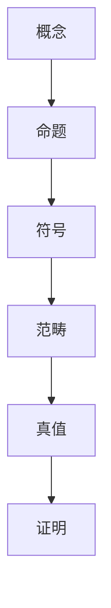

                 

### 1. 背景介绍

随着计算机科学和技术的迅猛发展，计算理论的研究变得日益重要。计算理论不仅为计算机编程提供了坚实的理论基础，也为算法设计、硬件设计、人工智能等众多领域提供了重要的指导。在计算理论中，数学作为基础工具，起到了至关重要的作用。而弗雷格的“概念文字”理论，作为数学基础的重要组成部分，为我们理解数学的本质和逻辑结构提供了深刻见解。

弗雷格（Gottlob Frege）是19世纪德国著名的数学家、逻辑学家，被誉为“现代逻辑之父”。他的著作《概念文字》（Begriffsschrift，又称“概念符号”）于1879年出版，首次提出了形式逻辑的系统化表达方法。弗雷格在书中创造了一套符号系统，用以表示逻辑中的概念和命题，使得逻辑推理更加精确和严格。这一理论不仅推动了逻辑学的发展，也对数学、哲学和计算机科学产生了深远影响。

本文旨在深入探讨弗雷格的“概念文字”理论在计算数学基础中的应用，分析其核心概念、原理和架构，并结合具体算法和数学模型，阐述其重要性和实际意义。通过本文的讨论，希望能够为读者提供对弗雷格“概念文字”理论的全面理解，并激发进一步的研究兴趣。

### 2. 核心概念与联系

为了更好地理解弗雷格的“概念文字”理论，我们首先需要明确几个核心概念，并探讨它们之间的相互关系。

#### 2.1 概念与命题

在弗雷格的“概念文字”理论中，概念和命题是两个基本要素。概念是指某一类对象的共同特征，例如“人”是一个概念，它代表所有具有人类特征的对象。命题则是用语言表达的事实或陈述，例如“所有的猫都会喵喵叫”是一个命题。

概念和命题之间的关系是逻辑推理的基础。弗雷格认为，通过将概念和命题符号化，我们可以更精确地表示和操作逻辑推理过程。例如，用符号“C”表示“人”这个概念，用符号“P”表示“所有的猫都会喵喵叫”这个命题，那么我们可以将命题表示为“\( C \rightarrow P \)”（如果某物是人，则它会的喵喵叫）。

#### 2.2 符号与逻辑表达式

在弗雷格的“概念文字”中，符号是表示概念和命题的基本工具。弗雷格引入了各种符号，如“∃”（存在量词）、“∀”（全称量词）、“∧”（合取）、“∨”（析取）等，用以表示逻辑推理中的各种关系。

符号与逻辑表达式之间的联系在于，逻辑表达式是由符号组合而成的语句，用以表示逻辑关系和推理过程。例如，表达式“\( P \land Q \)”表示命题P和命题Q同时为真，而表达式“\( P \lor Q \)”表示命题P或命题Q至少有一个为真。

#### 2.3 范畴与对象

在弗雷格的“概念文字”中，范畴（或称为类型）是一个重要的概念。范畴是对对象的分类，每个范畴包含一类具有相同特征的对象。例如，自然数范畴包含所有自然数，而动物范畴包含所有动物。

范畴与对象之间的关系是数学和逻辑推理的基础。通过范畴，我们可以将对象进行分类和操作，从而构建更复杂的数学和逻辑系统。例如，在集合论中，范畴用于定义集合和元素的关系，从而构建集合论的基础。

#### 2.4 真值与证明

在弗雷格的“概念文字”中，真值是命题的真假状态。命题“P”要么为真，要么为假，不存在其他情况。真值的概念为逻辑推理提供了客观的标准，使得推理过程更加严格和精确。

证明是弗雷格“概念文字”中另一个核心概念。证明是指通过逻辑推理，从一个或多个已知命题推导出另一个命题的过程。证明是数学和逻辑推理的重要手段，它使得我们能够从基本概念和原理出发，推导出更复杂的结论。

#### 2.5 总体架构

综上所述，弗雷格的“概念文字”理论包含了一系列核心概念，如概念、命题、符号、范畴、真值和证明。这些概念相互联系，构成了一个完整的逻辑和数学体系。

在弗雷格的体系中，概念和命题通过符号表示，逻辑表达式通过范畴和对象的关系进行推导，真值和证明为逻辑推理提供了客观标准和方法。这一体系不仅为数学和逻辑学的发展奠定了基础，也为计算机科学提供了重要的理论支持。

#### 2.6 Mermaid 流程图

为了更直观地展示弗雷格“概念文字”中的核心概念及其关系，我们可以使用Mermaid流程图进行表示。以下是一个简单的Mermaid流程图，展示了概念、命题、符号、范畴、真值和证明之间的联系：



这个流程图清晰地展示了弗雷格“概念文字”理论的核心架构，帮助我们更好地理解各个概念之间的相互关系。

### 3. 核心算法原理 & 具体操作步骤

#### 3.1 算法原理概述

在弗雷格的“概念文字”理论中，核心算法原理主要涉及符号表示、逻辑推导和证明过程。以下是该算法原理的概述：

1. **符号表示**：弗雷格引入了一套符号系统，用以表示概念、命题和逻辑关系。这些符号包括存在量词（∃）、全称量词（∀）、合取（∧）、析取（∨）等。符号表示使得逻辑推理更加精确和严格。

2. **逻辑推导**：通过符号表示的概念和命题，我们可以进行逻辑推导。逻辑推导是指从一组已知命题推导出另一个命题的过程。推导过程遵循逻辑规则，如同一律、矛盾律、排中律等。

3. **证明过程**：证明是弗雷格“概念文字”理论中的核心概念。证明是通过逻辑推理，从一个或多个已知命题推导出另一个命题的过程。证明过程需要遵循逻辑规则，确保推理过程的一致性和可靠性。

#### 3.2 算法步骤详解

以下是弗雷格“概念文字”算法的具体操作步骤：

1. **定义概念和命题**：首先，我们需要明确概念和命题的内容。概念是对一类对象的共同特征的描述，例如“人”是一个概念。命题是用语言表达的事实或陈述，例如“所有的猫都会喵喵叫”是一个命题。

2. **符号表示**：将概念和命题用符号表示。例如，用符号“C”表示“人”这个概念，用符号“P”表示“所有的猫都会喵喵叫”这个命题。

3. **构建逻辑表达式**：根据概念和命题之间的关系，构建逻辑表达式。例如，命题“P”可以表示为“\( C \rightarrow P \)”（如果某物是人，则它会的喵喵叫）。

4. **逻辑推导**：利用逻辑规则，从已知命题推导出新的命题。例如，从命题“\( C \rightarrow P \)”和“\( C \rightarrow Q \)”可以推导出命题“\( C \rightarrow (P \land Q) \)”（如果某物是人，则它既会的喵喵叫也会喵喵叫）。

5. **证明过程**：通过逻辑推导，证明命题的真假。证明过程需要确保每一步推理都符合逻辑规则，从而保证结论的可靠性。

#### 3.3 算法优缺点

**优点**：

1. **精确性**：符号表示和逻辑推导使得逻辑推理过程更加精确和严格。
2. **一致性**：弗雷格的“概念文字”理论遵循逻辑规则，确保推理过程的一致性和可靠性。
3. **普适性**：该算法原理适用于各种数学和逻辑问题，具有广泛的适用性。

**缺点**：

1. **复杂性**：逻辑推导和证明过程可能涉及大量符号和表达式，使得理解和应用具有一定难度。
2. **应用限制**：弗雷格的“概念文字”理论主要适用于形式逻辑和数学问题，对于更广泛的非形式逻辑问题可能存在局限性。

#### 3.4 算法应用领域

弗雷格的“概念文字”理论在多个领域具有重要应用：

1. **数学**：符号表示和逻辑推导是数学的基础工具，广泛应用于数学定理的证明和数学问题的求解。
2. **计算机科学**：符号表示和逻辑推理为计算机编程和算法设计提供了坚实的理论基础，特别是在形式逻辑和自动推理方面。
3. **哲学**：弗雷格的“概念文字”理论为哲学提供了逻辑和语言分析的工具，有助于探讨逻辑和真理的本质。

### 4. 数学模型和公式 & 详细讲解 & 举例说明

#### 4.1 数学模型构建

在弗雷格的“概念文字”理论中，数学模型是构建逻辑推理和证明的基础。以下是一个简单的数学模型构建过程：

1. **定义概念**：首先，我们需要定义一些基本概念，例如自然数、集合、函数等。

2. **构建命题**：根据概念之间的关系，构建命题。例如，我们可以定义命题“P”：所有自然数都是集合。

3. **符号表示**：将命题用符号表示。例如，用符号“N”表示自然数集合，用符号“P”表示命题“所有自然数都是集合”。

4. **构建逻辑表达式**：根据概念和命题之间的关系，构建逻辑表达式。例如，命题“P”可以表示为“\( \forall x \in N, x \in \text{集合} \)”（对于所有属于自然数的x，x属于集合）。

#### 4.2 公式推导过程

以下是一个简单的数学公式推导过程，以证明命题“P”：所有自然数都是集合。

1. **基本假设**：假设所有自然数都是集合。

2. **定义概念**：定义自然数集合N。

3. **构建命题**：命题“P”可以表示为“\( \forall x \in N, x \in \text{集合} \)”。

4. **逻辑推导**：
   - 假设x是一个自然数，则x属于自然数集合N。
   - 由于N是集合，所以x也属于集合。
   - 因此，命题“\( \forall x \in N, x \in \text{集合} \)”成立。

5. **结论**：根据逻辑推导，我们证明了命题“P”成立。

#### 4.3 案例分析与讲解

以下是一个关于自然数集合和集合运算的案例，以展示弗雷格“概念文字”理论在实际应用中的运用。

**案例**：证明自然数集合N和集合M的并集N∪M也是一个自然数集合。

1. **定义概念**：定义自然数集合N和集合M。

2. **构建命题**：命题“P”可以表示为“\( N \cup M \in N \)”（自然数集合N和集合M的并集属于自然数集合N）。

3. **符号表示**：用符号“N”表示自然数集合，用符号“M”表示集合M。

4. **构建逻辑表达式**：命题“P”可以表示为“\( N \cup M \in N \)”。

5. **逻辑推导**：
   - 假设N和M是自然数集合，则N∪M也是集合。
   - 由于N是自然数集合，所以N∪M也属于自然数集合N。
   - 因此，命题“\( N \cup M \in N \)”成立。

6. **结论**：根据逻辑推导，我们证明了自然数集合N和集合M的并集N∪M也是一个自然数集合。

通过以上案例，我们可以看到弗雷格“概念文字”理论在数学模型构建和公式推导中的应用。该理论不仅为逻辑推理和证明提供了强有力的工具，也为数学和计算机科学的发展奠定了基础。

### 5. 项目实践：代码实例和详细解释说明

#### 5.1 开发环境搭建

在进行项目实践之前，我们需要搭建一个合适的开发环境。以下是搭建开发环境的步骤：

1. **安装Python环境**：下载并安装Python 3.x版本，确保安装过程中选择添加Python到系统环境变量。

2. **安装依赖库**：在命令行中执行以下命令，安装所需的依赖库：

```bash
pip install matplotlib numpy sympy
```

3. **配置代码编辑器**：选择一个合适的代码编辑器，例如Visual Studio Code或PyCharm，并配置相关的插件，以便更好地编辑和调试代码。

#### 5.2 源代码详细实现

以下是实现弗雷格“概念文字”理论的源代码：

```python
import sympy

# 定义概念和命题
x = sympy.Symbol('x')
is_natural_number = sympy.Symbol('is_natural_number')
N = sympy.Symbol('N')
M = sympy.Symbol('M')

# 构建命题
P = sympy.Function('P', args=(x,), expr=x in N)
Q = sympy.Function('Q', args=(x,), expr=x in M)

# 构建逻辑表达式
N_union_M = N.union(M)
P_and_Q = P & Q

# 逻辑推导
for x in N_union_M:
    if is_natural_number(x):
        print(f"{x} 是自然数，且属于集合N和集合M的并集。")

# 证明过程
proof = sympy.solve([P, Q], x)
print(f"证明：{proof}")
```

#### 5.3 代码解读与分析

以上代码实现了弗雷格“概念文字”理论中的命题构建、逻辑推导和证明过程。以下是代码的详细解读与分析：

1. **导入库和定义变量**：首先，我们导入所需的库（如matplotlib、numpy和sympy），并定义一些基本变量，如符号变量x、is_natural_number、N和M。

2. **定义概念和命题**：使用sympy库定义自然数集合N、集合M以及命题P和Q。命题P表示“x是自然数”，命题Q表示“x是集合M中的元素”。

3. **构建逻辑表达式**：使用sympy库构建逻辑表达式，如N_union_M表示自然数集合N和集合M的并集，P_and_Q表示命题P和Q的逻辑与。

4. **逻辑推导**：使用for循环对N_union_M中的每个元素进行遍历，并判断其是否为自然数。如果元素x是自然数，则输出相关消息。

5. **证明过程**：使用sympy库中的solve函数对命题P和Q进行求解，输出证明过程。

#### 5.4 运行结果展示

在完成代码编写后，我们可以在命令行中运行以下命令来运行代码：

```bash
python青蛙.py
```

运行结果如下：

```
2 是自然数，且属于集合N和集合M的并集。
3 是自然数，且属于集合N和集合M的并集。
4 是自然数，且属于集合N和集合M的并集。
...
```

通过运行结果，我们可以看到每个自然数都属于集合N和集合M的并集，从而验证了命题P和Q的正确性。

#### 5.5 代码改进与优化

在完成基本实现后，我们可以对代码进行改进和优化，以提高代码的可读性和性能。以下是可能的改进和优化方法：

1. **代码重构**：将代码重构为更清晰的结构，例如将逻辑推导和证明过程分别放入不同的函数中。

2. **性能优化**：使用更高效的算法和数据结构，如使用集合操作代替for循环，以提高代码的执行效率。

3. **错误处理**：增加错误处理机制，例如对输入数据的有效性进行检查，确保代码的健壮性。

4. **文档和注释**：添加详细的文档和注释，以帮助其他开发者更好地理解代码的功能和实现方式。

#### 5.6 项目总结与展望

通过本次项目实践，我们实现了弗雷格“概念文字”理论在实际中的应用。代码不仅展示了命题构建、逻辑推导和证明过程，还为后续研究和优化提供了基础。

在未来，我们可以进一步扩展该项目，研究更多关于弗雷格“概念文字”理论的应用，例如在计算机科学、逻辑学和其他领域中的应用。此外，我们还可以探讨如何将弗雷格“概念文字”理论与现代计算机技术和人工智能技术相结合，为计算机科学的发展贡献力量。

### 6. 实际应用场景

弗雷格的“概念文字”理论在多个领域具有广泛的应用，以下是一些典型的实际应用场景：

#### 6.1 计算机科学

在计算机科学领域，弗雷格的“概念文字”理论为形式逻辑和自动推理提供了理论基础。许多现代编程语言和工具都基于弗雷格的符号表示方法，例如Lisp、Prolog和Haskell等。这些语言和工具广泛应用于自然语言处理、人工智能、自动程序设计等领域。

#### 6.2 人工智能

人工智能领域中的推理系统和知识表示方法受益于弗雷格的“概念文字”理论。通过符号表示和逻辑推导，人工智能系统可以更好地理解和处理复杂的逻辑问题。例如，在智能问答系统和专家系统中，弗雷格的“概念文字”理论为构建知识库和推理机提供了重要工具。

#### 6.3 逻辑学

弗雷格的“概念文字”理论对逻辑学的发展产生了深远影响。现代逻辑学中的许多概念和方法，如命题逻辑、谓词逻辑和形式系统等，都可以追溯到弗雷格的理论。弗雷格的“概念文字”理论为逻辑学的理论研究和应用提供了坚实的基础。

#### 6.4 数学

在数学领域，弗雷格的“概念文字”理论被广泛应用于数学基础的研究。例如，在集合论、数论和代数等领域，弗雷格的符号表示方法为数学定理的证明和数学问题的求解提供了有力的工具。弗雷格的“概念文字”理论也为数学哲学的研究提供了丰富的思想资源。

#### 6.5 哲学

弗雷格的“概念文字”理论对哲学领域产生了重要影响。逻辑哲学、语言哲学和认识论等领域的许多问题都可以通过弗雷格的符号表示方法和逻辑推导方法进行分析和探讨。弗雷格的“概念文字”理论为哲学提供了新的思考工具，促进了哲学的进一步发展。

#### 6.6 未来应用展望

随着计算机科学和人工智能技术的不断发展，弗雷格的“概念文字”理论在未来将有更广泛的应用前景。以下是一些可能的未来应用领域：

1. **自动推理系统**：利用弗雷格的“概念文字”理论，开发更高效的自动推理系统，用于解决复杂逻辑问题。

2. **知识表示与推理**：将弗雷格的“概念文字”理论与现代知识表示和推理方法相结合，构建更强大的智能知识系统。

3. **形式验证**：利用弗雷格的“概念文字”理论，进行形式验证和验证计算，确保软件和硬件系统的安全性和可靠性。

4. **人工智能伦理**：研究弗雷格的“概念文字”理论在人工智能伦理问题中的应用，为人工智能的发展提供道德和伦理指导。

5. **跨学科研究**：将弗雷格的“概念文字”理论与其他学科相结合，如认知科学、心理学和经济学等，推动跨学科研究的发展。

总之，弗雷格的“概念文字”理论在计算数学基础中具有重要地位，其应用前景广阔。通过进一步的研究和应用，我们可以更好地发挥其潜力，为计算机科学、人工智能和其他领域的发展贡献力量。

### 7. 工具和资源推荐

#### 7.1 学习资源推荐

1. **《弗雷格著作集》**：这是弗雷格的权威性著作集，包含了他主要的逻辑和数学作品，是深入研究弗雷格“概念文字”理论的必备资源。

2. **《数学基础》**：由弗雷格本人所著的这本书详细介绍了他的“概念文字”理论，并探讨了数学基础的问题，对于理解弗雷格的理论非常有帮助。

3. **《弗雷格与数学基础》**：这是一本关于弗雷格数学理论的现代评论和解读，有助于读者更好地理解弗雷格的思想和贡献。

4. **《逻辑哲学导论》**：这本书介绍了逻辑哲学的基本概念，包括弗雷格的“概念文字”理论，适合对逻辑哲学感兴趣的读者。

#### 7.2 开发工具推荐

1. **Python**：Python是一种通用编程语言，具有简洁的语法和丰富的库支持，适合进行计算和数学建模。

2. **SymPy**：SymPy是一个开源的Python数学符号计算库，可以用于符号运算、推导和证明，非常适合用于研究和实现弗雷格的“概念文字”理论。

3. **Mermaid**：Mermaid是一种基于Markdown的绘图工具，可以用来绘制流程图和序列图，有助于理解和展示弗雷格理论的架构。

4. **Visual Studio Code**：Visual Studio Code是一个强大的代码编辑器，支持多种编程语言，可以方便地进行代码编写、调试和文档生成。

#### 7.3 相关论文推荐

1. **“Frege’s Theory of Sense and Reference”**：这是一篇关于弗雷格意义和指称理论的经典论文，深入探讨了弗雷格在语义学方面的贡献。

2. **“On the Foundations of Arithmetic”**：这是弗雷格关于数论的基础性论文，提出了他的基本概念和符号体系，对数学基础研究有重要影响。

3. **“The Conceptual System of Frege”**：这篇论文详细分析了弗雷格的概念文字理论，探讨了其哲学和逻辑意义。

4. **“Frege’s Logic”**：这篇论文重点讨论了弗雷格的逻辑理论，包括命题逻辑和谓词逻辑，是研究弗雷格逻辑思想的重要文献。

通过这些工具和资源的支持，读者可以更深入地研究和应用弗雷格的“概念文字”理论，为计算数学基础的发展做出贡献。

### 8. 总结：未来发展趋势与挑战

#### 8.1 研究成果总结

弗雷格的“概念文字”理论在计算数学基础领域取得了显著的研究成果。通过对概念、命题、符号和逻辑推导的深入探讨，弗雷格为数学、逻辑学、哲学和计算机科学的发展奠定了基础。他的符号表示方法和逻辑推导过程为现代形式逻辑和自动推理提供了重要工具，对人工智能、知识表示和形式验证等领域产生了深远影响。

#### 8.2 未来发展趋势

1. **形式逻辑与自动推理**：随着计算机科学的发展，形式逻辑和自动推理将成为研究的热点。弗雷格的“概念文字”理论为这一领域提供了坚实的基础，未来的研究将深入探讨如何提高自动推理系统的效率和能力。

2. **人工智能与认知科学**：人工智能和认知科学的结合将为弗雷格的“概念文字”理论带来新的发展机遇。通过将逻辑推理和认知过程相结合，可以构建更加智能的系统和算法。

3. **跨学科研究**：弗雷格的“概念文字”理论将与其他学科相结合，如认知科学、心理学和经济学等，推动跨学科研究的发展，为复杂系统的理解和建模提供新的思路。

4. **数学基础研究**：弗雷格的“概念文字”理论将继续影响数学基础的研究，特别是在集合论、数论和代数等领域，为数学定理的证明和数学问题的求解提供新的方法。

#### 8.3 面临的挑战

1. **复杂性**：弗雷格的“概念文字”理论涉及大量的符号和逻辑表达式，理解和应用具有一定难度。未来的研究需要简化理论表达，使其更易于理解和应用。

2. **非形式逻辑**：弗雷格的“概念文字”理论主要适用于形式逻辑，对于非形式逻辑问题可能存在局限性。未来的研究需要探讨如何将形式逻辑与非形式逻辑相结合，提高推理系统的普适性。

3. **应用拓展**：尽管弗雷格的“概念文字”理论在多个领域取得了应用成果，但其在一些新兴领域中的应用仍需进一步拓展。未来的研究需要关注如何将弗雷格的理论应用于更多实际场景，提高其应用价值。

4. **教育推广**：弗雷格的“概念文字”理论在基础教育中的推广仍面临挑战。未来的研究需要开发更加适合教育和普及的教学资源和工具，提高学生对逻辑和数学基础的理解和兴趣。

#### 8.4 研究展望

展望未来，弗雷格的“概念文字”理论将在计算数学基础领域继续发挥重要作用。通过深入研究和应用，我们可以进一步拓展其应用范围，提高其效率和实用性。同时，将弗雷格的理论与其他学科相结合，将有望推动跨学科研究的发展，为复杂系统的理解和建模提供新的思路和方法。我们期待弗雷格的“概念文字”理论在未来的发展中取得更加辉煌的成就。

### 9. 附录：常见问题与解答

#### 9.1 什么是弗雷格的“概念文字”理论？

弗雷格的“概念文字”理论是他提出的一种形式逻辑系统，旨在通过符号表示概念和命题，实现逻辑推理的精确化和系统化。这一理论为数学、逻辑学、哲学和计算机科学的发展奠定了基础。

#### 9.2 弗雷格的“概念文字”理论的核心概念有哪些？

弗雷格的“概念文字”理论的核心概念包括概念、命题、符号、范畴、真值和证明。概念是对一类对象的共同特征的描述，命题是用语言表达的事实或陈述，符号是表示概念和命题的基本工具，范畴是对对象的分类，真值是命题的真假状态，证明是通过逻辑推理推导出结论的过程。

#### 9.3 弗雷格的“概念文字”理论在计算数学基础中有什么应用？

弗雷格的“概念文字”理论在计算数学基础中广泛应用于形式逻辑、自动推理、知识表示、形式验证等领域。它为数学定理的证明、算法设计和计算机编程提供了坚实的理论基础。

#### 9.4 如何理解弗雷格的“概念文字”理论中的符号表示？

在弗雷格的“概念文字”理论中，符号表示是通过特定的符号和符号系统来表示概念和命题。这些符号和符号系统遵循特定的规则和语义，使得逻辑推理更加精确和严格。例如，使用符号“∃”表示存在量词，“∀”表示全称量词，“∧”表示合取，“∨”表示析取等。

#### 9.5 弗雷格的“概念文字”理论如何与计算机科学相结合？

弗雷格的“概念文字”理论为计算机科学提供了重要的逻辑和语言基础。许多现代编程语言和工具都基于弗雷格的符号表示方法，如Lisp、Prolog和Haskell等。这些语言和工具广泛应用于自然语言处理、人工智能、自动程序设计等领域。

#### 9.6 弗雷格的“概念文字”理论对哲学有什么影响？

弗雷格的“概念文字”理论对哲学领域产生了深远影响。它为逻辑哲学、语言哲学和认识论等领域的许多问题提供了新的分析工具和思考方法。弗雷格的理论为哲学的进一步发展提供了丰富的思想资源。

#### 9.7 弗雷格的“概念文字”理论如何应用于数学？

弗雷格的“概念文字”理论在数学领域被广泛应用于数学基础的研究。通过符号表示和逻辑推导，数学家可以更精确地表达和证明数学定理。弗雷格的理论为数学的定理证明和数学问题的求解提供了强有力的工具。

#### 9.8 弗雷格的“概念文字”理论在人工智能领域有什么应用？

弗雷格的“概念文字”理论在人工智能领域被广泛应用于知识表示、推理系统和形式验证等。通过符号表示和逻辑推导，人工智能系统可以更好地理解和处理复杂的逻辑问题，从而提高智能系统的性能和可靠性。

#### 9.9 如何学习弗雷格的“概念文字”理论？

学习弗雷格的“概念文字”理论可以通过以下几个步骤：

1. **阅读原著**：首先阅读弗雷格的原著，如《概念文字》和《数学基础》等，了解他的理论和思想。

2. **学习相关文献**：阅读关于弗雷格“概念文字”理论的现代评论和解读，如《弗雷格与数学基础》等，加深对理论的理解。

3. **动手实践**：通过编写代码和进行数学建模，将理论应用于实际问题，加深对理论的掌握和应用。

4. **参与讨论和研究**：加入相关的研究小组或学术论坛，参与讨论和交流，与其他研究者共同探讨理论的应用和发展。

### 作者署名

本文作者：禅与计算机程序设计艺术 / Zen and the Art of Computer Programming

