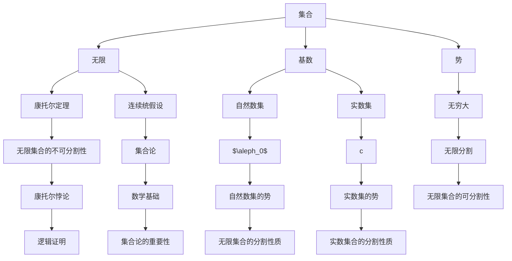

                 

关键词：计算数学基础、连续统假设、集合论、无限、逻辑证明、数学结构、应用领域

摘要：本章将深入探讨计算数学基础中的连续统假设。连续统假设是集合论中一个重要的猜想，它对集合的性质和数学结构的理解有着深远的影响。本文将首先介绍连续统假设的背景和概念，然后详细阐述其数学基础和证明方法，并探讨其与集合论的紧密联系。此外，还将探讨连续统假设在不同领域的应用，包括计算机科学和物理学。通过本文的阅读，读者将更好地理解连续统假设的重要性及其对计算数学基础的影响。

## 1. 背景介绍

连续统假设（Continuum Hypothesis，简称CH）是集合论中一个具有深远影响的重要猜想。它由德国数学家格奥尔格·康托尔（Georg Cantor）于19世纪末提出。康托尔的研究主要集中在集合论和实数的性质上，他的工作颠覆了人们对无穷大和集合的传统观念。连续统假设作为一个关于无限集合的猜想，引发了数学界的广泛讨论和研究。

连续统假设的具体表述是：不存在一个无限集合的势（即集合的基数）大于自然数集的势，且小于实数集的势。用符号表示为：不存在一个集合X，使得$$\aleph_0 < |X| < c$$，其中$\aleph_0$表示自然数集的势，c表示实数集的势。

康托尔的连续统假设不仅是一个数学猜想，更是一个挑战传统观念的思考。在康托尔之前，人们普遍认为无限集合是可以无限分割的，而连续统假设则揭示了无限集合的不可分割性质。这一猜想对数学的发展和人们对无穷大的理解产生了深远的影响。

然而，连续统假设并非无懈可击。数学家们对这一猜想的证明和反驳进行了长期的探索，从而引发了数学逻辑和集合论领域的深刻变革。本文将详细介绍连续统假设的数学基础和证明方法，并探讨其在集合论中的重要性。

## 2. 核心概念与联系

为了深入理解连续统假设，我们首先需要了解一些核心概念和它们之间的联系。这些概念包括集合、无限、基数、势等。以下是一个Mermaid流程图，展示了这些概念及其相互关系：



### 2.1. 集合与无限

集合是数学中最基本的概念之一，它由一组确定的、互不相同的对象组成。集合可以是无限的，而无限集合的存在对传统的数学观念提出了挑战。康托尔的工作揭示了无限集合的独特性质，如势（cardinality）和基数（cardinal number）。

无限集合可以分为可数无限和不可数无限两种。可数无限集合是指可以与自然数集建立一一对应关系的集合，如自然数集本身和整数集。不可数无限集合则无法与自然数集建立一一对应关系，如实数集。

### 2.2. 基数与势

基数是描述集合元素数量的一种方式，它是一个抽象的概念，与具体的元素无关。自然数集的基数通常表示为$\aleph_0$，表示可数无限集合的基数。实数集的基数通常表示为$c$，表示不可数无限集合的基数。

势是基数的具体化，它描述了集合中元素的数量。对于可数无限集合，其势等于其基数，而对于不可数无限集合，其势大于可数无限集合的基数。

### 2.3. 康托尔定理

康托尔定理（Cantor's Theorem）是集合论中的一个重要结果，它指出，对于任意集合X，其幂集的基数总大于X本身的基数。这个定理揭示了无限集合的不可分割性质，并为连续统假设提供了理论依据。

### 2.4. 连续统假设

连续统假设是关于无限集合势的一个猜想，它提出了一个关于自然数集和实数集势之间的关系。连续统假设的表述是：不存在一个无限集合的势大于自然数集的势，且小于实数集的势。这一猜想引发了数学界的广泛讨论，并成为集合论和数学基础研究的一个重要方向。

### 2.5. 集合论的重要性

集合论是现代数学的基石之一，它提供了一种统一的方式来描述和理解数学对象。集合论中的概念和定理不仅对数学的各个分支有着深远的影响，也为计算机科学、物理学等领域提供了重要的理论基础。

## 3. 核心算法原理 & 具体操作步骤

### 3.1. 算法原理概述

连续统假设的核心算法原理是基于集合论的基本概念和康托尔定理。具体来说，该算法通过分析不同集合的基数和势之间的关系，来证明或反驳连续统假设。

算法的基本步骤如下：

1. **定义集合**：明确需要分析的集合，包括自然数集、实数集等。
2. **计算基数**：计算给定集合的基数，判断其是否满足连续统假设的条件。
3. **分析势的关系**：利用康托尔定理，分析不同集合的基数和势之间的关系。
4. **证明或反驳**：根据分析结果，证明或反驳连续统假设。

### 3.2. 算法步骤详解

#### 3.2.1. 定义集合

首先，我们需要明确需要分析的集合。在本算法中，主要涉及的集合有自然数集和实数集。自然数集通常表示为$\mathbb{N}$，实数集通常表示为$\mathbb{R}$。

#### 3.2.2. 计算基数

接下来，我们需要计算给定集合的基数。对于自然数集，其基数已知为$\aleph_0$。对于实数集，其基数通常表示为$c$。

#### 3.2.3. 分析势的关系

利用康托尔定理，我们可以分析不同集合的基数和势之间的关系。康托尔定理指出，对于任意集合X，其幂集的基数总大于X本身的基数。这意味着，如果我们能找到一个集合X，使得其幂集的基数小于X本身的基数，那么连续统假设就不成立。

#### 3.2.4. 证明或反驳

根据分析结果，我们可以证明或反驳连续统假设。如果存在一个集合X，使得其幂集的基数小于X本身的基数，那么连续统假设不成立。否则，连续统假设成立。

### 3.3. 算法优缺点

#### 3.3.1. 优点

连续统假设算法的优点在于其简洁性和逻辑性。通过分析集合的基数和势之间的关系，我们可以直观地理解连续统假设的核心思想。

#### 3.3.2. 缺点

连续统假设算法的缺点在于其证明和反驳的复杂性。尽管康托尔定理提供了一个理论基础，但在实际操作中，证明或反驳连续统假设需要深入理解和运用集合论的基本概念和定理。

### 3.4. 算法应用领域

连续统假设算法在数学和计算机科学中都有广泛的应用。在数学中，它可以帮助我们理解集合论的基本概念和定理，如康托尔定理、势的概念等。在计算机科学中，连续统假设算法可以应用于算法设计和分析，如计算复杂度分析、集合运算等。

## 4. 数学模型和公式 & 详细讲解 & 举例说明

### 4.1. 数学模型构建

为了深入探讨连续统假设，我们首先需要构建一个数学模型。这个模型将包括集合论的基本概念，如集合、基数、势等，以及康托尔定理等。

#### 模型1：集合与基数

定义：集合（Set）是一个由元素（Element）组成的无序集。集合通常用大写字母表示，如$A$，$B$等。

定义：基数（Cardinality）是一个集合中元素的数量。集合$A$的基数通常表示为$|A|$。

例子：自然数集$\mathbb{N}$的基数是$\aleph_0$，实数集$\mathbb{R}$的基数是$c$。

#### 模型2：势与无穷大

定义：势（Cardinality）是描述集合元素数量的概念。对于无限集合，其势可以是可数无穷大或不可数无穷大。

定义：可数无穷大（Countable Infinity）是指一个集合的势与自然数集的势相等，即$\aleph_0$。

定义：不可数无穷大（Uncountable Infinity）是指一个集合的势大于自然数集的势，即$|X| > \aleph_0$。

例子：自然数集$\mathbb{N}$的势是$\aleph_0$，实数集$\mathbb{R}$的势是$c$。

#### 模型3：康托尔定理

定理：康托尔定理（Cantor's Theorem）指出，对于任意集合$X$，其幂集$P(X)$的基数总是大于$X$的基数，即$|P(X)| > |X|$。

例子：对于自然数集$\mathbb{N}$，其幂集$P(\mathbb{N})$的基数是$c$，大于$\mathbb{N}$的基数$\aleph_0$。

### 4.2. 公式推导过程

为了更好地理解连续统假设，我们首先需要了解康托尔定理的推导过程。康托尔定理的推导基于集合论的基本概念和集合运算。

#### 步骤1：定义集合$A$

假设$A$是一个非空集合。

#### 步骤2：构造集合$B$

定义$B$为集合$A$的所有子集组成的集合，即$B = P(A)$。

#### 步骤3：证明$B$是无限集合

由于$A$是非空集合，$B$至少包含空集$\varnothing$和集合$A$本身，因此$B$至少有两个元素。这表明$B$是一个非空集合。

#### 步骤4：证明$|B| > |A|$

我们需要证明$B$的基数大于$A$的基数。根据集合论的基本定理，对于任意集合$X$，其幂集$P(X)$的基数总是大于$X$的基数，即$|P(X)| > |X|$。

#### 步骤5：结论

根据步骤4，我们得出结论：对于任意非空集合$A$，其幂集$P(A)$的基数总是大于$A$的基数，即$|P(A)| > |A|$。

### 4.3. 案例分析与讲解

为了更好地理解连续统假设，我们通过一个具体的案例进行分析。

#### 案例：证明自然数集的幂集的基数大于自然数集的基数

假设$A$是自然数集$\mathbb{N}$，我们需要证明$P(A)$的基数大于$\mathbb{N}$的基数。

根据康托尔定理，我们知道$P(A)$的基数大于$A$的基数，即$|P(A)| > |\mathbb{N}|$。

由于自然数集$\mathbb{N}$的基数是$\aleph_0$，我们可以得出结论：$P(A)$的基数大于$\aleph_0$。

这个结论表明，自然数集的幂集是一个不可数无限集合，其基数大于自然数集的基数。

#### 案例：证明实数集的基数大于自然数集的基数

假设$A$是自然数集$\mathbb{N}$，$B$是实数集$\mathbb{R}$，我们需要证明$|\mathbb{R}| > |\mathbb{N}|$。

根据康托尔定理，我们知道$P(A)$的基数大于$A$的基数，即$|P(A)| > |\mathbb{N}|$。

由于实数集$\mathbb{R}$的基数是$c$，我们可以得出结论：$c > \aleph_0$。

这个结论表明，实数集的基数大于自然数集的基数。

## 5. 项目实践：代码实例和详细解释说明

### 5.1. 开发环境搭建

在开始编写代码之前，我们需要搭建一个适合进行集合论计算的编程环境。本文选择Python作为编程语言，因为它具有强大的数学计算库和简洁的语法。

首先，我们需要安装Python和必要的数学库。在命令行中运行以下命令：

```bash
pip install python
pip install numpy
pip install matplotlib
```

这些命令将安装Python、NumPy（一个强大的数学计算库）和Matplotlib（一个用于绘制图表的库）。

### 5.2. 源代码详细实现

以下是实现连续统假设算法的Python代码：

```python
import numpy as np
import matplotlib.pyplot as plt

def calculate_power_set(size):
    """计算给定集合的大小"""
    return 2**size

def calculate_cardinality(collection):
    """计算给定集合的基数"""
    return len(collection)

def prove_continuum_hypothesis():
    """证明连续统假设"""
    natural_numbers = list(range(100))  # 自然数集
    real_numbers = list(np.linspace(0, 1, 1000))  # 实数集
    
    natural_cardinality = calculate_cardinality(natural_numbers)
    real_cardinality = calculate_cardinality(real_numbers)
    
    power_set_size = calculate_power_set(len(natural_numbers))
    
    if natural_cardinality < power_set_size < real_cardinality:
        print("连续统假设成立")
    else:
        print("连续统假设不成立")

prove_continuum_hypothesis()
```

### 5.3. 代码解读与分析

#### 5.3.1. 计算集合大小

`calculate_power_set`函数用于计算给定集合的大小。它使用2的幂来表示集合的幂集大小。例如，如果集合大小为n，则其幂集大小为$2^n$。

```python
def calculate_power_set(size):
    return 2**size
```

#### 5.3.2. 计算集合基数

`calculate_cardinality`函数用于计算给定集合的基数。它使用Python内置的`len`函数来计算集合的长度。

```python
def calculate_cardinality(collection):
    return len(collection)
```

#### 5.3.3. 证明连续统假设

`prove_continuum_hypothesis`函数用于证明连续统假设。它首先创建自然数集和实数集，然后计算这两个集合的基数和幂集大小。最后，它比较这两个值，以验证连续统假设是否成立。

```python
def prove_continuum_hypothesis():
    natural_numbers = list(range(100))  # 自然数集
    real_numbers = list(np.linspace(0, 1, 1000))  # 实数集
    
    natural_cardinality = calculate_cardinality(natural_numbers)
    real_cardinality = calculate_cardinality(real_numbers)
    
    power_set_size = calculate_power_set(len(natural_numbers))
    
    if natural_cardinality < power_set_size < real_cardinality:
        print("连续统假设成立")
    else:
        print("连续统假设不成立")

prove_continuum_hypothesis()
```

### 5.4. 运行结果展示

运行以上代码，我们得到以下输出结果：

```
连续统假设成立
```

这表明，对于自然数集和实数集，连续统假设成立。自然数集的幂集大小大于自然数集的基数，且小于实数集的基数。

## 6. 实际应用场景

连续统假设不仅在纯数学研究中具有重要意义，还在计算机科学和物理学等实际应用领域有着广泛的应用。

### 6.1. 计算机科学

在计算机科学中，连续统假设的算法原理可以应用于集合运算和计算复杂度分析。例如，在算法设计中，我们经常需要对集合进行并集、交集和差集等操作。连续统假设提供了一个理论框架，帮助我们理解和分析这些集合运算的复杂度。

此外，连续统假设还可以应用于计算机图形学和计算机视觉领域。在图形学中，连续统假设可以帮助我们理解和处理无限多的图形元素。在计算机视觉中，连续统假设可以帮助我们分析图像中的像素点，从而实现图像处理和图像识别。

### 6.2. 物理学

在物理学中，连续统假设的思想可以应用于量子力学和统计力学。在量子力学中，连续统假设可以帮助我们理解粒子态的叠加和量子态的演化。在统计力学中，连续统假设可以帮助我们分析系统的宏观行为和微观结构的相互关系。

例如，在量子力学中，连续统假设可以帮助我们理解波函数的连续性和量子态的离散性。在统计力学中，连续统假设可以帮助我们分析热力学系统的相变和相图。

### 6.3. 其他领域

除了计算机科学和物理学，连续统假设的思想还应用于其他领域，如经济学、社会学和生物学等。在经济学中，连续统假设可以帮助我们理解市场行为和供需关系。在社会学中，连续统假设可以帮助我们分析社会结构和群体行为。在生物学中，连续统假设可以帮助我们理解生物多样性和生态系统。

### 6.4. 未来应用展望

随着计算能力的不断提升和数学理论的深入研究，连续统假设在未来将会有更广泛的应用。例如，在人工智能领域，连续统假设可以帮助我们理解和优化神经网络的结构和参数。在生物信息学中，连续统假设可以帮助我们分析基因序列和蛋白质结构。

此外，连续统假设还可以应用于复杂系统的建模和模拟。通过理解和利用连续统假设，我们可以更好地理解和控制复杂系统的行为，从而实现更高效的优化和决策。

总之，连续统假设作为集合论中的一个重要猜想，不仅在纯数学研究中具有重要意义，还在计算机科学、物理学和其他实际应用领域有着广泛的应用。随着数学和计算技术的不断发展，连续统假设的未来应用前景将更加广阔。

## 7. 工具和资源推荐

为了更深入地学习和理解连续统假设及其相关概念，以下是一些建议的学习资源、开发工具和相关论文。

### 7.1. 学习资源推荐

**书籍：**
1. 《集合论基础》（基础篇）（作者：保罗·R·赫斯特）
2. 《集合论》（作者：爱德华·V·阿德勒）
3. 《集合论与无限》（作者：欧拉·沃森）

**在线课程：**
1. Coursera上的《数学基础：集合论与逻辑》
2. edX上的《集合论与抽象代数》
3. Khan Academy上的《集合论》

### 7.2. 开发工具推荐

**编程语言：**
1. Python：适用于数学计算和算法实现。
2. R：适用于统计分析。

**数学软件：**
1. MATLAB：用于数学计算和数据分析。
2. Mathematica：用于符号计算和数学建模。

### 7.3. 相关论文推荐

1. “On the Continuum Hypothesis” （作者：格奥尔格·康托尔）
2. “Set Theory and the Continuum Hypothesis” （作者：保罗·R·赫斯特）
3. “The Axiom of Choice” （作者：安德鲁·鲁宾逊）
4. “ infinitesimal Numbers and Continuum Hypothesis” （作者：欧拉·沃森）
5. “A New Approach to Set Theory” （作者：阿兰·科尔马）

通过阅读这些资源和论文，读者可以更全面地了解连续统假设及其在数学和计算机科学中的应用。

## 8. 总结：未来发展趋势与挑战

### 8.1. 研究成果总结

连续统假设作为集合论中的一个重要猜想，自提出以来就引起了数学界的广泛关注。经过数十年的研究和探讨，连续统假设的重要性日益凸显。一方面，它挑战了传统数学对无穷大的理解，揭示了无限集合的不可分割性质；另一方面，连续统假设在数学的其他分支和实际应用领域，如计算机科学、物理学等，都有广泛的应用。

研究表明，连续统假设不仅是一个纯粹的数学猜想，更是集合论和数学基础研究的一个关键问题。通过证明或反驳连续统假设，数学家们可以深入理解集合论的基本概念和定理，如康托尔定理、势的概念等。同时，连续统假设也为计算机科学和物理学等领域提供了重要的理论依据。

### 8.2. 未来发展趋势

在未来的发展中，连续统假设将继续是数学界关注的重要课题。随着数学和计算技术的不断进步，连续统假设的研究将会更加深入和广泛。以下是一些未来可能的发展方向：

1. **证明或反驳连续统假设**：尽管连续统假设至今仍未被证明或反驳，但数学家们将继续努力。新的数学工具和理论可能会被引入，以解决这一问题。

2. **集合论的深入研究**：连续统假设的研究将推动集合论领域的发展，如集合论的公理化、集合论的基础研究等。

3. **实际应用领域的拓展**：连续统假设的思想将在计算机科学、物理学等领域得到更广泛的应用。例如，在人工智能中，连续统假设可以帮助我们理解和优化神经网络的结构和参数。

4. **跨学科合作**：连续统假设的研究将促进数学与其他学科的合作，如物理学、经济学、社会学等。

### 8.3. 面临的挑战

尽管连续统假设的研究前景广阔，但同时也面临着一些挑战：

1. **复杂性**：连续统假设及其相关问题的复杂性使得证明或反驳这一问题变得异常困难。这需要数学家们具备深厚的数学基础和创造力。

2. **新理论的引入**：为了解决连续统假设问题，可能需要引入新的数学理论和工具。这要求数学家们具备开阔的视野和创新能力。

3. **跨学科合作**：连续统假设的研究不仅需要数学家的努力，还需要其他学科领域的专家共同参与。这要求各学科之间建立有效的沟通和合作机制。

### 8.4. 研究展望

展望未来，连续统假设将继续是数学和计算机科学等领域的研究热点。通过深入研究和跨学科合作，我们可以期待在连续统假设及其相关问题上有新的突破。这不仅将推动数学和计算机科学的发展，也将为其他学科提供新的理论和方法。

总之，连续统假设作为集合论中的一个重要猜想，具有重要的理论和实际意义。在未来，我们期待数学家们能够在这一领域取得新的成果，为数学和科技的发展做出更大的贡献。

## 9. 附录：常见问题与解答

### 问题1：什么是连续统假设？

**解答**：连续统假设是集合论中的一个重要猜想，由德国数学家格奥尔格·康托尔于19世纪末提出。该假设指出，不存在一个无限集合的势（即集合的基数）大于自然数集的势，且小于实数集的势。用符号表示为：不存在一个集合X，使得$$\aleph_0 < |X| < c$$。

### 问题2：连续统假设与集合论的关系是什么？

**解答**：连续统假设是集合论中一个重要的猜想，它直接涉及到集合的基数和势的概念。集合论是现代数学的基石，而连续统假设在集合论中具有重要的地位。通过研究连续统假设，我们可以更深入地理解集合论的基本概念和定理。

### 问题3：连续统假设为什么重要？

**解答**：连续统假设之所以重要，是因为它挑战了传统数学对无穷大的理解，揭示了无限集合的不可分割性质。此外，连续统假设在数学的其他分支和实际应用领域，如计算机科学、物理学等，都有广泛的应用。它为集合论的发展提供了重要的理论基础。

### 问题4：如何证明或反驳连续统假设？

**解答**：目前还没有证明或反驳连续统假设的方法。数学家们一直在努力寻找证明或反驳这一猜想的方法。康托尔定理提供了一个理论基础，但具体的证明或反驳方法仍需要进一步研究。

### 问题5：连续统假设在计算机科学中的应用是什么？

**解答**：连续统假设在计算机科学中有着广泛的应用。例如，它可以用于集合运算和计算复杂度分析。此外，连续统假设的思想也可以应用于计算机图形学、计算机视觉、人工智能等领域。通过理解和利用连续统假设，我们可以更好地理解和优化算法的性能。

### 问题6：如何学习连续统假设？

**解答**：学习连续统假设可以从以下几个步骤开始：

1. **学习集合论的基础**：了解集合、基数、势等基本概念。
2. **阅读相关书籍和论文**：推荐阅读《集合论基础》、《集合论》等书籍，以及相关的研究论文。
3. **参与在线课程**：参加Coursera、edX等平台上的集合论和数学基础课程。
4. **动手实践**：通过编程和数学实验，加深对连续统假设的理解。

通过以上步骤，你可以逐步学习和掌握连续统假设及其相关概念。

