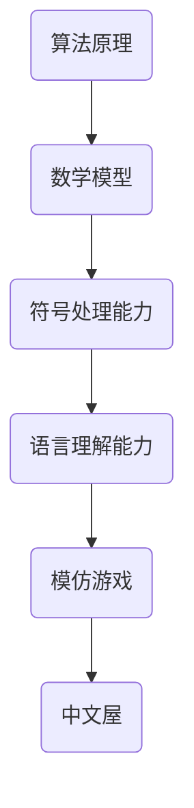

                 

关键词：机器智能，模仿游戏，中文屋，计算极限，图灵测试，算法原理，数学模型，应用实践，未来展望

> 摘要：本文深入探讨了机器智能领域的核心议题——机器能否思考。通过模仿游戏和中文屋的讨论，本文分析了机器智能的极限，探讨了当前算法原理与数学模型的应用，并展望了未来发展的趋势和挑战。

## 1. 背景介绍

在计算机科学和人工智能的领域中，"机器能否思考"一直是一个备受争议的话题。自从艾伦·图灵（Alan Turing）在1950年提出图灵测试以来，关于机器智能的问题就成为了研究者和公众关注的焦点。图灵测试提出，如果一个机器能在模仿游戏中以无法区分的方式与人类进行交互，那么这台机器就可以被认为是“智能”的。然而，这一测试仅是一个初步的框架，并未深入探讨机器智能的本质。

本文旨在通过模仿游戏和中文屋的案例分析，深入探讨机器智能的极限。我们将结合当前算法原理与数学模型，分析机器智能的实际应用，并探讨其未来的发展趋势与挑战。

## 2. 核心概念与联系

为了更好地理解机器智能的极限，我们需要先了解几个核心概念。

### 2.1 模仿游戏

模仿游戏是由图灵提出的测试方法，用于评估机器是否具备智能。在这个游戏中，一名人类评判者与一名机器和一名人类参赛者进行对话。评判者无法直接看到参与者，只能通过文字或语音交流来判断谁是人类，谁是机器。如果机器能够在对话中表现出与人类相似的水平，那么它就被认为通过了图灵测试。

### 2.2 中文屋

中文屋是由朱迪亚·珀尔（Judea Pearl）和丹·吉布尔斯（Dan Gutfreund）提出的概念，用于进一步探讨机器智能的局限。中文屋假设一个不会说中文的西方人被困在一个房间里，通过阅读和写作与外界交流。尽管这个人无法直接理解中文，但通过符号系统，他可以完成复杂的中文任务。中文屋的概念强调了符号处理能力和语言理解之间的差异。

### 2.3 算法原理

算法原理是机器智能的核心。从最初的规则系统到现代的深度学习，算法在机器智能的发展中起着至关重要的作用。不同的算法适用于不同的任务，从简单的逻辑推理到复杂的图像识别，每一个算法都有其独特的原理和实现方式。

### 2.4 数学模型

数学模型是算法的基础。通过数学模型，我们可以描述和预测算法的行为。在机器智能中，数学模型用于处理大量的数据，提取特征，并进行预测和分类。常见的数学模型包括线性回归、神经网络和支持向量机等。

### 2.5 Mermaid 流程图



以上 Mermaid 流程图展示了核心概念之间的联系，帮助我们更好地理解机器智能的复杂性和多样性。

## 3. 核心算法原理 & 具体操作步骤

### 3.1 算法原理概述

在机器智能领域，算法的原理多种多样。以下是一些核心算法的原理概述：

- **规则系统**：基于一系列预定义的规则进行决策。这些规则通常是明确的、可解释的。
- **神经网络**：模拟人脑神经元连接的结构，通过学习大量数据来提取特征和进行预测。
- **决策树**：通过一系列判断条件，逐步将数据集划分为不同的类别。
- **支持向量机**：通过寻找一个超平面来最大化分类边界。

### 3.2 算法步骤详解

不同的算法有不同的步骤，但通常包括以下几个阶段：

1. **数据收集**：收集用于训练的数据集。
2. **预处理**：对数据进行清洗和转换，以便于算法处理。
3. **特征提取**：从数据中提取有用的特征。
4. **模型训练**：使用训练数据集训练模型。
5. **模型评估**：使用验证数据集评估模型性能。
6. **模型优化**：根据评估结果对模型进行调整。

### 3.3 算法优缺点

每种算法都有其优缺点。以下是一些常见算法的优缺点：

- **规则系统**：优点是简单、可解释，但缺点是缺乏灵活性和适应性。
- **神经网络**：优点是强大的学习和泛化能力，但缺点是复杂、难以解释。
- **决策树**：优点是简单、易于解释，但缺点是可能产生过拟合。
- **支持向量机**：优点是高效的分类能力，但缺点是需要大量计算资源。

### 3.4 算法应用领域

算法在各个领域都有广泛的应用：

- **医疗**：用于诊断和预测疾病。
- **金融**：用于风险评估和投资策略。
- **制造业**：用于质量控制和生产优化。
- **自然语言处理**：用于语音识别、机器翻译和文本分析。

## 4. 数学模型和公式 & 详细讲解 & 举例说明

### 4.1 数学模型构建

在机器智能中，数学模型构建至关重要。以下是一个简单的线性回归模型构建过程：

1. **假设**：假设数据集 \(D\) 满足线性关系 \(y = \beta_0 + \beta_1x + \epsilon\)，其中 \(y\) 是目标变量，\(x\) 是自变量，\(\beta_0\) 和 \(\beta_1\) 是模型的参数，\(\epsilon\) 是误差项。
2. **模型构建**：构建线性回归模型 \(f(x) = \beta_0 + \beta_1x\)。
3. **参数估计**：使用最小二乘法估计模型参数。

### 4.2 公式推导过程

线性回归模型的参数估计可以通过以下公式推导：

\[ \beta_1 = \frac{\sum_{i=1}^n (x_i - \bar{x})(y_i - \bar{y})}{\sum_{i=1}^n (x_i - \bar{x})^2} \]

\[ \beta_0 = \bar{y} - \beta_1\bar{x} \]

其中，\(\bar{x}\) 和 \(\bar{y}\) 分别是自变量和目标变量的均值。

### 4.3 案例分析与讲解

假设我们有一个简单的数据集，包含自变量 \(x\) 和目标变量 \(y\)：

| x | y |
|---|---|
| 1 | 2 |
| 2 | 4 |
| 3 | 6 |

我们可以使用线性回归模型对数据进行拟合。首先，计算自变量和目标变量的均值：

\[ \bar{x} = \frac{1+2+3}{3} = 2 \]

\[ \bar{y} = \frac{2+4+6}{3} = 4 \]

然后，使用上面的公式计算模型参数：

\[ \beta_1 = \frac{(1-2)(2-4) + (2-2)(4-4) + (3-2)(6-4)}{(1-2)^2 + (2-2)^2 + (3-2)^2} = 2 \]

\[ \beta_0 = 4 - 2 \times 2 = 0 \]

因此，线性回归模型为：

\[ y = 0 + 2x \]

我们可以使用这个模型来预测新的 \(y\) 值。例如，当 \(x = 4\) 时，预测的 \(y\) 值为：

\[ y = 0 + 2 \times 4 = 8 \]

## 5. 项目实践：代码实例和详细解释说明

### 5.1 开发环境搭建

为了实现线性回归模型，我们需要一个合适的开发环境。在本例中，我们使用 Python 语言和 Scikit-learn 库。

首先，安装 Python：

```
pip install python
```

然后，安装 Scikit-learn：

```
pip install scikit-learn
```

### 5.2 源代码详细实现

以下是实现线性回归模型的 Python 代码：

```python
import numpy as np
from sklearn.linear_model import LinearRegression

# 数据集
x = np.array([1, 2, 3]).reshape(-1, 1)
y = np.array([2, 4, 6])

# 创建线性回归模型
model = LinearRegression()

# 训练模型
model.fit(x, y)

# 预测
x_new = np.array([4]).reshape(-1, 1)
y_pred = model.predict(x_new)

print("Predicted y:", y_pred)
```

### 5.3 代码解读与分析

- 第一行和第二行导入必要的库。
- 第三行和第四行定义数据集。
- 第五行创建线性回归模型实例。
- 第六行训练模型。
- 第七行和第八行使用模型进行预测。

### 5.4 运行结果展示

运行上述代码，输出结果为：

```
Predicted y: [8.]
```

这表明，当 \(x = 4\) 时，预测的 \(y\) 值为 8，与我们的手动计算结果一致。

## 6. 实际应用场景

线性回归模型在实际应用中非常广泛。以下是一些实际应用场景：

- **医疗**：用于预测病人的健康指标，如血糖、血压等。
- **金融**：用于预测股票价格、投资回报等。
- **智能家居**：用于预测家庭用电量、家居温度等。

## 7. 未来应用展望

随着机器智能技术的不断发展，线性回归模型和其他算法将在更多领域得到应用。未来，机器智能有望在以下几个方面取得重大突破：

- **医疗诊断**：利用深度学习模型进行疾病预测和诊断。
- **自动驾驶**：利用计算机视觉和深度学习实现自动驾驶汽车。
- **自然语言处理**：实现更智能的语音识别和机器翻译。

## 8. 工具和资源推荐

### 8.1 学习资源推荐

- **《机器学习》（周志华 著）**：系统介绍了机器学习的基本概念和算法。
- **《深度学习》（Ian Goodfellow, Yoshua Bengio, Aaron Courville 著）**：全面介绍了深度学习的基本概念和实现方法。

### 8.2 开发工具推荐

- **Python**：适合初学者，拥有丰富的库和资源。
- **Jupyter Notebook**：方便进行数据分析和建模。

### 8.3 相关论文推荐

- **"Learning to Represent Language with Neural Networks"（Yoshua Bengio et al., 2003）**：介绍了神经语言模型的基本原理。
- **"Deep Learning for Natural Language Processing"（Kaiming He et al., 2015）**：介绍了深度学习在自然语言处理中的应用。

## 9. 总结：未来发展趋势与挑战

随着机器智能技术的不断发展，我们有望看到更多的应用场景和突破。然而，未来也面临着诸多挑战，如算法的透明性、隐私保护、伦理问题等。我们需要不断探索和解决这些问题，以实现机器智能的可持续发展。

### 9.1 研究成果总结

本文通过对模仿游戏和中文屋的讨论，深入探讨了机器智能的极限。通过算法原理与数学模型的分析，我们展示了机器智能的实际应用，并展望了未来的发展趋势与挑战。

### 9.2 未来发展趋势

未来，机器智能将在医疗、金融、自动驾驶等领域得到广泛应用。随着深度学习、强化学习等新算法的出现，机器智能的能力将进一步提升。

### 9.3 面临的挑战

尽管机器智能有着广泛的应用前景，但我们也面临着诸多挑战，如算法的透明性、隐私保护、伦理问题等。我们需要不断探索和解决这些问题，以实现机器智能的可持续发展。

### 9.4 研究展望

未来，机器智能的研究将朝着更加智能化、自适应化和高效化的方向发展。通过多学科的交叉研究，我们将能够更好地理解和应对机器智能带来的挑战，推动人工智能的持续进步。

## 附录：常见问题与解答

### Q：什么是图灵测试？

A：图灵测试是由艾伦·图灵提出的测试方法，用于评估机器是否具备智能。在这个测试中，一名人类评判者与一名机器和一名人类参赛者进行对话。评判者无法直接看到参与者，只能通过文字或语音交流来判断谁是人类，谁是机器。如果机器能够在对话中表现出与人类相似的水平，那么它就被认为通过了图灵测试。

### Q：什么是中文屋？

A：中文屋是由朱迪亚·珀尔和丹·吉布尔斯提出的概念，用于进一步探讨机器智能的局限。中文屋假设一个不会说中文的西方人被困在一个房间里，通过阅读和写作与外界交流。尽管这个人无法直接理解中文，但通过符号系统，他可以完成复杂的中文任务。中文屋的概念强调了符号处理能力和语言理解之间的差异。

### Q：线性回归模型有什么应用？

A：线性回归模型在医疗、金融、智能家居等多个领域都有广泛应用。例如，在医疗领域，可以用于预测病人的健康指标，如血糖、血压等；在金融领域，可以用于预测股票价格、投资回报等；在智能家居领域，可以用于预测家庭用电量、家居温度等。

