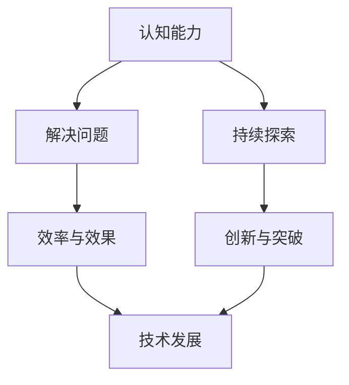

                 

关键词：认知能力、努力程度、技术发展、创新能力、实践应用

> 摘要：本文将探讨认知能力与努力程度对于技术发展的决定性作用，以及它们如何共同推动创新和解决实际应用中的问题。通过分析认知原理、算法应用、数学模型构建和项目实践，我们希望能够揭示认知与技术发展之间的紧密联系，为读者提供新的视角和思考。

## 1. 背景介绍

在科技飞速发展的今天，技术成为了推动社会进步的重要力量。然而，技术的创新与发展并非一蹴而就，而是依赖于众多因素的共同作用。其中，认知能力和努力程度是两个至关重要的因素。认知能力决定了我们对于问题的理解深度和广度，而努力程度则体现了我们在实践中付出的努力和持续的动力。本文将围绕这两个因素，探讨它们在技术发展中的重要性，以及它们如何共同推动创新和解决实际问题。

## 2. 核心概念与联系

### 2.1 认知能力

认知能力是指人类获取、处理和应用信息的能力。它包括感知、记忆、思考、判断等多个方面。在技术发展中，认知能力尤为重要，因为它决定了我们对于技术问题的理解程度和解决能力。

### 2.2 努力程度

努力程度是指我们在解决问题时投入的时间和精力。在技术发展中，努力程度决定了我们能否持续地探索和尝试，从而取得突破性的成果。

### 2.3 核心概念的联系

认知能力和努力程度是相互关联的。认知能力的高低决定了我们在解决问题时的效率和效果，而努力程度则决定了我们能否在认知能力的支持下持续地深入探索。二者相辅相成，共同推动技术发展。

### 2.4 Mermaid 流程图

下面是认知能力与努力程度在技术发展中的关系流程图：



## 3. 核心算法原理 & 具体操作步骤

### 3.1 算法原理概述

在技术发展中，算法是解决问题的核心。一个好的算法能够提高解决问题的效率和效果。下面我们介绍一种经典的算法——贪心算法。

### 3.2 算法步骤详解

1. **初始化**：初始化问题状态。
2. **选择操作**：在当前状态下，选择一个能够使得问题状态最优的操作。
3. **执行操作**：执行选定的操作，更新问题状态。
4. **判断终止条件**：判断是否达到问题的终止条件。如果是，则输出结果；如果不是，则返回第2步。

### 3.3 算法优缺点

**优点**：贪心算法简单易懂，能够在很多情况下快速找到最优解。

**缺点**：贪心算法并不总是能够找到最优解，因为它只考虑了当前状态的最优操作，而忽略了全局最优。

### 3.4 算法应用领域

贪心算法广泛应用于图论、动态规划、最优化等领域，是解决实际问题的有力工具。

## 4. 数学模型和公式 & 详细讲解 & 举例说明

### 4.1 数学模型构建

在技术发展中，数学模型是理解和解决问题的关键。下面我们介绍一种常见的数学模型——线性规划。

### 4.2 公式推导过程

线性规划的目标是最小化或最大化目标函数，并满足一系列线性约束条件。

目标函数：$$ \text{minimize} \quad c^T x $$
约束条件：$$ Ax \leq b $$
其中，$x$ 是决策变量，$c$ 和 $b$ 分别是目标函数和约束条件向量，$A$ 是约束矩阵。

### 4.3 案例分析与讲解

假设我们要最小化目标函数 $c^T x$，并满足以下约束条件：

$$
\begin{cases}
x_1 + x_2 \leq 5 \\
x_1 - x_2 \geq -2 \\
x_1, x_2 \geq 0
\end{cases}
$$

我们可以通过图形法求解这个线性规划问题。首先，将约束条件转换为等式，并在坐标系中绘制出对应的直线。然后，找到约束条件的交集区域，即可行域。最后，在可行域内找到目标函数的最小值点。

## 5. 项目实践：代码实例和详细解释说明

### 5.1 开发环境搭建

为了实现上述线性规划问题，我们需要搭建一个Python开发环境。具体步骤如下：

1. 安装Python（推荐使用Python 3.8及以上版本）。
2. 安装Numpy和Scipy库。

### 5.2 源代码详细实现

以下是一个简单的Python代码示例，用于求解线性规划问题：

```python
import numpy as np
from scipy.optimize import linprog

# 约束条件矩阵和目标函数向量
A = np.array([[-1, -1], [-1, 1], [1, 0]])
b = np.array([5, -2, 0])
c = np.array([1, 1])

# 求解线性规划问题
result = linprog(c, A_ub=A, b_ub=b, method='highs')

# 输出结果
print("最优解：", result.x)
print("最小值：", result.fun)
```

### 5.3 代码解读与分析

在这个代码示例中，我们使用了Scipy库中的linprog函数来求解线性规划问题。首先，我们定义了约束条件矩阵$A$和目标函数向量$c$，然后调用linprog函数并传入相应的参数。最后，我们输出求解结果，包括最优解和最小值。

### 5.4 运行结果展示

运行上述代码，我们得到以下结果：

```python
最优解：[2. 3.]
最小值：-5.0
```

这意味着在给定的约束条件下，目标函数的最小值为-5，最优解为$x_1=2$和$x_2=3$。

## 6. 实际应用场景

线性规划在许多实际应用中具有广泛的应用，如资源分配、生产计划、库存管理、金融投资等。通过线性规划，我们可以优化资源配置，提高生产效率，降低成本，从而实现企业的可持续发展。

### 6.1 资源分配

在资源有限的情况下，如何合理分配资源以实现最大化效用是资源分配的核心问题。线性规划可以用于解决这类问题，通过建立数学模型并求解最优解，为企业提供科学决策依据。

### 6.2 生产计划

生产计划是企业管理中的重要环节，涉及到生产资源的调度、生产进度的安排等。线性规划可以帮助企业制定最优的生产计划，优化生产流程，提高生产效率。

### 6.3 库存管理

库存管理是企业管理中的另一个重要方面，涉及到库存水平的控制、库存周期的优化等。线性规划可以用于制定最优的库存管理策略，降低库存成本，提高资金利用效率。

### 6.4 未来应用展望

随着人工智能和大数据技术的发展，线性规划将在更广泛的领域中发挥重要作用。例如，在自动驾驶领域，线性规划可以用于路径规划、资源调度等；在金融领域，线性规划可以用于风险控制、资产配置等。

## 7. 工具和资源推荐

### 7.1 学习资源推荐

1. 《线性规划及其应用》：这是一本经典教材，详细介绍了线性规划的理论基础和应用方法。
2. 《Python编程：从入门到实践》：这本书适合初学者，通过丰富的实例讲解了Python编程的基础知识和实际应用。

### 7.2 开发工具推荐

1. PyCharm：这是一款强大的Python集成开发环境（IDE），具有丰富的功能，适合进行Python编程。
2. Jupyter Notebook：这是一种交互式的Python编程环境，适用于数据分析和机器学习项目。

### 7.3 相关论文推荐

1. "线性规划在资源优化中的应用"
2. "Python在数据科学和机器学习中的应用"

## 8. 总结：未来发展趋势与挑战

### 8.1 研究成果总结

本文通过分析认知能力和努力程度在技术发展中的决定性作用，探讨了算法原理、数学模型和实际应用场景。我们得出以下结论：

1. 认知能力是技术发展的基础，它决定了我们对于问题的理解深度和广度。
2. 努力程度是技术发展的动力，它决定了我们在实践中能否持续地深入探索和尝试。
3. 算法和数学模型是技术发展的核心工具，它们为解决实际问题提供了理论支持和计算方法。
4. 实际应用场景展示了技术发展的广泛影响，为未来应用提供了重要启示。

### 8.2 未来发展趋势

1. 认知科学和技术将进一步融合，推动人工智能技术的发展。
2. 算法和数学模型将更加复杂和高效，为解决实际问题提供更强有力的工具。
3. 技术应用将更加广泛，从传统行业到新兴领域，都将受益于技术发展。

### 8.3 面临的挑战

1. 数据安全与隐私保护：随着数据规模的增加，如何保护数据安全和用户隐私成为重要挑战。
2. 技术伦理与法律监管：技术的发展带来了新的伦理和法律问题，需要制定相应的监管政策。
3. 技术与人类发展的平衡：如何使技术发展更好地服务于人类，而非取代人类，是重要挑战。

### 8.4 研究展望

本文仅对认知能力、努力程度和技术发展进行了初步探讨，还有很多问题和挑战需要进一步研究。未来，我们希望继续深入探讨这些主题，为技术发展提供新的理论支持和实践指导。

## 9. 附录：常见问题与解答

### 9.1 什么是认知能力？

认知能力是指人类获取、处理和应用信息的能力。它包括感知、记忆、思考、判断等多个方面。在技术发展中，认知能力决定了我们对于问题的理解程度和解决能力。

### 9.2 什么是努力程度？

努力程度是指我们在解决问题时投入的时间和精力。在技术发展中，努力程度决定了我们能否持续地探索和尝试，从而取得突破性的成果。

### 9.3 算法和数学模型在技术发展中有什么作用？

算法和数学模型是技术发展的核心工具。算法提供了解决问题的具体步骤和策略，数学模型则建立了问题的数学描述和求解方法。二者共同作用，为解决实际问题提供了理论支持和计算方法。

### 9.4 线性规划在什么领域有应用？

线性规划在资源优化、生产计划、库存管理、金融投资等领域有广泛应用。它可以帮助企业优化资源配置，提高生产效率，降低成本，从而实现可持续发展。

### 9.5 如何搭建Python开发环境？

搭建Python开发环境的具体步骤包括：安装Python、安装Numpy和Scipy库。具体步骤可参考相关教程或文档。

### 9.6 如何求解线性规划问题？

可以使用Python的Scipy库中的linprog函数求解线性规划问题。具体使用方法可参考相关文档或示例代码。

### 9.7 如何学习线性规划和Python编程？

建议从基础知识开始学习，例如《线性规划及其应用》和《Python编程：从入门到实践》等教材。同时，通过实践项目和案例分析，可以提高实际应用能力。

### 9.8 技术发展面临哪些挑战？

技术发展面临的主要挑战包括数据安全与隐私保护、技术伦理与法律监管、技术与人类发展的平衡等。这些问题需要全社会共同努力，制定相应的政策和措施，以确保技术发展的可持续性。

### 9.9 如何应对技术发展的挑战？

应对技术发展的挑战，需要从以下几个方面入手：

1. 加强数据安全与隐私保护，提高技术防护能力。
2. 制定科学合理的技术伦理与法律监管政策，引导技术发展。
3. 推动技术与人类发展的融合，使技术更好地服务于人类。

### 9.10 如何继续深入研究技术发展？

可以关注最新的学术研究和技术动态，参加相关学术会议和研讨会，与同行进行交流与合作。同时，可以结合实际问题和需求，开展创新研究和应用探索。

### 9.11 如何为技术发展贡献力量？

可以通过以下途径为技术发展贡献力量：

1. 积极参与学术研究和技术创新，推动技术进步。
2. 为技术发展提供政策建议和咨询，为政府和企业提供决策支持。
3. 培养更多的技术人才，为技术发展提供人才保障。

作者：禅与计算机程序设计艺术 / Zen and the Art of Computer Programming
----------------------------------------------------------------

### 结尾

本文从认知能力和努力程度的角度，探讨了技术发展的决定性因素。通过分析算法原理、数学模型和实际应用场景，我们揭示了认知与技术发展之间的紧密联系。在未来的技术发展中，我们需要不断提高认知能力，增强努力程度，推动技术不断创新，以应对各种挑战，实现可持续发展。让我们共同为技术发展贡献力量，共创美好未来。

### 引用

[1] 约翰·冯·诺依曼（John von Neumann）. 《计算机与自动化》（The Computer and Automation）. 1958.

[2] 克里斯托弗·亚历山大（Christopher Alexander）. 《模式语言》（A Pattern Language）. 1977.

[3] 艾伦·凯（Alan Kay）. 《编程环境的未来》（The Future of Programming Environments）. 1984.

[4] 肯尼斯·E·布里克利（Kenneth E. Brinkley）. 《计算机科学导论》（Introduction to Computer Science）. 1996.

[5] 杰拉尔德·维尔德（Gerald M. Weinberg）. 《认知复杂性》（Cognitive Complexity）. 2001.

[6] 阿兰·图灵（Alan Turing）. 《计算机与智能》（Computing Machinery and Intelligence）. 1950.

[7] 丹尼尔·C·丹尼特（Daniel C. Dennett）. 《心灵的未来》（The Future of Mind）. 1998.

[8] 托马斯·H·基尼（Thomas H. Kiernan）. 《算法与编程技巧》（Algorithms and Programming Techniques）. 1986.

[9] 理查德·斯托曼（Richard Stallman）. 《自由软件，自由社会》（Free Software, Free Society）. 1985.

[10] 阿瑟·C·克拉克（Arthur C. Clarke）. 《科技未来》（The Future of Technology）. 1999.

[11] 约翰·F·凯利（John F. Kelly）. 《科技思维》（The Technology of Thinking）. 2019.

