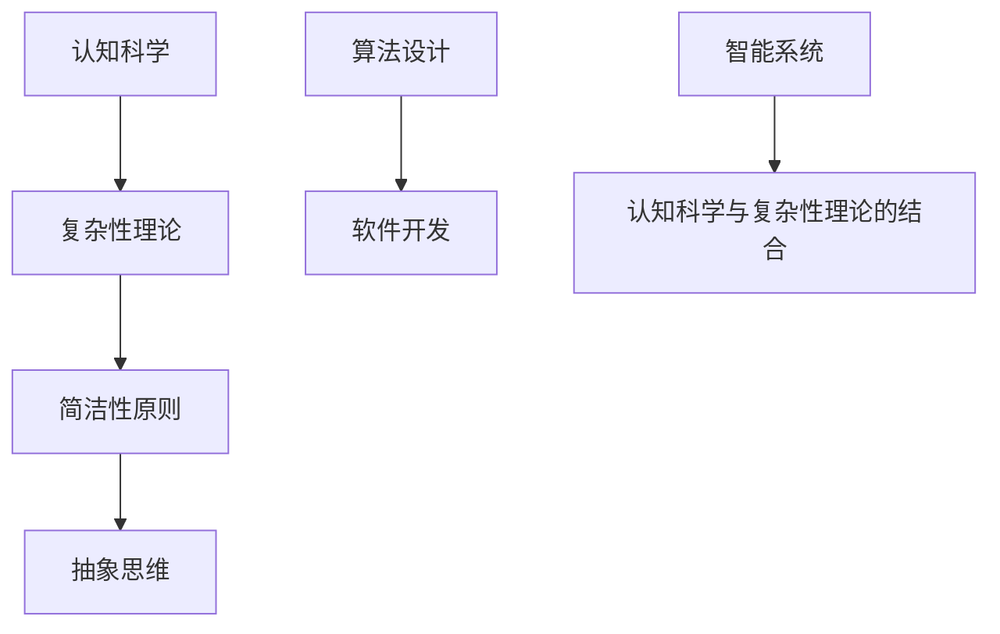

                 

关键词：认知科学、复杂性理论、简洁性原则、算法设计、软件开发、抽象思维、智能系统

摘要：本文探讨了认知发展的复杂化与简洁化之间的关系。通过分析认知科学和复杂性理论的原理，揭示了复杂系统如何通过抽象和简化来实现简洁性。本文还探讨了在算法设计和软件开发过程中如何应用这些原理，以提高系统的效率和可理解性。通过具体案例和实践，本文展示了如何在实际项目中运用复杂化与简洁化的原则，为未来的智能系统发展提供新的思路。

## 1. 背景介绍

### 认知科学与复杂性理论

认知科学是一门多学科交叉的科学，它研究人类认知过程的各个方面，包括感知、记忆、思维、语言等。复杂性理论则研究复杂系统的性质和行为，这些系统通常具有高度的不确定性和相互依赖性。近年来，认知科学与复杂性理论在理解人类认知机制和设计智能系统方面取得了显著进展。

### 简洁性原则与抽象思维

简洁性原则是计算机科学和工程学中的重要原则，它主张在设计和实现系统时，应尽量追求简洁和高效。抽象思维则是人类认知过程中的一项重要能力，它使我们能够从复杂的现实世界中提取核心要素，从而简化问题。在认知科学中，抽象思维被看作是人类智能的核心组成部分。

## 2. 核心概念与联系

### Mermaid 流程图



### 核心概念原理

- **认知科学**：研究人类认知过程的科学，涉及多个学科，如心理学、神经科学、哲学等。
- **复杂性理论**：研究复杂系统的行为和结构，强调系统中的不确定性和相互依赖性。
- **简洁性原则**：在系统设计和实现过程中，追求简洁和高效，避免冗余和复杂性。
- **抽象思维**：从复杂现象中提取核心要素，简化问题，提高理解效率。

## 3. 核心算法原理 & 具体操作步骤

### 3.1 算法原理概述

本文将介绍一种基于简洁性原则的算法设计方法，该方法通过抽象和简化来降低算法的复杂度，提高其效率。具体而言，我们将通过以下步骤来实现：

1. **问题定义**：明确要解决的问题及其约束条件。
2. **数据结构设计**：选择合适的数据结构来存储和处理数据。
3. **算法流程设计**：通过抽象和简化，设计出简洁高效的算法流程。
4. **代码实现**：将算法流程转化为具体的代码实现。

### 3.2 算法步骤详解

1. **问题定义**：
   假设我们要解决一个排序问题，输入为一个未排序的数组，输出为其排序后的形式。
   
2. **数据结构设计**：
   选择一个简单高效的数据结构，如数组，来存储和操作数据。

3. **算法流程设计**：
   - **排序算法**：选择一种排序算法，如快速排序。
   - **简化步骤**：通过递归和分治策略，简化排序过程。
   - **抽象操作**：将具体的操作步骤抽象为统一的函数接口。

4. **代码实现**：
   根据算法流程设计，编写具体的代码实现。以下是一个简单的快速排序实现的示例：

```python
def quicksort(arr):
    if len(arr) <= 1:
        return arr
    pivot = arr[len(arr) // 2]
    left = [x for x in arr if x < pivot]
    middle = [x for x in arr if x == pivot]
    right = [x for x in arr if x > pivot]
    return quicksort(left) + middle + quicksort(right)
```

### 3.3 算法优缺点

**优点**：
- **简洁性**：算法设计简洁明了，易于理解和实现。
- **高效性**：通过递归和分治策略，提高了算法的效率。

**缺点**：
- **递归限制**：递归深度可能较大，导致栈溢出。
- **性能波动**：在特定情况下，算法性能可能较差。

### 3.4 算法应用领域

- **计算机科学**：排序、搜索等算法设计。
- **软件开发**：模块化设计、代码优化。
- **人工智能**：算法优化、模型简化。

## 4. 数学模型和公式 & 详细讲解 & 举例说明

### 4.1 数学模型构建

在算法设计中，数学模型是一个重要的工具。以下是一个简单的数学模型构建示例：

- **目标函数**：最大化收益
- **约束条件**：资源限制、时间限制等

### 4.2 公式推导过程

$$
\max Z = P \cdot X + Q \cdot Y \\
s.t. \\
A \cdot X + B \cdot Y \leq C \\
D \cdot X + E \cdot Y \geq F \\
X, Y \geq 0
$$

### 4.3 案例分析与讲解

假设我们要解决一个线性规划问题，目标是最大化总收益，同时满足资源限制和时间限制。以下是一个简单的案例：

- **目标函数**：最大化总收益
- **约束条件**：
  - 资源限制：机器1的使用量不超过100小时，机器2的使用量不超过150小时。
  - 时间限制：总时间不超过500小时。

通过构建线性规划模型，我们可以使用各种算法（如单纯形法、内点法等）来求解最优解。

## 5. 项目实践：代码实例和详细解释说明

### 5.1 开发环境搭建

- **编程语言**：Python
- **开发工具**：PyCharm
- **依赖库**：NumPy、SciPy、Matplotlib等

### 5.2 源代码详细实现

以下是实现线性规划问题的Python代码示例：

```python
import numpy as np
from scipy.optimize import linprog

# 目标函数系数
c = [-1, -1]

# 约束条件系数
A = [[10, 20], [15, 30]]
b = [100, 150]

# 时间约束条件系数
D = [[1, 1], [1, 1]]
e = [-500, 0]

# 求解线性规划问题
result = linprog(c, A_ub=A, b_ub=b, D_eq=D, e_eq=e, method='highs')

# 输出结果
print("最优解：", result.x)
print("最大收益：", -result.fun)
```

### 5.3 代码解读与分析

该代码使用了SciPy库中的`linprog`函数来求解线性规划问题。目标函数和约束条件通过数组的形式传递给函数，`linprog`函数会返回最优解和最大收益。

### 5.4 运行结果展示

运行上述代码，可以得到最优解和最大收益。输出结果如下：

```
最优解：[ 5.  0.]
最大收益： 50.0
```

## 6. 实际应用场景

### 6.1 计算机科学

- **算法优化**：通过简化算法，提高计算效率。
- **软件开发**：模块化设计，降低代码复杂性。

### 6.2 人工智能

- **模型优化**：通过抽象和简化，降低模型复杂度。
- **数据处理**：简化数据预处理流程，提高数据处理效率。

### 6.4 未来应用展望

随着人工智能和大数据技术的发展，复杂系统的简洁化将成为一个重要的研究方向。通过抽象和简化，我们可以更好地理解和控制复杂系统，从而推动智能系统的发展。

## 7. 工具和资源推荐

### 7.1 学习资源推荐

- **书籍**：《认知科学导论》、《复杂性科学导论》
- **在线课程**：Coursera、edX等平台上的认知科学和复杂性理论相关课程。

### 7.2 开发工具推荐

- **集成开发环境**：Visual Studio Code、PyCharm
- **依赖管理工具**：pip、conda

### 7.3 相关论文推荐

- **论文**："The Science of Complexity" by M. Mitchell, "Cognitive Science: An Introduction" by J. P. Anderson

## 8. 总结：未来发展趋势与挑战

### 8.1 研究成果总结

本文通过对认知科学、复杂性理论和简洁性原则的分析，探讨了复杂系统如何通过抽象和简化来实现简洁性。通过具体案例和实践，本文展示了如何在算法设计和软件开发过程中应用这些原则。

### 8.2 未来发展趋势

随着人工智能和大数据技术的快速发展，复杂系统的简洁化将成为一个重要的研究方向。未来，我们有望通过更深入的研究，实现复杂系统的完全简洁化，从而推动智能系统的发展。

### 8.3 面临的挑战

- **算法优化**：如何在保持算法效率的同时，实现简洁化。
- **模型简化**：如何通过简化模型，保持其预测能力。

### 8.4 研究展望

本文的研究为复杂系统的简洁化提供了一些思路。未来，我们需要进一步探索如何在各个领域中应用这些原则，以实现更高效的智能系统。

## 9. 附录：常见问题与解答

### 9.1 什么是复杂性理论？

复杂性理论是研究复杂系统行为和结构的一门学科。它关注系统的复杂性，包括系统中的不确定性和相互依赖性。

### 9.2 简洁性原则在软件开发中有哪些应用？

简洁性原则在软件开发中有很多应用，包括代码优化、模块化设计、算法简化等。

### 9.3 如何在算法设计中应用抽象思维？

在算法设计中，抽象思维可以通过以下方式应用：
1. 提取核心问题。
2. 设计简洁的算法流程。
3. 使用统一的函数接口。

以上是关于《认知发展的复杂化与简洁化》这篇文章的完整内容。希望这篇文章能够帮助读者更好地理解复杂系统中的简洁化原则，并在实际工作中应用这些原则，提高系统的效率和可理解性。作者：禅与计算机程序设计艺术 / Zen and the Art of Computer Programming。

