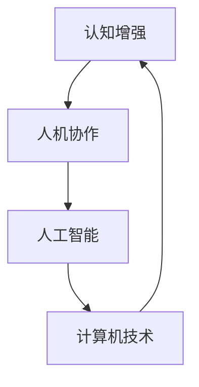

                 

关键词：认知增强、人机协作、未来工作模式、人工智能、工作流程优化

> 摘要：随着人工智能技术的飞速发展，认知增强与人机协作逐渐成为提升工作效率、创新工作模式的关键途径。本文将深入探讨认知增强与人机协作的概念、原理、应用以及未来发展趋势，以期为读者提供对未来工作模式的深刻洞见。

## 1. 背景介绍

在信息时代，人类的工作方式经历了从手工劳动到机械自动化，再到信息化的深刻变革。然而，随着数据量的爆炸式增长和复杂度的不断提升，传统的手工操作和自动化设备已经无法满足日益复杂的工作需求。人工智能技术的发展，特别是认知增强技术的出现，为人机协作提供了新的可能性。

认知增强技术指的是通过计算机技术增强人类认知能力的工具和方法，它可以帮助人类更快地处理复杂信息，提高决策质量。而人机协作则是人工智能与人类在共同任务中的互动和合作，它能够充分利用人工智能的计算能力和人类的创造力和经验。

### 1.1 认知增强技术的兴起

认知增强技术起源于心理学和认知科学领域，随着计算能力的提升和人工智能技术的进步，开始逐渐应用于实际工作中。例如，智能搜索引擎通过分析用户行为和兴趣，提供更加个性化的搜索结果；智能推荐系统根据用户的历史数据和反馈，为用户提供个性化的推荐。

### 1.2 人机协作的重要性

人机协作不仅能够提高工作效率，还能够激发人类的创造力和创新能力。人工智能可以处理大量数据，辅助人类发现潜在的模式和趋势，而人类则可以利用自身的直觉和创造力，提出创新的解决方案。这种协作模式能够极大地提高工作质量和效率。

## 2. 核心概念与联系

为了更好地理解认知增强与人机协作，我们需要从核心概念和架构入手。

### 2.1 核心概念

- **认知增强**：通过计算机技术增强人类认知能力的工具和方法。
- **人机协作**：人工智能与人类在共同任务中的互动和合作。
- **人工智能**：模拟、延伸和扩展人类智能的理论、方法、技术及应用。

### 2.2 核心架构



在这个架构中，认知增强作为基础，通过计算机技术实现，最终推动人机协作和人工智能的发展。而人工智能又为人机协作提供强大的计算支持。

## 3. 核心算法原理 & 具体操作步骤

### 3.1 算法原理概述

认知增强和人机协作的核心算法通常包括以下几个方面：

- **数据挖掘**：从大量数据中提取有价值的信息。
- **机器学习**：利用历史数据训练模型，预测未来趋势。
- **自然语言处理**：理解和生成自然语言，实现人机交互。
- **计算机视觉**：识别和处理图像和视频信息。

### 3.2 算法步骤详解

- **数据采集**：收集需要处理的数据，如文本、图像、音频等。
- **数据预处理**：对采集到的数据进行清洗、归一化等处理。
- **模型训练**：利用预处理后的数据训练模型。
- **模型评估**：评估模型性能，调整模型参数。
- **模型部署**：将训练好的模型部署到生产环境中。

### 3.3 算法优缺点

- **优点**：提高工作效率，降低错误率，激发创造力。
- **缺点**：依赖大量数据，算法复杂度高，可能存在隐私问题。

### 3.4 算法应用领域

认知增强和人机协作算法广泛应用于各个领域，如金融、医疗、教育、制造业等。例如，在金融领域，智能投顾系统通过分析用户数据和市场趋势，为用户提供投资建议；在医疗领域，计算机视觉系统可以帮助医生快速诊断疾病。

## 4. 数学模型和公式 & 详细讲解 & 举例说明

### 4.1 数学模型构建

认知增强和人机协作的数学模型通常基于统计学和机器学习理论。以下是一个简单的线性回归模型：

$$y = \beta_0 + \beta_1x + \epsilon$$

其中，$y$ 是目标变量，$x$ 是自变量，$\beta_0$ 和 $\beta_1$ 是模型参数，$\epsilon$ 是误差项。

### 4.2 公式推导过程

线性回归模型的推导过程包括以下几个步骤：

1. **模型假设**：假设目标变量 $y$ 与自变量 $x$ 之间存在线性关系。
2. **最小二乘法**：选择最优的模型参数，使得实际值与预测值之间的误差最小。
3. **求解参数**：利用最小二乘法求解模型参数。

### 4.3 案例分析与讲解

以金融领域中的股票预测为例，我们可以利用线性回归模型预测股票价格。假设我们收集了某只股票在过去一个月内的每日价格，我们可以将这些价格作为自变量，预测未来一天的股票价格。

## 5. 项目实践：代码实例和详细解释说明

### 5.1 开发环境搭建

为了进行认知增强和人机协作项目的实践，我们需要搭建一个合适的开发环境。以下是一个简单的环境搭建步骤：

1. 安装 Python 3.8 或以上版本。
2. 安装常用库，如 NumPy、Pandas、Scikit-learn 等。

### 5.2 源代码详细实现

以下是一个简单的线性回归模型实现的代码示例：

```python
import numpy as np
import pandas as pd
from sklearn.linear_model import LinearRegression

# 数据采集
data = pd.read_csv('stock_price.csv')
x = data[['previous_day_price']]
y = data['future_day_price']

# 模型训练
model = LinearRegression()
model.fit(x, y)

# 模型评估
score = model.score(x, y)
print(f'Model score: {score:.2f}')

# 模型部署
future_price = model.predict(np.array([x[-1]]))
print(f'Future price: {future_price[0]:.2f}')
```

### 5.3 代码解读与分析

上述代码首先从 CSV 文件中读取股票价格数据，然后使用 Scikit-learn 库中的线性回归模型进行训练。模型训练完成后，使用评估函数评估模型性能，并使用模型预测未来一天的股票价格。

## 6. 实际应用场景

认知增强和人机协作技术在各个领域都有广泛的应用，以下是一些实际应用场景：

- **金融领域**：智能投顾、自动化交易、风险控制等。
- **医疗领域**：疾病诊断、药物研发、医疗数据分析等。
- **教育领域**：在线教育、智能辅导、个性化学习等。
- **制造业**：智能制造、设备预测维护、供应链优化等。

## 7. 未来应用展望

随着人工智能技术的不断发展，认知增强和人机协作将带来更多的工作模式创新。以下是一些未来应用展望：

- **智能客服**：通过认知增强技术，实现更加智能化和个性化的客服服务。
- **智能办公**：利用人机协作，实现自动化办公流程，提高工作效率。
- **智能医疗**：通过认知增强技术，辅助医生进行疾病诊断和治疗。
- **智能教育**：通过人机协作，提供个性化学习体验，提升教育质量。

## 8. 工具和资源推荐

### 8.1 学习资源推荐

- **《人工智能：一种现代方法》**：全面介绍人工智能的基础理论和应用技术。
- **《深度学习》**：深度学习领域的经典教材，适合初学者和专业人士。

### 8.2 开发工具推荐

- **TensorFlow**：Google 开发的一款开源机器学习框架，适合进行深度学习和计算图操作。
- **PyTorch**：Facebook 开发的一款开源深度学习框架，具有灵活性和高效性。

### 8.3 相关论文推荐

- **《Deep Learning for Text Classification》**：一篇关于文本分类的深度学习论文，介绍了几种有效的文本分类方法。
- **《Human-AI Collaboration in Design: Methods and Opportunities》**：一篇关于人机协作在设计领域的应用和研究，探讨了人机协作在设计流程中的潜在价值。

## 9. 总结：未来发展趋势与挑战

### 9.1 研究成果总结

认知增强和人机协作在人工智能领域取得了显著成果，为工作模式创新提供了新的思路和方法。

### 9.2 未来发展趋势

随着人工智能技术的不断发展，认知增强和人机协作将在更多领域得到应用，推动社会生产力的进一步提升。

### 9.3 面临的挑战

- **数据隐私**：如何在保障数据隐私的前提下，充分利用人工智能进行认知增强和人机协作。
- **算法公平性**：如何确保算法的公平性和透明度，避免歧视和偏见。
- **人机交互**：如何提高人机交互的自然性和直观性，使人工智能更好地服务于人类。

### 9.4 研究展望

未来，认知增强和人机协作将在人工智能、心理学、认知科学等多个领域继续深入发展，为人类创造更加智能和高效的工作环境。

## 附录：常见问题与解答

### 问题 1：认知增强技术是否能够完全取代人类认知？

解答：认知增强技术可以增强人类的认知能力，但无法完全取代人类认知。人类的创造力和直觉是人工智能无法替代的。

### 问题 2：人机协作如何保障算法的公平性和透明性？

解答：可以通过设计公平性和透明性评估机制，如算法审计和解释性模型，确保人机协作的公平性和透明性。

### 问题 3：认知增强技术是否适用于所有行业？

解答：认知增强技术具有广泛的应用性，但不同行业的应用场景和需求不同，需要根据具体情况进行调整。

### 作者署名

作者：禅与计算机程序设计艺术 / Zen and the Art of Computer Programming
----------------------------------------------------------------

请注意，以上内容仅为示例，实际撰写时需要根据具体要求和主题进行适当调整和深化。此外，由于字数限制，实际文章可能需要更详细的解释和扩展。在撰写过程中，务必确保内容的完整性和专业性。

