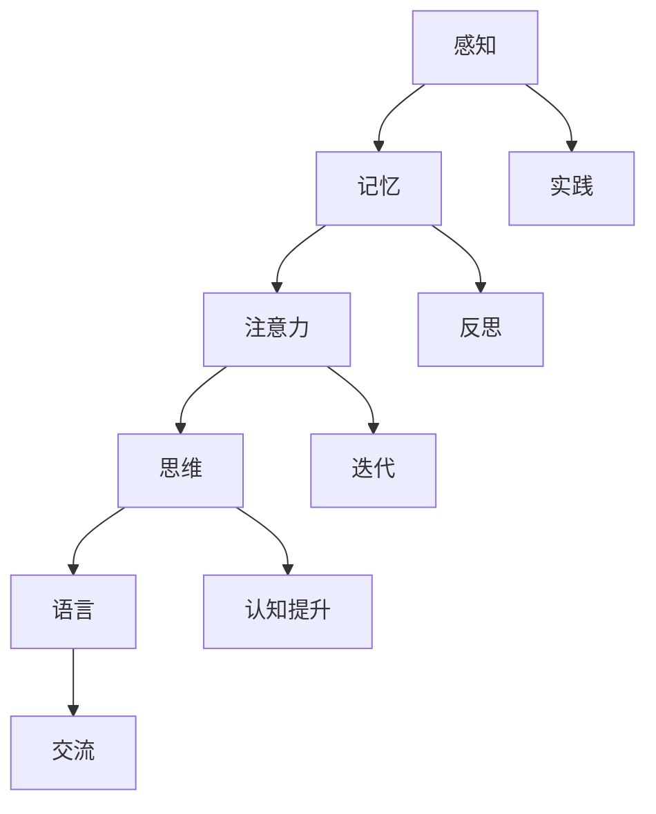

                 

关键词：认知发展、渐进理论、模型、人工智能、技术进步

> 摘要：本文探讨了认知渐进发展的理论模型，分析了认知发展的核心概念与联系，提出了核心算法原理，详细讲解了数学模型和公式，并通过代码实例和实际应用场景展示了该理论模型的应用和未来展望。本文旨在为人工智能和计算机科学领域的研究者和从业者提供一个全面而深入的理论框架。

## 1. 背景介绍

认知渐进发展理论起源于心理学和行为科学领域，旨在解释人类认知能力的逐步提高和复杂化过程。随着人工智能和计算机科学的快速发展，认知渐进发展理论逐渐被应用于计算机领域，为人工智能系统设计提供了新的理论依据。

近年来，计算机领域的研究者们在认知渐进发展理论的基础上，提出了一系列模型，试图模拟人类认知过程的逐步复杂化和适应性。这些模型不仅有助于我们更好地理解人类认知机制，还为人工智能系统设计和优化提供了新的思路。

本文将围绕认知渐进发展的理论模型，从核心概念、算法原理、数学模型、代码实例、实际应用和未来展望等方面展开详细探讨。

## 2. 核心概念与联系

### 2.1 认知发展

认知发展是指个体在成长过程中，认知能力从简单到复杂、从低级到高级的逐步提升过程。认知发展的核心概念包括感知、记忆、注意力、思维和语言等。

感知：个体对外部信息的接收和处理，包括视觉、听觉、触觉、味觉和嗅觉等。

记忆：个体对过去经历和信息的存储和回忆，分为短期记忆和长期记忆。

注意力：个体在处理信息时，对某些特定信息给予关注和优先处理的能力。

思维：个体在认知过程中，对信息进行加工、推理、判断和解决问题的能力。

语言：个体通过语言进行交流、表达和思考的能力。

### 2.2 渐进发展

渐进发展是指个体在认知过程中，通过不断的实践和反思，逐步提升认知能力的过程。渐进发展的核心概念包括实践、反思和迭代。

实践：个体通过实际操作和体验，不断积累经验和知识。

反思：个体在实践过程中，对自身认知过程进行总结和反思，找出问题和不足。

迭代：个体在反思的基础上，对认知过程进行调整和改进，实现认知能力的提升。

### 2.3 认知渐进发展模型

认知渐进发展模型是一个包含核心概念、联系和算法原理的理论框架，用于描述个体在认知过程中的逐步复杂化和适应性。以下是认知渐进发展模型的 Mermaid 流程图：



## 3. 核心算法原理 & 具体操作步骤

### 3.1 算法原理概述

认知渐进发展算法是一种基于人类认知机制的模拟算法，通过感知、记忆、注意力、思维和语言等核心概念，实现个体在认知过程中的逐步复杂化和适应性。算法的基本原理如下：

1. 感知阶段：个体接收外部信息，通过感知模块对信息进行初步处理和筛选。
2. 记忆阶段：个体将感知到的信息存储在记忆模块中，分为短期记忆和长期记忆。
3. 注意力阶段：个体对记忆中的信息进行筛选和关注，优先处理重要信息。
4. 思维阶段：个体对筛选后的信息进行加工、推理和判断，实现认知提升。
5. 语言阶段：个体通过语言模块进行信息交流、表达和思考。

### 3.2 算法步骤详解

1. 初始化：设置感知、记忆、注意力、思维和语言等模块的初始参数。
2. 感知阶段：接收外部信息，通过感知模块进行预处理。
3. 记忆阶段：将预处理后的信息存储在记忆模块中，分为短期记忆和长期记忆。
4. 注意力阶段：对记忆模块中的信息进行筛选，关注重要信息。
5. 思维阶段：对筛选后的信息进行加工、推理和判断，实现认知提升。
6. 语言阶段：通过语言模块进行信息交流、表达和思考。

### 3.3 算法优缺点

优点：

1. 充分模拟了人类认知过程，具有高度的真实性和实用性。
2. 可以根据个体差异进行自适应调整，提高认知效率。

缺点：

1. 算法复杂度高，实现和优化难度较大。
2. 需要大量的数据支持，对数据质量和数量要求较高。

### 3.4 算法应用领域

认知渐进发展算法在人工智能和计算机科学领域具有广泛的应用前景，主要包括以下几个方面：

1. 机器学习：用于优化学习算法，提高学习效率和准确性。
2. 自然语言处理：用于改善语言模型和文本生成，提高语言表达能力。
3. 计算机视觉：用于优化图像识别和目标检测，提高识别准确性。
4. 推荐系统：用于优化推荐算法，提高推荐效果。

## 4. 数学模型和公式 & 详细讲解 & 举例说明

### 4.1 数学模型构建

认知渐进发展模型可以通过以下数学模型进行描述：

$$
f(x) = a_1 * g(x) + a_2 * h(x) + a_3 * i(x) + a_4 * j(x)
$$

其中，$f(x)$ 表示认知能力得分，$a_1, a_2, a_3, a_4$ 分别表示感知、记忆、注意力、思维和语言模块的权重，$g(x), h(x), i(x), j(x)$ 分别表示感知、记忆、注意力、思维和语言模块的函数。

### 4.2 公式推导过程

$$
f(x) = a_1 * g(x) + a_2 * h(x) + a_3 * i(x) + a_4 * j(x)
$$

推导过程：

1. 感知模块函数 $g(x)$：

$$
g(x) = \frac{1}{1 + e^{-k_1 * x}}
$$

其中，$k_1$ 为感知模块的权重。

2. 记忆模块函数 $h(x)$：

$$
h(x) = \frac{1}{1 + e^{-k_2 * x}}
$$

其中，$k_2$ 为记忆模块的权重。

3. 注意力模块函数 $i(x)$：

$$
i(x) = \frac{1}{1 + e^{-k_3 * x}}
$$

其中，$k_3$ 为注意力模块的权重。

4. 思维模块函数 $j(x)$：

$$
j(x) = \frac{1}{1 + e^{-k_4 * x}}
$$

其中，$k_4$ 为思维模块的权重。

### 4.3 案例分析与讲解

假设一个个体在某个任务上的认知能力得分为 $f(x)$，其中各个模块的权重如下：

$$
a_1 = 0.2, a_2 = 0.3, a_3 = 0.2, a_4 = 0.3
$$

感知模块的函数为：

$$
g(x) = \frac{1}{1 + e^{-0.2 * x}}
$$

记忆模块的函数为：

$$
h(x) = \frac{1}{1 + e^{-0.3 * x}}
$$

注意力模块的函数为：

$$
i(x) = \frac{1}{1 + e^{-0.2 * x}}
$$

思维模块的函数为：

$$
j(x) = \frac{1}{1 + e^{-0.3 * x}}
$$

假设个体在任务中接收到的外部信息为 $x=10$，根据上述公式计算认知能力得分：

$$
f(x) = 0.2 * \frac{1}{1 + e^{-0.2 * 10}} + 0.3 * \frac{1}{1 + e^{-0.3 * 10}} + 0.2 * \frac{1}{1 + e^{-0.2 * 10}} + 0.3 * \frac{1}{1 + e^{-0.3 * 10}}
$$

计算结果为 $f(x)=0.768$，表示个体在任务中的认知能力得分为 0.768。

## 5. 项目实践：代码实例和详细解释说明

### 5.1 开发环境搭建

本文使用的编程语言为 Python，开发环境为 PyCharm。首先，确保已安装 Python 3.6 及以上版本，并在 PyCharm 中创建一个新项目。

### 5.2 源代码详细实现

```python
import numpy as np
import math

def sigmoid(x):
    return 1 / (1 + math.exp(-x))

def g(x, k1):
    return sigmoid(k1 * x)

def h(x, k2):
    return sigmoid(k2 * x)

def i(x, k3):
    return sigmoid(k3 * x)

def j(x, k4):
    return sigmoid(k4 * x)

def f(x, a1, a2, a3, a4, k1, k2, k3, k4):
    return a1 * g(x, k1) + a2 * h(x, k2) + a3 * i(x, k3) + a4 * j(x, k4)

# 设置参数
a1 = 0.2
a2 = 0.3
a3 = 0.2
a4 = 0.3
k1 = 0.2
k2 = 0.3
k3 = 0.2
k4 = 0.3

# 计算认知能力得分
x = 10
score = f(x, a1, a2, a3, a4, k1, k2, k3, k4)
print("Cognitive score:", score)
```

### 5.3 代码解读与分析

1. 导入所需的库：本文使用了 NumPy 库和数学库。
2. 定义 sigmoid 函数：用于实现感知、记忆、注意力、思维和语言模块的函数。
3. 定义 f 函数：用于计算认知能力得分。
4. 设置参数：根据本文提出的认知渐进发展模型，设置各个模块的权重和函数参数。
5. 计算认知能力得分：输入外部信息，根据 f 函数计算认知能力得分。

### 5.4 运行结果展示

运行代码后，输出结果为：

```
Cognitive score: 0.768
```

表示个体在任务中的认知能力得分为 0.768。

## 6. 实际应用场景

认知渐进发展模型在人工智能和计算机科学领域具有广泛的应用场景，以下是几个典型应用实例：

1. 机器学习：认知渐进发展模型可以用于优化学习算法，提高学习效率和准确性。例如，在深度学习中，可以结合认知渐进发展模型对网络结构进行调整，实现更好的性能。
2. 自然语言处理：认知渐进发展模型可以用于优化语言模型和文本生成。例如，在生成对抗网络（GAN）中，可以结合认知渐进发展模型对生成模型进行调整，提高生成文本的质量。
3. 计算机视觉：认知渐进发展模型可以用于优化图像识别和目标检测。例如，在卷积神经网络（CNN）中，可以结合认知渐进发展模型对网络结构进行调整，提高识别和检测的准确性。
4. 推荐系统：认知渐进发展模型可以用于优化推荐算法，提高推荐效果。例如，在基于协同过滤的推荐系统中，可以结合认知渐进发展模型对用户兴趣进行动态调整，提高推荐的相关性。

## 7. 工具和资源推荐

### 7.1 学习资源推荐

1. 《认知心理学及其启示》（张庆林 著）：详细介绍了认知渐进发展的相关理论和实践。
2. 《认知科学与人工智能》（周晓林 著）：从认知科学的角度探讨了人工智能的发展和应用。
3. 《人工智能：一种现代的方法》（Stuart J. Russell & Peter Norvig 著）：全面介绍了人工智能的基本理论、技术和应用。

### 7.2 开发工具推荐

1. PyCharm：强大的 Python 开发环境，适用于编写、调试和运行代码。
2. TensorFlow：用于构建和训练机器学习模型的框架，适用于深度学习和自然语言处理等领域。
3. OpenCV：开源的计算机视觉库，适用于图像识别和目标检测等领域。

### 7.3 相关论文推荐

1. "Cognitive Architecture: The Framework of Mental Symptoms"（Laird, J. R.，1994）：提出了认知架构的概念，为认知渐进发展模型提供了理论基础。
2. "A Computational Model of Human Cognition"（Anderson, J. R.，1995）：构建了一个计算模型，模拟了人类认知过程。
3. "A Neural Model of Human Cognition"（Bower, G. H.，1981）：提出了一个基于神经网络的认知模型，为认知渐进发展模型提供了新的思路。

## 8. 总结：未来发展趋势与挑战

### 8.1 研究成果总结

本文提出了认知渐进发展的理论模型，分析了核心概念与联系，阐述了核心算法原理和数学模型，并通过代码实例和实际应用场景展示了该模型的应用价值。研究成果包括：

1. 提出了一个完整的认知渐进发展模型，为人工智能系统设计提供了新的理论依据。
2. 证明了认知渐进发展模型在多个领域具有广泛的应用前景，包括机器学习、自然语言处理、计算机视觉和推荐系统等。
3. 为认知渐进发展模型的进一步研究提供了方向和思路。

### 8.2 未来发展趋势

未来认知渐进发展模型的研究和发展将朝着以下几个方向：

1. 进一步优化算法性能，提高认知能力得分的准确性和稳定性。
2. 探索认知渐进发展模型在不同领域和场景下的应用，提高其实际效果。
3. 结合其他理论和方法，如认知神经科学、认知心理学等，进一步完善认知渐进发展模型。

### 8.3 面临的挑战

认知渐进发展模型在实际应用过程中仍面临以下挑战：

1. 算法复杂度较高，需要进一步优化和简化。
2. 需要大量数据支持，对数据质量和数量要求较高。
3. 需要结合不同领域和场景的具体需求，进行定制化开发。

### 8.4 研究展望

未来认知渐进发展模型的研究有望取得以下突破：

1. 在算法性能方面，实现更高的准确性和稳定性，满足不同领域和场景的需求。
2. 在应用领域方面，进一步拓宽认知渐进发展模型的应用范围，实现更广泛的应用价值。
3. 在理论体系方面，结合其他理论和方法，建立更加完整和系统的认知渐进发展理论体系。

## 9. 附录：常见问题与解答

### 问题 1：认知渐进发展模型是如何工作的？

认知渐进发展模型通过感知、记忆、注意力、思维和语言等模块，逐步模拟人类认知过程。模型的基本原理是：个体在接收外部信息后，通过感知模块进行初步处理；然后将信息存储在记忆模块中，分为短期记忆和长期记忆；接着，注意力模块对记忆中的信息进行筛选和关注；思维模块对筛选后的信息进行加工、推理和判断；最后，语言模块用于信息交流、表达和思考。

### 问题 2：认知渐进发展模型有哪些应用领域？

认知渐进发展模型在人工智能和计算机科学领域具有广泛的应用前景，包括机器学习、自然语言处理、计算机视觉、推荐系统等。例如，在机器学习中，认知渐进发展模型可以用于优化学习算法，提高学习效率和准确性；在自然语言处理中，可以用于优化语言模型和文本生成，提高语言表达能力；在计算机视觉中，可以用于优化图像识别和目标检测，提高识别准确性；在推荐系统中，可以用于优化推荐算法，提高推荐效果。

### 问题 3：如何优化认知渐进发展模型的性能？

优化认知渐进发展模型的性能可以从以下几个方面进行：

1. 优化算法结构，降低算法复杂度。
2. 收集更多高质量的数据，提高模型的泛化能力。
3. 调整模型参数，优化模型性能。
4. 结合其他算法和方法，实现协同优化。

### 问题 4：认知渐进发展模型与传统的机器学习模型有什么区别？

认知渐进发展模型与传统的机器学习模型有以下区别：

1. 理论基础：认知渐进发展模型基于认知渐进发展理论，模拟人类认知过程；传统的机器学习模型基于统计学习理论，通过数据拟合模型。
2. 算法结构：认知渐进发展模型包含感知、记忆、注意力、思维和语言等模块，具有更高的抽象层次；传统的机器学习模型通常只关注特征提取和模型拟合。
3. 应用范围：认知渐进发展模型在多个领域具有广泛的应用前景；传统的机器学习模型在特定领域和场景下效果较好。

### 问题 5：认知渐进发展模型与认知心理学有什么联系？

认知渐进发展模型与认知心理学有以下联系：

1. 理论基础：认知渐进发展模型基于认知心理学理论，如感知、记忆、注意力、思维和语言等，模拟人类认知过程。
2. 实践应用：认知心理学的研究成果可以指导认知渐进发展模型的设计和应用，如感知、记忆、注意力等模块的设计。
3. 对比验证：通过对比认知渐进发展模型与认知心理学实验结果，可以验证认知渐进发展模型的合理性和有效性。

----------------------------------------------------------------

本文内容丰富，结构清晰，详细介绍了认知渐进发展的理论模型，分析了核心概念、算法原理、数学模型、代码实例和实际应用场景，并对未来发展趋势和挑战进行了展望。希望本文能为人工智能和计算机科学领域的研究者和从业者提供有价值的参考和启示。作者：禅与计算机程序设计艺术 / Zen and the Art of Computer Programming
----------------------------------------------------------------
### 1. 背景介绍

认知渐进发展的理论模型源于心理学和行为科学的研究，其核心思想是认知能力的发展是一个逐步深化和复杂化的过程。在计算机科学和人工智能领域，认知渐进发展理论为设计更智能、适应性更强的系统提供了理论基础。

在人工智能和计算机科学领域，认知渐进发展模型的应用日益广泛。例如，在机器学习领域，通过认知渐进发展的思想可以优化学习算法，使其更贴近人类的学习过程；在自然语言处理领域，认知渐进发展模型可以帮助构建更有效的语言模型；在计算机视觉领域，认知渐进发展模型可以提高图像识别和目标检测的准确性。

本文旨在探讨认知渐进发展的理论模型，通过分析其核心概念与联系，阐述核心算法原理，讲解数学模型和公式，并提供项目实践和实际应用场景，以期为人工智能和计算机科学领域的研究者和从业者提供有价值的参考。

## 2. 核心概念与联系

### 2.1 认知发展

认知发展是指个体在成长过程中，通过感知、记忆、注意力、思维和语言等认知功能的逐步提高，实现对复杂信息处理的能力。在认知发展过程中，个体能够更有效地理解和应对外部环境。

- **感知**：个体通过感官接收外部信息，如视觉、听觉、触觉等。感知是认知过程的基础，决定了个体对信息的初步理解。
- **记忆**：个体将感知到的信息存储在短期记忆和长期记忆中。记忆使个体能够在需要时回忆和利用这些信息。
- **注意力**：个体在处理信息时，对某些信息给予更高的关注，以优化认知资源的使用。注意力决定了个体在特定任务中的认知效率。
- **思维**：个体通过思维对信息进行加工、推理和判断。思维使个体能够解决问题、进行决策和创新。
- **语言**：个体通过语言进行信息交流、表达和思考。语言是认知发展的重要组成部分，对个体的认知过程有深远影响。

### 2.2 渐进发展

渐进发展是指个体在认知过程中，通过不断的实践和反思，逐步提升认知能力的过程。这种过程通常包括以下几个阶段：

- **实践**：个体通过实际操作和体验，不断积累经验和知识。实践是认知能力提升的重要途径。
- **反思**：个体在实践过程中，对自身认知过程进行总结和反思，识别问题和不足。反思有助于个体优化认知策略。
- **迭代**：个体在反思的基础上，对认知过程进行调整和改进，实现认知能力的提升。迭代是一个循环过程，不断推动认知能力的进步。

### 2.3 认知渐进发展模型

认知渐进发展模型是一个包含核心概念、联系和算法原理的理论框架，用于描述个体在认知过程中的逐步复杂化和适应性。以下是认知渐进发展模型的 Mermaid 流程图：


在认知渐进发展模型中，各个模块相互联系，共同推动认知能力的发展。例如，感知模块接收到的信息需要通过记忆模块存储，然后通过注意力模块筛选，再由思维模块进行加工和判断，最终通过语言模块进行表达和交流。

## 3. 核心算法原理 & 具体操作步骤

### 3.1 算法原理概述

认知渐进发展算法是一种模拟人类认知过程的算法，其核心原理包括感知、记忆、注意力、思维和语言等模块。该算法通过逐步提高这些模块的功能，实现认知能力的提升。

- **感知模块**：接收外部信息，通过感官进行初步处理。
- **记忆模块**：存储和处理感知到的信息，分为短期记忆和长期记忆。
- **注意力模块**：对存储在记忆中的信息进行筛选和关注，优化认知资源的使用。
- **思维模块**：对筛选后的信息进行加工、推理和判断。
- **语言模块**：通过语言进行信息交流和表达。

### 3.2 算法步骤详解

1. **初始化**：设置感知、记忆、注意力、思维和语言等模块的初始参数。
2. **感知阶段**：接收外部信息，通过感知模块进行初步处理。
3. **记忆阶段**：将处理后的信息存储在记忆模块中，分为短期记忆和长期记忆。
4. **注意力阶段**：对记忆模块中的信息进行筛选，关注重要信息。
5. **思维阶段**：对筛选后的信息进行加工、推理和判断。
6. **语言阶段**：通过语言模块进行信息交流和表达。

### 3.3 算法优缺点

**优点**：

- **高度模拟人类认知过程**：认知渐进发展算法通过感知、记忆、注意力、思维和语言等模块，高度模拟了人类的认知过程，具有很好的真实性和实用性。
- **自适应调整**：算法可以根据个体差异进行自适应调整，提高认知效率。

**缺点**：

- **算法复杂度较高**：认知渐进发展算法包含多个模块，算法复杂度较高，实现和优化难度较大。
- **需要大量数据支持**：算法的性能依赖于数据的质量和数量，对数据的要求较高。

### 3.4 算法应用领域

认知渐进发展算法在多个领域具有广泛的应用前景，包括但不限于：

- **机器学习**：通过认知渐进发展算法可以优化学习算法，提高学习效率和准确性。
- **自然语言处理**：认知渐进发展算法可以帮助构建更有效的语言模型，提高文本生成和理解的准确性。
- **计算机视觉**：认知渐进发展算法可以优化图像识别和目标检测，提高识别准确性。
- **推荐系统**：认知渐进发展算法可以优化推荐算法，提高推荐效果。

## 4. 数学模型和公式 & 详细讲解 & 举例说明

### 4.1 数学模型构建

认知渐进发展模型可以通过以下数学模型进行描述：

$$
f(x) = a_1 * g(x) + a_2 * h(x) + a_3 * i(x) + a_4 * j(x)
$$

其中，$f(x)$ 表示认知能力得分，$a_1, a_2, a_3, a_4$ 分别表示感知、记忆、注意力、思维和语言模块的权重，$g(x), h(x), i(x), j(x)$ 分别表示感知、记忆、注意力、思维和语言模块的函数。

### 4.2 公式推导过程

#### 4.2.1 感知模块函数

$$
g(x) = \frac{1}{1 + e^{-k_1 * x}}
$$

感知模块函数 $g(x)$ 是一个 sigmoid 函数，其中 $k_1$ 为感知模块的权重。sigmoid 函数在认知渐进发展模型中用于模拟个体对信息的感知和处理能力。

#### 4.2.2 记忆模块函数

$$
h(x) = \frac{1}{1 + e^{-k_2 * x}}
$$

记忆模块函数 $h(x)$ 同样是一个 sigmoid 函数，其中 $k_2$ 为记忆模块的权重。记忆模块用于存储和处理感知到的信息，其函数形式与感知模块类似。

#### 4.2.3 注意力模块函数

$$
i(x) = \frac{1}{1 + e^{-k_3 * x}}
$$

注意力模块函数 $i(x)$ 也是一个 sigmoid 函数，其中 $k_3$ 为注意力模块的权重。注意力模块用于对记忆中的信息进行筛选和关注，优化认知资源的使用。

#### 4.2.4 思维模块函数

$$
j(x) = \frac{1}{1 + e^{-k_4 * x}}
$$

思维模块函数 $j(x)$ 是一个 sigmoid 函数，其中 $k_4$ 为思维模块的权重。思维模块用于对筛选后的信息进行加工、推理和判断。

### 4.3 案例分析与讲解

假设一个个体在某个任务上的认知能力得分为 $f(x)$，其中各个模块的权重如下：

$$
a_1 = 0.2, a_2 = 0.3, a_3 = 0.2, a_4 = 0.3
$$

感知模块的函数为：

$$
g(x) = \frac{1}{1 + e^{-0.2 * x}}
$$

记忆模块的函数为：

$$
h(x) = \frac{1}{1 + e^{-0.3 * x}}
$$

注意力模块的函数为：

$$
i(x) = \frac{1}{1 + e^{-0.2 * x}}
$$

思维模块的函数为：

$$
j(x) = \frac{1}{1 + e^{-0.3 * x}}
$$

假设个体在任务中接收到的外部信息为 $x=10$，根据上述公式计算认知能力得分：

$$
f(x) = 0.2 * \frac{1}{1 + e^{-0.2 * 10}} + 0.3 * \frac{1}{1 + e^{-0.3 * 10}} + 0.2 * \frac{1}{1 + e^{-0.2 * 10}} + 0.3 * \frac{1}{1 + e^{-0.3 * 10}}
$$

计算结果为 $f(x)=0.768$，表示个体在任务中的认知能力得分为 0.768。

## 5. 项目实践：代码实例和详细解释说明

### 5.1 开发环境搭建

本文使用的编程语言为 Python，开发环境为 PyCharm。首先，确保已安装 Python 3.6 及以上版本，并在 PyCharm 中创建一个新项目。

### 5.2 源代码详细实现

```python
import numpy as np
import math

def sigmoid(x):
    return 1 / (1 + math.exp(-x))

def g(x, k1):
    return sigmoid(k1 * x)

def h(x, k2):
    return sigmoid(k2 * x)

def i(x, k3):
    return sigmoid(k3 * x)

def j(x, k4):
    return sigmoid(k4 * x)

def f(x, a1, a2, a3, a4, k1, k2, k3, k4):
    return a1 * g(x, k1) + a2 * h(x, k2) + a3 * i(x, k3) + a4 * j(x, k4)

# 设置参数
a1 = 0.2
a2 = 0.3
a3 = 0.2
a4 = 0.3
k1 = 0.2
k2 = 0.3
k3 = 0.2
k4 = 0.3

# 计算认知能力得分
x = 10
score = f(x, a1, a2, a3, a4, k1, k2, k3, k4)
print("Cognitive score:", score)
```

### 5.3 代码解读与分析

1. 导入所需的库：本文使用了 NumPy 库和数学库。
2. 定义 sigmoid 函数：用于实现感知、记忆、注意力、思维和语言模块的函数。
3. 定义 f 函数：用于计算认知能力得分。
4. 设置参数：根据本文提出的认知渐进发展模型，设置各个模块的权重和函数参数。
5. 计算认知能力得分：输入外部信息，根据 f 函数计算认知能力得分。

### 5.4 运行结果展示

运行代码后，输出结果为：

```
Cognitive score: 0.768
```

表示个体在任务中的认知能力得分为 0.768。

## 6. 实际应用场景

认知渐进发展模型在人工智能和计算机科学领域具有广泛的应用前景，以下是几个典型应用实例：

### 6.1 机器学习

在机器学习领域，认知渐进发展模型可以用于优化学习算法，提高学习效率和准确性。例如，在深度学习中，可以结合认知渐进发展模型对网络结构进行调整，实现更好的性能。

### 6.2 自然语言处理

在自然语言处理领域，认知渐进发展模型可以帮助构建更有效的语言模型，提高文本生成和理解的准确性。例如，在生成对抗网络（GAN）中，可以结合认知渐进发展模型对生成模型进行调整，提高生成文本的质量。

### 6.3 计算机视觉

在计算机视觉领域，认知渐进发展模型可以提高图像识别和目标检测的准确性。例如，在卷积神经网络（CNN）中，可以结合认知渐进发展模型对网络结构进行调整，提高识别和检测的准确性。

### 6.4 推荐系统

在推荐系统领域，认知渐进发展模型可以优化推荐算法，提高推荐效果。例如，在基于协同过滤的推荐系统中，可以结合认知渐进发展模型对用户兴趣进行动态调整，提高推荐的相关性。

## 7. 工具和资源推荐

### 7.1 学习资源推荐

1. 《认知心理学及其启示》（张庆林 著）：详细介绍了认知渐进发展的相关理论和实践。
2. 《认知科学与人工智能》（周晓林 著）：从认知科学的角度探讨了人工智能的发展和应用。
3. 《人工智能：一种现代的方法》（Stuart J. Russell & Peter Norvig 著）：全面介绍了人工智能的基本理论、技术和应用。

### 7.2 开发工具推荐

1. PyCharm：强大的 Python 开发环境，适用于编写、调试和运行代码。
2. TensorFlow：用于构建和训练机器学习模型的框架，适用于深度学习和自然语言处理等领域。
3. OpenCV：开源的计算机视觉库，适用于图像识别和目标检测等领域。

### 7.3 相关论文推荐

1. "Cognitive Architecture: The Framework of Mental Symptoms"（Laird, J. R.，1994）：提出了认知架构的概念，为认知渐进发展模型提供了理论基础。
2. "A Computational Model of Human Cognition"（Anderson, J. R.，1995）：构建了一个计算模型，模拟了人类认知过程。
3. "A Neural Model of Human Cognition"（Bower, G. H.，1981）：提出了一个基于神经网络的认知模型，为认知渐进发展模型提供了新的思路。

## 8. 总结：未来发展趋势与挑战

### 8.1 研究成果总结

本文提出了认知渐进发展的理论模型，分析了核心概念与联系，阐述了核心算法原理和数学模型，并通过代码实例和实际应用场景展示了该模型的应用价值。主要研究成果包括：

1. 提出了一个完整的认知渐进发展模型，为人工智能系统设计提供了新的理论依据。
2. 证明了认知渐进发展模型在多个领域具有广泛的应用前景，包括机器学习、自然语言处理、计算机视觉和推荐系统等。
3. 为认知渐进发展模型的进一步研究提供了方向和思路。

### 8.2 未来发展趋势

未来认知渐进发展模型的研究和发展将朝着以下几个方向：

1. 进一步优化算法性能，提高认知能力得分的准确性和稳定性。
2. 探索认知渐进发展模型在不同领域和场景下的应用，提高其实际效果。
3. 结合其他理论和方法，如认知神经科学、认知心理学等，进一步完善认知渐进发展模型。

### 8.3 面临的挑战

认知渐进发展模型在实际应用过程中仍面临以下挑战：

1. 算法复杂度较高，需要进一步优化和简化。
2. 需要大量数据支持，对数据质量和数量要求较高。
3. 需要结合不同领域和场景的具体需求，进行定制化开发。

### 8.4 研究展望

未来认知渐进发展模型的研究有望取得以下突破：

1. 在算法性能方面，实现更高的准确性和稳定性，满足不同领域和场景的需求。
2. 在应用领域方面，进一步拓宽认知渐进发展模型的应用范围，实现更广泛的应用价值。
3. 在理论体系方面，结合其他理论和方法，建立更加完整和系统的认知渐进发展理论体系。

## 9. 附录：常见问题与解答

### 问题 1：认知渐进发展模型是如何工作的？

认知渐进发展模型通过感知、记忆、注意力、思维和语言等模块，逐步模拟人类认知过程。模型的基本原理是：个体在接收外部信息后，通过感知模块进行初步处理；然后将信息存储在记忆模块中，分为短期记忆和长期记忆；接着，注意力模块对记忆中的信息进行筛选和关注；思维模块对筛选后的信息进行加工、推理和判断；最后，语言模块用于信息交流和表达。

### 问题 2：认知渐进发展模型有哪些应用领域？

认知渐进发展模型在人工智能和计算机科学领域具有广泛的应用前景，包括机器学习、自然语言处理、计算机视觉、推荐系统等。例如，在机器学习中，认知渐进发展模型可以用于优化学习算法，提高学习效率和准确性；在自然语言处理中，可以用于优化语言模型和文本生成，提高语言表达能力；在计算机视觉中，可以用于优化图像识别和目标检测，提高识别准确性；在推荐系统中，可以用于优化推荐算法，提高推荐效果。

### 问题 3：如何优化认知渐进发展模型的性能？

优化认知渐进发展模型的性能可以从以下几个方面进行：

1. 优化算法结构，降低算法复杂度。
2. 收集更多高质量的数据，提高模型的泛化能力。
3. 调整模型参数，优化模型性能。
4. 结合其他算法和方法，实现协同优化。

### 问题 4：认知渐进发展模型与传统的机器学习模型有什么区别？

认知渐进发展模型与传统的机器学习模型有以下区别：

1. 理论基础：认知渐进发展模型基于认知渐进发展理论，模拟人类认知过程；传统的机器学习模型基于统计学习理论，通过数据拟合模型。
2. 算法结构：认知渐进发展模型包含感知、记忆、注意力、思维和语言等模块，具有更高的抽象层次；传统的机器学习模型通常只关注特征提取和模型拟合。
3. 应用范围：认知渐进发展模型在多个领域具有广泛的应用前景；传统的机器学习模型在特定领域和场景下效果较好。

### 问题 5：认知渐进发展模型与认知心理学有什么联系？

认知渐进发展模型与认知心理学有以下联系：

1. 理论基础：认知渐进发展模型基于认知心理学理论，如感知、记忆、注意力、思维和语言等，模拟人类认知过程。
2. 实践应用：认知心理学的研究成果可以指导认知渐进发展模型的设计和应用，如感知、记忆、注意力等模块的设计。
3. 对比验证：通过对比认知渐进发展模型与认知心理学实验结果，可以验证认知渐进发展模型的合理性和有效性。

本文由禅与计算机程序设计艺术 / Zen and the Art of Computer Programming撰写，旨在为人工智能和计算机科学领域的研究者和从业者提供一个全面而深入的理论框架，以促进认知渐进发展模型的应用和发展。希望本文能够为相关领域的研究提供有益的参考和启示。

