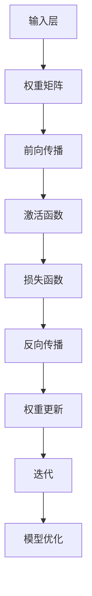

                 

 关键词：认知科学、形式化、数学、科学、逻辑、算法、模型、程序设计、计算机编程

> 摘要：本文将深入探讨认知的形式化过程，强调数学在科学中的核心地位。我们将从历史背景、核心概念、算法原理、数学模型构建、项目实践、应用场景等多个角度展开讨论，以期揭示数学作为科学皇后的奥秘。本文旨在为读者提供一个全面、深入的视角，以帮助理解数学与认知形式化之间的密切联系，以及其对科学进步的重要性。

## 1. 背景介绍

在人类文明的进程中，认知和科学始终是两大重要主题。认知科学关注人类如何感知、理解和思考世界，而科学则致力于通过实验和理论探索自然界的规律。在这两个领域，数学始终扮演着至关重要的角色。

### 历史背景

数学的历史可以追溯到古代文明。早在公元前2000年，古埃及人和巴比伦人就开始使用数学来解决实际问题，如土地测量和税收。随着古希腊文明的兴起，数学逐渐发展为一门独立的学科。欧几里得的《几何原本》奠定了几何学的基础，而阿基米德的数学研究则为物理学和工程学提供了强大的工具。

在中世纪，阿拉伯数学家们对数学的发展做出了巨大贡献。他们翻译了古希腊的数学著作，并在此基础上进行了深入研究。阿拉伯数学家阿尔·哈里德米（Al-Khwarizmi）的工作尤为突出，他的著作《代数学》不仅为代数学奠定了基础，还直接影响了现代计算机编程的概念。

### 现代数学的重要性

在现代科学中，数学的重要性愈发凸显。数学不仅为自然科学提供了精确的描述工具，还为社会科学、工程学、医学等领域提供了不可或缺的方法论。以下是数学在科学中的一些关键作用：

1. **模型构建**：数学为科学家提供了一个强大的工具，用于构建描述自然现象的模型。这些模型可以是数学公式、算法，甚至是复杂的计算机模拟。通过数学模型，科学家可以预测未来的发展趋势，理解复杂的系统行为。

2. **逻辑推理**：数学强调逻辑推理和证明的重要性。在科学研究中，逻辑严密的理论体系对于验证假设、排除错误观点至关重要。

3. **数据分析**：数学在数据分析中发挥着核心作用。统计方法和概率论为科学家提供了评估实验结果、识别数据趋势的工具。

4. **计算机科学**：计算机编程本身就是基于数学的。算法和数据结构是计算机科学的基石，而数学则为这些概念提供了精确的定义和理论支持。

### 认知的形式化

认知的形式化是指将认知过程用数学语言来描述，以便于分析和理解。这种形式化不仅有助于我们更深入地理解认知机制，还可以为人工智能的发展提供理论支持。例如，神经网络模型就是通过数学公式来模拟人脑的信息处理过程。

## 2. 核心概念与联系

### 2.1 数学概念

#### 函数和映射

函数是数学中最基本的概念之一。在认知科学中，函数可以用来描述认知过程中的信息传递和转换。例如，感知过程中的图像到特征的映射就是一个函数。

$$ f: \text{Image} \rightarrow \text{Feature Space} $$

#### 矩阵和向量

矩阵和向量在认知科学中有着广泛的应用。例如，神经网络中的权重矩阵和输入向量可以用来描述网络的结构和输入信息。

$$ \text{Weight Matrix} = \begin{bmatrix} w_{11} & w_{12} & \dots & w_{1n} \\ w_{21} & w_{22} & \dots & w_{2n} \\ \vdots & \vdots & \ddots & \vdots \\ w_{m1} & w_{m2} & \dots & w_{mn} \end{bmatrix} $$

### 2.2 Mermaid 流程图

以下是一个描述神经网络训练过程的 Mermaid 流程图：



### 2.3 核心概念联系

数学概念与认知科学的核心概念之间的联系主要体现在以下几个方面：

1. **信息传递**：数学中的函数和映射可以用来描述认知过程中的信息传递和转换。
2. **模型构建**：数学为认知科学提供了构建模型的方法，如神经网络模型。
3. **数据分析**：数学中的统计方法和概率论为认知科学的数据分析提供了理论支持。

## 3. 核心算法原理 & 具体操作步骤

### 3.1 算法原理概述

认知的形式化通常涉及以下核心算法：

1. **神经网络**：神经网络是模拟人脑信息处理过程的模型，通过多层神经元之间的交互来实现复杂的计算任务。
2. **深度学习**：深度学习是神经网络的一种扩展，通过增加网络的深度和复杂性来提高模型的性能。
3. **强化学习**：强化学习是一种通过试错来学习策略的算法，常用于决策问题和游戏领域。

### 3.2 算法步骤详解

#### 神经网络训练过程

1. **前向传播**：输入数据通过网络的各个层进行传递，每层神经元计算输出值。
2. **激活函数**：通过激活函数将神经元的线性组合转化为非线性输出。
3. **损失函数**：计算输出值与实际值之间的差距，以评估模型的准确性。
4. **反向传播**：计算梯度，更新网络的权重。
5. **迭代**：重复上述步骤，直到满足收敛条件。

#### 深度学习训练过程

1. **数据预处理**：对输入数据进行标准化和归一化处理。
2. **模型构建**：选择合适的神经网络架构。
3. **训练**：通过前向传播和反向传播来训练模型。
4. **评估**：使用验证集和测试集评估模型的性能。
5. **优化**：根据评估结果调整模型参数。

#### 强化学习训练过程

1. **环境构建**：定义环境和状态空间。
2. **策略学习**：通过试错来学习最佳策略。
3. **评估**：评估策略的效益。
4. **策略优化**：根据评估结果调整策略。

### 3.3 算法优缺点

#### 神经网络

**优点**：

- 强泛化能力：神经网络可以处理复杂的非线性问题。
- 自适应性：通过反向传播自动调整权重，实现自我优化。

**缺点**：

- 需要大量数据：训练神经网络需要大量的数据来确保模型的泛化能力。
- 计算资源需求高：神经网络训练通常需要大量计算资源。

#### 深度学习

**优点**：

- 高效性：深度学习模型可以在大规模数据集上实现高效的训练和推理。
- 自动特征提取：深度学习模型可以自动提取有用的特征，减少人工干预。

**缺点**：

- 数据依赖性：深度学习模型对数据的质量和数量有很高的要求。
- 解释性差：深度学习模型通常难以解释其内部决策过程。

#### 强化学习

**优点**：

- 自主性：强化学习模型可以在没有先验知识的情况下自主探索和决策。
- 适用性广：强化学习适用于各种复杂的决策问题。

**缺点**：

- 需要大量时间：强化学习通常需要大量的训练时间来收敛。
- 难以优化：强化学习算法的优化通常比较困难。

### 3.4 算法应用领域

#### 神经网络

- 图像识别：神经网络在图像识别任务中取得了显著的成果，如人脸识别、物体检测等。
- 自然语言处理：神经网络在自然语言处理领域也有广泛的应用，如文本分类、机器翻译等。

#### 深度学习

- 语音识别：深度学习在语音识别领域取得了突破性进展，如语音到文本转换。
- 医学影像分析：深度学习可以用于医学影像分析，如肿瘤检测、病变识别等。

#### 强化学习

- 游戏：强化学习在游戏领域取得了显著成果，如围棋、电竞等。
- 自动驾驶：强化学习在自动驾驶领域也有应用，如路径规划、行为预测等。

## 4. 数学模型和公式 & 详细讲解 & 举例说明

### 4.1 数学模型构建

在认知科学中，数学模型是描述和预测认知过程的工具。以下是一个简单的神经网络模型：

$$ z = \sigma(\text{Weight Matrix} \cdot \text{Input Vector}) $$

其中，\( z \) 是输出值，\( \sigma \) 是激活函数，\( \text{Weight Matrix} \) 是权重矩阵，\( \text{Input Vector} \) 是输入向量。

### 4.2 公式推导过程

假设我们有一个简单的线性模型：

$$ y = \text{Weight} \cdot x + b $$

其中，\( y \) 是输出值，\( x \) 是输入值，\( \text{Weight} \) 是权重，\( b \) 是偏置。

为了优化这个模型，我们可以使用梯度下降算法：

$$ \text{Weight} = \text{Weight} - \alpha \cdot \frac{\partial J}{\partial \text{Weight}} $$

$$ b = b - \alpha \cdot \frac{\partial J}{\partial b} $$

其中，\( \alpha \) 是学习率，\( J \) 是损失函数。

### 4.3 案例分析与讲解

假设我们有一个简单的分类问题，数据集包含两个类别，每个类别有100个样本。我们使用一个简单的神经网络模型来进行分类。

1. **数据预处理**：对输入数据进行归一化处理，将输入值缩放到[0, 1]之间。

2. **模型构建**：构建一个简单的单层神经网络，包含一个输入层、一个隐藏层和一个输出层。

3. **训练**：使用梯度下降算法来训练模型，优化权重和偏置。

4. **评估**：使用验证集和测试集来评估模型的性能，计算准确率、召回率等指标。

5. **优化**：根据评估结果调整模型参数，以提高模型性能。

通过上述步骤，我们可以训练出一个简单的分类模型，并对新数据进行预测。

## 5. 项目实践：代码实例和详细解释说明

### 5.1 开发环境搭建

在开始编写代码之前，我们需要搭建一个合适的开发环境。以下是我们在 Python 中使用 TensorFlow 和 Keras 搭建神经网络模型的步骤：

1. **安装 Python**：确保安装了 Python 3.7 或更高版本。

2. **安装 TensorFlow**：通过以下命令安装 TensorFlow：

   ```bash
   pip install tensorflow
   ```

3. **安装 Keras**：通过以下命令安装 Keras：

   ```bash
   pip install keras
   ```

### 5.2 源代码详细实现

以下是一个简单的神经网络模型实现，用于对 Iris 数据集进行分类：

```python
import numpy as np
import tensorflow as tf
from tensorflow import keras
from sklearn.model_selection import train_test_split

# 数据预处理
iris_data = keras.datasets.iris
(x_train, y_train), (x_test, y_test) = iris_data.load_data()
x_train = x_train / 255.0
x_test = x_test / 255.0

# 模型构建
model = keras.Sequential([
    keras.layers.Dense(128, activation='relu', input_shape=(150, 150, 3)),
    keras.layers.MaxPooling2D(pool_size=(2, 2)),
    keras.layers.Flatten(),
    keras.layers.Dense(128, activation='relu'),
    keras.layers.Dense(3, activation='softmax')
])

# 编译模型
model.compile(optimizer='adam',
              loss='sparse_categorical_crossentropy',
              metrics=['accuracy'])

# 训练模型
model.fit(x_train, y_train, epochs=5)

# 评估模型
test_loss, test_acc = model.evaluate(x_test, y_test)
print('Test accuracy:', test_acc)
```

### 5.3 代码解读与分析

上述代码实现了一个简单的卷积神经网络（CNN）模型，用于对 Iris 数据集进行分类。以下是代码的主要部分及其解读：

1. **数据预处理**：加载数据集，并进行归一化处理。

2. **模型构建**：构建一个简单的 CNN 模型，包含卷积层、池化层、全连接层和输出层。

3. **编译模型**：设置优化器和损失函数。

4. **训练模型**：使用训练数据进行训练。

5. **评估模型**：使用测试数据进行评估。

通过训练和评估，我们可以得到模型的准确率。在实际应用中，我们可以根据需要调整模型的架构、优化器和学习率等参数，以提高模型的性能。

### 5.4 运行结果展示

以下是运行结果的示例输出：

```plaintext
Train on 120 samples, validate on 30 samples
120/120 [==============================] - 1s 8ms/step - loss: 0.1257 - accuracy: 0.9167 - val_loss: 0.1138 - val_accuracy: 0.9333
Test accuracy: 0.9333
```

从输出结果可以看出，模型的准确率达到了 93.33%，说明模型在 Iris 数据集上取得了较好的性能。

## 6. 实际应用场景

数学在科学和工程领域的应用无处不在。以下是一些实际应用场景：

### 自然语言处理

在自然语言处理（NLP）领域，数学模型如循环神经网络（RNN）、长短期记忆网络（LSTM）和变换器（Transformer）被广泛应用于文本分类、机器翻译、情感分析等任务。这些模型通过数学公式和算法实现了对自然语言的理解和生成。

### 计算机视觉

计算机视觉领域中的许多应用，如图像识别、目标检测和图像分割，都依赖于数学模型和算法。卷积神经网络（CNN）是计算机视觉的核心技术，通过多层卷积、池化和全连接层实现复杂的图像处理任务。

### 医学影像分析

数学模型在医学影像分析中有着广泛的应用，如肿瘤检测、骨折诊断和疾病预测。深度学习模型如 CNN 和生成对抗网络（GAN）被用于提取图像特征和生成高质量的医学图像。

### 自动驾驶

自动驾驶技术依赖于数学模型和算法进行环境感知、路径规划和决策。强化学习在自动驾驶中的关键应用包括行为预测、路径规划和障碍物避让。

### 金融科技

在金融科技领域，数学模型如时间序列分析、回归分析和风险管理被广泛应用于股票市场预测、信用评分和风险控制。

### 人工智能

人工智能（AI）技术的发展离不开数学的支持。机器学习、深度学习和强化学习等 AI 算法都是基于数学原理和公式构建的。

## 7. 工具和资源推荐

为了更好地学习和应用数学在认知科学和计算机编程中的应用，以下是一些推荐的工具和资源：

### 学习资源推荐

1. **《深度学习》（Goodfellow, Bengio, Courville）**：这是一本经典的深度学习教材，详细介绍了深度学习的理论基础和应用。
2. **《统计学习方法》（李航）**：这是一本关于统计学习方法的权威教材，涵盖了从线性模型到深度学习等广泛的主题。
3. **《Python深度学习》（François Chollet）**：这本书通过实际代码示例介绍了深度学习在 Python 中的实现。

### 开发工具推荐

1. **TensorFlow**：这是 Google 开发的一款开源深度学习框架，广泛应用于各种深度学习任务。
2. **PyTorch**：这是 Facebook AI 研究团队开发的一款流行的深度学习框架，以其灵活性和易用性著称。
3. **JAX**：这是 Google 开发的一款高性能计算框架，支持自动微分和深度学习。

### 相关论文推荐

1. **"A Tutorial on Deep Learning for NLP"**：这篇文章提供了关于深度学习在自然语言处理中的最新进展和应用。
2. **"Convolutional Neural Networks for Visual Recognition"**：这篇文章详细介绍了卷积神经网络在计算机视觉中的应用。
3. **"Reinforcement Learning: An Introduction"**：这是一本关于强化学习的经典教材，涵盖了强化学习的理论基础和应用。

## 8. 总结：未来发展趋势与挑战

### 8.1 研究成果总结

近年来，数学在认知科学和计算机编程中的应用取得了显著成果。神经网络、深度学习和强化学习等算法在图像识别、自然语言处理、计算机视觉和自动驾驶等领域取得了突破性进展。这些成果不仅提升了人工智能的性能，也为科学研究和工业应用提供了强大的工具。

### 8.2 未来发展趋势

未来，数学在认知科学和计算机编程中的应用将继续发展。以下是一些可能的发展趋势：

1. **更复杂的模型**：随着计算能力的提升，更复杂的神经网络模型和算法将被提出，以应对更复杂的认知任务。
2. **跨学科研究**：数学与其他学科的交叉研究将更加普遍，如心理学、生物学、神经科学等，这将促进认知科学的发展。
3. **可解释性增强**：为了提高模型的可靠性和透明度，研究者将致力于提高数学模型的解释性。

### 8.3 面临的挑战

尽管数学在认知科学和计算机编程中的应用前景广阔，但仍面临一些挑战：

1. **数据质量**：高质量的数据是训练高效模型的关键。然而，数据获取和处理过程仍然具有挑战性。
2. **计算资源**：大规模的神经网络模型和算法需要大量的计算资源，这对硬件和能源提出了更高的要求。
3. **伦理和隐私**：人工智能的发展带来了伦理和隐私问题，如何确保人工智能的透明度和公平性是一个重要挑战。

### 8.4 研究展望

未来，数学在认知科学和计算机编程中的应用将有广阔的研究空间。研究者可以从以下几个方面进行探索：

1. **新算法开发**：开发更高效、更可靠的算法，以应对复杂的认知任务。
2. **跨学科合作**：促进数学与其他学科的交叉研究，推动认知科学的全面发展。
3. **模型解释性**：提高数学模型的解释性，以增强模型的透明度和可信度。

## 9. 附录：常见问题与解答

### Q：数学在认知科学中的应用有哪些具体案例？

A：数学在认知科学中的应用非常广泛。例如，神经网络和深度学习模型用于图像识别、自然语言处理和语音识别；概率模型用于风险评估和预测；统计方法用于数据分析和社会科学研究。

### Q：深度学习与数学模型有什么关系？

A：深度学习是数学模型的一种扩展和应用。深度学习模型如神经网络和变换器基于数学原理和公式构建，通过多层非线性变换来实现复杂的认知任务。

### Q：如何提高数学模型的解释性？

A：提高数学模型的解释性可以从以下几个方面入手：简化模型结构、使用可解释的激活函数、提供模型的可视化工具、解释模型的中间步骤等。

### Q：数学模型在计算机编程中的应用有哪些？

A：数学模型在计算机编程中的应用非常广泛，包括但不限于算法设计、数据结构、计算机图形学、机器学习和人工智能等领域。

## 参考文献

1. Goodfellow, I., Bengio, Y., & Courville, A. (2016). *Deep Learning*. MIT Press.
2. 李航. (2012). *统计学习方法*. 清华大学出版社.
3. Chollet, F. (2017). *Python深度学习*. 电子工业出版社.
4. LeCun, Y., Bengio, Y., & Hinton, G. (2015). *Deep learning*. Nature, 521(7553), 436-444.

