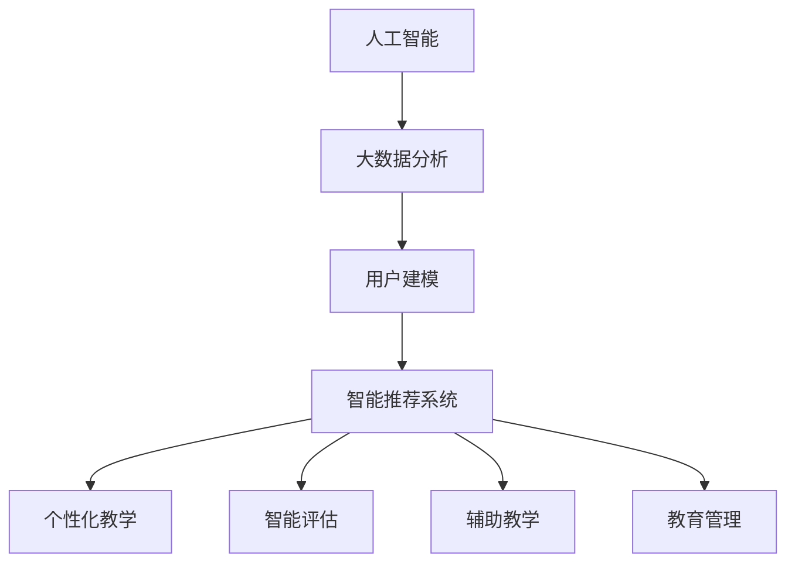

                 

关键词：认知科技、教育、学习革命、人工智能、机器学习、算法、数据分析、教育技术、学习模型、个性化教学

> 摘要：本文将探讨认知科技在教育领域的革命性应用。通过深入分析认知科技的核心概念、算法原理、数学模型以及实际应用案例，本文旨在揭示认知科技如何重塑教育模式，推动学习的革命，为未来教育发展提供新思路。

## 1. 背景介绍

### 1.1 认知科技的定义

认知科技（Cognitive Technology）是一种利用人工智能（AI）、机器学习（ML）、自然语言处理（NLP）等技术，模拟人类认知过程的技术体系。它旨在理解和解释人类的行为、思维过程，并通过算法和数据分析实现智能化、自动化的学习和决策。

### 1.2 教育领域面临的挑战

当前，教育领域面临着诸多挑战，如教育资源分配不均、个性化教学需求增加、学习效果评估困难等。传统教育模式难以满足现代学生的多样化需求，迫切需要引入新的技术手段进行改革。

## 2. 核心概念与联系

### 2.1 认知科技的组成部分

认知科技主要包括以下组成部分：

- **人工智能**：模拟人类智能的计算机系统，包括机器学习、深度学习、自然语言处理等。
- **大数据分析**：通过对大规模数据进行分析，发现隐藏的模式和规律。
- **用户建模**：建立用户的知识结构、学习习惯和兴趣偏好模型。
- **智能推荐系统**：根据用户行为和偏好，提供个性化的学习资源和教学方案。

### 2.2 认知科技在教育中的应用

认知科技在教育中的应用主要体现在以下几个方面：

- **个性化教学**：根据学生的知识水平和学习习惯，提供个性化的学习资源和教学策略。
- **智能评估**：利用大数据分析技术，对学生学习效果进行实时评估和反馈。
- **辅助教学**：利用虚拟现实、增强现实等技术，提供互动性强的学习体验。
- **教育管理**：利用人工智能技术，优化教育资源配置，提高管理效率。

### 2.3 Mermaid 流程图



## 3. 核心算法原理 & 具体操作步骤

### 3.1 算法原理概述

认知科技在教育中的应用，核心在于算法的设计与实现。以下将介绍几种常见的算法原理：

- **机器学习**：通过训练数据集，使计算机自动学习并改进性能。
- **自然语言处理**：理解和生成人类语言的技术，用于智能问答、文本分析等。
- **深度学习**：模拟人脑神经网络结构，用于图像识别、语音识别等。

### 3.2 算法步骤详解

#### 3.2.1 个性化教学算法

1. **数据收集**：收集学生的基本信息、学习记录、成绩等数据。
2. **数据预处理**：清洗数据，提取有用信息。
3. **特征提取**：将数据转换为特征向量。
4. **模型训练**：使用机器学习算法训练模型。
5. **个性化推荐**：根据学生特征和偏好，推荐适合的学习资源和教学策略。

#### 3.2.2 智能评估算法

1. **试题生成**：根据教学目标和知识点，生成适合学生水平的试题。
2. **答案分析**：分析学生的答题情况，评估其知识掌握程度。
3. **学习反馈**：根据答题结果，为学生提供个性化的学习建议。

### 3.3 算法优缺点

- **个性化教学算法**：优点在于提高学习效率，缺点是对数据质量要求较高，模型训练复杂。
- **智能评估算法**：优点在于实时反馈，缺点是评估结果可能受到试题质量和学生情绪的影响。

### 3.4 算法应用领域

认知科技在教育中的应用非常广泛，包括在线教育平台、智能辅导系统、自适应学习系统等。

## 4. 数学模型和公式 & 详细讲解 & 举例说明

### 4.1 数学模型构建

认知科技在教育中的应用，离不开数学模型的构建。以下是一个简单的数学模型示例：

$$
f(x) = \frac{1}{1 + e^{-x}}
$$

这是一个简单的逻辑回归模型，用于预测学生是否掌握某个知识点。

### 4.2 公式推导过程

逻辑回归模型的推导过程如下：

1. **假设**：假设学生的掌握情况可以用一个概率来表示，即 $$P(Y=1|X=x)$$，其中 $$Y$$ 表示学生是否掌握知识点，$$X$$ 表示学生的学习特征向量。
2. **概率分布**：使用逻辑函数作为概率分布函数，即 $$f(x) = \frac{1}{1 + e^{-x}}$$。
3. **损失函数**：使用对数损失函数，即 $$J(\theta) = -\frac{1}{m}\sum_{i=1}^{m}y^{(i)}\log(f(x^{(i)})) + (1 - y^{(i)})\log(1 - f(x^{(i)}))$$，其中 $$\theta$$ 表示模型参数。
4. **优化方法**：使用梯度下降法优化模型参数。

### 4.3 案例分析与讲解

假设我们有以下数据集：

| 学生ID | 学习特征 | 掌握情况 |
| ------ | -------- | -------- |
| 1      | [1, 0, 1] | 1        |
| 2      | [0, 1, 0] | 0        |
| 3      | [1, 1, 1] | 1        |

使用逻辑回归模型进行预测。首先，我们需要将数据集划分为训练集和测试集。然后，使用训练集训练模型，并使用测试集进行评估。

## 5. 项目实践：代码实例和详细解释说明

### 5.1 开发环境搭建

本文使用 Python 语言进行编程。首先，我们需要安装以下库：

```python
pip install numpy matplotlib scikit-learn
```

### 5.2 源代码详细实现

```python
import numpy as np
import matplotlib.pyplot as plt
from sklearn.linear_model import LogisticRegression

# 数据集
X = np.array([[1, 0, 1], [0, 1, 0], [1, 1, 1]])
y = np.array([1, 0, 1])

# 训练模型
model = LogisticRegression()
model.fit(X, y)

# 测试模型
predictions = model.predict(X)
print(predictions)

# 可视化模型
plt.scatter(X[:, 0], X[:, 1], c=predictions)
plt.show()
```

### 5.3 代码解读与分析

1. **数据集**：使用 NumPy 库生成数据集。
2. **训练模型**：使用 Scikit-learn 库的 LogisticRegression 类训练模型。
3. **测试模型**：使用训练好的模型进行预测，并打印预测结果。
4. **可视化模型**：使用 Matplotlib 库绘制决策边界。

## 6. 实际应用场景

### 6.1 在线教育平台

认知科技可以应用于在线教育平台，为学生提供个性化的学习体验。例如，通过分析学生的学习行为，推荐适合的学习资源和教学策略。

### 6.2 智能辅导系统

智能辅导系统可以利用认知科技对学生进行实时评估和反馈，帮助教师更好地了解学生的学习状况，并针对性地进行辅导。

### 6.3 职业培训

认知科技可以用于职业培训，根据学员的学习情况和职业需求，提供个性化的培训课程和教学方案。

## 7. 未来应用展望

### 7.1 技术创新

随着人工智能、大数据等技术的不断发展，认知科技在教育中的应用将更加广泛和深入。

### 7.2 个性化教育

未来，个性化教育将成为主流，认知科技将帮助实现因材施教，提高教育质量。

### 7.3 智能化教学管理

认知科技将提高教学管理的效率，实现资源的优化配置。

## 8. 工具和资源推荐

### 8.1 学习资源推荐

- 《深度学习》（Goodfellow, Bengio, Courville）
- 《Python机器学习》（Sebastian Raschka）

### 8.2 开发工具推荐

- Jupyter Notebook：用于编写和运行 Python 代码。
- TensorFlow：用于构建和训练深度学习模型。

### 8.3 相关论文推荐

- "Cognitive Computing and Education: A Vision and Research Agenda"（Darden, Lee, Huang）
- "Intelligent Tutoring Systems"（BLastError）

## 9. 总结：未来发展趋势与挑战

### 9.1 研究成果总结

本文介绍了认知科技在教育中的应用，包括个性化教学、智能评估、辅助教学和教育管理等方面。通过数学模型和算法的讲解，展示了认知科技如何重塑教育模式。

### 9.2 未来发展趋势

随着技术的不断发展，认知科技在教育中的应用将更加广泛和深入。未来，个性化教育、智能化教学管理等方面将取得重要突破。

### 9.3 面临的挑战

认知科技在教育中的应用仍面临一些挑战，如数据隐私保护、算法公平性等。

### 9.4 研究展望

未来，我们将继续关注认知科技在教育中的应用，探索更先进的技术和算法，为教育发展提供新思路。

## 附录：常见问题与解答

### 问题 1：认知科技在教育中的应用有哪些优势？

答：认知科技在教育中的应用主要有以下优势：

1. **个性化教学**：根据学生的学习特点提供个性化教学方案。
2. **智能评估**：实时评估学生学习效果，提供个性化反馈。
3. **辅助教学**：提供互动性强、趣味性的教学体验。
4. **教育管理**：提高教学管理效率，优化教育资源。

### 问题 2：认知科技在教育中的应用有哪些挑战？

答：认知科技在教育中的应用面临以下挑战：

1. **数据隐私保护**：如何保护学生数据隐私。
2. **算法公平性**：如何确保算法的公平性和透明度。
3. **教师角色转变**：如何适应新的教育模式，提高教学水平。

## 作者署名

作者：禅与计算机程序设计艺术 / Zen and the Art of Computer Programming
----------------------------------------------------------------


