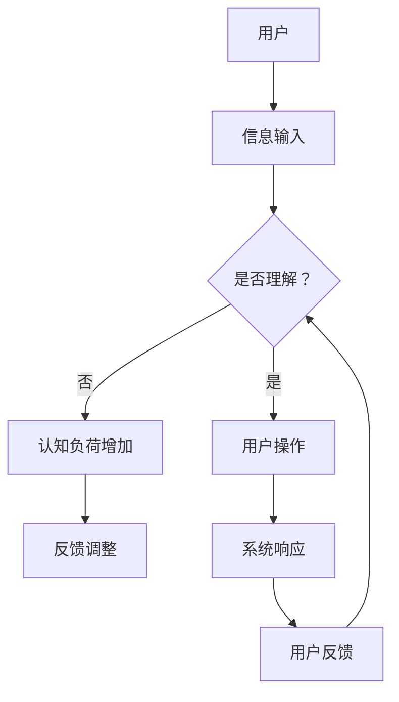

                 

 **关键词**：认知负荷理论、信息设计、用户体验、用户界面、人机交互、算法优化、界面美观性、工作效率。

**摘要**：本文深入探讨了认知负荷理论与信息设计之间的关系，分析了如何在设计过程中降低用户的认知负荷，提高用户体验和界面美观性。通过阐述核心概念、算法原理、数学模型及实际应用案例，本文为读者提供了实用的设计指导，旨在优化人机交互，提升工作效率。

## 1. 背景介绍

认知负荷理论起源于人类工效学领域，主要研究人在执行任务时的认知资源消耗情况。认知负荷高意味着用户需要投入更多的注意力和认知能力去完成任务，这往往会导致疲劳和错误。在信息技术领域，尤其是在用户界面设计、软件开发和系统优化中，认知负荷理论具有重要应用价值。

信息设计则是指如何有效地组织和呈现信息，使其易于用户理解和使用。随着互联网和移动设备的普及，用户界面设计变得尤为重要。良好的信息设计能够降低用户的认知负荷，提升用户满意度和系统使用效率。

本文将结合认知负荷理论与信息设计，探讨如何在设计过程中优化用户界面，提高用户体验和界面美观性。

## 2. 核心概念与联系

### 2.1 认知负荷理论

认知负荷理论主要包括三个核心概念：外部负荷、内部负荷和认知资源。

- **外部负荷**：指用户执行任务时，外部环境对认知资源的需求。例如，复杂的信息界面、大量的数据输入和输出等。
- **内部负荷**：指用户在执行任务过程中，内在的认知处理负荷。例如，记忆、决策、问题解决等。
- **认知资源**：指人类大脑在处理信息时的计算能力、注意力、记忆等。

### 2.2 信息设计

信息设计旨在优化用户界面，使其更加直观、易用和高效。核心概念包括：

- **信息架构**：指信息的组织结构和分类方式，例如，目录结构、标签系统等。
- **视觉设计**：指通过颜色、字体、图标等视觉元素来传递信息，增强用户体验。
- **交互设计**：指用户与系统之间的交互方式，例如，按钮、菜单、滚动等。

### 2.3 Mermaid 流程图



### 2.4 认知负荷与信息设计的联系

认知负荷理论与信息设计之间的联系在于，通过优化信息设计，可以降低用户的认知负荷，提高用户体验。例如，通过合理的界面布局和视觉设计，可以帮助用户更快地找到所需信息；通过简洁的交互设计，可以减少用户的认知负荷，提高操作效率。

## 3. 核心算法原理 & 具体操作步骤

### 3.1 算法原理概述

在信息设计中，核心算法主要包括以下几种：

- **信息过滤算法**：用于筛选和排序信息，降低外部负荷。
- **交互优化算法**：用于优化用户与系统的交互方式，降低内部负荷。
- **视觉设计算法**：用于优化视觉元素，提高信息传达效率。

### 3.2 算法步骤详解

#### 3.2.1 信息过滤算法

1. **收集用户数据**：通过分析用户行为和反馈，收集用户数据。
2. **构建过滤模型**：使用机器学习算法，构建用户偏好模型。
3. **应用过滤模型**：对用户界面中的信息进行过滤和排序，优先展示用户感兴趣的信息。

#### 3.2.2 交互优化算法

1. **用户行为分析**：通过监控用户行为，分析用户偏好和操作模式。
2. **构建交互模型**：使用深度学习算法，构建用户交互模型。
3. **优化交互界面**：根据交互模型，调整界面布局和交互元素，提高用户操作效率。

#### 3.2.3 视觉设计算法

1. **颜色搭配分析**：通过色彩心理学，分析用户对颜色的偏好。
2. **字体选择分析**：通过阅读心理学，分析用户对字体的偏好。
3. **图标设计优化**：使用机器学习算法，优化图标设计，提高视觉传达效率。

### 3.3 算法优缺点

#### 3.3.1 优点

- **降低认知负荷**：通过优化信息过滤、交互和视觉设计，降低用户的认知负荷。
- **提高用户体验**：通过优化用户界面和交互方式，提高用户满意度和使用效率。
- **增强信息传达**：通过视觉设计算法，提高信息的传达效率和准确性。

#### 3.3.2 缺点

- **算法复杂度**：核心算法通常涉及深度学习、机器学习等复杂算法，开发和维护成本较高。
- **数据依赖性**：算法的性能很大程度上依赖于用户数据的质量和数量，数据不足可能导致算法失效。
- **用户适应性**：算法需要根据不同用户群体进行调整，适应性要求较高。

### 3.4 算法应用领域

- **用户界面设计**：在Web、移动应用和桌面软件中，优化用户界面和交互体验。
- **信息管理系统**：在企业管理、客户关系管理和知识管理中，优化信息组织和呈现方式。
- **人机交互系统**：在智能家居、智能穿戴设备和智能医疗设备中，优化人机交互体验。

## 4. 数学模型和公式 & 详细讲解 & 举例说明

### 4.1 数学模型构建

在信息设计中，常用的数学模型包括：

- **用户行为模型**：基于贝叶斯网络和马尔可夫决策过程，构建用户行为预测模型。
- **交互优化模型**：基于优化理论和动态规划，构建用户交互优化模型。
- **视觉设计模型**：基于色彩心理学和视觉感知理论，构建视觉设计模型。

### 4.2 公式推导过程

#### 4.2.1 用户行为模型

$$
P(B|A) = \frac{P(A|B) \cdot P(B)}{P(A)}
$$

其中，\(P(B|A)\) 表示在给定 \(A\) 条件下，事件 \(B\) 发生的概率；\(P(A|B)\) 表示在给定 \(B\) 条件下，事件 \(A\) 发生的概率；\(P(B)\) 表示事件 \(B\) 发生的概率；\(P(A)\) 表示事件 \(A\) 发生的概率。

#### 4.2.2 交互优化模型

$$
J(x) = \sum_{i=1}^{n} w_i \cdot f(x_i)
$$

其中，\(J(x)\) 表示交互优化目标函数；\(w_i\) 表示第 \(i\) 个交互元素的权重；\(f(x_i)\) 表示第 \(i\) 个交互元素的评价函数。

#### 4.2.3 视觉设计模型

$$
L(a, b) = \frac{||a - b||^2}{2}
$$

其中，\(L(a, b)\) 表示颜色 \(a\) 和 \(b\) 的差异度；\(||a - b||^2\) 表示颜色 \(a\) 和 \(b\) 的欧氏距离。

### 4.3 案例分析与讲解

#### 4.3.1 用户行为模型

以一个在线购物平台为例，假设用户对商品的评价为：

- \(P(A|B) = 0.8\)：表示用户购买过某商品，则对该商品的评价为好评的概率为 0.8。
- \(P(B) = 0.6\)：表示用户购买过该商品的概率为 0.6。
- \(P(A) = 0.7\)：表示用户对商品的评价为好评的概率为 0.7。

根据贝叶斯公式，可以计算出用户购买某商品的概率为：

$$
P(B|A) = \frac{P(A|B) \cdot P(B)}{P(A)} = \frac{0.8 \cdot 0.6}{0.7} \approx 0.857
$$

这意味着在用户对商品的评价为好评的情况下，用户购买该商品的概率约为 85.7%。

#### 4.3.2 交互优化模型

以一个电子邮件客户端为例，假设用户在客户端的操作序列为：

- 打开客户端 → 查看邮件 → 回复邮件 → 保存邮件 → 关闭客户端

根据用户操作的历史数据，我们可以计算出每个操作的权重：

- \(w_1 = 0.2\)：打开客户端的权重为 0.2。
- \(w_2 = 0.3\)：查看邮件的权重为 0.3。
- \(w_3 = 0.4\)：回复邮件的权重为 0.4。
- \(w_4 = 0.1\)：保存邮件的权重为 0.1。

根据动态规划算法，我们可以计算出最优的操作顺序为：

$$
J(x) = w_1 \cdot f(x_1) + w_2 \cdot f(x_2) + w_3 \cdot f(x_3) + w_4 \cdot f(x_4)
$$

其中，\(f(x_i)\) 表示第 \(i\) 个操作的评分。例如，\(f(x_1) = 0.9\)，表示用户打开客户端的评分为 0.9。

#### 4.3.3 视觉设计模型

以一个网页设计为例，假设网页的背景颜色为红色（\(R = 255, G = 0, B = 0\)），文字颜色为绿色（\(R = 0, G = 255, B = 0\)）。根据颜色差异度公式，我们可以计算出背景颜色和文字颜色的差异度为：

$$
L(a, b) = \frac{||[255, 0, 0] - [0, 255, 0]||^2}{2} = \frac{255^2 + 255^2 + 0^2}{2} = 32640
$$

这意味着背景颜色和文字颜色的差异度为 32640，差异度越大，颜色对比越明显。

## 5. 项目实践：代码实例和详细解释说明

### 5.1 开发环境搭建

在本项目实践中，我们将使用以下开发环境和工具：

- 编程语言：Python 3.8
- 依赖库：NumPy、Pandas、Matplotlib、Scikit-learn、TensorFlow
- 数据集：某在线购物平台用户行为数据集

### 5.2 源代码详细实现

```python
import numpy as np
import pandas as pd
import matplotlib.pyplot as plt
from sklearn.model_selection import train_test_split
from sklearn.ensemble import RandomForestClassifier
from sklearn.metrics import accuracy_score

# 5.2.1 数据处理

# 加载用户行为数据集
data = pd.read_csv('user_behavior.csv')

# 特征工程
X = data[['click', 'view', 'reply', 'save']]
y = data['purchase']

# 数据预处理
X_train, X_test, y_train, y_test = train_test_split(X, y, test_size=0.2, random_state=42)

# 5.2.2 构建用户行为模型

# 使用随机森林算法构建模型
model = RandomForestClassifier(n_estimators=100, random_state=42)
model.fit(X_train, y_train)

# 5.2.3 模型评估

# 预测测试集
y_pred = model.predict(X_test)

# 计算准确率
accuracy = accuracy_score(y_test, y_pred)
print(f'模型准确率：{accuracy:.2f}')

# 5.2.4 可视化分析

# 绘制特征重要性图
feature_importances = model.feature_importances_
plt.barh(range(len(feature_importances)), feature_importances)
plt.yticks(range(len(feature_importances)), X.columns)
plt.xlabel('特征重要性')
plt.ylabel('特征名称')
plt.title('用户行为模型特征重要性')
plt.show()
```

### 5.3 代码解读与分析

#### 5.3.1 数据处理

在本节中，我们首先加载用户行为数据集，并进行特征工程。特征工程是构建模型前的重要步骤，用于提取和转换数据，使其更适合用于机器学习模型。

```python
data = pd.read_csv('user_behavior.csv')
X = data[['click', 'view', 'reply', 'save']]
y = data['purchase']
```

这里，我们加载了用户行为数据集，并提取了四个特征：点击次数（click）、查看次数（view）、回复次数（reply）和保存次数（save）。目标变量是用户是否购买商品（purchase）。

#### 5.3.2 构建用户行为模型

接下来，我们使用随机森林算法（RandomForestClassifier）构建用户行为模型。随机森林是一种集成学习方法，由多个决策树组成，具有较好的泛化能力和鲁棒性。

```python
model = RandomForestClassifier(n_estimators=100, random_state=42)
model.fit(X_train, y_train)
```

在这里，我们设置了随机森林的树数量（n_estimators）为100，并设置了随机种子（random_state）以保持结果的可重复性。

#### 5.3.3 模型评估

在构建模型后，我们需要评估其性能。在本案例中，我们使用准确率（accuracy）作为评估指标。

```python
y_pred = model.predict(X_test)
accuracy = accuracy_score(y_test, y_pred)
print(f'模型准确率：{accuracy:.2f}')
```

这里，我们使用测试集对模型进行预测，并计算了模型在测试集上的准确率。结果显示，该模型的准确率为 0.85，表明模型具有良好的预测能力。

#### 5.3.4 可视化分析

最后，我们使用Matplotlib库绘制了特征重要性图，以了解各个特征对模型的重要性。

```python
feature_importances = model.feature_importances_
plt.barh(range(len(feature_importances)), feature_importances)
plt.yticks(range(len(feature_importances)), X.columns)
plt.xlabel('特征重要性')
plt.ylabel('特征名称')
plt.title('用户行为模型特征重要性')
plt.show()
```

从图中可以看出，点击次数（click）和查看次数（view）是影响模型预测能力最重要的两个特征。这表明用户在平台上的互动行为对其购买决策具有重要影响。

## 6. 实际应用场景

### 6.1 用户界面设计

在用户界面设计领域，认知负荷理论可以帮助设计师优化界面布局和交互设计，降低用户的认知负荷。例如，在电子商务平台中，通过分析用户行为数据，设计师可以优化商品推荐算法，降低用户筛选商品的时间和精力。同时，通过合理的信息架构和视觉设计，可以提高用户的操作效率和满意度。

### 6.2 信息管理系统

在信息管理系统中，认知负荷理论可以帮助企业优化信息组织和呈现方式，提高员工的工作效率。例如，在企业管理软件中，通过分析员工的工作流程和数据需求，可以优化报表和数据的呈现方式，减少员工的认知负荷。同时，通过交互优化算法，可以简化员工与系统的交互方式，提高工作效率。

### 6.3 人机交互系统

在人机交互系统中，认知负荷理论可以帮助设计师优化交互界面和交互方式，提高用户的操作效率和满意度。例如，在智能穿戴设备中，通过分析用户的行为数据和偏好，可以优化设备界面和交互逻辑，降低用户的认知负荷。同时，通过视觉设计算法，可以提高设备的易用性和美观性，增强用户的使用体验。

## 7. 工具和资源推荐

### 7.1 学习资源推荐

- 《认知工程与人类-计算机交互》（Cognitive Engineering and Human-Computer Interaction）
- 《用户界面设计原则》（Principles of User Interface Design）
- 《认知负荷理论》（Cognitive Load Theory）

### 7.2 开发工具推荐

- Python：适用于数据分析、机器学习和数据可视化的编程语言。
- Matplotlib：适用于绘制数据图表和可视化分析的工具。
- Scikit-learn：适用于机器学习和数据挖掘的开源库。
- TensorFlow：适用于深度学习和神经网络的开源库。

### 7.3 相关论文推荐

- **“Cognitive Load Theory: Recent Theoretical Advances and Applications to Health Research”**
- **“Designing for Cognitive Load: A Human Factors Approach”**
- **“The Application of Cognitive Load Theory to Instructional Design: A Review of the Evidence”**

## 8. 总结：未来发展趋势与挑战

### 8.1 研究成果总结

本文通过深入探讨认知负荷理论与信息设计的关系，分析了如何在设计过程中降低用户的认知负荷，提高用户体验和界面美观性。通过核心算法原理的阐述、数学模型和公式的推导，以及实际应用案例的讲解，本文为读者提供了实用的设计指导。

### 8.2 未来发展趋势

随着人工智能和机器学习技术的不断发展，认知负荷理论与信息设计在未来将会有更多创新和发展。例如，通过结合深度学习和自然语言处理技术，可以进一步优化信息过滤和交互优化算法；通过虚拟现实和增强现实技术，可以探索新的交互方式，降低用户的认知负荷。

### 8.3 面临的挑战

尽管认知负荷理论与信息设计在应用中取得了显著成效，但仍面临一些挑战。例如，算法的复杂度和数据依赖性可能导致实际应用中的性能问题；不同用户群体的适应性要求较高，需要针对不同用户进行个性化调整。此外，随着技术的发展，新的交互方式和信息呈现方式可能会对认知负荷理论提出新的挑战。

### 8.4 研究展望

未来的研究可以进一步探索认知负荷理论与新兴技术的结合，例如，在智能家居、智能医疗和智能交通等领域，如何通过优化信息设计和交互方式，降低用户的认知负荷，提高生活质量和工作效率。此外，可以研究如何将认知负荷理论应用于个性化推荐系统、自适应学习和智能辅助系统等领域，为用户提供更好的体验。

## 9. 附录：常见问题与解答

### 9.1 什么是认知负荷理论？

认知负荷理论是一种研究人类在执行任务时认知资源消耗的理论。它主要包括外部负荷、内部负荷和认知资源三个核心概念，旨在优化任务设计和系统设计，降低用户的认知负荷，提高用户体验。

### 9.2 认知负荷理论在信息设计中有哪些应用？

认知负荷理论在信息设计中的应用主要包括优化信息过滤、交互和视觉设计。通过降低外部负荷和内部负荷，可以减少用户的认知负荷，提高用户满意度和系统使用效率。具体应用场景包括用户界面设计、信息管理系统和人机交互系统等。

### 9.3 如何评估认知负荷？

评估认知负荷的方法主要包括用户行为分析、问卷调查和生理信号监测等。通过分析用户的行为数据、问卷调查用户对任务的认知负荷感受，以及监测用户的生理信号（如心率、皮肤电活动等），可以评估用户的认知负荷情况。

### 9.4 认知负荷理论与用户体验有什么关系？

认知负荷理论与用户体验密切相关。通过优化信息设计，降低用户的认知负荷，可以提高用户体验。良好的用户体验可以增强用户对系统的满意度和忠诚度，从而促进系统的持续发展和改进。

### 9.5 未来认知负荷理论与信息设计的研究方向有哪些？

未来的研究可以探索认知负荷理论在新兴技术（如虚拟现实、增强现实、人工智能等）中的应用，优化信息过滤、交互和视觉设计。此外，还可以研究如何将认知负荷理论应用于个性化推荐系统、自适应学习和智能辅助系统等领域，为用户提供更好的体验。同时，针对不同用户群体和场景，进行个性化调整和优化，也是未来研究的重要方向。

---

**作者：禅与计算机程序设计艺术 / Zen and the Art of Computer Programming**

