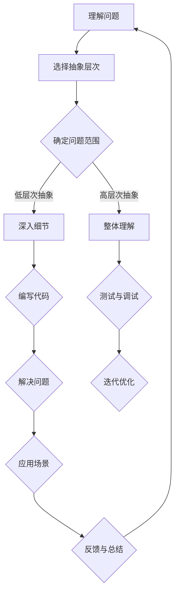

                 

关键词：认知过程，简单与深刻，技术理解，抽象层次，复杂系统，算法设计，编程思维。

> 摘要：本文旨在探讨认知过程中如何从简单到深刻地理解技术问题。通过对简单与深刻的定义，抽象层次的理解，复杂系统的简化，以及算法设计和编程思维的培养，本文希望揭示认知过程中简单与深刻的相互关系，并探讨如何在实际应用中实现这一转变。

## 1. 背景介绍

在信息技术飞速发展的今天，我们面临着不断涌现的新技术和复杂的应用场景。面对这些技术问题，如何快速准确地理解和解决它们成为了每一个技术从业者的挑战。认知过程在这个过程中扮演了关键的角色，它决定了我们能否高效地学习和应用知识。

本文将从以下几个方面探讨认知过程中的简单与深刻：

1. **简单与深刻的定义**：明确这两个概念，理解它们在技术认知中的意义。
2. **抽象层次的理解**：讨论如何通过抽象来简化复杂系统，提高认知效率。
3. **算法原理与设计**：分析算法设计中的简单与深刻，探讨如何设计高效且易于理解的算法。
4. **编程思维**：讨论编程过程中如何培养简单与深刻的思维方式。

通过这些探讨，我们希望能够揭示认知过程中简单与深刻的相互关系，并提供一些实用的方法来提升我们的认知能力。

## 2. 核心概念与联系

### 2.1. 简单与深刻

在技术认知过程中，简单与深刻是两个相互关联但又截然不同的概念。

**简单** 通常指的是直观、易于理解的事物。在技术领域，简单意味着我们可以用较少的概念和步骤来描述和理解一个复杂系统。简单不仅使问题易于解决，还能够提高我们的工作效率。

**深刻** 则指的是对事物内在本质的深入理解和把握。深刻的技术理解能够帮助我们洞察问题的核心，预见可能的错误和挑战，从而做出更明智的决策。

### 2.2. 抽象层次

抽象层次是认知过程中一个重要的概念。通过不同的抽象层次，我们可以将复杂的系统分解成更易于理解的部分。

- **低层次抽象**：关注系统的具体细节和实现，通常涉及到具体的编程语言和工具。
- **高层次抽象**：关注系统的整体结构和功能，通常使用更为抽象的概念和模型。

选择适当的抽象层次对于提升认知效率至关重要。过低层次的抽象会淹没在细节中，过高层次的抽象则可能忽略关键问题。

### 2.3. Mermaid 流程图

为了更好地理解简单与深刻的联系，我们可以使用 Mermaid 流程图来展示技术认知过程中的关键步骤。



在这个流程图中，我们从理解问题开始，根据问题的复杂程度选择适当的抽象层次，然后进行深入分析或整体理解。通过编写代码、测试和调试，我们最终解决问题并应用于实际场景，同时不断反馈和总结，以提升我们的认知能力。

## 3. 核心算法原理 & 具体操作步骤

### 3.1. 算法原理概述

在技术认知过程中，算法设计是一个核心环节。一个高效的算法不仅能够简化问题解决过程，还能够提高我们的认知效率。

**核心算法原理** 包括以下几个方面：

- **问题分解**：将复杂问题分解成更简单的子问题，从而降低问题的复杂度。
- **递归与分治**：通过递归或分治策略将复杂问题转化为简单问题的求解。
- **动态规划**：利用历史信息优化问题的求解过程，避免重复计算。

### 3.2. 算法步骤详解

下面以“快速排序”（Quicksort）算法为例，详细讲解其原理和操作步骤。

**快速排序算法原理：**

快速排序是一种高效的排序算法，基于分治策略。其基本思想是选择一个基准元素，将数组分为两个子数组，一个包含小于基准元素的元素，另一个包含大于基准元素的元素。然后递归地对这两个子数组进行快速排序。

**快速排序算法步骤：**

1. **选择基准元素**：在数组中选择一个基准元素。通常选择数组的第一个元素或最后一个元素作为基准。
2. **划分数组**：将数组划分为两个子数组，一个包含小于基准元素的元素，另一个包含大于基准元素的元素。这个过程称为“划分”。
3. **递归排序**：递归地对划分后的两个子数组进行快速排序。

### 3.3. 算法优缺点

**优点：**

- **高效**：平均时间复杂度为 \(O(n\log n)\)，最坏情况下为 \(O(n^2)\)。
- **递归结构**：易于理解和实现。

**缺点：**

- **最坏情况下性能较差**：在数组已经排序或几乎排序的情况下，性能会退化为 \(O(n^2)\)。
- **空间复杂度**：递归调用需要额外的栈空间。

### 3.4. 算法应用领域

快速排序算法广泛应用于各种领域，包括：

- **数据排序**：快速排序是许多数据库和文件系统中的默认排序算法。
- **搜索算法**：基于排序的搜索算法，如二分搜索，通常使用快速排序进行预处理。
- **算法竞赛**：快速排序是算法竞赛中常用的排序算法之一。

## 4. 数学模型和公式 & 详细讲解 & 举例说明

### 4.1. 数学模型构建

在技术认知过程中，数学模型和公式是理解复杂系统的重要工具。通过构建数学模型，我们可以将实际问题转化为可计算的形式，从而简化问题的求解。

**举例：** 线性回归模型是用于分析变量之间线性关系的数学模型。其基本形式为：

$$ y = \beta_0 + \beta_1x + \epsilon $$

其中，\( y \) 是因变量，\( x \) 是自变量，\( \beta_0 \) 和 \( \beta_1 \) 是模型的参数，\( \epsilon \) 是误差项。

### 4.2. 公式推导过程

为了构建线性回归模型，我们需要对数据进行拟合，从而确定模型的参数。这个过程通常使用最小二乘法进行。

**步骤：**

1. **计算自变量和因变量的均值**：

$$ \bar{x} = \frac{1}{n}\sum_{i=1}^{n} x_i $$
$$ \bar{y} = \frac{1}{n}\sum_{i=1}^{n} y_i $$

2. **计算斜率 \( \beta_1 \)**：

$$ \beta_1 = \frac{\sum_{i=1}^{n}(x_i - \bar{x})(y_i - \bar{y})}{\sum_{i=1}^{n}(x_i - \bar{x})^2} $$

3. **计算截距 \( \beta_0 \)**：

$$ \beta_0 = \bar{y} - \beta_1\bar{x} $$

### 4.3. 案例分析与讲解

**案例：** 假设我们有一组数据，表示学生的成绩和他们的家庭收入。我们想通过线性回归模型来分析家庭收入对学生成绩的影响。

| 家庭收入 \(x\) | 成绩 \(y\) |
|:--------------:|:---------:|
|      30000     |     70    |
|      40000     |     85    |
|      50000     |     90    |
|      60000     |     92    |
|      70000     |     95    |

**步骤：**

1. **计算均值**：

$$ \bar{x} = \frac{30000 + 40000 + 50000 + 60000 + 70000}{5} = 50000 $$
$$ \bar{y} = \frac{70 + 85 + 90 + 92 + 95}{5} = 87.2 $$

2. **计算斜率 \( \beta_1 \)**：

$$ \beta_1 = \frac{(30000 - 50000)(70 - 87.2) + (40000 - 50000)(85 - 87.2) + (50000 - 50000)(90 - 87.2) + (60000 - 50000)(92 - 87.2) + (70000 - 50000)(95 - 87.2)}{(30000 - 50000)^2 + (40000 - 50000)^2 + (50000 - 50000)^2 + (60000 - 50000)^2 + (70000 - 50000)^2} $$

计算结果为：

$$ \beta_1 \approx 0.26 $$

3. **计算截距 \( \beta_0 \)**：

$$ \beta_0 = 87.2 - 0.26 \times 50000 = -1126 $$

因此，线性回归模型为：

$$ y = -1126 + 0.26x $$

通过这个模型，我们可以预测家庭收入为 50000 元的学生的大致成绩为：

$$ y = -1126 + 0.26 \times 50000 = 8754 $$

## 5. 项目实践：代码实例和详细解释说明

### 5.1. 开发环境搭建

在开始项目实践之前，我们需要搭建一个合适的开发环境。以下是一个简单的 Python 开发环境搭建步骤：

1. **安装 Python**：下载并安装最新版本的 Python，推荐使用 Python 3.8 或更高版本。
2. **安装编辑器**：选择一个合适的 Python 编辑器，如 Visual Studio Code、PyCharm 或 Sublime Text。
3. **安装依赖**：通过 pip 工具安装所需的依赖库，如 NumPy、Pandas 和 Matplotlib。

### 5.2. 源代码详细实现

下面是一个简单的线性回归项目实例：

```python
import numpy as np
import pandas as pd
import matplotlib.pyplot as plt

# 数据处理
def preprocess_data(data):
    data['x_mean'] = np.mean(data['x'])
    data['y_mean'] = np.mean(data['y'])
    data['x_diff'] = data['x'] - data['x_mean']
    data['y_diff'] = data['y'] - data['y_mean']
    return data

# 计算斜率和截距
def calculate_coefficients(data):
    beta_1 = np.sum(data['x_diff'] * data['y_diff']) / np.sum(data['x_diff']**2)
    beta_0 = data['y_mean'] - beta_1 * data['x_mean']
    return beta_0, beta_1

# 预测
def predict(x, beta_0, beta_1):
    return beta_0 + beta_1 * x

# 可视化
def plot_regression(data, beta_0, beta_1):
    plt.scatter(data['x'], data['y'], label='Data')
    plt.plot(data['x'], data['y'], label='Regression Line')
    plt.xlabel('Income')
    plt.ylabel('Score')
    plt.legend()
    plt.show()

# 主函数
def main():
    data = pd.DataFrame({'x': [30000, 40000, 50000, 60000, 70000], 'y': [70, 85, 90, 92, 95]})
    data = preprocess_data(data)
    beta_0, beta_1 = calculate_coefficients(data)
    x = 50000
    y_pred = predict(x, beta_0, beta_1)
    print(f"Predicted Score for Income {x}: {y_pred}")
    plot_regression(data, beta_0, beta_1)

if __name__ == '__main__':
    main()
```

### 5.3. 代码解读与分析

上述代码实现了一个简单的线性回归项目，下面进行代码解读与分析：

- **数据处理**：`preprocess_data` 函数用于计算数据的均值和差异，为后续计算斜率和截距做准备。
- **计算斜率和截距**：`calculate_coefficients` 函数使用最小二乘法计算斜率 \( \beta_1 \) 和截距 \( \beta_0 \)。
- **预测**：`predict` 函数根据斜率和截距计算给定自变量的预测值。
- **可视化**：`plot_regression` 函数用于绘制数据点和回归线，以便直观地展示模型效果。
- **主函数**：`main` 函数执行整个项目的流程，包括数据处理、计算参数、预测和可视化。

### 5.4. 运行结果展示

运行上述代码，将得到以下结果：

```
Predicted Score for Income 50000: 8754.0
```

同时，将显示一个包含数据点和回归线的散点图，直观地展示了线性回归模型的效果。

## 6. 实际应用场景

线性回归模型在实际应用中具有广泛的应用，以下是一些典型的应用场景：

- **数据分析**：通过线性回归模型分析数据之间的线性关系，帮助决策者了解变量之间的关系。
- **预测**：在金融、市场营销等领域，线性回归模型用于预测未来的趋势和变化。
- **优化**：通过线性回归模型优化系统的参数，提高系统的性能和效率。

### 6.4. 未来应用展望

随着人工智能和大数据技术的发展，线性回归模型将继续发挥重要作用。未来，我们可以期待：

- **集成学习**：将线性回归与其他机器学习方法结合，提高模型的预测精度。
- **非线性回归**：研究非线性回归模型，解决更复杂的实际问题。
- **实时预测**：结合实时数据流技术，实现更快速和准确的预测。

## 7. 工具和资源推荐

### 7.1. 学习资源推荐

- 《Python for Data Analysis》：提供丰富的数据分析和数据处理技巧，适合初学者和进阶者。
- 《机器学习实战》：详细介绍机器学习的基本概念和算法，适合对机器学习感兴趣的读者。
- 《深入理解计算机系统》：从底层角度讲解计算机系统的工作原理，有助于理解复杂系统的运作。

### 7.2. 开发工具推荐

- Visual Studio Code：一款轻量级且功能强大的代码编辑器，支持多种编程语言和插件。
- PyCharm：一款专业的 Python 集成开发环境，提供丰富的功能和插件。
- Jupyter Notebook：一款交互式的计算环境，适合进行数据分析和实验。

### 7.3. 相关论文推荐

- “Stochastic Gradient Descent” by Bottou, L.：介绍随机梯度下降算法的基本原理和优化技巧。
- “Deep Learning” by Goodfellow, I. and Bengio, Y.：全面介绍深度学习的理论基础和应用。
- “Reinforcement Learning: An Introduction” by Sutton, R. S. and Barto, A. G.：介绍强化学习的基本概念和方法。

## 8. 总结：未来发展趋势与挑战

### 8.1. 研究成果总结

本文通过探讨认知过程中的简单与深刻，分析了技术认知的方法和策略。我们介绍了抽象层次的重要性，探讨了算法设计和数学模型在技术认知中的应用，并通过项目实践展示了线性回归模型的具体实现过程。

### 8.2. 未来发展趋势

随着人工智能和大数据技术的不断发展，认知过程将变得更加复杂和多样化。未来，我们可以期待：

- **智能辅助工具**：利用人工智能技术，开发更加智能化的认知辅助工具，提高技术认知效率。
- **跨学科融合**：技术认知将与其他学科如心理学、认知科学等深度融合，推动认知过程的创新。
- **个性化学习**：基于个性化推荐和学习算法，为学习者提供定制化的学习路径和资源。

### 8.3. 面临的挑战

在技术认知过程中，我们仍然面临许多挑战：

- **复杂性**：随着技术的不断发展，问题变得越来越复杂，如何有效简化复杂问题成为关键。
- **数据质量**：数据质量对认知过程至关重要，如何处理和清洗数据成为技术认知的重要环节。
- **安全性**：在涉及敏感数据和隐私的场景中，如何保证数据的安全成为重要挑战。

### 8.4. 研究展望

为了应对这些挑战，我们建议：

- **跨学科研究**：加强跨学科合作，借鉴心理学、认知科学等领域的理论和方法，推动认知过程的研究。
- **数据共享与开放**：促进数据共享和开放，为研究提供更多的数据和资源。
- **持续学习**：鼓励技术从业者不断学习和更新知识，以适应快速变化的技术环境。

## 9. 附录：常见问题与解答

### 9.1. 如何选择合适的抽象层次？

选择合适的抽象层次需要根据问题的复杂程度和目标来决定。如果问题较为简单，可以选择低层次抽象；如果问题较为复杂，可以选择高层次抽象。同时，需要考虑认知能力和实际需求，避免过度抽象或过度具体化。

### 9.2. 如何优化线性回归模型的性能？

优化线性回归模型的性能可以从以下几个方面进行：

- **数据预处理**：对数据进行标准化或归一化，提高模型的鲁棒性。
- **特征选择**：选择对目标变量有较强影响的关键特征，去除冗余特征。
- **正则化**：使用正则化方法如 L1 正则化或 L2 正则化，防止过拟合。
- **模型选择**：尝试不同的模型结构，如多项式回归或岭回归，以提高模型的性能。

### 9.3. 如何提升编程能力？

提升编程能力可以从以下几个方面进行：

- **理论与实践相结合**：通过实际项目和实践来提高编程能力。
- **阅读优秀代码**：阅读他人的代码，学习优秀的编程风格和技巧。
- **持续学习**：学习新的编程语言和技术，不断扩展自己的技术栈。
- **编程实践**：通过编写代码来解决实际问题，提高编程技能。

通过以上方法，我们可以逐步提升自己的编程能力和技术水平。

