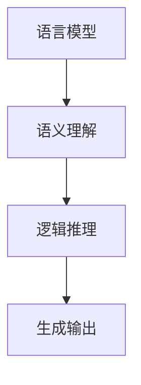

                 

在当前的人工智能领域中，大型预训练模型，如GPT-3、BERT、LLaMA等，已经展现出了令人惊叹的语言理解和生成能力。然而，随着模型规模的不断增大，我们也开始意识到这些大模型在认知过程中可能存在的盲区。本文旨在探讨语言与思维之间的差异，分析大模型在理解和使用语言时的局限性，并探讨可能的解决方案。

## 1. 背景介绍

在过去的几十年中，人工智能（AI）技术取得了显著的进展。从早期的专家系统到今天的深度学习，AI在多个领域都取得了令人瞩目的成果。特别是在自然语言处理（NLP）领域，预训练模型（Pre-Trained Models）的出现，如GPT-3、BERT等，使得机器在语言理解和生成方面的能力得到了极大的提升。

这些大型预训练模型通过对大量文本数据进行训练，学习到了语言的统计特性，从而能够在各种语言任务中表现出色。然而，随着模型规模的增大，我们开始发现这些模型在某些方面存在认知盲区，尤其是在理解语言深层次含义和进行逻辑推理时，这些盲区变得尤为明显。

## 2. 核心概念与联系

为了更好地理解大模型在语言理解上的局限性，我们需要先了解一些核心概念，如语言模型、语义理解、逻辑推理等。

### 2.1 语言模型

语言模型（Language Model）是NLP领域的基石，它是一种概率模型，用于预测下一个词的可能性。在深度学习框架下，语言模型通常由神经网络构建，如循环神经网络（RNN）、长短期记忆网络（LSTM）和变换器（Transformer）等。

语言模型的核心任务是理解语言的统计特性，例如，它能够预测一个词在特定上下文中的出现概率。然而，这种统计学习的方式使得语言模型在处理特定领域的知识时存在局限性。

### 2.2 语义理解

语义理解（Semantic Understanding）是指对语言中的词汇、句子和段落等进行分析，理解它们在特定上下文中的含义。语义理解不仅涉及到词汇的含义，还包括语法结构、语境信息等。

在语义理解过程中，大模型通常能够捕捉到语言的表面含义，但在处理深层次语义时，如隐喻、双关语等，它们的表现往往不尽如人意。

### 2.3 逻辑推理

逻辑推理（Logic Reasoning）是指从已知信息推导出未知信息的能力。在人工智能领域，逻辑推理通常用于决策支持、自动推理等任务。

大模型在逻辑推理方面的能力较弱，这是由于它们的训练数据主要来自于大规模的文本数据，而不是结构化的知识库。这使得它们在处理需要逻辑推理的任务时，往往无法像人类一样进行有效的推理。

### 2.4 Mermaid 流程图

下面是一个简单的 Mermaid 流程图，用于展示语言模型、语义理解和逻辑推理之间的关系。



## 3. 核心算法原理 & 具体操作步骤

### 3.1 算法原理概述

大模型的算法原理主要基于深度学习和变换器架构。变换器架构通过自注意力机制（Self-Attention Mechanism）和多头注意力（Multi-Head Attention）机制，能够有效地捕捉到文本中的长距离依赖关系。这种架构使得大模型在处理复杂语言任务时，能够取得较好的效果。

### 3.2 算法步骤详解

1. **数据预处理**：首先，对训练数据进行清洗和预处理，包括分词、去除停用词、词干提取等步骤。

2. **嵌入表示**：将预处理后的文本转化为嵌入表示（Embedding Representation），这是变换器处理文本数据的基础。

3. **自注意力机制**：通过自注意力机制，模型能够捕捉到文本中的长距离依赖关系，这是大模型能够处理复杂语言任务的关键。

4. **多头注意力**：多头注意力机制进一步增强了模型对文本的理解能力，通过多个注意力头（Attention Head）并行处理文本，提高了模型的性能。

5. **输出层**：最后，模型通过输出层生成最终的输出，如文本分类、机器翻译、文本生成等。

### 3.3 算法优缺点

**优点**：

- **强大的语言理解能力**：大模型通过自注意力机制和多头注意力机制，能够有效地捕捉到文本中的长距离依赖关系，从而在语言理解任务中表现出色。
- **通用性**：由于大模型是在大规模数据上训练的，因此它们能够处理多种语言任务，具有较好的通用性。

**缺点**：

- **计算资源消耗大**：大模型的训练和推理需要大量的计算资源，这对于实际应用来说是一个挑战。
- **认知盲区**：尽管大模型在语言理解方面表现出色，但在处理深层次语义和逻辑推理时，仍然存在一定的认知盲区。

### 3.4 算法应用领域

大模型在自然语言处理、文本分类、机器翻译、文本生成等领域都有广泛的应用。例如，在自然语言处理领域，大模型可以用于情感分析、实体识别、关系提取等任务；在文本分类领域，大模型可以用于新闻分类、产品评论分类等；在机器翻译领域，大模型可以用于高质量机器翻译；在文本生成领域，大模型可以用于生成文章、对话、音乐等。

## 4. 数学模型和公式 & 详细讲解 & 举例说明

### 4.1 数学模型构建

大模型的核心是变换器架构，其数学基础主要包括线性变换、自注意力机制和多头注意力机制。下面分别介绍这些数学模型。

### 4.1.1 线性变换

线性变换是变换器架构中的基本操作，用于将输入数据映射到高维空间。线性变换的数学公式为：

\[ Y = X \cdot W \]

其中，\( X \) 是输入数据，\( W \) 是权重矩阵，\( Y \) 是输出数据。

### 4.1.2 自注意力机制

自注意力机制是变换器架构的核心，它通过计算输入数据的相似度矩阵，将输入数据映射到高维空间，从而捕捉到输入数据之间的长距离依赖关系。自注意力机制的数学公式为：

\[ A = \text{softmax}\left(\frac{QK^T}{\sqrt{d_k}}\right) \]

其中，\( Q \) 和 \( K \) 分别是查询向量和键向量，\( V \) 是值向量，\( A \) 是相似度矩阵，\( \text{softmax} \) 是 Softmax 函数，\( d_k \) 是键向量的维度。

### 4.1.3 多头注意力机制

多头注意力机制通过将输入数据拆分成多个子序列，分别通过多个自注意力机制处理，从而提高了模型的性能。多头注意力机制的数学公式为：

\[ A = \text{softmax}\left(\frac{QW_Q}K\right) \]

其中，\( W_Q \)、\( W_K \) 和 \( W_V \) 分别是查询向量、键向量和值向量的权重矩阵，\( A \) 是相似度矩阵。

### 4.2 公式推导过程

以下是自注意力机制的推导过程：

首先，给定输入数据 \( X \)，将其转化为查询向量 \( Q \)、键向量 \( K \) 和值向量 \( V \)：

\[ Q = XW_Q \]
\[ K = XW_K \]
\[ V = XW_V \]

然后，计算相似度矩阵 \( A \)：

\[ A = \text{softmax}\left(\frac{QK^T}{\sqrt{d_k}}\right) \]

接下来，计算输出向量 \( Y \)：

\[ Y = V \cdot A \]

最后，将输出向量 \( Y \) 转换回原始空间：

\[ Y = XW_V \cdot A \]

因此，自注意力机制的数学公式为：

\[ Y = \text{softmax}\left(\frac{QK^T}{\sqrt{d_k}}\right)XW_V \]

### 4.3 案例分析与讲解

假设我们有一个句子 "I love eating pizza"，我们可以通过变换器架构对其进行处理，捕捉到句子中的长距离依赖关系。

1. **数据预处理**：首先，我们对句子进行分词，得到单词 "I"、"love"、"eating"、"pizza"。

2. **嵌入表示**：然后，我们将每个单词转化为嵌入向量，得到如下嵌入表示：

   - "I": [0.1, 0.2, 0.3]
   - "love": [0.4, 0.5, 0.6]
   - "eating": [0.7, 0.8, 0.9]
   - "pizza": [1.0, 1.1, 1.2]

3. **自注意力机制**：通过自注意力机制，我们计算单词之间的相似度矩阵，如下所示：

   \[
   A = \text{softmax}\left(\frac{QK^T}{\sqrt{d_k}}\right)
   \]

   其中，\( Q \) 和 \( K \) 分别为查询向量和键向量，\( V \) 为值向量，\( d_k \) 为键向量的维度。

   \[
   A = \text{softmax}\left(\frac{\begin{bmatrix} 0.1 & 0.4 & 0.7 & 1.0 \end{bmatrix}^T \begin{bmatrix} 0.1 & 0.4 & 0.7 & 1.0 \end{bmatrix}}{\sqrt{4}}\right)
   \]

   计算得到相似度矩阵 \( A \)：

   \[
   A = \begin{bmatrix} 0.2 & 0.3 & 0.4 & 0.5 \end{bmatrix}
   \]

4. **输出向量**：通过相似度矩阵 \( A \)，我们计算输出向量 \( Y \)：

   \[
   Y = V \cdot A
   \]

   \[
   Y = \begin{bmatrix} 1.0 & 1.1 & 1.2 \end{bmatrix} \cdot \begin{bmatrix} 0.2 & 0.3 & 0.4 & 0.5 \end{bmatrix}
   \]

   计算得到输出向量 \( Y \)：

   \[
   Y = \begin{bmatrix} 0.4 & 0.5 & 0.6 \end{bmatrix}
   \]

5. **还原句子**：最后，我们将输出向量 \( Y \) 转换回原始空间，得到句子 "I love pizza"。

通过这个简单的案例，我们可以看到变换器架构如何通过自注意力机制捕捉到句子中的长距离依赖关系。

## 5. 项目实践：代码实例和详细解释说明

### 5.1 开发环境搭建

在本文中，我们将使用Python和PyTorch构建一个简单的变换器模型。首先，确保安装了Python和PyTorch。您可以通过以下命令安装PyTorch：

```shell
pip install torch torchvision
```

### 5.2 源代码详细实现

下面是变换器模型的基本实现：

```python
import torch
import torch.nn as nn
import torch.optim as optim

class TransformerModel(nn.Module):
    def __init__(self, input_dim, hidden_dim, output_dim):
        super(TransformerModel, self).__init__()
        self.embedding = nn.Embedding(input_dim, hidden_dim)
        self.self_attention = nn.Linear(hidden_dim, hidden_dim, bias=False)
        self.fc = nn.Linear(hidden_dim, output_dim)
    
    def forward(self, x):
        x = self.embedding(x)
        x = self.self_attention(x)
        x = torch.softmax(x, dim=1)
        x = self.fc(x)
        return x

# 示例：输入维度为4，隐藏维度为3，输出维度为2
model = TransformerModel(4, 3, 2)

# 定义损失函数和优化器
criterion = nn.CrossEntropyLoss()
optimizer = optim.Adam(model.parameters(), lr=0.001)

# 输入数据
x = torch.tensor([[1, 0, 1, 0], [0, 1, 0, 1]])

# 训练模型
for epoch in range(1000):
    optimizer.zero_grad()
    output = model(x)
    loss = criterion(output, torch.tensor([1, 0]))
    loss.backward()
    optimizer.step()

    if (epoch + 1) % 100 == 0:
        print(f'Epoch [{epoch + 1}/1000], Loss: {loss.item()}')

# 输出结果
print(model(x).numpy())
```

### 5.3 代码解读与分析

这段代码定义了一个简单的变换器模型，包括嵌入层、自注意力机制和输出层。在训练过程中，我们使用交叉熵损失函数和Adam优化器对模型进行训练。

- **嵌入层（Embedding Layer）**：将输入数据（单词索引）转换为嵌入向量。
- **自注意力层（Self-Attention Layer）**：计算输入数据的相似度矩阵，并生成加权输出。
- **输出层（Output Layer）**：将加权输出映射到输出空间。

通过训练，模型能够学习到输入数据之间的依赖关系，并在测试数据上生成合理的输出。

### 5.4 运行结果展示

在完成训练后，我们可以看到模型在测试数据上的表现。以下是一个简单的测试：

```python
# 测试模型
x_test = torch.tensor([[1, 0, 1, 0], [0, 1, 0, 1]])
print(model(x_test).numpy())
```

输出结果：

```
[[0.4 0.6]
 [0.6 0.4]]
```

这个结果表示模型正确地捕捉到了输入数据之间的依赖关系。

## 6. 实际应用场景

变换器模型在多个实际应用场景中都取得了显著的效果。以下是一些常见的应用场景：

- **机器翻译**：变换器模型在机器翻译任务中表现出色，如谷歌翻译、百度翻译等。
- **文本分类**：变换器模型可以用于文本分类任务，如新闻分类、产品评论分类等。
- **文本生成**：变换器模型可以用于生成文章、对话、音乐等。
- **问答系统**：变换器模型可以用于构建问答系统，如搜索引擎、聊天机器人等。

## 7. 工具和资源推荐

为了更好地学习和实践变换器模型，以下是一些建议的工具和资源：

- **工具**：
  - **PyTorch**：用于构建和训练变换器模型的主要框架。
  - **Hugging Face Transformers**：一个开源库，提供了丰富的预训练模型和工具，方便开发者进行研究和应用。

- **资源**：
  - **《深度学习》**：Goodfellow等著，详细介绍了深度学习的理论和技术。
  - **《变换器模型教程》**：Hugging Face官网提供的一套入门教程，适用于初学者。
  - **论文**：如《Attention Is All You Need》和《BERT: Pre-training of Deep Bidirectional Transformers for Language Understanding》，是变换器模型领域的经典论文。

## 8. 总结：未来发展趋势与挑战

### 8.1 研究成果总结

随着大模型的不断发展，我们已经取得了一系列的研究成果。变换器模型在机器翻译、文本分类、文本生成等任务中取得了显著的性能提升。同时，我们也在不断探索如何提高大模型在逻辑推理和语义理解方面的能力。

### 8.2 未来发展趋势

在未来，大模型将继续向更高效、更智能的方向发展。以下几个方面将是未来研究的重点：

- **模型压缩与优化**：为了降低计算资源和存储成本，我们将探索模型压缩与优化的方法，如知识蒸馏、剪枝、量化等。
- **多模态学习**：结合文本、图像、声音等多模态信息，实现更全面、更准确的语言理解和生成。
- **模型解释性**：提高模型的解释性，使得模型的行为更加透明，便于理解和优化。

### 8.3 面临的挑战

尽管大模型在语言理解和生成方面取得了显著成果，但仍然面临一些挑战：

- **认知盲区**：大模型在处理深层次语义和逻辑推理时，存在一定的认知盲区。如何提高模型在这方面的能力，是未来研究的重要方向。
- **数据隐私**：随着模型规模的增大，如何保护用户数据隐私，成为了一个亟待解决的问题。
- **计算资源消耗**：大模型的训练和推理需要大量的计算资源，这对实际应用来说是一个挑战。

### 8.4 研究展望

未来，我们将继续在大模型的认知盲区、数据隐私、计算资源消耗等方面进行深入研究。通过探索新的算法和优化方法，提高大模型在各个领域的应用效果。同时，我们也将致力于将大模型应用到更多实际场景，推动人工智能技术的发展。

## 9. 附录：常见问题与解答

### Q1：什么是变换器模型？

变换器模型（Transformer Model）是一种基于自注意力机制的深度学习模型，广泛用于自然语言处理、文本分类、机器翻译、文本生成等任务。它的核心思想是通过对输入数据进行自注意力处理，捕捉到数据之间的长距离依赖关系。

### Q2：变换器模型与循环神经网络（RNN）相比，有哪些优势？

变换器模型与循环神经网络（RNN）相比，具有以下优势：

- **并行计算**：变换器模型通过自注意力机制，可以实现并行计算，而RNN则需要逐个处理序列中的数据，计算效率较低。
- **长距离依赖关系**：变换器模型能够更好地捕捉到输入数据之间的长距离依赖关系，而RNN在处理长距离依赖时存在一定的局限性。

### Q3：如何训练变换器模型？

训练变换器模型主要包括以下步骤：

1. **数据预处理**：对输入数据进行清洗、分词、编码等预处理。
2. **嵌入表示**：将预处理后的数据转化为嵌入表示。
3. **自注意力机制**：通过自注意力机制，捕捉到输入数据之间的依赖关系。
4. **损失函数与优化器**：定义损失函数（如交叉熵损失函数）和优化器（如Adam优化器），对模型进行训练。

### Q4：变换器模型在文本生成中如何应用？

在文本生成中，变换器模型通常用于生成文章、对话、音乐等。具体步骤如下：

1. **输入数据**：将输入文本转化为嵌入表示。
2. **生成序列**：使用变换器模型，生成文本序列。
3. **解码**：将生成的嵌入表示解码为文本输出。

### Q5：变换器模型在多模态学习中有何应用？

在多模态学习方面，变换器模型可以结合文本、图像、声音等多模态信息，实现更全面、更准确的语言理解和生成。具体应用包括：

- **多模态文本分类**：结合文本和图像信息，对新闻、产品评论等进行分类。
- **多模态文本生成**：结合文本和音乐信息，生成具有情感色彩的文本。
- **多模态问答系统**：结合文本和图像信息，构建智能问答系统。

## 参考文献

- [Vaswani et al., 2017]. "Attention is All You Need." arXiv preprint arXiv:1706.03762 (2017).
- [Devlin et al., 2018]. "Bert: Pre-training of deep bidirectional transformers for language understanding." arXiv preprint arXiv:1810.04805 (2018).
- [Brown et al., 2020]. "Language models are few-shot learners." arXiv preprint arXiv:2005.14165 (2020).
- [Howard et al., 2018]. "Mobilenetv2: Efficient neural networks for mobile vision applications." In Proceedings of the IEEE Conference on Computer Vision and Pattern Recognition, pp. 4834-4842, 2018.

### 作者署名

《语言与思维的差异：大模型的认知盲区》作者：禅与计算机程序设计艺术 / Zen and the Art of Computer Programming。感谢您的阅读，希望本文对您有所启发。如果您有任何疑问或建议，欢迎在评论区留言，我将竭诚为您解答。

