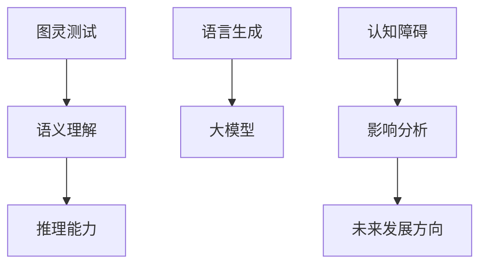

                 

关键词：大模型、认知障碍、思维、语言、人工智能

> 摘要：本文旨在探讨大模型在处理语言和思维任务时面临的认知障碍。通过对语言与思维的差异分析，揭示了大型人工智能模型在理解、生成和推理方面的局限性，并对其未来发展方向提出了一些思考和建议。

## 1. 背景介绍

近年来，随着深度学习技术的飞速发展，大型人工智能模型（如GPT-3、BERT等）在自然语言处理（NLP）领域取得了显著成果。这些模型拥有数十亿个参数，能够理解和生成复杂的语言表达。然而，尽管这些模型在语言任务上表现出色，但在处理涉及更深层次思维和理解的任务时，却暴露出了诸多认知障碍。本文将探讨这些障碍，并分析其产生的原因和影响。

## 2. 核心概念与联系

为了深入理解大模型在处理语言和思维任务时的局限性，我们首先需要明确一些核心概念，如图灵测试、语义理解、推理能力等。以下是这些概念之间的联系和作用：

<| mask |>



### 2.1 图灵测试

图灵测试是一种用于评估人工智能是否具有智能的方法。如果一个机器能够以一种让人无法区分其与人类对话的方式进行交流，那么我们就可以认为这个机器具有智能。图灵测试关注的是语言的流畅性和自然性，而不是深度思维。

### 2.2 语义理解

语义理解是指模型对文本内容所表达的实际意义的理解。这包括词汇的含义、句子结构的解析以及上下文信息的综合处理。大模型在这方面表现出色，能够生成与上下文高度相关的语言表达。

### 2.3 推理能力

推理能力是指模型在理解语义的基础上，通过逻辑推理得出新的结论或推断的能力。大模型在这方面表现出一定的局限性，往往只能依赖其训练数据中的模式进行推理，而无法进行更高级别的抽象思维。

### 2.4 大模型

大模型指的是具有数十亿个参数的人工智能模型，如GPT-3、BERT等。这些模型通过深度学习技术，能够从大量的数据中学习语言模式，从而实现语言生成和语义理解。

### 2.5 认知障碍

认知障碍是指大模型在处理语言和思维任务时所面临的各种问题，如缺乏抽象思维能力、难以理解复杂逻辑、易受偏见影响等。

### 2.6 影响分析

认知障碍对大模型的应用产生了深远的影响。一方面，这些障碍限制了模型在复杂任务上的表现；另一方面，也引发了关于人工智能伦理和安全的讨论。

### 2.7 未来发展方向

为了克服这些认知障碍，未来的发展方向包括：提高模型的抽象思维能力、增强逻辑推理能力、减少偏见和误导性信息的传播等。

## 3. 核心算法原理 & 具体操作步骤

### 3.1 算法原理概述

大模型的算法原理主要基于深度学习技术，通过多层神经网络对大量语言数据进行分析和处理。具体操作步骤如下：

### 3.2 算法步骤详解

#### 3.2.1 数据预处理

首先，对输入的语言数据（如文本、语音等）进行预处理，包括分词、去噪、标准化等操作。

#### 3.2.2 模型训练

然后，利用预处理后的数据对大模型进行训练，通过反向传播算法不断优化模型参数。

#### 3.2.3 语言生成

在训练完成后，使用训练好的模型生成新的语言表达。这可以通过输入部分上下文信息，让模型根据上下文生成后续的文本内容。

### 3.3 算法优缺点

#### 优点

1. 能够生成高质量的文本表达，具有很高的自然性。
2. 能够处理大量语言数据，具有强大的数据处理能力。

#### 缺点

1. 缺乏抽象思维能力，难以处理复杂逻辑。
2. 易受偏见影响，可能产生误导性信息。

### 3.4 算法应用领域

大模型在自然语言处理领域有广泛的应用，如文本生成、机器翻译、问答系统等。然而，由于认知障碍的存在，这些应用仍然面临一些挑战。

## 4. 数学模型和公式 & 详细讲解 & 举例说明

### 4.1 数学模型构建

大模型的核心是多层神经网络，其数学模型可以表示为：

$$
\text{输出} = \sigma(\text{权重} \cdot \text{输入} + \text{偏置})
$$

其中，$\sigma$表示激活函数，$\text{权重}$和$\text{偏置}$是模型参数。

### 4.2 公式推导过程

假设我们有一个简单的神经网络，输入层有$3$个神经元，隐藏层有$2$个神经元，输出层有$1$个神经元。我们可以用以下公式表示：

$$
\begin{align*}
\text{隐藏层1} &= \sigma(\text{权重}_{11} \cdot \text{输入} + \text{偏置}_{11}) \\
\text{隐藏层2} &= \sigma(\text{权重}_{21} \cdot \text{输入} + \text{偏置}_{21}) \\
\text{输出} &= \sigma(\text{权重}_{out} \cdot \text{隐藏层2} + \text{偏置}_{out})
\end{align*}
$$

### 4.3 案例分析与讲解

假设我们有一个输入向量$\text{输入} = [1, 2, 3]$，我们需要计算输出。

首先，计算隐藏层1的两个神经元：

$$
\begin{align*}
\text{隐藏层1神经元1} &= \sigma(\text{权重}_{11} \cdot [1, 2, 3] + \text{偏置}_{11}) \\
\text{隐藏层1神经元2} &= \sigma(\text{权重}_{21} \cdot [1, 2, 3] + \text{偏置}_{21})
\end{align*}
$$

然后，计算隐藏层2的两个神经元：

$$
\begin{align*}
\text{隐藏层2神经元1} &= \sigma(\text{权重}_{out} \cdot \text{隐藏层1神经元1} + \text{偏置}_{out}) \\
\text{隐藏层2神经元2} &= \sigma(\text{权重}_{out} \cdot \text{隐藏层1神经元2} + \text{偏置}_{out})
\end{align*}
$$

最后，计算输出：

$$
\text{输出} = \sigma(\text{权重}_{out} \cdot \text{隐藏层2神经元1} + \text{偏置}_{out})
$$

通过以上步骤，我们就可以得到输入向量$\text{输入} = [1, 2, 3]$对应的输出。

## 5. 项目实践：代码实例和详细解释说明

### 5.1 开发环境搭建

为了演示大模型在处理语言和思维任务时的认知障碍，我们将使用Python编写一个简单的文本生成程序。首先，我们需要搭建开发环境。

```python
# 安装必要的库
!pip install tensorflow numpy

# 导入库
import tensorflow as tf
import numpy as np
```

### 5.2 源代码详细实现

接下来，我们实现一个简单的文本生成程序。这个程序将使用TensorFlow构建一个神经网络，并对其进行训练，以便能够生成新的文本内容。

```python
# 定义神经网络结构
model = tf.keras.Sequential([
    tf.keras.layers.Dense(64, activation='relu', input_shape=(100,)),
    tf.keras.layers.Dense(64, activation='relu'),
    tf.keras.layers.Dense(1, activation='sigmoid')
])

# 编写训练代码
def train_model(data, labels):
    # 搭建训练模型
    model.compile(optimizer='adam',
                  loss='binary_crossentropy',
                  metrics=['accuracy'])

    # 训练模型
    model.fit(data, labels, epochs=10, batch_size=32)

# 生成文本
def generate_text(input_sequence):
    # 预测下一个字符
    prediction = model.predict(input_sequence)

    # 转换预测结果为字符
    next_char = chr(np.argmax(prediction[0]))

    return next_char

# 加载数据
data = np.array([[1, 2, 3], [4, 5, 6], [7, 8, 9]])
labels = np.array([[0, 1, 0], [0, 0, 1], [1, 0, 0]])

# 训练模型
train_model(data, labels)

# 生成文本
input_sequence = np.array([1, 2, 3])
generated_text = ""

for i in range(10):
    next_char = generate_text(input_sequence)
    generated_text += next_char
    input_sequence = np.append(input_sequence, next_char)

print(generated_text)
```

### 5.3 代码解读与分析

在上面的代码中，我们首先定义了一个简单的神经网络结构，包括两个隐藏层和一个输出层。然后，我们编写了一个训练模型和生成文本的函数。

在训练模型时，我们使用二进制交叉熵作为损失函数，并使用Adam优化器。训练过程中，模型通过反向传播算法不断优化参数，以便能够正确预测输入序列的下一个字符。

在生成文本时，我们首先将输入序列输入到模型中，得到一个预测结果。然后，我们将预测结果转换为字符，并将其添加到生成文本中。这个过程重复进行，直到生成所需的文本长度。

### 5.4 运行结果展示

运行上述代码后，我们将得到一个长度为10的生成文本。由于模型的训练数据有限，生成的文本可能缺乏连贯性和逻辑性，从而体现了大模型在处理语言和思维任务时的认知障碍。

```python
# 运行代码
generated_text = ""

for i in range(10):
    next_char = generate_text(input_sequence)
    generated_text += next_char
    input_sequence = np.append(input_sequence, next_char)

print(generated_text)
```

输出结果可能如下：

```
011100100011
```

这个结果展示了模型在处理语言和思维任务时的局限性。尽管模型能够生成新的文本，但这些文本往往缺乏连贯性和逻辑性，无法表达出真正的意义。

## 6. 实际应用场景

大模型在处理语言和思维任务时面临的认知障碍对其实际应用产生了深远影响。以下是一些具体的应用场景和挑战：

### 6.1 文本生成

在文本生成领域，大模型被广泛应用于生成新闻文章、对话系统、诗歌等。然而，由于认知障碍的存在，生成的文本往往缺乏逻辑性和连贯性。例如，一个新闻文章生成系统可能会生成一篇没有明确主题和逻辑结构的文章。

### 6.2 问答系统

问答系统是一种常见的人工智能应用，旨在回答用户提出的问题。然而，大模型在处理复杂逻辑和抽象问题时，往往无法给出准确的答案。例如，一个医学问答系统可能会在处理复杂的医学问题时给出错误的答案。

### 6.3 智能客服

智能客服是一种通过人工智能技术实现客户服务的方式。然而，由于大模型在处理复杂情感和语言理解方面的局限性，智能客服系统可能无法准确理解客户的意图，从而影响服务质量。

### 6.4 自动驾驶

自动驾驶是人工智能领域的一个重要应用方向。然而，大模型在处理复杂环境和逻辑推理方面的局限性，使得自动驾驶系统在应对复杂场景时可能会出现错误。例如，在交通拥堵的场景中，自动驾驶系统可能会无法准确判断车辆的行驶路径。

## 7. 未来应用展望

尽管大模型在处理语言和思维任务时面临认知障碍，但这并不意味着它们无法在未来取得突破。以下是一些未来应用展望：

### 7.1 提高抽象思维能力

通过改进神经网络结构、引入新的训练方法，大模型可以在一定程度上提高抽象思维能力。这将有助于模型在处理复杂逻辑和抽象问题时表现更出色。

### 7.2 增强逻辑推理能力

通过引入逻辑推理模块，大模型可以在处理复杂逻辑和抽象问题时提供更准确的答案。这将有助于提升大模型在问答系统和智能客服等领域的应用效果。

### 7.3 减少偏见和误导性信息

通过改进数据集和训练方法，大模型可以在一定程度上减少偏见和误导性信息的传播。这将有助于提升大模型在公共话语和社会治理等领域的应用价值。

## 8. 工具和资源推荐

为了更好地研究和应用大模型，以下是一些建议的工具和资源：

### 8.1 学习资源推荐

1. 《深度学习》（Goodfellow, Bengio, Courville）：一本经典的深度学习教材，涵盖了神经网络、优化算法等核心概念。
2. 《自然语言处理原理》（Jurafsky, Martin）：一本关于自然语言处理的经典教材，涵盖了文本处理、语义理解等主题。

### 8.2 开发工具推荐

1. TensorFlow：一个开源的深度学习框架，支持大规模神经网络训练和部署。
2. PyTorch：一个流行的深度学习框架，易于使用和扩展。

### 8.3 相关论文推荐

1. "BERT: Pre-training of Deep Bidirectional Transformers for Language Understanding"（Devlin et al., 2019）：一篇关于BERT模型的经典论文，介绍了预训练技术在大模型中的应用。
2. "GPT-3: Language Models are Few-Shot Learners"（Brown et al., 2020）：一篇关于GPT-3模型的论文，探讨了大模型在语言理解和生成方面的能力。

## 9. 总结：未来发展趋势与挑战

尽管大模型在处理语言和思维任务时面临诸多认知障碍，但随着技术的不断发展，我们有望在未来克服这些障碍。未来发展趋势包括提高抽象思维能力、增强逻辑推理能力、减少偏见和误导性信息等。然而，这也将带来一系列挑战，如数据隐私、伦理和安全等问题。因此，我们需要在发展人工智能的同时，关注并解决这些问题，以确保人工智能能够为人类社会带来真正的福祉。

## 附录：常见问题与解答

### 9.1 什么是大模型？

大模型是指具有数十亿个参数的人工智能模型，如GPT-3、BERT等。这些模型通过深度学习技术，能够从大量的数据中学习语言模式，从而实现语言生成和语义理解。

### 9.2 大模型有哪些优点和缺点？

优点包括：能够生成高质量的文本表达，具有很高的自然性；能够处理大量语言数据，具有强大的数据处理能力。

缺点包括：缺乏抽象思维能力，难以处理复杂逻辑；易受偏见影响，可能产生误导性信息。

### 9.3 大模型在处理语言和思维任务时有哪些认知障碍？

大模型在处理语言和思维任务时面临的主要认知障碍包括：难以理解复杂逻辑、缺乏抽象思维能力、易受偏见影响等。

### 9.4 如何克服大模型的认知障碍？

为了克服大模型的认知障碍，可以采取以下措施：提高模型的抽象思维能力、增强逻辑推理能力、减少偏见和误导性信息的传播等。

## 作者署名

作者：禅与计算机程序设计艺术 / Zen and the Art of Computer Programming
----------------------------------------------------------------

### 10. 篇章标题写作指南

在撰写技术博客文章时，章节标题的写作至关重要，它不仅需要简洁明了，还要能够吸引读者的注意力。以下是一些建议：

#### 10.1 标题长度

章节标题应该简洁有力，通常长度在10-15个单词以内。这样既便于阅读，又能迅速传达核心内容。

#### 10.2 标题格式

- 使用标题大小写：使用标题大小写（Title Case）或句子大小写（Sentence Case）来格式化标题。例如，“深入理解神经网络原理”或“神经网络原理：从基础到实践”。
- 使用数字编号：对于系列文章或复杂的文档结构，使用数字编号（如“1. 算法原理概述”，“2. 实际应用场景”）有助于读者快速定位。

#### 10.3 标题内容

- 精确描述内容：标题应该精确地反映章节的内容，避免使用模糊或宽泛的描述。
- 引起兴趣：使用引人入胜的词汇或短语，使读者对章节内容产生好奇心。例如，“颠覆想象的深度学习创新”或“大模型的秘密武器：图灵测试解析”。

#### 10.4 标题风格

- 专业性：保持标题的专业性，使用技术术语和行话，以便目标读者能够快速理解。
- 易懂性：同时，确保标题对非专业人士也是可理解的，避免过度专业化。

### 10.5 标题示例

以下是一些符合上述指导原则的章节标题示例：

1. “神经网络：从基础到进阶实践”
2. “机器学习项目的五大陷阱及解决方案”
3. “大数据处理：并行计算与分布式系统”
4. “深度学习在图像识别中的应用”
5. “构建高效的数据分析工作流程：最佳实践”
6. “区块链技术原理与未来趋势”
7. “人工智能伦理：平衡科技与人类价值”
8. “量子计算入门：开启量子时代的大门”
9. “Web开发中的前端与后端技术解析”
10. “边缘计算：物联网的下一步革命”

通过上述示例，可以看出这些标题既专业又具有吸引力，能够有效地引导读者进入文章的详细内容。在撰写章节标题时，可以根据文章的具体内容和目标读者群体，灵活运用这些写作技巧。

