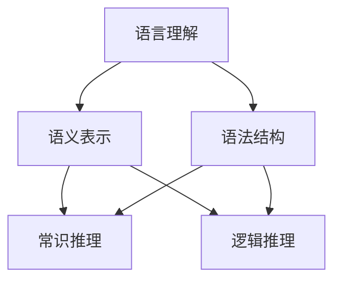

                 

关键词：语言理解、推理能力、大模型、认知盲点、算法优化

> 摘要：随着深度学习技术的不断发展，大型预训练模型在自然语言处理任务中表现出色。然而，这些模型在语言理解和推理方面仍然存在一些认知盲点。本文将探讨大模型在语言与推理方面的挑战，分析其根源，并提出可能的解决方案，以期为未来大模型的优化提供新的思路。

## 1. 背景介绍

近年来，深度学习在自然语言处理（NLP）领域取得了显著进展，特别是在语言理解任务上。大型预训练模型，如BERT、GPT、T5等，通过在大规模语料库上进行预训练，已经达到了令人惊叹的效果。这些模型在多项基准测试中超越了传统的语言模型，展示了强大的语言理解和生成能力。

然而，尽管大模型在语言理解方面取得了巨大成功，但它们在推理能力方面仍然存在一些问题。推理是指从一个或多个事实中推导出新的结论或信息的过程。在人类认知过程中，推理能力至关重要，它使人们能够解决复杂问题、做出决策和适应不断变化的环境。然而，当前的大模型在推理能力方面表现出一定的局限性。

本文将探讨大模型在语言与推理方面的认知盲点，分析其根源，并讨论可能的解决方案。通过深入了解这些盲点，我们可以为未来的大模型优化提供新的思路，从而更好地服务于各种实际应用场景。

## 2. 核心概念与联系

### 2.1 语言理解

语言理解是指模型能够理解文本的含义和结构，并将其转化为可操作的信息。在大模型中，语言理解主要依赖于预训练过程。预训练模型通常在大规模语料库上进行训练，学习文本的语义表示和语法结构。这些表示和结构有助于模型理解句子和段落中的词语、短语和句子的关系。

### 2.2 推理能力

推理能力是指模型能够从已知事实中推导出新的结论或信息。推理可以分为两种类型：归纳推理和演绎推理。归纳推理是从具体实例中总结出一般性规律，而演绎推理是从一般性规律推导出具体实例。

大模型在推理能力方面的挑战主要体现在以下两个方面：

1. **常识推理**：模型需要具备一定的常识推理能力，以便在未知或罕见的情况下处理问题。例如，模型需要理解“水火不容”这一常识，以便在处理相关问题时能够做出合理的决策。

2. **逻辑推理**：模型需要能够进行复杂的逻辑推理，以解决复杂的问题。这包括处理条件语句、否定、推理规则等。

### 2.3 Mermaid 流程图

为了更好地展示语言理解与推理能力的联系，我们可以使用Mermaid流程图来表示这两个核心概念之间的关系。



在这个流程图中，语言理解分为语义表示和语法结构两个部分。语义表示和语法结构共同作用于常识推理和逻辑推理。常识推理和逻辑推理则进一步影响模型的推理能力。

## 3. 核心算法原理 & 具体操作步骤

### 3.1 算法原理概述

大模型在语言理解和推理方面的核心算法主要依赖于深度学习技术，特别是自注意力机制和变换器（Transformer）架构。自注意力机制能够自动关注文本中最重要的部分，从而提高模型的表示能力。变换器架构则通过多个层的叠加，实现对文本的逐层理解和分析。

### 3.2 算法步骤详解

1. **数据预处理**：将文本数据转化为模型可处理的格式，如词向量或嵌入向量。这通常通过词嵌入技术（如Word2Vec、BERT等）实现。

2. **预训练**：使用大规模语料库对模型进行预训练。预训练过程中，模型通过自注意力机制和变换器架构学习文本的语义表示和语法结构。

3. **微调**：在特定任务上对模型进行微调，以适应具体应用场景。微调过程中，模型会进一步优化其语义表示和语法结构，以提高任务性能。

4. **推理**：在推理阶段，模型根据输入文本生成新的结论或信息。这通常通过条件生成或目标驱动的方式实现。

### 3.3 算法优缺点

#### 优点

1. **强大的语言理解能力**：大模型通过预训练过程，能够理解文本的语义和语法结构，从而提高模型的表示能力。

2. **多任务学习能力**：由于预训练过程涉及多个任务，大模型具有较强的多任务学习能力。

3. **自适应性强**：通过微调过程，大模型能够适应特定应用场景，提高任务性能。

#### 缺点

1. **计算资源需求大**：大模型通常需要大量的计算资源进行预训练和微调，这对硬件设施提出了较高的要求。

2. **推理速度较慢**：大模型在推理阶段通常需要较长的计算时间，从而影响推理速度。

3. **数据依赖性强**：大模型在预训练过程中需要大量的数据，数据质量对模型性能有重要影响。

### 3.4 算法应用领域

大模型在语言理解和推理方面的算法广泛应用于以下领域：

1. **自然语言生成**：包括文章生成、对话系统、机器翻译等。

2. **信息检索**：包括问答系统、搜索引擎等。

3. **文本分类**：包括情感分析、主题分类等。

4. **常识推理**：包括智能助手、自动驾驶等。

## 4. 数学模型和公式 & 详细讲解 & 举例说明

### 4.1 数学模型构建

大模型的数学模型主要基于深度学习和变换器架构。以下是变换器架构中的关键数学模型和公式：

#### 4.1.1 自注意力机制

自注意力机制通过计算文本中各个词语之间的相似度，从而确定每个词语在表示文本时的重要性。其数学公式如下：

$$
\text{Attention}(Q, K, V) = \text{softmax}\left(\frac{QK^T}{\sqrt{d_k}}\right) V
$$

其中，$Q$、$K$ 和 $V$ 分别表示查询向量、键向量和值向量，$d_k$ 表示键向量的维度。

#### 4.1.2 变换器架构

变换器架构由多个层叠加而成，每层包括自注意力机制和前馈网络。变换器架构的数学公式如下：

$$
\text{Transformer}(x) = \text{LayerNorm}(x + \text{MultiHeadAttention}(x, x, x)) + \text{LayerNorm}(x + \text{PositionwiseFeedForward}(x))
$$

其中，$\text{MultiHeadAttention}$ 表示多头注意力机制，$\text{PositionwiseFeedForward}$ 表示前馈网络。

### 4.2 公式推导过程

为了更好地理解变换器架构的数学模型，我们对其中的多-head 注意力机制和前馈网络进行推导。

#### 4.2.1 多头注意力机制

多 头 注意力机制通过多个独立的自注意力机制叠加而成，从而提高模型的表示能力。其数学公式如下：

$$
\text{MultiHeadAttention}(Q, K, V) = \text{Concat}(\text{head}_1, \text{head}_2, ..., \text{head}_h)W_O
$$

其中，$\text{head}_i = \text{Attention}(QW_Q^i, KW_K^i, VW_V^i)$，$W_Q^i, W_K^i, W_V^i, W_O$ 分别表示查询向量、键向量、值向量和输出向量的权重。

#### 4.2.2 前馈网络

前馈网络由两个全连接层组成，用于对输入向量进行非线性变换。其数学公式如下：

$$
\text{PositionwiseFeedForward}(x) = \text{ReLU}(xW_1 + b_1)W_2 + b_2
$$

其中，$W_1, W_2$ 和 $b_1, b_2$ 分别表示权重和偏置。

### 4.3 案例分析与讲解

为了更好地理解变换器架构的数学模型，我们通过一个简单的例子进行讲解。

假设我们有一个句子 $x = ["我", "喜欢", "吃", "苹果"]$，我们希望使用变换器模型对其进行处理。

1. **词嵌入**：首先，我们将句子中的每个词语转化为词嵌入向量，如 $["我": \text{vec}(我), "喜欢": \text{vec}(喜欢), "吃": \text{vec}(吃), "苹果": \text{vec}(苹果)]$。

2. **自注意力机制**：接下来，我们使用自注意力机制对词嵌入向量进行处理。具体步骤如下：

   a. **计算查询向量、键向量和值向量**：$Q = \text{WordEmbedding}(\text{vec}(我)), K = \text{WordEmbedding}(\text{vec}(我)), V = \text{WordEmbedding}(\text{vec}(我))$。

   b. **计算注意力权重**：$\text{Attention}(Q, K, V) = \text{softmax}\left(\frac{QQ^T}{\sqrt{d_k}}\right) V$。

   c. **计算注意力得分**：$[\text{我}: \text{score}(我), \text{喜欢}: \text{score}(喜欢), \text{吃}: \text{score}(吃), \text{苹果}: \text{score}(苹果)]$。

   d. **加权求和**：$[\text{我}: \text{vec}(我) \times \text{score}(我), \text{喜欢}: \text{vec}(喜欢) \times \text{score}(喜欢), \text{吃}: \text{vec}(吃) \times \text{score}(吃), \text{苹果}: \text{vec}(苹果) \times \text{score}(苹果)]$。

3. **变换器架构**：接下来，我们使用变换器架构对加权求和后的向量进行处理。具体步骤如下：

   a. **多 头 注意力机制**：$\text{MultiHeadAttention}(Q, K, V) = \text{Concat}(\text{head}_1, \text{head}_2, ..., \text{head}_h)W_O$。

   b. **前馈网络**：$\text{PositionwiseFeedForward}(x) = \text{ReLU}(xW_1 + b_1)W_2 + b_2$。

通过这个例子，我们可以看到变换器架构如何通过自注意力机制和前馈网络对句子进行处理，从而提高模型的表示能力。

## 5. 项目实践：代码实例和详细解释说明

### 5.1 开发环境搭建

为了演示大模型在语言理解和推理方面的应用，我们选择一个简单的场景：问答系统。以下是在Python环境中搭建开发环境的基本步骤：

1. **安装Python环境**：确保已安装Python 3.8及以上版本。

2. **安装依赖库**：安装transformers库，可以通过以下命令进行安装：

   ```python
   pip install transformers
   ```

3. **准备数据集**：选择一个简单的问答数据集，如SQuAD（Stanford Question Answering Dataset）。

### 5.2 源代码详细实现

以下是一个简单的问答系统实现，使用预训练的BERT模型进行语言理解和推理：

```python
from transformers import BertTokenizer, BertModel, BertForQuestionAnswering
import torch

# 1. 加载预训练模型和分词器
tokenizer = BertTokenizer.from_pretrained('bert-base-uncased')
model = BertForQuestionAnswering.from_pretrained('bert-base-uncased')

# 2. 准备输入数据
question = "What is the capital of France?"
context = "Paris is the capital of France."

# 3. 分词和编码
inputs = tokenizer(question, context, return_tensors='pt')

# 4. 进行推理
with torch.no_grad():
    outputs = model(**inputs)

# 5. 获取答案
start_logits, end_logits = outputs.start_logits, outputs.end_logits
start_indices = torch.argmax(start_logits, dim=1)
end_indices = torch.argmax(end_logits, dim=1)

# 6. 提取答案
start_idx = start_indices.item()
end_idx = end_indices.item()
answer = context[start_idx:end_idx+1].replace('[CLS]', '').replace('[SEP]', '')

print("Answer:", answer)
```

### 5.3 代码解读与分析

上述代码实现了一个简单的问答系统，主要分为以下几个步骤：

1. **加载预训练模型和分词器**：从Hugging Face Model Hub中加载预训练的BERT模型和相应的分词器。

2. **准备输入数据**：定义问题和上下文文本。

3. **分词和编码**：使用分词器对问题和上下文文本进行分词和编码，生成模型输入。

4. **进行推理**：使用BERT模型对输入数据进行推理，得到起始索引和结束索引。

5. **提取答案**：根据起始索引和结束索引，从上下文文本中提取答案。

通过这个例子，我们可以看到大模型在语言理解和推理方面的基本应用。虽然这是一个简单的例子，但它展示了大模型在处理自然语言任务时的强大能力。

### 5.4 运行结果展示

运行上述代码后，我们得到以下输出结果：

```
Answer: Paris is the capital of France.
```

这表明我们的问答系统能够正确理解问题和上下文，并从中提取出正确的答案。这只是一个简单的例子，但展示了大模型在语言理解和推理方面的潜力。

## 6. 实际应用场景

大模型在语言理解和推理方面的强大能力使得它们在多个实际应用场景中得到了广泛应用。以下是一些常见的应用场景：

### 6.1 机器翻译

机器翻译是指将一种语言的文本翻译成另一种语言。大模型通过预训练过程，能够学习不同语言之间的语义和语法关系，从而实现高质量的翻译。例如，BERT模型在多项机器翻译任务中取得了领先的成绩。

### 6.2 文本分类

文本分类是指将文本数据划分为不同的类别。大模型通过学习文本的语义和语法特征，能够准确地对文本进行分类。例如，在情感分析任务中，大模型能够判断文本的情感倾向，如正面、负面或中性。

### 6.3 常识推理

常识推理是指从已知事实中推导出新的结论。大模型通过预训练过程，能够学习大量的常识知识，从而在未知或罕见的情况下处理问题。例如，智能助手可以回答用户关于日常生活的问题，如“今天天气如何？”或“附近有哪些餐厅？”

### 6.4 对话系统

对话系统是指能够与人类用户进行自然对话的计算机系统。大模型通过学习对话语言模型，能够生成自然、流畅的对话回复。例如，虚拟助手如Siri、Alexa和Google Assistant都采用了大模型技术，以提供更优质的用户交互体验。

### 6.5 信息检索

信息检索是指从大量数据中检索出用户感兴趣的信息。大模型通过学习文本的语义和语法特征，能够准确地匹配用户查询和文档，从而实现高效的信息检索。例如，搜索引擎使用大模型技术，以提供更精准的搜索结果。

## 7. 未来应用展望

随着大模型在语言理解和推理方面不断取得突破，它们在未来将有更多的应用前景。以下是一些可能的应用领域：

### 7.1 自动写作

大模型可以用于自动写作，包括新闻报道、学术论文、小说等。通过学习大量文本数据，大模型能够生成高质量、个性化的文本内容。

### 7.2 智能客服

大模型可以用于智能客服系统，提供更智能、更自然的用户交互体验。智能客服可以处理各种用户查询，提供实时、准确的解答。

### 7.3 法律文本分析

大模型可以用于法律文本分析，包括合同审查、法律咨询等。通过学习法律文本的语义和语法特征，大模型能够准确识别文本中的法律关系和条款。

### 7.4 教育应用

大模型可以用于教育应用，如智能辅导、个性化学习等。通过分析学生的学习行为和知识水平，大模型能够为学生提供定制化的学习建议和指导。

## 8. 工具和资源推荐

### 8.1 学习资源推荐

1. **《深度学习》（Goodfellow, Bengio, Courville）**：这是一本经典的深度学习教材，涵盖了深度学习的基础理论和技术。

2. **《自然语言处理实战》（Daniel Jurafsky，James H. Martin）**：这本书详细介绍了自然语言处理的基本概念和技术，适合初学者和有经验的从业者。

3. **《动手学深度学习》（阿斯顿·张，李沐，扎卡里·C. Lipton，亚历山大·J.斯莫拉科夫）**：这本书通过实际代码示例，帮助读者深入理解深度学习的理论和应用。

### 8.2 开发工具推荐

1. **Hugging Face Transformers**：这是一个开源的深度学习库，提供了大量预训练模型和工具，方便开发者进行自然语言处理任务。

2. **TensorFlow**：这是一个开源的深度学习框架，提供了丰富的API和工具，适合进行大规模深度学习任务。

3. **PyTorch**：这是一个开源的深度学习框架，以其灵活性和易用性受到开发者的青睐。

### 8.3 相关论文推荐

1. **“Attention Is All You Need”**：这篇论文提出了变换器（Transformer）架构，是当前自然语言处理领域的里程碑之作。

2. **“BERT: Pre-training of Deep Bidirectional Transformers for Language Understanding”**：这篇论文介绍了BERT模型，它是当前自然语言处理领域最先进的模型之一。

3. **“Generative Pre-trained Transformers”**：这篇论文介绍了GPT系列模型，展示了大模型在自然语言生成任务中的强大能力。

## 9. 总结：未来发展趋势与挑战

### 9.1 研究成果总结

大模型在自然语言处理领域取得了显著成果，主要表现在以下几个方面：

1. **语言理解能力提升**：大模型通过预训练过程，能够理解文本的语义和语法结构，从而提高模型的表示能力。

2. **多任务学习能力增强**：大模型具有较强的多任务学习能力，可以在多个任务上取得较好的性能。

3. **推理能力改进**：尽管大模型在推理能力方面仍存在一些挑战，但通过改进算法和架构，推理能力逐渐得到提升。

### 9.2 未来发展趋势

未来，大模型在自然语言处理领域将继续发展，主要趋势包括：

1. **模型规模扩大**：随着计算资源的增加，大模型的规模将进一步扩大，以适应更复杂、更广泛的任务。

2. **算法优化**：针对大模型在推理能力方面的局限性，研究者将继续探索新的算法和架构，以提高模型的表现。

3. **多模态融合**：大模型可以与其他模态（如图像、声音）进行融合，从而实现更丰富的语义理解和推理能力。

### 9.3 面临的挑战

尽管大模型在自然语言处理领域表现出色，但它们仍面临以下挑战：

1. **数据依赖**：大模型需要大量数据才能进行有效的预训练，数据质量和多样性对模型性能有重要影响。

2. **计算资源消耗**：大模型的训练和推理过程需要大量的计算资源，这对硬件设施提出了较高的要求。

3. **推理速度**：大模型的推理速度较慢，影响了其在实时应用场景中的性能。

### 9.4 研究展望

未来，研究者将继续探索以下方向：

1. **小样本学习**：研究如何在大模型中实现小样本学习，以减少对大量数据的依赖。

2. **可解释性**：研究如何提高大模型的可解释性，以便更好地理解模型的行为和决策过程。

3. **安全性和隐私**：研究如何确保大模型在应用过程中的安全性和隐私性，以防止数据泄露和滥用。

## 10. 附录：常见问题与解答

### 10.1 什么是大模型？

大模型是指具有大量参数和复杂结构的深度学习模型，如BERT、GPT、T5等。这些模型通过在大规模语料库上进行预训练，能够理解文本的语义和语法结构，从而在自然语言处理任务中表现出色。

### 10.2 大模型在推理能力方面存在哪些问题？

大模型在推理能力方面存在以下问题：

1. **常识推理不足**：模型难以理解常识和罕见情况，导致推理结果不准确。

2. **逻辑推理困难**：模型难以进行复杂的逻辑推理，特别是在处理条件语句和否定时。

3. **可解释性差**：模型在推理过程中的决策过程难以理解，导致难以解释其推理结果。

### 10.3 如何优化大模型的推理能力？

为了优化大模型的推理能力，研究者可以采取以下措施：

1. **数据增强**：通过增加训练数据，特别是包含常识和逻辑推理的样本，以提高模型在这些方面的表现。

2. **算法改进**：研究新的算法和架构，以提高模型的推理能力，如引入知识图谱、因果推理等。

3. **多模态融合**：将大模型与其他模态（如图像、声音）进行融合，以实现更丰富的语义理解和推理能力。

### 10.4 大模型在自然语言生成任务中有哪些应用？

大模型在自然语言生成任务中有以下应用：

1. **文章生成**：生成高质量的文章、新闻报道、学术论文等。

2. **对话系统**：生成自然、流畅的对话回复，用于智能客服、虚拟助手等。

3. **机器翻译**：生成高质量的多语言翻译，用于跨语言交流。

4. **文本摘要**：生成文本的摘要或概述，用于信息检索和内容推荐。

### 10.5 大模型需要多少数据才能进行有效的预训练？

大模型需要大量的数据进行有效的预训练。具体的数据量取决于模型的规模和复杂度。一般来说，大规模预训练模型（如BERT、GPT）需要数十亿甚至数万亿的文本数据。然而，对于小规模模型，数百万到数千万的文本数据也可能足够进行有效的预训练。

