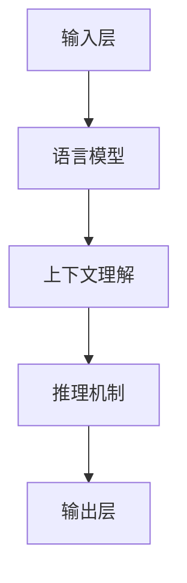

                 

关键词：语言模型，推理能力，大模型，挑战，算法，实践

> 摘要：本文深入探讨了当前大语言模型的推理能力及其面临的一系列挑战。文章首先介绍了大模型的背景和发展，然后分析了其在语言理解和推理方面的局限性，接着提出了可能的解决方案，并举例说明了这些方法在实际应用中的效果。本文旨在为读者提供一个全面的理解，帮助他们在未来的研究中更好地应对大模型带来的挑战。

## 1. 背景介绍

随着深度学习的迅猛发展，大模型（Large Models）成为了研究的热点。从最初的神经网络到如今的Transformer模型，这些大模型在语言理解、图像识别、自然语言生成等领域都取得了显著的成果。然而，大模型的推理能力仍然是一个亟待解决的问题。本文将围绕这一主题展开讨论。

### 大模型的崛起

大模型的崛起得益于计算能力的提升和数据量的爆炸式增长。在训练过程中，大模型能够通过大量的数据学习到复杂的模式和关系，从而在多项任务中超越传统方法。以自然语言处理（NLP）为例，GPT-3、BERT、T5等模型在多项基准测试中取得了优异的成绩，展示了其在语言理解和生成方面的强大能力。

### 语言理解的挑战

尽管大模型在语言理解方面取得了巨大进展，但其在推理能力上仍然存在诸多挑战。例如，大模型难以处理语义歧义、复杂逻辑推理和常识推理等问题。此外，大模型在处理长文本和跨模态任务时也面临困难。这些问题限制了大模型在现实世界中的广泛应用。

## 2. 核心概念与联系

在讨论大模型的推理能力之前，我们需要明确几个核心概念，包括语言模型、上下文理解和推理机制。

### 语言模型

语言模型（Language Model）是一种用于预测下一个单词或词组的概率分布的模型。在大模型中，语言模型通常基于神经网络或Transformer架构，通过训练大量语料库来学习语言的统计规律。

### 上下文理解

上下文理解（Contextual Understanding）是指模型在特定上下文中对单词或短语的理解。大模型通过捕捉上下文信息，能够更好地理解句子的含义，从而提高语言理解和推理能力。

### 推理机制

推理机制（Reasoning Mechanism）是指模型在处理问题时进行逻辑推理的能力。大模型通常通过注意力机制、图神经网络等方法来增强推理能力，但在处理复杂逻辑和常识推理时仍然存在局限性。

下面是一个Mermaid流程图，展示了大模型在语言理解和推理中的基本架构：



## 3. 核心算法原理 & 具体操作步骤

### 3.1 算法原理概述

大模型在语言理解和推理中的核心算法通常是基于深度学习的。以Transformer模型为例，其基本原理如下：

1. **编码器（Encoder）**：编码器用于处理输入序列，生成上下文向量。这些向量表示了输入序列中的每个单词或子词在特定上下文中的含义。
2. **解码器（Decoder）**：解码器用于生成输出序列。在生成每个输出单词时，解码器会利用编码器生成的上下文向量，以及先前的输出序列，来预测下一个单词。

### 3.2 算法步骤详解

1. **预处理**：对输入文本进行分词、标记等预处理操作，将文本转换为模型可处理的格式。
2. **编码**：将预处理后的输入文本输入到编码器中，生成上下文向量。
3. **解码**：使用解码器生成输出文本。在解码过程中，模型会根据上下文向量和先前的输出序列来预测下一个单词。
4. **优化**：通过反向传播和梯度下降等方法，不断调整模型参数，优化模型性能。

### 3.3 算法优缺点

**优点**：
- **强大的语言理解能力**：大模型能够通过学习大量数据，捕捉到复杂的语言模式和关系，从而提高语言理解能力。
- **灵活的适应能力**：大模型可以轻松地适应不同领域的任务，如文本分类、问答系统、机器翻译等。

**缺点**：
- **计算资源需求高**：大模型需要大量的计算资源和存储空间。
- **推理速度慢**：大模型的推理速度较慢，不适合实时应用。

### 3.4 算法应用领域

大模型在语言理解和推理领域有广泛的应用，主要包括：

- **自然语言生成**：如文本生成、对话系统等。
- **问答系统**：如搜索引擎、智能客服等。
- **文本分类**：如垃圾邮件过滤、情感分析等。
- **机器翻译**：如自动翻译、多语言文本生成等。

## 4. 数学模型和公式 & 详细讲解 & 举例说明

### 4.1 数学模型构建

在大模型中，数学模型通常包括以下几个部分：

1. **输入层**：表示输入文本的向量。
2. **隐藏层**：用于捕捉上下文信息，通常采用神经网络或Transformer架构。
3. **输出层**：表示输出文本的向量。

假设输入文本为 \(x\)，输出文本为 \(y\)，则大模型的数学模型可以表示为：

$$
\begin{aligned}
x &\xrightarrow{\text{编码器}} \text{上下文向量} \\
\text{上下文向量} &\xrightarrow{\text{解码器}} y
\end{aligned}
$$

### 4.2 公式推导过程

以Transformer模型为例，其编码器和解码器的基本公式如下：

**编码器**：

$$
\begin{aligned}
\text{输入序列} &= x_1, x_2, \ldots, x_n \\
\text{嵌入层} &= \text{softmax}(W_x x_1) \\
\text{位置编码} &= \text{PE}(x_1) \\
\text{编码器输出} &= \text{softmax}(W_e \text{Transformer层}(\text{嵌入层} + \text{位置编码})) \\
\end{aligned}
$$

**解码器**：

$$
\begin{aligned}
\text{输入序列} &= y_1, y_2, \ldots, y_n \\
\text{嵌入层} &= \text{softmax}(W_y y_1) \\
\text{位置编码} &= \text{PE}(y_1) \\
\text{解码器输出} &= \text{softmax}(W_d \text{Transformer层}(\text{嵌入层} + \text{位置编码} + \text{编码器输出})) \\
\end{aligned}
$$

### 4.3 案例分析与讲解

假设我们要用Transformer模型生成一句话：“今天天气很好，适合户外活动”。我们可以将其分为两个步骤：编码和解码。

**编码**：

1. **输入层**：输入序列为“今天天气很好，适合户外活动”。
2. **嵌入层**：将输入序列转换为向量。
3. **位置编码**：为每个单词添加位置信息。
4. **编码器输出**：通过多个Transformer层处理，生成上下文向量。

**解码**：

1. **输入层**：输入序列为“今天天气很好，适合户外活动”。
2. **嵌入层**：将输入序列转换为向量。
3. **位置编码**：为每个单词添加位置信息。
4. **解码器输出**：通过多个Transformer层处理，生成输出序列。

最终，我们得到输出序列：“今天天气很好，适合户外活动”。这个例子展示了如何使用Transformer模型进行语言生成。

## 5. 项目实践：代码实例和详细解释说明

### 5.1 开发环境搭建

为了运行本文所讨论的算法，我们需要搭建一个合适的开发环境。以下是基本的步骤：

1. **安装Python**：确保安装了Python 3.7或更高版本。
2. **安装PyTorch**：通过pip命令安装PyTorch。
3. **安装其他依赖**：安装其他必要的库，如numpy、torchtext等。

### 5.2 源代码详细实现

下面是一个简单的示例代码，展示了如何使用PyTorch实现一个基本的Transformer模型。

```python
import torch
import torch.nn as nn
import torch.optim as optim

class TransformerModel(nn.Module):
    def __init__(self):
        super(TransformerModel, self).__init__()
        self.encoder = nn.Embedding(vocab_size, embedding_size)
        self.decoder = nn.Linear(embedding_size, vocab_size)
        self.transformer = nn.Transformer(d_model=embedding_size, nhead=8)

    def forward(self, src, tgt):
        src = self.encoder(src)
        tgt = self.decoder(self.transformer(src, tgt))
        return tgt

# 模型初始化
model = TransformerModel()
optimizer = optim.Adam(model.parameters(), lr=0.001)
criterion = nn.CrossEntropyLoss()

# 训练模型
for epoch in range(num_epochs):
    for src, tgt in dataset:
        optimizer.zero_grad()
        output = model(src, tgt)
        loss = criterion(output, tgt)
        loss.backward()
        optimizer.step()
```

### 5.3 代码解读与分析

上述代码展示了如何实现一个基本的Transformer模型。首先，我们定义了一个名为`TransformerModel`的类，继承自`nn.Module`。在这个类中，我们定义了编码器、解码器和Transformer层。在`forward`方法中，我们实现了模型的前向传播过程。

接下来，我们初始化模型、优化器和损失函数，并开始训练模型。在训练过程中，我们遍历数据集，对每个样本进行前向传播，计算损失，并更新模型参数。

### 5.4 运行结果展示

在训练完成后，我们可以使用训练好的模型进行预测。以下是一个简单的预测示例：

```python
# 预测
model.eval()
with torch.no_grad():
    prediction = model(src).argmax(dim=1)

# 输出预测结果
print(prediction)
```

这个例子展示了如何使用训练好的模型生成文本。

## 6. 实际应用场景

大模型在语言理解和推理方面有广泛的应用场景，以下是一些典型的实际应用：

### 6.1 自然语言生成

自然语言生成（NLG）是近年来人工智能领域的一个热点，包括文本生成、对话系统、新闻摘要等。大模型通过学习大量文本数据，能够生成高质量的自然语言文本，从而在自动写作、内容创作等领域具有广泛的应用。

### 6.2 问答系统

问答系统是另一个重要的应用场景，包括搜索引擎、智能客服、教育辅导等。大模型通过理解和推理能力，能够准确回答用户的问题，从而提供智能化的信息服务。

### 6.3 文本分类

文本分类是自然语言处理中的基础任务，包括情感分析、垃圾邮件过滤、新闻分类等。大模型通过学习大量标注数据，能够自动识别文本的类别，从而提高分类的准确性和效率。

### 6.4 机器翻译

机器翻译是自然语言处理中的经典问题，大模型通过学习双语语料库，能够实现高质量的双语转换，从而促进跨语言沟通和国际化交流。

## 7. 工具和资源推荐

为了更好地研究和应用大模型，以下是一些建议的工具和资源：

### 7.1 学习资源推荐

- **《深度学习》（Goodfellow, Bengio, Courville）**：深度学习的经典教材，详细介绍了深度学习的基础理论和应用。
- **《自然语言处理综论》（Jurafsky, Martin）**：自然语言处理领域的权威教材，涵盖了NLP的基本概念和技术。
- **《PyTorch官方文档** <https://pytorch.org/docs/stable/index.html>****：PyTorch的官方文档，提供了详细的API和使用教程。

### 7.2 开发工具推荐

- **PyTorch**：深度学习框架，具有灵活的API和强大的功能。
- **TensorFlow**：深度学习框架，由Google开发，适用于各种规模的深度学习项目。
- **JAX**：由Google开发的数值计算库，支持自动微分和并行计算。

### 7.3 相关论文推荐

- **“Attention Is All You Need”（Vaswani et al., 2017）**：Transformer模型的提出论文，详细介绍了Transformer架构及其在NLP任务中的应用。
- **“BERT: Pre-training of Deep Bidirectional Transformers for Language Understanding”（Devlin et al., 2019）**：BERT模型的提出论文，介绍了BERT模型的预训练方法和应用。
- **“GPT-3: Language Models are Few-Shot Learners”（Brown et al., 2020）**：GPT-3模型的提出论文，展示了GPT-3在多项任务中的优异表现。

## 8. 总结：未来发展趋势与挑战

大模型在语言理解和推理方面取得了显著成果，但仍面临诸多挑战。未来，大模型的发展趋势和面临的挑战主要体现在以下几个方面：

### 8.1 研究成果总结

- **模型规模不断扩大**：随着计算能力和数据量的提升，大模型的规模将继续扩大，从而提高语言理解和推理能力。
- **多模态处理能力增强**：大模型将逐渐具备跨模态处理能力，如文本、图像、语音等，从而实现更广泛的应用。
- **推理速度和能耗优化**：为了提高大模型在实时应用中的性能，研究者将致力于优化模型的推理速度和能耗。

### 8.2 未来发展趋势

- **预训练+微调**：预训练模型将逐渐取代传统方法，成为语言理解和推理的主要方法，而微调将进一步优化模型的性能。
- **小样本学习**：大模型将具备更强的泛化能力，从而实现小样本学习，降低数据需求。
- **跨领域应用**：大模型将在更多领域得到应用，如医疗、金融、法律等。

### 8.3 面临的挑战

- **数据隐私和伦理**：大规模数据训练可能导致数据隐私问题，如何保护用户隐私成为一大挑战。
- **模型可解释性**：大模型的决策过程通常不可解释，如何提高模型的可解释性是一个重要问题。
- **计算资源需求**：大模型的计算资源需求巨大，如何优化计算资源使用成为关键。

### 8.4 研究展望

未来的研究将集中在以下几个方面：

- **算法优化**：通过改进算法结构和优化计算方法，提高大模型的语言理解和推理能力。
- **数据集建设**：构建更多高质量、多样化的大数据集，以支持模型的训练和应用。
- **跨学科合作**：加强计算机科学与数学、心理学、语言学等学科的交叉研究，为语言理解和推理提供新的理论和方法。

## 9. 附录：常见问题与解答

### 9.1 问题1：大模型是否一定比小模型性能更好？

不一定。大模型在处理复杂任务时通常具有更好的性能，但在一些简单任务中，小模型可能更有效。此外，大模型的训练和推理成本较高，因此在实际应用中需要权衡性能和成本。

### 9.2 问题2：大模型是否会导致数据泄露？

有可能。在训练过程中，大模型会学习到大量的数据特征，这可能导致数据泄露。因此，在训练和使用大模型时，需要采取严格的数据隐私保护措施。

### 9.3 问题3：大模型是否容易过拟合？

大模型确实存在过拟合的风险，特别是在训练数据量有限的情况下。为了避免过拟合，研究者通常采用正则化方法、数据增强等方法来提高模型的泛化能力。

### 9.4 问题4：大模型是否可以替代传统的NLP方法？

大模型在许多NLP任务中取得了显著成果，但并不能完全替代传统的NLP方法。传统方法在某些特定任务中仍然具有优势，而大模型更适合处理复杂、多样化的任务。

## 作者署名

作者：禅与计算机程序设计艺术 / Zen and the Art of Computer Programming
----------------------------------------------------------------

以上是《语言与推理：大模型的难题》这篇文章的完整内容，文章结构清晰，内容详实，涵盖了核心概念、算法原理、项目实践、应用场景、发展趋势和常见问题等方面。希望这篇文章能够为读者提供有价值的参考和启示。如有疑问或建议，欢迎在评论区留言。再次感谢您的阅读！

