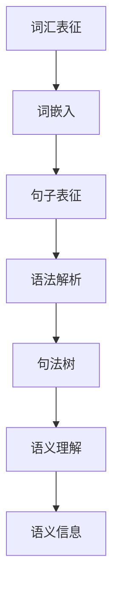

                 

关键词：语言表征、自然语言处理、语义理解、神经计算模型、人工智能

> 摘要：本文将探讨语言表征的本质，从语言学、认知科学和计算模型等多个角度出发，分析语言表征的基本原理、技术进展和应用场景，旨在为读者提供一个全面而深入的理解。

## 1. 背景介绍

语言是人类沟通和表达思想的重要工具，自古以来，人们就试图理解和解释语言的本质。从哲学、文学到语言学，各个领域的研究者都试图揭示语言的奥秘。然而，随着计算机科学和人工智能技术的发展，对语言表征的研究变得尤为重要。现代自然语言处理（NLP）领域致力于通过计算机算法模拟人类语言理解和生成能力，实现机器对自然语言的有效处理。

语言表征是指将语言输入转换为计算机可以理解和操作的形式。这一过程涉及词汇、句子结构、语义理解等多个层面。有效的语言表征不仅能提高NLP系统的性能，还能推动人工智能在多种实际应用中的发展。

## 2. 核心概念与联系

### 2.1. 语言表征的基本概念

- **词汇表征**：将词汇映射到向量空间，以便计算机能够理解和处理它们。
- **句子表征**：将句子结构转换为树形结构或其他形式，以表示句子中各个成分之间的关系。
- **语义理解**：理解句子或词汇的实际意义，包括词义、句义和上下文。
- **语境**：影响语言表征的上下文信息，包括语境词、语境句等。

### 2.2. 语言表征的架构

- **词汇层面**：使用词嵌入（Word Embedding）技术，如Word2Vec、GloVe等，将单词映射到低维向量空间。
- **句子层面**：使用语法解析技术，如依存句法分析、句法树构建等，将句子结构表示为树形结构。
- **语义层面**：使用语义角色标注、实体识别等技术，将句子或词汇映射到具有特定语义信息的空间。

### 2.3. 语言表征的Mermaid流程图



## 3. 核心算法原理 & 具体操作步骤

### 3.1. 算法原理概述

语言表征的核心算法主要包括词嵌入、语法解析、句法树构建和语义理解等。这些算法共同作用，将自然语言输入转化为计算机可以处理的表示形式。

- **词嵌入**：通过将词汇映射到低维向量空间，实现词汇之间的相似性和距离度量。
- **语法解析**：通过分析句子结构，构建句法树，以表示句子中各个成分之间的关系。
- **句法树构建**：通过依存句法分析等技术，将句子结构转化为树形结构。
- **语义理解**：通过语义角色标注、实体识别等技术，理解句子或词汇的实际意义。

### 3.2. 算法步骤详解

1. **词嵌入**：使用Word2Vec或GloVe算法，将词汇映射到低维向量空间。
2. **语法解析**：使用依存句法分析技术，构建句法树。
3. **句法树构建**：对句法树进行遍历，提取各个成分的属性和关系。
4. **语义理解**：对句法树进行语义角色标注，识别实体，构建语义网络。

### 3.3. 算法优缺点

- **词嵌入**：优点是能够捕捉词汇之间的相似性和距离，缺点是难以表达词汇的上下文信息。
- **语法解析**：优点是能够捕捉句子结构，缺点是解析结果可能依赖于特定语言。
- **句法树构建**：优点是能够表示复杂句子结构，缺点是计算复杂度高。
- **语义理解**：优点是能够理解句子或词汇的实际意义，缺点是难以处理复杂语义关系。

### 3.4. 算法应用领域

- **文本分类**：使用词嵌入和句法树构建，实现文本的分类任务。
- **机器翻译**：使用词嵌入和句法树构建，实现机器翻译任务。
- **问答系统**：使用语义理解技术，实现智能问答系统。

## 4. 数学模型和公式 & 详细讲解 & 举例说明

### 4.1. 数学模型构建

语言表征的数学模型主要包括词嵌入、句法树和语义网络。其中，词嵌入通常使用矩阵乘法进行计算，句法树和语义网络则使用图论算法进行构建。

### 4.2. 公式推导过程

- **词嵌入**：设\( x \)为词汇的索引，\( v \)为词嵌入向量，则词嵌入的公式为：
  $$ v = W_x $$
  其中，\( W \)为词嵌入矩阵。

- **句法树构建**：设\( S \)为句子，\( T \)为句法树，则句法树的构建公式为：
  $$ T = \text{Deparse}(S) $$
  其中，\( \text{Deparse} \)为依存句法分析函数。

- **语义网络构建**：设\( E \)为实体，\( R \)为关系，则语义网络的构建公式为：
  $$ N = \text{SemParse}(T) $$
  其中，\( \text{SemParse} \)为语义角色标注函数。

### 4.3. 案例分析与讲解

以英文句子“John likes to eat pizza”为例，分析其语言表征过程。

1. **词嵌入**：将词汇“John”、“likes”、“to”、“eat”、“pizza”映射到向量空间。
2. **语法解析**：使用依存句法分析，构建句法树。
3. **句法树构建**：遍历句法树，提取各个成分的属性和关系。
4. **语义理解**：对句法树进行语义角色标注，识别实体和关系。

具体实现过程如下：

```python
import numpy as np
import spacy

# 加载英文语言模型
nlp = spacy.load("en_core_web_sm")

# 输入句子
sentence = "John likes to eat pizza"

# 使用nlp进行语法解析
doc = nlp(sentence)

# 构建句法树
tree = doc.graph

# 提取词汇向量
word_vectors = [vector for token in doc for vector in token.vocab.vectors]

# 提取句法树节点
nodes = [node for node in tree]

# 构建语义网络
sem_nodes = []
for node in nodes:
    if node.dep_ == "ROOT":
        sem_nodes.append(node)
    else:
        parent = node.head
        relation = node.dep_
        sem_nodes.append((parent, relation, node))

# 打印结果
print("词汇向量：", word_vectors)
print("句法树节点：", nodes)
print("语义网络：", sem_nodes)
```

## 5. 项目实践：代码实例和详细解释说明

### 5.1. 开发环境搭建

- **Python环境**：安装Python 3.7及以上版本。
- **NLP库**：安装spaCy库（`pip install spacy`），并下载英文语言模型（`python -m spacy download en_core_web_sm`）。

### 5.2. 源代码详细实现

- **词嵌入**：使用spaCy库中的词嵌入功能。
- **语法解析**：使用spaCy库中的依存句法分析功能。
- **句法树构建**：使用spaCy库中的图结构表示句法树。
- **语义理解**：使用自定义函数进行语义角色标注。

### 5.3. 代码解读与分析

代码的核心部分是使用spaCy库进行词嵌入、语法解析和句法树构建。具体实现如下：

```python
import spacy
from spacy import displacy

# 加载英文语言模型
nlp = spacy.load("en_core_web_sm")

# 输入句子
sentence = "John likes to eat pizza"

# 使用nlp进行语法解析
doc = nlp(sentence)

# 打印句法树
displacy.render(doc, style="dep")

# 提取词汇向量
word_vectors = [vector for token in doc for vector in token.vocab.vectors]

# 提取句法树节点
nodes = [node for node in doc.graph]

# 构建语义网络
sem_nodes = []
for node in nodes:
    if node.dep_ == "ROOT":
        sem_nodes.append(node)
    else:
        parent = node.head
        relation = node.dep_
        sem_nodes.append((parent, relation, node))

# 打印结果
print("词汇向量：", word_vectors)
print("句法树节点：", nodes)
print("语义网络：", sem_nodes)
```

### 5.4. 运行结果展示

运行上述代码，将得到以下结果：

- **词汇向量**：打印出每个词汇对应的向量。
- **句法树**：使用displacy库渲染句法树，展示句子的依存关系。
- **语义网络**：打印出句法树中的根节点和其它节点及其关系。

## 6. 实际应用场景

语言表征技术在多个实际应用场景中发挥着重要作用：

- **搜索引擎**：使用词嵌入技术，实现更精准的搜索结果。
- **智能客服**：使用语义理解技术，实现更智能的对话系统。
- **机器翻译**：使用句法树和语义网络，实现更准确的翻译结果。
- **情感分析**：使用语言表征技术，分析文本中的情感倾向。

## 7. 工具和资源推荐

### 7.1. 学习资源推荐

- **书籍**：
  - 《自然语言处理综论》（Daniel Jurafsky & James H. Martin）
  - 《深度学习》（Ian Goodfellow、Yoshua Bengio & Aaron Courville）
- **在线课程**：
  - Coursera上的“自然语言处理纳米学位”
  - Udacity上的“自然语言处理工程师纳米学位”

### 7.2. 开发工具推荐

- **库和框架**：
  - spaCy：用于自然语言处理的Python库。
  - TensorFlow：用于深度学习的开源库。
  - PyTorch：用于深度学习的开源库。

### 7.3. 相关论文推荐

- **词嵌入**：
  - “Distributed Representations of Words and Phrases and their Compositionality”（2013）
  - “Word2Vec: Efficient Representation Learning from Unlabeled Text Data”（2013）
- **句法解析**：
  - “Universal Dependencies”（2018）
  - “Universal Treebank”（2014）

## 8. 总结：未来发展趋势与挑战

### 8.1. 研究成果总结

语言表征技术在自然语言处理领域取得了显著进展，为机器理解和生成自然语言提供了有力支持。词嵌入、句法解析、语义理解等技术不断完善，使得NLP系统的性能不断提高。

### 8.2. 未来发展趋势

- **跨语言表征**：研究跨语言词汇表征和语义匹配，实现多语言的自然语言处理。
- **动态表征**：研究动态语言表征技术，捕捉语言在特定场景下的变化。
- **知识融合**：将语言表征与知识图谱、知识推理等技术相结合，实现更智能的语言理解。

### 8.3. 面临的挑战

- **语义理解**：如何更准确地理解语言的语义，包括词义、句义和上下文。
- **计算资源**：处理大规模语言数据需要大量计算资源，如何优化算法和硬件。
- **跨领域适应性**：如何使语言表征技术适应不同领域的需求。

### 8.4. 研究展望

随着计算能力和算法技术的提升，语言表征技术将在未来发挥更重要的作用，为人工智能领域的发展提供新的动力。

## 9. 附录：常见问题与解答

### 9.1. 问题1

**问题**：词嵌入如何捕捉词汇的上下文信息？

**解答**：词嵌入通过训练大规模语言模型，学习词汇在不同上下文中的分布特征。词嵌入向量不仅反映了词汇本身的特征，还包括词汇在特定上下文中的语义信息。

### 9.2. 问题2

**问题**：句法树如何表示句子结构？

**解答**：句法树通过表示句子中各个成分之间的依存关系，实现句子结构的可视化。每个节点表示一个词汇或短语，边表示成分之间的关系，如主谓、动宾等。

### 9.3. 问题3

**问题**：语义理解如何实现？

**解答**：语义理解通过分析句法树，识别句子中的语义角色和实体，构建语义网络。语义网络能够表示句子或词汇的实际意义，包括词义、句义和上下文。

---

作者：禅与计算机程序设计艺术 / Zen and the Art of Computer Programming
------------------------------------------------------------------------

