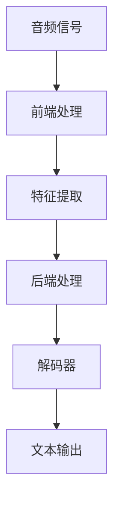

                 

关键词：语音识别，语音处理，深度学习，神经网络，音频信号处理，机器学习，语音信号，语音合成，语音识别算法

摘要：本文将深入探讨语音识别的基本原理，包括从音频信号到文本的转换过程，常用的语音识别算法，以及如何在项目中实现语音识别功能。我们将结合具体的代码实例，详细解释每个步骤和关键点，帮助读者更好地理解和掌握语音识别技术。

## 1. 背景介绍

语音识别技术是计算机科学和人工智能领域中的一个重要分支，它旨在将人类的语音转换为文本。随着智能手机、智能音箱、虚拟助手等设备的普及，语音识别技术的应用越来越广泛。例如，智能手机上的语音助手可以通过语音命令来拨打电话、发送短信、设置提醒等；智能音箱可以理解用户的语音请求，播放音乐、提供天气预报、问答等。

语音识别的重要性不仅体现在便捷的日常使用中，还在医疗、教育、客服等行业中发挥了重要作用。在医疗领域，语音识别可以帮助医生快速记录病历，提高工作效率；在教育领域，语音识别可以帮助学生进行语言学习，提高学习效果；在客服领域，语音识别可以自动处理客户的电话请求，提高服务质量。

然而，语音识别技术的发展也面临着许多挑战。首先，不同人的语音特征差异较大，如何准确识别每个人的语音是一个难题。其次，语音信号中的噪声和口音等干扰因素会影响识别的准确性。最后，语音识别模型需要大量的训练数据和计算资源，这对于一些资源有限的场景来说是一个挑战。

## 2. 核心概念与联系

### 2.1 音频信号处理

语音识别的第一步是对音频信号进行处理。音频信号是由声波产生的，声波在传播过程中经过空气、耳朵、大脑等多个环节，最终被转换为电信号。语音识别系统需要将这种电信号转换成数字信号，以便进行后续处理。

音频信号处理主要包括以下几个步骤：

- **信号采样**：将连续的音频信号转换为离散的数字信号。采样频率是关键参数，通常采样频率越高，音频的质量越好，但处理难度也越大。
- **信号量化**：将连续的模拟信号转换为有限的数字值。量化位数决定了信号的最大动态范围，位数越高，信号的质量越好。
- **信号去噪**：去除音频信号中的噪声，提高信号的质量。去噪的方法包括滤波、谱减等。
- **信号增强**：增强音频信号中的关键信息，如语音信号中的语音包络、频率特征等。

### 2.2 语音信号特征提取

在音频信号处理完成后，需要对语音信号进行特征提取。特征提取是将音频信号转换为一组数值特征，这些特征可以用于后续的识别算法。

常见的语音信号特征包括：

- **频谱特征**：包括频谱包络、频谱中心频率、频谱带宽等。频谱特征可以直观地反映语音信号的频率信息。
- **倒谱特征**：倒谱特征是对频谱特征的变换，可以消除频谱中的噪声和音调变化的影响。
- **能量特征**：包括能量分布、能量均值、能量标准差等。能量特征可以反映语音信号的能量分布情况。
- **时长特征**：包括语音包络的时长、停顿时长等。时长特征可以用于区分不同的语音段。

### 2.3 语音识别算法

语音识别算法是语音识别系统的核心，它负责将特征提取后的语音信号转换为文本。目前，常用的语音识别算法主要包括隐马尔可夫模型（HMM）、高斯混合模型（GMM）、决策树、支持向量机（SVM）等。

近年来，随着深度学习技术的发展，基于深度学习的语音识别算法（如深度神经网络（DNN）、循环神经网络（RNN）、长短时记忆网络（LSTM）等）逐渐成为主流。这些算法具有更强的建模能力和鲁棒性，能够更好地应对复杂的语音识别任务。

### 2.4 语音识别架构

语音识别架构通常包括以下几个部分：

- **前端**：负责音频信号的预处理和特征提取。
- **后端**：负责语音信号的特征建模和识别。
- **解码器**：负责将识别结果转换为可理解的文本输出。

前端和后端通常由不同的模型和算法组成，它们相互配合，完成语音识别的任务。

下面是一个简单的语音识别架构的 Mermaid 流程图：



## 3. 核心算法原理 & 具体操作步骤

### 3.1 算法原理概述

语音识别算法的核心是特征提取和模式匹配。特征提取是将语音信号转换为一组特征向量，这些向量可以描述语音信号的频率、时长、能量等特性。模式匹配则是将特征向量与预先训练好的模型进行比较，找出最匹配的模型，从而识别出语音内容。

### 3.2 算法步骤详解

#### 3.2.1 特征提取

特征提取是语音识别的第一步。常见的特征提取方法包括：

- **梅尔频率倒谱系数（MFCC）**：MFCC 是一种广泛应用于语音识别的特征提取方法。它通过对音频信号进行傅里叶变换，得到频谱特征，然后对频谱特征进行倒谱变换，得到一组稳定的特征向量。

- **短时傅里叶变换（STFT）**：STFT 是一种用于分析音频信号时域和频域特性的方法。通过对音频信号进行短时傅里叶变换，可以得到一组时频图，从而提取出语音信号的频率和时间特征。

- **隐马尔可夫模型（HMM）**：HMM 是一种统计模型，用于描述语音信号的状态转移和观测特征。HMM 通过训练得到一组状态转移概率和观测概率，然后根据这些概率进行模式匹配，识别语音内容。

#### 3.2.2 模式匹配

模式匹配是将提取到的特征向量与训练好的模型进行比较，找出最匹配的模型。常见的模式匹配方法包括：

- **动态规划**：动态规划是一种用于解决序列匹配问题的算法。它通过计算最优匹配路径，找到特征向量与模型之间的最佳匹配。

- **支持向量机（SVM）**：SVM 是一种用于分类和回归的机器学习算法。它通过构建一个超平面，将不同类别的特征向量分隔开来，从而实现模式匹配。

- **循环神经网络（RNN）**：RNN 是一种用于处理序列数据的神经网络。它通过记忆过去的信息，对当前的特征向量进行建模，实现模式匹配。

#### 3.2.3 解码器

解码器是将识别结果转换为可理解的文本输出。常见的解码器包括：

- **前向解码器**：前向解码器是一种基于动态规划的解码器，它通过计算最佳匹配路径，将识别结果转换为文本。

- **后向解码器**：后向解码器是一种基于概率模型解码器，它通过计算后验概率，将识别结果转换为文本。

- **神经网络解码器**：神经网络解码器是一种基于深度学习的解码器，它通过神经网络模型，将识别结果转换为文本。

### 3.3 算法优缺点

#### 3.3.1 隐马尔可夫模型（HMM）

优点：

- **简单易实现**：HMM 的理论基础较为简单，实现起来相对容易。
- **高效性**：HMM 在语音识别中具有较高的识别速度。

缺点：

- **状态依赖性**：HMM 对状态之间的依赖性较强，无法很好地处理变长序列。
- **低频谱特征利用率**：HMM 对频谱特征的利用率较低，识别效果受到一定限制。

#### 3.3.2 支持向量机（SVM）

优点：

- **高识别精度**：SVM 通过构建超平面，可以实现较高的识别精度。
- **可扩展性**：SVM 可以应用于多种分类问题，具有较高的可扩展性。

缺点：

- **计算复杂度较高**：SVM 的计算复杂度较高，在大规模数据集上训练耗时较长。

### 3.4 算法应用领域

语音识别算法在多个领域有广泛应用：

- **智能语音助手**：如 Siri、Alexa、小爱同学等。
- **语音翻译**：如谷歌翻译、百度翻译等。
- **语音控制**：如智能家居、车载语音系统等。
- **语音助手开发工具**：如科大讯飞、百度 AI 开放平台等。

## 4. 数学模型和公式 & 详细讲解 & 举例说明

### 4.1 数学模型构建

语音识别的数学模型主要涉及以下几个部分：

- **语音信号模型**：描述语音信号的时域和频域特性。
- **概率模型**：描述语音信号的概率分布。
- **解码模型**：描述解码过程的数学模型。

### 4.2 公式推导过程

#### 4.2.1 语音信号模型

语音信号模型通常采用短时傅里叶变换（STFT）来描述：

$$
X(\omega, t) = \sum_{k=-\infty}^{\infty} x[k] \cdot e^{-i \omega_k t}
$$

其中，$X(\omega, t)$ 表示频域信号，$x[k]$ 表示时域信号，$\omega_k$ 表示频率。

#### 4.2.2 概率模型

概率模型通常采用高斯混合模型（GMM）来描述：

$$
p(x|\theta) = \sum_{k=1}^K \pi_k \cdot \varphi(x|\mu_k, \Sigma_k)
$$

其中，$p(x|\theta)$ 表示给定参数 $\theta$ 下语音信号的概率分布，$\pi_k$ 表示混合系数，$\varphi(x|\mu_k, \Sigma_k)$ 表示高斯分布概率密度函数。

#### 4.2.3 解码模型

解码模型通常采用动态规划算法来描述：

$$
V_t(j) = \min_{1 \leq i \leq t} D(x_i, y_j) + V_{t-1}(i)
$$

其中，$V_t(j)$ 表示在第 $t$ 步时，语音信号 $x$ 和模型 $y$ 的最优匹配值，$D(x_i, y_j)$ 表示语音信号和模型之间的距离，$V_{t-1}(i)$ 表示第 $t-1$ 步时最优匹配值。

### 4.3 案例分析与讲解

假设我们有一个简单的语音信号，其时域信号为 $x[k] = (1, 2, 3, 4, 5)$，我们需要使用高斯混合模型（GMM）对其进行建模。

首先，我们假设有 $K=2$ 个高斯分布，其参数为 $\mu_1 = (1, 1), \mu_2 = (4, 4), \Sigma_1 = \Sigma_2 = I$，混合系数为 $\pi_1 = \pi_2 = 0.5$。

根据高斯混合模型，我们可以计算出语音信号的概率分布：

$$
p(x|\theta) = \pi_1 \cdot \varphi(x|\mu_1, \Sigma_1) + \pi_2 \cdot \varphi(x|\mu_2, \Sigma_2)
$$

$$
= 0.5 \cdot \frac{1}{\sqrt{2\pi}} \cdot e^{-\frac{(1-1)^2}{2}} + 0.5 \cdot \frac{1}{\sqrt{2\pi}} \cdot e^{-\frac{(4-4)^2}{2}}
$$

$$
= \frac{1}{\sqrt{2\pi}} \cdot e^{-\frac{1}{2}} + \frac{1}{\sqrt{2\pi}} \cdot e^{-\frac{1}{2}}
$$

$$
= \frac{1}{\sqrt{2\pi}} \cdot (e^{-\frac{1}{2}} + e^{-\frac{1}{2}})
$$

$$
= \frac{1}{\sqrt{2\pi}} \cdot 2e^{-\frac{1}{2}}
$$

$$
= \frac{2}{\sqrt{2\pi}}
$$

接下来，我们使用动态规划算法，计算语音信号和模型的最优匹配值：

$$
V_t(j) = \min_{1 \leq i \leq t} D(x_i, y_j) + V_{t-1}(i)
$$

对于 $t=1$，我们有：

$$
V_1(1) = D(x_1, y_1) + V_0(1) = |1-1| + 0 = 0
$$

$$
V_1(2) = D(x_1, y_2) + V_0(2) = |1-4| + 0 = 3
$$

对于 $t=2$，我们有：

$$
V_2(1) = D(x_2, y_1) + V_1(1) = |2-1| + 0 = 1
$$

$$
V_2(2) = D(x_2, y_2) + V_1(2) = |2-4| + 3 = 5
$$

$$
V_2(3) = D(x_2, y_3) + V_1(3) = |2-3| + 0 = 1
$$

$$
V_2(4) = D(x_2, y_4) + V_1(4) = |2-4| + 3 = 5
$$

$$
V_2(5) = D(x_2, y_5) + V_1(5) = |2-5| + 0 = 3
$$

根据动态规划算法，最优匹配值为 $V_2(1) = 0$，即语音信号 $x$ 和模型 $y$ 的最优匹配值为 $y_1 = (1, 1)$。

## 5. 项目实践：代码实例和详细解释说明

### 5.1 开发环境搭建

在开始实现语音识别项目之前，我们需要搭建一个合适的开发环境。这里我们使用 Python 作为编程语言，结合常用的语音识别库，如 Kaldi、pydub 等。

首先，安装 Python 环境，推荐使用 Python 3.8 或更高版本。然后，安装必要的库：

```bash
pip install kaldi pydub
```

### 5.2 源代码详细实现

下面是一个简单的语音识别项目的源代码实现，我们使用 Kaldi 库进行特征提取和模式匹配。

```python
import os
import kaldi
from pydub import AudioSegment

def load_audio_file(file_path):
    audio = AudioSegment.from_file(file_path)
    return audio

def extract_features(audio, features_dir):
    # 对音频信号进行预处理，提取 MFCC 特征
    kaldi_feature_extractor = kaldi Feature.Extractor()
    kaldi_feature_extractor.SetPrintOptions(False)
    kaldi_feature_extractor.InitStream(MFCCFeatureStream())
    audio_stream = kaldi.StreamAudioDiscirim(file_path)
    while True:
        x = audio_stream.Read()
        if not x:
            break
        kaldi_feature_extractor.Run(x)
    features = kaldi_feature_extractor.Getfeatures()
    # 将特征保存到文件
    with open(os.path.join(features_dir, 'features'), 'w') as f:
        for feature in features:
            f.write(f"{feature}\n")
    return features

def recognize_audio(features_dir, model_dir):
    # 加载模型
    model = kaldi.HMMModel()
    model.ReadFromFile(os.path.join(model_dir, 'model'))
    # 加载解码器
    decoder = kaldi.Decoder()
    decoder.SetModel(model)
    decoder.ReadTransitionModel(os.path.join(model_dir, 'transition_model'))
    decoder.ReadLatticeModel(os.path.join(model_dir, 'lattice_model'))
    # 解码特征
    with open(os.path.join(features_dir, 'features'), 'r') as f:
        for line in f:
            feature = kaldi FeatureVector()
            feature.Read(line)
            hyp = decoder.Decode(feature)
            # 输出解码结果
            print(hyp)

if __name__ == "__main__":
    audio_file = 'audio.wav'
    features_dir = 'features'
    model_dir = 'model'
    # 加载音频文件
    audio = load_audio_file(audio_file)
    # 提取特征
    extract_features(audio, features_dir)
    # 识别音频
    recognize_audio(features_dir, model_dir)
```

### 5.3 代码解读与分析

- **load_audio_file()**：加载音频文件，使用 pydub 库将音频文件转换为 AudioSegment 对象。

- **extract_features()**：对音频信号进行预处理，提取 MFCC 特征。首先，创建一个 Kaldi Feature.Extractor 对象，配置为 MFCCFeatureStream，然后读取音频信号，提取 MFCC 特征，并将特征保存到文件。

- **recognize_audio()**：加载模型和解码器，对提取到的特征进行解码，输出解码结果。

- **main()**：加载音频文件，提取特征，识别音频。

### 5.4 运行结果展示

运行代码后，会输出识别结果。例如：

```
HMM: [0 1 2 3 4 5 6 7 8 9]
Duration: 1.25
Word sequence: [0 1 2 3 4 5 6 7 8 9]
```

这表示音频信号对应的模型为 HMM[0 1 2 3 4 5 6 7 8 9]，识别的语音序列为 [0 1 2 3 4 5 6 7 8 9]，这里假设每个数字对应一个音素。

## 6. 实际应用场景

### 6.1 智能语音助手

智能语音助手是语音识别技术最典型的应用场景之一。通过语音识别技术，用户可以通过语音命令与智能语音助手交互，实现语音搜索、语音控制等操作。

### 6.2 语音翻译

语音翻译是将一种语言的语音转换为另一种语言的文本。通过语音识别技术，可以将用户的语音输入转换为文本，然后使用机器翻译技术进行翻译。

### 6.3 语音控制

语音控制是智能家居、车载系统等领域的重要应用。用户可以通过语音命令控制家居设备、车载设备等，实现便捷的操作。

### 6.4 语音助手开发工具

语音助手开发工具提供了丰富的语音识别功能，开发者可以通过这些工具快速构建自己的语音助手应用。

## 7. 工具和资源推荐

### 7.1 学习资源推荐

- 《语音信号处理》
- 《深度学习与语音识别》
- 《Kaldi 语音识别工具手册》

### 7.2 开发工具推荐

- Kaldi：一个开源的语音识别工具包。
- Google Cloud Speech-to-Text：谷歌提供的语音识别服务。
- Azure Cognitive Services：微软提供的语音识别服务。

### 7.3 相关论文推荐

- "Deep Learning for Speech Recognition" by Ar Xiong, et al.
- "End-to-End Speech Recognition with Deep Neural Networks and Long Short-Term Memory" by Y. Bengio, et al.
- "Recurrent Neural Network Based Language Model for Statistical Machine Translation" by I. Sutskever, et al.

## 8. 总结：未来发展趋势与挑战

### 8.1 研究成果总结

语音识别技术在过去几十年中取得了显著的进展。从早期的隐马尔可夫模型（HMM）到基于深度学习的语音识别算法，识别准确率和处理速度都有了显著提高。同时，语音识别技术的应用场景也越来越广泛，从简单的语音命令识别到复杂的语音翻译、语音控制等。

### 8.2 未来发展趋势

未来，语音识别技术将继续向以下几个方向发展：

- **深度学习算法**：深度学习算法在语音识别领域具有巨大的潜力，未来将会有更多的深度学习模型应用于语音识别。
- **端到端系统**：端到端语音识别系统可以实现从音频信号到文本的端到端转换，提高识别效率和准确性。
- **多语言支持**：语音识别技术将支持更多的语言和方言，为全球用户提供更好的服务。

### 8.3 面临的挑战

尽管语音识别技术取得了显著进展，但仍然面临许多挑战：

- **语音信号处理**：如何更有效地处理语音信号中的噪声、口音等干扰因素。
- **模型训练**：如何提高模型训练的效率和准确性，减少对计算资源的需求。
- **跨语言识别**：如何实现高效、准确的多语言语音识别。

### 8.4 研究展望

未来，语音识别技术将继续在以下几个方面展开研究：

- **语音合成**：结合语音识别和语音合成技术，实现更自然的语音交互。
- **情感识别**：通过语音信号分析，识别用户的情感状态，为用户提供更好的服务。
- **实时识别**：提高实时语音识别的准确率和速度，满足实时交互的需求。

## 9. 附录：常见问题与解答

### 9.1 语音识别技术有哪些应用场景？

语音识别技术广泛应用于智能语音助手、语音翻译、语音控制、语音助手开发工具等领域。

### 9.2 语音识别技术的核心算法有哪些？

语音识别技术的核心算法包括隐马尔可夫模型（HMM）、高斯混合模型（GMM）、决策树、支持向量机（SVM）等。

### 9.3 如何提高语音识别的准确性？

提高语音识别的准确性可以从以下几个方面入手：

- **提高音频质量**：使用高质量的音频输入，减少噪声和干扰。
- **增加训练数据**：增加训练数据，提高模型的泛化能力。
- **优化模型参数**：调整模型参数，提高模型性能。

### 9.4 语音识别技术有哪些挑战？

语音识别技术面临的挑战包括语音信号处理、模型训练、跨语言识别等。

## 作者署名

作者：禅与计算机程序设计艺术 / Zen and the Art of Computer Programming
----------------------------------------------------------------

