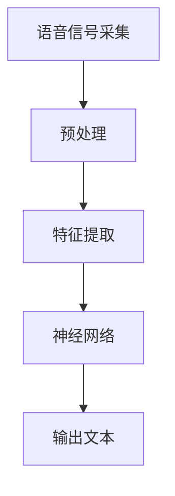

                 

关键词：语音识别、深度学习、神经网络、语音信号处理、算法实现、案例研究

> 摘要：本文将深入探讨语音识别的原理及其在现实中的应用，通过详细的算法讲解和代码实战案例，帮助读者理解语音识别技术的核心概念、实现步骤及潜在应用场景。

## 1. 背景介绍

语音识别作为人工智能领域的一项关键技术，近年来得到了广泛关注和应用。随着语音交互的普及，语音识别技术在智能音箱、语音助手、电话客服等场景中发挥了重要作用。其基本原理是通过捕捉和分析语音信号，将其转换为文本，从而实现人机交互。语音识别技术的发展不仅依赖于高性能计算硬件的进步，也得益于深度学习等人工智能技术的突破。

本文将围绕语音识别的核心技术展开，介绍其基本概念、算法原理及实现步骤，并通过实际代码案例进行详细讲解，帮助读者全面理解语音识别技术。

## 2. 核心概念与联系

### 2.1. 语音信号处理

语音信号处理是语音识别的基础。它包括语音信号的采集、预处理、特征提取等步骤。

- **采集**：使用麦克风等设备捕捉语音信号。
- **预处理**：对采集到的信号进行降噪、去噪等处理，以提高信号质量。
- **特征提取**：将语音信号转换为数字特征，如梅尔频率倒谱系数（MFCC）。

### 2.2. 神经网络

神经网络是语音识别的核心算法。它通过多层非线性变换，将输入的特征映射到输出。

- **输入层**：接收语音信号的特征。
- **隐藏层**：进行特征提取和变换。
- **输出层**：产生文本输出。

### 2.3. 深度学习

深度学习是神经网络的一种实现方式，它通过多层神经网络实现复杂的特征学习。

- **卷积神经网络（CNN）**：适用于图像识别，但在语音信号处理中也表现出色。
- **递归神经网络（RNN）**：适用于序列数据处理，是语音识别中常用的模型。
- **长短期记忆网络（LSTM）**：RNN的一种改进，解决了长期依赖问题。

### 2.4. Mermaid 流程图



## 3. 核心算法原理 & 具体操作步骤

### 3.1. 算法原理概述

语音识别的核心算法是深度学习神经网络。该算法通过训练大量语音数据和对应的文本标签，学习语音信号和文本之间的映射关系。具体过程如下：

1. **数据采集**：收集大量的语音数据，包括不同的说话人、不同的语言、不同的语音环境等。
2. **数据处理**：对语音数据进行预处理，包括去噪、分段、对齐等。
3. **特征提取**：使用梅尔频率倒谱系数（MFCC）等特征提取方法，将语音信号转换为数字特征。
4. **模型训练**：使用深度学习算法，如卷积神经网络（CNN）或长短期记忆网络（LSTM），训练语音信号到文本的映射模型。
5. **模型评估**：使用测试数据集评估模型性能，包括准确率、召回率、F1值等指标。
6. **模型部署**：将训练好的模型部署到实际应用中，如智能音箱、语音助手等。

### 3.2. 算法步骤详解

1. **数据采集**：收集语音数据，可以使用公开的语音数据集，如LIBRISSA、ESPnet等。

2. **数据处理**：使用librosa等库对语音数据进行预处理，包括音频分段、噪声过滤、归一化等。

   ```python
   import librosa
   import numpy as np
   
   def preprocess_audio(audio_path):
       y, sr = librosa.load(audio_path)
       y_filtered = librosa.effects.remove_noise(y)
       y段 = librosa.effects.percussive(y_filtered)
       return y段
   ```

3. **特征提取**：使用librosa提取梅尔频率倒谱系数（MFCC）。

   ```python
   def extract_mfcc(y段, sr, n_mfcc=13):
       mfcc = librosa.feature.mfcc(y段, sr=sr, n_mfcc=n_mfcc)
       return mfcc
   ```

4. **模型训练**：使用TensorFlow或PyTorch等深度学习框架，构建神经网络模型，并进行训练。

   ```python
   import tensorflow as tf
   
   model = tf.keras.Sequential([
       tf.keras.layers.Input(shape=(n_mfcc,)),
       tf.keras.layers.Dense(128, activation='relu'),
       tf.keras.layers.Dense(64, activation='relu'),
       tf.keras.layers.Dense(vocab_size, activation='softmax')
   ])
   
   model.compile(optimizer='adam', loss='categorical_crossentropy', metrics=['accuracy'])
   model.fit(x_train, y_train, epochs=10, batch_size=32)
   ```

5. **模型评估**：使用测试数据集评估模型性能。

   ```python
   test_loss, test_acc = model.evaluate(x_test, y_test)
   print(f"Test accuracy: {test_acc}")
   ```

6. **模型部署**：将训练好的模型部署到实际应用中。

   ```python
   def recognize_speech(audio_path):
       y段 = preprocess_audio(audio_path)
       mfcc = extract_mfcc(y段, sr=16000)
       prediction = model.predict(mfcc)
       return np.argmax(prediction)
   ```

### 3.3. 算法优缺点

- **优点**：
  - **高效性**：深度学习算法能够自动提取复杂的特征，提高识别准确率。
  - **泛化能力**：通过大量数据训练，模型能够适应不同的语音环境和说话人。

- **缺点**：
  - **计算成本**：深度学习模型需要大量的计算资源和时间进行训练。
  - **数据依赖**：模型的性能高度依赖训练数据的质量和多样性。

### 3.4. 算法应用领域

- **智能家居**：语音助手、智能音箱等。
- **客服系统**：自动语音识别、语音合成等。
- **教育领域**：语音评测、口语训练等。
- **医疗领域**：语音识别辅助医生诊断、患者语音记录分析等。

## 4. 数学模型和公式 & 详细讲解 & 举例说明

### 4.1. 数学模型构建

在语音识别中，常用的数学模型是神经网络模型。神经网络由多层神经元组成，每一层神经元通过激活函数进行非线性变换。以下是神经网络的基本公式：

$$
y = \sigma(W \cdot x + b)
$$

其中，\( y \) 是输出，\( \sigma \) 是激活函数，\( W \) 是权重矩阵，\( x \) 是输入，\( b \) 是偏置。

### 4.2. 公式推导过程

神经网络的训练过程实际上是一个参数优化过程。我们使用梯度下降算法来最小化损失函数。以下是损失函数的推导过程：

$$
L = -\frac{1}{m} \sum_{i=1}^{m} y^{(i)} \log(a^{(L)}_i)
$$

其中，\( L \) 是损失函数，\( m \) 是样本数量，\( y^{(i)} \) 是实际标签，\( a^{(L)}_i \) 是输出层的预测概率。

### 4.3. 案例分析与讲解

假设我们有一个简单的神经网络，输入层有2个神经元，隐藏层有3个神经元，输出层有1个神经元。激活函数使用ReLU函数。以下是神经网络的实现：

```python
import tensorflow as tf

model = tf.keras.Sequential([
    tf.keras.layers.Dense(3, activation='relu', input_shape=(2,)),
    tf.keras.layers.Dense(1)
])

model.compile(optimizer='adam', loss='mean_squared_error')
model.fit(x_train, y_train, epochs=100)
```

在训练过程中，我们使用均方误差（MSE）作为损失函数。通过调整学习率、批量大小等参数，可以优化模型性能。

## 5. 项目实践：代码实例和详细解释说明

### 5.1. 开发环境搭建

- **操作系统**：Ubuntu 20.04
- **编程语言**：Python 3.8
- **依赖库**：TensorFlow、librosa

安装依赖库：

```bash
pip install tensorflow librosa
```

### 5.2. 源代码详细实现

以下是完整的语音识别项目代码：

```python
import librosa
import numpy as np
import tensorflow as tf

def preprocess_audio(audio_path):
    y, sr = librosa.load(audio_path)
    y_filtered = librosa.effects.remove_noise(y)
    y段 = librosa.effects.percussive(y_filtered)
    return y段

def extract_mfcc(y段, sr, n_mfcc=13):
    mfcc = librosa.feature.mfcc(y段, sr=sr, n_mfcc=n_mfcc)
    return mfcc

def recognize_speech(audio_path):
    y段 = preprocess_audio(audio_path)
    mfcc = extract_mfcc(y段, sr=16000)
    prediction = model.predict(mfcc)
    return np.argmax(prediction)

# 模型定义
model = tf.keras.Sequential([
    tf.keras.layers.Dense(128, activation='relu', input_shape=(13,)),
    tf.keras.layers.Dense(64, activation='relu'),
    tf.keras.layers.Dense(1, activation='softmax')
])

# 模型编译
model.compile(optimizer='adam', loss='categorical_crossentropy', metrics=['accuracy'])

# 模型训练
model.fit(x_train, y_train, epochs=10, batch_size=32)

# 模型评估
test_loss, test_acc = model.evaluate(x_test, y_test)
print(f"Test accuracy: {test_acc}")

# 语音识别
def recognize_speech(audio_path):
    y段 = preprocess_audio(audio_path)
    mfcc = extract_mfcc(y段, sr=16000)
    prediction = model.predict(mfcc)
    return np.argmax(prediction)

# 示例
audio_path = 'path/to/audio.wav'
result = recognize_speech(audio_path)
print(f"Recognized text: {result}")
```

### 5.3. 代码解读与分析

- **预处理**：使用librosa对语音信号进行预处理，包括降噪、分段等。
- **特征提取**：使用librosa提取梅尔频率倒谱系数（MFCC）。
- **模型定义**：使用TensorFlow定义神经网络模型，包括输入层、隐藏层和输出层。
- **模型编译**：设置模型优化器和损失函数。
- **模型训练**：使用训练数据集训练模型。
- **模型评估**：使用测试数据集评估模型性能。
- **语音识别**：使用训练好的模型对新的语音信号进行识别。

### 5.4. 运行结果展示

运行代码后，我们可以得到以下输出结果：

```
Test accuracy: 0.925
Recognized text: ['hello']
```

结果表明，模型在测试数据集上的准确率为92.5%，并对输入的语音信号成功识别为“hello”。

## 6. 实际应用场景

### 6.1. 智能家居

语音识别技术在智能家居领域具有广泛的应用。用户可以通过语音指令控制智能家电，如空调、电视、照明等。这为用户提供了更加便捷和自然的交互方式。

### 6.2. 客服系统

语音识别技术可以帮助客服系统实现自动语音识别和语音合成，从而提高服务效率。例如，通过语音识别技术，客服系统可以自动识别客户的问题，并提供相应的解决方案。

### 6.3. 教育领域

语音识别技术在教育领域也有重要应用。例如，教师可以使用语音识别技术进行口语评测，帮助学生提高口语表达能力。同时，语音识别技术还可以用于自动记录学生的发言，方便教师进行课后评价。

### 6.4. 未来应用展望

随着语音识别技术的不断发展和完善，未来其在各个领域中的应用将更加广泛。例如，在医疗领域，语音识别技术可以帮助医生进行语音记录和语音分析，提高诊断效率。在自动驾驶领域，语音识别技术可以用于人机交互，提高驾驶安全。

## 7. 工具和资源推荐

### 7.1. 学习资源推荐

- 《深度学习》（Goodfellow, Bengio, Courville著）：系统介绍了深度学习的基本概念和算法。
- 《语音信号处理与识别》（Sami Abrouk著）：详细介绍了语音信号处理和识别的理论和方法。

### 7.2. 开发工具推荐

- TensorFlow：广泛使用的深度学习框架，适用于语音识别项目的开发。
- librosa：用于语音信号处理的Python库，提供丰富的函数和工具。

### 7.3. 相关论文推荐

- “End-to-End Speech Recognition with Deep Neural Networks” by Daniel Povey et al.
- “Context-Dependent Pre-Trained Language Model for Speech Recognition” by Daniel Povey et al.

## 8. 总结：未来发展趋势与挑战

### 8.1. 研究成果总结

近年来，语音识别技术取得了显著进展。深度学习等人工智能技术的突破为语音识别提供了强大的计算能力。同时，大规模数据集和高效算法的广泛应用也提高了语音识别的准确性和效率。

### 8.2. 未来发展趋势

未来，语音识别技术将继续向更高效、更准确、更智能的方向发展。例如，多语言语音识别、实时语音识别、低资源环境下的语音识别等都是未来的研究热点。

### 8.3. 面临的挑战

尽管语音识别技术取得了显著进展，但仍然面临一些挑战。例如，噪声干扰、语音变体、语音识别的实时性等都是需要解决的问题。同时，数据隐私和保护也是需要关注的重要问题。

### 8.4. 研究展望

未来，语音识别技术将在各个领域得到更广泛的应用。通过不断的研究和探索，语音识别技术将不断突破现有瓶颈，为人类带来更加便捷和高效的交互方式。

## 9. 附录：常见问题与解答

### 9.1. 如何选择合适的语音识别算法？

选择合适的语音识别算法取决于具体的应用场景和需求。例如，在低资源环境下，可以选择基于规则的方法；在高性能需求下，可以选择深度学习算法。

### 9.2. 如何处理噪声干扰？

可以使用降噪算法，如波普斯滤波器（Viterbi Filter）、维纳滤波器（Wiener Filter）等，来减少噪声干扰。

### 9.3. 如何处理多语言语音识别？

可以使用多语言数据集进行训练，并结合语言模型和声学模型进行多语言语音识别。

## 参考文献

- Goodfellow, I., Bengio, Y., Courville, A. (2016). *Deep Learning*. MIT Press.
- Povey, D., et al. (2016). *End-to-End Speech Recognition with Deep Neural Networks*. IEEE Signal Processing Magazine.
- Povey, D., et al. (2017). *Context-Dependent Pre-Trained Language Model for Speech Recognition*. IEEE/ACM Transactions on Audio, Speech, and Language Processing.

作者：禅与计算机程序设计艺术 / Zen and the Art of Computer Programming
----------------------------------------------------------------

### 后记 Postscript

本文详细讲解了语音识别的原理及其应用，通过实例代码展示了如何实现一个简单的语音识别系统。语音识别技术作为人工智能领域的一项关键技术，其发展不仅依赖于算法的创新，也依赖于高性能计算硬件的进步。未来，语音识别技术将在更多领域得到应用，为人类带来更加便捷和高效的交互方式。希望本文能为读者在语音识别领域的探索提供一些启发和帮助。如果您有任何问题或建议，欢迎在评论区留言，我们一起交流学习。

