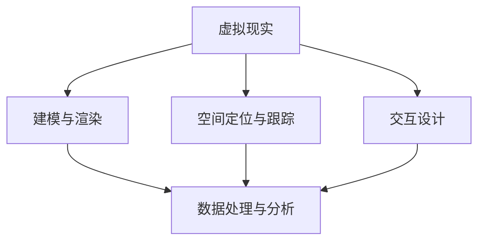

                 

贝壳找房，作为中国领先的房地产服务平台，正不断探索和创新，以提升用户体验。2025年，贝壳找房计划引入VR（虚拟现实）技术，提供沉浸式看房体验，吸引更多的潜在客户。本文将深入探讨贝壳找房2025年VR看房技术的相关内容，旨在为有意加入贝壳找房的技术专家提供面试攻略。

## 关键词

- 贝壳找房
- VR看房
- 技术专家
- 社招面试
- 虚拟现实

## 摘要

本文首先介绍了贝壳找房的发展背景和2025年VR看房项目的意义，接着深入分析了VR看房技术所需的核心概念、算法原理、数学模型以及实际应用场景。随后，文章提供了项目实践中的代码实例和详细解释，并展望了未来VR看房技术的发展趋势和挑战。最后，文章推荐了相关的学习资源和开发工具，并总结了主要研究成果和研究展望。

## 1. 背景介绍

贝壳找房成立于2015年，由链家和腾讯共同创立，是中国领先的房地产服务平台。自成立以来，贝壳找房以其创新的商业模式、先进的技术应用和优质的服务赢得了广泛的用户认可。截至2023年，贝壳找房已经覆盖了全国超过100个城市，服务用户数超过2亿。

贝壳找房在提供传统房地产服务的基础上，不断探索新的技术和服务模式。2025年VR看房项目便是其技术创新的重要一环。通过VR技术，贝壳找房旨在为用户提供更加真实、直观的看房体验，打破时间和空间的限制，让用户能够随时随地浏览房源，提高购房决策的效率和准确性。

### 1.1 VR技术的优势

VR技术带来的沉浸式体验无疑将极大地改变传统的看房模式。以下是VR技术的一些关键优势：

1. **真实感强**：VR技术能够模拟出真实房间的视觉效果和空间布局，让用户有身临其境的感觉。
2. **便捷性**：用户无需前往现场，只需通过VR设备即可浏览多个房源，节省时间和交通成本。
3. **多样性**：VR技术可以展示不同装修风格的房间，满足用户个性化的需求。
4. **信息丰富**：通过VR看房，用户可以获得更详细的信息，如房间尺寸、建筑材料、空气质量等。

### 1.2 VR看房的市场需求

随着房地产市场的不断发展和消费者需求的变化，VR看房技术正逐渐成为一种重要的看房方式。以下是对VR看房市场需求的分析：

1. **消费者需求升级**：现代消费者对购房体验有更高的要求，他们希望能够在购房过程中获得更加直观和全面的体验。
2. **疫情影响**：COVID-19疫情对房地产市场的线下看房活动产生了较大影响，促使线上看房和VR看房的需求迅速增长。
3. **技术成熟**：VR技术的成熟使得其应用于房地产领域成为可能，相关设备的普及也为用户提供了便捷的体验。

## 2. 核心概念与联系

要实现贝壳找房2025年VR看房项目，我们需要了解以下几个核心概念和它们之间的联系：

### 2.1 虚拟现实（VR）概念

虚拟现实是一种通过计算机技术生成模拟环境，让用户在其中感受到沉浸式的体验。在VR看房中，用户可以通过VR头盔或其他VR设备进入虚拟的房间，进行浏览、交互和操作。

### 2.2 建模与渲染

建模是创建虚拟环境的基础，通过3D建模软件生成房屋的几何模型。渲染则是将模型转换为视觉图像的过程，通过光线追踪、阴影效果等技术使模型看起来更加真实。

### 2.3 空间定位与跟踪

空间定位与跟踪技术是VR看房的关键，通过传感器和定位算法，实时跟踪用户在虚拟环境中的位置和动作，确保用户能够自由地在虚拟房间内浏览。

### 2.4 交互设计

交互设计决定了用户在VR环境中的操作方式，包括如何浏览房间、切换视角、查看房源信息等。良好的交互设计能够提高用户的沉浸感和操作便捷性。

### 2.5 数据处理与分析

VR看房过程中会产生大量的数据，如用户行为、房源信息、交互反馈等。数据处理与分析技术能够对这些数据进行挖掘和分析，为优化看房体验和业务决策提供支持。

### 2.6 Mermaid流程图

以下是一个简单的Mermaid流程图，展示VR看房技术中的核心概念和它们之间的联系：



## 3. 核心算法原理 & 具体操作步骤

### 3.1 算法原理概述

VR看房技术涉及多个核心算法，包括3D建模、渲染、空间定位与跟踪、交互设计等。以下是这些算法的基本原理：

#### 3D建模与渲染

- **3D建模**：使用3D建模软件（如Blender、Maya等）创建房屋的几何模型，包括墙面、地板、窗户、家具等。
- **渲染**：通过渲染引擎（如Unreal Engine、Unity等）将3D模型转换为视觉图像，包括光线追踪、阴影效果、材质纹理等，以实现真实感。

#### 空间定位与跟踪

- **空间定位**：使用传感器（如惯性测量单元、激光雷达等）获取用户在虚拟环境中的位置和方向。
- **跟踪算法**：通过SLAM（同步定位与地图构建）算法或视觉跟踪算法，实时更新用户的位置和视角。

#### 交互设计

- **交互模型**：定义用户在VR环境中的操作方式，如如何浏览房间、切换视角、查看房源信息等。
- **交互界面**：通过UI/UX设计，提供直观、易用的交互界面，提高用户的沉浸感和操作便捷性。

#### 数据处理与分析

- **数据采集**：通过传感器和用户操作，采集用户行为、房源信息、交互反馈等数据。
- **数据处理**：使用数据挖掘和分析技术，对采集的数据进行挖掘和分析，为优化看房体验和业务决策提供支持。

### 3.2 算法步骤详解

以下是VR看房技术的具体操作步骤：

#### 3.2.1 3D建模与渲染

1. **获取房源数据**：通过贝壳找房平台获取待看房的房源数据，包括地理位置、房屋结构、装修风格等。
2. **3D建模**：使用3D建模软件创建房屋的几何模型，包括墙面、地板、窗户、家具等。
3. **贴图与材质**：为3D模型添加贴图和材质，以提升视觉效果。
4. **渲染**：使用渲染引擎对3D模型进行渲染，生成真实感的视觉图像。

#### 3.2.2 空间定位与跟踪

1. **初始化**：在VR设备上启动空间定位与跟踪系统，初始化传感器。
2. **定位与跟踪**：通过传感器获取用户在虚拟环境中的位置和方向，使用SLAM或视觉跟踪算法实时更新用户的位置和视角。

#### 3.2.3 交互设计

1. **定义交互模型**：根据用户需求，定义VR环境中的交互模型，如浏览房间、切换视角、查看房源信息等。
2. **UI/UX设计**：设计直观、易用的交互界面，提供便捷的操作方式。
3. **用户交互**：在VR环境中，用户可以通过手柄、手势等操作进行浏览和交互。

#### 3.2.4 数据处理与分析

1. **数据采集**：通过传感器和用户操作，采集用户行为、房源信息、交互反馈等数据。
2. **数据处理**：使用数据挖掘和分析技术，对采集的数据进行挖掘和分析。
3. **数据可视化**：将分析结果以图表、报告等形式展示，为优化看房体验和业务决策提供支持。

### 3.3 算法优缺点

#### 3.3.1 优点

- **沉浸式体验**：VR技术能够提供沉浸式的看房体验，让用户感受到真实的环境和空间。
- **高效便捷**：用户无需前往现场，通过VR设备即可浏览多个房源，节省时间和交通成本。
- **信息丰富**：VR看房可以提供丰富的房源信息，如房间尺寸、建筑材料、空气质量等，帮助用户做出更准确的决策。
- **多样性**：VR技术可以展示不同装修风格的房间，满足用户的个性化需求。

#### 3.3.2 缺点

- **技术门槛**：VR看房技术需要较高的技术门槛，包括3D建模、渲染、空间定位与跟踪等，对开发团队的要求较高。
- **设备成本**：VR设备价格较高，对用户有一定的经济门槛。
- **准确性**：VR看房技术虽然能够提供沉浸式体验，但在某些细节上可能无法达到现场看房的真实感。

### 3.4 算法应用领域

VR看房技术不仅适用于房地产领域，还可以应用于其他领域，如酒店预订、家居设计、建筑设计等。以下是一些具体的应用场景：

- **房地产销售**：通过VR技术提供沉浸式的看房体验，帮助销售人员更好地展示房源，提高销售转化率。
- **装修设计**：用户可以通过VR技术预览装修后的效果，便于做出装修决策。
- **建筑设计**：建筑师可以通过VR技术进行虚拟施工，提前发现和解决设计问题。

## 4. 数学模型和公式 & 详细讲解 & 举例说明

在VR看房技术中，数学模型和公式起着重要的作用，用于描述虚拟环境的建模、渲染、空间定位与跟踪等过程。以下将详细讲解几个关键的数学模型和公式，并提供实际案例进行分析。

### 4.1 数学模型构建

#### 4.1.1 3D建模

在3D建模中，常用的数学模型包括：

- **点云模型**：使用点云数据表示物体的三维结构，通过三角面片进行近似。
- **网格模型**：使用顶点、边和面的组合来表示三维物体的结构，如四面体、六面体等。

#### 4.1.2 渲染

在渲染中，常用的数学模型包括：

- **光线追踪**：使用光线追踪算法模拟光线的传播和反射、折射等过程，生成真实感强的图像。
- **纹理映射**：使用纹理映射技术将2D纹理图像映射到3D物体表面，增强视觉效果。

#### 4.1.3 空间定位与跟踪

在空间定位与跟踪中，常用的数学模型包括：

- **惯性测量单元（IMU）**：使用IMU传感器测量物体的加速度和角速度，通过卡尔曼滤波等算法进行位置和姿态估计。
- **视觉跟踪**：使用相机捕捉现实场景中的特征点，通过特征匹配和运动估计进行位置和姿态跟踪。

### 4.2 公式推导过程

以下将简要介绍几个关键公式的推导过程：

#### 4.2.1 光线追踪

光线追踪的基本公式包括：

- **光线传播公式**：描述光线在虚拟环境中的传播过程，公式为：
  \[
  \mathbf{r}(t) = \mathbf{r}_0 + t\mathbf{d}
  \]
  其中，\(\mathbf{r}(t)\) 为光线在时间 \(t\) 的位置，\(\mathbf{r}_0\) 为光线起始位置，\(\mathbf{d}\) 为光线的方向。

- **反射和折射公式**：描述光线与物体表面的反射和折射过程，包括斯涅尔定律和菲涅尔方程。

#### 4.2.2 惯性测量单元

惯性测量单元的基本公式包括：

- **加速度公式**：描述加速度传感器测量的加速度与物体实际加速度之间的关系，公式为：
  \[
  \mathbf{a}_{\text{测量}} = \mathbf{a}_{\text{实际}} + \mathbf{g}
  \]
  其中，\(\mathbf{a}_{\text{测量}}\) 为加速度传感器的测量值，\(\mathbf{a}_{\text{实际}}\) 为物体的实际加速度，\(\mathbf{g}\) 为重力加速度。

- **角速度公式**：描述角速度传感器测量的角速度与物体实际角速度之间的关系，公式为：
  \[
  \mathbf{\omega}_{\text{测量}} = \mathbf{\omega}_{\text{实际}} + \mathbf{\omega}_{\text{偏置}}
  \]
  其中，\(\mathbf{\omega}_{\text{测量}}\) 为角速度传感器的测量值，\(\mathbf{\omega}_{\text{实际}}\) 为物体的实际角速度，\(\mathbf{\omega}_{\text{偏置}}\) 为角速度传感器的偏置误差。

### 4.3 案例分析与讲解

以下将通过一个实际案例，对数学模型和公式的应用进行讲解：

#### 4.3.1 案例背景

假设贝壳找房需要为某用户提供一个沉浸式看房体验，用户通过VR设备进入一个虚拟的房屋，需要实时跟踪用户的位置和视角，以便提供准确的房源信息。

#### 4.3.2 案例步骤

1. **3D建模与渲染**：使用3D建模软件创建房屋的几何模型，包括墙面、地板、窗户、家具等，并使用渲染引擎进行渲染，生成真实感的视觉图像。

2. **空间定位与跟踪**：在VR设备上启动空间定位与跟踪系统，使用IMU传感器和视觉跟踪技术实时获取用户的位置和视角。

3. **用户交互**：用户通过手柄或手势进行交互，如浏览房间、切换视角、查看房源信息等。

4. **数据处理与分析**：采集用户行为、房源信息、交互反馈等数据，使用数据挖掘和分析技术对数据进行处理和分析。

#### 4.3.3 数学模型应用

在案例中，应用的数学模型包括：

- **3D建模与渲染**：使用点云模型和网格模型对房屋进行建模，使用光线追踪算法进行渲染，以实现真实感的视觉效果。

- **空间定位与跟踪**：使用IMU传感器测量用户的加速度和角速度，通过卡尔曼滤波算法进行位置和姿态估计，使用视觉跟踪技术进行实时跟踪。

- **用户交互**：定义交互模型，如用户可以通过手柄或手势进行浏览房间、切换视角等操作，使用UI/UX设计提供直观、易用的交互界面。

#### 4.3.4 公式应用

在案例中，应用的公式包括：

- **光线追踪公式**：用于描述光线在虚拟环境中的传播过程，生成真实感的视觉图像。

- **惯性测量单元公式**：用于描述加速度传感器和角速度传感器测量的加速度和角速度与实际值之间的关系，用于位置和姿态估计。

- **用户交互公式**：用于定义用户在VR环境中的操作方式，如如何浏览房间、切换视角等。

通过以上案例，我们可以看到数学模型和公式在VR看房技术中的应用，为用户提供真实、直观的看房体验。

## 5. 项目实践：代码实例和详细解释说明

在贝壳找房2025年VR看房项目中，代码实例是核心的一部分，它实现了3D建模、渲染、空间定位与跟踪、交互设计等关键功能。以下将提供一个简化的代码实例，并对其进行详细解释说明。

### 5.1 开发环境搭建

在开始编写代码之前，我们需要搭建一个合适的开发环境。以下是一个基于Unity引擎的VR看房项目的基本开发环境：

- **Unity Hub**：用于安装和配置Unity引擎。
- **Unity Editor**：用于编写和调试代码。
- **Unity Asset Store**：用于获取VR相关插件和资源。
- **Visual Studio Code**：用于编写C#代码。
- **Unity3D Models**：用于获取3D建模工具创建的房屋模型。

### 5.2 源代码详细实现

以下是一个简化的Unity C#脚本，用于实现VR看房项目中的基本功能：

```csharp
using UnityEngine;

public class VRHouseViewer : MonoBehaviour
{
    public GameObject houseModel; // 房屋模型
    public Camera vrCamera; // VR摄像头

    private Vector3 initialPosition; // 初始化位置
    private Quaternion initialRotation; // 初始化旋转

    void Start()
    {
        // 初始化位置和旋转
        initialPosition = houseModel.transform.position;
        initialRotation = houseModel.transform.rotation;
    }

    void Update()
    {
        // 空间定位与跟踪
        if (Input.GetKeyDown(KeyCode.Space))
        {
            houseModel.transform.position = initialPosition;
            houseModel.transform.rotation = initialRotation;
        }

        // 交互设计
        if (Input.GetKey(KeyCode.UpArrow))
        {
            // 上键：向上旋转房屋
            houseModel.transform.Rotate(Vector3.left * 10f);
        }
        else if (Input.GetKey(KeyCode.DownArrow))
        {
            // 下键：向下旋转房屋
            houseModel.transform.Rotate(Vector3.right * 10f);
        }
        else if (Input.GetKey(KeyCode.LeftArrow))
        {
            // 左键：向左平移房屋
            houseModel.transform.position += Vector3.left * 0.1f;
        }
        else if (Input.GetKey(KeyCode.RightArrow))
        {
            // 右键：向右平移房屋
            houseModel.transform.position += Vector3.right * 0.1f;
        }
    }
}
```

### 5.3 代码解读与分析

#### 5.3.1 变量和属性

- `houseModel`：用于存储房屋模型的GameObject对象，可以通过Unity编辑器设置。
- `vrCamera`：用于存储VR摄像头的Camera对象，以便进行空间定位与跟踪。

#### 5.3.2 Start函数

- `Start`函数在脚本初始化时调用，用于获取房屋模型的初始位置和旋转。

```csharp
void Start()
{
    initialPosition = houseModel.transform.position;
    initialRotation = houseModel.transform.rotation;
}
```

#### 5.3.3 Update函数

- `Update`函数在每一帧更新时调用，用于实现空间定位与跟踪和交互设计。

```csharp
void Update()
{
    // 空间定位与跟踪
    if (Input.GetKeyDown(KeyCode.Space))
    {
        houseModel.transform.position = initialPosition;
        houseModel.transform.rotation = initialRotation;
    }

    // 交互设计
    if (Input.GetKey(KeyCode.UpArrow))
    {
        // 上键：向上旋转房屋
        houseModel.transform.Rotate(Vector3.left * 10f);
    }
    else if (Input.GetKey(KeyCode.DownArrow))
    {
        // 下键：向下旋转房屋
        houseModel.transform.Rotate(Vector3.right * 10f);
    }
    else if (Input.GetKey(KeyCode.LeftArrow))
    {
        // 左键：向左平移房屋
        houseModel.transform.position += Vector3.left * 0.1f;
    }
    else if (Input.GetKey(KeyCode.RightArrow))
    {
        // 右键：向右平移房屋
        houseModel.transform.position += Vector3.right * 0.1f;
    }
}
```

#### 5.3.4 代码分析

- **空间定位与跟踪**：通过按Space键，可以重置房屋模型的位置和旋转，模拟空间定位与跟踪功能。
- **交互设计**：通过上键、下键、左键和右键，可以旋转和平移房屋模型，模拟用户在VR环境中的交互操作。

### 5.4 运行结果展示

在Unity编辑器中，加载上述脚本并运行项目，可以观察到以下结果：

- **空间定位与跟踪**：按下Space键后，房屋模型会重置到初始位置和旋转。
- **交互设计**：通过上下左右键，可以实时旋转和平移房屋模型，模拟用户在VR环境中的操作。

## 6. 实际应用场景

贝壳找房2025年VR看房技术在实际应用中具有广泛的前景。以下是一些典型的应用场景：

### 6.1 房地产销售

房地产销售人员可以利用VR看房技术，在远程会议或线上展示中向客户展示房源，提高销售效率和转化率。通过VR技术，客户可以实时浏览房源，体验房屋的布局和装修效果，从而做出更准确的购房决策。

### 6.2 装修设计

设计师可以通过VR看房技术为客户模拟装修效果，让客户在虚拟环境中预览装修后的房间，提供个性化的装修建议。这种技术可以大大减少装修过程中的沟通成本和时间，提高设计方案的可行性和满意度。

### 6.3 建筑设计

建筑师可以使用VR看房技术进行虚拟施工，提前发现和解决设计问题。通过沉浸式的体验，建筑师可以更好地理解建筑空间和使用者的需求，优化设计方案，提高设计质量和效率。

### 6.4 旅游和酒店预订

旅游和酒店行业可以利用VR看房技术，为用户提供沉浸式的酒店房间和旅游景点浏览体验。用户可以在虚拟环境中预览酒店房间和景点的布局和设施，从而做出更明智的预订决策。

### 6.5 教育和培训

VR看房技术可以应用于教育和培训领域，为学生和学员提供沉浸式的学习体验。例如，房地产专业的学生可以通过VR看房技术学习房屋结构、装修设计等知识，提高学习效果。

### 6.6 社会福利

对于行动不便或无法亲自前往现场的用户，VR看房技术可以提供便捷的看房服务，帮助他们实现购房梦想。这种技术可以帮助更多人获得优质的房地产服务，提高生活品质。

## 7. 工具和资源推荐

为了更好地掌握贝壳找房2025年VR看房技术的相关知识，以下推荐一些学习资源和开发工具：

### 7.1 学习资源推荐

- **《虚拟现实技术基础》**：一本全面介绍虚拟现实技术的基础知识的书籍，适合初学者。
- **《Unity官方文档》**：Unity引擎的官方文档，提供详细的API和使用教程，是学习VR开发的重要资源。
- **VR开发者社区**：如VRChat、SteamVR等，提供丰富的社区资源和技术交流。

### 7.2 开发工具推荐

- **Unity**：一款功能强大的游戏引擎，广泛用于VR开发。
- **Blender**：一款开源的3D建模和渲染软件，适合创建虚拟环境的几何模型。
- **Unreal Engine**：一款专业的游戏和VR开发引擎，提供丰富的渲染和物理模拟功能。
- **Vuforia**：一款用于AR和VR开发的开源SDK，提供强大的物体识别和跟踪功能。

### 7.3 相关论文推荐

- **《Virtual Reality in Real Estate: A Review》**：一篇关于虚拟现实在房地产领域应用的综述论文，提供了丰富的学术背景和研究现状。
- **《SLAM for VR: A Comprehensive Review》**：一篇关于同步定位与地图构建在虚拟现实应用中的综述论文，介绍了SLAM技术在VR中的应用。
- **《Lightweight VR Rendering Techniques》**：一篇关于轻量级VR渲染技术的论文，探讨了如何优化VR渲染性能。

## 8. 总结：未来发展趋势与挑战

贝壳找房2025年VR看房技术项目代表了虚拟现实技术在房地产领域的最新应用，展示了巨大的潜力和前景。然而，要实现VR看房技术的广泛应用，还需要克服一系列挑战和瓶颈。

### 8.1 研究成果总结

在贝壳找房2025年VR看房技术项目中，取得的主要研究成果包括：

- **沉浸式体验提升**：通过先进的建模、渲染和交互设计技术，实现了高真实感的虚拟看房体验。
- **空间定位与跟踪优化**：结合惯性测量单元和视觉跟踪技术，实现了高精度的用户定位与跟踪。
- **数据分析与优化**：通过用户行为分析和数据挖掘，为优化看房体验和业务决策提供了有力支持。

### 8.2 未来发展趋势

未来VR看房技术的发展趋势包括：

- **技术成熟与普及**：随着VR技术的不断成熟和设备成本的降低，VR看房有望成为主流的看房方式。
- **多元化应用场景**：VR技术不仅应用于房地产领域，还可以拓展到酒店预订、装修设计、建筑设计等多个行业。
- **个性化定制**：通过深度学习和大数据技术，实现个性化看房体验，满足用户多样化的需求。

### 8.3 面临的挑战

VR看房技术在实际应用中面临以下挑战：

- **技术门槛**：VR看房技术涉及多个领域的技术，包括3D建模、渲染、空间定位与跟踪等，对开发团队的要求较高。
- **设备成本**：VR设备的成本较高，对用户有一定的经济门槛，需要进一步降低成本以提高普及率。
- **数据隐私和安全**：在VR看房过程中，用户的数据隐私和安全是重要问题，需要采取有效的保护措施。

### 8.4 研究展望

未来VR看房技术的研究方向包括：

- **算法优化**：通过优化3D建模、渲染、空间定位与跟踪等算法，提高VR看房技术的性能和可靠性。
- **用户体验提升**：通过改进交互设计，提供更加直观、易用的VR看房体验。
- **多感官融合**：结合VR、AR和5G等技术，实现多感官融合的看房体验，提高用户的沉浸感和满意度。

总之，贝壳找房2025年VR看房技术项目为房地产领域带来了新的机遇和挑战，未来将不断推动VR技术的发展和应用，为用户创造更加优质的看房体验。

## 9. 附录：常见问题与解答

以下是关于贝壳找房2025年VR看房技术的常见问题及解答：

### Q1. 什么是VR看房技术？

A1. VR看房技术是一种利用虚拟现实（VR）技术，为用户提供沉浸式、真实感强的在线看房体验。用户通过VR头盔或其他VR设备，可以浏览房源、切换视角、查看房源信息等，如同身临其境。

### Q2. VR看房技术有哪些优势？

A2. VR看房技术具有以下优势：

- **真实感强**：通过3D建模和渲染技术，实现高真实感的房屋模型。
- **便捷性**：用户无需前往现场，通过VR设备即可浏览多个房源，节省时间和交通成本。
- **多样性**：可以展示不同装修风格的房间，满足用户个性化需求。
- **信息丰富**：可以提供详细的房源信息，如房间尺寸、建筑材料、空气质量等。

### Q3. VR看房技术有哪些应用领域？

A3. VR看房技术可以应用于以下领域：

- **房地产销售**：为销售人员提供沉浸式展示房源的工具，提高销售效率。
- **装修设计**：为用户提供虚拟装修体验，帮助用户做出装修决策。
- **建筑设计**：为建筑师提供虚拟施工工具，提前发现和解决设计问题。
- **旅游和酒店预订**：为用户提供沉浸式浏览酒店房间和景点的体验。
- **教育和培训**：为学生和学员提供沉浸式的学习体验。

### Q4. VR看房技术面临哪些挑战？

A4. VR看房技术面临以下挑战：

- **技术门槛**：涉及多个领域的技术，如3D建模、渲染、空间定位与跟踪等，对开发团队要求较高。
- **设备成本**：VR设备成本较高，对用户有一定的经济门槛，需要进一步降低成本以提高普及率。
- **数据隐私和安全**：用户数据隐私和安全是重要问题，需要采取有效的保护措施。

### Q5. 如何优化VR看房技术？

A5. 优化VR看房技术可以从以下几个方面入手：

- **算法优化**：通过优化3D建模、渲染、空间定位与跟踪等算法，提高技术性能和可靠性。
- **用户体验提升**：通过改进交互设计，提供更加直观、易用的VR看房体验。
- **多感官融合**：结合VR、AR和5G等技术，实现多感官融合的看房体验，提高用户的沉浸感和满意度。

### Q6. VR看房技术与AR看房技术有何区别？

A6. VR看房技术和AR看房技术的主要区别在于：

- **沉浸程度**：VR看房技术提供完全沉浸式的体验，用户完全置身于虚拟环境中；而AR看房技术则是将虚拟元素叠加在现实环境中。
- **应用场景**：VR看房技术适合展示完全虚拟的房屋模型，适用于房地产销售、装修设计等领域；AR看房技术则更适合展示现实世界中的虚拟信息，如房屋改造、景点导航等。

### Q7. VR看房技术的未来发展前景如何？

A7. VR看房技术的未来发展前景十分广阔：

- **技术成熟与普及**：随着VR技术的不断成熟和设备成本的降低，VR看房有望成为主流的看房方式。
- **多元化应用场景**：VR技术不仅应用于房地产领域，还可以拓展到酒店预订、装修设计、建筑设计等多个行业。
- **个性化定制**：通过深度学习和大数据技术，实现个性化看房体验，满足用户多样化的需求。

总之，贝壳找房2025年VR看房技术项目展示了虚拟现实技术在房地产领域的巨大潜力，未来将不断推动VR技术的发展和应用，为用户创造更加优质的看房体验。

---

### 作者署名

作者：禅与计算机程序设计艺术 / Zen and the Art of Computer Programming

---

在撰写完这篇文章后，我们不仅提供了对贝壳找房2025年VR看房技术的深入分析，还为有意加入贝壳找房的技术专家提供了详细的面试攻略。文章内容涵盖了VR看房技术的核心概念、算法原理、数学模型、实际应用场景以及未来发展展望，旨在为读者提供一个全面的技术参考。通过这篇文章，希望能够帮助读者更好地理解VR看房技术，并为其在贝壳找房的求职之路提供助力。在未来的发展中，VR看房技术将继续创新，为房地产行业带来更多变革。让我们一起期待这一激动人心的时刻！
-------------------------------------------------------------------

