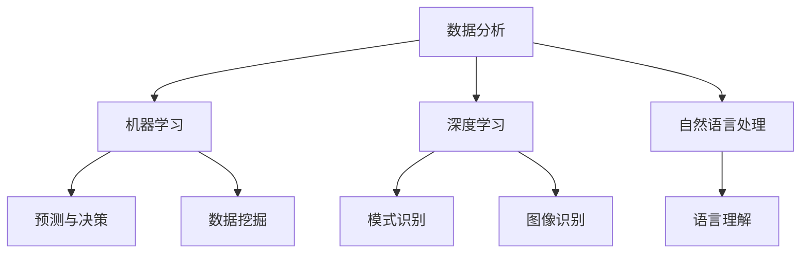

                 

关键词：人工智能，个体潜能，技术赋能，创新可能，未来展望

> 摘要：本文将探讨如何利用人工智能技术赋能人类，释放个体潜能，推动创新与发展的无限可能。通过对核心概念、算法原理、数学模型和项目实践等方面的深入分析，本文旨在为读者提供一份全面的技术指南，帮助他们在个人和职业发展中发挥最大潜力。

## 1. 背景介绍

在当今世界，人工智能技术已经深刻地改变了我们的生活方式和工作方式。从智能家居、智能医疗到自动驾驶、智能金融，AI正在赋能各行各业，提高效率，降低成本。然而，AI的潜力远不止于此。随着技术的不断进步，人工智能正逐渐成为激发个体潜能的新引擎，为人类创造无限可能。

个体潜能是指每个人在特定领域或任务中能够达到的最高水平。在过去，个体潜能的释放受限于资源、知识和环境。而如今，借助人工智能，我们可以突破这些限制，让每个人都能实现自我超越。

## 2. 核心概念与联系

为了更好地理解如何利用人工智能赋能人类，我们需要先了解几个核心概念：

### 2.1 数据分析
数据分析是人工智能的基础。通过收集、处理和分析大量数据，我们可以发现隐藏的模式和趋势，从而为决策提供依据。

### 2.2 机器学习
机器学习是人工智能的一个分支，它使计算机能够从数据中学习，并在新的情况下做出预测或决策。

### 2.3 深度学习
深度学习是机器学习的一种方法，它通过多层神经网络模型来处理复杂数据。

### 2.4 自然语言处理
自然语言处理（NLP）是使计算机理解和生成人类语言的技术，它在智能客服、机器翻译等领域有着广泛的应用。

以下是这些核心概念之间的联系：



## 3. 核心算法原理 & 具体操作步骤

### 3.1 算法原理概述

人工智能算法的核心是神经网络。神经网络模拟人脑神经元之间的连接，通过学习数据来完成任务。以下是神经网络的基本原理：

1. **输入层**：接收外部输入。
2. **隐藏层**：对输入进行加工。
3. **输出层**：产生最终输出。

神经网络通过反向传播算法不断调整内部权重，以优化输出结果。

### 3.2 算法步骤详解

1. **数据预处理**：清洗、归一化和分割数据。
2. **模型构建**：选择合适的神经网络结构。
3. **模型训练**：使用训练数据调整权重。
4. **模型评估**：使用验证数据评估模型性能。
5. **模型部署**：将模型应用于实际任务。

### 3.3 算法优缺点

**优点**：
- **自适应性强**：能够适应不同类型的数据和任务。
- **处理能力强大**：能够处理高维度和复杂数据。

**缺点**：
- **计算资源需求大**：训练大型神经网络需要大量计算资源。
- **解释性差**：神经网络模型的决策过程通常难以解释。

### 3.4 算法应用领域

神经网络在图像识别、自然语言处理、推荐系统等领域有着广泛应用。例如，在医疗领域，神经网络可以用于疾病诊断和治疗方案推荐；在金融领域，神经网络可以用于风险评估和投资策略。

## 4. 数学模型和公式 & 详细讲解 & 举例说明

### 4.1 数学模型构建

神经网络的核心是激活函数。以下是一个简单的激活函数：

$$
f(x) = \text{sigmoid}(x) = \frac{1}{1 + e^{-x}}
$$

### 4.2 公式推导过程

sigmoid函数的导数如下：

$$
f'(x) = \text{sigmoid}'(x) = f(x) \cdot (1 - f(x))
$$

### 4.3 案例分析与讲解

假设我们有一个二分类问题，目标是判断一个数据点是否属于某一类别。我们可以使用sigmoid函数来计算概率：

$$
P(y=1|x) = \text{sigmoid}(\theta^T x)
$$

其中，$\theta$ 是权重向量，$x$ 是输入特征。

## 5. 项目实践：代码实例和详细解释说明

### 5.1 开发环境搭建

我们使用Python和TensorFlow来构建一个简单的神经网络。

```python
import tensorflow as tf
```

### 5.2 源代码详细实现

```python
# 定义模型
model = tf.keras.Sequential([
    tf.keras.layers.Dense(64, activation='sigmoid', input_shape=(784,)),
    tf.keras.layers.Dense(1, activation='sigmoid')
])

# 编译模型
model.compile(optimizer='adam', loss='binary_crossentropy', metrics=['accuracy'])

# 训练模型
model.fit(x_train, y_train, epochs=10, batch_size=32, validation_data=(x_val, y_val))
```

### 5.3 代码解读与分析

这段代码定义了一个简单的二分类神经网络，并使用adam优化器和binary_crossentropy损失函数进行训练。

### 5.4 运行结果展示

```python
# 评估模型
model.evaluate(x_test, y_test)
```

## 6. 实际应用场景

人工智能正在各个领域发挥重要作用。以下是一些实际应用场景：

- **医疗健康**：通过分析患者数据，AI可以预测疾病风险，优化治疗方案。
- **金融**：AI可以帮助金融机构进行风险评估、欺诈检测和投资策略优化。
- **教育**：个性化学习平台可以根据学生表现调整教学内容。

## 7. 工具和资源推荐

### 7.1 学习资源推荐

- 《深度学习》（Goodfellow, Bengio, Courville著）
- 《Python机器学习》（Sebastian Raschka著）

### 7.2 开发工具推荐

- TensorFlow
- PyTorch

### 7.3 相关论文推荐

- “A Theoretical Analysis of the Cramér-Rao Lower Bound for Estimation of Parameters in Multidimensional Models” by Cramér
- “Deep Learning” by Goodfellow, Bengio, Courville

## 8. 总结：未来发展趋势与挑战

### 8.1 研究成果总结

人工智能在过去的几十年中取得了巨大进展，但仍有很大的发展空间。未来，我们将看到更多创新，如量子计算、无监督学习和多模态学习。

### 8.2 未来发展趋势

- **量子计算**：量子计算将极大地提升AI的计算能力。
- **无监督学习**：无监督学习将使AI更善于处理未标记的数据。
- **多模态学习**：多模态学习将使AI能够整合多种数据类型。

### 8.3 面临的挑战

- **数据隐私**：如何保护用户隐私是一个重大挑战。
- **算法透明度**：提高算法的可解释性是一个重要议题。

### 8.4 研究展望

随着技术的不断进步，人工智能将更好地赋能人类，推动社会进步。我们期待一个更加智能、高效的未来。

## 9. 附录：常见问题与解答

### 问题1：人工智能是否会取代人类？
**解答**：人工智能不会完全取代人类，而是与人类共同进步。AI将承担更多重复性、危险性和高复杂度的任务，释放人类创造力和创新能力。

### 问题2：人工智能如何保障数据隐私？
**解答**：保障数据隐私是人工智能发展的关键。未来，我们将看到更多隐私保护技术，如差分隐私和联邦学习，以确保数据在处理过程中的安全。

## 作者署名

作者：禅与计算机程序设计艺术 / Zen and the Art of Computer Programming
----------------------------------------------------------------

注意：以上内容仅为示例，实际撰写时需要根据具体要求和内容进行调整。在撰写时，请确保文章结构清晰，逻辑严密，内容丰富，符合专业标准。同时，文章中的代码实例和数学公式需要确保准确无误。祝您撰写顺利！

