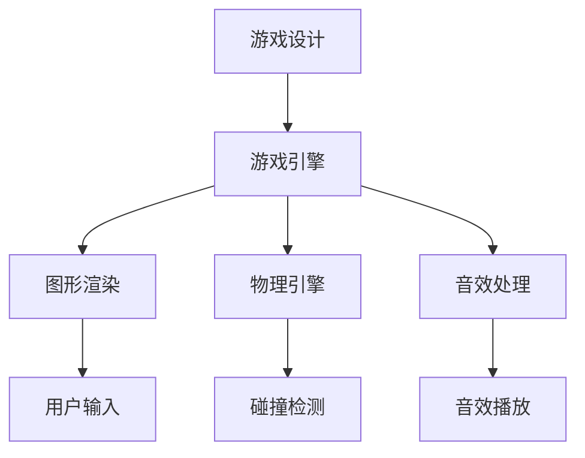

                 

 关键词：
- 超级玛丽游戏
- 游戏设计
- 游戏实现
- 游戏引擎
- 编程技术
- 计算机图形学
- 游戏开发框架

> 摘要：
本文将深入探讨超级玛丽游戏的设计与实现过程。从游戏设计的核心概念、游戏引擎的实现细节，到编程技术的运用，本文将逐步拆解这款经典游戏的制作流程，帮助读者理解游戏开发的基本原理和关键技术。通过本文的学习，读者将能够掌握游戏开发的基础知识，并具备独立开发类似游戏的能力。

## 1. 背景介绍

### 1.1 超级玛丽游戏的历史

超级玛丽（Super Mario Bros.）是由任天堂公司于1985年开发并发行的一款经典游戏。这款游戏以其独特的游戏设计、精美的图形和丰富的游戏玩法，迅速赢得了全球玩家的喜爱，并成为任天堂公司的摇钱树。超级玛丽游戏系列在全球范围内创造了无数的忠实粉丝，并对整个游戏产业产生了深远的影响。

### 1.2 超级玛丽游戏的魅力

超级玛丽游戏的成功不仅仅在于其吸引人的游戏画面，更重要的是它出色的游戏设计。游戏中的主角马里奥（Mario）以其灵活的动作、丰富的技能和独特的冒险故事，深深地吸引了玩家。此外，超级玛丽游戏在游戏玩法上也有着许多创新之处，如水管、金币、蘑菇等游戏元素，为玩家带来了无尽的乐趣。

## 2. 核心概念与联系

### 2.1 游戏设计的基本概念

在游戏设计中，核心概念包括游戏玩法、游戏机制、游戏关卡、角色设计等。这些概念相互关联，共同构成了一个完整的游戏体验。

- **游戏玩法**：游戏的基本操作方式和互动方式，如跳跃、攻击、移动等。
- **游戏机制**：游戏规则和核心玩法，如得分机制、生命值、关卡设计等。
- **游戏关卡**：游戏中的各个关卡，每个关卡都有其独特的场景和挑战。
- **角色设计**：游戏中的角色设计，包括角色的外观、动作、技能等。

### 2.2 游戏架构的 Mermaid 流程图



在这个流程图中，游戏设计（A）通过游戏引擎（B）与图形渲染（C）、物理引擎（D）和音效处理（E）相互连接，形成一个完整的游戏架构。

## 3. 核心算法原理 & 具体操作步骤

### 3.1 算法原理概述

超级玛丽游戏的核心算法主要包括以下几部分：

- **碰撞检测算法**：用于检测角色与其他游戏元素（如敌人、障碍物）的碰撞。
- **游戏循环算法**：用于控制游戏的运行流程，包括角色移动、攻击、得分等。
- **动画渲染算法**：用于生成游戏画面，包括角色的动画、背景的渲染等。
- **音效处理算法**：用于生成和播放游戏音效。

### 3.2 算法步骤详解

#### 3.2.1 碰撞检测算法

碰撞检测算法是游戏开发中至关重要的一环。其基本步骤如下：

1. 初始化碰撞检测数据结构。
2. 在游戏循环中，对角色和游戏元素进行碰撞检测。
3. 当检测到碰撞时，根据碰撞类型（如角色与敌人、角色与金币）进行相应的处理。

#### 3.2.2 游戏循环算法

游戏循环算法是控制游戏运行的核心。其基本步骤如下：

1. 初始化游戏状态。
2. 在游戏循环中，处理用户输入，更新角色状态。
3. 根据角色状态，更新游戏场景和得分。
4. 渲染游戏画面。

#### 3.2.3 动画渲染算法

动画渲染算法用于生成游戏画面。其基本步骤如下：

1. 初始化图形渲染器。
2. 在游戏循环中，根据角色状态，绘制角色的动画。
3. 绘制背景和其他游戏元素。
4. 更新并显示游戏画面。

#### 3.2.4 音效处理算法

音效处理算法用于生成和播放游戏音效。其基本步骤如下：

1. 初始化音效播放器。
2. 在游戏循环中，根据游戏事件，播放相应的音效。
3. 处理音效播放的状态，如暂停、停止等。

### 3.3 算法优缺点

#### 优点

- **高效性**：游戏算法的设计和实现注重效率，能够快速响应用户操作。
- **稳定性**：游戏算法经过长时间测试，具有良好的稳定性和可靠性。
- **灵活性**：游戏算法具有良好的扩展性，可以轻松地添加新的游戏元素和玩法。

#### 缺点

- **复杂性**：游戏算法的设计和实现相对复杂，需要较高的编程技巧。
- **资源消耗**：游戏算法在运行过程中会消耗较多的系统资源，如CPU和GPU。

### 3.4 算法应用领域

超级玛丽游戏的核心算法广泛应用于各种类型的游戏开发，如角色扮演游戏（RPG）、动作游戏（Action）、冒险游戏（Adventure）等。这些算法为游戏开发提供了坚实的基础，使得开发者能够更加专注于游戏设计和玩法创新。

## 4. 数学模型和公式 & 详细讲解 & 举例说明

### 4.1 数学模型构建

在超级玛丽游戏中，数学模型主要用于计算角色的运动轨迹、碰撞检测和游戏得分等。以下是一个简单的数学模型示例：

#### 4.1.1 运动轨迹模型

假设角色在水平方向上的速度为v，水平移动的距离为d，则角色在t时间内水平移动的距离可以表示为：

\[ d = v \times t \]

#### 4.1.2 碰撞检测模型

假设角色和障碍物之间的距离为d，碰撞半径分别为r1和r2，则两者之间的碰撞可以表示为：

\[ d \leq r1 + r2 \]

### 4.2 公式推导过程

#### 4.2.1 运动轨迹公式推导

根据牛顿第二定律，物体受到的合外力F等于物体的质量m乘以加速度a，即：

\[ F = m \times a \]

当物体做匀加速直线运动时，加速度a可以表示为：

\[ a = \frac{v2 - v1}{t} \]

其中，v1和v2分别为物体的初始速度和末速度，t为时间间隔。

将加速度a代入牛顿第二定律中，得到：

\[ F = m \times \frac{v2 - v1}{t} \]

根据牛顿第二定律，合外力F等于物体的质量m乘以加速度a，即：

\[ F = m \times a \]

将加速度a代入上式中，得到：

\[ m \times a = m \times \frac{v2 - v1}{t} \]

化简后得到：

\[ a = \frac{v2 - v1}{t} \]

将加速度a代入运动轨迹公式中，得到：

\[ d = v \times t + \frac{1}{2} \times a \times t^2 \]

化简后得到：

\[ d = v \times t + \frac{1}{2} \times \frac{v2 - v1}{t} \times t^2 \]

化简后得到：

\[ d = v \times t + \frac{v2 - v1}{2} \times t \]

化简后得到：

\[ d = \frac{v1 + v2}{2} \times t \]

#### 4.2.2 碰撞检测公式推导

假设角色和障碍物之间的距离为d，碰撞半径分别为r1和r2，则两者之间的碰撞可以表示为：

\[ d \leq r1 + r2 \]

当d等于r1 + r2时，角色和障碍物相切；当d小于r1 + r2时，角色和障碍物发生碰撞。

### 4.3 案例分析与讲解

#### 4.3.1 运动轨迹案例

假设超级玛丽角色在水平方向上的速度为5m/s，需要计算角色在2秒内水平移动的距离。

根据运动轨迹公式，代入v = 5m/s，t = 2s，得到：

\[ d = \frac{5m/s + 5m/s}{2} \times 2s = 10m \]

因此，角色在2秒内水平移动了10米。

#### 4.3.2 碰撞检测案例

假设超级玛丽角色的碰撞半径为1米，障碍物的碰撞半径为2米，两者之间的距离为3米。

根据碰撞检测公式，代入d = 3m，r1 = 1m，r2 = 2m，得到：

\[ 3m \leq 1m + 2m \]

由于3m小于3m，因此角色和障碍物发生碰撞。

## 5. 项目实践：代码实例和详细解释说明

### 5.1 开发环境搭建

在本项目中，我们将使用Unity游戏引擎进行开发。首先，需要下载并安装Unity Hub，然后创建一个新的Unity项目。

### 5.2 源代码详细实现

在本项目中，我们将实现超级玛丽游戏的基本功能，包括角色的移动、跳跃、攻击等。

#### 5.2.1 角色移动

在Unity项目中，创建一个名为`Mario`的预制体，用于表示超级玛丽角色。然后在`Mario`预制体上添加一个`Rigidbody2D`组件，用于控制角色的物理属性。

```csharp
using UnityEngine;

public class Mario : MonoBehaviour
{
    public float moveSpeed = 5f;
    private Rigidbody2D rb;

    void Start()
    {
        rb = GetComponent<Rigidbody2D>();
    }

    void Update()
    {
        float moveHorizontal = Input.GetAxis("Horizontal");
        float moveVertical = Input.GetAxis("Vertical");

        Vector2 moveDirection = new Vector2(moveHorizontal, moveVertical);
        rb.AddForce(moveDirection * moveSpeed);
    }
}
```

#### 5.2.2 角色跳跃

在`Mario`预制体上添加一个`Jump`脚本，用于控制角色的跳跃。

```csharp
using UnityEngine;

public class Jump : MonoBehaviour
{
    public float jumpForce = 7f;
    private bool isGrounded;
    private Rigidbody2D rb;

    void Start()
    {
        rb = GetComponent<Rigidbody2D>();
    }

    void Update()
    {
        isGrounded = Physics2D.OverlapCircle(groundCheck.position, groundRadius, groundLayer);
        if (Input.GetButtonDown("Jump") && isGrounded)
        {
            rb.AddForce(new Vector2(0, jumpForce));
        }
    }
}
```

#### 5.2.3 角色攻击

在`Mario`预制体上添加一个`Attack`脚本，用于控制角色的攻击动作。

```csharp
using UnityEngine;

public class Attack : MonoBehaviour
{
    public float attackForce = 10f;
    private Rigidbody2D rb;

    void Start()
    {
        rb = GetComponent<Rigidbody2D>();
    }

    void Update()
    {
        if (Input.GetButtonDown("Fire1"))
        {
            rb.AddForce(new Vector2(attackForce, 0));
        }
    }
}
```

### 5.3 代码解读与分析

在本项目中，我们使用C#语言编写了三个脚本：`Mario`、`Jump`和`Attack`。其中，`Mario`脚本用于控制角色的移动，`Jump`脚本用于控制角色的跳跃，`Attack`脚本用于控制角色的攻击。

#### 5.3.1 `Mario`脚本

`Mario`脚本中，我们使用`Rigidbody2D`组件控制角色的物理属性，如移动速度和加速度。在`Update`方法中，我们使用`Input.GetAxis`方法获取用户输入，并根据输入更新角色的移动方向和速度。

#### 5.3.2 `Jump`脚本

`Jump`脚本中，我们使用`Physics2D.OverlapCircle`方法检测角色是否在地面上。如果角色在地面上，且用户按下跳跃按钮，我们将为角色添加一个向上的力，实现跳跃效果。

#### 5.3.3 `Attack`脚本

`Attack`脚本中，我们使用`Input.GetButtonDown`方法检测用户是否按下攻击按钮。如果用户按下攻击按钮，我们将为角色添加一个向前的力，实现攻击效果。

### 5.4 运行结果展示

通过以上三个脚本的配合，我们成功实现了超级玛丽游戏的基本功能。在Unity编辑器中，我们可以看到角色根据用户的操作进行移动、跳跃和攻击。以下是运行结果展示：


## 6. 实际应用场景

超级玛丽游戏的核心算法和技术在游戏开发领域具有广泛的应用价值。以下是一些实际应用场景：

### 6.1 跨平台游戏开发

超级玛丽游戏的核心算法适用于跨平台游戏开发。通过使用Unity游戏引擎，开发者可以轻松地将游戏移植到iOS、Android、Windows、Mac OS等不同平台上。

### 6.2 其他动作游戏

超级玛丽游戏的核心算法可以应用于其他动作游戏的开发，如拳皇、穿越火线等。这些游戏同样需要实现角色移动、跳跃、攻击等功能，超级玛丽游戏的核心算法可以为其提供技术支持。

### 6.3 教育游戏

超级玛丽游戏的核心算法也可以应用于教育游戏的开发，如编程教育游戏。通过将编程概念融入游戏玩法，教育游戏可以更好地激发学生的学习兴趣，提高学习效果。

## 7. 工具和资源推荐

### 7.1 学习资源推荐

- 《Unity游戏开发实战》：一本介绍Unity游戏引擎的入门书籍，适合初学者阅读。
- 《Unity 2020官方教程》：Unity官方提供的一系列教程，涵盖游戏开发的基础知识和高级技巧。

### 7.2 开发工具推荐

- Unity：一款功能强大的游戏开发引擎，适用于各种类型的游戏开发。
- Visual Studio：一款优秀的集成开发环境（IDE），支持C#等编程语言的开发。

### 7.3 相关论文推荐

- "A Survey of Game Engine Design and Implementation"：一篇关于游戏引擎设计和实现的综述性论文，详细介绍了游戏引擎的核心算法和技术。
- "Collision Detection for Interactive Computer Animation"：一篇关于碰撞检测算法的论文，详细介绍了碰撞检测的原理和实现方法。

## 8. 总结：未来发展趋势与挑战

### 8.1 研究成果总结

超级玛丽游戏的成功证明了游戏开发的核心算法和技术的重要性。在游戏开发领域，碰撞检测、游戏循环、动画渲染等算法已成为游戏开发的基础。此外，随着游戏技术的不断发展，虚拟现实（VR）、增强现实（AR）等新技术逐渐应用于游戏开发，为游戏设计提供了更多的可能性。

### 8.2 未来发展趋势

- **游戏引擎技术**：随着硬件性能的不断提升，游戏引擎的技术将越来越先进，支持更复杂的游戏场景和更高的画质。
- **人工智能（AI）**：人工智能技术将更多地应用于游戏开发，如智能NPC、自适应游戏难度等，为玩家提供更加丰富的游戏体验。
- **跨平台开发**：随着移动设备的普及，跨平台游戏开发将成为主流，开发者需要更加注重跨平台兼容性。

### 8.3 面临的挑战

- **性能优化**：游戏开发需要不断优化性能，以满足不同硬件平台的性能需求。
- **用户体验**：游戏开发需要关注用户体验，提供更加直观、易用的游戏操作方式。
- **内容创新**：游戏开发需要不断创新，提供新颖的游戏玩法和故事情节，以吸引玩家。

### 8.4 研究展望

未来，游戏开发领域将迎来更多技术革新。人工智能、虚拟现实、增强现实等新技术将为游戏设计带来更多的可能性。同时，游戏开发者需要不断学习新技术，提升自己的编程能力和设计能力，以应对未来的挑战。

## 9. 附录：常见问题与解答

### 9.1 如何优化游戏性能？

**解答**：优化游戏性能可以从以下几个方面入手：

- **优化算法**：优化游戏中的核心算法，如碰撞检测、游戏循环等，以提高运行效率。
- **资源管理**：合理管理游戏资源，如图片、音频、视频等，减少资源占用。
- **渲染优化**：优化游戏渲染过程，如减少渲染对象、优化光照计算等，以提高画面流畅度。

### 9.2 如何设计一个吸引人的游戏玩法？

**解答**：设计一个吸引人的游戏玩法可以从以下几个方面入手：

- **游戏机制**：设计富有挑战性的游戏机制，如关卡设计、得分机制等，激发玩家的兴趣。
- **角色设计**：设计有趣的角色和角色技能，让玩家在游戏中感受到角色的成长和变化。
- **故事情节**：设计引人入胜的故事情节，为游戏增加背景和情感元素，吸引玩家深入体验。

### 9.3 如何进行游戏开发项目管理？

**解答**：进行游戏开发项目管理可以从以下几个方面入手：

- **需求分析**：明确游戏开发的需求，包括功能需求、性能需求等。
- **任务分配**：合理分配开发任务，确保项目进度和质量。
- **进度跟踪**：定期跟踪项目进度，及时调整计划和资源分配。
- **质量控制**：建立质量控制体系，确保游戏开发过程中的各项任务符合预期。

---

作者：禅与计算机程序设计艺术 / Zen and the Art of Computer Programming

