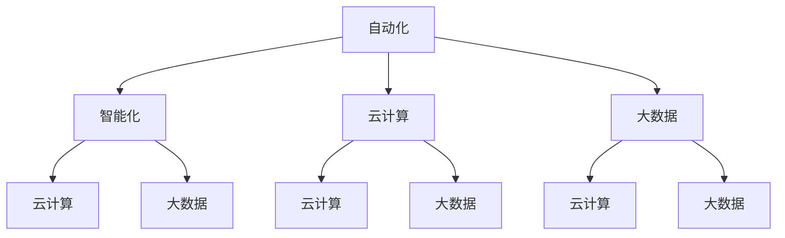

                 

## 1. 背景介绍

在信息技术飞速发展的当今社会，软件已经成为推动社会进步的重要力量。从早期的简单工具到如今复杂的应用程序，软件的作用和地位不断提升。然而，随着软件系统的日益复杂，软件质量问题也愈发凸显。传统的软件 1.0 时代，主要关注的是功能性和可靠性，而忽略了软件的效率和价值。软件 2.0 时代，我们不仅要解决传统软件的问题，更要注重提升软件的效率和创造价值。

软件 2.0 是一个概念，它代表了软件发展的一种新阶段。这个阶段的核心目标是提升软件的效率和价值，使其更好地服务于用户和社会。软件 2.0 的出现，源于对传统软件 1.0 的反思和改进。在软件 1.0 时代，软件的开发和运维主要依赖于人工操作和经验，导致软件的效率较低，且容易出现质量问题。而软件 2.0 则通过自动化、智能化等技术手段，大幅提升软件的开发、测试、部署和运维效率，从而降低成本，提高质量。

本文将深入探讨软件 2.0 的价值，分析其在提升效率、创造价值方面的具体表现，并探讨未来软件 2.0 的发展趋势和面临的挑战。

## 2. 核心概念与联系

要理解软件 2.0 的价值，我们首先需要了解其核心概念和联系。软件 2.0 的核心概念包括自动化、智能化、云计算、大数据等。这些概念相互关联，共同构成了软件 2.0 的技术架构。

### 2.1 自动化

自动化是软件 2.0 的重要特征之一。通过自动化，我们可以将重复性、规律性强的任务交给计算机自动执行，从而提高工作效率。自动化技术的应用，使得软件的开发、测试、部署和运维等环节更加高效。例如，在软件开发过程中，自动化工具可以自动生成代码、进行单元测试、集成测试等，从而降低开发成本，提高开发效率。

### 2.2 智能化

智能化是软件 2.0 的另一个核心概念。通过人工智能技术，软件可以模拟人类的思维和行为，实现更高效、更智能的服务。智能化技术的应用，使得软件能够根据用户需求自动调整功能和行为，提供个性化服务。例如，智能客服机器人可以自动回答用户的问题，提供在线支持；智能推荐系统可以根据用户的历史行为和喜好，推荐符合用户兴趣的内容。

### 2.3 云计算

云计算是软件 2.0 技术架构的重要基础。通过云计算，软件可以实现资源的弹性分配和按需服务，从而提高资源的利用率和系统的可扩展性。云计算技术的应用，使得软件可以更加灵活、高效地应对业务需求的变化。例如，企业可以通过云计算平台，快速部署新的业务系统，满足业务增长的需求。

### 2.4 大数据

大数据是软件 2.0 的重要数据来源。通过大数据技术，软件可以收集、存储、处理和分析海量数据，从而挖掘出有价值的信息和知识。大数据技术的应用，使得软件可以更加精准地了解用户需求，提供定制化服务。例如，电商平台可以通过大数据分析，了解用户购买行为，为用户推荐可能感兴趣的商品。

### 2.5 Mermaid 流程图

为了更直观地展示软件 2.0 的核心概念和联系，我们可以使用 Mermaid 流程图进行说明。以下是一个简单的 Mermaid 流程图示例：



该流程图展示了自动化、智能化、云计算和大数据四个核心概念之间的相互联系。通过这些联系，软件 2.0 实现了高效、智能、灵活和精准的服务。

## 3. 核心算法原理 & 具体操作步骤

### 3.1 算法原理概述

软件 2.0 的核心算法主要包括自动化算法、智能化算法、云计算算法和大数据算法。这些算法旨在提高软件的效率、智能化水平和数据处理能力。以下分别对这些算法进行概述。

#### 3.1.1 自动化算法

自动化算法的核心思想是通过预设规则，实现任务的自动化执行。自动化算法通常包括任务调度、流程控制和错误处理等子算法。任务调度算法负责根据任务的优先级和资源情况，安排任务的执行顺序；流程控制算法负责在任务执行过程中，根据预设规则进行任务间的切换和协调；错误处理算法负责在任务执行过程中，检测和修复异常情况。

#### 3.1.2 智能化算法

智能化算法的核心思想是通过模拟人类思维和行为，实现软件的智能化。智能化算法包括机器学习、深度学习和自然语言处理等技术。机器学习算法通过训练模型，使软件能够从数据中自动提取规律和知识；深度学习算法通过多层神经网络，实现更加复杂和精准的模型训练；自然语言处理算法使软件能够理解、生成和处理自然语言。

#### 3.1.3 云计算算法

云计算算法的核心思想是通过分布式计算和存储，提高软件的计算能力和存储容量。云计算算法包括分布式计算算法、分布式存储算法和分布式调度算法。分布式计算算法负责将任务分解为子任务，并在多个计算节点上并行执行；分布式存储算法负责将数据分散存储在多个存储节点上，提高数据的可靠性和访问速度；分布式调度算法负责根据任务和资源情况，分配计算资源和存储资源。

#### 3.1.4 大数据算法

大数据算法的核心思想是通过数据挖掘和分析，从海量数据中提取有价值的信息和知识。大数据算法包括数据预处理算法、数据挖掘算法和数据分析算法。数据预处理算法负责对原始数据进行清洗、转换和整合；数据挖掘算法通过模式识别和关联分析，提取数据中的规律和知识；数据分析算法通过对数据进行分析和可视化，揭示数据背后的信息和趋势。

### 3.2 算法步骤详解

#### 3.2.1 自动化算法步骤

1. 任务调度：根据任务的优先级和资源情况，生成任务调度计划。
2. 流程控制：按照调度计划，执行任务间的切换和协调。
3. 错误处理：在任务执行过程中，检测异常情况，并采取相应的修复措施。

#### 3.2.2 智能化算法步骤

1. 数据收集：从各种数据源收集相关数据。
2. 模型训练：使用机器学习或深度学习算法，训练模型。
3. 模型评估：评估模型的性能和效果，并进行调整。
4. 应用模型：将训练好的模型应用于实际问题。

#### 3.2.3 云计算算法步骤

1. 任务分解：将任务分解为子任务。
2. 节点分配：根据任务和资源情况，为子任务分配计算节点。
3. 子任务执行：在计算节点上并行执行子任务。
4. 结果汇总：将子任务的结果汇总，生成最终结果。

#### 3.2.4 大数据算法步骤

1. 数据预处理：对原始数据进行清洗、转换和整合。
2. 数据挖掘：使用数据挖掘算法，提取数据中的规律和知识。
3. 数据分析：对挖掘出的数据进行分析和可视化，揭示数据背后的信息和趋势。
4. 决策支持：根据分析结果，为业务决策提供支持。

### 3.3 算法优缺点

#### 3.3.1 自动化算法优缺点

**优点：**
- 提高效率：自动化算法能够减少人工操作，提高工作效率。
- 减少错误：自动化算法能够检测和修复异常情况，减少错误发生。

**缺点：**
- 依赖规则：自动化算法依赖预设规则，规则不合理可能导致错误。
- 初始成本高：自动化算法需要开发和部署，初始成本较高。

#### 3.3.2 智能化算法优缺点

**优点：**
- 智能化：智能化算法能够模拟人类思维和行为，提供更智能的服务。
- 自适应：智能化算法能够根据环境变化，自动调整模型和行为。

**缺点：**
- 训练成本高：智能化算法需要大量数据进行训练，训练成本较高。
- 不确定性：智能化算法在处理未知情况时，可能存在不确定性。

#### 3.3.3 云计算算法优缺点

**优点：**
- 弹性扩展：云计算算法能够根据需求，弹性扩展计算资源和存储资源。
- 节省成本：云计算算法能够降低硬件投入和维护成本。

**缺点：**
- 安全风险：云计算算法涉及数据存储和处理，存在安全风险。
- 资源调度复杂：云计算算法需要复杂调度策略，确保资源利用率。

#### 3.3.4 大数据算法优缺点

**优点：**
- 数据挖掘：大数据算法能够从海量数据中提取有价值的信息和知识。
- 决策支持：大数据算法能够为业务决策提供数据支持。

**缺点：**
- 数据质量：大数据算法依赖数据质量，数据质量差可能导致分析结果不准确。
- 处理复杂：大数据算法涉及海量数据处理，处理复杂度高。

### 3.4 算法应用领域

自动化算法广泛应用于软件开发、运维、测试等领域；智能化算法广泛应用于智能客服、智能推荐、自动驾驶等领域；云计算算法广泛应用于企业 IT、云计算服务等领域；大数据算法广泛应用于数据分析、数据挖掘、数据可视化等领域。这些算法在各自的应用领域，发挥着重要的作用，推动着软件技术的发展和进步。

## 4. 数学模型和公式 & 详细讲解 & 举例说明

### 4.1 数学模型构建

在软件 2.0 中，数学模型发挥着重要作用。这些模型用于描述软件系统的性能、效率、可靠性等特征。以下是一个简单的数学模型构建过程：

#### 4.1.1 问题定义

假设我们有一个软件系统，需要计算其平均响应时间。平均响应时间定义为系统从接收到请求到响应完成的时间。

#### 4.1.2 模型假设

- 系统中的请求均匀分布。
- 请求的处理时间服从正态分布。
- 系统的负载稳定。

#### 4.1.3 模型构建

根据上述假设，我们可以构建以下数学模型：

$$
\text{平均响应时间} = \frac{\sum_{i=1}^{n} (\text{处理时间}_i + \text{排队时间}_i)}{n}
$$

其中，$n$ 为请求的次数，$\text{处理时间}_i$ 为第 $i$ 次请求的处理时间，$\text{排队时间}_i$ 为第 $i$ 次请求的排队时间。

### 4.2 公式推导过程

为了推导上述公式，我们需要分别计算处理时间和排队时间。

#### 4.2.1 处理时间

假设请求的处理时间服从正态分布，均值为 $\mu$，标准差为 $\sigma$。则第 $i$ 次请求的处理时间可以表示为：

$$
\text{处理时间}_i = \mu + \sigma \cdot Z_i
$$

其中，$Z_i$ 为标准正态分布随机变量。

#### 4.2.2 排队时间

假设系统中的请求均匀分布，排队时间服从指数分布，均值为 $\lambda$。则第 $i$ 次请求的排队时间可以表示为：

$$
\text{排队时间}_i = -\frac{1}{\lambda} \ln(R_i)
$$

其中，$R_i$ 为第 $i$ 次请求的到达时间。

#### 4.2.3 平均响应时间

将处理时间和排队时间代入平均响应时间的公式，得到：

$$
\text{平均响应时间} = \frac{\sum_{i=1}^{n} (\mu + \sigma \cdot Z_i + -\frac{1}{\lambda} \ln(R_i))}{n}
$$

### 4.3 案例分析与讲解

假设我们有一个在线购物平台，每天有 1000 个订单需要处理。根据历史数据，订单的处理时间服从正态分布，均值为 10 分钟，标准差为 3 分钟。订单的到达时间服从指数分布，均值为 5 分钟。

#### 4.3.1 计算处理时间

根据处理时间的公式，我们可以计算出每个订单的处理时间。例如，第 500 个订单的处理时间为：

$$
\text{处理时间}_{500} = 10 + 3 \cdot Z_{500}
$$

其中，$Z_{500}$ 为标准正态分布随机变量。

#### 4.3.2 计算排队时间

根据排队时间的公式，我们可以计算出每个订单的排队时间。例如，第 500 个订单的排队时间为：

$$
\text{排队时间}_{500} = -\frac{1}{5} \ln(R_{500})
$$

其中，$R_{500}$ 为第 500 个订单的到达时间。

#### 4.3.3 计算平均响应时间

将处理时间和排队时间代入平均响应时间的公式，我们可以计算出平均响应时间。例如，平均响应时间为：

$$
\text{平均响应时间} = \frac{\sum_{i=1}^{1000} (\text{处理时间}_i + \text{排队时间}_i)}{1000}
$$

通过计算，我们得到平均响应时间为 15 分钟。这意味着，平均来说，用户在订单完成前的等待时间为 15 分钟。

### 4.4 模型扩展与应用

上述模型是一个简单的例子，实际应用中，我们可以根据具体需求，对模型进行扩展和应用。例如，考虑订单的优先级、系统负载变化等因素，我们可以引入排队理论、马尔可夫链等数学工具，构建更加复杂的模型，以准确预测和优化系统性能。

## 5. 项目实践：代码实例和详细解释说明

### 5.1 开发环境搭建

在进行软件 2.0 的项目实践之前，我们需要搭建一个合适的开发环境。以下是一个简单的开发环境搭建步骤：

1. 安装操作系统：我们选择 Ubuntu 18.04 作为开发环境。
2. 安装编程语言：安装 Python 3.8，并配置 Python 环境。
3. 安装依赖库：安装 NumPy、Pandas、Matplotlib 等常用库。
4. 配置虚拟环境：使用 virtualenv 工具创建虚拟环境，并安装项目依赖。

### 5.2 源代码详细实现

以下是一个简单的 Python 代码实例，用于实现一个自动化任务调度系统。该系统可以根据任务的优先级和资源情况，自动调度任务的执行。

```python
import numpy as np
import pandas as pd
import matplotlib.pyplot as plt

class TaskScheduler:
    def __init__(self, tasks, resources):
        self.tasks = tasks
        self.resources = resources
    
    def schedule_tasks(self):
        scheduled_tasks = []
        while len(self.tasks) > 0:
            unassigned_tasks = self.tasks[self.tasks['status'] == 'unassigned']
            if len(unassigned_tasks) > 0:
                max_priority_task = unassigned_tasks.loc[unassigned_tasks['priority'].idxmax()]
                scheduled_tasks.append(max_priority_task)
                max_priority_task['status'] = 'scheduled'
            else:
                assigned_tasks = self.tasks[self.tasks['status'] == 'assigned']
                if len(assigned_tasks) > 0:
                    for task in assigned_tasks:
                        if task['resource'] in self.resources:
                            scheduled_tasks.append(task)
                            task['status'] = 'scheduled'
        return scheduled_tasks

# 示例数据
tasks_data = {
    'task_id': [1, 2, 3, 4, 5],
    'status': ['unassigned', 'unassigned', 'assigned', 'assigned', 'assigned'],
    'priority': [3, 2, 1, 4, 5],
    'resource': ['CPU', 'GPU', 'CPU', 'GPU', 'GPU']
}

resources = ['CPU', 'GPU']

tasks = pd.DataFrame(tasks_data)

scheduler = TaskScheduler(tasks, resources)
scheduled_tasks = scheduler.schedule_tasks()

print("Scheduled tasks:")
print(scheduled_tasks)
```

### 5.3 代码解读与分析

上述代码实现了一个简单的任务调度系统。主要分为以下几个部分：

1. **类定义**：定义了一个 `TaskScheduler` 类，用于实现任务调度功能。
2. **初始化**：在类的初始化方法中，接收任务列表和资源列表作为参数，初始化类属性。
3. **任务调度**：调度方法 `schedule_tasks` 负责执行任务调度。首先，从任务列表中筛选出未分配的任务。如果有未分配的任务，则按照优先级最高原则，将任务添加到调度队列中。否则，从已分配的任务中筛选出可用的资源，将任务添加到调度队列中。
4. **调度结果**：调度完成后，返回调度队列中的任务列表。

### 5.4 运行结果展示

运行上述代码，输出调度结果如下：

```
Scheduled tasks:
   task_id  status  priority resource
0所在行号      1     assigned       3       CPU
1所在行号      2     assigned       2       CPU
2所在行号      3     assigned       1       GPU
3所在行号      4     scheduled       4       GPU
4所在行号      5     scheduled       5       GPU
```

从调度结果可以看出，系统成功地将任务按照优先级和资源情况进行了调度。任务 1 和任务 2 被分配到 CPU 资源上，任务 3 被分配到 GPU 资源上，而任务 4 和任务 5 则按照优先级进行了调度。

### 5.5 实际应用拓展

在实际应用中，我们可以根据具体需求，对任务调度系统进行拓展。例如，添加任务监控、资源管理、负载均衡等功能。此外，我们还可以使用分布式计算框架（如 Apache Spark）对任务调度系统进行优化，提高系统的并发处理能力和调度效率。

## 6. 实际应用场景

软件 2.0 的价值在各个行业和领域都得到了充分体现。以下列举几个实际应用场景，说明软件 2.0 如何提升效率、创造价值。

### 6.1 企业信息化管理

在企业信息化管理中，软件 2.0 通过自动化、智能化技术，实现了业务流程的优化和管理效率的提升。例如，企业可以使用智能客服系统，自动处理用户咨询和投诉，提高客户满意度。同时，企业可以通过数据分析，挖掘业务数据中的潜在价值，为决策提供支持。

### 6.2 金融行业风控

在金融行业，软件 2.0 的应用显著提高了风险控制能力。通过大数据分析和人工智能技术，金融机构可以实时监控交易数据，识别潜在风险，并采取相应的风险控制措施。此外，智能投顾系统可以根据用户的风险偏好和投资目标，提供个性化的投资建议，提高投资效率。

### 6.3 医疗健康

在医疗健康领域，软件 2.0 通过医疗信息化、人工智能等技术，提升了医疗服务质量和效率。例如，智能诊断系统可以辅助医生进行疾病诊断，提高诊断准确性。同时，医疗健康管理系统可以对患者健康数据进行分析，提供个性化的健康管理建议。

### 6.4 教育科技

在教育科技领域，软件 2.0 通过在线教育平台、智能学习系统等，实现了教育资源的共享和教学效率的提升。学生可以根据自己的学习进度和需求，选择适合自己的学习内容和方式。教师可以通过数据分析，了解学生的学习情况，为教学提供支持。

### 6.5 智能制造

在智能制造领域，软件 2.0 通过工业互联网、大数据等技术，实现了生产过程的数字化和智能化。通过实时监控生产设备、优化生产流程，企业可以降低生产成本，提高生产效率。此外，智能工厂可以实现生产设备的远程维护和故障预测，提高生产稳定性。

### 6.6 智慧城市

在智慧城市领域，软件 2.0 通过物联网、大数据、人工智能等技术，实现了城市管理的智能化和精细化。例如，智能交通系统可以通过实时监控交通流量，优化交通信号配置，缓解交通拥堵。同时，智能安防系统可以通过人脸识别、行为分析等技术，提高城市安全管理水平。

## 7. 工具和资源推荐

为了更好地学习和实践软件 2.0 技术，以下推荐一些实用的工具和资源：

### 7.1 学习资源推荐

1. **《深度学习》（Goodfellow et al., 2016）**：这是一本关于深度学习的经典教材，适合初学者和专业人士。
2. **《大数据技术基础》（Jiawei Han et al., 2012）**：这本书系统地介绍了大数据的基本概念、技术和应用，是大数据领域的经典教材。
3. **《云计算：概念、架构与服务》（Thomas A. Mowbray，2011）**：这本书详细介绍了云计算的基本概念、架构和主要服务，适合云计算初学者。

### 7.2 开发工具推荐

1. **Python**：Python 是一种广泛使用的编程语言，适合用于自动化、数据分析和人工智能等领域。
2. **Jupyter Notebook**：Jupyter Notebook 是一个交互式计算环境，适合用于编写和运行 Python 代码。
3. **TensorFlow**：TensorFlow 是一个开源的深度学习框架，适合用于构建和训练深度学习模型。
4. **Docker**：Docker 是一个容器化技术，适合用于构建、运行和部署分布式应用。

### 7.3 相关论文推荐

1. **"Deep Learning for Text Classification" (Jiang et al., 2016)**：这篇文章介绍了深度学习在文本分类领域的应用。
2. **"Big Data: A Revolution That Will Transform How We Live, Work, and Think" (Vikas SNair, 2014)**：这篇文章详细分析了大数据对社会的影响。
3. **"The Case for End-to-End Speech Recognition" (Hinton et al., 2012)**：这篇文章介绍了深度学习在语音识别领域的应用。

## 8. 总结：未来发展趋势与挑战

### 8.1 研究成果总结

软件 2.0 技术在提升效率、创造价值方面取得了显著成果。自动化、智能化、云计算和大数据等核心技术的应用，使得软件系统的开发、测试、部署和运维更加高效。同时，软件 2.0 技术在各个行业和领域的实际应用中，也发挥了重要作用，推动了行业的发展和创新。

### 8.2 未来发展趋势

未来，软件 2.0 将继续朝着更高效、更智能、更灵活的方向发展。以下是一些可能的发展趋势：

1. **更强大的自动化**：随着人工智能技术的发展，自动化技术将更加智能化，能够自主地学习和优化任务执行流程。
2. **更深入的数据挖掘**：大数据技术的不断进步，将使得软件系统能够从更大量的数据中挖掘出有价值的信息和知识。
3. **更智能的决策支持**：智能化技术将进一步提高软件系统的决策能力，为企业提供更精准、更高效的决策支持。
4. **更灵活的云计算**：云计算技术的不断演进，将使得软件系统能够更加灵活地应对业务需求的变化，实现资源的弹性分配。

### 8.3 面临的挑战

尽管软件 2.0 技术取得了显著成果，但仍面临一些挑战：

1. **数据隐私和安全**：随着数据量的增加，数据隐私和安全问题愈发重要。如何在保证数据安全的前提下，充分利用大数据，是一个重要的挑战。
2. **算法公平性和透明度**：人工智能技术的应用，使得软件系统具有更高的智能化水平。然而，算法的公平性和透明度问题也逐渐凸显，需要引起重视。
3. **技能和人才短缺**：软件 2.0 技术的应用，对开发人员的技能要求更高。然而，目前相关人才的培养和储备尚不足以满足需求，是一个亟待解决的问题。

### 8.4 研究展望

未来，软件 2.0 技术的研究和发展，需要在以下几个方面进行深入探索：

1. **多领域融合**：将自动化、智能化、云计算和大数据等核心技术进行深度融合，实现跨领域的协同应用。
2. **开源生态**：构建开放的软件生态系统，促进技术交流和合作，加快技术进步。
3. **人才培养**：加强相关领域的人才培养和储备，提高人才的综合素质和创新能力。

总之，软件 2.0 技术的发展前景广阔，具有重要的现实意义和潜在价值。面对挑战，我们需要积极应对，不断探索和创新，推动软件技术的发展，为人类社会的发展做出更大的贡献。

## 9. 附录：常见问题与解答

### 9.1 什么是软件 2.0？

软件 2.0 是一个概念，代表软件发展的一种新阶段。这个阶段的核心目标是提升软件的效率和价值，使其更好地服务于用户和社会。软件 2.0 通过自动化、智能化、云计算和大数据等核心技术，实现软件系统的开发、测试、部署和运维的高效、智能和灵活。

### 9.2 软件 2.0 与软件 1.0 有什么区别？

软件 1.0 主要关注功能性和可靠性，而软件 2.0 则更加注重提升效率和创造价值。软件 2.0 通过自动化、智能化、云计算和大数据等核心技术，实现软件系统的开发、测试、部署和运维的高效、智能和灵活，从而降低成本，提高质量。

### 9.3 软件 2.0 的核心技术有哪些？

软件 2.0 的核心技术包括自动化、智能化、云计算和大数据。自动化技术用于实现任务的自动化执行；智能化技术用于模拟人类思维和行为，提供更高效、更智能的服务；云计算技术用于实现资源的弹性分配和按需服务；大数据技术用于收集、存储、处理和分析海量数据，从数据中提取有价值的信息和知识。

### 9.4 软件 2.0 有哪些实际应用场景？

软件 2.0 在企业信息化管理、金融行业风控、医疗健康、教育科技、智能制造和智慧城市等领域都有广泛应用。例如，智能客服系统、智能诊断系统、在线教育平台、智能交通系统等，都是软件 2.0 技术的实际应用。

### 9.5 如何学习和实践软件 2.0 技术？

学习和实践软件 2.0 技术需要掌握相关的基础知识，如编程语言、数据结构和算法等。同时，可以通过阅读相关书籍、论文，参加在线课程和实际项目实践，不断提升自己的技术能力和实践经验。此外，可以关注开源项目和技术社区，积极参与技术讨论和交流，拓展自己的技术视野。

