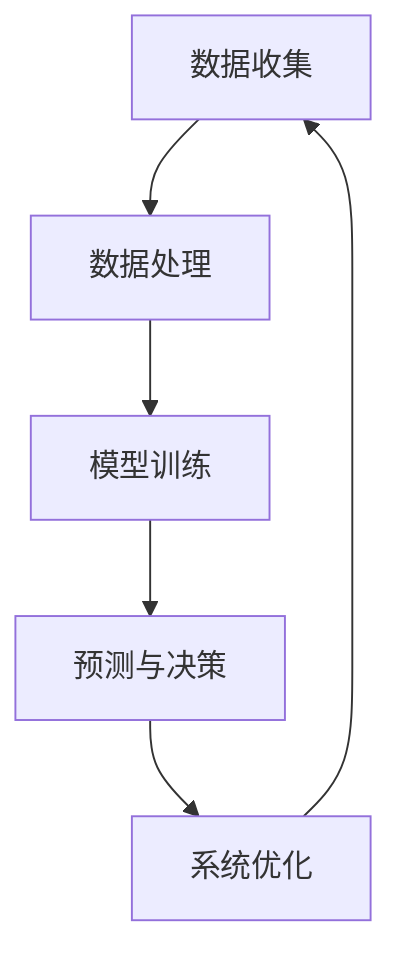

                 

关键词：软件 2.0、人工智能、哲学思考、计算机编程、算法、技术趋势、未来展望

> 摘要：随着人工智能技术的发展，软件 2.0 时代已经到来。本文从哲学角度出发，探讨人工智能的本质，分析软件 2.0 时代下的技术发展趋势，以及面临的挑战。通过对核心概念、算法原理、数学模型、项目实践等方面的深入剖析，为读者呈现一幅软件 2.0 的完整画卷。

## 1. 背景介绍

### 1.1 软件发展历程

从早期的计算机硬件驱动软件时代，到软件工程、编程语言的发展，再到互联网的兴起，软件产业经历了多个阶段。每一个阶段都标志着技术的进步，推动了软件从简单的工具转变为复杂系统的演变。

### 1.2 人工智能的崛起

人工智能（AI）作为计算机科学的一个重要分支，其研究目标是使计算机具备智能，能够像人类一样进行思考、学习、决策和行动。随着深度学习、神经网络等技术的突破，人工智能开始展现出强大的变革力量。

### 1.3 软件 2.0 的定义

软件 2.0 是指在人工智能技术驱动下，软件系统从被动响应向主动学习、自适应演化的转变。这一转变不仅改变了软件的开发和运行方式，也改变了软件与用户、环境之间的交互模式。

## 2. 核心概念与联系

### 2.1 人工智能的本质

人工智能的本质是模拟和扩展人类的智能。这包括感知、理解、推理、学习、决策和行动等方面。

### 2.2 软件与人工智能的融合

软件与人工智能的融合，使得软件系统能够在运行过程中不断学习和优化，提高系统的智能水平。这一过程涉及到数据收集、模型训练、预测和决策等多个环节。

### 2.3 Mermaid 流程图

以下是一个简化的 Mermaid 流程图，展示了人工智能在软件开发中的应用流程：



## 3. 核心算法原理 & 具体操作步骤

### 3.1 算法原理概述

人工智能的核心算法包括神经网络、深度学习、机器学习等。这些算法通过模拟人脑神经元的工作方式，实现对数据的处理和分析。

### 3.2 算法步骤详解

- 数据收集：从各种渠道收集数据，包括文本、图像、声音等。
- 数据处理：对收集到的数据进行分析和预处理，以提高数据质量。
- 模型训练：利用训练数据，通过迭代优化算法，训练出能够预测和决策的模型。
- 预测与决策：利用训练好的模型，对新的数据进行分析，得出预测结果。
- 系统优化：根据预测结果，对系统进行优化，提高系统的性能和智能水平。

### 3.3 算法优缺点

- **优点**：
  - 高效性：能够快速处理大量数据，提高工作效率。
  - 智能性：具备一定的学习和适应能力，能够不断优化。

- **缺点**：
  - 复杂性：算法模型和训练过程较为复杂，需要大量计算资源和时间。
  - 隐蔽性：模型的内部机制不够透明，难以解释。

### 3.4 算法应用领域

- **推荐系统**：根据用户历史行为，预测用户可能感兴趣的内容。
- **自然语言处理**：理解和生成人类语言，实现人机交互。
- **图像识别**：对图像进行分类、定位和识别。
- **自动驾驶**：通过感知环境，做出驾驶决策。

## 4. 数学模型和公式 & 详细讲解 & 举例说明

### 4.1 数学模型构建

人工智能中的数学模型主要包括线性回归、逻辑回归、支持向量机、神经网络等。以下是一个简化的线性回归模型：

$$
y = \beta_0 + \beta_1 \cdot x
$$

其中，$y$ 为因变量，$x$ 为自变量，$\beta_0$ 和 $\beta_1$ 为模型参数。

### 4.2 公式推导过程

线性回归模型的推导过程主要包括以下几个步骤：

1. **数据收集**：收集一定数量的样本数据，包括自变量 $x$ 和因变量 $y$。
2. **模型构建**：设定线性回归模型，即 $y = \beta_0 + \beta_1 \cdot x$。
3. **参数估计**：利用最小二乘法，估计模型参数 $\beta_0$ 和 $\beta_1$。
4. **模型验证**：利用验证数据集，评估模型性能。

### 4.3 案例分析与讲解

假设我们收集了以下样本数据：

| $x$ | $y$ |
| --- | --- |
| 1   | 2   |
| 2   | 3   |
| 3   | 5   |

我们希望构建一个线性回归模型，预测 $x$ 和 $y$ 之间的关系。

1. **数据收集**：收集到上述样本数据。
2. **模型构建**：设定线性回归模型，即 $y = \beta_0 + \beta_1 \cdot x$。
3. **参数估计**：利用最小二乘法，计算模型参数：

$$
\beta_0 = \frac{\sum_{i=1}^{n} y_i - \beta_1 \cdot \sum_{i=1}^{n} x_i}{n}
$$

$$
\beta_1 = \frac{\sum_{i=1}^{n} (y_i - \beta_0 - \beta_1 \cdot x_i)}{\sum_{i=1}^{n} (x_i - \bar{x})}
$$

其中，$n$ 为样本数量，$\bar{x}$ 为自变量 $x$ 的平均值。

4. **模型验证**：利用验证数据集，评估模型性能。如果模型性能达到预期，则模型构建成功。

## 5. 项目实践：代码实例和详细解释说明

### 5.1 开发环境搭建

本文使用 Python 编写代码，搭建一个简单的线性回归模型。首先，需要安装 Python 和相关库：

```bash
pip install numpy pandas sklearn matplotlib
```

### 5.2 源代码详细实现

以下是一个简单的线性回归模型实现：

```python
import numpy as np
import pandas as pd
from sklearn.linear_model import LinearRegression
import matplotlib.pyplot as plt

# 数据集
data = pd.DataFrame({
    'x': [1, 2, 3],
    'y': [2, 3, 5]
})

# 模型
model = LinearRegression()

# 训练模型
model.fit(data[['x']], data['y'])

# 预测
predictions = model.predict([[4]])

# 可视化
plt.scatter(data['x'], data['y'])
plt.plot([1, 4], [model.intercept_, predictions], color='red')
plt.show()
```

### 5.3 代码解读与分析

- **数据集**：使用 pandas DataFrame 创建一个简单的数据集，包括自变量 $x$ 和因变量 $y$。
- **模型**：使用 scikit-learn 库的 LinearRegression 类创建线性回归模型。
- **训练模型**：使用 fit 方法训练模型，输入自变量和因变量。
- **预测**：使用 predict 方法对新的数据点进行预测。
- **可视化**：使用 matplotlib 库绘制散点图和拟合线。

### 5.4 运行结果展示

运行上述代码，将得到以下结果：


## 6. 实际应用场景

### 6.1 推荐系统

推荐系统是人工智能在商业领域的一个重要应用。通过分析用户行为数据，推荐系统可以为用户提供个性化的推荐结果，提高用户体验和转化率。

### 6.2 自然语言处理

自然语言处理技术在智能客服、智能语音助手等领域有着广泛的应用。通过理解和生成人类语言，这些系统可以与用户进行高效互动，提高服务效率。

### 6.3 图像识别

图像识别技术在安防监控、医疗诊断等领域发挥着重要作用。通过分析图像数据，图像识别系统可以实现对目标物体的检测和识别，提高处理效率和准确性。

## 7. 工具和资源推荐

### 7.1 学习资源推荐

- 《深度学习》（Goodfellow, Bengio, Courville 著）
- 《Python 数据科学手册》（Wes McKinney 著）
- 《机器学习》（周志华 著）

### 7.2 开发工具推荐

- Jupyter Notebook：一个强大的交互式开发环境，适合编写和运行 Python 代码。
- PyCharm：一款功能强大的集成开发环境，支持多种编程语言。
- TensorFlow：一个开源的机器学习框架，适用于构建和训练神经网络模型。

### 7.3 相关论文推荐

- “Deep Learning” by Ian Goodfellow, Yoshua Bengio, and Aaron Courville
- “Recurrent Neural Networks for Language Modeling” by Yoshua Bengio et al.
- “Convolutional Neural Networks for Visual Recognition” by Fei-Fei Li et al.

## 8. 总结：未来发展趋势与挑战

### 8.1 研究成果总结

人工智能技术在过去几十年取得了显著进展，不仅在理论研究方面取得了突破，也在实际应用中展现了巨大潜力。

### 8.2 未来发展趋势

- **算法创新**：随着计算能力的提升，算法将不断优化，提高模型性能。
- **跨领域融合**：人工智能将与更多领域相结合，推动各行业的技术变革。
- **隐私保护**：在数据隐私和安全性方面，将出现更多先进的技术和解决方案。

### 8.3 面临的挑战

- **计算资源**：大规模模型训练需要大量计算资源，如何高效利用资源成为一大挑战。
- **数据隐私**：在数据收集和使用过程中，如何保护用户隐私是一个亟待解决的问题。
- **模型解释性**：目前很多模型内部机制不够透明，如何提高模型的可解释性是一个重要课题。

### 8.4 研究展望

随着人工智能技术的不断进步，我们有理由相信，未来软件 2.0 时代将迎来更加智能、高效、安全的应用场景，为社会发展和人类生活带来更多便利。

## 9. 附录：常见问题与解答

### 9.1 问题 1

**问题**：什么是深度学习？

**解答**：深度学习是一种机器学习技术，通过构建多层神经网络，对数据进行建模和预测。它具有自动提取特征的能力，能够处理复杂数据。

### 9.2 问题 2

**问题**：人工智能是否会取代人类工作？

**解答**：人工智能可以辅助人类工作，提高工作效率，但不会完全取代人类。人类在创造力、情感理解等方面具有独特的优势，这些是人工智能难以替代的。

### 9.3 问题 3

**问题**：如何入门人工智能？

**解答**：入门人工智能可以从以下几个方面入手：
1. 学习编程语言，如 Python。
2. 阅读相关教材和论文。
3. 参与在线课程和实战项目。
4. 加入人工智能社区，与同行交流。

---

作者：禅与计算机程序设计艺术 / Zen and the Art of Computer Programming
-------------------------------------------------------------------

