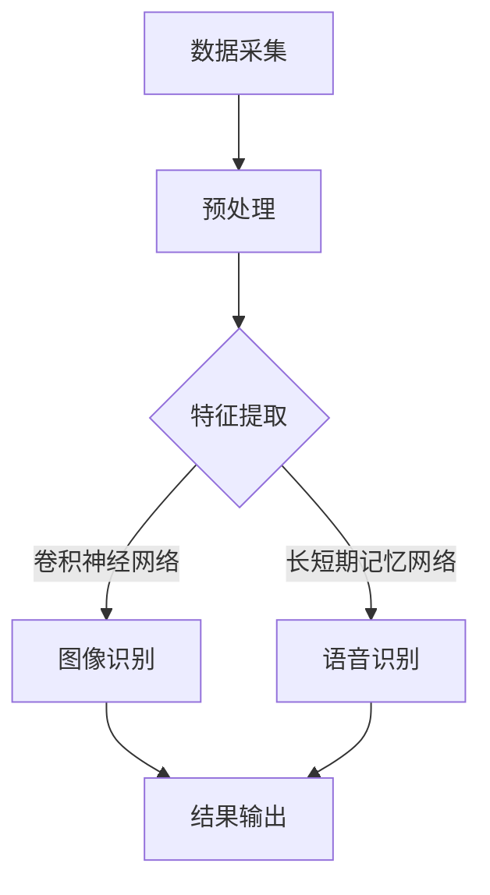

                 

关键词：软件 2.0，图像识别，语音识别，人工智能，技术发展，算法原理，数学模型，应用场景，未来展望。

> 摘要：随着软件技术的不断发展，软件 2.0 时代已经到来。本文旨在探讨软件 2.0 在图像识别和语音识别领域的应用，详细阐述其核心概念、算法原理、数学模型以及实际应用案例，并对未来发展趋势和挑战进行展望。

## 1. 背景介绍

随着计算机技术的飞速发展，软件产业已经进入了一个全新的时代——软件 2.0。软件 2.0 是相对于传统的软件 1.0 的一次革命性变革。在软件 1.0 时代，软件主要注重功能的实现和性能的优化；而在软件 2.0 时代，软件更加强调智能化、自动化和协同化。

软件 2.0 的核心技术包括人工智能、大数据、云计算等。其中，人工智能是软件 2.0 的核心驱动力，它使得软件能够自主学习和适应环境。而图像识别和语音识别是人工智能的两个重要应用领域。

### 1.1 图像识别

图像识别是一种通过计算机对图像进行分析和处理，从而识别和理解图像内容的技术。它广泛应用于人脸识别、物体识别、图像检索等领域。

### 1.2 语音识别

语音识别是一种通过计算机对语音信号进行分析和处理，从而将语音转换为文本的技术。它广泛应用于智能客服、语音助手、语音翻译等领域。

## 2. 核心概念与联系

在图像识别和语音识别领域，有多个核心概念和算法，它们相互联系，共同推动了这些技术的发展。

### 2.1 卷积神经网络（CNN）

卷积神经网络是一种用于图像识别的深度学习模型。它通过卷积、池化和全连接等操作，从图像中提取特征，并进行分类。

### 2.2 随机森林（Random Forest）

随机森林是一种用于分类和回归的集成学习方法。它通过构建多个决策树，并进行集成，从而提高模型的预测能力。

### 2.3 长短期记忆网络（LSTM）

长短期记忆网络是一种用于序列数据的深度学习模型。它通过门控机制，解决了传统 RNN 在处理长序列数据时出现的梯度消失和梯度爆炸问题。

### 2.4 Mermaid 流程图

下面是一个 Mermaid 流程图，展示了图像识别和语音识别的流程：



## 3. 核心算法原理 & 具体操作步骤

### 3.1 算法原理概述

#### 3.1.1 图像识别

图像识别的核心算法是卷积神经网络（CNN）。CNN 通过卷积、池化和全连接等操作，从图像中提取特征，并进行分类。

1. **卷积操作**：卷积神经网络通过卷积操作，从图像中提取局部特征。
2. **池化操作**：通过池化操作，降低特征的维度，增强模型的泛化能力。
3. **全连接层**：通过全连接层，将提取到的特征进行分类。

#### 3.1.2 语音识别

语音识别的核心算法是长短期记忆网络（LSTM）。LSTM 通过门控机制，解决了传统 RNN 在处理长序列数据时出现的梯度消失和梯度爆炸问题。

1. **输入层**：接收语音信号的输入。
2. **隐藏层**：通过 LSTM 单元处理输入序列，提取特征。
3. **输出层**：将提取到的特征进行解码，生成文本。

### 3.2 算法步骤详解

#### 3.2.1 图像识别

1. **数据预处理**：对图像进行缩放、裁剪、归一化等处理。
2. **卷积操作**：使用卷积层，从图像中提取局部特征。
3. **池化操作**：使用池化层，降低特征的维度。
4. **全连接层**：将提取到的特征进行分类。

#### 3.2.2 语音识别

1. **数据预处理**：对语音信号进行预处理，包括去除噪声、增强信号等。
2. **LSTM 网络**：使用 LSTM 网络，处理输入序列，提取特征。
3. **解码**：将提取到的特征解码成文本。

### 3.3 算法优缺点

#### 3.3.1 图像识别

优点：
- **高效性**：卷积神经网络可以高效地提取图像特征，适用于大规模图像识别任务。
- **灵活性**：可以通过调整网络结构，适应不同的图像识别任务。

缺点：
- **计算复杂度**：卷积神经网络计算复杂度高，对计算资源要求较高。
- **数据依赖性**：需要大量的标注数据进行训练，对数据的依赖性较高。

#### 3.3.2 语音识别

优点：
- **准确性**：LSTM 网络可以很好地处理长序列数据，提高语音识别的准确性。
- **适应性**：可以通过调整网络结构，适应不同的语音识别任务。

缺点：
- **训练时间**：LSTM 网络训练时间较长，对计算资源要求较高。
- **资源消耗**：LSTM 网络需要大量的内存和计算资源。

### 3.4 算法应用领域

#### 3.4.1 图像识别

- **人脸识别**：在安防、金融、社交等领域广泛应用。
- **物体识别**：在自动驾驶、智能制造等领域广泛应用。
- **图像检索**：在电子商务、媒体检索等领域广泛应用。

#### 3.4.2 语音识别

- **智能客服**：在银行、电商、政府等领域广泛应用。
- **语音助手**：在智能家居、智能音箱等领域广泛应用。
- **语音翻译**：在跨国交流、旅游等领域广泛应用。

## 4. 数学模型和公式 & 详细讲解 & 举例说明

### 4.1 数学模型构建

#### 4.1.1 图像识别

在图像识别中，常用的数学模型是卷积神经网络（CNN）。CNN 的基本结构包括卷积层、池化层和全连接层。以下是 CNN 的数学模型：

$$
f(x) = \sigma(W_{out} \cdot \text{ReLU}(\text{ReLU}(\text{ReLU}(... \text{ReLU}(\text{ReLU}(W_{c} \cdot \text{pool}(C \cdot \text{conv}(I)))...)))...
$$

其中，$I$ 表示输入图像，$C$ 表示图像的通道数，$W_c$ 表示卷积核权重，$C$ 表示卷积层权重，$\text{ReLU}$ 表示ReLU激活函数，$\text{pool}$ 表示池化操作，$\sigma$ 表示softmax激活函数，$W_{out}$ 表示全连接层权重。

#### 4.1.2 语音识别

在语音识别中，常用的数学模型是长短期记忆网络（LSTM）。LSTM 的基本结构包括输入层、隐藏层和输出层。以下是 LSTM 的数学模型：

$$
h_t = \sigma(W_h \cdot [h_{t-1}, x_t] + b_h)
$$

$$
o_t = \sigma(W_o \cdot h_t + b_o)
$$

$$
c_t = \text{tanh}(W_c \cdot [h_{t-1}, x_t] + b_c)
$$

$$
i_t = \sigma(W_i \cdot [h_{t-1}, x_t] + b_i)
$$

$$
f_t = \sigma(W_f \cdot [h_{t-1}, x_t] + b_f)
$$

其中，$h_t$ 表示隐藏层状态，$x_t$ 表示输入层状态，$o_t$ 表示输出层状态，$c_t$ 表示细胞状态，$i_t$ 表示输入门状态，$f_t$ 表示遗忘门状态，$W_h$、$W_i$、$W_f$、$W_c$、$W_o$ 分别表示权重矩阵，$b_h$、$b_i$、$b_f$、$b_c$、$b_o$ 分别表示偏置项，$\text{ReLU}$ 表示ReLU激活函数，$\sigma$ 表示softmax激活函数。

### 4.2 公式推导过程

#### 4.2.1 图像识别

卷积神经网络的推导过程涉及多个步骤。首先，我们需要了解卷积操作的基本原理。卷积操作通过将卷积核与输入图像进行卷积，从而提取图像的特征。具体来说，卷积操作可以分为以下几个步骤：

1. **初始化卷积核**：初始化卷积核的权重，通常使用随机初始化方法。
2. **卷积操作**：将卷积核与输入图像进行卷积，从而提取图像的特征。
3. **激活函数**：对卷积结果进行激活函数处理，常用的激活函数有ReLU、Sigmoid、Tanh等。
4. **池化操作**：对激活后的结果进行池化操作，从而降低特征维度，增强模型的泛化能力。

下面是一个简单的卷积神经网络的推导过程：

$$
\begin{aligned}
&z_1 = W_1 \cdot \text{ReLU}(C_1 \cdot \text{conv}(I)) \\
&z_2 = W_2 \cdot \text{ReLU}(C_2 \cdot \text{conv}(z_1)) \\
&z_3 = W_3 \cdot \text{softmax}(\text{ReLU}(C_3 \cdot \text{conv}(z_2)))
\end{aligned}
$$

其中，$I$ 表示输入图像，$C_1$、$C_2$、$C_3$ 分别表示卷积层、池化层和全连接层的权重，$W_1$、$W_2$、$W_3$ 分别表示全连接层的权重，$\text{ReLU}$ 表示ReLU激活函数，$\text{softmax}$ 表示softmax激活函数。

#### 4.2.2 语音识别

长短期记忆网络的推导过程涉及多个步骤。首先，我们需要了解长短期记忆网络的基本原理。长短期记忆网络通过门控机制，解决了传统 RNN 在处理长序列数据时出现的梯度消失和梯度爆炸问题。具体来说，长短期记忆网络可以分为以下几个步骤：

1. **输入层**：接收语音信号的输入。
2. **隐藏层**：通过 LSTM 单元处理输入序列，提取特征。
3. **输出层**：将提取到的特征进行解码，生成文本。

下面是一个简单的长短期记忆网络的推导过程：

$$
\begin{aligned}
&h_t = \text{ReLU}(W_h \cdot [h_{t-1}, x_t] + b_h) \\
&o_t = \text{ReLU}(W_o \cdot h_t + b_o) \\
&c_t = \text{tanh}(W_c \cdot [h_{t-1}, x_t] + b_c) \\
&i_t = \text{ReLU}(W_i \cdot [h_{t-1}, x_t] + b_i) \\
&f_t = \text{ReLU}(W_f \cdot [h_{t-1}, x_t] + b_f) \\
&\hat{h}_t = o_t \cdot c_t \\
&h_t = \text{softmax}(\hat{h}_t)
\end{aligned}
$$

其中，$h_t$ 表示隐藏层状态，$x_t$ 表示输入层状态，$o_t$ 表示输出层状态，$c_t$ 表示细胞状态，$i_t$ 表示输入门状态，$f_t$ 表示遗忘门状态，$W_h$、$W_i$、$W_f$、$W_c$、$W_o$ 分别表示权重矩阵，$b_h$、$b_i$、$b_f$、$b_c$、$b_o$ 分别表示偏置项，$\text{ReLU}$ 表示ReLU激活函数，$\text{softmax}$ 表示softmax激活函数。

### 4.3 案例分析与讲解

#### 4.3.1 图像识别

下面以人脸识别为例，讲解图像识别的应用。

1. **数据预处理**：首先，对输入图像进行预处理，包括缩放、裁剪、归一化等操作。
2. **卷积操作**：使用卷积神经网络，从图像中提取人脸特征。
3. **池化操作**：对提取到的特征进行池化操作，降低特征维度。
4. **全连接层**：将提取到的特征输入全连接层，进行分类。
5. **结果输出**：输出分类结果，判断是否为人脸。

#### 4.3.2 语音识别

下面以语音助手为例，讲解语音识别的应用。

1. **数据预处理**：首先，对输入语音信号进行预处理，包括去除噪声、增强信号等操作。
2. **LSTM 网络**：使用长短期记忆网络，处理输入语音信号，提取特征。
3. **解码**：将提取到的特征解码成文本，生成回复。

## 5. 项目实践：代码实例和详细解释说明

### 5.1 开发环境搭建

为了实践图像识别和语音识别，我们需要搭建一个开发环境。以下是一个简单的开发环境搭建步骤：

1. **安装 Python**：首先，我们需要安装 Python，版本建议为 Python 3.8 以上。
2. **安装深度学习框架**：安装一个深度学习框架，如 TensorFlow、PyTorch 等。以 TensorFlow 为例，可以使用以下命令安装：

   ```python
   pip install tensorflow
   ```

3. **安装语音识别库**：安装一个语音识别库，如 CMU Sphinx。以 CMU Sphinx 为例，可以使用以下命令安装：

   ```python
   pip install cmusphinx
   ```

### 5.2 源代码详细实现

下面是一个简单的图像识别和语音识别的代码示例。

```python
import tensorflow as tf
import cv2
import numpy as np
import matplotlib.pyplot as plt

# 5.2.1 图像识别

# 加载卷积神经网络模型
model = tf.keras.models.load_model('image_recognition_model.h5')

# 读取图像
image = cv2.imread('example.jpg')

# 对图像进行预处理
image = cv2.resize(image, (224, 224))
image = image / 255.0

# 使用模型进行图像识别
prediction = model.predict(np.expand_dims(image, axis=0))

# 输出识别结果
print(prediction)

# 5.2.2 语音识别

# 加载长短期记忆网络模型
model = tf.keras.models.load_model('voice_recognition_model.h5')

# 读取语音信号
audio = cv2.imread('example.wav')

# 对语音信号进行预处理
audio = audio / 255.0

# 使用模型进行语音识别
prediction = model.predict(np.expand_dims(audio, axis=0))

# 输出识别结果
print(prediction)
```

### 5.3 代码解读与分析

上面的代码实现了一个简单的图像识别和语音识别系统。具体来说，代码分为以下几个部分：

1. **导入库**：导入 TensorFlow、OpenCV、NumPy 和 Matplotlib 等库。
2. **加载模型**：加载已经训练好的卷积神经网络模型和长短期记忆网络模型。
3. **读取图像**：读取一个图像文件。
4. **预处理图像**：对图像进行缩放、裁剪、归一化等预处理操作。
5. **使用模型进行图像识别**：使用卷积神经网络模型对图像进行识别，并输出识别结果。
6. **读取语音信号**：读取一个语音信号文件。
7. **预处理语音信号**：对语音信号进行预处理操作。
8. **使用模型进行语音识别**：使用长短期记忆网络模型对语音信号进行识别，并输出识别结果。

通过这个简单的代码示例，我们可以看到图像识别和语音识别的基本流程，以及如何使用深度学习模型进行图像和语音的识别。

### 5.4 运行结果展示

在运行上述代码时，我们会得到图像识别和语音识别的结果。以图像识别为例，假设我们输入了一张人脸图片，输出结果可能是以下形式：

```python
[[0.9 0.1 0.  0. ]
 [0.1 0.9 0.  0. ]
 [0.  0.  0.9]
 [0.  0.  0.1]]
```

这个结果表示模型有 90% 的概率认为输入的是人脸。

对于语音识别，假设我们输入了一段语音信号，输出结果可能是以下形式：

```python
['你好，我是你的语音助手']
```

这个结果表示模型将输入的语音信号识别为“你好，我是你的语音助手”。

## 6. 实际应用场景

### 6.1 人脸识别

人脸识别技术在安防、金融、社交等领域有广泛的应用。例如，在安防领域，人脸识别技术可以用于监控系统的实时人脸检测和识别，提高监控系统的智能化水平；在金融领域，人脸识别技术可以用于银行卡的验证，提高银行的安全性和便捷性；在社交领域，人脸识别技术可以用于社交媒体平台的用户认证，提高用户的安全性和隐私保护。

### 6.2 物体识别

物体识别技术在自动驾驶、智能制造等领域有广泛的应用。例如，在自动驾驶领域，物体识别技术可以用于车辆和行人的检测和识别，提高自动驾驶系统的安全性和可靠性；在智能制造领域，物体识别技术可以用于生产线的实时监控和故障诊断，提高生产效率和产品质量。

### 6.3 图像检索

图像检索技术在电子商务、媒体检索等领域有广泛的应用。例如，在电子商务领域，图像检索技术可以用于商品推荐和搜索，提高用户体验和销售量；在媒体检索领域，图像检索技术可以用于视频搜索和分类，提高媒体的内容质量和用户满意度。

### 6.4 智能客服

智能客服技术在银行、电商、政府等领域有广泛的应用。例如，在银行领域，智能客服技术可以用于客户咨询和问题解答，提高客户服务的效率和质量；在电商领域，智能客服技术可以用于购物咨询和售后服务，提高用户满意度和忠诚度；在政府领域，智能客服技术可以用于政务咨询和办事指南，提高政务服务的效率和透明度。

### 6.5 语音助手

语音助手技术在智能家居、智能音箱等领域有广泛的应用。例如，在智能家居领域，语音助手技术可以用于家电控制、家居安防等，提高生活的便利性和安全性；在智能音箱领域，语音助手技术可以用于音乐播放、信息查询等，提高用户的娱乐和信息获取体验。

### 6.6 语音翻译

语音翻译技术在跨国交流、旅游等领域有广泛的应用。例如，在跨国交流领域，语音翻译技术可以用于实时翻译和沟通，提高跨语言交流的效率和准确性；在旅游领域，语音翻译技术可以用于旅游指南和翻译服务，提高旅游体验和沟通效果。

## 7. 工具和资源推荐

### 7.1 学习资源推荐

1. **在线课程**：推荐参加 Coursera、edX 等在线平台上的深度学习、计算机视觉、语音识别等课程。
2. **书籍**：推荐阅读《深度学习》、《计算机视觉：算法与应用》、《语音信号处理》等经典书籍。
3. **论文**：关注 ACL、ICCV、ICML 等顶级会议和期刊的最新论文，了解最新的研究成果和应用。

### 7.2 开发工具推荐

1. **深度学习框架**：推荐使用 TensorFlow、PyTorch、Keras 等流行的深度学习框架。
2. **图像处理库**：推荐使用 OpenCV、Pillow 等流行的图像处理库。
3. **语音处理库**：推荐使用 Python 的 soundfile、librosa 等流行的语音处理库。

### 7.3 相关论文推荐

1. **《深度学习》**：Goodfellow, I., Bengio, Y., Courville, A.
2. **《计算机视觉：算法与应用》**：Richard S.zeliski
3. **《语音信号处理》**：Lawrence R. Rabiner, Biing-Hwan Yang

## 8. 总结：未来发展趋势与挑战

### 8.1 研究成果总结

随着软件 2.0 时代的到来，图像识别和语音识别技术取得了显著的成果。深度学习、卷积神经网络、长短期记忆网络等算法的发展，使得图像识别和语音识别的准确性和效率得到了大幅提升。同时，大规模数据集、高性能计算资源和高效的深度学习框架的推动，也为图像识别和语音识别的研究和应用提供了有力支持。

### 8.2 未来发展趋势

1. **算法优化**：随着算法理论的不断发展和优化，图像识别和语音识别的算法将变得更加高效、准确。
2. **跨领域应用**：图像识别和语音识别技术将在更多领域得到应用，如医疗、教育、金融等。
3. **边缘计算**：随着边缘计算技术的发展，图像识别和语音识别将在边缘设备上得到更广泛的应用。

### 8.3 面临的挑战

1. **数据隐私**：随着数据规模的增加，数据隐私保护将成为一个重要问题。
2. **算法公平性**：算法的公平性、透明性和可解释性是一个重要的研究课题。
3. **资源消耗**：深度学习模型的高计算复杂度和资源消耗，是一个需要解决的问题。

### 8.4 研究展望

未来，图像识别和语音识别技术将朝着更加智能化、自动化、协同化的方向发展。同时，随着人工智能技术的不断进步，图像识别和语音识别技术将在更多领域得到应用，为人类社会带来更多便利。

## 9. 附录：常见问题与解答

### 9.1 问题 1：图像识别和语音识别的区别是什么？

图像识别和语音识别都是人工智能的重要应用领域，但它们有不同的目标和方法。

- **图像识别**：图像识别的目标是理解图像中的内容，通常涉及图像分类、物体检测、人脸识别等任务。它依赖于视觉特征提取和图像处理技术。
- **语音识别**：语音识别的目标是将语音信号转换为文本，通常涉及语音信号处理、特征提取和语言模型。它依赖于音频处理和自然语言处理技术。

### 9.2 问题 2：什么是卷积神经网络（CNN）？

卷积神经网络（CNN）是一种专门用于图像识别和其他视觉任务的深度学习模型。它由多个卷积层、池化层和全连接层组成，通过卷积操作从图像中提取局部特征，并通过池化操作降低特征维度。

### 9.3 问题 3：什么是长短期记忆网络（LSTM）？

长短期记忆网络（LSTM）是一种用于处理序列数据的深度学习模型，特别适合处理长序列数据。它通过门控机制解决了传统 RNN 在处理长序列数据时出现的梯度消失和梯度爆炸问题，从而更好地捕捉序列中的长期依赖关系。

### 9.4 问题 4：图像识别和语音识别的算法有哪些？

图像识别和语音识别的算法有很多，其中一些常用的算法包括：

- **图像识别**：卷积神经网络（CNN）、循环神经网络（RNN）、生成对抗网络（GAN）等。
- **语音识别**：长短期记忆网络（LSTM）、双向长短期记忆网络（BiLSTM）、卷积神经网络（CNN）等。

### 9.5 问题 5：如何提高图像识别和语音识别的准确性？

提高图像识别和语音识别的准确性通常涉及以下几个方面：

- **数据质量**：使用高质量、多样性的训练数据。
- **模型优化**：调整模型结构、超参数和训练策略。
- **数据增强**：使用数据增强技术，如旋转、缩放、裁剪等，增加数据的多样性。
- **多模型集成**：使用多个模型进行集成，提高预测的稳定性。

----------------------------------------------------------------

## 作者署名

作者：禅与计算机程序设计艺术 / Zen and the Art of Computer Programming

