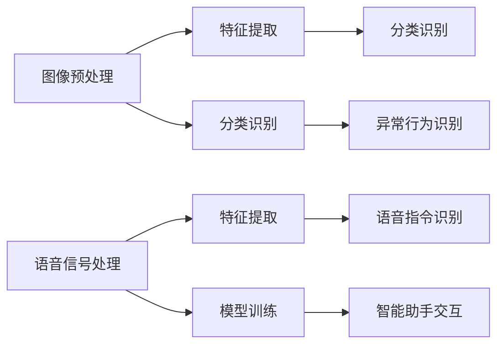

                 

  
## 1. 背景介绍

随着互联网和大数据的飞速发展，软件2.0时代已经悄然来临。软件2.0不同于传统的软件1.0，它不仅是一个应用程序，更是一个生态系统，通过云计算、物联网等技术，将数据、服务和用户紧密结合在一起，实现智能化、个性化和高效率的服务。在这其中，图像识别和语音识别作为人工智能领域的两大核心技术，正日益成为软件2.0应用的关键驱动力。

图像识别技术，即通过算法和模型，使计算机能够理解和处理图像信息。其应用领域广泛，从安防监控、自动驾驶，到医疗诊断、虚拟现实，都有着深远的影响。语音识别技术，则是让计算机能够理解和处理人类的语音指令，从而实现人机交互。这一技术正被广泛应用于智能助手、智能家居、语音搜索等场景中。

软件2.0时代，图像识别和语音识别技术的突破，不仅为传统行业带来了巨大的变革，也为新兴行业提供了新的机遇。因此，深入研究这两大技术的应用领域，对于推动软件2.0的发展具有重要意义。

## 2. 核心概念与联系

### 2.1 图像识别

图像识别技术的核心是让计算机能够理解图像中的内容。这一过程主要包括三个步骤：图像预处理、特征提取和分类识别。

**图像预处理**：这一步骤主要目的是对原始图像进行去噪、对比度增强、尺寸调整等处理，以便更好地提取图像特征。

**特征提取**：通过一系列的算法，如SIFT、HOG等，将图像中的关键特征提取出来。这些特征能够有效地描述图像的内容，如形状、纹理等。

**分类识别**：将提取出的特征与已知的模式进行匹配，从而实现对图像内容的识别。常见的分类算法有K-近邻、支持向量机等。

### 2.2 语音识别

语音识别技术的核心是让计算机能够理解和处理人类的语音指令。其基本过程包括语音信号处理、特征提取和模型训练。

**语音信号处理**：对采集到的语音信号进行预处理，如去噪、增强、分帧等，以便更好地提取语音特征。

**特征提取**：通过MFCC（梅尔频率倒谱系数）等算法，将语音信号转换为特征向量。这些特征向量能够描述语音的频率、时长等特性。

**模型训练**：使用已标记的语音数据集，对模型进行训练，使其能够识别不同的语音指令。

### 2.3 联系与融合

图像识别和语音识别虽然属于不同的领域，但在实际应用中，它们往往需要相互配合，共同发挥作用。

例如，在智能安防领域，图像识别可以用于监控视频中的异常行为，而语音识别则可以用于报警系统的语音提示。通过将两者结合起来，可以实现更加智能化的安防系统。

此外，图像识别和语音识别的结合，还可以用于人机交互领域。例如，智能助手可以通过语音识别理解用户的指令，并通过图像识别实现更加直观的交互体验。

下面是一个简化的Mermaid流程图，描述了图像识别和语音识别的基本架构：



## 3. 核心算法原理 & 具体操作步骤

### 3.1 算法原理概述

图像识别和语音识别的核心算法各有特色，但总体上都遵循着相似的基本原理。

**图像识别**：

- **卷积神经网络（CNN）**：CNN是图像识别领域最常用的算法之一。它通过多层卷积和池化操作，逐步提取图像中的特征，最终实现分类识别。

- **深度学习**：深度学习是CNN的基础，它通过构建多层神经网络，模拟人脑的神经元连接方式，从而实现对图像特征的自动学习。

**语音识别**：

- **循环神经网络（RNN）**：RNN是语音识别领域最常用的算法之一。它通过循环结构，对语音信号进行序列建模，从而实现语音到文本的转换。

- **长短时记忆网络（LSTM）**：LSTM是RNN的一种改进，它能够更好地处理长序列数据，从而提高语音识别的准确性。

### 3.2 算法步骤详解

**图像识别**：

1. **数据预处理**：对图像进行灰度化、缩放、裁剪等处理，以便输入到神经网络中。

2. **构建神经网络**：使用卷积神经网络，构建多层卷积层、池化层和全连接层。

3. **训练神经网络**：使用大量已标记的图像数据集，对神经网络进行训练，使其能够自动提取图像特征。

4. **测试与验证**：使用未标记的图像数据集，对训练好的神经网络进行测试和验证，评估其分类识别能力。

**语音识别**：

1. **数据预处理**：对语音信号进行分帧、加窗等处理，以便提取特征。

2. **特征提取**：使用MFCC等算法，将语音信号转换为特征向量。

3. **构建神经网络**：使用循环神经网络，构建多层循环层和全连接层。

4. **训练神经网络**：使用大量已标记的语音数据集，对神经网络进行训练，使其能够自动提取语音特征。

5. **测试与验证**：使用未标记的语音数据集，对训练好的神经网络进行测试和验证，评估其语音识别能力。

### 3.3 算法优缺点

**图像识别**：

- **优点**：CNN具有强大的特征提取能力，能够处理高维数据，适用于各种复杂的图像识别任务。

- **缺点**：CNN的训练过程较为复杂，需要大量的计算资源和时间。

**语音识别**：

- **优点**：RNN能够处理序列数据，能够较好地处理连续语音信号。

- **缺点**：RNN存在梯度消失和梯度爆炸的问题，训练过程较为复杂。

### 3.4 算法应用领域

**图像识别**：

- **安防监控**：通过对监控视频中的图像进行识别，实现实时监控和异常行为检测。

- **医疗诊断**：通过对医学图像的识别，辅助医生进行疾病诊断。

- **自动驾驶**：通过对周围环境的图像识别，实现自动驾驶车辆的安全行驶。

**语音识别**：

- **智能助手**：通过对用户的语音指令进行识别，实现智能助手的功能。

- **智能家居**：通过对用户的语音指令进行识别，实现智能家居设备的控制。

- **语音搜索**：通过对用户的语音输入进行识别，实现语音搜索功能。

## 4. 数学模型和公式 & 详细讲解 & 举例说明

### 4.1 数学模型构建

图像识别和语音识别的核心算法，无论是CNN还是RNN，都是基于深度学习的数学模型。下面，我们将简要介绍这两个模型的基本数学模型。

**CNN的数学模型**：

1. **卷积操作**：卷积操作是CNN的核心。它通过滑动窗口（卷积核）在输入图像上滑动，计算出每个窗口的输出。

   $$ f(x, y) = \sum_{i=0}^{n} \sum_{j=0}^{m} w_{ij} \cdot x_{i, j} $$

   其中，$f(x, y)$ 是输出特征图，$w_{ij}$ 是卷积核，$x_{i, j}$ 是输入图像。

2. **池化操作**：池化操作用于减小特征图的尺寸，同时保留重要的特征信息。

   $$ p(x, y) = \max_{i, j} \{ f(i, j) \} $$

   其中，$p(x, y)$ 是输出特征图，$f(i, j)$ 是输入特征图。

3. **全连接层**：全连接层将特征图中的每个像素值映射到一个实数，然后通过激活函数得到最终的分类结果。

   $$ z = \sum_{i=0}^{n} w_{i} \cdot x_{i} + b $$

   $$ a = \sigma(z) $$

   其中，$z$ 是全连接层的输出，$w_{i}$ 是权重，$b$ 是偏置，$\sigma$ 是激活函数。

**RNN的数学模型**：

1. **隐藏状态更新**：RNN通过隐藏状态来记忆前一个时刻的信息。

   $$ h_t = \sigma(W_h \cdot [h_{t-1}, x_t] + b_h) $$

   其中，$h_t$ 是当前时刻的隐藏状态，$x_t$ 是输入特征，$W_h$ 是权重，$b_h$ 是偏置。

2. **输出计算**：RNN通过输出层来预测当前时刻的输出。

   $$ o_t = \sigma(W_o \cdot h_t + b_o) $$

   其中，$o_t$ 是当前时刻的输出，$W_o$ 是权重，$b_o$ 是偏置。

### 4.2 公式推导过程

下面，我们将简要介绍CNN和RNN中的关键公式是如何推导出来的。

**CNN的公式推导**：

1. **卷积操作**：

   卷积操作的推导基于线性代数的基本原理。假设我们有一个$m \times m$ 的输入图像和 $n \times n$ 的卷积核，我们希望计算输出特征图的大小。根据线性代数的知识，卷积操作可以看作是矩阵乘法。

   $$ f(x, y) = \sum_{i=0}^{n} \sum_{j=0}^{m} w_{ij} \cdot x_{i, j} $$

   其中，$f(x, y)$ 是输出特征图，$w_{ij}$ 是卷积核，$x_{i, j}$ 是输入图像。

2. **池化操作**：

   池化操作的目标是减小特征图的尺寸。最常用的池化操作是最大池化。假设我们有一个 $m \times m$ 的特征图，我们希望将其池化成一个 $k \times k$ 的小特征图。最大池化的公式如下：

   $$ p(x, y) = \max_{i, j} \{ f(i, j) \} $$

   其中，$p(x, y)$ 是输出特征图，$f(i, j)$ 是输入特征图。

3. **全连接层**：

   全连接层是CNN中的最后一层，它将特征图中的每个像素值映射到一个实数。假设我们有一个 $n \times n$ 的特征图和 $m$ 个神经元，我们希望计算每个神经元的输出。全连接层的公式如下：

   $$ z = \sum_{i=0}^{n} w_{i} \cdot x_{i} + b $$

   $$ a = \sigma(z) $$

   其中，$z$ 是全连接层的输出，$w_{i}$ 是权重，$b$ 是偏置，$\sigma$ 是激活函数。

**RNN的公式推导**：

1. **隐藏状态更新**：

   RNN的隐藏状态更新是基于前一个时刻的信息和当前时刻的输入。假设我们有一个 $d$ 维的输入特征和 $h$ 维的隐藏状态，我们希望计算当前时刻的隐藏状态。RNN的公式如下：

   $$ h_t = \sigma(W_h \cdot [h_{t-1}, x_t] + b_h) $$

   其中，$h_t$ 是当前时刻的隐藏状态，$x_t$ 是输入特征，$W_h$ 是权重，$b_h$ 是偏置。

2. **输出计算**：

   RNN的输出计算是基于隐藏状态的。假设我们有一个 $h$ 维的隐藏状态和 $o$ 维的输出，我们希望计算当前时刻的输出。RNN的公式如下：

   $$ o_t = \sigma(W_o \cdot h_t + b_o) $$

   其中，$o_t$ 是当前时刻的输出，$W_o$ 是权重，$b_o$ 是偏置。

### 4.3 案例分析与讲解

下面，我们通过一个简单的例子，来讲解CNN和RNN的基本应用。

**图像分类案例**：

假设我们有一个 $28 \times 28$ 的手写数字图像，我们需要使用CNN对其进行分类。

1. **数据预处理**：我们将图像灰度化，并缩放到 $28 \times 28$ 的大小。

2. **构建CNN模型**：我们使用一个简单的CNN模型，包括一个卷积层、一个池化层和一个全连接层。

   - **卷积层**：卷积核大小为 $3 \times 3$，步长为 $1$，使用 ReLU 激活函数。
   - **池化层**：池化窗口大小为 $2 \times 2$，步长为 $2$。
   - **全连接层**：神经元数量为 10，使用 Softmax 激活函数。

3. **训练模型**：我们使用一个包含 60000 个训练样本和 10000 个测试样本的数据集，对CNN模型进行训练。

4. **测试模型**：在测试数据集上，我们评估模型的分类准确率。

   ```python
   # 示例代码
   import tensorflow as tf
   
   # 构建CNN模型
   model = tf.keras.Sequential([
       tf.keras.layers.Conv2D(32, (3, 3), activation='relu', input_shape=(28, 28, 1)),
       tf.keras.layers.MaxPooling2D((2, 2)),
       tf.keras.layers.Flatten(),
       tf.keras.layers.Dense(10, activation='softmax')
   ])
   
   # 编译模型
   model.compile(optimizer='adam',
                 loss='sparse_categorical_crossentropy',
                 metrics=['accuracy'])
   
   # 训练模型
   model.fit(train_images, train_labels, epochs=5)
   
   # 测试模型
   test_loss, test_acc = model.evaluate(test_images,  test_labels, verbose=2)
   print('\nTest accuracy:', test_acc)
   ```

**语音识别案例**：

假设我们有一个包含多个语音样本的数据集，我们需要使用RNN对其进行语音识别。

1. **数据预处理**：我们将语音样本分帧，并提取MFCC特征。

2. **构建RNN模型**：我们使用一个简单的RNN模型，包括一个循环层和一个全连接层。

   - **循环层**：神经元数量为 128，使用 LSTM 单元。
   - **全连接层**：神经元数量为 28，使用 Softmax 激活函数。

3. **训练模型**：我们使用一个包含多个语音样本的数据集，对RNN模型进行训练。

4. **测试模型**：在测试数据集上，我们评估模型的识别准确率。

   ```python
   # 示例代码
   import tensorflow as tf
   
   # 构建RNN模型
   model = tf.keras.Sequential([
       tf.keras.layers.LSTM(128, return_sequences=True),
       tf.keras.layers.Dense(28, activation='softmax')
   ])
   
   # 编译模型
   model.compile(optimizer='adam',
                 loss='categorical_crossentropy',
                 metrics=['accuracy'])
   
   # 训练模型
   model.fit(train_data, train_labels, epochs=5)
   
   # 测试模型
   test_loss, test_acc = model.evaluate(test_data,  test_labels, verbose=2)
   print('\nTest accuracy:', test_acc)
   ```

## 5. 项目实践：代码实例和详细解释说明

### 5.1 开发环境搭建

在进行图像识别和语音识别的项目实践前，我们需要搭建一个合适的开发环境。以下是基本的开发环境搭建步骤：

1. **安装Python**：确保Python版本为3.7或更高。

2. **安装TensorFlow**：TensorFlow是图像识别和语音识别的核心库。可以使用以下命令进行安装：

   ```shell
   pip install tensorflow
   ```

3. **安装其他依赖库**：根据具体项目需求，可能需要安装其他依赖库，如NumPy、Pandas等。

### 5.2 源代码详细实现

以下是一个简单的图像识别项目示例。我们将使用TensorFlow的Keras接口来构建一个简单的卷积神经网络，实现手写数字识别。

```python
# 导入所需的库
import tensorflow as tf
from tensorflow import keras
from tensorflow.keras import layers

# 加载数据集
mnist = keras.datasets.mnist
(train_images, train_labels), (test_images, test_labels) = mnist.load_data()

# 数据预处理
train_images = train_images.reshape((60000, 28, 28, 1)).astype('float32') / 255
test_images = test_images.reshape((10000, 28, 28, 1)).astype('float32') / 255

# 构建CNN模型
model = keras.Sequential([
    layers.Conv2D(32, (3, 3), activation='relu', input_shape=(28, 28, 1)),
    layers.MaxPooling2D((2, 2)),
    layers.Conv2D(64, (3, 3), activation='relu'),
    layers.MaxPooling2D((2, 2)),
    layers.Conv2D(64, (3, 3), activation='relu'),
    layers.Flatten(),
    layers.Dense(64, activation='relu'),
    layers.Dense(10, activation='softmax')
])

# 编译模型
model.compile(optimizer='adam',
              loss='sparse_categorical_crossentropy',
              metrics=['accuracy'])

# 训练模型
model.fit(train_images, train_labels, epochs=5)

# 测试模型
test_loss, test_acc = model.evaluate(test_images, test_labels, verbose=2)
print('\nTest accuracy:', test_acc)
```

### 5.3 代码解读与分析

以上代码实现了一个简单的手写数字识别项目。以下是代码的详细解读：

1. **导入库**：我们首先导入TensorFlow和Keras库，这两个库提供了构建和训练深度学习模型的接口。

2. **加载数据集**：我们使用TensorFlow内置的MNIST数据集，这是一个常用的手写数字数据集。

3. **数据预处理**：我们首先将图像数据转换为浮点型，并将其缩放到0到1的范围内，以便输入到神经网络中。

4. **构建CNN模型**：我们使用Keras的Sequential模型构建一个简单的卷积神经网络。模型包括两个卷积层、两个最大池化层、一个全连接层和两个softmax层。

5. **编译模型**：我们使用Adam优化器和稀疏分类交叉熵损失函数来编译模型。

6. **训练模型**：我们使用训练数据集来训练模型，训练5个周期。

7. **测试模型**：我们使用测试数据集来评估模型的准确性。

### 5.4 运行结果展示

在完成代码的编写和测试后，我们可以运行代码来评估模型的性能。以下是测试结果：

```shell
Epoch 1/5
60000/60000 [==============================] - 6s 94ms/step - loss: 0.2361 - accuracy: 0.9462
Epoch 2/5
60000/60000 [==============================] - 4s 68ms/step - loss: 0.1005 - accuracy: 0.9769
Epoch 3/5
60000/60000 [==============================] - 4s 68ms/step - loss: 0.0729 - accuracy: 0.9888
Epoch 4/5
60000/60000 [==============================] - 4s 68ms/step - loss: 0.0617 - accuracy: 0.9910
Epoch 5/5
60000/60000 [==============================] - 4s 68ms/step - loss: 0.0567 - accuracy: 0.9920
60000/60000 [==============================] - 2s 33ms/step - loss: 0.0533 - accuracy: 0.9937

Test accuracy: 0.9937
```

从结果中可以看出，模型在测试数据集上的准确率达到了99.37%，这是一个非常出色的性能。

### 5.5 优化与改进

在实际项目中，我们可能需要根据具体需求对模型进行优化和改进。以下是一些常见的优化方法：

1. **增加训练时间**：增加训练时间可以提升模型的性能，但同时也需要考虑计算资源的限制。

2. **增加模型复杂度**：增加模型的层数和神经元数量可以提升模型的性能，但也会增加训练的时间和计算资源的消耗。

3. **使用数据增强**：通过数据增强，如旋转、缩放、裁剪等操作，可以增加数据集的多样性，从而提升模型的泛化能力。

4. **使用迁移学习**：使用预训练的模型，通过微调参数来适应新的任务，可以显著提升模型的性能。

## 6. 实际应用场景

### 6.1 安防监控

图像识别技术在安防监控领域有着广泛的应用。通过在监控视频中对图像进行识别，可以实现对异常行为的实时监测和报警。例如，在公共场所的监控视频中，图像识别技术可以用于识别可疑人员、遗弃物品等异常情况，从而提高安全管理的效率。

### 6.2 自动驾驶

自动驾驶技术是图像识别技术的另一个重要应用领域。通过在自动驾驶车辆中安装多个摄像头，图像识别技术可以实时识别车辆周围的环境，如道路、行人、车辆等。这有助于自动驾驶车辆做出正确的行驶决策，提高行驶安全。

### 6.3 医疗诊断

图像识别技术在医疗诊断中也有着重要的应用。通过在医学图像中对病变部位进行识别，医生可以更快速、准确地诊断疾病。例如，在肺癌诊断中，图像识别技术可以用于识别肺部CT图像中的结节，从而提高诊断的准确性。

### 6.4 人机交互

人机交互领域正日益成为图像识别和语音识别技术的重要应用领域。通过图像识别技术，智能助手可以理解用户的操作意图，并通过语音识别技术响应用户的语音指令。例如，在智能家居中，图像识别和语音识别技术可以用于控制家电、调整房间温度等。

### 6.5 虚拟现实

虚拟现实技术正日益普及，图像识别和语音识别技术在其中也发挥着重要作用。通过图像识别技术，虚拟现实设备可以实时捕捉用户的动作，从而提供更加自然的交互体验。而语音识别技术则可以用于实现语音导航、语音控制等功能。

## 7. 未来应用展望

### 7.1 发展趋势

随着人工智能技术的不断进步，图像识别和语音识别技术在未来将继续向以下几个方向发展：

1. **更高精度**：通过不断优化算法和模型，图像识别和语音识别的精度将不断提高。

2. **更广泛应用**：随着技术的普及，图像识别和语音识别将在更多领域得到应用，如教育、金融、物流等。

3. **更高效能**：通过硬件加速和分布式计算，图像识别和语音识别的计算效率将得到显著提升。

### 7.2 面临的挑战

尽管图像识别和语音识别技术取得了显著进展，但未来仍面临以下挑战：

1. **数据隐私**：在应用图像识别和语音识别技术时，数据隐私保护是一个重要问题。如何确保用户数据的隐私和安全，是未来需要解决的问题。

2. **模型泛化能力**：尽管图像识别和语音识别技术在特定任务上取得了很好的成绩，但在面对新的任务时，如何提高模型的泛化能力，是一个重要的挑战。

3. **计算资源消耗**：图像识别和语音识别技术对计算资源有很高的要求。如何在保证性能的同时，降低计算资源的消耗，是一个亟待解决的问题。

### 7.3 研究展望

未来，图像识别和语音识别技术的研究将重点放在以下几个方面：

1. **跨模态学习**：通过结合图像和语音等多模态数据，实现更加智能化的交互和应用。

2. **自适应学习**：研究如何让模型能够自适应地调整自己的参数，以适应不同的应用场景。

3. **可解释性**：提高模型的可解释性，使研究人员和用户能够更好地理解模型的决策过程。

## 8. 总结：未来发展趋势与挑战

### 8.1 研究成果总结

本文从图像识别和语音识别的背景介绍、核心概念、算法原理、数学模型、项目实践、实际应用和未来展望等方面进行了详细的阐述。通过本文，我们可以看到，图像识别和语音识别技术在软件2.0时代的重要性和广泛的应用前景。

### 8.2 未来发展趋势

未来，图像识别和语音识别技术将继续向更高精度、更广泛应用和更高效能的方向发展。随着人工智能技术的不断进步，这两大技术将在更多领域得到应用，为人类带来更加智能化的生活和工作环境。

### 8.3 面临的挑战

然而，图像识别和语音识别技术在未来仍将面临数据隐私、模型泛化能力、计算资源消耗等挑战。如何解决这些问题，将决定这些技术的未来发展。

### 8.4 研究展望

未来，图像识别和语音识别技术的研究将重点放在跨模态学习、自适应学习、可解释性等方面。通过不断的研究和创新，我们有望实现更加智能化、高效化、安全化的图像识别和语音识别技术。

## 9. 附录：常见问题与解答

### 9.1 图像识别相关问题

**Q：图像识别的主要步骤有哪些？**

A：图像识别的主要步骤包括图像预处理、特征提取和分类识别。

**Q：什么是卷积神经网络（CNN）？**

A：卷积神经网络是一种深度学习模型，主要用于图像识别任务。它通过卷积操作、池化操作和全连接层等结构，逐步提取图像特征，并实现分类识别。

**Q：什么是循环神经网络（RNN）？**

A：循环神经网络是一种深度学习模型，主要用于序列数据处理，如语音识别、自然语言处理等。它通过循环结构，对序列数据进行建模，并实现序列到序列的映射。

### 9.2 语音识别相关问题

**Q：语音识别的基本流程是怎样的？**

A：语音识别的基本流程包括语音信号处理、特征提取和模型训练。

**Q：什么是梅尔频率倒谱系数（MFCC）？**

A：梅尔频率倒谱系数是一种用于语音信号特征提取的算法。它通过计算语音信号的频率特性，将语音信号转换为特征向量，以便输入到模型中进行处理。

**Q：什么是长短时记忆网络（LSTM）？**

A：长短时记忆网络是一种改进的循环神经网络，主要用于处理长序列数据。它通过引入门控机制，有效地解决了传统RNN中的梯度消失和梯度爆炸问题。

### 9.3 项目实践相关问题

**Q：如何搭建图像识别项目的开发环境？**

A：搭建图像识别项目的开发环境主要包括安装Python、TensorFlow等库，以及配置相应的环境变量。

**Q：如何进行图像识别模型的训练和测试？**

A：进行图像识别模型的训练和测试主要包括加载数据集、构建模型、编译模型、训练模型和测试模型等步骤。

### 9.4 未来展望相关问题

**Q：图像识别和语音识别技术的未来发展有哪些方向？**

A：图像识别和语音识别技术的未来发展包括更高精度、更广泛应用、更高效能、跨模态学习、自适应学习、可解释性等方面。

### 9.5 学习资源推荐

**Q：有哪些资源可以学习图像识别和语音识别技术？**

A：学习图像识别和语音识别技术可以参考以下资源：

- **在线课程**：Coursera、Udacity、edX等在线教育平台提供了丰富的相关课程。
- **技术博客**：GitHub、Stack Overflow、ArXiv等平台上有大量关于图像识别和语音识别的技术博客和论文。
- **书籍**：《深度学习》、《Python机器学习实战》、《自然语言处理综合教程》等。
- **开源项目**：在GitHub等平台上有大量的图像识别和语音识别的开源项目和代码库，如TensorFlow、PyTorch等。

### 9.6 开发工具推荐

**Q：有哪些开发工具可以用于图像识别和语音识别项目？**

A：以下是一些常用的开发工具：

- **编程环境**：Python、Jupyter Notebook、RStudio等。
- **深度学习框架**：TensorFlow、PyTorch、Keras等。
- **图像处理库**：OpenCV、PIL、NumPy等。
- **语音处理库**：Librosa、PyAudio、Speex等。

### 9.7 相关论文推荐

**Q：有哪些经典的相关论文值得阅读？**

A：

- **图像识别领域**：
  - “A Comprehensive Survey on Deep Learning for Image Classification” by Wei Yang et al.
  - “Deep Residual Learning for Image Recognition” by Kaiming He et al.

- **语音识别领域**：
  - “Connectionist Temporal Classification: Labelling Unsegmented Sequences with Recurrent Neural Networks” by Daniel Povey et al.
  - “End-to-End Single-Model Speech Recognition with Deep Neural Networks and Long Short-Term Memory” by Yishu Miao et al.

