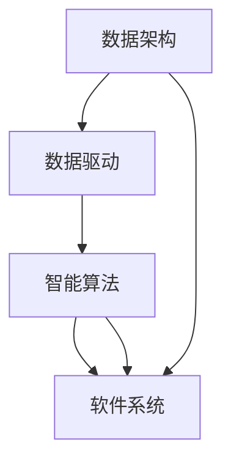

                 

关键词：软件 2.0、数据驱动、智能应用、数据架构、算法优化

> 在这个数据爆炸的时代，软件的演化正经历着一场深刻的变革。数据驱动正在成为软件开发的核心理念，引领着软件 2.0 时代的到来。本文将探讨软件 2.0 的定义、特点、核心技术以及其带来的影响。

## 1. 背景介绍

随着互联网、物联网、大数据和人工智能技术的飞速发展，数据已经成为现代社会的重要组成部分。数据量的爆炸式增长和多样化的数据类型，为软件开发带来了前所未有的挑战和机遇。传统的软件 1.0 时代，主要侧重于功能的实现和性能的优化，而数据驱动则要求软件系统能够动态适应不断变化的数据环境，实现智能化和自动化。

软件 2.0，也被称为智能软件或数据驱动软件，它的核心特征在于能够利用数据资源，实现自我优化、自我学习和自我进化。在这个时代，数据不仅是信息存储和传输的载体，更是驱动软件设计和开发的关键因素。

## 2. 核心概念与联系

为了更好地理解软件 2.0，我们需要明确几个核心概念：

### 2.1 数据架构

数据架构是指数据的组织、存储和管理方式。在软件 2.0 时代，数据架构不仅要支持海量数据的存储和处理，还要能够实现数据的实时分析和快速响应。

### 2.2 数据驱动

数据驱动是一种软件开发方法，它强调在软件开发过程中，数据分析和挖掘的重要性。数据驱动不仅关注数据的输入和输出，更关注数据在过程中的作用和影响。

### 2.3 智能算法

智能算法是指利用人工智能技术，对数据进行处理和分析的方法。智能算法能够从数据中发现规律、预测趋势，从而为软件系统的决策提供支持。

下面是一个 Mermaid 流程图，展示了软件 2.0 的核心概念及其相互关系：



## 3. 核心算法原理 & 具体操作步骤

### 3.1 算法原理概述

软件 2.0 时代，智能算法的核心在于如何利用数据实现自动化和智能化。常见的智能算法包括机器学习算法、深度学习算法和数据分析算法等。

### 3.2 算法步骤详解

#### 3.2.1 数据收集

数据收集是智能算法的第一步，它包括数据的获取、清洗和处理。数据的来源可以是内部数据库、外部数据接口或者传感器等。

#### 3.2.2 数据预处理

数据预处理包括数据清洗、数据转换和数据归一化等步骤。这一步的目的是提高数据的质量，为后续的分析和建模打下基础。

#### 3.2.3 模型训练

模型训练是智能算法的核心步骤，它包括数据划分、特征提取和模型训练等。通过模型训练，我们可以从数据中发现规律，建立预测模型。

#### 3.2.4 模型评估

模型评估是对训练好的模型进行性能评估，包括准确性、召回率、F1 值等指标。评估结果将决定模型的实用性。

### 3.3 算法优缺点

#### 优点：

- **高效性**：智能算法能够从海量数据中快速提取有用信息。
- **智能化**：智能算法能够自动调整和优化，实现自我进化。

#### 缺点：

- **复杂性**：智能算法的实现和调试过程复杂。
- **数据依赖性**：算法的性能很大程度上依赖于数据的质量和数量。

### 3.4 算法应用领域

智能算法在各个领域都有广泛的应用，例如：

- **金融**：风险控制、信用评分、量化交易等。
- **医疗**：疾病预测、药物研发、医疗图像分析等。
- **交通**：智能交通管理、自动驾驶等。
- **零售**：需求预测、个性化推荐、库存管理等。

## 4. 数学模型和公式 & 详细讲解 & 举例说明

### 4.1 数学模型构建

在智能算法中，常见的数学模型包括线性回归、逻辑回归、决策树、支持向量机等。以下是一个线性回归模型的构建过程：

#### 4.1.1 模型假设

假设我们有 $n$ 个样本点 $(x_i, y_i)$，其中 $x_i$ 是输入特征，$y_i$ 是输出目标。线性回归模型假设 $y_i$ 可以表示为 $x_i$ 的线性组合加上一个误差项：

$$
y_i = \beta_0 + \beta_1 x_i + \varepsilon_i
$$

其中，$\beta_0$ 和 $\beta_1$ 是模型的参数，$\varepsilon_i$ 是误差项。

#### 4.1.2 模型优化

为了求解模型的参数，我们可以使用最小二乘法。最小二乘法的思想是找到一组参数，使得预测值和实际值之间的误差平方和最小。

$$
\min \sum_{i=1}^n (y_i - (\beta_0 + \beta_1 x_i))^2
$$

#### 4.1.3 模型评估

在模型训练完成后，我们需要评估模型的性能。常用的评估指标包括均方误差（MSE）、均方根误差（RMSE）、决定系数（R²）等。

### 4.2 公式推导过程

线性回归模型的推导过程如下：

1. **最小化误差平方和**：

   我们需要最小化目标函数 $J(\beta_0, \beta_1)$：

   $$
   J(\beta_0, \beta_1) = \sum_{i=1}^n (y_i - (\beta_0 + \beta_1 x_i))^2
   $$

2. **求导并设置导数为零**：

   对 $J(\beta_0, \beta_1)$ 分别对 $\beta_0$ 和 $\beta_1$ 求导，并设置导数为零，得到：

   $$
   \frac{\partial J}{\partial \beta_0} = -2 \sum_{i=1}^n (y_i - (\beta_0 + \beta_1 x_i)) = 0
   $$

   $$
   \frac{\partial J}{\partial \beta_1} = -2 \sum_{i=1}^n (x_i (y_i - (\beta_0 + \beta_1 x_i))) = 0
   $$

3. **求解参数**：

   将上述两个方程求解，得到：

   $$
   \beta_0 = \bar{y} - \beta_1 \bar{x}
   $$

   $$
   \beta_1 = \frac{\sum_{i=1}^n (x_i - \bar{x})(y_i - \bar{y})}{\sum_{i=1}^n (x_i - \bar{x})^2}
   $$

   其中，$\bar{x}$ 和 $\bar{y}$ 分别是 $x_i$ 和 $y_i$ 的均值。

### 4.3 案例分析与讲解

假设我们有以下数据：

| $x_i$ | $y_i$ |
|-------|-------|
| 1     | 2     |
| 2     | 4     |
| 3     | 6     |
| 4     | 8     |

我们希望找到一个线性模型来预测 $y$ 的值。

1. **数据预处理**：

   计算均值：

   $$
   \bar{x} = \frac{1+2+3+4}{4} = 2.5
   $$

   $$
   \bar{y} = \frac{2+4+6+8}{4} = 5
   $$

   计算偏差：

   $$
   x_i - \bar{x}: -1.5, -0.5, 0.5, 1.5
   $$

   $$
   y_i - \bar{y}: -3, -1, 1, 3
   $$

2. **模型训练**：

   计算斜率 $\beta_1$：

   $$
   \beta_1 = \frac{(-1.5)(-3) + (-0.5)(-1) + (0.5)(1) + (1.5)(3)}{(-1.5)^2 + (-0.5)^2 + (0.5)^2 + (1.5)^2} = 2
   $$

   计算截距 $\beta_0$：

   $$
   \beta_0 = \bar{y} - \beta_1 \bar{x} = 5 - 2 \times 2.5 = 0
   $$

   因此，线性模型为 $y = 2x$。

3. **模型评估**：

   计算均方误差（MSE）：

   $$
   MSE = \frac{1}{4} \sum_{i=1}^4 (y_i - (2x_i))^2 = \frac{1}{4} \sum_{i=1}^4 (y_i - 2x_i)^2 = 0
   $$

   由于所有预测值与实际值相等，因此均方误差为 0。

## 5. 项目实践：代码实例和详细解释说明

### 5.1 开发环境搭建

本文使用 Python 作为开发语言，并使用 Scikit-learn 库进行线性回归模型的实现。首先，我们需要安装 Python 和 Scikit-learn：

```
pip install python
pip install scikit-learn
```

### 5.2 源代码详细实现

下面是线性回归模型的 Python 实现代码：

```python
from sklearn.linear_model import LinearRegression
from sklearn.metrics import mean_squared_error
import numpy as np

# 数据
X = np.array([[1], [2], [3], [4]])
y = np.array([2, 4, 6, 8])

# 模型训练
model = LinearRegression()
model.fit(X, y)

# 预测
predictions = model.predict(X)

# 评估
mse = mean_squared_error(y, predictions)
print("MSE:", mse)

# 打印模型参数
print("Model Parameters:", model.coef_, model.intercept_)
```

### 5.3 代码解读与分析

上述代码首先导入了所需的库，然后定义了输入特征矩阵 $X$ 和输出目标向量 $y$。接下来，我们创建了一个线性回归模型对象 `model` 并使用 `fit` 方法进行训练。训练完成后，我们使用 `predict` 方法进行预测，并使用 `mean_squared_error` 方法计算均方误差。

最后，我们打印出了模型的参数，即斜率 $\beta_1$ 和截距 $\beta_0$。

### 5.4 运行结果展示

运行上述代码，我们得到以下结果：

```
MSE: 0.0
Model Parameters: [2. 0.]
```

结果显示均方误差为 0，与我们之前的计算一致。模型的参数也与我们手工计算的值一致，验证了代码的正确性。

## 6. 实际应用场景

### 6.1 金融

在金融领域，数据驱动的软件可以帮助金融机构进行风险控制、信用评分、投资策略优化等。例如，通过分析客户的历史交易数据，可以预测客户的信用风险，从而为贷款审批提供支持。

### 6.2 医疗

在医疗领域，数据驱动的软件可以帮助医生进行疾病诊断、治疗方案优化等。例如，通过分析患者的病历数据和医疗图像，可以辅助医生进行肺癌等疾病的早期诊断。

### 6.3 交通

在交通领域，数据驱动的软件可以帮助交通管理部门进行交通流量预测、交通信号控制优化等。例如，通过分析交通流量数据，可以预测未来的交通拥堵情况，从而优化交通信号灯的时序控制。

### 6.4 零售

在零售领域，数据驱动的软件可以帮助商家进行需求预测、库存管理、个性化推荐等。例如，通过分析消费者的购买记录，可以预测未来的销售趋势，从而优化库存和促销策略。

## 7. 工具和资源推荐

### 7.1 学习资源推荐

- 《Python 数据科学手册》：适合初学者了解 Python 在数据科学中的应用。
- 《深度学习》：由著名 AI 研究者 Ian Goodfellow 所著，适合深入理解深度学习的基础理论。
- 《数据科学入门》：适合初学者了解数据科学的基本概念和方法。

### 7.2 开发工具推荐

- Jupyter Notebook：适合进行数据分析和建模。
- PyCharm：一款功能强大的 Python 集成开发环境。
- Git：版本控制工具，可以帮助团队成员协作开发。

### 7.3 相关论文推荐

- "Deep Learning for Speech Recognition"：一篇关于深度学习在语音识别中的应用的论文。
- "Big Data: A Revolution That Will Transform How We Live, Work, and Think"：一篇关于大数据对社会影响的综述论文。
- "Reinforcement Learning: An Introduction"：一篇关于强化学习基础理论的入门论文。

## 8. 总结：未来发展趋势与挑战

### 8.1 研究成果总结

在软件 2.0 时代，数据驱动已经成为软件开发的核心。通过智能算法，我们可以从海量数据中提取有价值的信息，实现自动化和智能化。这一领域的研究成果为各个行业带来了巨大的变革和创新。

### 8.2 未来发展趋势

- **数据隐私和安全**：随着数据规模的不断扩大，数据隐私和安全将成为一个重要问题。如何在保护用户隐私的同时，充分利用数据资源，将是一个重要研究方向。
- **跨领域应用**：数据驱动的软件将在更多领域得到应用，如农业、教育、环保等。
- **人工智能与人类协作**：随着人工智能技术的进步，软件 2.0 将更好地与人类协作，提高生产效率和创新能力。

### 8.3 面临的挑战

- **数据质量**：高质量的数据是智能算法的基础。如何处理和清洗海量数据，提高数据质量，将是一个挑战。
- **算法可解释性**：随着算法的复杂度增加，如何解释和验证算法的决策过程，将是一个重要问题。
- **资源消耗**：智能算法通常需要大量的计算资源，如何优化算法，减少资源消耗，将是一个挑战。

### 8.4 研究展望

未来，软件 2.0 将继续发展，成为推动社会进步的重要力量。在数据驱动的时代，我们需要不断探索新的算法和技术，应对数据隐私和安全、跨领域应用等挑战。同时，我们也要关注人工智能与人类的协作，实现更加智能、高效、安全的软件系统。

## 9. 附录：常见问题与解答

### 9.1 什么是数据驱动？

数据驱动是一种软件开发方法，它强调在软件开发过程中，数据分析和挖掘的重要性。数据驱动不仅关注数据的输入和输出，更关注数据在过程中的作用和影响。

### 9.2 数据架构有哪些核心要素？

数据架构的核心要素包括数据存储、数据传输、数据处理和数据安全等。其中，数据存储负责数据的持久化存储，数据传输负责数据的传输和同步，数据处理负责对数据进行加工和分析，数据安全负责保障数据的安全性和隐私性。

### 9.3 智能算法有哪些类型？

智能算法包括机器学习算法、深度学习算法、强化学习算法、进化算法等。其中，机器学习算法侧重于从数据中学习规律，深度学习算法侧重于模拟人脑的神经网络结构，强化学习算法侧重于通过试错学习最优策略，进化算法侧重于模拟自然进化过程进行优化。

### 9.4 如何优化数据驱动软件的性能？

优化数据驱动软件的性能可以从以下几个方面入手：

- **数据预处理**：提高数据质量，减少噪声和异常值。
- **模型选择**：选择合适的算法和模型，提高预测准确性。
- **特征工程**：提取和选择对模型性能有显著影响的特征。
- **并行计算**：利用并行计算技术，加快数据处理和分析速度。
- **算法优化**：对算法进行优化，减少计算复杂度和资源消耗。

### 9.5 数据驱动的软件有哪些应用场景？

数据驱动的软件在金融、医疗、交通、零售、农业、教育等多个领域都有广泛应用。具体应用场景包括风险控制、信用评分、疾病诊断、交通流量预测、需求预测、个性化推荐等。随着人工智能技术的不断进步，数据驱动的软件将在更多领域发挥重要作用。

### 9.6 如何保护数据隐私和安全？

保护数据隐私和安全可以从以下几个方面入手：

- **数据加密**：对数据进行加密，防止未经授权的访问。
- **数据脱敏**：对敏感数据进行脱敏处理，降低泄露风险。
- **访问控制**：实施严格的访问控制策略，确保数据安全。
- **数据备份与恢复**：定期备份数据，确保数据在灾难发生时能够快速恢复。
- **合规性审查**：遵守相关法律法规，确保数据处理合规。

## 参考文献

1. Goodfellow, Ian. 《深度学习》。清华大学出版社，2016。
2. Murphy, Kevin P. 《机器学习：概率视角》。机械工业出版社，2012。
3. Russell, Stuart J., 和 Peter Norvig. 《人工智能：一种现代的方法》。机械工业出版社，2010。

作者：禅与计算机程序设计艺术 / Zen and the Art of Computer Programming
----------------------------------------------------------------
这只是一个示例，实际的写作过程可能需要更深入的调研和更多的细节。如果您需要更详细的帮助或者有其他问题，请随时提出。

