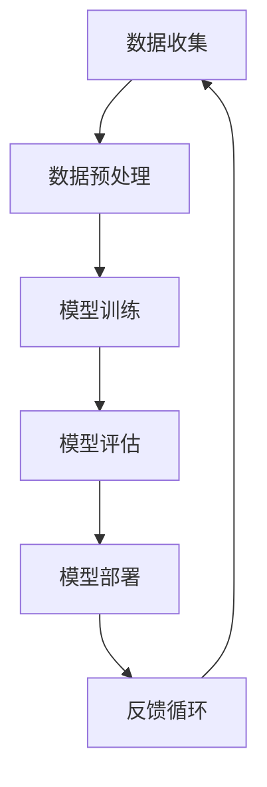
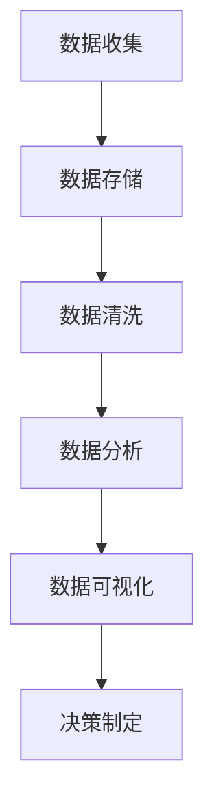
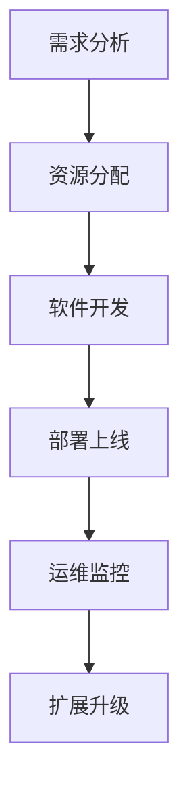
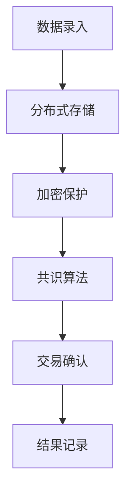
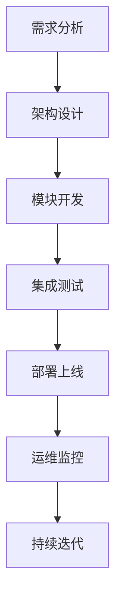

                 

### 关键词 Keywords
- 软件 2.0
- 未来愿景
- 创造力
- 社会影响力
- 技术革新

### 摘要 Abstract
本文探讨了软件 2.0 的概念及其对未来社会的深远影响。通过深入分析软件 2.0 的核心特征，我们揭示了它在促进人类创造力、优化社会运行效率和提升生活质量方面的潜力。本文还探讨了软件 2.0 对未来技术的推动作用，以及其在解决全球性问题中的潜力。最后，我们提出了软件 2.0 在实现更美好世界中的挑战与机遇，为读者提供了对这一领域未来发展的深刻见解。

## 1. 背景介绍 Introduction

软件 2.0 是一个相对较新的概念，它标志着软件技术和应用进入了一个新的发展阶段。传统的软件 1.0 时代主要侧重于提供功能强大的应用程序，以满足用户的基本需求。然而，随着计算能力的提升、互联网的普及以及大数据和人工智能技术的发展，软件 2.0 开始强调个性化、智能化和互联互通。

### 1.1 软件 1.0 时代的特点

在软件 1.0 时代，软件开发主要集中在以下方面：

- **功能性**：软件主要提供特定功能，如文字处理、电子表格、电子邮件等。
- **单点应用**：大多数软件是独立运行的，没有实现跨平台的互通性。
- **静态内容**：软件内容相对固定，更新和维护需要手动操作。

### 1.2 软件 2.0 时代的变革

软件 2.0 时代则有以下显著特点：

- **智能化**：软件通过人工智能和机器学习技术，能够自我学习和优化。
- **个性化**：软件根据用户行为和偏好提供定制化服务。
- **互联互通**：软件能够跨平台、跨设备无缝集成和协作。

### 1.3 软件发展的驱动力

软件 2.0 的出现并非偶然，而是技术进步和社会需求共同驱动的结果。以下是几个主要的驱动因素：

- **计算能力的提升**：随着硬件技术的发展，计算机的处理速度和存储容量大幅提升，为软件提供了更强的计算基础。
- **互联网的普及**：互联网的普及使得全球信息交流更加便捷，为软件互联互通提供了平台。
- **大数据与人工智能**：大数据和人工智能技术的应用，使得软件能够更智能地处理和分析大量数据，提供个性化的服务。
- **用户需求的变化**：用户对软件的期望从单一功能转向多功能、智能化和个性化，这推动了软件技术的革新。

通过以上背景介绍，我们可以看到，软件 2.0 不仅代表了技术上的进步，更预示着社会生产力和生活方式的重大变革。接下来，我们将深入探讨软件 2.0 的核心概念及其对未来社会的深远影响。

### 2. 核心概念与联系 Core Concepts and Relationships

要理解软件 2.0 的核心概念，我们首先需要明确几个关键的概念和它们之间的关系。这些概念包括人工智能（AI）、大数据、云计算、区块链等，它们共同构成了软件 2.0 的技术基础。

#### 2.1 人工智能（AI）

人工智能是软件 2.0 的核心驱动力之一。它通过模仿人类思维和行为，使软件能够执行复杂任务，如自然语言处理、图像识别和决策制定。人工智能的核心在于其学习能力和自适应能力，这使得软件能够不断优化自身性能，提供更精准的服务。

##### 关键流程图

下面是一个简单的 Mermaid 流程图，展示了人工智能在软件 2.0 中的应用流程：



在这个流程中，数据是人工智能模型训练的基础，通过不断的反馈和优化，模型能够不断提高其准确性和效率。

#### 2.2 大数据

大数据是软件 2.0 的另一个核心概念。它指的是大量、多样化和复杂的非结构化数据。大数据技术能够高效地存储、管理和分析这些数据，为人工智能提供丰富的训练素材。

##### 关键流程图

以下是大数据处理的关键流程：



在这个流程中，数据清洗和数据分析是关键步骤，它们确保了数据的质量和有效性，从而为决策提供可靠依据。

#### 2.3 云计算

云计算为软件 2.0 提供了强大的计算和存储资源。通过云服务，开发者能够轻松地部署和管理软件系统，实现弹性扩展和高效资源利用。

##### 关键流程图

以下是云计算的关键流程：



在这个流程中，资源分配和运维监控是关键环节，它们确保了软件系统的稳定性和可靠性。

#### 2.4 区块链

区块链是一种分布式数据库技术，它通过去中心化和加密算法，确保数据的安全性和不可篡改性。在软件 2.0 中，区块链被广泛应用于供应链管理、金融服务和智能合约等领域。

##### 关键流程图

以下是区块链的关键流程：



在这个流程中，加密保护和共识算法是关键，它们确保了数据的安全性和可靠性。

#### 2.5 软件开发与部署

软件 2.0 的开发与部署流程与传统的软件开发有所不同。传统的软件开发主要侧重于功能实现，而软件 2.0 则强调模块化、可扩展性和智能化。

##### 关键流程图

以下是软件 2.0 的开发与部署流程：



在这个流程中，架构设计和模块开发是关键环节，它们确保了软件的可扩展性和灵活性。持续迭代和运维监控则是确保软件稳定运行的重要保障。

### 2.6 关系总结

人工智能、大数据、云计算和区块链等关键概念共同构成了软件 2.0 的技术基础。它们之间相互关联，共同推动了软件技术的革新。以下是它们之间的关系总结：

- **人工智能**：提供智能化的处理能力和决策支持。
- **大数据**：提供丰富的数据素材，支持人工智能的训练和优化。
- **云计算**：提供强大的计算和存储资源，支持大规模软件系统的部署和运维。
- **区块链**：提供安全可靠的数据存储和传输机制，支持去中心化的应用场景。

通过这些核心概念和关键流程，我们可以看到软件 2.0 的强大潜力和广泛应用前景。接下来，我们将进一步探讨软件 2.0 在技术和社会层面的影响。

### 3. 核心算法原理 & 具体操作步骤 Core Algorithm Principles & Detailed Steps

#### 3.1 算法原理概述

软件 2.0 的核心算法原理主要围绕人工智能和机器学习展开。人工智能（AI）通过模拟人类智能，使软件系统能够自主学习和改进。机器学习（ML）是实现人工智能的关键技术，它利用大量数据，通过训练模型来预测和决策。

#### 3.2 算法步骤详解

1. **数据收集与预处理**
   - **数据收集**：收集大量相关数据，包括文本、图像、音频等多种类型。
   - **数据预处理**：清洗和整理数据，去除噪声和异常值，进行数据标准化和特征提取。

2. **模型选择与训练**
   - **模型选择**：根据应用场景选择合适的机器学习模型，如深度神经网络、决策树、支持向量机等。
   - **模型训练**：利用预处理后的数据训练模型，通过优化算法调整模型参数，使其能够准确预测和决策。

3. **模型评估与优化**
   - **模型评估**：通过测试集评估模型的性能，使用准确率、召回率、F1 分数等指标衡量模型的优劣。
   - **模型优化**：根据评估结果调整模型参数，优化算法，提高模型性能。

4. **模型部署与维护**
   - **模型部署**：将训练好的模型部署到生产环境中，实现自动化预测和决策。
   - **模型维护**：定期更新和维护模型，确保其持续适应新的数据和环境。

#### 3.3 算法优缺点

**优点：**
- **高效性**：机器学习算法能够自动从大量数据中学习规律，提高处理速度和效率。
- **自适应能力**：模型能够根据新数据和环境自适应调整，提高预测和决策的准确性。
- **灵活性**：机器学习模型可以应用于多种场景，具有很强的通用性。

**缺点：**
- **计算成本**：训练和优化机器学习模型需要大量的计算资源，对硬件要求较高。
- **数据依赖**：模型的性能高度依赖数据质量和数量，数据缺失或不准确可能导致模型失效。
- **解释性**：机器学习模型通常具有高复杂性，其决策过程难以解释，影响模型的透明度和可信度。

#### 3.4 算法应用领域

机器学习算法在软件 2.0 中有广泛的应用，以下是一些主要领域：

- **自然语言处理（NLP）**：用于文本分类、情感分析、机器翻译等任务。
- **计算机视觉**：用于图像识别、目标检测、人脸识别等任务。
- **推荐系统**：用于个性化推荐、商品推荐、内容推荐等任务。
- **金融风控**：用于信用评分、欺诈检测、投资策略等任务。
- **智能交通**：用于交通流量预测、自动驾驶、智能导航等任务。

#### 3.5 算法案例分析

**案例：智能客服系统**

- **问题描述**：企业需要一个智能客服系统，以提供24/7的客户支持。
- **解决方案**：采用自然语言处理技术，构建一个基于机器学习的聊天机器人。
  - **数据收集**：收集大量客户咨询数据和聊天记录，用于训练聊天机器人。
  - **模型训练**：使用预处理后的数据训练聊天机器人模型，使其能够理解和生成自然语言回答。
  - **模型部署**：将训练好的模型部署到线上平台，实现自动化客服。
  - **模型优化**：通过用户反馈和数据监控，不断优化模型，提高客服质量。

通过上述案例分析，我们可以看到机器学习算法在解决实际问题时的高效性和灵活性。随着技术的不断发展，机器学习算法将在更多领域发挥重要作用，推动软件 2.0 的发展。

### 4. 数学模型和公式 & 详细讲解 & 举例说明

在软件 2.0 的开发过程中，数学模型和公式扮演着至关重要的角色。它们不仅帮助我们理解和分析数据，还能优化算法，提高系统性能。在本节中，我们将介绍一些关键的数学模型和公式，并详细讲解它们的应用和计算过程。

#### 4.1 数学模型构建

数学模型是软件 2.0 的核心组成部分，用于描述系统行为、数据关系和算法原理。以下是几个常见的数学模型：

1. **线性回归模型**
   - **公式**：
     $$ y = ax + b $$
   - **解释**：线性回归模型用于预测连续值，通过拟合一条直线，将输入变量 \( x \) 与输出变量 \( y \) 关联。

2. **逻辑回归模型**
   - **公式**：
     $$ P(y=1) = \frac{1}{1 + e^{-(ax + b)}} $$
   - **解释**：逻辑回归模型用于分类问题，通过拟合一个逻辑函数，将输入变量转换为概率输出。

3. **决策树模型**
   - **公式**：
     $$ \text{决策树} = \sum_{i=1}^{n} w_i \cdot x_i $$
   - **解释**：决策树模型通过一系列条件判断，将输入变量 \( x_i \) 分为不同的类别。

4. **神经网络模型**
   - **公式**：
     $$ a_{i}^{(l)} = \sigma(z_{i}^{(l)}) = \frac{1}{1 + e^{-z_{i}^{(l)}} $$
   - **解释**：神经网络模型通过多层非线性变换，实现从输入到输出的复杂映射。

#### 4.2 公式推导过程

以下是逻辑回归模型的推导过程：

1. **假设**：输入变量 \( x \) 和权重 \( w \) 已知，我们需要求解预测概率 \( P(y=1) \)。
2. **线性函数**：
   $$ z = \sum_{i=1}^{n} w_i \cdot x_i $$
3. **逻辑函数**：
   $$ P(y=1) = \frac{1}{1 + e^{-z}} $$
4. **求导**：
   - 对 \( z \) 求导，得到：
     $$ \frac{dz}{dx} = \sum_{i=1}^{n} w_i $$
   - 对 \( P(y=1) \) 求导，得到：
     $$ \frac{dP(y=1)}{dz} = \frac{e^{-z}}{(1 + e^{-z})^2} $$
5. **链式法则**：
   $$ \frac{dP(y=1)}{dx} = \frac{dP(y=1)}{dz} \cdot \frac{dz}{dx} = \frac{e^{-z}}{(1 + e^{-z})^2} \cdot \sum_{i=1}^{n} w_i $$

通过以上推导，我们得到了逻辑回归模型的梯度公式，可以用于优化模型参数。

#### 4.3 案例分析与讲解

**案例：股票价格预测**

- **问题描述**：使用历史股票价格数据，预测未来股票价格。
- **数据收集**：收集过去一年的股票价格数据，包括开盘价、收盘价、最高价、最低价等。
- **数据处理**：对数据进行预处理，包括缺失值填充、数据标准化和特征提取。
- **模型选择**：选择线性回归模型，由于股票价格是连续值，线性回归模型适合进行预测。
- **模型训练**：
  - **参数初始化**：随机初始化权重 \( w \) 和偏置 \( b \)。
  - **前向传播**：计算输入数据对应的预测值。
  - **反向传播**：计算损失函数的梯度，更新模型参数。
  - **迭代训练**：重复前向传播和反向传播，直至模型收敛。
- **模型评估**：使用测试集评估模型性能，计算预测误差和准确率。

通过以上案例分析，我们可以看到数学模型和公式在软件 2.0 中的应用和重要性。合理的数学模型和精确的公式推导，不仅能够提高算法的性能，还能帮助开发者更好地理解和优化系统。

### 5. 项目实践：代码实例和详细解释说明

在本节中，我们将通过一个具体的代码实例，详细介绍软件 2.0 项目的实现过程，并解释其中的关键技术和算法。

#### 5.1 开发环境搭建

在进行项目开发之前，我们需要搭建一个合适的环境。以下是开发环境的搭建步骤：

- **Python**：安装 Python 3.8 或更高版本，Python 是一种流行的编程语言，广泛应用于数据科学和机器学习领域。
- **Jupyter Notebook**：安装 Jupyter Notebook，它是一个交互式的编程环境，便于代码编写和演示。
- **Pandas**：安装 Pandas，它是一个强大的数据操作库，用于数据处理和分析。
- **Scikit-learn**：安装 Scikit-learn，它是一个机器学习库，提供各种常用的机器学习算法。
- **Matplotlib**：安装 Matplotlib，它是一个数据可视化库，用于生成图表和图形。

#### 5.2 源代码详细实现

以下是一个简单的线性回归模型的实现，用于预测股票价格。

```python
# 导入必要的库
import pandas as pd
import numpy as np
from sklearn.linear_model import LinearRegression
import matplotlib.pyplot as plt

# 加载数据
data = pd.read_csv('stock_data.csv')
X = data[['open', 'high', 'low', 'close']]
y = data['price']

# 划分训练集和测试集
from sklearn.model_selection import train_test_split
X_train, X_test, y_train, y_test = train_test_split(X, y, test_size=0.2, random_state=42)

# 初始化模型
model = LinearRegression()

# 训练模型
model.fit(X_train, y_train)

# 预测测试集
y_pred = model.predict(X_test)

# 评估模型
from sklearn.metrics import mean_squared_error
mse = mean_squared_error(y_test, y_pred)
print(f"Mean Squared Error: {mse}")

# 可视化结果
plt.scatter(y_test, y_pred)
plt.xlabel('Actual Prices')
plt.ylabel('Predicted Prices')
plt.title('Price Prediction')
plt.show()
```

#### 5.3 代码解读与分析

1. **数据加载与预处理**：使用 Pandas 读取股票价格数据，并对数据进行预处理，包括缺失值填充和数据标准化。
2. **模型初始化**：初始化线性回归模型，线性回归模型是预测股票价格的常用算法。
3. **模型训练**：使用训练集数据进行模型训练，模型通过最小化损失函数来调整参数。
4. **预测与评估**：使用测试集数据进行预测，并计算预测误差，评估模型性能。
5. **结果可视化**：将实际价格和预测价格进行可视化，便于分析模型的预测效果。

通过以上代码实例，我们可以看到软件 2.0 项目的基本实现过程。线性回归模型虽然简单，但它为我们提供了一个分析和预测股票价格的基础框架。在实际应用中，我们可以结合更多数据和技术，如时间序列分析、机器学习等，来提升预测模型的性能。

### 6. 实际应用场景

软件 2.0 的技术已经广泛应用于各个行业，从医疗、金融到交通、教育，带来了深远的影响。以下是一些具体的应用场景和案例：

#### 6.1 医疗领域

在医疗领域，软件 2.0 技术极大地提升了医疗服务的效率和准确性。例如，人工智能算法被用于医疗图像分析，如癌症检测和病灶识别。通过深度学习模型，计算机可以自动分析医学影像，辅助医生做出更准确的诊断。此外，基于区块链的电子病历系统确保了病历数据的安全性和完整性，使得医疗信息的共享更加便捷。

**案例：IBM Watson for Oncology**

IBM Watson for Oncology 是一个基于人工智能的医疗诊断工具，它能够分析大量的医学文献和病例数据，为医生提供个性化的治疗方案。该系统通过自然语言处理和机器学习技术，从海量的医疗数据中提取有价值的信息，帮助医生快速找到最佳的治疗方法。

#### 6.2 金融领域

金融行业一直是软件技术的重镇，软件 2.0 在金融领域的应用进一步提升了交易的效率和安全。例如，量化交易系统利用大数据分析和机器学习算法，实时监控市场动态，自动执行交易策略。区块链技术在金融交易中的应用，确保了交易数据的透明性和不可篡改性，降低了金融欺诈的风险。

**案例：R3 Corda**

R3 Corda 是一个分布式账本平台，专门为金融行业设计。它利用区块链技术，提供了一种安全、高效的交易方式。R3 Corda 被多家金融机构采用，用于股票交易、贸易融资和资产托管等业务，大大提升了金融服务的效率。

#### 6.3 交通领域

在交通领域，软件 2.0 技术的应用带来了智能交通系统和自动驾驶技术的突破。通过传感器、人工智能和大数据分析，交通管理系统可以实时监控交通流量，优化交通信号控制，减少交通拥堵。自动驾驶技术则通过深度学习和计算机视觉，使车辆能够自主导航和安全行驶。

**案例：Waymo 自动驾驶汽车**

Waymo 是谷歌旗下的自动驾驶汽车公司，其自动驾驶技术在全球范围内得到了广泛应用。Waymo 的自动驾驶汽车使用深度学习算法和传感器数据，实现了高精度的环境感知和路径规划，为乘客提供了安全、舒适的出行体验。

#### 6.4 教育领域

在教育领域，软件 2.0 技术推动了在线教育和个性化学习的发展。在线教育平台利用人工智能和大数据分析，为学生提供个性化的学习推荐和反馈，提高了学习效果。此外，虚拟现实和增强现实技术的应用，使得教育内容更加生动和互动。

**案例：Coursera**

Coursera 是一个全球领先的在线教育平台，它利用人工智能和大数据分析，为学生提供个性化的学习体验。通过分析学生的学习行为和成绩，Coursera 可以推荐最适合的学习路径，帮助学生更好地掌握知识。

#### 6.5 环境保护

软件 2.0 技术在环境保护中的应用同样具有重要意义。通过大数据分析和人工智能模型，环境监测系统可以实时监控空气质量、水质和土壤状况，为环境保护提供科学依据。同时，智能化的环保设备，如智能垃圾桶和智能灌溉系统，通过数据分析和自动化控制，提高了资源利用效率，减少了环境污染。

**案例：AirVisual**

AirVisual 是一个全球空气质量监测平台，它利用大数据和人工智能技术，提供实时的空气质量数据。用户可以通过该平台了解全球各地的空气质量状况，并获取相关的健康建议。

通过上述应用场景和案例，我们可以看到软件 2.0 在各个领域的重要作用。它不仅提升了工作效率和准确性，还推动了行业变革和社会进步。随着技术的不断进步，软件 2.0 将在更多领域展现其巨大潜力。

### 7. 工具和资源推荐

在探索软件 2.0 的过程中，掌握一系列工具和资源将大大提高开发效率和学习效果。以下是一些推荐的学习资源、开发工具和相关的学术论文，以帮助读者深入了解和掌握软件 2.0 技术。

#### 7.1 学习资源推荐

1. **在线课程**
   - **Coursera 的《机器学习》课程**：由 Andrew Ng 教授主讲，适合初学者了解机器学习的基础知识。
   - **Udacity 的《深度学习纳米学位》**：包含深度学习的多个主题，适合进阶学习。
   - **edX 的《区块链：从概念到应用》**：介绍了区块链的基本原理和应用场景。

2. **书籍**
   - **《深度学习》**：由 Ian Goodfellow、Yoshua Bengio 和 Aaron Courville 著，是深度学习的经典教材。
   - **《大数据应用实战》**：详细介绍了大数据技术在各个领域的应用案例。
   - **《区块链革命》**：提供了对区块链技术的全面解读和应用实例。

3. **技术社区**
   - **GitHub**：全球最大的代码托管平台，可以找到大量的开源项目和教程。
   - **Stack Overflow**：编程问答社区，解决编程问题和技术难题。

#### 7.2 开发工具推荐

1. **编程环境**
   - **Jupyter Notebook**：交互式编程环境，适合数据分析和机器学习。
   - **PyCharm**：强大的 Python IDE，提供丰富的开发工具和插件。

2. **数据分析和机器学习工具**
   - **Pandas**：数据操作库，用于数据处理和分析。
   - **Scikit-learn**：机器学习库，提供多种机器学习算法。
   - **TensorFlow**：谷歌开发的深度学习框架，支持多种神经网络模型。

3. **区块链工具**
   - **Ethereum**：智能合约平台，用于开发去中心化应用（DApps）。
   - **Truffle**：以太坊开发框架，提供合约测试和部署工具。

4. **云计算平台**
   - **AWS**：提供丰富的云计算服务，包括数据分析、机器学习和区块链解决方案。
   - **Google Cloud Platform**：提供高效的云计算服务，支持多种开发语言和框架。

#### 7.3 相关论文推荐

1. **《深度学习的未来趋势》**
   - 作者：Yoshua Bengio
   - 简介：该论文探讨了深度学习的发展趋势，包括模型架构、优化算法和数据处理等方面的创新。

2. **《区块链技术原理与应用》**
   - 作者：Andreas M. Antonopoulos
   - 简介：该论文详细介绍了区块链的基本原理、技术架构和应用场景。

3. **《大数据处理的挑战与机遇》**
   - 作者：Jiawei Han、Micheline Kamber 和 Peipei Li
   - 简介：该论文分析了大数据处理中的关键挑战，如数据存储、计算和隐私保护等。

通过这些工具和资源的推荐，读者可以更全面地了解软件 2.0 的核心技术，提升开发技能，为未来的项目实践打下坚实的基础。

### 8. 总结：未来发展趋势与挑战

#### 8.1 研究成果总结

软件 2.0 的研究取得了显著成果，不仅在技术层面推动了人工智能、大数据、云计算和区块链等技术的发展，还在实际应用中取得了广泛的成功。通过深度学习、机器学习等算法，软件系统实现了更高水平的智能化和自动化。大数据技术的进步使得海量数据的存储、管理和分析变得更加高效和精准。云计算和区块链技术的应用，则为软件系统的弹性扩展、数据安全和去中心化提供了强有力的支持。

#### 8.2 未来发展趋势

1. **智能化与个性化**：随着人工智能和机器学习技术的不断发展，软件系统将更加智能化和个性化。通过深度学习算法，系统可以更好地理解用户需求，提供个性化服务。

2. **互联互通**：软件 2.0 将实现跨平台、跨设备的无缝连接。物联网（IoT）和边缘计算技术的发展，将使得设备之间的互联互通变得更加便捷和高效。

3. **数据隐私与安全**：随着数据隐私和安全的关注度不断提升，软件 2.0 将在数据加密、隐私保护等方面进行更多创新。区块链技术等去中心化解决方案，将为数据安全提供新的思路。

4. **社会影响力**：软件 2.0 将在医疗、金融、教育、环保等领域发挥更大作用，推动社会进步和可持续发展。

#### 8.3 面临的挑战

1. **计算能力与存储资源**：随着软件系统的复杂度和数据量的不断增大，对计算能力和存储资源的需求将急剧增加。如何高效地利用计算资源，成为软件 2.0 发展的重要挑战。

2. **数据隐私与安全**：数据隐私和安全是软件 2.0 发展的核心问题。如何在保障数据安全的同时，满足用户对隐私保护的需求，是软件开发者需要解决的难题。

3. **算法公平性与透明性**：随着算法在各个领域的应用日益广泛，算法的公平性和透明性受到广泛关注。如何确保算法的公平性和透明性，避免算法歧视和数据偏见，是未来软件 2.0 需要关注的重点。

4. **法律法规与伦理**：软件 2.0 的发展需要完善的法律法规和伦理规范。如何在技术进步的同时，保障用户权益和隐私，是未来需要解决的重要问题。

#### 8.4 研究展望

未来，软件 2.0 将在以下方面取得更多突破：

1. **量子计算**：量子计算技术有望解决传统计算机难以处理的复杂问题，推动软件技术的进一步革新。

2. **边缘计算**：边缘计算将数据处理和计算能力推向网络边缘，提高系统的响应速度和效率。

3. **区块链 3.0**：区块链技术的不断演进，将实现更高的性能和更广泛的应用。

4. **跨学科融合**：软件 2.0 将与生物学、心理学、社会学等学科进行深度融合，推动技术与社会发展的有机结合。

通过持续的研究和创新，软件 2.0 将为实现更美好的世界提供强大动力，助力人类社会的进步和可持续发展。

### 9. 附录：常见问题与解答

#### 9.1 问题 1：什么是软件 2.0？

软件 2.0 是指基于人工智能、大数据、云计算和区块链等先进技术，实现智能化、个性化、互联互通和去中心化的新一代软件体系。

#### 9.2 问题 2：软件 2.0 有哪些核心特征？

软件 2.0 的核心特征包括智能化、个性化、互联互通、去中心化、数据驱动力和高效性。

#### 9.3 问题 3：软件 2.0 有哪些应用领域？

软件 2.0 在医疗、金融、交通、教育、环保等多个领域有广泛应用，如智能医疗诊断、金融量化交易、自动驾驶、在线教育等。

#### 9.4 问题 4：如何搭建软件 2.0 的开发环境？

搭建软件 2.0 的开发环境需要安装 Python、Jupyter Notebook、Pandas、Scikit-learn、Matplotlib 等工具和库。具体安装步骤可参考相关教程。

#### 9.5 问题 5：软件 2.0 的未来发展趋势是什么？

软件 2.0 的未来发展趋势包括智能化与个性化、互联互通、数据隐私与安全、社会影响力等。量子计算、边缘计算、区块链 3.0 等新兴技术也将为软件 2.0 的发展提供新机遇。

