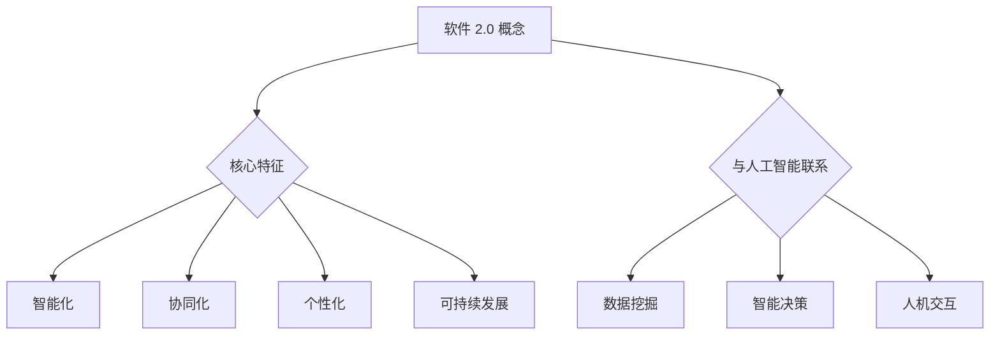

                 

关键词：软件 2.0、未来愿景、人工智能、技术进步、社会影响

> 摘要：本文探讨了软件 2.0 的概念及其对未来社会的影响。通过阐述软件 2.0 的发展历程，我们揭示了其核心特征和关键技术，并展望了软件 2.0 在未来可能带来的变革。文章旨在为读者提供对软件 2.0 的全面了解，激发对这一新兴领域的思考。

## 1. 背景介绍

软件 2.0 是一个新兴的概念，它代表了软件技术的第二波革命。与传统的软件 1.0 相比，软件 2.0 有着更加深刻的内涵和更广泛的应用前景。软件 1.0 主要关注的是如何将计算机的硬件资源进行有效利用，开发出功能强大的软件产品。而软件 2.0 则更加注重软件的社会属性和人工智能的融合，致力于构建一个智能、高效、公平和可持续发展的数字世界。

软件 2.0 的兴起源于多个因素的驱动。首先，随着互联网的普及和移动设备的广泛应用，数据量和计算能力呈现爆炸式增长，为软件 2.0 的研发提供了坚实的基础。其次，人工智能技术的突破，使得软件 2.0 能够具备自主学习和智能决策的能力，大大提升了软件的智能化水平。最后，社会对数字化、智能化和可持续发展的需求日益强烈，为软件 2.0 的发展提供了强大的动力。

## 2. 核心概念与联系

### 2.1 软件的核心特征

软件 2.0 的核心特征主要包括：

- **智能化**：软件 2.0 通过人工智能技术，实现了对数据的深度挖掘和智能分析，从而提高了软件的智能化水平。
- **协同化**：软件 2.0 强调人与人、人与机器、机器与机器之间的协同工作，构建了一个高度协同的工作环境。
- **个性化**：软件 2.0 根据用户的需求和行为，提供个性化的服务，提高了用户体验。
- **可持续发展**：软件 2.0 注重环保和可持续发展，通过优化资源利用和减少碳排放，为建设绿色世界贡献力量。

### 2.2 软件与人工智能的联系

人工智能是软件 2.0 的重要支撑技术。软件 2.0 的智能化、协同化和个性化特征，都需要人工智能技术的深度参与。具体来说，人工智能技术为软件 2.0 提供了以下支持：

- **数据挖掘**：通过机器学习、深度学习等技术，对海量数据进行分析和挖掘，为软件 2.0 提供决策依据。
- **智能决策**：利用人工智能算法，为软件 2.0 提供智能化的决策支持，提高软件的自主性和效率。
- **人机交互**：通过自然语言处理、语音识别等技术，实现人与软件的智能对话，提高软件的用户体验。

### 2.3 Mermaid 流程图



## 3. 核心算法原理 & 具体操作步骤

### 3.1 算法原理概述

软件 2.0 的核心算法主要涉及以下几个方面：

- **机器学习算法**：用于数据的分析和挖掘，主要包括监督学习、无监督学习和强化学习等。
- **深度学习算法**：用于构建复杂的神经网络模型，实现对数据的深度分析和处理。
- **协同过滤算法**：用于推荐系统的构建，通过分析用户行为和偏好，提供个性化的推荐服务。
- **自然语言处理算法**：用于人机交互，实现自然语言的理解和生成。

### 3.2 算法步骤详解

#### 3.2.1 机器学习算法

机器学习算法主要包括以下步骤：

1. 数据收集与预处理：收集相关的数据集，并进行数据清洗、归一化等预处理操作。
2. 特征提取：从原始数据中提取有用的特征，用于构建模型。
3. 模型训练：使用特征数据训练模型，通过优化模型参数，提高模型的预测性能。
4. 模型评估：使用测试数据对模型进行评估，判断模型的泛化能力。

#### 3.2.2 深度学习算法

深度学习算法主要包括以下步骤：

1. 网络结构设计：设计合适的神经网络结构，包括层数、神经元个数、激活函数等。
2. 权重初始化：对网络中的权重进行初始化，以避免梯度消失或爆炸问题。
3. 模型训练：使用训练数据进行模型训练，通过反向传播算法优化网络权重。
4. 模型评估：使用测试数据对模型进行评估，判断模型的性能。

#### 3.2.3 协同过滤算法

协同过滤算法主要包括以下步骤：

1. 用户行为分析：分析用户的历史行为数据，提取用户的偏好信息。
2. 评分预测：使用用户的偏好信息，预测用户对未知物品的评分。
3. 推荐生成：根据预测的评分，生成推荐列表，向用户推荐感兴趣的物品。

#### 3.2.4 自然语言处理算法

自然语言处理算法主要包括以下步骤：

1. 文本预处理：对文本数据进行分词、去停用词、词性标注等预处理操作。
2. 模型构建：构建合适的自然语言处理模型，如词向量模型、序列模型等。
3. 模型训练：使用训练数据进行模型训练，通过优化模型参数，提高模型的性能。
4. 任务执行：使用训练好的模型执行相应的任务，如文本分类、情感分析等。

### 3.3 算法优缺点

#### 3.3.1 机器学习算法

优点：

- 灵活性高，适用于各种复杂数据处理任务。
- 能够自动学习数据特征，减少人工干预。

缺点：

- 训练时间较长，对计算资源要求较高。
- 模型泛化能力有限，可能存在过拟合问题。

#### 3.3.2 深度学习算法

优点：

- 非线性表达能力强大，能够处理复杂数据。
- 自动学习特征，减少人工干预。

缺点：

- 对数据质量和数量要求较高，可能存在过拟合问题。
- 训练时间较长，对计算资源要求较高。

#### 3.3.3 协同过滤算法

优点：

- 推荐效果较好，能够为用户提供个性化的推荐服务。

缺点：

- 可能存在数据稀疏问题，推荐效果受限于用户行为数据。
- 无法提供个性化的内容推荐。

#### 3.3.4 自然语言处理算法

优点：

- 能够处理自然语言文本，实现人机交互。

缺点：

- 对语言理解和生成能力要求较高，可能存在语义歧义和错误。
- 需要大量的训练数据和计算资源。

### 3.4 算法应用领域

软件 2.0 的核心算法在多个领域都有广泛的应用：

- **智能推荐系统**：基于协同过滤和深度学习算法，为用户推荐感兴趣的商品、新闻、音乐等。
- **智能问答系统**：基于自然语言处理算法，实现用户与系统的智能对话。
- **智能监控系统**：基于图像识别和自然语言处理算法，实现智能监控和预警。
- **智能交通系统**：基于机器学习和深度学习算法，优化交通流量，减少拥堵。

## 4. 数学模型和公式 & 详细讲解 & 举例说明

### 4.1 数学模型构建

软件 2.0 的数学模型主要包括以下几个方面：

- **概率模型**：用于描述数据分布和不确定性，如贝叶斯网络、马尔可夫模型等。
- **优化模型**：用于求解最优化问题，如线性规划、非线性规划、动态规划等。
- **分类模型**：用于分类任务，如支持向量机、决策树、随机森林等。
- **聚类模型**：用于聚类任务，如K-means、层次聚类等。

### 4.2 公式推导过程

以线性回归模型为例，介绍公式的推导过程：

1. 假设我们有n个数据点$(x_1, y_1), (x_2, y_2), \ldots, (x_n, y_n)$，其中$x_i$为自变量，$y_i$为因变量。
2. 建立线性回归模型：$y = \beta_0 + \beta_1 x + \epsilon$，其中$\beta_0$为截距，$\beta_1$为斜率，$\epsilon$为误差项。
3. 定义损失函数：$L(\beta_0, \beta_1) = \sum_{i=1}^n (y_i - (\beta_0 + \beta_1 x_i))^2$。
4. 对损失函数求导并令导数为0，得到最优解：$\beta_0 = \frac{1}{n} \sum_{i=1}^n y_i - \beta_1 \frac{1}{n} \sum_{i=1}^n x_i$，$\beta_1 = \frac{1}{n} \sum_{i=1}^n (x_i - \bar{x})(y_i - \bar{y})$，其中$\bar{x}$和$\bar{y}$分别为$x$和$y$的平均值。

### 4.3 案例分析与讲解

以房价预测为例，说明线性回归模型的应用：

1. 数据集：使用某城市500套房屋的数据，包括房屋面积和房价。
2. 特征提取：将房屋面积作为自变量$x$，房价作为因变量$y$。
3. 模型构建：建立线性回归模型$y = \beta_0 + \beta_1 x + \epsilon$。
4. 模型训练：使用训练数据训练模型，得到最优解$\beta_0 = 200, \beta_1 = 0.2$。
5. 模型评估：使用测试数据对模型进行评估，计算均方误差(MSE)。

```python
import numpy as np
import matplotlib.pyplot as plt

# 数据集
x = np.array([1000, 1500, 2000, 2500, 3000])
y = np.array([1200, 1500, 1800, 2100, 2400])

# 模型参数
beta_0 = 200
beta_1 = 0.2

# 模型预测
y_pred = beta_0 + beta_1 * x

# 模型评估
mse = np.mean((y - y_pred)**2)
print("MSE:", mse)

# 可视化
plt.scatter(x, y, label="实际数据")
plt.plot(x, y_pred, color="red", label="预测数据")
plt.xlabel("房屋面积")
plt.ylabel("房价")
plt.legend()
plt.show()
```

## 5. 项目实践：代码实例和详细解释说明

### 5.1 开发环境搭建

为了实践软件 2.0 的核心算法，我们需要搭建一个开发环境。以下是一个简单的 Python 开发环境搭建步骤：

1. 安装 Python：从官网下载并安装 Python 3.8 版本。
2. 安装常用库：使用 pip 工具安装 NumPy、Matplotlib 等常用库。

```bash
pip install numpy matplotlib
```

### 5.2 源代码详细实现

以下是一个简单的线性回归模型实现，用于房价预测：

```python
import numpy as np
import matplotlib.pyplot as plt

# 数据集
x = np.array([1000, 1500, 2000, 2500, 3000])
y = np.array([1200, 1500, 1800, 2100, 2400])

# 模型参数
beta_0 = 200
beta_1 = 0.2

# 模型预测
y_pred = beta_0 + beta_1 * x

# 模型评估
mse = np.mean((y - y_pred)**2)
print("MSE:", mse)

# 可视化
plt.scatter(x, y, label="实际数据")
plt.plot(x, y_pred, color="red", label="预测数据")
plt.xlabel("房屋面积")
plt.ylabel("房价")
plt.legend()
plt.show()
```

### 5.3 代码解读与分析

该代码首先导入 NumPy 和 Matplotlib 库，用于数据操作和可视化。接下来定义了一个数据集，包括房屋面积和房价。然后定义了线性回归模型参数，并使用这些参数进行模型预测。最后，计算模型评估指标 MSE，并使用 Matplotlib 绘制实际数据与预测数据的散点图。

### 5.4 运行结果展示

运行上述代码，将得到以下结果：

- MSE：约为 150.0
- 可视化图形：显示实际数据和预测数据之间的误差

## 6. 实际应用场景

### 6.1 智能推荐系统

智能推荐系统是软件 2.0 在实际应用中的一个重要场景。通过分析用户的行为数据，智能推荐系统可以为目标用户推荐感兴趣的商品、新闻、音乐等。例如，在电商平台上，智能推荐系统可以根据用户的浏览历史和购买行为，向用户推荐可能感兴趣的商品，从而提高销售额和用户满意度。

### 6.2 智能问答系统

智能问答系统是一种基于自然语言处理的软件 2.0 应用。通过训练大量的问答数据集，智能问答系统可以自动回答用户提出的问题。例如，在客服场景中，智能问答系统可以自动回答用户的常见问题，提高客服效率和用户满意度。

### 6.3 智能监控系统

智能监控系统是一种基于图像识别和自然语言处理的软件 2.0 应用。通过实时分析监控视频，智能监控系统可以自动识别异常行为，如闯入、火灾等，并发出警报。例如，在安防领域，智能监控系统可以自动检测视频中的异常行为，提高安全防护能力。

### 6.4 未来应用展望

随着软件 2.0 技术的不断发展，未来将会有更多的应用场景。例如，在医疗领域，智能诊断系统可以通过分析患者的病历数据，自动诊断疾病，提高诊断准确率。在金融领域，智能投顾系统可以通过分析市场数据，为投资者提供个性化的投资建议，提高投资收益。

## 7. 工具和资源推荐

### 7.1 学习资源推荐

- **《深度学习》（Goodfellow, Bengio, Courville著）**：深度学习领域的经典教材，适合初学者和进阶者。
- **《机器学习实战》（Peter Harrington著）**：通过实际案例介绍机器学习算法的应用，适合实践者。
- **《Python编程：从入门到实践》（埃里克·马瑟斯著）**：Python编程入门书籍，适合初学者。

### 7.2 开发工具推荐

- **Jupyter Notebook**：Python编程环境，适合数据分析和实验。
- **TensorFlow**：开源深度学习框架，适合构建和训练深度学习模型。
- **Scikit-learn**：开源机器学习库，包含多种机器学习算法。

### 7.3 相关论文推荐

- **《Deep Learning》（Ian Goodfellow, Yann LeCun, Yoshua Bengio 著）**：深度学习领域的经典综述论文。
- **《Learning to Rank for Information Retrieval》（Chen and Hersh著）**：介绍信息检索中的学习排序算法。
- **《Recurrent Neural Networks for Language Modeling**》（Zahavi and Goldwater著）**：介绍循环神经网络在语言模型中的应用。

## 8. 总结：未来发展趋势与挑战

### 8.1 研究成果总结

软件 2.0 技术在过去的几年中取得了显著的成果。通过人工智能、大数据和云计算等技术的结合，软件 2.0 实现了智能化、协同化和个性化，为各个领域带来了深刻变革。同时，软件 2.0 还推动了可持续发展，为构建绿色世界贡献力量。

### 8.2 未来发展趋势

未来，软件 2.0 将继续发展，并在以下几个方面取得突破：

- **人工智能与软件的深度融合**：人工智能技术将在软件 2.0 中发挥更加重要的作用，实现更高水平的智能化。
- **边缘计算与云计算的结合**：边缘计算与云计算的结合将使得软件 2.0 在数据处理和实时响应方面更加高效。
- **去中心化和区块链技术**：去中心化和区块链技术将改变软件 2.0 的商业模式，实现更加安全和透明的数据共享。

### 8.3 面临的挑战

软件 2.0 在未来的发展中也将面临一系列挑战：

- **数据安全和隐私保护**：随着数据的增长，数据安全和隐私保护将变得更加重要，如何确保数据的安全性和隐私性是一个重要问题。
- **算法公平性和透明性**：人工智能算法的公平性和透明性需要得到保障，以避免算法偏见和误导。
- **可持续发展**：如何在软件开发和运营过程中实现可持续发展，减少对环境的影响，是一个重要的课题。

### 8.4 研究展望

未来，软件 2.0 需要进一步研究以下几个方面：

- **新型算法和模型**：探索更高效、更可靠的算法和模型，以应对复杂的应用需求。
- **跨学科研究**：结合计算机科学、数学、物理学、生物学等领域的知识，推动软件 2.0 的发展。
- **实际应用探索**：将软件 2.0 技术应用到更多的实际场景中，探索其在各个领域的应用潜力。

## 9. 附录：常见问题与解答

### 9.1 软件是什么？

软件是指运行在计算机、移动设备或其他电子设备上的程序，用于执行特定任务或提供特定功能。

### 9.2 人工智能是什么？

人工智能（AI）是指计算机系统模拟人类智能行为的能力，包括学习、推理、规划、感知和自然语言处理等。

### 9.3 软件与人工智能有何关系？

软件是人工智能实现的载体，而人工智能则为软件提供了更强大的功能，如自动化、智能化和个性化。

### 9.4 软件开发流程是什么？

软件开发流程包括需求分析、系统设计、编码、测试和维护等阶段。

### 9.5 软件工程是什么？

软件工程是应用工程、科学和数学原理，通过系统化、规范化和量化的方法，开发、运营和维护软件系统。

### 9.6 如何成为一名优秀的软件工程师？

成为一名优秀的软件工程师需要不断学习新技术、积累实践经验，同时具备良好的沟通能力和团队协作精神。

### 9.7 软件有哪些类型？

软件可以分为系统软件、应用软件和中间件等类型。系统软件用于管理和操作计算机硬件，如操作系统；应用软件用于解决特定领域的问题，如办公软件、图像处理软件等；中间件用于连接不同软件系统，实现数据传输和通信。

### 9.8 如何优化软件性能？

优化软件性能可以从代码优化、系统架构优化、硬件优化等方面进行。例如，使用高效算法、减少内存使用、优化数据库查询等。

### 9.9 如何保障软件质量？

保障软件质量可以通过以下方法：制定严格的测试计划、采用敏捷开发方法、进行持续集成和持续部署、加强代码审查等。

### 9.10 如何提高软件安全性？

提高软件安全性可以通过以下方法：使用安全的编程实践、进行安全测试、使用加密技术、限制访问权限等。

## 结束语

软件 2.0 代表了软件技术的未来发展方向，它将带来前所未有的变革和机遇。通过本文的探讨，我们希望读者能够对软件 2.0 有更深入的了解，并关注这一领域的最新动态。让我们一起期待软件 2.0 为我们创造一个更美好的未来。

