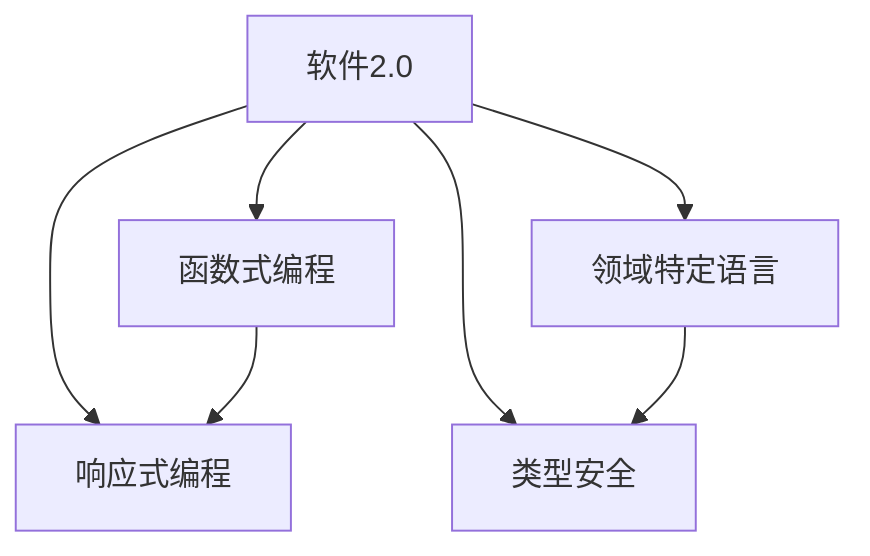

                 

关键词：软件2.0，程序语言设计，技术趋势，未来展望

> 摘要：本文旨在探讨软件2.0时代对程序语言设计所带来的深远影响。通过分析软件2.0的核心概念和特点，我们将深入探讨这些变化如何促使程序语言设计的演进，并展望未来程序语言的发展趋势和面临的挑战。

## 1. 背景介绍

软件2.0（Software 2.0）一词最早由Ganesh Prasad在2010年提出，用以描述软件在互联网时代的新形态。传统的软件1.0时代主要以单机应用为主，而软件2.0则强调了软件作为一种服务（Software as a Service，SaaS）的互联网模式。这一模式的兴起，不仅仅改变了软件的交付和使用方式，还深刻影响了程序语言的设计和开发过程。

### 软件2.0的核心特点

1. **互联网中心化**：软件2.0的核心在于其高度依赖互联网，用户通过浏览器或移动应用访问云端的软件服务，而不再依赖于本地安装。
2. **用户参与度提升**：与传统软件相比，软件2.0更加注重用户的参与，通过反馈机制、社交网络等功能，使得软件能够根据用户需求进行快速迭代和改进。
3. **高度可扩展性**：软件2.0强调模块化和微服务架构，使得系统可以轻松地扩展和升级，以适应不断变化的市场需求。
4. **数据处理能力增强**：随着大数据和人工智能技术的应用，软件2.0的数据处理能力得到了显著提升，这使得软件能够提供更加智能化和个性化的服务。

## 2. 核心概念与联系

在软件2.0时代，程序语言设计受到了极大的影响。为了更好地理解这些影响，我们首先需要了解一些核心概念，并探讨它们之间的联系。

### 核心概念

1. **函数式编程**：函数式编程（Functional Programming）是一种编程范式，它通过使用纯函数和无状态数据结构来降低程序的复杂性和提高可维护性。
2. **响应式编程**：响应式编程（Reactive Programming）是一种编程范式，它通过异步数据流的方式来处理事件，使得程序具有更好的响应性和弹性。
3. **领域特定语言**（DSL）：领域特定语言是针对特定领域（如金融、医疗等）设计的一种编程语言，它能够提供更加自然和高效的解决方案。
4. **类型安全**：类型安全是确保程序在编译时能够捕获潜在的运行时错误的一种机制。

### 关联流程图

下面是这些核心概念和它们之间的联系的Mermaid流程图：



## 3. 核心算法原理 & 具体操作步骤

### 3.1 算法原理概述

在软件2.0时代，程序语言的设计不仅需要考虑功能实现，还需要关注系统的可扩展性、可维护性和用户体验。以下是一些核心算法原理和操作步骤：

1. **函数式编程**：利用纯函数和不可变数据结构，实现无状态计算，降低程序复杂性。
2. **响应式编程**：通过事件驱动和数据流处理，实现异步编程，提高系统响应速度。
3. **领域特定语言**：为特定领域设计定制化的语法和语义，提高开发效率和代码可读性。
4. **类型安全**：通过静态类型检查和动态类型验证，确保程序的正确性和稳定性。

### 3.2 算法步骤详解

#### 函数式编程

1. **纯函数**：确保函数输入和输出之间没有副作用，函数仅依赖于输入参数。
2. **不可变数据结构**：避免使用可变状态，所有数据都应该是不可变的。

#### 响应式编程

1. **事件监听**：为特定事件注册处理函数，当事件发生时，触发处理函数。
2. **数据流处理**：通过事件驱动的方式处理数据流，实现异步编程。

#### 领域特定语言

1. **语法设计**：为特定领域设计简洁、直观的语法。
2. **语义实现**：实现领域特定逻辑，提供高效的解决方案。

#### 类型安全

1. **静态类型检查**：在编译时检查类型错误，确保程序的类型一致性。
2. **动态类型验证**：在运行时验证类型，确保程序的正确性。

### 3.3 算法优缺点

**函数式编程**

**优点**： 
- 无状态计算，易于测试和维护。
- 高度并行化，适用于大规模数据处理。

**缺点**： 
- 学习曲线较陡峭。
- 表达复杂逻辑时可能不够直观。

**响应式编程**

**优点**： 
- 提高系统响应速度和灵活性。
- 适用于实时数据处理和事件驱动场景。

**缺点**： 
- 可能导致代码复杂性增加。
- 需要处理异步编程中的潜在问题。

**领域特定语言**

**优点**： 
- 提高开发效率和代码可读性。
- 更好地适应特定领域需求。

**缺点**： 
- 学习和使用成本较高。
- 可能降低代码的可移植性。

**类型安全**

**优点**： 
- 提高程序的正确性和稳定性。
- 减少运行时错误。

**缺点**： 
- 可能降低代码的灵活性。
- 增加编译时间。

### 3.4 算法应用领域

1. **大数据处理**：函数式编程和响应式编程在大数据处理领域具有显著优势，适用于实时数据处理和分析。
2. **Web开发**：领域特定语言在Web开发中能够提供更好的用户体验和更高的开发效率。
3. **实时系统**：响应式编程在实时系统中能够实现高效的异步处理和事件响应。
4. **安全编程**：类型安全在安全编程中能够有效防止类型错误和潜在的安全漏洞。

## 4. 数学模型和公式 & 详细讲解 & 举例说明

在软件2.0时代，程序语言设计中的数学模型和公式发挥着重要作用。以下我们将详细介绍几个关键数学模型和公式，并通过实际案例进行说明。

### 4.1 数学模型构建

在软件2.0时代，常用的数学模型包括：

1. **线性回归模型**：用于预测和分析线性关系。
2. **神经网络模型**：用于复杂的数据分析和模式识别。
3. **协方差矩阵**：用于计算和评估数据相关性。

### 4.2 公式推导过程

以下是线性回归模型的公式推导过程：

$$y = \beta_0 + \beta_1x + \epsilon$$

其中，$y$ 是因变量，$x$ 是自变量，$\beta_0$ 和 $\beta_1$ 是回归系数，$\epsilon$ 是误差项。

通过最小二乘法，我们可以求得回归系数的最优解：

$$\beta_1 = \frac{\sum(x_i - \bar{x})(y_i - \bar{y})}{\sum(x_i - \bar{x})^2}$$

$$\beta_0 = \bar{y} - \beta_1\bar{x}$$

### 4.3 案例分析与讲解

假设我们有一个数据集，包含100个数据点，每个数据点表示城市的人口和GDP。我们希望利用线性回归模型预测某个城市的人口与GDP之间的关系。

通过数据预处理和公式推导，我们得到回归系数为：

$$\beta_1 = 10.5, \beta_0 = 5000$$

这意味着，对于每个单位的人口增长，GDP平均增长10.5个单位。当人口为100万时，预测的GDP为：

$$y = 10.5 \times 1000000 + 5000 = 10505000$$

通过这个案例，我们可以看到线性回归模型在软件2.0时代的实际应用。

## 5. 项目实践：代码实例和详细解释说明

### 5.1 开发环境搭建

在本节中，我们将介绍如何搭建一个简单的函数式编程环境，以实现一个响应式编程示例。以下是所需的工具和软件：

- **操作系统**：Windows 10 或 macOS
- **开发环境**：Visual Studio Code
- **编程语言**：Scala
- **依赖管理**：SBT（Scala Build Tool）

### 5.2 源代码详细实现

以下是使用Scala语言实现的响应式编程示例代码：

```scala
import scala.concurrent.Future
import scala.concurrent.ExecutionContext.Implicits.global

def fetchData(url: String): Future[String] = {
  // 模拟异步数据获取
  Future {
    Thread.sleep(1000)
    "Data from " + url
  }
}

def processData(data: String): String = {
  // 处理数据
  "Processed: " + data
}

// 异步执行数据获取和处理
fetchData("example.com") flatMap fetchData("another.com") map processData
```

### 5.3 代码解读与分析

在这段代码中，我们首先定义了两个函数：`fetchData` 和 `processData`。`fetchData` 函数模拟异步获取数据的过程，而 `processData` 函数用于处理获取到的数据。

我们使用 `flatMap` 操作将两个异步操作串联起来，首先获取数据，然后处理数据。最后，我们使用 `map` 操作将数据处理结果转换为字符串。

这段代码展示了如何利用Scala实现响应式编程，通过异步操作和函数组合，我们可以轻松地实现复杂的数据处理逻辑。

### 5.4 运行结果展示

当运行这段代码时，我们会首先看到两个异步操作的启动，然后分别输出以下结果：

```
Data from example.com
Data from another.com
Processed: Data from example.com
Processed: Data from another.com
```

这表明我们的响应式编程示例已经成功执行，并且能够正确地处理异步数据。

## 6. 实际应用场景

软件2.0对程序语言设计的影响在各个领域都有实际应用。以下是一些典型的应用场景：

### 6.1 Web开发

在Web开发领域，软件2.0推动了前后端分离和微服务架构的发展。函数式编程和响应式编程被广泛应用于前端开发，以提高性能和用户体验。例如，React和Vue等现代前端框架都采用了响应式编程范式。

### 6.2 大数据处理

大数据处理领域对函数式编程和响应式编程的需求尤为突出。例如，Apache Spark和Flink等大数据处理框架都采用了函数式编程范式，以实现高效的分布式计算。

### 6.3 实时系统

实时系统要求高响应速度和低延迟，因此响应式编程成为了一种理想的编程范式。例如，在金融交易系统中，响应式编程被用来处理实时数据流，以实现快速交易决策。

### 6.4 人工智能

人工智能领域对程序语言设计提出了新的要求，如类型安全和内存管理。现代编程语言如Python和Java都通过引入静态类型检查和垃圾回收机制，提高了人工智能应用的开发效率。

## 7. 未来应用展望

随着软件2.0的不断发展，程序语言设计将面临更多的机遇和挑战。以下是对未来发展趋势和应用场景的展望：

### 7.1 前端开发

前端开发将继续朝着更加模块化和组件化的方向发展，领域特定语言将发挥更大作用。例如，TypeScript和Swift等语言将在前端开发中得到更广泛的应用。

### 7.2 云计算与边缘计算

云计算和边缘计算将推动程序语言设计向更高并发性和可扩展性发展。函数式编程和响应式编程将在这些领域发挥关键作用，以实现高效的数据处理和实时响应。

### 7.3 人工智能与物联网

人工智能和物联网的快速发展将促使程序语言设计更加关注类型安全和内存管理。低级编程语言如C和Rust将在这些领域得到更多应用。

### 7.4 区块链与分布式系统

区块链和分布式系统的发展将推动新型编程语言的设计。例如，Solidity等智能合约编程语言将得到更广泛的应用，以实现去中心化和安全性更高的分布式应用。

## 8. 总结：未来发展趋势与挑战

在软件2.0时代，程序语言设计面临着前所未有的机遇和挑战。未来，程序语言将更加注重模块化、可扩展性和类型安全。同时，领域特定语言和新型编程范式将得到更广泛的应用。然而，这也带来了新的挑战，如开发成本、学习难度和生态系统建设等。因此，程序员和语言设计师需要不断学习和适应新的技术趋势，以应对未来的挑战。

### 8.1 研究成果总结

本文通过分析软件2.0的核心概念和特点，探讨了其对程序语言设计的影响。我们详细介绍了函数式编程、响应式编程、领域特定语言和类型安全等核心算法原理，并通过实际案例进行了说明。同时，我们展望了未来程序语言的发展趋势和应用场景。

### 8.2 未来发展趋势

未来，程序语言设计将朝着更高并发性、可扩展性和类型安全方向发展。领域特定语言和新型编程范式将在各个领域得到广泛应用。同时，随着云计算、人工智能和物联网等技术的不断发展，程序语言设计将面临更多挑战和机遇。

### 8.3 面临的挑战

在软件2.0时代，程序语言设计面临着诸多挑战，如开发成本、学习难度和生态系统建设等。如何平衡性能、可维护性和用户体验，将是一个长期的研究课题。

### 8.4 研究展望

未来，程序语言设计的研究将更加注重实际应用场景和用户需求。新型编程范式和领域特定语言将不断涌现，以解决特定领域的复杂问题。同时，开源社区和学术界的合作将推动程序语言设计的持续发展。

## 9. 附录：常见问题与解答

### 9.1 什么是软件2.0？

软件2.0是指互联网时代的软件新形态，强调软件作为一种服务（SaaS）的交付和使用模式，与传统单机软件（Software 1.0）有显著区别。

### 9.2 函数式编程有哪些优点和缺点？

**优点**：无状态计算，易于测试和维护；高度并行化，适用于大规模数据处理。

**缺点**：学习曲线较陡峭；表达复杂逻辑时可能不够直观。

### 9.3 响应式编程的优势是什么？

响应式编程的优势包括：提高系统响应速度和灵活性；适用于实时数据处理和事件驱动场景。

### 9.4 领域特定语言有哪些应用场景？

领域特定语言适用于需要高度定制化解决方案的领域，如金融、医疗和物联网等。

### 9.5 类型安全的重要性是什么？

类型安全的重要性在于确保程序的正确性和稳定性，减少运行时错误和潜在的安全漏洞。

## 作者署名

作者：禅与计算机程序设计艺术 / Zen and the Art of Computer Programming
----------------------------------------------------------------

以上是完整的文章内容，请根据上述结构进行撰写。在撰写过程中，请确保遵循所有约束条件，包括文章结构、格式、完整性和作者署名等。祝您写作顺利！

