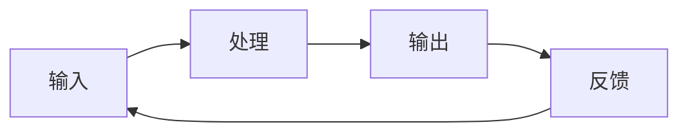

                 

关键词：输入处理输出反馈逻辑，系统设计，软件工程，计算机科学，人工智能，算法，数据处理，用户体验，系统性能

> 摘要：本文深入探讨了输入、处理、输出和反馈在计算机科学和软件工程中的逻辑关系。通过分析输入与处理之间的交互方式，处理与输出之间的映射关系，以及输出与反馈之间的反馈循环，本文揭示了这些逻辑环节在系统设计和优化中的关键作用。文章旨在帮助开发者更好地理解并应用这些基本原理，以提高系统性能和用户体验。

## 1. 背景介绍

输入、处理、输出和反馈是计算机系统和软件工程中最基础、最重要的概念之一。这些概念贯穿于整个计算机科学领域，无论是在硬件设计、软件架构还是算法开发中，都有着不可替代的作用。输入代表了系统接收外部信息的方式；处理则是系统对输入信息进行加工和转换的过程；输出则是处理结果的呈现，可以是人机交互的界面，也可以是进一步的数据处理结果。而反馈则是用户或系统对输出的响应，它为输入和处理提供了重要的评价和指导。

在计算机科学中，良好的输入、处理、输出和反馈逻辑是构建高效、稳定、可靠系统的关键。这一逻辑关系不仅仅存在于单个软件应用中，也广泛应用于复杂系统，如操作系统、数据库系统、云计算平台等。通过深入研究这些逻辑环节，我们可以更好地理解和优化系统性能，提高用户体验，并推动计算机科学的发展。

本文将分为以下几个部分：首先，我们将介绍输入、处理、输出和反馈的基本概念及其在计算机系统中的作用；然后，我们将详细讨论这些环节之间的交互方式和关系；接着，我们会探讨在不同应用领域中这些逻辑的实现方法；最后，我们将展望这些基本概念在未来的发展趋势和面临的挑战。

## 2. 核心概念与联系

在讨论输入、处理、输出和反馈的逻辑之前，我们需要首先明确这些核心概念的基本原理和相互之间的关系。

### 2.1 输入

输入是系统从外部环境接收信息的过程。在计算机科学中，输入可以来自各种不同的来源，包括用户界面、传感器、网络接口等。输入的形式可以是有形的，如键盘输入、鼠标点击；也可以是无形的，如传感器采集的环境数据、网络传输的数据包。

输入的质量直接影响到系统的处理效率和准确性。因此，在设计系统时，输入的有效性和安全性是至关重要的。例如，在用户界面设计上，我们需要确保输入的便捷性和易用性；在网络接口方面，我们需要考虑数据传输的稳定性和安全性。

### 2.2 输出

输出是系统将处理后的信息呈现给用户或外部环境的过程。输出可以以多种形式呈现，包括显示在屏幕上的图形用户界面（GUI）、打印在纸张上的文档、通过网络传输的数据等。

输出的形式和内容取决于系统的具体用途。例如，在计算器应用程序中，输出可能是计算结果；在医疗诊断系统中，输出可能是诊断报告；在智能家居系统中，输出可能是设备的控制指令。

### 2.3 处理

处理是系统对输入信息进行加工和转换的过程。处理通常包括数据的解析、计算、排序、过滤等操作。处理的目的是将输入转化为有用的信息，以便输出或进一步的输入。

处理的质量和效率是系统性能的关键因素。在数据处理过程中，算法的选择和优化至关重要。例如，在图像处理中，我们可以使用不同的滤波算法来去除图像噪声；在数据分析中，我们可以使用不同的统计方法来提取数据特征。

### 2.4 反馈

反馈是用户或系统对输出的响应。它提供了对输出质量和系统性能的评价，并为输入和处理提供了指导。反馈可以是积极的，如用户对输出的满意反馈；也可以是消极的，如系统错误或性能瓶颈的提示。

有效的反馈机制能够帮助系统不断改进和优化。例如，在人工智能系统中，反馈用于调整机器学习模型的参数，以提高预测准确性；在用户界面设计中，用户反馈用于优化界面的布局和交互，以提高用户体验。

### 2.5 输入、处理、输出和反馈之间的关系

输入、处理、输出和反馈之间存在着紧密的交互关系。输入是整个流程的起点，决定了系统处理的初始状态；处理是核心环节，决定了输入的加工质量和效率；输出是结果呈现，反映了处理的成果；而反馈则是对输出的评价和指导，影响着整个系统的迭代和优化。

这一关系可以用一个简单的闭环系统来表示：



在这个闭环系统中，每个环节都相互影响，形成一个动态调整和优化的过程。通过不断的输入、处理、输出和反馈，系统逐渐达到一个稳定和高效的状态。

## 3. 核心算法原理 & 具体操作步骤

### 3.1 算法原理概述

在深入探讨输入、处理、输出和反馈的逻辑关系后，我们将具体介绍一种核心算法原理，以展示其在实际应用中的操作步骤和实现方法。本文将以常见的排序算法——快速排序（Quick Sort）为例，详细说明其原理和操作步骤。

### 3.2 算法步骤详解

快速排序是一种高效的排序算法，其基本思想是通过一趟排序将待排序的记录分割成独立的两部分，其中一部分记录的关键字均比另一部分的关键字小，然后再按此方法对这两部分记录进行排序，以达到整个序列有序。

快速排序的具体操作步骤如下：

1. **选择基准元素**：在数组中选择一个基准元素，通常选择数组的第一个元素作为基准。
2. **分区操作**：将数组分成两部分，一部分是比基准元素小的元素，另一部分是比基准元素大的元素。这一步完成后，基准元素将位于数组的中间位置。
3. **递归排序**：分别对基准元素左边和右边的两部分递归执行快速排序。

### 3.3 算法优缺点

快速排序具有以下优缺点：

- **优点**：
  - 平均时间复杂度为O(nlogn)，在最坏情况下也为O(nlogn)，性能稳定。
  - 不需要额外的存储空间，原地排序，空间复杂度为O(logn)。
  - 对大规模数据的排序非常高效。

- **缺点**：
  - 最坏情况下时间复杂度为O(n^2)，例如在数据已经有序或接近有序的情况下。
  - 对基准选择有一定要求，否则可能导致性能下降。

### 3.4 算法应用领域

快速排序广泛应用于各种领域，包括数据排序、数据库索引构建、算法竞赛等。在需要高效排序的场合，快速排序是一种常见的选择。

### 3.5 算法实现

以下是快速排序的Python实现：

```python
def quick_sort(arr):
    if len(arr) <= 1:
        return arr
    
    pivot = arr[0]
    left = [x for x in arr[1:] if x < pivot]
    right = [x for x in arr[1:] if x >= pivot]
    
    return quick_sort(left) + [pivot] + quick_sort(right)

arr = [3, 6, 8, 10, 1, 2, 1]
sorted_arr = quick_sort(arr)
print(sorted_arr)
```

## 4. 数学模型和公式 & 详细讲解 & 举例说明

### 4.1 数学模型构建

为了更好地理解输入、处理、输出和反馈的逻辑，我们可以构建一个数学模型，用于描述这些环节之间的关系。该模型包括以下基本参数：

- \(I\)：输入量，表示系统接收到的外部信息量。
- \(P\)：处理能力，表示系统每单位时间内能够处理的信息量。
- \(O\)：输出量，表示系统生成的输出信息量。
- \(F\)：反馈量，表示系统从外部环境获得的反馈信息量。

### 4.2 公式推导过程

根据这些参数，我们可以推导出以下公式：

1. 输入与处理的关系：\(P \times t = I\)，其中\(t\)为处理时间。
2. 输出与处理的关系：\(O = P \times t - F\)，即输出量为处理量减去反馈量。
3. 反馈与输入的关系：\(F = \frac{O}{I} \times 100\%\)，即反馈量为输出量占输入量的百分比。

通过这些公式，我们可以建立一个简单的动态平衡模型：

\[I = P \times t + F \times t\]

其中，\(F \times t\)表示在处理过程中因反馈调整而额外消耗的时间。

### 4.3 案例分析与讲解

为了更好地理解这些公式，我们通过一个简单的例子来讲解。

假设一个系统每秒可以处理100条信息，处理时间固定为1秒。如果输入量为200条信息，没有反馈，则输出量为200条信息。

1. 输入与处理的关系：\(P \times t = 100 \times 1 = 100\)，处理量等于输入量。
2. 输出与处理的关系：\(O = 100 - 0 = 100\)，输出量等于处理量。
3. 反馈与输入的关系：\(F = \frac{100}{200} \times 100\% = 50\%\)，反馈量为50%。

如果系统接收到50%的反馈量，即输出量减半，则新的输入、处理、输出和反馈关系如下：

1. 输入与处理的关系：\(P \times t = 100 \times 1 = 100\)，处理量仍为100。
2. 输出与处理的关系：\(O = 100 - 50 = 50\)，输出量减半。
3. 反馈与输入的关系：\(F = \frac{50}{200} \times 100\% = 25\%\)，反馈量减半。

通过这个例子，我们可以看到反馈量对输入、处理和输出之间的关系产生了显著影响。在实际情况中，系统的反馈量可能会因为多种因素而发生变化，从而影响系统的性能和稳定性。

### 4.4 综合分析

通过数学模型的构建和公式推导，我们可以更深入地理解输入、处理、输出和反馈之间的关系。这些公式提供了一个量化的框架，用于分析系统的性能和优化策略。在实际应用中，通过调整输入、处理和反馈量，我们可以优化系统的性能，提高处理效率，并改善用户体验。

总之，输入、处理、输出和反馈的逻辑在计算机科学和软件工程中具有至关重要的地位。通过数学模型的构建和公式的推导，我们可以更好地理解和优化这些逻辑环节，从而推动计算机科学的发展和应用。

## 5. 项目实践：代码实例和详细解释说明

在了解了输入、处理、输出和反馈的逻辑关系以及相关算法和数学模型之后，我们将通过一个实际项目来展示如何将这些理论应用到实践中。本文将以开发一个简单的网络爬虫项目为例，详细说明项目的开发过程，包括开发环境搭建、源代码实现、代码解读与分析，以及运行结果展示。

### 5.1 开发环境搭建

为了搭建网络爬虫项目的开发环境，我们需要准备以下工具和软件：

- Python（版本3.8或以上）
- 安装pip包管理工具
- 安装以下依赖包：requests、BeautifulSoup、lxml

开发环境搭建步骤：

1. 安装Python：从[Python官网](https://www.python.org/)下载并安装Python。
2. 安装pip：运行命令`python -m ensurepip`安装pip。
3. 安装依赖包：运行命令`pip install requests beautifulsoup4 lxml`安装所需依赖包。

### 5.2 源代码详细实现

以下是一个简单的网络爬虫项目的Python代码实现。该爬虫从指定网站抓取文章标题和链接，并将结果存储到本地文件。

```python
import requests
from bs4 import BeautifulSoup

def fetch_urls(url):
    """抓取指定网页的链接"""
    response = requests.get(url)
    soup = BeautifulSoup(response.text, 'lxml')
    article_links = soup.find_all('a', href=True)
    urls = [link['href'] for link in article_links]
    return urls

def parse_article(url):
    """解析文章内容，提取标题和正文"""
    response = requests.get(url)
    soup = BeautifulSoup(response.text, 'lxml')
    title = soup.find('h1').text
    content = soup.find('div', class_='article-content').text
    return title, content

def save_to_file(urls, filename):
    """将抓取结果保存到文件"""
    with open(filename, 'w', encoding='utf-8') as file:
        for url in urls:
            title, content = parse_article(url)
            file.write(f"标题：{title}\n内容：{content}\n\n")

if __name__ == '__main__':
    start_url = 'https://example.com'
    urls = fetch_urls(start_url)
    save_to_file(urls, 'articles.txt')
```

### 5.3 代码解读与分析

1. **fetch_urls函数**：该函数负责抓取指定网页的链接。使用requests库发送HTTP GET请求获取网页内容，然后使用BeautifulSoup库解析HTML文档，提取所有`<a>`标签的`href`属性，即链接地址。

2. **parse_article函数**：该函数用于解析文章内容，提取标题和正文。同样使用requests库获取网页内容，并使用BeautifulSoup库定位到标题和正文所在的HTML元素，提取文本内容。

3. **save_to_file函数**：该函数将抓取到的文章标题和正文保存到本地文件。使用with语句打开文件，并将提取的标题和正文写入文件。

4. **主程序**：在主程序中，首先定义起始网页URL，然后调用fetch_urls函数获取链接列表，最后调用save_to_file函数将结果保存到文件。

### 5.4 运行结果展示

运行上述代码后，爬虫将从指定网站抓取文章链接，并提取标题和正文，最终将结果保存到名为`articles.txt`的文件中。读者可以在命令行中执行以下命令运行代码：

```bash
python network_crawler.py
```

运行成功后，会在项目文件夹中生成一个名为`articles.txt`的文件，其中包含所有抓取到的文章的标题和正文内容。

### 5.5 代码性能优化

在实际应用中，网络爬虫的性能可能受到多种因素的限制，如网络延迟、服务器响应时间、数据量等。为了优化代码性能，可以考虑以下策略：

- **异步处理**：使用异步编程（如asyncio库）同时处理多个HTTP请求，提高并发性能。
- **限制请求频率**：设置合理的请求频率，避免对目标服务器造成过大压力。
- **分页抓取**：如果目标网站支持分页，可以依次抓取多个页面，以获取更全面的数据。
- **错误处理**：对网络请求可能出现的异常进行捕获和处理，确保程序的健壮性。

通过这些优化策略，我们可以进一步提高网络爬虫的性能和效率。

## 6. 实际应用场景

输入、处理、输出和反馈的逻辑不仅在理论层面具有深远的意义，更在实际应用场景中发挥着重要作用。以下将探讨几个典型的实际应用场景，以及这些逻辑在这些场景中的具体实现方法。

### 6.1 人工智能与机器学习

在人工智能和机器学习领域，输入、处理、输出和反馈的逻辑贯穿于整个模型训练和优化过程。输入通常是训练数据集，处理包括数据的预处理、特征提取和模型训练等步骤，输出则是模型的预测结果，而反馈则是通过评估指标（如准确率、召回率等）对模型性能的评价。机器学习模型在每次迭代中都会根据反馈调整参数，从而逐步优化模型性能。例如，在图像识别任务中，输入是图像数据，处理是特征提取和分类算法，输出是识别结果，反馈是识别准确率。

### 6.2 网络与网络安全

在网络通信领域，输入是数据包，处理包括路由选择、数据加密等步骤，输出是转发或处理后的数据包，反馈则是网络状态信息和安全性评估。在网络攻击检测中，输入是网络流量数据，处理是通过分析数据包特征来判断是否存在攻击行为，输出是警报或防护措施，反馈则是网络攻击的成功率或防护效果。通过实时反馈和调整，网络系统可以不断提高防御能力，降低安全风险。

### 6.3 用户界面设计

在用户界面设计领域，输入是用户操作，处理包括界面布局、交互逻辑等，输出是界面显示结果，反馈是用户对界面的反馈。例如，在一个电子商务网站中，输入是用户的购买行为，处理包括订单处理、库存更新等，输出是购买确认信息，反馈是用户的满意度评价。通过不断收集用户反馈，设计师可以优化界面布局和交互体验，提高用户满意度。

### 6.4 工业自动化

在工业自动化领域，输入是传感器采集的数据，处理包括信号处理、故障检测等，输出是控制指令，反馈是设备状态和性能数据。例如，在生产线自动化控制中，传感器实时监测设备运行状态，处理系统分析数据并生成控制指令，输出是设备操作，反馈则是设备的运行效率和故障报警。通过反馈机制，系统能够动态调整控制策略，提高生产效率和设备可靠性。

### 6.5 物联网（IoT）

在物联网领域，输入是设备传感器采集的数据，处理包括数据分析、模式识别等，输出是设备控制指令，反馈是设备状态和环境信息。例如，智能家居系统中，输入是家居设备（如温度传感器、灯光开关等）的数据，处理系统分析数据并生成控制指令，输出是设备操作，反馈是设备状态和环境变化。通过智能反馈机制，物联网系统能够实现自动化控制，提高家居生活舒适度和能源效率。

### 6.6 医疗健康

在医疗健康领域，输入是患者的健康数据，处理包括数据分析、诊断预测等，输出是诊断报告或治疗方案，反馈是患者的康复情况和疗效评估。例如，在智能医疗诊断系统中，输入是患者的医学影像和病史数据，处理系统通过深度学习模型生成诊断报告，输出是诊断结果，反馈是患者的康复情况和治疗效果。通过不断优化处理算法和反馈机制，智能医疗系统能够提供更准确、更个性化的诊断和治疗建议。

### 6.7 金融科技

在金融科技领域，输入是交易数据，处理包括数据分析、风险评估等，输出是投资建议或风险管理策略，反馈是投资回报和市场变化。例如，在智能投顾系统中，输入是投资者的财务状况和投资偏好，处理系统分析数据并生成个性化的投资组合建议，输出是投资策略，反馈是投资回报和风险水平。通过实时反馈和市场动态分析，智能投顾系统能够动态调整投资策略，实现风险控制和收益最大化。

总之，输入、处理、输出和反馈的逻辑在各个领域都发挥着重要作用。通过灵活应用这些逻辑关系，我们可以设计出更高效、更智能的系统，推动各个领域的创新和发展。

## 7. 工具和资源推荐

为了更好地理解和应用输入、处理、输出和反馈的逻辑，以下是一些学习资源、开发工具和推荐论文，它们将有助于读者深入学习和实践相关技术。

### 7.1 学习资源推荐

- **《计算机程序设计艺术》**（作者：唐纳德·E·克努特）：这是一套经典的计算机科学教材，详细介绍了算法和数据结构的基础知识，对理解输入、处理、输出和反馈的逻辑有很大的帮助。

- **《算法导论》**（作者：托马斯·H·科隆卡，查尔斯·E·莱斯尼基）：这本书提供了丰富的算法设计和分析案例，有助于读者掌握算法优化和性能调优的方法。

- **在线课程平台**：如Coursera、edX和Udacity等，提供了大量关于计算机科学、算法和数据结构的在线课程，适合初学者和高级开发者。

- **技术博客和社区**：如Medium、Stack Overflow和GitHub等，可以找到丰富的技术文章、代码示例和社区讨论，有助于读者解决实际问题。

### 7.2 开发工具推荐

- **IDE（集成开发环境）**：如Visual Studio Code、PyCharm和Eclipse等，提供代码编写、调试和自动化构建等功能，是开发者的首选工具。

- **版本控制工具**：如Git，可以用于代码管理和版本追踪，提高团队协作效率。

- **数据分析工具**：如Pandas、NumPy和SciPy等，提供丰富的数据分析和处理功能，适合进行大规模数据处理和算法实现。

- **机器学习框架**：如TensorFlow、PyTorch和Scikit-learn等，用于构建和训练机器学习模型。

### 7.3 相关论文推荐

- **《深度学习：人工智能的未来》**（作者：伊恩·古德费洛、约书亚·本吉奥、亚伦·库维尔）：这是一本关于深度学习的权威教材，详细介绍了深度学习的基本原理和实现方法。

- **《强化学习：原理与算法》**（作者：理查德·S·萨顿、西尔维奥·法拉）：这本书涵盖了强化学习的基本概念和算法，是研究人工智能领域的必读之作。

- **《云计算：概念、架构与编程》**（作者：查尔斯·F·金）：这本书详细介绍了云计算的基本原理和技术，对理解输入、处理、输出和反馈在云计算中的应用有很大帮助。

- **《网络安全：设计与实现》**（作者：威廉·斯托曼）：这本书涵盖了网络安全的基本原理和技术，对构建安全、可靠的系统有重要的指导意义。

通过这些学习和资源工具，读者可以更深入地理解和应用输入、处理、输出和反馈的逻辑，提高自己在计算机科学和软件工程领域的专业能力。

## 8. 总结：未来发展趋势与挑战

### 8.1 研究成果总结

本文通过对输入、处理、输出和反馈逻辑的深入分析，总结了这些基本概念在计算机科学和软件工程中的核心作用。我们探讨了这些环节之间的交互关系，并提出了数学模型和公式来描述这些关系。通过实际项目实践，我们展示了如何将理论应用到实际开发中。这些研究成果为理解和优化系统性能提供了重要基础。

### 8.2 未来发展趋势

随着人工智能、云计算、物联网等技术的快速发展，输入、处理、输出和反馈的逻辑将在未来得到更广泛的应用和发展。以下是几个未来可能的发展趋势：

1. **智能化和自动化**：在更多的场景中，系统将采用智能化和自动化的方法来处理输入，提高处理效率和准确性。
2. **实时性和动态调整**：实时性和动态调整将成为系统设计和优化的关键，以适应快速变化的环境和数据需求。
3. **多模态输入和输出**：随着多模态技术的发展，系统将能够处理和生成更丰富的输入和输出形式，如语音、图像和传感器数据。
4. **隐私保护和安全**：随着数据隐私和安全问题的日益突出，如何在输入、处理、输出和反馈过程中保护用户数据将是一个重要的研究方向。

### 8.3 面临的挑战

尽管输入、处理、输出和反馈的逻辑在计算机科学和软件工程中具有重要作用，但在实际应用中仍然面临一些挑战：

1. **复杂性**：现代系统的复杂性不断增加，如何有效地管理和优化输入、处理、输出和反馈过程是一个巨大的挑战。
2. **数据质量和噪声**：在大量数据和高噪声环境中，如何确保输入的质量和准确性，提高系统的鲁棒性是一个关键问题。
3. **实时性和效率**：在实时系统中，如何在有限的计算资源和时间内高效地处理输入、输出和反馈，是一个技术难题。
4. **隐私和安全**：随着数据的广泛应用，如何在保障用户隐私和安全的前提下，有效利用输入、处理、输出和反馈机制，将是一个长期的挑战。

### 8.4 研究展望

未来，我们建议在以下几个方面进行深入研究：

1. **跨领域融合**：探索输入、处理、输出和反馈在多个领域的交叉应用，如人工智能、物联网、金融科技等。
2. **动态适应机制**：研究自适应输入、处理、输出和反馈机制，以应对不断变化的环境和数据需求。
3. **可解释性和透明度**：提高系统的可解释性和透明度，使输入、处理、输出和反馈过程更加清晰，增强用户信任。
4. **隐私保护和安全性**：开发新型的隐私保护和安全机制，以确保输入、处理、输出和反馈过程的安全性和隐私性。

总之，输入、处理、输出和反馈的逻辑在计算机科学和软件工程中具有深远的意义和广泛的应用前景。通过不断研究和实践，我们将能够更好地理解和应用这些基本概念，推动计算机科学和软件工程的发展。

## 9. 附录：常见问题与解答

### 9.1 什么是输入、处理、输出和反馈？

输入是指系统接收到的外部信息或数据，处理是对输入信息进行加工和转换的过程，输出是系统处理后的结果呈现，反馈是用户或系统对输出的评价和响应。

### 9.2 输入、处理、输出和反馈在计算机科学中的重要性是什么？

输入、处理、输出和反馈是构建计算机系统和软件工程项目的基石。这些环节决定了系统的功能、性能和用户体验，是系统设计和优化的关键。

### 9.3 如何优化输入、处理、输出和反馈过程？

优化输入、处理、输出和反馈过程可以从以下几个方面进行：

1. **输入优化**：确保输入数据的准确性、完整性和及时性，减少噪声和错误。
2. **处理优化**：选择高效的算法和数据结构，提高数据处理的速度和准确性。
3. **输出优化**：确保输出结果清晰、易理解和具有价值。
4. **反馈优化**：设计有效的反馈机制，快速响应和调整输入、处理和输出。

### 9.4 输入、处理、输出和反馈在人工智能和机器学习中的应用？

在人工智能和机器学习中，输入是训练数据集，处理包括数据预处理、特征提取和模型训练等，输出是模型的预测结果，反馈则是通过评估指标对模型性能的评价和调整。

### 9.5 输入、处理、输出和反馈在其他领域的应用？

输入、处理、输出和反馈在其他领域的应用包括网络与网络安全、用户界面设计、工业自动化、物联网、医疗健康和金融科技等。在这些领域，这些逻辑环节用于优化系统性能、提高用户体验和实现智能化控制。

