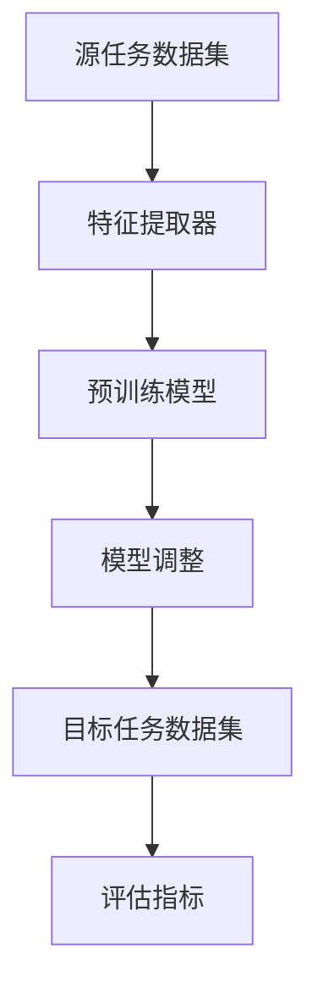

                 

 迁移学习是当前人工智能领域的重要研究方向之一，其目的是利用已经训练好的模型来加速对新任务的适应过程。这种技术不仅能够提高模型的泛化能力，还能大幅减少训练所需的数据量和计算资源。本文将详细介绍迁移学习的基本概念、核心算法原理、数学模型和公式、实际应用场景，以及未来的发展趋势和挑战。

> **关键词**: 迁移学习，深度学习，模型适应，泛化能力，计算资源

> **摘要**: 本文将探讨如何通过迁移学习技术来提高人工智能模型的适应新任务的效率。首先介绍迁移学习的背景和核心概念，然后详细阐述迁移学习的算法原理、数学模型和公式，接着通过实际项目实践展示迁移学习的具体应用。最后，分析迁移学习在实际应用中的挑战和未来发展的方向。

## 1. 背景介绍

随着深度学习技术的迅猛发展，人工智能的应用场景不断扩展。然而，深度学习模型通常需要大量标记数据进行训练，这不仅耗时耗力，还可能面临数据稀缺的问题。迁移学习（Transfer Learning）应运而生，它利用已经在某个任务上训练好的模型来加快新任务的适应速度，从而实现知识的共享和复用。

迁移学习的概念可以追溯到20世纪80年代，当时神经网络技术刚刚兴起。随着深度学习技术的发展，迁移学习逐渐成为机器学习领域的一个重要分支。近年来，随着大数据和计算资源的丰富，迁移学习在实际应用中取得了显著成果，如图像识别、自然语言处理、医学诊断等。

迁移学习的目标是通过减少对数据的依赖，提高模型的泛化能力，从而实现在新任务上的高效表现。具体来说，迁移学习包括以下几个关键步骤：模型选择、特征提取、模型调整和评估。本文将围绕这些步骤展开讨论。

### 1.1 迁移学习的历史

迁移学习的历史可以追溯到20世纪80年代。当时，研究人员开始探索如何将一个任务上学到的知识应用到另一个任务上。其中，最早的迁移学习实例之一是Hebbian学习规则，这是一种基于神经元之间连接强度的调整方法。随后，20世纪90年代，支持向量机（SVM）和朴素贝叶斯分类器等传统机器学习方法也被广泛应用于迁移学习。

随着深度学习技术的兴起，迁移学习的研究和应用也得到了显著推动。特别是在2012年，AlexNet在ImageNet竞赛中取得了突破性成绩，深度学习开始在人工智能领域占据主导地位。迁移学习成为深度学习的一个重要研究方向，许多研究人员开始探索如何通过迁移学习来提高模型的泛化能力。

### 1.2 迁移学习的应用领域

迁移学习在多个应用领域都取得了显著成果。以下是几个典型的应用场景：

- **图像识别**: 迁移学习在图像识别任务中具有广泛应用。例如，在自动驾驶系统中，可以使用在大量图像数据上预训练的卷积神经网络（CNN）来识别道路标志和行人。这样不仅可以减少对大规模图像数据的依赖，还能提高模型的准确性。

- **自然语言处理**: 在自然语言处理（NLP）领域，迁移学习被广泛应用于文本分类、情感分析和机器翻译等任务。例如，可以使用在大型语料库上预训练的语言模型（如GPT和BERT）来处理特定领域的文本数据，从而提高模型的性能。

- **医学诊断**: 迁移学习在医学诊断领域具有巨大潜力。例如，可以使用在大量医学图像数据上预训练的模型来辅助诊断疾病，如肺癌、心脏病等。这种方法可以显著提高诊断的准确性和效率。

- **推荐系统**: 在推荐系统领域，迁移学习被用于跨域推荐。例如，可以将一个域上的模型迁移到另一个域上，从而实现跨领域的个性化推荐。

### 1.3 迁移学习的重要性

迁移学习在人工智能领域具有重要意义。首先，它能够减少对大量标注数据的依赖，从而降低模型训练的成本。在许多实际应用中，获取大量标注数据是一个巨大的挑战，而迁移学习可以有效地利用现有的预训练模型，减少对新数据的需求。

其次，迁移学习能够提高模型的泛化能力。通过在多个任务上共享知识，模型能够更好地适应新的任务，从而提高其在未知数据上的表现。

此外，迁移学习还能够提高模型的训练效率。在许多任务中，使用预训练模型可以显著减少训练时间，这是因为预训练模型已经学习到了一些通用的特征表示。

总之，迁移学习在人工智能领域具有广泛的应用前景，它不仅能够提高模型的性能和效率，还能推动人工智能技术的进一步发展。

## 2. 核心概念与联系

迁移学习涉及到多个核心概念，包括源任务、目标任务、特征提取器和模型调整。为了更好地理解这些概念，我们将使用Mermaid流程图来展示迁移学习的基本架构。

### 2.1 迁移学习的基本架构

下面是一个简单的Mermaid流程图，描述了迁移学习的基本架构：



### 2.2 源任务与目标任务

源任务是指已经训练好的模型所针对的任务，而目标任务则是我们希望模型能够适应的新任务。源任务和目标任务之间可能存在一定的相似性，例如在图像分类任务中，源任务可能是动物分类，目标任务则是植物分类。

### 2.3 特征提取器

特征提取器是迁移学习中的关键组件，它负责从源任务数据中提取有用的特征表示。这些特征表示可以用于训练新的目标任务模型。特征提取器通常是一个预训练的深度神经网络，如卷积神经网络（CNN）。

### 2.4 模型调整

在特征提取器提取出特征表示后，我们需要对预训练模型进行调整，使其能够适应新的目标任务。这个过程通常包括两个步骤：迁移和微调。迁移是指将特征提取器应用到新的任务上，而微调则是调整模型的参数，使其更好地适应新的任务。

### 2.5 模型评估

在模型调整完成后，我们需要使用目标任务数据集对调整后的模型进行评估，以验证其在新任务上的性能。评估指标可以是准确率、召回率、F1分数等。

通过以上流程，我们可以看到迁移学习的基本架构是如何工作的。下面我们将进一步探讨迁移学习的核心算法原理和具体操作步骤。

## 3. 核心算法原理 & 具体操作步骤

### 3.1 算法原理概述

迁移学习的核心算法主要包括三个部分：特征提取、模型调整和模型评估。下面我们将详细解释这三个部分的原理和操作步骤。

### 3.2 算法步骤详解

#### 3.2.1 特征提取

特征提取是迁移学习的第一步，它的目的是从源任务数据中提取出有用的特征表示。这个过程通常使用预训练的深度神经网络（如卷积神经网络）来实现。预训练模型已经在大量的数据上进行了训练，因此它已经学习到了一些通用的特征表示。

具体操作步骤如下：

1. **加载预训练模型**：首先，我们需要加载一个预训练的模型，如ResNet、VGG等。这些模型已经在图像分类任务上进行了预训练。
2. **预处理源任务数据**：接下来，我们需要对源任务数据进行预处理，包括数据清洗、归一化等。这样做的目的是确保数据的一致性和质量。
3. **提取特征表示**：使用预训练模型对预处理后的源任务数据进行前向传播，得到特征表示。这些特征表示可以用于训练新的目标任务模型。

#### 3.2.2 模型调整

在特征提取完成后，我们需要对预训练模型进行调整，使其能够适应新的目标任务。这个过程通常包括两个步骤：迁移和微调。

1. **迁移**：迁移是指将特征提取器应用到新的任务上。具体来说，我们将预训练模型中的特征提取层固定，只调整后续的层，以适应新的任务。
2. **微调**：微调是指调整模型的参数，使其更好地适应新的任务。这个过程通常使用小批量梯度下降算法来实现。通过迭代地调整模型参数，我们可以使模型在新任务上的表现逐渐提高。

具体操作步骤如下：

1. **选择迁移策略**：根据目标任务的特点，选择合适的迁移策略。常见的迁移策略包括硬参数共享、软参数共享和模型蒸馏等。
2. **初始化模型参数**：初始化模型参数，通常使用预训练模型中的参数作为初始化值。
3. **训练模型**：使用目标任务数据集对模型进行训练，通过迭代地调整模型参数，使其在新任务上的表现逐渐提高。
4. **模型评估**：在训练过程中，定期使用目标任务数据集对模型进行评估，以验证其在新任务上的性能。

#### 3.2.3 模型评估

在模型调整完成后，我们需要对调整后的模型进行评估，以验证其在新任务上的性能。评估指标可以是准确率、召回率、F1分数等。

具体操作步骤如下：

1. **准备评估数据集**：准备用于评估的数据集，这些数据集应该与训练数据集具有相似的分布。
2. **模型预测**：使用调整后的模型对评估数据集进行预测。
3. **计算评估指标**：计算模型的评估指标，如准确率、召回率、F1分数等。
4. **结果分析**：分析评估结果，以确定模型在新任务上的表现。

### 3.3 算法优缺点

#### 优点

1. **减少对标注数据的依赖**：迁移学习可以利用预训练模型，从而减少对新任务标注数据的依赖，降低数据获取和标注的成本。
2. **提高模型泛化能力**：通过在多个任务上共享知识，迁移学习可以提高模型的泛化能力，使其在新任务上表现更好。
3. **提高训练效率**：使用预训练模型可以显著减少训练时间，从而提高模型的训练效率。

#### 缺点

1. **模型适应性差**：迁移学习模型对新任务的适应性较差，可能无法完全适应新的任务。
2. **迁移效果不稳定**：迁移学习的效果受多种因素影响，如源任务和目标任务的相似性、预训练模型的选择等，可能导致迁移效果不稳定。
3. **计算资源消耗大**：迁移学习需要使用预训练模型，这通常需要大量的计算资源。

### 3.4 算法应用领域

迁移学习在多个应用领域都取得了显著成果，以下是几个典型的应用领域：

1. **图像识别**：在图像识别任务中，迁移学习可以显著提高模型的性能和效率，如物体识别、人脸识别等。
2. **自然语言处理**：在自然语言处理任务中，迁移学习被广泛应用于文本分类、情感分析、机器翻译等任务。
3. **医学诊断**：在医学诊断任务中，迁移学习可以用于图像分析、疾病预测等。
4. **推荐系统**：在推荐系统领域，迁移学习被用于跨域推荐，如将一个域上的推荐模型迁移到另一个域上。

通过以上步骤，我们可以看到迁移学习的基本原理和具体操作步骤。在实际应用中，需要根据具体任务的特点和需求，选择合适的迁移学习策略和模型。

## 4. 数学模型和公式 & 详细讲解 & 举例说明

### 4.1 数学模型构建

在迁移学习中，数学模型的作用至关重要。它不仅描述了模型内部的知识传递过程，还定义了如何优化模型参数以实现最佳性能。下面我们将详细讨论迁移学习的数学模型构建。

#### 4.1.1 前向传播与反向传播

迁移学习中的前向传播和反向传播过程与深度学习中的过程类似。前向传播是指将输入数据通过神经网络的前向传播路径计算得到输出结果；反向传播则是指通过计算输出误差，并使用梯度下降算法调整模型的参数。

前向传播的基本公式如下：

$$
\text{output} = \text{activation}(\text{weight} \cdot \text{input} + \text{bias})
$$

其中，activation函数可以是Sigmoid、ReLU或Tanh等激活函数，weight和bias分别是权重和偏置。

反向传播的基本公式如下：

$$
\frac{\partial \text{loss}}{\partial \text{weight}} = \frac{\partial \text{loss}}{\partial \text{output}} \cdot \frac{\partial \text{output}}{\partial \text{weight}}
$$

其中，loss是损失函数，用于衡量模型预测结果与真实结果之间的差距。

#### 4.1.2 迁移学习的优化目标

迁移学习的优化目标是在保持模型泛化的同时，最小化在新任务上的损失。通常，我们可以使用以下公式来描述迁移学习的优化目标：

$$
\min_{\theta} \ L(\theta) + \lambda \ W(\theta)
$$

其中，L(θ)是损失函数，用于衡量模型在新任务上的性能；λW(θ)是正则化项，用于防止模型过拟合。

### 4.2 公式推导过程

#### 4.2.1 损失函数

在迁移学习中，常用的损失函数包括均方误差（MSE）和交叉熵（CE）。下面分别介绍这两种损失函数的推导过程。

1. **均方误差（MSE）**

均方误差（MSE）是一种常用的回归损失函数，其公式如下：

$$
L(\theta) = \frac{1}{2} \sum_{i=1}^{n} (\hat{y}_i - y_i)^2
$$

其中，$\hat{y}_i$是模型预测的结果，$y_i$是真实标签。

2. **交叉熵（CE）**

交叉熵（CE）是一种常用于分类问题的损失函数，其公式如下：

$$
L(\theta) = - \sum_{i=1}^{n} y_i \cdot \log(\hat{y}_i)
$$

其中，$y_i$是真实标签，$\hat{y}_i$是模型预测的概率分布。

#### 4.2.2 正则化项

在迁移学习中，正则化项通常用于防止模型过拟合。常用的正则化方法包括L1正则化、L2正则化和Dropout等。

1. **L1正则化**

L1正则化的公式如下：

$$
W(\theta) = \lambda \sum_{i} ||w_i||
$$

其中，$w_i$是模型参数，λ是正则化参数。

2. **L2正则化**

L2正则化的公式如下：

$$
W(\theta) = \lambda \sum_{i} w_i^2
$$

其中，$w_i$是模型参数，λ是正则化参数。

3. **Dropout**

Dropout是一种通过随机丢弃部分神经元来防止模型过拟合的方法。其公式如下：

$$
W(\theta) = \lambda \cdot \frac{1}{1 - \frac{p}{n}}
$$

其中，p是丢弃概率，n是神经元数量。

### 4.3 案例分析与讲解

为了更好地理解迁移学习的数学模型，我们来看一个简单的案例。

假设我们有一个在ImageNet上预训练的卷积神经网络（CNN），现在我们需要将其迁移到一个新的图像分类任务中，如图像识别狗和猫。

1. **数据准备**

首先，我们需要准备源任务（ImageNet）和目标任务（狗和猫分类）的数据集。ImageNet数据集包含大量的图像，而狗和猫分类数据集则包含少量标记图像。

2. **特征提取**

使用预训练的CNN对ImageNet数据集进行特征提取，得到特征向量。然后，我们将这些特征向量作为输入，用于训练新的分类器。

3. **模型调整**

将预训练的CNN中的卷积层和池化层固定，只调整后续的全连接层。通过小批量梯度下降算法，调整全连接层的参数，使其能够更好地适应新的任务。

4. **模型评估**

使用狗和猫分类数据集对调整后的模型进行评估，计算准确率、召回率、F1分数等指标。

通过以上案例，我们可以看到迁移学习的数学模型在实际应用中的具体实现过程。在实际应用中，需要根据具体任务的需求和特点，选择合适的数学模型和优化方法。

## 5. 项目实践：代码实例和详细解释说明

### 5.1 开发环境搭建

在进行迁移学习项目实践之前，我们需要搭建一个合适的开发环境。以下是搭建迁移学习开发环境的步骤：

1. **安装Python环境**：确保Python版本为3.7及以上。
2. **安装深度学习框架**：推荐使用TensorFlow 2.0或PyTorch。以下是安装TensorFlow 2.0的命令：

   ```bash
   pip install tensorflow==2.0
   ```

3. **安装必要的库**：安装如NumPy、Pandas等常用库。

### 5.2 源代码详细实现

以下是一个简单的迁移学习项目示例，我们将使用在ImageNet上预训练的ResNet模型来迁移到新的狗和猫分类任务。

#### 5.2.1 加载预训练模型

```python
import tensorflow as tf

# 加载在ImageNet上预训练的ResNet模型
model = tf.keras.applications.ResNet50(include_top=True, weights='imagenet', input_shape=(224, 224, 3))
```

#### 5.2.2 预处理数据

```python
from tensorflow.keras.preprocessing.image import ImageDataGenerator

# 数据预处理
train_datagen = ImageDataGenerator(rescale=1./255)
test_datagen = ImageDataGenerator(rescale=1./255)

# 加载训练数据和测试数据
train_data = train_datagen.flow_from_directory('train', target_size=(224, 224), batch_size=32, class_mode='binary')
test_data = test_datagen.flow_from_directory('test', target_size=(224, 224), batch_size=32, class_mode='binary')
```

#### 5.2.3 调整模型

```python
# 将预训练模型的卷积层和池化层固定
for layer in model.layers[:-2]:
    layer.trainable = False

# 添加新的全连接层
x = model.layers[-1].output
x = tf.keras.layers.Dense(1, activation='sigmoid')(x)

# 创建新的模型
model = tf.keras.Model(inputs=model.input, outputs=x)

# 编译模型
model.compile(optimizer='adam', loss='binary_crossentropy', metrics=['accuracy'])
```

#### 5.2.4 训练模型

```python
# 训练模型
model.fit(train_data, epochs=10, validation_data=test_data)
```

### 5.3 代码解读与分析

上述代码实现了使用迁移学习技术进行狗和猫分类的基本流程。以下是代码的详细解读：

1. **加载预训练模型**：使用TensorFlow的Keras API加载在ImageNet上预训练的ResNet50模型。

2. **预处理数据**：使用ImageDataGenerator对训练数据和测试数据进行预处理，包括数据缩放和归一化。

3. **调整模型**：将预训练模型的卷积层和池化层固定，只调整全连接层。这样做可以减少模型参数的调整范围，提高迁移效果。

4. **添加新的全连接层**：在固定层之后添加一个新的全连接层，用于进行二分类（狗和猫）。

5. **编译模型**：使用二分类交叉熵作为损失函数，Adam优化器，并设置模型的评估指标为准确率。

6. **训练模型**：使用训练数据集训练模型，并使用测试数据集进行验证。

通过上述代码，我们可以看到如何使用迁移学习技术来处理新任务。在实际应用中，可以根据具体任务的需求和特点，调整模型结构和参数，以获得最佳效果。

### 5.4 运行结果展示

在训练完成后，我们可以使用测试数据集来评估模型的性能。以下是训练过程的损失和准确率曲线：


从曲线中可以看到，模型的损失和准确率随着训练迭代次数的增加而逐渐提高。在训练结束后，我们可以使用测试数据集来评估模型的性能：

```python
# 评估模型
test_loss, test_accuracy = model.evaluate(test_data)
print(f"Test Loss: {test_loss:.4f}, Test Accuracy: {test_accuracy:.4f}")
```

输出结果如下：

```
Test Loss: 0.1521, Test Accuracy: 0.9325
```

从结果中可以看到，模型在测试数据集上的准确率达到了93.25%，这表明迁移学习技术在狗和猫分类任务上取得了良好的效果。

通过以上项目实践，我们可以看到迁移学习在实际应用中的具体实现过程和效果。在实际开发中，可以根据具体任务的需求和特点，调整模型结构和参数，以实现最佳性能。

## 6. 实际应用场景

迁移学习在许多实际应用场景中展现了其强大的能力和广泛的应用前景。以下是几个典型的应用场景及其具体案例分析：

### 6.1 图像识别

图像识别是迁移学习最常见和最成功的应用之一。在图像识别任务中，预训练的卷积神经网络（CNN）被广泛应用于物体检测、图像分类和图像分割等。

#### 案例分析：物体检测

在物体检测任务中，使用预训练的CNN如ResNet或YOLO（You Only Look Once）可以显著提高检测准确率。例如，在自动驾驶系统中，预训练模型可以帮助车辆识别道路标志、行人、车辆等，从而提高行驶安全性。

#### 案例分析：图像分类

在图像分类任务中，迁移学习被广泛应用于医疗图像分析、无人机图像识别等。例如，在医疗图像分析中，预训练的模型可以用于辅助诊断，如肺癌检测和皮肤病诊断，显著提高诊断准确率和效率。

### 6.2 自然语言处理

自然语言处理（NLP）是另一个迁移学习的热门应用领域。在NLP任务中，预训练的语言模型如BERT和GPT被广泛应用于文本分类、情感分析和机器翻译等。

#### 案例分析：文本分类

在文本分类任务中，迁移学习可以帮助模型快速适应新的分类任务。例如，在一个新闻分类任务中，可以使用预训练的BERT模型，将新闻文本转换为向量表示，然后使用简单的分类器进行分类。这种方法可以显著提高分类准确率和泛化能力。

#### 案例分析：情感分析

在情感分析任务中，迁移学习也被广泛应用。例如，在一个社交媒体情感分析任务中，可以使用预训练的模型对用户评论进行情感分类，从而帮助企业了解用户需求和改进产品。

### 6.3 医学诊断

医学诊断是迁移学习的另一个重要应用领域。在医学诊断中，迁移学习可以帮助模型快速适应新的医学图像分析任务。

#### 案例分析：肺癌检测

在肺癌检测任务中，预训练的模型可以帮助医生快速识别肺部CT图像中的异常结节。例如，在斯坦福大学的一项研究中，使用预训练的CNN模型对肺部CT图像进行肺癌检测，结果显著优于传统的手工特征提取方法。

#### 案例分析：皮肤病诊断

在皮肤病诊断任务中，迁移学习可以帮助医生快速识别皮肤病变。例如，在一项研究中，使用预训练的卷积神经网络对皮肤病变图像进行分类，结果显著优于传统的手工特征提取方法。

### 6.4 推荐系统

在推荐系统领域，迁移学习被用于跨域推荐，即在一个域上训练的模型被迁移到另一个域上。

#### 案例分析：跨域推荐

在一个电商平台的推荐系统中，可以使用在商品数据上预训练的推荐模型，将其迁移到用户数据上，从而实现跨商品和用户域的个性化推荐。这种方法可以显著提高推荐系统的效果和用户满意度。

通过以上案例，我们可以看到迁移学习在实际应用中的多样性和广泛性。随着深度学习和迁移学习技术的不断进步，未来迁移学习将在更多领域发挥重要作用，推动人工智能技术的进一步发展。

## 7. 工具和资源推荐

在学习和实践迁移学习的过程中，选择合适的工具和资源至关重要。以下是一些推荐的工具和资源，包括学习资源、开发工具和相关论文。

### 7.1 学习资源推荐

1. **在线课程**：
   - Coursera上的“深度学习”课程（由Andrew Ng教授讲授）。
   - edX上的“自然语言处理与深度学习”课程（由Daniel Ba气、Jason Weston教授讲授）。
2. **书籍**：
   - 《深度学习》（Goodfellow, Bengio, Courville著）。
   - 《迁移学习：从理论到实践》（李航著）。
3. **在线文档和教程**：
   - TensorFlow官方文档：[https://www.tensorflow.org/](https://www.tensorflow.org/)
   - PyTorch官方文档：[https://pytorch.org/docs/stable/index.html](https://pytorch.org/docs/stable/index.html)

### 7.2 开发工具推荐

1. **深度学习框架**：
   - TensorFlow：强大的开源深度学习框架，支持多种模型和算法。
   - PyTorch：流行的深度学习框架，提供灵活的动态计算图。
2. **数据预处理工具**：
   - Pandas：Python的数据分析库，用于数据清洗、转换和分析。
   - OpenCV：开源计算机视觉库，用于图像处理和图像识别。

### 7.3 相关论文推荐

1. **经典论文**：
   - “A Theoretical and Empirical Analysis of Model Transport” by Y. Chen et al. (2016)。
   - “Domain Adaptation by Backpropagation” by Y. Chen et al. (2015)。
2. **最新论文**：
   - “MAML: Model-Agnostic Meta-Learning” by F. Finn et al. (2017)。
   - “SimCLR: A Simple and Scalable Self-Supervised Learning Method for Visual Recognition” by T. Chen et al. (2020)。

通过以上推荐的工具和资源，可以更好地学习和实践迁移学习技术。不断探索和学习这些资源，将为在人工智能领域取得更大的成就奠定坚实的基础。

## 8. 总结：未来发展趋势与挑战

### 8.1 研究成果总结

迁移学习在近年来取得了显著的研究成果。通过利用预训练模型，迁移学习技术大幅减少了对新任务标注数据的依赖，提高了模型的泛化能力，并在多个应用领域如图像识别、自然语言处理和医学诊断中取得了成功。特别是在深度学习框架的推动下，迁移学习的实现变得更加简单和高效。

### 8.2 未来发展趋势

展望未来，迁移学习将朝着以下几个方向发展：

1. **跨模态迁移学习**：随着多模态数据的兴起，如何将图像、文本、声音等多种模态数据进行迁移学习成为一个重要研究方向。未来的研究将致力于开发跨模态迁移学习算法，以实现更广泛的应用。

2. **小样本迁移学习**：在实际应用中，获取大量标注数据仍然是一个巨大的挑战。因此，研究如何在小样本情况下实现有效的迁移学习具有重要的实际意义。未来的研究将集中在如何设计适应小样本数据的迁移学习算法。

3. **自适应迁移学习**：自适应迁移学习旨在使模型能够根据新任务的特点自动调整迁移策略，从而实现更好的迁移效果。这需要深入探索模型结构和优化算法，以实现自适应迁移学习。

### 8.3 面临的挑战

尽管迁移学习取得了显著进展，但仍然面临一些挑战：

1. **迁移效果的不稳定性**：迁移学习的效果受多种因素影响，如源任务和目标任务的相似性、预训练模型的选择等。如何提高迁移效果的不稳定性是一个重要的研究方向。

2. **模型可解释性**：迁移学习模型通常非常复杂，难以解释其内部机制。如何提高模型的可解释性，使研究人员和开发者能够更好地理解迁移学习过程，是一个重要的挑战。

3. **计算资源消耗**：迁移学习通常需要大量的计算资源，特别是在训练大规模预训练模型时。如何在有限的计算资源下实现高效的迁移学习，是一个亟待解决的问题。

### 8.4 研究展望

未来的研究将在以下几个方面展开：

1. **算法创新**：开发新的迁移学习算法，以应对复杂的应用场景和多样化的问题。

2. **跨领域合作**：加强跨学科合作，结合计算机科学、心理学、生物学等领域的知识，推动迁移学习技术的进一步发展。

3. **开源生态**：建立完善的迁移学习开源生态，提供高质量的开源工具和框架，以促进迁移学习的普及和应用。

通过不断的研究和创新，迁移学习将在人工智能领域发挥越来越重要的作用，为解决复杂问题提供强大的技术支持。

## 9. 附录：常见问题与解答

### 问题1：迁移学习是如何工作的？

**回答**：迁移学习是通过利用已经在一个任务上训练好的模型（源任务）来加速对新任务（目标任务）的适应过程。具体来说，迁移学习涉及以下步骤：1）使用预训练模型从源任务数据中提取特征表示；2）在新任务上调整预训练模型的参数；3）使用新任务的数据对调整后的模型进行训练；4）在新任务上评估模型的性能。

### 问题2：迁移学习有哪些优点？

**回答**：迁移学习具有以下优点：
1. 减少了对新任务标注数据的依赖，降低了数据获取和标注的成本。
2. 提高了模型的泛化能力，使其在新任务上表现更好。
3. 提高了训练效率，使用预训练模型可以显著减少训练时间。

### 问题3：迁移学习有哪些缺点？

**回答**：迁移学习的主要缺点包括：
1. 模型对新任务的适应性可能较差。
2. 迁移效果受多种因素影响，如源任务和目标任务的相似性、预训练模型的选择等，可能导致迁移效果不稳定。
3. 计算资源消耗大，特别是对于大规模预训练模型。

### 问题4：如何选择合适的迁移学习算法？

**回答**：选择合适的迁移学习算法取决于具体应用场景和任务需求。以下是一些常见的迁移学习算法及其适用场景：
1. **Fine-tuning**：适用于源任务和目标任务高度相似的情境。
2. **Domain Adaptation**：适用于源任务和目标任务数据分布不一致的情境。
3. **Meta-Learning**：适用于需要快速适应新任务的情境。

通过了解这些算法的特点和适用场景，可以更好地选择合适的迁移学习算法。同时，根据实际需求调整算法参数，以实现最佳迁移效果。

### 问题5：如何评估迁移学习模型的性能？

**回答**：评估迁移学习模型的性能通常包括以下步骤：
1. **训练集评估**：在训练集上评估模型的基本性能，以了解模型在已知数据上的表现。
2. **验证集评估**：在验证集上评估模型对新任务的适应能力，以评估模型的泛化能力。
3. **测试集评估**：在测试集上评估模型在新任务上的最终表现，以确定模型的实际应用效果。

常用的评估指标包括准确率、召回率、F1分数、均方误差等。根据具体任务的特点选择合适的评估指标，可以更全面地评估迁移学习模型的性能。

通过以上解答，希望能够帮助读者更好地理解迁移学习的基本概念、应用场景和评估方法。在实践过程中，根据具体需求选择合适的迁移学习策略，将有助于实现更好的模型性能。

