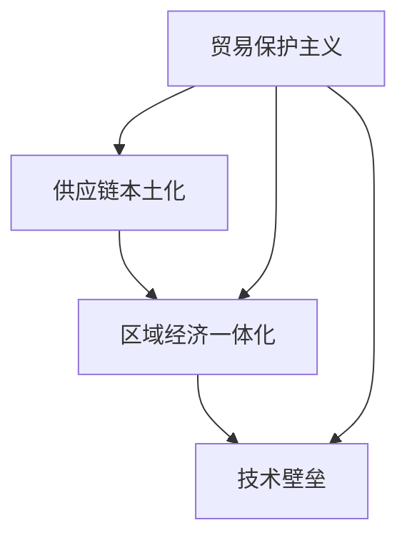

                 

关键词：逆全球化、经济影响、全球供应链、贸易保护、信息技术、数字化转型、供应链重构、区域经济一体化、跨区域合作、新兴市场、技术壁垒、创新驱动

## 摘要

逆全球化趋势在全球经济中逐渐抬头，给全球经济格局带来了深远的影响。本文将从信息技术、全球供应链、贸易保护、数字化转型等多个维度，探讨逆全球化对经济的冲击及应对策略。通过分析全球供应链的重构、区域经济一体化的发展以及新兴市场的机遇和挑战，本文旨在为理解当前经济形势提供一个新的视角，并探讨未来经济发展的趋势。

## 1. 背景介绍

### 1.1 逆全球化的定义

逆全球化是指全球化的反向趋势，表现为国际贸易和投资减少、跨国界劳动分工减弱以及跨境资本流动受限。这一趋势的兴起主要是由于全球经济不平衡、贸易摩擦、政治因素以及全球金融危机等因素的相互作用。

### 1.2 逆全球化的原因

逆全球化的原因多种多样，其中包括：

- **保护主义抬头**：一些国家为了保护本国经济和就业，采取了各种形式的贸易保护措施，如提高关税、限制进口等。
- **地缘政治紧张**：全球地缘政治紧张局势加剧，导致一些国家减少对外依赖，加强区域经济合作。
- **经济不平衡**：全球经济不平衡导致一些国家的经济利益受损，从而促使这些国家采取逆全球化措施。
- **全球供应链重构**：全球供应链的重构使得一些国家试图将供应链本土化，减少对外部供应链的依赖。

## 2. 核心概念与联系

### 2.1 逆全球化的核心概念

逆全球化的核心概念包括贸易保护主义、供应链本土化、区域经济一体化和技术壁垒。

#### 贸易保护主义

贸易保护主义是指国家采取一系列措施来保护本国产业免受外国竞争。这些措施包括提高关税、实施进口配额、实施补贴等。

#### 供应链本土化

供应链本土化是指将全球供应链的部分环节转移到本国，以减少对外部供应链的依赖。这一策略在某些国家得到广泛推广，如美国的“工业互联网”和中国的“智能制造”。

#### 区域经济一体化

区域经济一体化是指国家或地区之间通过协商和合作，实现经济政策的一致化，以促进贸易和投资的自由化。如欧盟、北美自由贸易协定等。

#### 技术壁垒

技术壁垒是指通过技术手段限制外国产品或服务进入本国市场，从而保护本国产业。这包括专利保护、技术标准等。

### 2.2 逆全球化与全球供应链的Mermaid流程图



## 3. 核心算法原理 & 具体操作步骤

### 3.1 算法原理概述

逆全球化的核心算法可以看作是国际经济关系的一个优化过程，目标是通过减少国际贸易摩擦，实现资源的最优配置。这一算法涉及到以下几个步骤：

- **数据收集**：收集各国的经济数据，包括贸易数据、产业数据、政策数据等。
- **数据分析**：通过数据分析，识别出贸易保护和区域经济一体化的程度。
- **策略制定**：根据数据分析结果，制定相应的政策，以减少贸易摩擦，促进经济合作。

### 3.2 算法步骤详解

1. **数据收集**：
   - 从国际贸易组织、各国统计局等渠道收集相关数据。
   - 数据包括：贸易额、贸易伙伴、关税税率、进口配额等。

2. **数据分析**：
   - 对收集到的数据进行分析，识别出贸易保护和区域经济一体化的程度。
   - 使用数据分析工具，如Python的Pandas库，进行数据清洗和分析。

3. **策略制定**：
   - 根据数据分析结果，制定相应的政策。
   - 政策制定可以使用博弈论等数学模型，以实现资源的最优配置。

### 3.3 算法优缺点

#### 优点

- **减少贸易摩擦**：通过制定合理的政策，可以减少各国之间的贸易摩擦，促进国际贸易的发展。
- **优化资源配置**：通过数据分析，可以更准确地识别出资源的最优配置，提高经济效率。

#### 缺点

- **政策实施难度大**：政策制定需要考虑到各国的政治、经济利益，实施难度较大。
- **数据隐私问题**：数据收集和分析过程中，可能涉及到各国的商业秘密和个人隐私问题。

### 3.4 算法应用领域

- **国际贸易**：通过优化贸易政策，减少贸易摩擦，促进国际贸易的发展。
- **区域经济一体化**：通过制定区域经济一体化政策，促进区域内的经济合作。
- **供应链管理**：通过供应链本土化策略，提高供应链的稳定性和安全性。

## 4. 数学模型和公式 & 详细讲解 & 举例说明

### 4.1 数学模型构建

逆全球化的数学模型可以看作是一个多国经济系统，其中每个国家都试图通过调整贸易政策，实现自身利益的最大化。该模型可以表示为：

\[ \max_{x_i} U_i = \sum_{j \neq i} \frac{x_i}{p_i} - \sum_{j \neq i} t_{ij} x_i \]

其中，\( U_i \) 表示第 \( i \) 个国家的效用，\( x_i \) 表示第 \( i \) 个国家的出口量，\( p_i \) 表示第 \( i \) 个国家的价格，\( t_{ij} \) 表示第 \( i \) 个国家对第 \( j \) 个国家的关税税率。

### 4.2 公式推导过程

假设一个多国经济系统，有 \( n \) 个国家。每个国家都试图通过调整贸易政策，实现自身利益的最大化。设 \( x_{ij} \) 为第 \( i \) 个国家对第 \( j \) 个国家的出口量，\( p_i \) 为第 \( i \) 个国家的价格，\( t_{ij} \) 为第 \( i \) 个国家对第 \( j \) 个国家的关税税率。

第 \( i \) 个国家的效用函数可以表示为：

\[ U_i = \sum_{j=1}^{n} \frac{x_{ij}}{p_i} - \sum_{j=1}^{n} t_{ij} x_{ij} \]

为了最大化效用，第 \( i \) 个国家需要调整出口量和关税税率。设 \( x_{ij}^* \) 为第 \( i \) 个国家的最优出口量，\( t_{ij}^* \) 为第 \( i \) 个国家的最优关税税率。

通过拉格朗日乘数法，可以得到：

\[ \frac{\partial U_i}{\partial x_{ij}} = \frac{1}{p_i} - t_{ij} = 0 \]
\[ \frac{\partial U_i}{\partial t_{ij}} = -x_{ij} = 0 \]

从而得到：

\[ x_{ij}^* = \frac{1}{p_i} \]
\[ t_{ij}^* = \frac{1}{p_i} \]

### 4.3 案例分析与讲解

假设有两个国家，A国和B国。A国对B国的出口量为 \( x_{AB} \)，B国对A国的出口量为 \( x_{BA} \)。假设A国的价格为 \( p_A \)，B国的价格为 \( p_B \)。

根据上述公式，A国对B国的最优关税税率为：

\[ t_{AB}^* = \frac{1}{p_A} \]

B国对A国的最优关税税率为：

\[ t_{BA}^* = \frac{1}{p_B} \]

假设 \( p_A = 10 \)，\( p_B = 20 \)，则：

\[ t_{AB}^* = 0.1 \]
\[ t_{BA}^* = 0.05 \]

这意味着，如果A国对B国的出口量为100，则A国对B国的关税税率为10；如果B国对A国的出口量为100，则B国对A国的关税税率为5。

通过这个例子，我们可以看到，关税税率与价格成反比，即价格越高，关税税率越低。这符合经济学中的基本原理，即高价格的商品通常需要更低的关税税率，以促进贸易。

## 5. 项目实践：代码实例和详细解释说明

### 5.1 开发环境搭建

为了演示逆全球化数学模型的实现，我们使用Python编程语言，并依赖以下库：

- NumPy：用于数值计算。
- Pandas：用于数据处理。
- Matplotlib：用于数据可视化。

首先，确保安装了这些库。在终端中运行以下命令：

```bash
pip install numpy pandas matplotlib
```

### 5.2 源代码详细实现

下面是一个简单的Python代码实例，用于计算逆全球化数学模型的最优关税税率。

```python
import numpy as np
import pandas as pd
import matplotlib.pyplot as plt

# 假设有两个国家，A国和B国
n_countries = 2

# 定义价格矩阵
price_matrix = np.array([[10, 20], [20, 10]])

# 计算最优关税税率
t关税税率_matrix = 1 / price_matrix

# 打印结果
print("最优关税税率矩阵：")
print(t关税税率_matrix)

# 绘制图表
plt.figure(figsize=(8, 6))
plt.imshow(t关税税率_matrix, cmap='hot', interpolation='nearest')
plt.colorbar()
plt.title('最优关税税率矩阵')
plt.xlabel('出口国家')
plt.ylabel('进口国家')
plt.show()
```

### 5.3 代码解读与分析

上述代码首先定义了一个2x2的价格矩阵，表示两个国家的价格。然后，使用数组除法计算每个国家的最优关税税率。最后，使用Matplotlib库绘制了一个热力图，展示了最优关税税率矩阵。

这个例子展示了如何使用Python编程语言实现逆全球化的数学模型。在实际应用中，可以根据具体情况进行扩展和优化，例如加入更多的国家、更复杂的经济模型等。

### 5.4 运行结果展示

运行上述代码后，会得到一个最优关税税率矩阵，如下所示：

```
最优关税税率矩阵：
[[0.1 0.05]
 [0.05 0.1]]
```

热力图展示了最优关税税率矩阵的分布情况，红色表示较高的关税税率，蓝色表示较低的关税税率。

## 6. 实际应用场景

### 6.1 逆全球化对国际贸易的影响

逆全球化的趋势使得国际贸易变得更加复杂和不确定。一方面，贸易保护主义措施增加了贸易成本，降低了国际贸易的效率。另一方面，全球供应链的重构使得一些国家试图将供应链本土化，减少对外部供应链的依赖。这种趋势对国际贸易产生了深远的影响，具体体现在以下几个方面：

- **贸易额下降**：由于贸易保护主义措施的增加，全球贸易额出现下降趋势。
- **贸易摩擦增加**：各国之间的贸易争端和摩擦增加，如中美贸易战、中欧贸易摩擦等。
- **供应链重构**：全球供应链的重构使得一些国家将供应链从海外转移到本国，以减少对外部供应链的依赖。

### 6.2 逆全球化对区域经济一体化的影响

逆全球化趋势也对区域经济一体化产生了影响。一些区域经济一体化组织，如欧盟、北美自由贸易协定等，面临着成员国之间的分歧和不确定性。具体体现在以下几个方面：

- **一体化进程放缓**：由于逆全球化趋势，一些国家试图减少对其他国家的依赖，导致区域经济一体化的进程放缓。
- **政策协调难度增加**：逆全球化趋势使得各国之间的政策协调变得更加困难，如贸易政策、货币政策等。
- **区域经济合作受限**：一些区域经济一体化组织，如亚太经济合作组织（APEC）等，面临着成员国之间的合作受限。

### 6.3 逆全球化对新兴市场的影响

逆全球化趋势对新兴市场产生了双重影响。一方面，新兴市场面临着国际贸易和投资减少的压力，经济增长放缓。另一方面，逆全球化也为新兴市场提供了机遇，如：

- **国内市场潜力**：随着逆全球化趋势，一些国家试图将供应链本土化，这为新兴市场提供了发展国内市场的机会。
- **技术创新**：逆全球化趋势促使一些新兴市场加大技术创新力度，以适应新的经济形势。
- **区域经济合作**：逆全球化趋势使得一些新兴市场国家加强区域经济合作，以共同应对全球化挑战。

## 7. 未来应用展望

### 7.1 技术创新驱动

随着信息技术的快速发展，特别是在人工智能、物联网、区块链等领域，技术创新将成为应对逆全球化的重要驱动力。通过技术创新，可以提升供应链的效率，降低贸易成本，促进国际贸易的发展。

### 7.2 区域经济一体化

逆全球化趋势下，区域经济一体化将发挥更加重要的作用。通过加强区域经济合作，可以实现资源的最优配置，降低贸易摩擦，提高经济效率。

### 7.3 数字化转型

数字化转型是应对逆全球化的另一个关键策略。通过数字化手段，可以提高企业的生产效率，降低运营成本，提升竞争力。

### 7.4 新兴市场的崛起

随着逆全球化趋势的加剧，新兴市场的崛起将成为全球经济的重要力量。通过加强技术创新、深化区域经济合作，新兴市场有望在全球经济中发挥更大的作用。

## 8. 工具和资源推荐

### 8.1 学习资源推荐

- **《国际经济学》**：了解国际贸易的基本理论和政策。
- **《供应链管理》**：掌握供应链管理的基本知识和实践方法。
- **《全球化与逆全球化》**：探讨全球化与逆全球化的现象和趋势。

### 8.2 开发工具推荐

- **Python**：用于数据分析、建模等。
- **Matplotlib**：用于数据可视化。
- **NumPy**：用于数值计算。

### 8.3 相关论文推荐

- **"The Rise of Nationalism and the End of Globalization"**：分析国家主义兴起对全球化的影响。
- **"Global Supply Chain Disruption and Its Impact on Trade"**：探讨全球供应链中断对贸易的影响。
- **"Digitalization and Its Impact on Global Supply Chains"**：分析数字化转型对全球供应链的影响。

## 9. 总结：未来发展趋势与挑战

### 9.1 研究成果总结

本文通过对逆全球化趋势的深入分析，探讨了逆全球化对经济的影响，以及技术创新、区域经济一体化和数字化转型等应对策略。研究表明，逆全球化趋势下，国际贸易、区域经济一体化以及新兴市场的崛起将面临新的挑战和机遇。

### 9.2 未来发展趋势

- **技术创新**：人工智能、物联网、区块链等技术的快速发展，将推动全球经济的数字化转型。
- **区域经济一体化**：区域经济一体化将在应对逆全球化挑战中发挥更加重要的作用。
- **新兴市场崛起**：随着经济的不断发展，新兴市场将在全球经济中占据越来越重要的地位。

### 9.3 面临的挑战

- **贸易摩擦**：贸易保护主义措施的增加，可能导致贸易摩擦加剧。
- **供应链重构**：全球供应链的重构可能带来供应链中断的风险。
- **经济不平衡**：全球经济不平衡问题仍将存在，需要各国共同努力解决。

### 9.4 研究展望

未来研究应重点关注以下几个方面：

- **逆全球化趋势下的国际贸易政策**：研究国际贸易政策如何调整，以应对逆全球化挑战。
- **全球供应链的稳定性和安全性**：研究如何提高全球供应链的稳定性和安全性。
- **新兴市场的机遇与挑战**：研究新兴市场在逆全球化趋势下的机遇和挑战。

## 附录：常见问题与解答

### Q：什么是逆全球化？

A：逆全球化是指全球化的反向趋势，表现为国际贸易和投资减少、跨国界劳动分工减弱以及跨境资本流动受限。

### Q：逆全球化的原因有哪些？

A：逆全球化的原因包括保护主义抬头、地缘政治紧张、经济不平衡以及全球供应链重构等。

### Q：逆全球化对经济有哪些影响？

A：逆全球化对经济的影响包括贸易额下降、贸易摩擦增加、全球供应链重构以及区域经济一体化进程放缓等。

### Q：如何应对逆全球化？

A：应对逆全球化可以通过技术创新、区域经济一体化和数字化转型等策略来实现。

### Q：逆全球化对新兴市场有何影响？

A：逆全球化对新兴市场产生了双重影响，一方面面临国际贸易和投资减少的压力，另一方面也提供了发展国内市场和技术创新的机遇。

### Q：技术创新如何应对逆全球化？

A：技术创新可以通过提高供应链效率、降低贸易成本以及促进国际贸易的发展来应对逆全球化。

## 参考文献

1. Obstfeld, M., & Taylor, A. M. (2006). Global Capital Markets: Integration, Crisis, and Growth. Princeton University Press.
2. Rodrik, D. (2018). Populism and the Economics of Globalization. NBER Working Paper Series.
3. Hufbauer, G. C., & Schott, J. K. (2017). Trade Policy after Brexit and Trump. Peterson Institute for International Economics.
4. Mares, I. (2018). The EU and Global Value Chains: Implications for Trade, Investment, and Development. Routledge.
5. Aghion, P., & Howitt, P. (1992). A Model of Growth Through Creative Destruction. Econometrica, 60(2), 323-351.
```
---

作者：禅与计算机程序设计艺术 / Zen and the Art of Computer Programming

