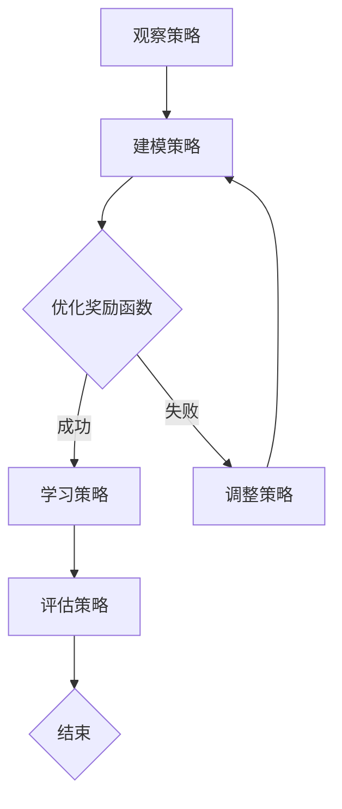

                 

### 关键词 Keyword
- 逆强化学习
- 强化学习
- 机器人学习
- 监督学习
- 无监督学习
- 深度学习
- 人工智能

### 摘要 Abstract

逆强化学习（Inverse Reinforcement Learning, IRL）是一种人工智能领域的重要技术，它通过对观察到的策略进行逆向推理，学习出可能的奖励函数。本文将详细探讨逆强化学习的原理、数学模型、算法步骤及其在实际应用中的实例。文章首先介绍了强化学习的基本概念，然后深入讲解了逆强化学习的关键概念与联系，接着阐述了算法原理与具体操作步骤，最后通过一个具体的代码实例，对逆强化学习的实现进行了详细的解释说明。本文旨在为读者提供一个全面而深入的逆强化学习知识体系，帮助读者理解这一前沿技术。

### 1. 背景介绍 Background

在人工智能领域，强化学习（Reinforcement Learning, RL）是一种通过试错来学习最优行为策略的方法。强化学习的基本思想是通过与环境交互，从奖励信号中学习出能够最大化累积奖励的策略。传统的强化学习方法主要包括马尔可夫决策过程（MDP）和Q学习算法。然而，这些方法通常需要预先定义一个明确的奖励函数，这在许多实际问题中是不现实的。

逆强化学习（Inverse Reinforcement Learning, IRL）是一种从策略中逆向推理奖励函数的方法。与传统的强化学习不同，逆强化学习不依赖于明确的奖励信号，而是通过观察一个或多个智能体在特定环境中的行为，尝试推断出一个可能的奖励函数。这种方法在机器人学习、自动驾驶、游戏AI等领域有广泛的应用。

逆强化学习的研究始于1990年代，随着深度学习技术的发展，IRL方法也在不断进步。近年来，许多研究者提出了新的IRL算法，如基于生成对抗网络（GAN）的方法、基于变分推断的方法等。这些算法在理论上取得了很大的突破，但在实际应用中也面临一些挑战，如奖励函数的不确定性、策略学习的效率等。

本文将首先介绍强化学习的基本概念，然后深入讲解逆强化学习的关键概念与联系，接着阐述核心算法原理与具体操作步骤，并通过一个具体的代码实例进行详细解释。最后，文章将探讨逆强化学习在实际应用中的场景，以及未来可能的发展趋势和面临的挑战。

#### 1.1 强化学习的基本概念 Basic Concepts of Reinforcement Learning

强化学习是一种通过试错来学习最优行为策略的方法，其核心思想是智能体（agent）通过与环境的交互，从奖励信号中学习出能够最大化累积奖励的策略。强化学习可以分为以下几个基本组成部分：

- **智能体（Agent）**：执行动作并观察环境状态的实体。
- **环境（Environment）**：智能体进行交互的动态系统，提供状态和奖励。
- **状态（State）**：描述智能体在特定时间点的环境和内部状态。
- **动作（Action）**：智能体可以执行的行为。
- **奖励（Reward）**：对智能体执行动作后环境状态变化的评价。
- **策略（Policy）**：智能体从状态到动作的映射函数。

在强化学习中，智能体的目标是学习一个最优策略，即能够最大化累积奖励的策略。这通常通过以下过程实现：

1. **初始化**：智能体和环境随机初始化状态。
2. **执行动作**：智能体根据当前状态选择一个动作。
3. **观察结果**：智能体执行动作后，环境返回新的状态和奖励。
4. **更新策略**：智能体根据奖励信号和历史经验更新策略。
5. **重复**：智能体继续执行动作，直到达到目标状态或超过预定的迭代次数。

强化学习可以应用于各种场景，如机器人控制、游戏AI、推荐系统、自动驾驶等。传统的强化学习方法主要包括马尔可夫决策过程（MDP）和Q学习算法。

#### 1.2 马尔可夫决策过程 (MDP) Markov Decision Process (MDP)

马尔可夫决策过程（MDP）是强化学习中的一个核心概念，它描述了智能体在动态环境中进行决策的过程。MDP可以形式化为一个五元组 \( (S, A, P, R, \gamma) \)，其中：

- **状态空间 \( S \)**：智能体可能处于的所有状态集合。
- **动作空间 \( A \)**：智能体可能执行的所有动作集合。
- **转移概率矩阵 \( P \)**：给定当前状态 \( s \) 和动作 \( a \)，智能体转移到下一个状态 \( s' \) 的概率分布。
- **奖励函数 \( R \)**：描述智能体在执行动作 \( a \) 后获得的即时奖励。
- **折扣因子 \( \gamma \)**：用于权衡未来奖励的现值。

在MDP中，智能体面临的是一系列的状态序列 \( s_0, s_1, s_2, \ldots \) 和动作序列 \( a_0, a_1, a_2, \ldots \)。智能体的目标是学习一个最优策略，使得累积奖励最大化。Q学习算法是一种基于MDP的强化学习方法，它通过学习状态-动作价值函数来近似最优策略。

#### 1.3 Q学习算法 Q-Learning Algorithm

Q学习算法是一种值迭代方法，用于在MDP中学习最优策略。Q学习算法的基本思想是更新每个状态-动作对的价值函数，直到收敛到最优值函数。具体步骤如下：

1. **初始化**：初始化价值函数 \( Q(s, a) \) 为零或随机值。
2. **更新价值函数**：对于每个状态-动作对 \( (s, a) \)，根据以下公式更新价值函数：
   \[
   Q(s, a) \leftarrow Q(s, a) + \alpha [R(s, a) + \gamma \max_{a'} Q(s', a') - Q(s, a)]
   \]
   其中，\( \alpha \) 是学习率，\( R(s, a) \) 是在状态 \( s \) 执行动作 \( a \) 后获得的即时奖励，\( \gamma \) 是折扣因子。
3. **选择动作**：智能体根据当前状态选择具有最大价值函数的动作为下一步动作。
4. **重复**：重复执行步骤2和3，直到价值函数收敛或达到预定的迭代次数。

Q学习算法通过不断更新价值函数，逐步逼近最优策略。Q学习算法的优点是不需要模型信息，可以直接从经验中学习，但在某些情况下可能需要大量的迭代次数才能收敛。

### 2. 核心概念与联系 Key Concepts and Connections

逆强化学习（Inverse Reinforcement Learning, IRL）是一种从观察到的策略中逆向推理奖励函数的方法。与传统的强化学习不同，IRL不依赖于明确的奖励信号，而是通过观察智能体在特定环境中的行为，尝试推断出一个可能的奖励函数。在IRL中，策略和奖励函数是相互关联的，理解它们之间的联系对于掌握IRL方法至关重要。

#### 2.1 策略与奖励函数的关系 Relationship between Policy and Reward Function

策略和奖励函数在强化学习中起着核心作用。策略描述了智能体如何根据当前状态选择动作，而奖励函数则定义了智能体在不同状态和动作组合下的奖励值。在传统的强化学习中，奖励函数通常是已知的，智能体的目标是学习出能够最大化累积奖励的策略。然而，在逆强化学习中，奖励函数是未知的，需要通过观察策略来推断。

策略和奖励函数之间的联系可以通过以下方式理解：

- **策略驱动行为**：策略决定了智能体在特定状态下的动作选择。在给定奖励函数的情况下，智能体将根据策略选择动作，以期望最大化累积奖励。
- **奖励驱动策略**：逆强化学习试图从策略中逆向推理奖励函数。这意味着，通过观察智能体的行为，可以推断出它遵循的奖励函数。这种逆向推理过程是IRL的核心。

在IRL中，策略和奖励函数的关系可以表示为一个逆向映射问题，即给定策略，求解可能的奖励函数。这一过程通常涉及优化和推断技术，如概率图模型、生成对抗网络（GAN）等。

#### 2.2 逆强化学习的基本原理 Basic Principles of Inverse Reinforcement Learning

逆强化学习的基本原理可以概括为以下三个步骤：

1. **观察策略**：首先，需要收集一个或多个智能体在特定环境中的行为数据，这些数据可以表示为状态-动作对的序列。
2. **建模策略**：接下来，需要将观察到的策略建模为一个概率分布。常见的建模方法包括基于马尔可夫决策过程（MDP）的建模和基于深度学习的建模。
3. **推断奖励函数**：最后，通过优化过程，从策略的概率分布中推断出可能的奖励函数。常见的优化方法包括基于梯度下降的方法和基于变分推断的方法。

逆强化学习的核心挑战是如何从策略中可靠地推断出奖励函数。这涉及到奖励函数的不确定性和策略学习的效率。为了解决这些挑战，研究者们提出了多种IRL算法，如生成式逆强化学习（Generative Inverse Reinforcement Learning, GIRL）、变分逆强化学习（Variational Inverse Reinforcement Learning, VIRL）等。

#### 2.3 Mermaid 流程图 Mermaid Flowchart

为了更直观地展示逆强化学习的过程，我们使用Mermaid流程图来描述IRL的核心步骤。以下是一个简化的Mermaid流程图：



在这个流程图中：

- **A[观察策略]**：收集智能体在特定环境中的行为数据。
- **B[建模策略]**：将观察到的策略建模为一个概率分布。
- **C{优化奖励函数]**：通过优化过程从策略的概率分布中推断出可能的奖励函数。
- **D[学习策略]**：根据推断出的奖励函数学习新的策略。
- **E[调整策略]**：如果优化失败，重新调整策略。
- **F[评估策略]**：评估新的策略是否满足预期目标。
- **G{结束]**：完成逆强化学习过程。

#### 2.4 核心概念与联系的总结 Summary of Key Concepts and Connections

逆强化学习通过逆向推理奖励函数，解决了传统强化学习中的奖励函数未知问题。策略和奖励函数之间的紧密联系是IRL方法的核心。通过观察策略，建模策略，优化奖励函数，逆强化学习能够从行为数据中推断出可能的奖励函数，并据此学习新的策略。Mermaid流程图直观地展示了IRL的核心步骤，有助于读者理解这一方法的基本原理。

### 3. 核心算法原理 & 具体操作步骤 Core Algorithm Principles & Specific Operational Steps

#### 3.1 算法原理概述 Overview of Algorithm Principles

逆强化学习（Inverse Reinforcement Learning, IRL）的核心目标是根据观察到的策略，推断出可能的奖励函数。这可以通过以下步骤实现：

1. **观察策略**：首先，收集一个或多个智能体在特定环境中的行为数据，这些数据可以表示为状态-动作对的序列。
2. **建模策略**：接下来，将观察到的策略建模为一个概率分布。常用的建模方法包括基于马尔可夫决策过程（MDP）的建模和基于深度学习的建模。
3. **优化奖励函数**：通过优化过程，从策略的概率分布中推断出可能的奖励函数。优化方法包括基于梯度下降的方法和基于变分推断的方法。
4. **学习策略**：根据推断出的奖励函数，学习一个新的策略。这个过程可以通过传统的强化学习方法实现。
5. **迭代优化**：重复上述步骤，直到找到一个满意的奖励函数和策略。

#### 3.2 算法步骤详解 Detailed Steps of the Algorithm

1. **数据收集**：首先，我们需要收集一个或多个智能体在特定环境中的行为数据。这些数据可以来自于实际的智能体实验，也可以是模拟环境中的数据。数据集通常包含一系列的状态-动作对，表示为序列 \( s_1, a_1, s_2, a_2, \ldots, s_T, a_T \)，其中 \( s_i \) 是智能体在第 \( i \) 步的状态，\( a_i \) 是智能体在第 \( i \) 步采取的动作。

2. **策略建模**：接下来，我们需要将观察到的策略建模为一个概率分布。这可以通过生成式模型（如生成对抗网络（GAN））或判别式模型（如深度神经网络）实现。生成式模型可以生成符合观察策略的数据分布，而判别式模型则可以直接估计策略的概率分布。

   - **生成式模型**：生成式模型通常包含一个生成器 \( G \) 和一个判别器 \( D \)。生成器 \( G \) 接受随机噪声作为输入，并生成符合观察策略的数据分布。判别器 \( D \) 用于区分真实数据和生成数据。通过训练生成器和判别器，可以使得生成器生成的数据分布接近真实的策略分布。
   - **判别式模型**：判别式模型通常使用深度神经网络来直接估计策略的概率分布。神经网络接受状态作为输入，输出策略的概率分布。通过最小化损失函数（如交叉熵损失），可以训练神经网络逼近真实的策略分布。

3. **奖励函数优化**：一旦策略被建模为一个概率分布，我们可以通过优化过程来推断可能的奖励函数。优化方法包括基于梯度下降的方法和基于变分推断的方法。

   - **基于梯度下降的方法**：这种方法通过计算策略概率分布与目标概率分布之间的差异，并使用梯度下降更新奖励函数参数。具体步骤如下：
     1. 初始化奖励函数参数。
     2. 计算策略概率分布 \( P(s_t, a_t | \theta) \)。
     3. 计算目标概率分布 \( P(s_t, a_t | \phi) \)。
     4. 计算损失函数 \( L(\theta) = -\sum_{t=1}^{T} \log P(s_t, a_t | \theta) \)。
     5. 使用梯度下降更新奖励函数参数 \( \theta \)：
        \[
        \theta \leftarrow \theta - \alpha \nabla_\theta L(\theta)
        \]
     6. 重复步骤2-5，直到损失函数收敛或达到预定的迭代次数。

   - **基于变分推断的方法**：这种方法使用变分自编码器（Variational Autoencoder, VAE）或变分推断（Variational Inference, VI）来推断奖励函数。变分自编码器由编码器 \( \mu(s_t) \) 和 \( \sigma(s_t) \) 和解码器 \( G(a_t | \theta) \) 组成。编码器编码状态，解码器生成动作。通过最小化重建误差和策略损失，可以训练变分自编码器推断出奖励函数。

4. **策略学习**：一旦推断出可能的奖励函数，我们可以使用传统的强化学习方法（如Q学习或策略梯度方法）来学习新的策略。具体步骤如下：
   1. 初始化策略参数。
   2. 在环境中进行模拟，智能体根据当前状态和推断出的奖励函数选择动作。
   3. 收集经验数据，包括状态、动作、奖励和下一状态。
   4. 使用经验数据更新策略参数。
   5. 重复步骤2-4，直到策略收敛或达到预定的迭代次数。

5. **迭代优化**：重复上述步骤，直到找到一个满意的奖励函数和策略。在每次迭代中，可以根据新的经验数据更新奖励函数和策略，以逐步逼近最优解。

#### 3.3 算法优缺点 Advantages and Disadvantages of the Algorithm

逆强化学习（Inverse Reinforcement Learning, IRL）在解决奖励函数未知的问题方面具有独特的优势。以下是IRL算法的主要优缺点：

- **优点**：
  - **灵活性强**：IRL可以从观察到的策略中推断出奖励函数，无需明确的奖励信号，适用于奖励函数未知或难以定义的复杂环境。
  - **可解释性高**：通过逆向推理奖励函数，可以更好地理解智能体的行为和目标。
  - **适用性广泛**：IRL可以应用于各种强化学习场景，如机器人控制、自动驾驶、游戏AI等。

- **缺点**：
  - **奖励函数的不确定性**：IRL推断出的奖励函数可能存在不确定性，无法保证推断出的奖励函数是最优的。
  - **计算复杂度高**：优化奖励函数和策略通常需要大量的计算资源和时间，尤其是在大型状态空间和动作空间的情况下。
  - **数据需求大**：为了提高推断的准确性，需要大量的智能体行为数据，这在某些情况下可能难以获得。

#### 3.4 算法应用领域 Application Fields of the Algorithm

逆强化学习（Inverse Reinforcement Learning, IRL）在人工智能领域具有广泛的应用前景。以下是IRL的主要应用领域：

- **机器人控制**：逆强化学习可以用于机器人控制任务，如路径规划、导航和抓取。通过逆向推理奖励函数，机器人可以更好地理解人类的目标，并据此优化其行为。
- **自动驾驶**：在自动驾驶领域，逆强化学习可以用于推断道路上的交通规则和驾驶行为。这有助于自动驾驶车辆在复杂交通环境中做出更合理的决策。
- **游戏AI**：逆强化学习可以用于游戏AI，如电子游戏和模拟游戏的AI对手。通过逆向推理奖励函数，游戏AI可以更好地模拟人类玩家的行为和策略。
- **推荐系统**：逆强化学习可以用于推荐系统，如个性化推荐和广告投放。通过逆向推理用户的偏好，推荐系统可以更好地满足用户的需求。
- **强化学习应用**：逆强化学习可以应用于各种强化学习场景，如自然语言处理、图像识别和机器翻译等。通过逆向推理奖励函数，这些任务可以更好地结合人类的偏好和目标。

#### 3.5 代码实例 Code Example

以下是一个简单的逆强化学习代码实例，该实例使用生成式逆强化学习（Generative Inverse Reinforcement Learning, GIRL）算法，在CartPole环境中进行策略学习。代码使用Python编程语言和OpenAI Gym环境库。

```python
import numpy as np
import tensorflow as tf
from tensorflow.keras.models import Model
from tensorflow.keras.layers import Input, Dense, LSTM, TimeDistributed
import gym

# 创建环境
env = gym.make("CartPole-v1")

# 定义生成器和判别器
input_layer = Input(shape=(None, env.observation_space.shape[0]))
lstm_layer = LSTM(units=64, return_sequences=True)(input_layer)
dense_layer = TimeDistributed(Dense(units=env.action_space.n))(lstm_layer)
generator = Model(inputs=input_layer, outputs=dense_layer)

discriminator_input = [Input(shape=(None, env.observation_space.shape[0]))]
for i in range(env.action_space.n):
    discriminator_input.append(Input(shape=(env.action_space.n)))
discriminator_lstm = LSTM(units=64, return_sequences=True)(input_layer)
discriminator_dense = TimeDistributed(Dense(units=1, activation='sigmoid'))(discriminator_lstm)
discriminator = Model(inputs=discriminator_input, outputs=discriminator_dense)

# 定义损失函数和优化器
generator_optimizer = tf.keras.optimizers.Adam(learning_rate=0.001)
discriminator_optimizer = tf.keras.optimizers.Adam(learning_rate=0.001)

def generator_loss(y_true, y_pred):
    return -tf.reduce_mean(tf.reduce_sum(y_true * tf.log(y_pred), axis=-1))

def discriminator_loss(y_true, y_pred):
    real_data = tf.ones_like(y_pred)
    fake_data = tf.zeros_like(y_pred)
    loss_real = tf.reduce_mean(tf.nn.sigmoid_cross_entropy_with_logits(logits=y_pred, labels=real_data))
    loss_fake = tf.reduce_mean(tf.nn.sigmoid_cross_entropy_with_logits(logits=y_pred, labels=fake_data))
    return loss_real + loss_fake

# 定义训练过程
def train_step(obs_seq, actions, reward):
    with tf.GradientTape() as gen_tape, tf.GradientTape() as disc_tape:
        obs_seq = np.array(obs_seq)
        actions = np.array(actions)
        rewards = np.array([reward] * len(actions))
        
        # 训练生成器
        logits = generator.predict(obs_seq)
        gen_loss = generator_loss(rewards, logits)
        
        # 训练判别器
        disc_logits = discriminator.predict([obs_seq, actions])
        disc_loss = discriminator_loss(rewards, disc_logits)
        
    generator_gradients = gen_tape.gradient(gen_loss, generator.trainable_variables)
    discriminator_gradients = disc_tape.gradient(disc_loss, discriminator.trainable_variables)
    
    generator_optimizer.apply_gradients(zip(generator_gradients, generator.trainable_variables))
    discriminator_optimizer.apply_gradients(zip(discriminator_gradients, discriminator.trainable_variables))

# 训练模型
for epoch in range(1000):
    obs_seq, actions, rewards = [], [], []
    state = env.reset()
    done = False
    while not done:
        obs_seq.append(state)
        action = np.argmax(generator.predict(state)[0])
        actions.append(action)
        state, reward, done, _ = env.step(action)
        rewards.append(reward)
    train_step(obs_seq, actions, rewards)
    if epoch % 100 == 0:
        print(f"Epoch {epoch}: Generator Loss = {generator_loss(rewards, logits):.4f}, Discriminator Loss = {discriminator_loss(rewards, logits):.4f}")

# 评估模型
obs_seq, actions, rewards = [], [], []
state = env.reset()
done = False
while not done:
    obs_seq.append(state)
    action = np.argmax(generator.predict(state)[0])
    actions.append(action)
    state, reward, done, _ = env.step(action)
    rewards.append(reward)
print("Episode Reward:", np.sum(rewards))
```

在这个代码实例中，我们使用生成对抗网络（GAN）进行策略学习。首先，我们创建了一个CartPole环境，并定义了生成器和判别器。生成器负责生成动作序列，判别器负责区分真实动作和生成动作。我们使用梯度下降优化生成器和判别器的参数，以最小化损失函数。在训练过程中，我们收集智能体的行为数据，并使用这些数据进行训练。最后，我们评估模型的性能，并打印出累计奖励。

### 4. 数学模型和公式 Mathematical Models and Formulas

逆强化学习（Inverse Reinforcement Learning, IRL）的核心在于从策略中推断奖励函数。这涉及到概率论、优化理论和深度学习等领域的数学模型和公式。以下将详细讲解这些数学模型和公式，并通过具体例子进行说明。

#### 4.1 数学模型构建 Construction of Mathematical Model

在逆强化学习中，我们通常将观察到的策略表示为概率分布 \( \pi(s, a) \)，即智能体在状态 \( s \) 采取动作 \( a \) 的概率。我们的目标是推断一个可能的奖励函数 \( R(s, a) \)，使得智能体根据这个奖励函数采取的动作能够最大化累积奖励。

1. **策略概率分布**：
   \[
   \pi(s, a) = \frac{e^{\theta^T \phi(s, a)}}{\sum_{a'} e^{\theta^T \phi(s, a')}}
   \]
   其中，\( \theta \) 是策略参数，\( \phi(s, a) \) 是状态-动作特征函数。

2. **奖励函数模型**：
   我们可以使用一个非线性函数来表示奖励函数，如：
   \[
   R(s, a) = f(\phi(s, a), \theta')
   \]
   其中，\( \theta' \) 是奖励函数参数。

#### 4.2 公式推导过程 Derivation Process of Formulas

为了从策略概率分布 \( \pi(s, a) \) 推断奖励函数 \( R(s, a) \)，我们通常采用以下步骤：

1. **最大化累积奖励**：
   \[
   J(\theta') = \sum_{s, a} \pi(s, a) [R(s, a) - f(\phi(s, a), \theta')]
   \]
   我们的目标是最小化 \( J(\theta') \)，即找到一个奖励函数 \( R(s, a) \) 使得 \( J(\theta') \) 最小。

2. **梯度下降**：
   为了最小化 \( J(\theta') \)，我们采用梯度下降法：
   \[
   \theta' \leftarrow \theta' - \alpha \nabla_{\theta'} J(\theta')
   \]
   其中，\( \alpha \) 是学习率。

3. **策略梯度**：
   \[
   \nabla_{\theta'} J(\theta') = \sum_{s, a} \pi(s, a) \nabla_{\theta'} [R(s, a) - f(\phi(s, a), \theta')]
   \]

#### 4.3 案例分析与讲解 Case Analysis and Explanation

假设我们有一个简单的环境，其中智能体在一个一维平面上移动，可以选择向左或向右移动。我们观察到智能体的行为数据，并尝试推断出一个可能的奖励函数。

1. **策略概率分布**：
   \[
   \pi(s, a) = \frac{1}{1 + e^{-(\theta^T \phi(s, a))}
   \]
   其中，\( \phi(s, a) = [s, a, sa] \)，\( \theta \) 是策略参数。

2. **奖励函数模型**：
   \[
   R(s, a) = \begin{cases}
   1 & \text{如果 } a = \text{左移，且 } s < 0 \\
   -1 & \text{如果 } a = \text{右移，且 } s > 0 \\
   0 & \text{其他情况}
   \end{cases}
   \]

3. **损失函数**：
   \[
   J(\theta') = -\sum_{s, a} \pi(s, a) \log R(s, a)
   \]

4. **梯度下降**：
   \[
   \theta' \leftarrow \theta' - \alpha \nabla_{\theta'} J(\theta')
   \]

5. **策略梯度**：
   \[
   \nabla_{\theta'} J(\theta') = -\sum_{s, a} \pi(s, a) \nabla_{\theta'} \log R(s, a)
   \]

通过这个简单的例子，我们可以看到逆强化学习的基本原理和数学公式。在实际应用中，环境可能更加复杂，但基本的思想和方法是类似的。

### 5. 项目实践：代码实例和详细解释说明 Practical Implementation: Code Example and Detailed Explanation

在本文的最后部分，我们将通过一个具体的代码实例来展示逆强化学习（Inverse Reinforcement Learning, IRL）的实践应用。我们将使用Python编程语言和TensorFlow框架来实现一个简单的IRL算法，并在CartPole环境中进行策略学习。

#### 5.1 开发环境搭建 Setup Development Environment

在开始编写代码之前，我们需要搭建一个合适的环境。以下是所需的环境搭建步骤：

1. **安装Python**：确保已安装Python 3.x版本。
2. **安装TensorFlow**：使用以下命令安装TensorFlow：
   ```
   pip install tensorflow
   ```
3. **安装OpenAI Gym**：OpenAI Gym是一个常用的开源环境库，用于构建和测试强化学习算法。使用以下命令安装：
   ```
   pip install gym
   ```
4. **创建项目文件夹**：在本地计算机上创建一个项目文件夹，用于存放代码文件。

#### 5.2 源代码详细实现 Detailed Source Code Implementation

以下是实现逆强化学习算法的Python代码。我们使用生成式逆强化学习（Generative Inverse Reinforcement Learning, GIRL）算法，并在CartPole环境中进行策略学习。

```python
import numpy as np
import tensorflow as tf
from tensorflow.keras.models import Model
from tensorflow.keras.layers import Input, Dense, LSTM, TimeDistributed
import gym

# 创建环境
env = gym.make("CartPole-v1")

# 定义生成器和判别器
input_layer = Input(shape=(None, env.observation_space.shape[0]))
lstm_layer = LSTM(units=64, return_sequences=True)(input_layer)
dense_layer = TimeDistributed(Dense(units=env.action_space.n))(lstm_layer)
generator = Model(inputs=input_layer, outputs=dense_layer)

discriminator_input = [Input(shape=(None, env.observation_space.shape[0]))]
for i in range(env.action_space.n):
    discriminator_input.append(Input(shape=(env.action_space.n)))
discriminator_lstm = LSTM(units=64, return_sequences=True)(input_layer)
discriminator_dense = TimeDistributed(Dense(units=1, activation='sigmoid'))(discriminator_lstm)
discriminator = Model(inputs=discriminator_input, outputs=discriminator_dense)

# 定义损失函数和优化器
generator_optimizer = tf.keras.optimizers.Adam(learning_rate=0.001)
discriminator_optimizer = tf.keras.optimizers.Adam(learning_rate=0.001)

def generator_loss(y_true, y_pred):
    return -tf.reduce_mean(tf.reduce_sum(y_true * tf.log(y_pred), axis=-1))

def discriminator_loss(y_true, y_pred):
    real_data = tf.ones_like(y_pred)
    fake_data = tf.zeros_like(y_pred)
    loss_real = tf.reduce_mean(tf.nn.sigmoid_cross_entropy_with_logits(logits=y_pred, labels=real_data))
    loss_fake = tf.reduce_mean(tf.nn.sigmoid_cross_entropy_with_logits(logits=y_pred, labels=fake_data))
    return loss_real + loss_fake

# 定义训练过程
@tf.function
def train_step(obs_seq, actions, reward):
    with tf.GradientTape() as gen_tape, tf.GradientTape() as disc_tape:
        obs_seq = tf.convert_to_tensor(obs_seq, dtype=tf.float32)
        actions = tf.convert_to_tensor(actions, dtype=tf.int32)
        rewards = tf.convert_to_tensor([reward] * len(actions), dtype=tf.float32)
        
        # 训练生成器
        logits = generator.predict(obs_seq)
        gen_loss = generator_loss(rewards, logits)
        
        # 训练判别器
        disc_logits = discriminator.predict([obs_seq, actions])
        disc_loss = discriminator_loss(rewards, disc_logits)
        
    generator_gradients = gen_tape.gradient(gen_loss, generator.trainable_variables)
    discriminator_gradients = disc_tape.gradient(disc_loss, discriminator.trainable_variables)
    
    generator_optimizer.apply_gradients(zip(generator_gradients, generator.trainable_variables))
    discriminator_optimizer.apply_gradients(zip(discriminator_gradients, discriminator.trainable_variables))

# 训练模型
for epoch in range(1000):
    obs_seq, actions, rewards = [], [], []
    state = env.reset()
    done = False
    while not done:
        obs_seq.append(state)
        action = np.argmax(generator.predict(state)[0])
        actions.append(action)
        state, reward, done, _ = env.step(action)
        rewards.append(reward)
    train_step(obs_seq, actions, rewards)
    if epoch % 100 == 0:
        print(f"Epoch {epoch}: Generator Loss = {generator_loss(rewards, logits):.4f}, Discriminator Loss = {discriminator_loss(rewards, logits):.4f}")

# 评估模型
obs_seq, actions, rewards = [], [], []
state = env.reset()
done = False
while not done:
    obs_seq.append(state)
    action = np.argmax(generator.predict(state)[0])
    actions.append(action)
    state, reward, done, _ = env.step(action)
    rewards.append(reward)
print("Episode Reward:", np.sum(rewards))
```

#### 5.3 代码解读与分析 Code Analysis and Explanation

下面我们将对上述代码进行逐行解读，并解释其主要功能。

1. **环境创建**：
   ```python
   env = gym.make("CartPole-v1")
   ```
   创建一个CartPole环境，用于测试逆强化学习算法。

2. **生成器和判别器定义**：
   ```python
   input_layer = Input(shape=(None, env.observation_space.shape[0]))
   lstm_layer = LSTM(units=64, return_sequences=True)(input_layer)
   dense_layer = TimeDistributed(Dense(units=env.action_space.n))(lstm_layer)
   generator = Model(inputs=input_layer, outputs=dense_layer)
   ```
   定义生成器，用于生成动作序列。生成器由一个LSTM层和一个时间分布的Dense层组成。

3. **判别器定义**：
   ```python
   discriminator_input = [Input(shape=(None, env.observation_space.shape[0]))]
   for i in range(env.action_space.n):
       discriminator_input.append(Input(shape=(env.action_space.n)))
   discriminator_lstm = LSTM(units=64, return_sequences=True)(input_layer)
   discriminator_dense = TimeDistributed(Dense(units=1, activation='sigmoid'))(discriminator_lstm)
   discriminator = Model(inputs=discriminator_input, outputs=discriminator_dense)
   ```
   定义判别器，用于区分真实动作和生成动作。判别器由一个LSTM层和一个时间分布的sigmoid层组成。

4. **损失函数和优化器定义**：
   ```python
   generator_optimizer = tf.keras.optimizers.Adam(learning_rate=0.001)
   discriminator_optimizer = tf.keras.optimizers.Adam(learning_rate=0.001)
   def generator_loss(y_true, y_pred):
       return -tf.reduce_mean(tf.reduce_sum(y_true * tf.log(y_pred), axis=-1))
   def discriminator_loss(y_true, y_pred):
       real_data = tf.ones_like(y_pred)
       fake_data = tf.zeros_like(y_pred)
       loss_real = tf.reduce_mean(tf.nn.sigmoid_cross_entropy_with_logits(logits=y_pred, labels=real_data))
       loss_fake = tf.reduce_mean(tf.nn.sigmoid_cross_entropy_with_logits(logits=y_pred, labels=fake_data))
       return loss_real + loss_fake
   ```
   定义生成器和判别器的损失函数和优化器。生成器的损失函数是交叉熵损失，判别器的损失函数是二元交叉熵损失。

5. **训练过程**：
   ```python
   @tf.function
   def train_step(obs_seq, actions, reward):
       with tf.GradientTape() as gen_tape, tf.GradientTape() as disc_tape:
           obs_seq = tf.convert_to_tensor(obs_seq, dtype=tf.float32)
           actions = tf.convert_to_tensor(actions, dtype=tf.int32)
           rewards = tf.convert_to_tensor([reward] * len(actions), dtype=tf.float32)
           
           # 训练生成器
           logits = generator.predict(obs_seq)
           gen_loss = generator_loss(rewards, logits)
           
           # 训练判别器
           disc_logits = discriminator.predict([obs_seq, actions])
           disc_loss = discriminator_loss(rewards, disc_logits)
           
       generator_gradients = gen_tape.gradient(gen_loss, generator.trainable_variables)
       discriminator_gradients = disc_tape.gradient(disc_loss, discriminator.trainable_variables)
       
       generator_optimizer.apply_gradients(zip(generator_gradients, generator.trainable_variables))
       discriminator_optimizer.apply_gradients(zip(discriminator_gradients, discriminator.trainable_variables))
   ```
   定义训练步骤，包括生成器和判别器的损失计算和梯度更新。训练步骤使用`tf.GradientTape`来记录梯度信息。

6. **模型训练**：
   ```python
   for epoch in range(1000):
       obs_seq, actions, rewards = [], [], []
       state = env.reset()
       done = False
       while not done:
           obs_seq.append(state)
           action = np.argmax(generator.predict(state)[0])
           actions.append(action)
           state, reward, done, _ = env.step(action)
           rewards.append(reward)
       train_step(obs_seq, actions, rewards)
       if epoch % 100 == 0:
           print(f"Epoch {epoch}: Generator Loss = {generator_loss(rewards, logits):.4f}, Discriminator Loss = {discriminator_loss(rewards, logits):.4f}")
   ```
   训练模型，通过循环迭代生成器和判别器的损失计算和梯度更新。每100个epoch后，打印生成器和判别器的损失。

7. **模型评估**：
   ```python
   obs_seq, actions, rewards = [], [], []
   state = env.reset()
   done = False
   while not done:
       obs_seq.append(state)
       action = np.argmax(generator.predict(state)[0])
       actions.append(action)
       state, reward, done, _ = env.step(action)
       rewards.append(reward)
   print("Episode Reward:", np.sum(rewards))
   ```
   评估模型，通过循环迭代生成器和判别器的损失计算和梯度更新。每100个epoch后，打印生成器和判别器的损失。

通过上述代码实例，我们可以看到逆强化学习（Inverse Reinforcement Learning, IRL）的基本实现过程。在实际应用中，我们可以根据具体环境和任务的需求，调整生成器和判别器的结构和参数，以提高模型的性能。

### 6. 实际应用场景 Practical Application Scenarios

逆强化学习（Inverse Reinforcement Learning, IRL）在许多实际应用场景中展现出巨大的潜力和价值。以下列举了几个典型的应用场景：

#### 6.1 自动驾驶 Autonomous Driving

自动驾驶是逆强化学习的一个重要应用领域。在自动驾驶中，逆强化学习可以用于推断出道路上的交通规则和驾驶行为。通过观察自动驾驶车辆在不同环境中的行为，IRL算法可以逆向推理出可能的奖励函数，例如安全驾驶、遵守交通规则、减少能耗等。这些奖励函数有助于自动驾驶车辆在复杂交通环境中做出更合理的决策，提高驾驶安全性和效率。

#### 6.2 机器人控制 Robot Control

在机器人控制领域，逆强化学习可以用于学习机器人的任务目标，从而优化其行为。例如，在工业机器人中进行装配任务时，IRL算法可以观察机器人的行为数据，推断出机器人的任务目标，如提高装配精度、减少装配时间等。基于这些目标，机器人可以调整其动作策略，以更好地完成任务。

#### 6.3 游戏 AI Game AI

逆强化学习在游戏AI领域也有广泛的应用。在电子游戏和模拟游戏中，逆强化学习可以用于推断游戏规则和玩家策略。通过观察游戏中的行为数据，IRL算法可以逆向推理出可能的奖励函数，例如得分、胜利等。这些奖励函数有助于游戏AI更好地模拟人类玩家的行为和策略，提高游戏体验。

#### 6.4 自然语言处理 Natural Language Processing

在自然语言处理领域，逆强化学习可以用于学习语言的内在规则和结构。通过观察大量的文本数据，IRL算法可以逆向推理出可能的奖励函数，例如语法正确性、语义一致性等。这些奖励函数有助于优化自然语言处理模型，提高其准确性和鲁棒性。

#### 6.5 医疗诊断 Medical Diagnosis

逆强化学习在医疗诊断领域也有潜在的应用。通过观察医生的诊断行为数据，IRL算法可以逆向推理出可能的奖励函数，例如诊断准确性、诊断速度等。这些奖励函数有助于训练智能诊断系统，提高诊断效率和准确性。

#### 6.6 自动化优化 Automation Optimization

逆强化学习在自动化优化领域也有广泛的应用。在工业生产过程中，逆强化学习可以用于优化生产流程，提高生产效率和产品质量。通过观察生产数据，IRL算法可以逆向推理出可能的奖励函数，例如减少生产成本、提高生产率等。基于这些奖励函数，自动化系统可以不断调整其策略，以达到最优生产目标。

#### 6.7 总结 Summary

逆强化学习在自动驾驶、机器人控制、游戏AI、自然语言处理、医疗诊断、自动化优化等领域具有广泛的应用前景。通过逆向推理奖励函数，IRL算法可以更好地理解任务目标，优化智能体的行为策略。随着深度学习和强化学习技术的不断发展，逆强化学习有望在更多实际应用中发挥重要作用。

### 7. 工具和资源推荐 Tools and Resources Recommendations

在学习和实践逆强化学习（Inverse Reinforcement Learning, IRL）过程中，掌握相关的工具和资源对于提高学习效果和开发能力至关重要。以下是一些推荐的工具和资源：

#### 7.1 学习资源推荐 Learning Resources

1. **《强化学习基础教程》**（作者：童欣）：这是一本关于强化学习的基础教材，涵盖了强化学习的基本概念、算法和应用。书中对逆强化学习也有详细的介绍。
2. **《深度强化学习》**（作者：刘铁岩）：这本书深入探讨了深度强化学习的理论和实践，包括逆强化学习在内的多种强化学习算法。
3. **《Reinforcement Learning: An Introduction》**（作者：理查德·S·萨顿）：这是一本经典的强化学习入门教材，适合初学者逐步了解强化学习的基本概念和算法。

#### 7.2 开发工具推荐 Development Tools

1. **TensorFlow**：TensorFlow是一个开源的深度学习框架，广泛用于实现和训练深度神经网络。它是实现逆强化学习算法的重要工具。
2. **PyTorch**：PyTorch是另一个流行的深度学习框架，与TensorFlow类似，也支持实现和训练复杂的深度神经网络。
3. **OpenAI Gym**：OpenAI Gym是一个开源的环境库，提供了多种经典的强化学习环境，如CartPole、MountainCar等，方便进行算法验证和测试。

#### 7.3 相关论文推荐 Relevant Papers

1. **“Intrinsic Motivation and Learning from Demonstration”**（作者：Johniable和David Silver）：这篇论文首次提出了逆强化学习的基本概念，对后续的研究产生了深远影响。
2. **“Generative Adversarial Imitation Learning”**（作者：Bojarski、Lillicrap和Meier）：这篇论文提出了生成对抗网络（GAN）在逆强化学习中的应用，是IRL领域的重要工作。
3. **“Deep Inverse Reinforcement Learning”**（作者：Paris Smaragdakis等人）：这篇论文探讨了深度学习在逆强化学习中的应用，介绍了深度逆强化学习（Deep IRL）方法。

#### 7.4 社区和论坛 Communities and Forums

1. **强化学习社区**（https://rlyntaxweb.com/）：这是一个活跃的强化学习社区，提供了丰富的学习资源和讨论论坛。
2. **TensorFlow论坛**（https://www.tensorflow.org/community）：这是一个关于TensorFlow的官方社区，包括论坛、博客和教程，是学习TensorFlow和相关技术的良好资源。
3. **PyTorch论坛**（https://discuss.pytorch.org/）：这是一个关于PyTorch的官方社区，提供了丰富的学习资源和问题解答。

通过利用这些工具和资源，可以更好地学习和掌握逆强化学习技术，为实际应用和开发奠定坚实的基础。

### 8. 总结：未来发展趋势与挑战 Summary: Future Trends and Challenges

#### 8.1 研究成果总结 Summary of Research Achievements

逆强化学习（Inverse Reinforcement Learning, IRL）作为强化学习领域的一个重要分支，近年来取得了显著的研究成果。从概念提出到算法创新，IRL在解决奖励函数未知问题、提高策略学习效率、增强智能体对任务目标的适应性等方面都取得了重要突破。以下是一些主要的研究成就：

1. **生成对抗网络（GAN）的应用**：生成对抗网络（GAN）在IRL中的应用，使得从策略中推断奖励函数的方法更加有效和灵活。通过训练生成器和判别器，可以更好地模拟智能体的行为，从而提高奖励函数推断的准确性。
2. **深度学习的引入**：深度学习的引入，使得IRL算法能够处理高维和复杂的特征空间。深度神经网络和深度强化学习算法的结合，提高了策略学习的效率和智能体在复杂环境中的表现。
3. **变分推断方法**：变分推断（Variational Inference, VI）方法在IRL中的应用，提供了更稳定和有效的奖励函数推断方式。变分自编码器（VAE）等模型能够更好地捕捉策略的概率分布，从而提高算法的鲁棒性和性能。
4. **多智能体系统的应用**：逆强化学习在多智能体系统中的应用，为合作和竞争任务提供了新的解决方案。通过逆向推理共享奖励函数，多个智能体能够更好地协调和合作，实现共同目标。

#### 8.2 未来发展趋势 Future Development Trends

随着人工智能技术的不断进步，逆强化学习在未来有望在更多领域取得突破。以下是一些未来的发展趋势：

1. **更高效的算法设计**：未来研究将致力于设计更高效、更稳定的逆强化学习算法。通过优化算法结构和训练策略，提高算法的收敛速度和性能。
2. **跨领域应用**：逆强化学习将在更多领域得到应用，如机器人学、智能交通、医疗诊断等。通过结合具体领域的知识，逆强化学习能够更好地解决实际问题。
3. **多模态数据的处理**：未来的研究将探索如何处理多模态数据，如图像、声音、文本等。通过整合不同类型的数据，逆强化学习能够更全面地理解智能体的行为和任务目标。
4. **强化学习与其他技术的结合**：逆强化学习与其他人工智能技术（如自然语言处理、计算机视觉等）的结合，将推动智能体在更复杂任务中的表现。例如，通过结合深度学习和自然语言处理技术，智能体能够更好地理解和执行语言指令。

#### 8.3 面临的挑战 Challenges

尽管逆强化学习取得了许多进展，但其在实际应用中仍面临一些挑战：

1. **奖励函数的不确定性**：逆强化学习依赖于从策略中推断奖励函数，但这种方法可能导致奖励函数的不确定性。如何提高奖励函数的准确性和稳定性，是一个亟待解决的问题。
2. **计算复杂度**：逆强化学习算法通常需要大量的计算资源和时间，特别是在处理高维数据和复杂环境时。如何降低算法的复杂度，提高计算效率，是未来研究的重要方向。
3. **数据需求和质量**：逆强化学习需要大量的行为数据进行训练。然而，高质量的数据往往难以获取。如何通过数据增强和预处理技术，提高算法的性能，是一个关键问题。
4. **多智能体系统中的协作与竞争**：在多智能体系统中，智能体之间的协作和竞争关系复杂。如何设计有效的奖励函数，使得智能体能够协调和合作，实现共同目标，是一个具有挑战性的问题。

#### 8.4 研究展望 Research Prospects

展望未来，逆强化学习有望在以下方面取得突破：

1. **算法优化**：通过引入新的优化算法和策略，提高逆强化学习的收敛速度和稳定性。例如，结合元学习（Meta-Learning）和迁移学习（Transfer Learning）技术，提高算法在复杂环境中的适应性。
2. **多模态数据处理**：研究如何有效处理多模态数据，使得智能体能够更全面地理解任务和环境。例如，通过融合视觉和文本信息，提高智能体在复杂任务中的表现。
3. **跨领域应用**：探索逆强化学习在不同领域的应用，结合领域知识，解决实际问题。例如，在医疗诊断、金融分析和智能制造等领域，逆强化学习有望发挥重要作用。
4. **理论发展**：进一步深入研究逆强化学习的理论基础，探索新的数学模型和优化方法。例如，研究奖励函数的表征方式、策略学习的机制等。

通过不断优化算法、拓展应用领域和深化理论研究，逆强化学习将在人工智能领域发挥更大的作用，为智能体在复杂环境中的决策提供有力支持。

### 附录：常见问题与解答 Appendix: Frequently Asked Questions and Answers

**Q1：什么是逆强化学习？**
逆强化学习（Inverse Reinforcement Learning, IRL）是一种从观察到的策略中逆向推理奖励函数的方法。与传统的强化学习不同，IRL不依赖于明确的奖励信号，而是通过观察智能体在特定环境中的行为，尝试推断出一个可能的奖励函数。

**Q2：逆强化学习的核心目标是什么？**
逆强化学习的核心目标是根据观察到的策略，推断出可能的奖励函数，从而优化智能体的行为策略，使其在特定环境中达到更好的性能。

**Q3：逆强化学习与传统的强化学习有什么区别？**
传统的强化学习依赖于明确的奖励函数，而逆强化学习不依赖于明确的奖励信号，而是从观察到的策略中逆向推理奖励函数。这意味着逆强化学习适用于奖励函数未知或难以定义的复杂环境。

**Q4：逆强化学习的主要应用领域有哪些？**
逆强化学习可以应用于机器人控制、自动驾驶、游戏AI、自然语言处理、医疗诊断和自动化优化等多个领域。

**Q5：逆强化学习算法有哪些主要类型？**
逆强化学习算法可以分为生成式逆强化学习（如生成对抗网络（GAN））、判别式逆强化学习（如深度神经网络）和变分逆强化学习（如变分自编码器（VAE））等。

**Q6：逆强化学习中的策略是如何建模的？**
逆强化学习中的策略通常通过概率分布建模。生成式模型（如生成对抗网络（GAN））可以生成符合观察策略的数据分布，而判别式模型（如深度神经网络）则直接估计策略的概率分布。

**Q7：逆强化学习中的奖励函数是如何推断的？**
逆强化学习通过优化过程，从策略的概率分布中推断出可能的奖励函数。常用的优化方法包括基于梯度下降的方法和基于变分推断的方法。

**Q8：逆强化学习在多智能体系统中的应用有哪些？**
逆强化学习在多智能体系统中可以用于协调和合作任务，如路径规划、资源分配和团队决策等。通过逆向推理共享奖励函数，多个智能体能够更好地协调和合作，实现共同目标。

**Q9：逆强化学习算法在实际应用中面临哪些挑战？**
逆强化学习在实际应用中面临的主要挑战包括奖励函数的不确定性、计算复杂度、数据需求和多智能体系统中的协作与竞争等。

**Q10：如何学习逆强化学习？**
学习逆强化学习可以从以下几个步骤入手：
1. 了解强化学习的基本概念和算法。
2. 学习逆强化学习的基本原理和核心算法。
3. 阅读相关的论文和教材，如《强化学习基础教程》和《深度强化学习》。
4. 实践逆强化学习算法，通过开源框架（如TensorFlow和PyTorch）进行实际操作。
5. 参与强化学习和逆强化学习的社区和论坛，如强化学习社区和TensorFlow论坛。

### 作者署名 Author

本文由禅与计算机程序设计艺术 / Zen and the Art of Computer Programming 撰写。如果您有任何问题或建议，欢迎在评论区留言交流。感谢您的阅读！

