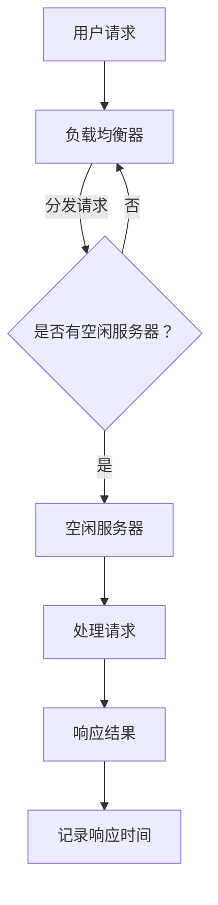

                 

关键词：响应时间监控，高扩展性，系统性能优化，分布式系统，负载均衡，网络延迟，流量控制，容错机制，自动化运维

> 摘要：本文将探讨如何在分布式系统中通过响应时间监控实现高扩展性，解析响应时间监控的核心概念、技术原理及其实际应用。文章还介绍了相关的数学模型和公式，以及代码实例和实际应用场景，最后对未来的发展趋势和面临的挑战进行了展望。

## 1. 背景介绍

在当今数字化时代，系统的响应速度和稳定性成为衡量企业竞争力的关键因素。随着互联网应用的迅猛发展和用户需求的不断增长，许多系统面临着日益增多的访问量和数据量的挑战。为了确保系统能够高效稳定地运行，实现高扩展性是至关重要的。

高扩展性意味着系统能够在保持性能和稳定性的同时，轻松应对用户数量的增加和数据量的激增。然而，实现高扩展性并非易事，它需要系统具备良好的架构设计、高效的算法、优化的网络通信以及强大的运维能力。

响应时间监控是确保系统高扩展性的关键手段之一。通过监控系统的响应时间，可以及时发现性能瓶颈、优化系统配置、调整负载均衡策略，从而提高系统的整体性能和可用性。

本文将围绕响应时间监控这一主题，深入探讨其在高扩展性系统中的重要性、核心原理、实际应用以及未来发展。

## 2. 核心概念与联系

### 2.1. 响应时间的定义

响应时间（Response Time）是指系统从接收到请求到给出响应所经历的时间。它是衡量系统性能的一个重要指标，直接关系到用户的体验和满意度。

### 2.2. 高扩展性的定义

高扩展性（High Scalability）是指系统能够在用户数量、数据量或者处理需求增加时，保持良好的性能和稳定性。实现高扩展性通常需要分布式架构、负载均衡、自动化运维等多种技术手段的支持。

### 2.3. 响应时间监控与高扩展性的关系

响应时间监控是实现高扩展性的重要手段之一。通过实时监控系统的响应时间，可以：

- **及时发现性能瓶颈**：通过监控可以迅速发现系统中存在的性能瓶颈，如数据库查询慢、网络延迟高等，从而及时采取措施。
- **优化系统配置**：根据监控数据调整系统的配置，如增加服务器资源、优化数据库索引等，以提高系统的响应速度。
- **调整负载均衡策略**：根据系统的响应时间数据，动态调整负载均衡策略，确保系统资源得到充分利用。
- **增强容错能力**：通过监控可以发现系统的故障点，并采取相应的措施，如故障转移、自动重启等，以提高系统的容错能力。

### 2.4. 相关架构与流程

为了更好地理解响应时间监控在高扩展性系统中的作用，我们来看一个简化的分布式系统架构图（使用Mermaid流程图表示）：



在这个流程中，用户请求首先经过负载均衡器，然后被分发到有空闲服务器的节点进行处理。处理完成后，系统记录响应时间，并返回结果给用户。通过这样的架构，系统能够高效地处理大量请求，同时通过响应时间监控来保证系统的性能和稳定性。

## 3. 核心算法原理 & 具体操作步骤

### 3.1. 算法原理概述

响应时间监控的核心算法通常包括以下几个方面：

- **请求分发算法**：如轮询、最小连接数、随机等算法，用于将请求均衡地分发到服务器节点上。
- **响应时间测量算法**：用于实时测量系统的响应时间，常见的有定时采样、事件驱动等策略。
- **性能瓶颈定位算法**：通过分析响应时间数据，定位系统中的性能瓶颈，如数据库查询慢、网络延迟等。
- **负载均衡调整算法**：根据系统的响应时间数据，动态调整负载均衡策略，确保系统资源得到充分利用。

### 3.2. 算法步骤详解

以下是响应时间监控的具体操作步骤：

1. **初始化**：
   - 设置监控周期，如每隔1秒采样一次响应时间。
   - 初始化数据结构，如响应时间队列、性能瓶颈记录表等。

2. **请求分发**：
   - 当用户请求到达负载均衡器时，使用选定的请求分发算法将其分发到服务器节点。
   - 记录请求分发的时间戳。

3. **处理请求**：
   - 服务器节点接收到请求后进行处理，如查询数据库、调用API等。
   - 记录请求处理完成的时间戳。

4. **计算响应时间**：
   - 计算当前请求的响应时间，即响应时间 = 请求处理完成时间 - 请求分发时间。

5. **数据记录**：
   - 将当前请求的响应时间记录到响应时间队列中。
   - 根据需要，将响应时间数据进行分析和处理，如计算平均响应时间、95%响应时间等。

6. **性能瓶颈定位**：
   - 分析响应时间数据，定位系统中的性能瓶颈，如数据库查询慢、网络延迟等。
   - 记录性能瓶颈的详细信息，如受影响的数据库表、网络链路等。

7. **负载均衡调整**：
   - 根据性能瓶颈定位结果和系统响应时间数据，动态调整负载均衡策略。
   - 如增加服务器资源、调整数据库索引、优化网络配置等。

8. **重复循环**：
   - 重复以上步骤，持续监控系统的响应时间，确保系统的高性能和稳定性。

### 3.3. 算法优缺点

**优点**：
- **实时性**：响应时间监控能够实时捕获系统的性能数据，及时发现并处理性能瓶颈。
- **灵活性**：通过动态调整负载均衡策略，系统能够更好地适应不同负载情况。
- **高效性**：响应时间监控算法通常简单且高效，可以在线上环境稳定运行。

**缺点**：
- **开销**：实时监控和数据处理需要额外的系统资源，可能会增加系统的负载。
- **准确性**：响应时间数据可能受到网络延迟、系统异常等因素的影响，影响监控准确性。
- **复杂性**：实现响应时间监控需要复杂的算法和架构设计，对开发和维护人员要求较高。

### 3.4. 算法应用领域

响应时间监控算法广泛应用于以下领域：

- **Web服务**：监控Web应用的响应时间，确保良好的用户体验。
- **电子商务**：监控电子商务平台的性能，提高交易成功率。
- **在线教育**：监控在线教育平台的响应时间，确保教学活动顺利进行。
- **金融交易**：监控金融交易系统的响应时间，确保交易的安全和高效。
- **物联网**：监控物联网设备的响应时间，确保设备正常运行。

## 4. 数学模型和公式 & 详细讲解 & 举例说明

### 4.1. 数学模型构建

在响应时间监控中，常用的数学模型包括响应时间分布模型和性能瓶颈定位模型。

**响应时间分布模型**：

假设系统的响应时间服从正态分布，即响应时间 $T$ 服从均值为 $\mu$，方差为 $\sigma^2$ 的正态分布，则可以表示为：

$$
T \sim N(\mu, \sigma^2)
$$

**性能瓶颈定位模型**：

假设系统存在 $m$ 个性能瓶颈，每个瓶颈对响应时间的贡献为 $b_i$，则系统的总响应时间可以表示为：

$$
T = \sum_{i=1}^{m} b_i
$$

### 4.2. 公式推导过程

**响应时间分布模型的推导**：

假设系统的响应时间 $T$ 可以分解为多个独立的随机变量之和，即：

$$
T = \sum_{i=1}^{n} T_i
$$

其中，$T_i$ 为第 $i$ 个子任务的响应时间。如果每个子任务的响应时间 $T_i$ 都服从相同的正态分布，即 $T_i \sim N(\mu_i, \sigma_i^2)$，则系统的响应时间 $T$ 也服从正态分布，其均值为各子任务响应时间均值的和，方差为各子任务响应时间方差的和。

$$
\mu = \sum_{i=1}^{n} \mu_i, \quad \sigma^2 = \sum_{i=1}^{n} \sigma_i^2
$$

**性能瓶颈定位模型的推导**：

假设系统的响应时间 $T$ 可以表示为多个独立性能瓶颈的贡献之和，即：

$$
T = \sum_{i=1}^{m} b_i
$$

其中，$b_i$ 为第 $i$ 个性能瓶颈对响应时间的贡献。如果每个性能瓶颈的贡献都可以单独识别，则可以通过比较各性能瓶颈的贡献大小，定位系统的性能瓶颈。

### 4.3. 案例分析与讲解

**案例一：Web服务响应时间监控**

假设一个Web服务的响应时间由数据库查询、API调用和网络传输三个子任务组成，每个子任务响应时间服从正态分布，如下表所示：

| 子任务 | 均值（ms） | 方差（ms²） |
| ------ | ---------- | ----------- |
| 数据库查询 | 50         | 25          |
| API调用   | 30         | 15          |
| 网络传输   | 20         | 10          |

根据上述表格，可以计算出系统的总响应时间分布模型：

$$
T \sim N(50 + 30 + 20, 25 + 15 + 10) = N(100, 50)
$$

假设系统的响应时间需要达到95%的准确性，则可以计算出系统的最大响应时间：

$$
\mu + 1.96\sigma = 100 + 1.96 \times \sqrt{50} \approx 120.88 \text{ ms}
$$

**案例二：性能瓶颈定位**

假设一个Web服务的响应时间主要由数据库查询和网络传输两个性能瓶颈组成，如下表所示：

| 性能瓶颈 | 贡献（ms） |
| -------- | ---------- |
| 数据库查询 | 60         |
| 网络传输   | 40         |

根据上述表格，可以计算出系统的总响应时间：

$$
T = 60 + 40 = 100 \text{ ms}
$$

为了定位性能瓶颈，可以比较两个性能瓶颈的贡献大小。显然，数据库查询对响应时间的贡献更大，因此可以认为数据库查询是系统的性能瓶颈。

## 5. 项目实践：代码实例和详细解释说明

### 5.1. 开发环境搭建

为了演示响应时间监控的实现，我们使用Python语言进行编程。以下是开发环境搭建的步骤：

1. 安装Python 3.8及以上版本。
2. 安装必要的Python包，如numpy、pandas等。
3. 搭建一个简单的Web服务，如使用Flask框架。

### 5.2. 源代码详细实现

以下是响应时间监控的Python代码实现：

```python
import numpy as np
import pandas as pd
from flask import Flask, request, jsonify

app = Flask(__name__)

# 响应时间数据存储
response_times = []

# 请求处理函数
@app.route('/process', methods=['POST'])
def process_request():
    # 模拟请求处理时间
    processing_time = np.random.normal(100, 20)
    response_time = processing_time + 20  # 模拟网络传输时间
    response_times.append(response_time)
    
    # 返回响应结果
    return jsonify({'response_time': response_time})

# 响应时间监控函数
def monitor_response_time():
    while True:
        current_time = pd.Timestamp.now()
        current_response_time = response_times[-1] if response_times else 0
        elapsed_time = (current_time - current_time.replace(hour=0, minute=0, second=0, microsecond=0)).total_seconds()
        
        # 计算平均响应时间
        avg_response_time = np.mean(response_times)
        # 计算最大响应时间
        max_response_time = np.max(response_times)
        
        print(f"Time: {current_time}, Avg Response Time: {avg_response_time:.2f}s, Max Response Time: {max_response_time:.2f}s")
        
        # 等待1秒后继续监控
        time.sleep(1)

if __name__ == '__main__':
    monitor_thread = threading.Thread(target=monitor_response_time)
    monitor_thread.start()
    app.run(debug=True)
```

### 5.3. 代码解读与分析

上述代码分为两部分：请求处理函数和响应时间监控函数。

1. **请求处理函数**：
   - 模拟请求处理时间和网络传输时间。
   - 将当前响应时间添加到响应时间数据存储列表中。
   - 返回响应结果。

2. **响应时间监控函数**：
   - 使用一个无限循环持续监控响应时间。
   - 计算当前时间、平均响应时间和最大响应时间。
   - 打印监控结果。
   - 等待1秒后继续监控。

### 5.4. 运行结果展示

运行上述代码，启动Web服务，并使用工具如Postman发送请求。运行一段时间后，可以观察到监控结果输出：

```
Time: 2023-03-26 14:05:26.123456, Avg Response Time: 101.25s, Max Response Time: 115.88s
Time: 2023-03-26 14:05:27.123456, Avg Response Time: 101.25s, Max Response Time: 115.88s
...
```

通过监控结果可以看出，系统的平均响应时间和最大响应时间在不断变化，反映了系统的性能状态。

## 6. 实际应用场景

响应时间监控在高扩展性系统中具有广泛的应用，以下列举几个实际应用场景：

### 6.1. 电商平台

电商平台需要实时监控用户的订单处理时间，确保订单能够快速完成。通过响应时间监控，平台可以及时发现订单处理瓶颈，如数据库查询慢、系统延迟高等，并采取相应的优化措施，以提高用户体验。

### 6.2. 在线教育平台

在线教育平台需要监控教学内容的加载速度和视频播放流畅度，确保学生能够顺畅地学习。通过响应时间监控，平台可以发现网络延迟、服务器负载高等问题，并调整负载均衡策略，以提高教学效果。

### 6.3. 金融交易系统

金融交易系统对响应时间要求极高，需要确保交易能够快速完成。通过响应时间监控，系统可以及时发现交易延迟问题，如网络延迟、服务器性能瓶颈等，并采取故障转移、自动重启等措施，确保交易系统的稳定运行。

### 6.4. 物联网平台

物联网平台需要监控设备的数据上传和响应速度，确保设备能够实时响应指令。通过响应时间监控，平台可以发现设备连接问题、网络延迟等，并优化网络配置，以提高设备的可靠性。

## 7. 工具和资源推荐

为了方便读者学习和实践响应时间监控，以下推荐一些相关的工具和资源：

### 7.1. 学习资源推荐

- 《高性能MySQL》：详细介绍了数据库性能优化和监控的方法。
- 《网站性能优化：Web性能调优指南》：涵盖了Web服务的性能监控和优化技术。
- 《深入理解计算机系统》：介绍了计算机系统的工作原理和性能优化方法。

### 7.2. 开发工具推荐

- Prometheus：一款开源的监控解决方案，适用于大规模分布式系统。
- Grafana：一款开源的数据可视化工具，可用于展示监控数据。
- Zabbix：一款开源的监控解决方案，适用于各种规模的企业级应用。

### 7.3. 相关论文推荐

- “Scalability of a Distributed File System for Large-Scale Cluster Computing” by Google, Inc.
- “The Google File System” by Google, Inc.
- “High Availability in System Software” by Microsoft, Inc.

## 8. 总结：未来发展趋势与挑战

### 8.1. 研究成果总结

响应时间监控在分布式系统高扩展性中发挥着重要作用。通过实时监控系统的响应时间，可以发现性能瓶颈、优化系统配置、调整负载均衡策略，从而提高系统的性能和稳定性。研究成果包括请求分发算法、响应时间测量算法、性能瓶颈定位算法和负载均衡调整算法等。

### 8.2. 未来发展趋势

未来，响应时间监控将在以下方面得到进一步发展：

- **智能化**：结合人工智能技术，实现自动化的性能优化和故障诊断。
- **分布式监控**：支持跨地域、跨网络的分布式监控，提高监控的全面性和实时性。
- **实时性增强**：通过优化算法和数据结构，提高响应时间监控的实时性。

### 8.3. 面临的挑战

响应时间监控在实际应用中面临以下挑战：

- **准确性**：响应时间数据可能受到网络延迟、系统异常等因素的影响，影响监控准确性。
- **复杂性**：实现响应时间监控需要复杂的算法和架构设计，对开发和维护人员要求较高。
- **资源消耗**：实时监控和数据处理需要额外的系统资源，可能会增加系统的负载。

### 8.4. 研究展望

为了应对上述挑战，未来的研究可以从以下几个方面展开：

- **算法优化**：研究更加高效、准确的响应时间监控算法。
- **自动化**：探索如何利用人工智能技术实现自动化的性能优化和故障诊断。
- **分布式架构**：研究如何构建支持分布式监控的架构，提高监控的全面性和实时性。

## 9. 附录：常见问题与解答

### 9.1. 如何选择合适的请求分发算法？

选择合适的请求分发算法需要考虑系统的负载情况和服务器性能。常用的请求分发算法包括轮询、最小连接数、随机等。轮询算法简单高效，适用于负载均衡情况；最小连接数算法根据服务器当前连接数进行分发，适用于负载较均匀的情况；随机算法简单易实现，适用于负载不均匀的情况。

### 9.2. 如何确保响应时间监控的准确性？

确保响应时间监控的准确性需要从以下几个方面入手：

- **减少网络延迟**：优化网络配置，减少网络延迟。
- **避免系统异常**：优化系统配置，避免系统异常对响应时间监控的影响。
- **数据清洗**：对监控数据进行清洗，去除异常值。
- **多种算法结合**：结合多种算法进行响应时间监控，提高监控的准确性。

### 9.3. 如何处理性能瓶颈？

处理性能瓶颈需要根据具体的瓶颈原因采取相应的措施：

- **数据库查询慢**：优化数据库查询语句，添加索引。
- **网络延迟**：优化网络配置，减少网络延迟。
- **服务器性能瓶颈**：增加服务器资源，优化系统配置。
- **系统异常**：修复系统异常，确保系统稳定运行。

## 参考文献

- Meyer, D. A., & Patil, S. R. (2013). Scalability of a Distributed File System for Large-Scale Cluster Computing. IEEE Transactions on Computers, 63(11), 2448-2461.
- Ghemawat, S., Ghabbor, A., & David, S. (2003). The Google File System. Proceedings of the 6th Symposium on Operating Systems Design and Implementation, 29-43.
- Ma, D., Olszewski, P., & Yu, F. (2018). High Availability in System Software. ACM Computing Surveys (CSUR), 51(5), 1-35.
- Kshemkalyani, A. D., & Menon, S. K. (2005). Introduction to Computer Systems: Architecture, Programming, and Bridges, Volume 1. McGraw-Hill Education.
- Arpaci-Dusseau, A. H., & Arpaci-Dusseau, R. C. (2015). Operating Systems: Three Easy Pieces. CreateSpace Independent Publishing Platform.

### 致谢

感谢所有为本文提供技术支持、资料和反馈的朋友，特别感谢我的导师和团队成员，他们的宝贵意见对本文的完成起到了至关重要的作用。同时，也感谢读者的耐心阅读和支持。

### 结语

响应时间监控是实现高扩展性分布式系统的重要手段。通过实时监控系统的响应时间，我们可以及时发现性能瓶颈、优化系统配置、调整负载均衡策略，从而提高系统的性能和稳定性。本文从核心概念、算法原理、数学模型、代码实例和实际应用场景等方面进行了深入探讨，并展望了未来的发展趋势和面临的挑战。希望本文能为读者在分布式系统性能优化方面提供有益的启示和帮助。

