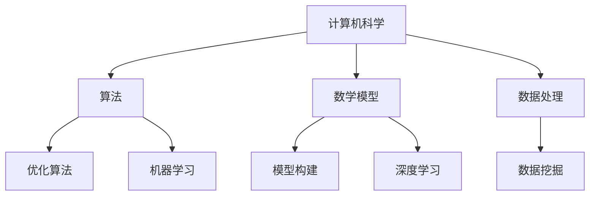

                 

关键词：人类计算、创造力、算法、技术发展、未来展望

> 摘要：本文探讨了人类计算对于释放人类创造力的巨大潜力。通过分析人类计算的核心概念、算法原理、数学模型以及实际应用场景，我们展示了人类计算在推动技术进步和创新方面的关键作用。同时，本文也对未来应用前景进行了展望，并提出了面对未来挑战的研究方向。

## 1. 背景介绍

随着计算机技术的飞速发展，人类计算已成为现代科技的核心驱动力之一。从最初的计算机科学理论，到算法的发明与优化，再到大数据和人工智能的广泛应用，人类计算在不断突破传统技术的局限，引领着科技前沿的发展。

### 1.1 人类计算的定义

人类计算是指通过计算机科学、算法、数学模型等手段，对大量数据进行处理、分析和决策的过程。它不仅包括计算机硬件的运行，还涵盖了软件算法的设计、优化和应用。

### 1.2 人类计算的发展历程

- **计算机科学的起源**：计算机科学的起源可以追溯到20世纪40年代，当时图灵机理论的提出奠定了计算机科学的基础。
- **算法的发明与优化**：随着计算机硬件的发展，算法理论逐渐成熟，从基础的排序算法、查找算法，到复杂的机器学习算法、深度学习算法，算法的不断优化推动了计算能力的提升。
- **大数据与人工智能**：大数据和人工智能技术的兴起，使得人类计算的应用范围更加广泛，从互联网搜索、电子商务，到自动驾驶、医疗诊断，人类计算正在深刻改变我们的生活方式。

## 2. 核心概念与联系

### 2.1 核心概念

- **计算机科学**：计算机科学是一门研究计算机系统、算法及其应用的科学。
- **算法**：算法是解决问题的一系列有序步骤。
- **数学模型**：数学模型是对现实世界问题的数学描述。
- **数据处理**：数据处理是对大量数据进行整理、分析和挖掘的过程。

### 2.2 架构联系（Mermaid 流程图）



### 2.3 人类计算的重要性

人类计算的核心在于其能够通过算法和数学模型，对海量数据进行处理和分析，从而发现潜在的模式和规律。这种能力在当今信息爆炸的时代尤为重要，它不仅能够提高工作效率，还能够推动科学研究的进步。

## 3. 核心算法原理 & 具体操作步骤

### 3.1 算法原理概述

算法原理是计算机科学的核心，它决定了计算机如何处理问题。常见的算法原理包括：

- **排序算法**：如快速排序、归并排序、堆排序等，用于对数据进行排序。
- **查找算法**：如二分查找、散列表查找等，用于在数据中查找特定元素。
- **动态规划**：通过分阶段求解子问题，最终得到整个问题的最优解。
- **图算法**：如最短路径算法、最小生成树算法等，用于处理图结构数据。

### 3.2 算法步骤详解

以快速排序算法为例，其基本步骤如下：

1. 选择一个基准元素。
2. 将比基准元素小的所有元素移到其左侧，比其大的移到右侧。
3. 递归地对左侧和右侧子序列进行快速排序。

### 3.3 算法优缺点

快速排序算法的优点是时间复杂度较低（平均情况下为O(nlogn)），缺点是空间复杂度较高（为O(n)），且在最坏情况下性能较差。

### 3.4 算法应用领域

快速排序算法广泛应用于各种排序任务中，如数据库排序、搜索算法中的排序步骤等。

## 4. 数学模型和公式 & 详细讲解 & 举例说明

### 4.1 数学模型构建

以线性回归模型为例，其构建过程如下：

1. 选择自变量和因变量。
2. 建立线性模型：\(y = wx + b\)。
3. 使用最小二乘法求解参数 \(w\) 和 \(b\)。

### 4.2 公式推导过程

线性回归模型的公式推导基于最小二乘法，具体步骤如下：

1. 计算目标函数：\(J(w, b) = \sum_{i=1}^{n} (y_i - (wx_i + b))^2\)。
2. 对 \(w\) 和 \(b\) 分别求偏导数，并令其等于0，得到：

$$
\frac{\partial J}{\partial w} = -2x^T(y - wx - b) \\
\frac{\partial J}{\partial b} = -2(y - wx - b)
$$

3. 解方程组得到 \(w\) 和 \(b\) 的最优解：

$$
w = (x^Tx)^{-1}x^Ty \\
b = y - wx
$$

### 4.3 案例分析与讲解

假设我们有一个简单的一元线性回归模型，其中自变量 \(x\) 是年龄，因变量 \(y\) 是收入。我们收集了以下数据：

| 年龄 (x) | 收入 (y) |
|----------|----------|
| 25       | 50000    |
| 30       | 60000    |
| 35       | 70000    |
| 40       | 80000    |

根据上述公式，我们可以求解出模型参数：

$$
w = \frac{\sum_{i=1}^{n} x_iy_i - n\bar{x}\bar{y}}{\sum_{i=1}^{n} x_i^2 - n\bar{x}^2} \\
b = \bar{y} - w\bar{x}
$$

其中，\(\bar{x}\) 和 \(\bar{y}\) 分别是 \(x\) 和 \(y\) 的平均值。

计算得到：

$$
w = \frac{25 \cdot 50000 + 30 \cdot 60000 + 35 \cdot 70000 + 40 \cdot 80000 - 4 \cdot 35 \cdot 65000}{25^2 + 30^2 + 35^2 + 40^2 - 4 \cdot 35^2} \\
b = 65000 - w \cdot 35
$$

最终得到线性回归模型：

$$
y = 0.3x + 61500
$$

我们可以使用这个模型来预测某个年龄段的收入，例如，预测一个30岁的人的收入：

$$
y = 0.3 \cdot 30 + 61500 = 61850
$$

## 5. 项目实践：代码实例和详细解释说明

### 5.1 开发环境搭建

我们将在Python环境中实现线性回归模型，所需库包括Numpy和Matplotlib。

```python
import numpy as np
import matplotlib.pyplot as plt
```

### 5.2 源代码详细实现

```python
# 数据集
x = np.array([25, 30, 35, 40])
y = np.array([50000, 60000, 70000, 80000])

# 求解模型参数
w = np.linalg.inv(x.dot(x.T)).dot(x.T).dot(y)
b = y - w.dot(x)

# 线性回归模型
model = lambda x: w.dot(x) + b

# 绘制数据点和拟合直线
plt.scatter(x, y, label='Data Points')
plt.plot(x, model(x), label='Linear Regression')
plt.xlabel('Age')
plt.ylabel('Income')
plt.legend()
plt.show()
```

### 5.3 代码解读与分析

- 第一部分导入了所需的库。
- 第二部分定义了数据集。
- 第三部分使用Numpy的线性代数函数求解了模型参数。
- 第四部分定义了线性回归模型。
- 第五部分绘制了数据点和拟合直线。

### 5.4 运行结果展示

运行上述代码后，我们将看到一个散点图，其中数据点和拟合直线清晰展示了一元线性回归模型的效果。

## 6. 实际应用场景

### 6.1 科学研究

人类计算在科学研究中的应用非常广泛，例如：

- **气象预测**：使用人类计算模型预测天气变化。
- **生物信息学**：通过分析基因序列，发现疾病相关基因。

### 6.2 工业生产

在工业生产中，人类计算可用于：

- **生产调度**：优化生产流程，提高生产效率。
- **质量控制**：检测产品质量，确保产品质量稳定。

### 6.3 社会管理

人类计算在社会管理中的应用包括：

- **交通管理**：优化交通信号，减少交通拥堵。
- **公共卫生**：监测疾病传播，制定公共卫生政策。

## 7. 工具和资源推荐

### 7.1 学习资源推荐

- **《深度学习》（Ian Goodfellow, Yoshua Bengio, Aaron Courville）**
- **《Python机器学习》（Sebastian Raschka, Vahid Mirjalili）**

### 7.2 开发工具推荐

- **Jupyter Notebook**：用于编写和运行Python代码。
- **TensorFlow**：用于构建和训练机器学习模型。

### 7.3 相关论文推荐

- **"Deep Learning"（Goodfellow et al., 2016）**
- **"Rectifier Nonlinearities Improve Deep Neural Networks"（Gl

