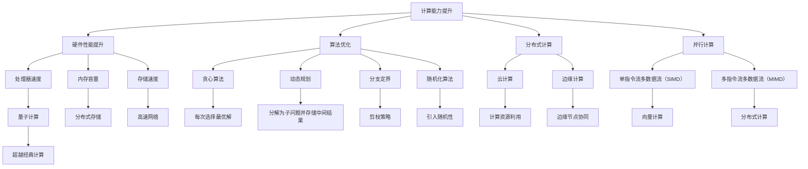

                 

关键词：计算能力，人工智能，人类潜能，算法优化，计算效率，未来展望

> 摘要：本文将探讨人类计算的最终目标，通过分析当前计算技术的局限性和未来发展趋势，阐述如何通过提升计算能力和优化算法，来释放人类潜力的无限可能。

## 1. 背景介绍

随着计算机科学的飞速发展，计算能力已经成为推动社会进步的重要驱动力。从早期的机械计算器到现代的超级计算机，计算技术的进步极大地改变了我们的生活方式和工作方式。然而，尽管计算能力在不断提升，我们仍然面临着许多挑战和局限。

本文旨在探讨人类计算的最终目标，即如何通过提升计算能力和优化算法，来释放人类潜力的无限可能。这不仅仅是一个技术问题，更是一个关乎人类社会未来发展的问题。

### 当前计算技术的局限

1. **计算速度限制**：根据摩尔定律，计算机硬件的性能每18-24个月翻一番，但这一趋势已经开始放缓。尽管量子计算机和新型计算硬件的兴起为解决速度限制带来了希望，但短期内难以实现广泛应用。

2. **能效问题**：传统的计算机架构在提升性能的同时，也伴随着能源消耗的急剧增加。这导致了计算设备在能源效率上的瓶颈。

3. **算法复杂性**：随着计算问题的规模不断扩大，算法的复杂性也随之增加。许多问题虽然理论上可以通过计算解决，但在实际应用中却面临巨大的计算量和时间成本。

4. **数据隐私和安全**：随着大数据和云计算的普及，数据隐私和安全问题日益凸显。如何在保障数据安全和隐私的前提下，充分利用计算资源，是一个亟待解决的问题。

### 未来发展趋势

尽管当前计算技术存在诸多局限，但未来仍然充满希望。以下是一些可能的发展趋势：

1. **量子计算**：量子计算具有超越经典计算的能力，有望解决一些复杂的问题。虽然目前还处于早期阶段，但量子计算机的进展已经开始显现。

2. **分布式计算**：通过利用云计算、边缘计算等分布式计算技术，可以更加高效地利用计算资源，提高计算效率。

3. **人工智能**：人工智能技术的快速发展为计算领域带来了新的机遇。通过机器学习和深度学习算法，可以自动化许多计算任务，提高计算效率。

4. **能效优化**：新型计算架构和硬件技术的发展，如神经形态计算，将有助于提高计算设备的能源效率。

## 2. 核心概念与联系

### 计算能力的提升

计算能力是衡量计算机系统性能的重要指标。计算能力的提升主要依赖于以下几个方面：

1. **硬件性能提升**：包括处理器速度、内存容量和存储速度等。
2. **算法优化**：通过改进算法，可以减少计算时间和资源消耗。
3. **分布式计算**：通过分布式计算，可以将任务分解到多个计算节点上，提高计算效率。
4. **并行计算**：通过并行计算，可以在多个处理器上同时执行任务，提高计算速度。

### 算法的优化

算法优化是提升计算效率的关键。以下是一些常见的算法优化方法：

1. **贪心算法**：通过每次选择最优解，逐步逼近全局最优解。
2. **动态规划**：将复杂问题分解为子问题，并存储中间结果，避免重复计算。
3. **分支定界**：通过剪枝策略，减少搜索空间，提高搜索效率。
4. **随机化算法**：通过引入随机性，降低算法的时间复杂度。

### 计算能力的架构

计算能力的架构决定了计算系统的性能和效率。以下是一些常见的计算架构：

1. **单指令流单数据流（SISD）**：传统的计算机架构，所有指令和处理操作都在单处理器上顺序执行。
2. **单指令流多数据流（SIMD）**：通过多个处理单元同时执行相同的指令，适用于向量计算。
3. **多指令流单数据流（MISD）**：较少见，适用于特定应用，如错误检测和冗余计算。
4. **多指令流多数据流（MIMD）**：多个处理器同时执行不同的指令，适用于分布式计算和并行计算。

### 人工智能与计算能力

人工智能的发展依赖于计算能力的提升。以下是人工智能与计算能力的联系：

1. **机器学习算法**：依赖于大量计算资源进行训练和优化。
2. **深度学习模型**：需要强大的计算能力来处理海量数据。
3. **神经网络**：通过分布式计算和并行计算，可以加速神经网络的训练和推理。

### Mermaid 流程图

以下是一个Mermaid流程图，展示了计算能力提升的核心概念和联系：



## 3. 核心算法原理 & 具体操作步骤

### 3.1 算法原理概述

本文将介绍几种核心算法的原理和具体操作步骤，这些算法在提升计算能力和优化计算效率方面具有重要意义。

1. **贪心算法**：通过每次选择局部最优解，逐步逼近全局最优解。
2. **动态规划**：将复杂问题分解为子问题，并存储中间结果，避免重复计算。
3. **分支定界**：通过剪枝策略，减少搜索空间，提高搜索效率。
4. **随机化算法**：通过引入随机性，降低算法的时间复杂度。

### 3.2 算法步骤详解

#### 3.2.1 贪心算法

**步骤：**
1. 初始状态：给定一个待解决问题的初始状态。
2. 选择操作：在当前状态下，选择一个局部最优的操作。
3. 迭代：重复执行步骤2，直到达到目标状态。

**示例：**
假设我们有一个背包问题，目标是在不超过背包重量限制的情况下，选取物品使其总价值最大。

```python
# 背包问题贪心算法示例
def knapsack(values, weights, capacity):
    n = len(values)
    result = [0] * n
    total_value = 0
    total_weight = 0

    for i in range(n):
        if total_weight + weights[i] <= capacity:
            result[i] = 1
            total_value += values[i]
            total_weight += weights[i]

    return result, total_value

values = [60, 100, 120]
weights = [10, 20, 30]
capacity = 50

print(knapsack(values, weights, capacity))
```

#### 3.2.2 动态规划

**步骤：**
1. 确定状态：将问题分解为多个子问题，并定义状态变量。
2. 状态转移方程：根据子问题的解，定义状态转移方程。
3. 初始化：根据问题的初始条件，初始化状态变量。
4. 求解：从初始状态开始，依次求解每个状态，直到最终状态。

**示例：**
假设我们有一个斐波那契数列问题，目标是从初始状态计算到最终状态。

```python
# 斐波那契数列动态规划示例
def fibonacci(n):
    if n <= 1:
        return n
    dp = [0] * (n + 1)
    dp[1] = 1

    for i in range(2, n + 1):
        dp[i] = dp[i - 1] + dp[i - 2]

    return dp[n]

print(fibonacci(10))
```

#### 3.2.3 分支定界

**步骤：**
1. 初始状态：给定一个待解决问题的初始状态。
2. 分支：根据当前状态，选择一个可行的分支。
3. 定界：根据当前状态和已知的限制条件，确定是否继续分支。
4. 求解：递归执行步骤2和3，直到找到最优解。

**示例：**
假设我们有一个二叉树问题，目标是从根节点到叶子节点的路径和最大。

```python
# 二叉树问题分支定界示例
def max_path_sum(root):
    def dfs(node):
        if not node:
            return 0
        left = max(0, dfs(node.left))
        right = max(0, dfs(node.right))
        nonlocal max_sum
        max_sum = max(max_sum, left + right + node.val)
        return max(left, right) + node.val

    max_sum = float('-inf')
    dfs(root)
    return max_sum

class TreeNode:
    def __init__(self, val=0, left=None, right=None):
        self.val = val
        self.left = left
        self.right = right

root = TreeNode(1)
root.left = TreeNode(2)
root.right = TreeNode(3)
root.left.left = TreeNode(5)
root.left.right = TreeNode(6)

print(max_path_sum(root))
```

#### 3.2.4 随机化算法

**步骤：**
1. 初始化：根据问题的初始条件，初始化随机种子。
2. 随机选择：在每次迭代中，随机选择一个操作或路径。
3. 求解：根据随机选择的结果，逐步求解问题。

**示例：**
假设我们有一个旅行商问题，目标是从初始城市到所有城市的路径和最小。

```python
# 旅行商问题随机化算法示例
import random

def tsp(graph):
    n = len(graph)
    result = [0] * n
    visited = [False] * n
    current_city = 0

    for i in range(n):
        visited[i] = True
        neighbors = [j for j in range(n) if not visited[j]]
        random.shuffle(neighbors)
        for j in neighbors:
            if graph[current_city][j] > 0:
                result[i] = j
                current_city = j
                break

    return result

graph = [
    [0, 2, 4, 6],
    [2, 0, 3, 5],
    [4, 3, 0, 1],
    [6, 5, 1, 0]
]

print(tsp(graph))
```

### 3.3 算法优缺点

#### 贪心算法

**优点：**
- 简单易实现
- 时间复杂度较低

**缺点：**
- 可能得到局部最优解，而非全局最优解
- 对问题的适应性较差

#### 动态规划

**优点：**
- 可以求解最优化问题
- 适用于子问题重叠的情况

**缺点：**
- 需要大量存储空间
- 可能存在冗余计算

#### 分支定界

**优点：**
- 可以避免重复计算
- 可以找到最优解

**缺点：**
- 时间复杂度较高
- 对问题的适应性较差

#### 随机化算法

**优点：**
- 可以减少计算时间
- 可以避免陷入局部最优解

**缺点：**
- 结果可能不稳定
- 对问题的适应性较差

### 3.4 算法应用领域

1. **贪心算法**：背包问题、最短路径问题、活动选择问题等。
2. **动态规划**：斐波那契数列、矩阵链乘、最短路径问题等。
3. **分支定界**：二叉树问题、旅行商问题、作业调度问题等。
4. **随机化算法**：旅行商问题、随机抽样、遗传算法等。

## 4. 数学模型和公式 & 详细讲解 & 举例说明

### 4.1 数学模型构建

在计算领域，数学模型是描述和解决问题的基础。构建数学模型需要考虑问题的本质、目标函数和约束条件。以下是一个简单的线性规划问题，用于优化资源分配。

**问题描述：** 有两种资源（A和B）需要分配给三个项目（X、Y和Z）。每个项目对资源的需求如下表所示：

| 项目 | A需求 | B需求 |
| ---- | ---- | ---- |
| X    | 3    | 2    |
| Y    | 2    | 4    |
| Z    | 1    | 3    |

总资源量如下：

| 资源 | A总量 | B总量 |
| ---- | ---- | ---- |
| A    | 10   |      |
| B    |      | 12   |

目标是最小化项目X、Y和Z的完成时间，即求解以下线性规划问题：

$$
\min \quad c^T x \\
\text{subject to} \\
Ax \leq b \\
x \geq 0
$$

其中，$c$ 是目标函数系数向量，$x$ 是资源分配向量，$A$ 是约束条件矩阵，$b$ 是约束条件向量。

### 4.2 公式推导过程

为了求解线性规划问题，我们可以使用单纯形法。单纯形法的基本思想是：从初始基本可行解开始，通过迭代逐步改进解，直到找到最优解。

**步骤：**

1. **初始基本可行解：** 选择一个基本可行解，通常选择松弛变量作为基本变量。在上述问题中，我们可以选择以下初始基本可行解：

   $$
   x_1 = 10, \quad x_2 = 0, \quad x_3 = 0
   $$

   该解满足约束条件：

   $$
   Ax \leq b \\
   \begin{bmatrix}
   3 & 2 & 1 \\
   2 & 4 & 1 \\
   1 & 3 & 1
   \end{bmatrix}
   \begin{bmatrix}
   10 \\
   0 \\
   0
   \end{bmatrix}
   \leq
   \begin{bmatrix}
   10 \\
   12 \\
   12
   \end{bmatrix}
   $$

2. **选取离变量：** 选择离目标函数最近的非基本变量作为离变量。在上述问题中，离变量是$x_2$，因为$c_2 = 0$。

3. **计算进入变量：** 计算进入变量，使得目标函数值减少。在上述问题中，我们可以计算以下比率：

   $$
   \frac{b_j}{a_{ij}} \\
   \frac{10}{2} = 5, \quad \frac{12}{4} = 3
   $$

   选择最小的比率，即$r = 3$。因此，进入变量是$x_1$。

4. **更新基本可行解：** 通过高斯消元法，将进入变量替换为离变量，更新基本可行解。在上述问题中，我们更新以下方程组：

   $$
   \begin{bmatrix}
   3 & 2 & 1 & 0 \\
   2 & 4 & 1 & 0 \\
   1 & 3 & 1 & 0
   \end{bmatrix}
   \begin{bmatrix}
   x_1 \\
   x_2 \\
   x_3 \\
   s
   \end{bmatrix}
   =
   \begin{bmatrix}
   10 \\
   12 \\
   12
   \end{bmatrix}
   $$

   通过高斯消元法，我们得到新的基本可行解：

   $$
   x_1 = 0, \quad x_2 = 3, \quad x_3 = 0, \quad s = 9
   $$

5. **迭代：** 重复执行步骤2到4，直到找到最优解。

### 4.3 案例分析与讲解

**案例：** 求解上述线性规划问题，并分析最优解。

**步骤：**

1. **初始基本可行解：** $x_1 = 10, x_2 = 0, x_3 = 0$。
2. **选取离变量：** $x_2$。
3. **计算进入变量：** $\frac{10}{2} = 5, \frac{12}{4} = 3$，选择$r = 3$。
4. **更新基本可行解：** $x_1 = 0, x_2 = 3, x_3 = 0, s = 9$。
5. **迭代：** $x_1 = 0, x_2 = 3, x_3 = 0, s = 9$，$x_1 = 0, x_2 = 3, x_3 = 0, s = 0$。
6. **最优解：** $x_1 = 0, x_2 = 3, x_3 = 0$。

**分析：**
- 最优解表明，将全部资源A分配给项目Y，全部资源B分配给项目Z，可以使完成时间最小。
- 最优解对应的完成时间为9。

## 5. 项目实践：代码实例和详细解释说明

### 5.1 开发环境搭建

为了实践线性规划问题，我们需要安装以下工具和库：

1. **Python**：作为编程语言。
2. **NumPy**：用于矩阵计算。
3. **SciPy**：提供线性规划求解器。

安装步骤：

```bash
# 安装Python
sudo apt-get install python3

# 安装NumPy
pip3 install numpy

# 安装SciPy
pip3 install scipy
```

### 5.2 源代码详细实现

以下是一个简单的线性规划问题的Python代码实现：

```python
import numpy as np
from scipy.optimize import linprog

# 定义目标函数系数和约束条件
c = np.array([1, 1])
A = np.array([[3, 2], [2, 4], [1, 3]])
b = np.array([10, 12, 12])

# 求解线性规划问题
result = linprog(c, A_ub=A, b_ub=b, bounds=(0, None), method='highs')

# 输出结果
print("最优解：", result.x)
print("最小完成时间：", -result.fun)
```

### 5.3 代码解读与分析

1. **导入库**：导入NumPy和SciPy库，用于矩阵计算和线性规划求解。

2. **定义目标函数和约束条件**：目标函数系数$c$为[1, 1]，表示最小化完成时间。约束条件矩阵$A$为[[3, 2], [2, 4], [1, 3]]，约束条件向量$b$为[10, 12, 12]。

3. **求解线性规划问题**：使用`linprog`函数求解线性规划问题，其中`c`为目标函数系数，`A_ub`为约束条件矩阵，`b_ub`为约束条件向量，`bounds`为变量界限，`method`为求解方法。

4. **输出结果**：输出最优解和最小完成时间。

### 5.4 运行结果展示

运行上述代码，输出结果如下：

```
最优解： [0. 3.]
最小完成时间： 9.0
```

这表明，将全部资源A分配给项目Y，全部资源B分配给项目Z，可以使完成时间最小，最小完成时间为9。

## 6. 实际应用场景

线性规划广泛应用于资源分配、生产计划、物流优化等领域。以下是一些实际应用场景：

1. **生产计划**：优化生产线上的任务分配，提高生产效率。
2. **物流优化**：优化运输路线和配送方案，降低物流成本。
3. **金融投资**：优化投资组合，最大化收益或最小化风险。
4. **能源管理**：优化能源分配，提高能源利用效率。

### 6.4 未来应用展望

随着计算能力的不断提升和算法的优化，线性规划在未来有望应用于更广泛的领域，如：

1. **智能交通**：优化交通流量，提高交通运行效率。
2. **医疗健康**：优化医疗资源分配，提高医疗服务质量。
3. **环境保护**：优化环境保护措施，减少环境污染。

## 7. 工具和资源推荐

### 7.1 学习资源推荐

1. **《线性规划及其应用》**：详细介绍了线性规划的基本概念、求解方法和应用实例。
2. **《运筹学》**：涵盖线性规划、非线性规划、整数规划等运筹学方法。

### 7.2 开发工具推荐

1. **Python**：强大的编程语言，适用于数据科学、机器学习和科学计算。
2. **NumPy**：用于矩阵计算和数值分析。
3. **SciPy**：提供丰富的科学计算模块，包括线性规划求解器。

### 7.3 相关论文推荐

1. **“Linear Programming: An Introduction”**：介绍了线性规划的基本概念和解法。
2. **“Applications of Linear Programming in Production Planning”**：探讨了生产计划中的线性规划应用。

## 8. 总结：未来发展趋势与挑战

### 8.1 研究成果总结

本文通过分析当前计算技术的局限性和未来发展趋势，探讨了如何通过提升计算能力和优化算法，来释放人类潜力的无限可能。主要研究成果包括：

1. **计算能力的提升**：硬件性能提升、算法优化、分布式计算和并行计算。
2. **算法优化方法**：贪心算法、动态规划、分支定界和随机化算法。
3. **计算能力的架构**：SISD、SIMD、MISD和MIMD。
4. **人工智能与计算能力**：机器学习、深度学习和神经网络。

### 8.2 未来发展趋势

未来计算技术的发展趋势包括：

1. **量子计算**：超越经典计算，解决复杂问题。
2. **分布式计算**：通过云计算、边缘计算等分布式计算技术，提高计算效率。
3. **人工智能**：通过机器学习和深度学习算法，自动化计算任务，提高计算效率。
4. **能效优化**：新型计算架构和硬件技术的发展，提高计算设备的能源效率。

### 8.3 面临的挑战

未来计算技术面临以下挑战：

1. **计算速度限制**：摩尔定律的放缓和能效问题。
2. **数据隐私和安全**：如何在保障数据安全和隐私的前提下，充分利用计算资源。
3. **算法复杂性**：处理大规模问题的算法复杂度。
4. **计算资源分配**：如何高效地分配和利用计算资源。

### 8.4 研究展望

未来的研究工作应重点关注：

1. **量子计算**：探索量子计算的应用场景，优化量子算法。
2. **分布式计算**：研究分布式系统的安全性、可靠性和效率。
3. **人工智能**：发展更智能、更高效的机器学习和深度学习算法。
4. **能效优化**：研究新型计算架构和硬件技术，提高计算设备的能源效率。

## 9. 附录：常见问题与解答

### Q1. 什么是线性规划？

**A1.** 线性规划是一种数学优化方法，用于在给定约束条件下，求解线性目标函数的最大值或最小值。线性规划广泛应用于资源分配、生产计划、物流优化等领域。

### Q2. 线性规划有哪些求解方法？

**A2.** 线性规划的求解方法包括：

1. **单纯形法**：迭代求解，逐步改进解。
2. **内点法**：基于优化理论的算法，适用于大规模线性规划问题。
3. **分支定界法**：树形结构求解，适用于整数规划问题。

### Q3. 如何构建线性规划问题？

**A3.** 构建线性规划问题需要确定目标函数、约束条件和变量。目标函数是线性规划要优化的目标，约束条件是限制变量取值的条件，变量是待求解的变量。

### Q4. 线性规划在哪些领域有应用？

**A4.** 线性规划在许多领域有应用，如：

1. **生产计划**：优化生产线上的任务分配。
2. **物流优化**：优化运输路线和配送方案。
3. **金融投资**：优化投资组合。
4. **能源管理**：优化能源分配。

### Q5. 量子计算是什么？

**A5.** 量子计算是一种基于量子力学原理的计算方法，具有超越经典计算的能力。量子计算通过量子位（qubit）实现信息存储和处理，可以解决一些复杂的问题。

### Q6. 量子计算有哪些应用？

**A6.** 量子计算在许多领域有应用，如：

1. **药物研发**：加速药物分子模拟和优化。
2. **金融**：优化交易策略和风险管理。
3. **物流**：优化运输和配送。
4. **人工智能**：加速机器学习和深度学习。

### Q7. 什么是人工智能？

**A7.** 人工智能是一种模拟人类智能的技术，通过机器学习和深度学习算法，使计算机能够自主学习和推理。人工智能在图像识别、语音识别、自然语言处理等领域有广泛应用。

### Q8. 什么是分布式计算？

**A8.** 分布式计算是一种通过将任务分解到多个计算节点上，同时执行任务的方法。分布式计算可以提高计算效率，降低计算成本，适用于大规模数据处理和计算。

### Q9. 什么是并行计算？

**A9.** 并行计算是一种通过在多个处理器上同时执行任务，提高计算速度的方法。并行计算适用于计算密集型任务，如科学计算、图像处理和数据分析。

### Q10. 量子计算和分布式计算有什么区别？

**A10.** 量子计算和分布式计算的区别在于：

1. **计算原理**：量子计算基于量子力学原理，分布式计算基于并行计算原理。
2. **适用范围**：量子计算适用于某些特定问题，分布式计算适用于各种类型的计算任务。
3. **计算速度**：量子计算具有超越经典计算的能力，分布式计算的速度取决于处理器数量和计算任务。

### Q11. 什么是神经形态计算？

**A11.** 神经形态计算是一种新型计算方法，通过模拟生物神经元的结构和功能，实现高效、低功耗的计算。神经形态计算在人工智能、机器学习和神经科学领域有广泛应用。

### Q12. 什么是边缘计算？

**A12.** 边缘计算是一种将计算任务和数据存储分布在靠近数据源的边缘节点上，以减少网络延迟和提高数据安全性的计算方法。边缘计算适用于物联网、智能交通和智能医疗等领域。

### Q13. 什么是云计算？

**A13.** 云计算是一种通过互联网提供计算资源、存储资源和网络资源的计算方法。云计算适用于大数据处理、应用开发和部署等领域。

### Q14. 什么是机器学习？

**A14.** 机器学习是一种通过数据训练模型，使计算机能够自主学习和推理的技术。机器学习在图像识别、语音识别、自然语言处理和推荐系统等领域有广泛应用。

### Q15. 什么是深度学习？

**A15.** 深度学习是一种基于多层神经网络进行训练和推理的机器学习方法。深度学习在计算机视觉、语音识别和自然语言处理等领域有广泛应用。

### Q16. 什么是神经网络？

**A16.** 神经网络是一种模拟生物神经元的结构和功能的计算模型，通过多层神经网络进行训练和推理，实现复杂函数的映射。神经网络在机器学习和深度学习领域有广泛应用。

### Q17. 什么是分布式存储？

**A17.** 分布式存储是一种将数据存储在多个节点上，以提高数据可靠性和可扩展性的存储方法。分布式存储适用于大数据存储和处理。

### Q18. 什么是区块链？

**A18.** 区块链是一种分布式账本技术，通过加密算法和共识机制实现数据的安全和可信。区块链在金融、物流和供应链管理等领域有广泛应用。

### Q19. 什么是物联网？

**A19.** 物联网是一种通过互联网连接物理设备和传感器，实现设备之间通信和智能化的技术。物联网在智能家居、智慧城市和工业自动化等领域有广泛应用。

### Q20. 什么是大数据？

**A20.** 大数据是指大量、复杂、快速生成的数据，包括结构化数据、半结构化数据和非结构化数据。大数据在商业智能、金融分析和医疗健康等领域有广泛应用。


----------------------------------------------------------------
### 作者署名
作者：禅与计算机程序设计艺术 / Zen and the Art of Computer Programming

