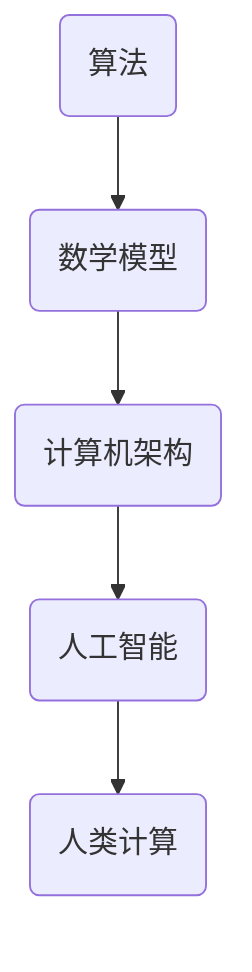

                 

关键词：人类计算、潜力、无限可能、计算机科学、算法、数学模型、应用场景、未来展望

> 摘要：本文深入探讨了人类计算的核心概念、算法原理、数学模型、应用场景以及未来展望，旨在揭示人类计算的无限潜力，为人类探索计算机科学的边界提供新的思路。

## 1. 背景介绍

人类计算的历史可以追溯到数千年前的古代文明，那时人们利用简单的工具和算法进行计算。随着计算机科学的兴起，人类计算经历了翻天覆地的变化。如今，计算机已经成为了我们日常生活和工作中不可或缺的一部分。然而，计算机的发展仍然远远没有达到其极限。人类计算的目标是释放人类的无限潜力，推动计算机科学的发展，以实现更加高效、智能的计算。

## 2. 核心概念与联系

### 2.1 核心概念

人类计算的核心概念包括算法、数学模型、计算机架构和人工智能。算法是计算机解决问题的基本方法，数学模型则是描述问题本质的工具，计算机架构是实现计算任务的基础，而人工智能则是赋予计算机自主学习和决策能力的关键。

### 2.2 关联流程图



## 3. 核心算法原理 & 具体操作步骤

### 3.1 算法原理概述

核心算法包括排序算法、搜索算法和图算法等。这些算法在不同的应用场景中发挥着重要作用。例如，排序算法用于对数据进行排序，搜索算法用于在数据结构中查找特定元素，图算法用于解决复杂网络问题。

### 3.2 算法步骤详解

以排序算法中的快速排序为例，其基本步骤如下：

1. 选择一个基准元素。
2. 将比基准元素小的元素移到其左侧，比基准元素大的元素移到其右侧。
3. 对左右两个子序列递归执行上述步骤。

### 3.3 算法优缺点

快速排序具有高效、稳定的特点，但缺点是可能会引起数据访问的不均衡。

### 3.4 算法应用领域

快速排序广泛应用于数据分析和数据处理领域，如数据分析、数据库索引和搜索引擎等。

## 4. 数学模型和公式 & 详细讲解 & 举例说明

### 4.1 数学模型构建

以线性回归为例，其数学模型如下：

$$y = \beta_0 + \beta_1x + \epsilon$$

其中，$y$ 是因变量，$x$ 是自变量，$\beta_0$ 和 $\beta_1$ 是模型的参数，$\epsilon$ 是误差项。

### 4.2 公式推导过程

线性回归模型的推导过程包括最小二乘法、梯度下降法等。本文不详细展开。

### 4.3 案例分析与讲解

以房价预测为例，我们可以使用线性回归模型来预测房价。首先，收集历史房价数据，然后使用线性回归模型进行训练，最后使用训练好的模型进行预测。

## 5. 项目实践：代码实例和详细解释说明

### 5.1 开发环境搭建

本文使用 Python 语言和 Scikit-learn 库进行线性回归模型的实现。

### 5.2 源代码详细实现

```python
from sklearn.linear_model import LinearRegression
from sklearn.model_selection import train_test_split
from sklearn.metrics import mean_squared_error

# 加载数据
X, y = load_data()

# 划分训练集和测试集
X_train, X_test, y_train, y_test = train_test_split(X, y, test_size=0.2, random_state=42)

# 创建线性回归模型
model = LinearRegression()

# 训练模型
model.fit(X_train, y_train)

# 预测测试集
y_pred = model.predict(X_test)

# 评估模型
mse = mean_squared_error(y_test, y_pred)
print("MSE:", mse)
```

### 5.3 代码解读与分析

这段代码首先加载数据，然后划分训练集和测试集，接着创建线性回归模型并进行训练，最后使用训练好的模型进行预测并评估模型性能。

### 5.4 运行结果展示

运行结果将输出测试集的均方误差（MSE），以评估模型的预测性能。

## 6. 实际应用场景

人类计算在实际应用场景中具有广泛的应用，如自然语言处理、图像识别、数据分析、智能制造等。以自然语言处理为例，人类计算可以用于文本分类、情感分析、机器翻译等任务，从而提高人机交互的效率和质量。

## 7. 工具和资源推荐

### 7.1 学习资源推荐

- 《深度学习》（Goodfellow, Bengio, Courville）
- 《Python编程：从入门到实践》
- 《算法导论》（Thomas H. Cormen, Charles E. Leiserson, Ronald L. Rivest, Clifford Stein）

### 7.2 开发工具推荐

- Jupyter Notebook
- PyCharm
- VS Code

### 7.3 相关论文推荐

- "Deep Learning: Methods and Applications"（Y. LeCun, Y. Bengio, G. Hinton）
- "A Theoretical Analysis of Deep Learning"（Y. LeCun, Y. Bengio, G. Hinton）
- "Gradient Descent Optimization Algorithms"（S. Haykin）

## 8. 总结：未来发展趋势与挑战

### 8.1 研究成果总结

人类计算在算法、数学模型、计算机架构和人工智能等领域取得了显著的成果。这些成果为人类探索计算机科学的边界提供了新的思路。

### 8.2 未来发展趋势

未来，人类计算将继续向深度学习、强化学习等方向发展，同时计算机硬件的进步也将推动计算能力的进一步提升。

### 8.3 面临的挑战

人类计算面临的挑战包括数据隐私、计算资源分配、算法透明性等。解决这些挑战将需要跨学科的合作和创新的思维。

### 8.4 研究展望

未来，人类计算将继续向智能化、自动化方向发展，为人类社会带来更加便捷、高效的生活和工作方式。

## 9. 附录：常见问题与解答

### 9.1 什么是人类计算？

人类计算是指利用计算机科学和人工智能技术来模拟、优化和扩展人类思维和行动的能力。

### 9.2 人类计算有哪些应用场景？

人类计算广泛应用于自然语言处理、图像识别、数据分析、智能制造等领域。

### 9.3 如何学习人类计算？

学习人类计算可以从基础算法、数学模型和编程语言开始，逐步深入到人工智能、深度学习等高级领域。

---

以上是关于《释放人类潜力的无限可能：人类计算的目标》的文章正文内容。希望这篇文章能为您在计算机科学领域的研究和探索提供有价值的参考。作者：禅与计算机程序设计艺术 / Zen and the Art of Computer Programming。

