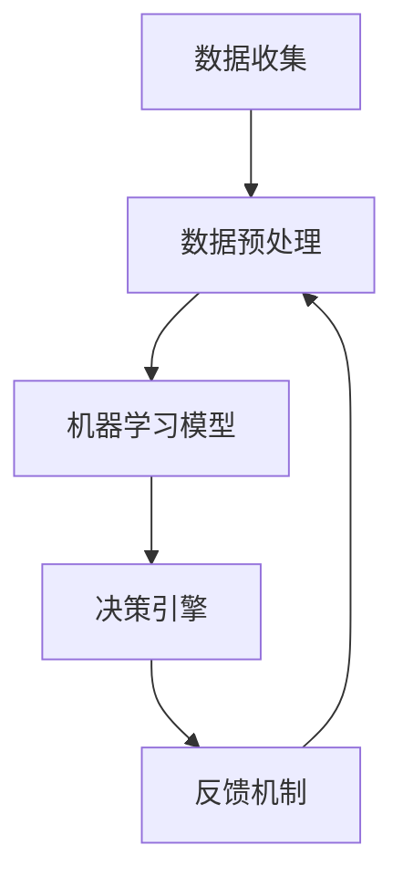

                 

关键词：AI工作流、自动化、效率提升、人工智能应用、工作流程优化

> 摘要：本文探讨了人工智能（AI）在重塑传统工作流与利用AI技术优化现有工作流程之间的区别与联系。文章首先介绍了AI工作流的背景和重要性，随后深入分析了AI如何影响工作流程的各个方面，最终提出了未来AI工作流的发展趋势和挑战。

## 1. 背景介绍

在过去几十年中，工作流程的自动化一直是提高效率和生产力的关键驱动力。随着计算机技术的发展，人工智能逐渐成为自动化工具的核心。AI工作流（AI-Driven Workflow）是指利用机器学习、自然语言处理和计算机视觉等技术自动处理工作流程中的各项任务。

AI工作流的引入，不仅提高了工作效率，还降低了人力成本，为组织带来了显著的价值。然而，AI工作流的实施也面临着一些挑战，如算法的准确性、数据的可靠性、系统的安全性等。

## 2. 核心概念与联系

为了更好地理解AI工作流，我们需要先了解其核心概念和架构。以下是AI工作流的核心概念和流程图：

### 2.1 核心概念

- **数据收集**：从各种来源（如数据库、传感器、日志文件等）收集数据。
- **数据预处理**：清洗、格式化和转换数据，使其适合用于机器学习模型。
- **机器学习模型**：训练和优化机器学习模型，以实现特定任务的目标。
- **决策引擎**：根据模型输出决策，自动化执行各项任务。
- **反馈机制**：收集反馈数据，用于模型优化和调整。

### 2.2 流程图



## 3. 核心算法原理 & 具体操作步骤

### 3.1 算法原理概述

AI工作流的核心在于机器学习模型和决策引擎。机器学习模型通过训练和优化，可以识别和预测数据中的模式和规律。决策引擎则根据模型输出，自动化执行各项任务。

### 3.2 算法步骤详解

1. **数据收集**：收集来自各种来源的数据，如数据库、传感器、日志文件等。
2. **数据预处理**：清洗、格式化和转换数据，确保数据质量。
3. **机器学习模型**：选择合适的模型（如分类、回归、聚类等），训练和优化模型，使其达到预期性能。
4. **决策引擎**：根据模型输出，自动化执行各项任务，如分类、预测、自动化处理等。
5. **反馈机制**：收集任务执行结果，反馈给模型，用于模型优化和调整。

### 3.3 算法优缺点

- **优点**：提高工作效率，降低人力成本，减少错误率。
- **缺点**：需要大量数据，模型训练时间较长，对算法和硬件要求较高。

### 3.4 算法应用领域

AI工作流广泛应用于各个领域，如金融、医疗、制造、物流等。以下是一些具体的应用场景：

- **金融**：智能投顾、风险控制、欺诈检测等。
- **医疗**：疾病预测、诊断辅助、患者管理等。
- **制造**：生产线优化、设备维护、质量控制等。
- **物流**：路线规划、配送优化、库存管理等。

## 4. 数学模型和公式

### 4.1 数学模型构建

AI工作流中的数学模型通常基于机器学习算法，如线性回归、逻辑回归、决策树、神经网络等。以下是一个简单的线性回归模型：

$$
y = wx + b
$$

其中，$y$ 是输出，$w$ 是权重，$x$ 是输入，$b$ 是偏置。

### 4.2 公式推导过程

线性回归模型的推导过程如下：

1. **目标函数**：最小化预测值与真实值之间的误差平方和。

$$
J(w, b) = \frac{1}{2m} \sum_{i=1}^{m} (wx_i + b - y_i)^2
$$

2. **偏导数**：对 $w$ 和 $b$ 求偏导数，并令其等于0，求得最优解。

$$
\frac{\partial J}{\partial w} = x(w - y) = 0 \\
\frac{\partial J}{\partial b} = y - wx = 0
$$

### 4.3 案例分析与讲解

假设我们有一个简单的数据集，包含两个特征（$x_1$ 和 $x_2$）和一个目标变量（$y$）。我们可以使用线性回归模型来预测 $y$ 的值。

1. **数据收集**：收集包含 $x_1$、$x_2$ 和 $y$ 的数据。
2. **数据预处理**：将数据进行标准化处理，确保特征具有相同的量级。
3. **模型训练**：选择线性回归模型，训练模型，得到权重 $w$ 和偏置 $b$。
4. **预测**：使用训练好的模型，预测新的数据点的 $y$ 值。

## 5. 项目实践：代码实例

### 5.1 开发环境搭建

使用 Python 编写代码，需要安装以下库：

```python
pip install numpy pandas scikit-learn matplotlib
```

### 5.2 源代码详细实现

以下是一个简单的线性回归模型实现：

```python
import numpy as np
import pandas as pd
from sklearn.linear_model import LinearRegression
from sklearn.model_selection import train_test_split
import matplotlib.pyplot as plt

# 数据收集
data = pd.read_csv('data.csv')
X = data[['x1', 'x2']]
y = data['y']

# 数据预处理
X_std = (X - X.mean()) / X.std()

# 模型训练
model = LinearRegression()
model.fit(X_std, y)

# 预测
y_pred = model.predict(X_std)

# 结果展示
plt.scatter(X_std['x1'], y, color='red')
plt.plot(X_std['x1'], y_pred, color='blue')
plt.xlabel('x1')
plt.ylabel('y')
plt.show()
```

### 5.3 代码解读与分析

1. **数据收集**：从 CSV 文件中读取数据，分为特征和目标变量。
2. **数据预处理**：对特征进行标准化处理，确保特征具有相同的量级。
3. **模型训练**：使用线性回归模型，训练模型。
4. **预测**：使用训练好的模型，预测新的数据点的目标变量值。
5. **结果展示**：使用散点图和拟合曲线展示预测结果。

## 6. 实际应用场景

### 6.1 金融领域

在金融领域，AI工作流可以用于智能投顾、风险控制、欺诈检测等。例如，使用机器学习模型预测股票市场的涨跌，自动化执行交易策略。

### 6.2 医疗领域

在医疗领域，AI工作流可以用于疾病预测、诊断辅助、患者管理等。例如，使用机器学习模型分析患者病历，预测患者疾病的进展。

### 6.3 制造领域

在制造领域，AI工作流可以用于生产线优化、设备维护、质量控制等。例如，使用机器学习模型预测设备故障，提前进行维护。

### 6.4 物流领域

在物流领域，AI工作流可以用于路线规划、配送优化、库存管理等。例如，使用机器学习模型优化配送路线，提高运输效率。

## 7. 工具和资源推荐

### 7.1 学习资源推荐

- 《深度学习》（Ian Goodfellow、Yoshua Bengio、Aaron Courville 著）
- 《Python机器学习》（Sebastian Raschka、Vahid Mirjalili 著）
- Coursera、edX 等在线课程

### 7.2 开发工具推荐

- Jupyter Notebook：用于编写和运行 Python 代码。
- TensorFlow、PyTorch：用于构建和训练机器学习模型。
- Keras：用于简化机器学习模型开发。

### 7.3 相关论文推荐

- "Deep Learning for Natural Language Processing"（Y. Bengio等，2013）
- "Convolutional Neural Networks for Speech Recognition"（D. Amodei等，2016）
- "Generative Adversarial Nets"（I. Goodfellow等，2014）

## 8. 总结：未来发展趋势与挑战

### 8.1 研究成果总结

AI工作流在多个领域取得了显著成果，提高了工作效率和生产力的同时，也为企业带来了巨大的价值。

### 8.2 未来发展趋势

- **算法的优化与改进**：随着计算能力的提升，算法的效率和准确性将进一步提高。
- **跨领域应用**：AI工作流将在更多领域得到应用，实现更广泛的价值。
- **自动化程度提高**：AI工作流将实现更高程度的自动化，减少对人类干预的需求。

### 8.3 面临的挑战

- **数据质量与隐私**：数据质量和隐私保护是AI工作流实施的关键挑战。
- **算法透明性与可解释性**：提高算法的透明性和可解释性，以增强用户的信任。
- **计算资源需求**：大规模数据和高性能计算资源的需求将不断增加。

### 8.4 研究展望

未来，AI工作流将实现更加智能化、自适应和个性化的工作流程，为各行业带来深远影响。

## 9. 附录：常见问题与解答

### 9.1 AI工作流与传统自动化有何区别？

AI工作流与传统自动化相比，具有更高的智能化和自适应能力。传统自动化通常依赖于固定的规则和流程，而AI工作流则通过机器学习算法，根据数据和经验自动调整和优化工作流程。

### 9.2 AI工作流在实施过程中会遇到哪些问题？

AI工作流在实施过程中可能会遇到以下问题：

- **数据质量问题**：数据质量直接影响算法的性能，需要确保数据的质量和完整性。
- **算法选择与优化**：选择合适的算法和优化策略，以实现预期效果。
- **系统稳定性与可靠性**：确保系统的稳定性和可靠性，降低故障率。
- **安全与隐私问题**：确保数据的安全和隐私，防止数据泄露和滥用。

## 作者署名

作者：禅与计算机程序设计艺术 / Zen and the Art of Computer Programming

---

本文从背景介绍、核心概念、算法原理、数学模型、项目实践、实际应用场景、工具和资源推荐、总结与展望等多个方面，全面探讨了AI工作流的相关内容。希望通过本文，读者能够对AI工作流有一个全面、深入的了解。未来，AI工作流将在更多领域发挥重要作用，为各行业带来巨大变革。

