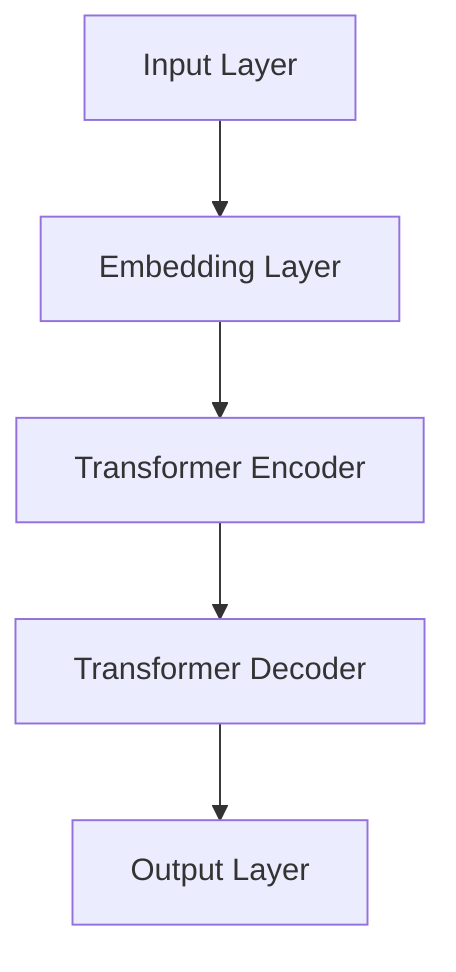
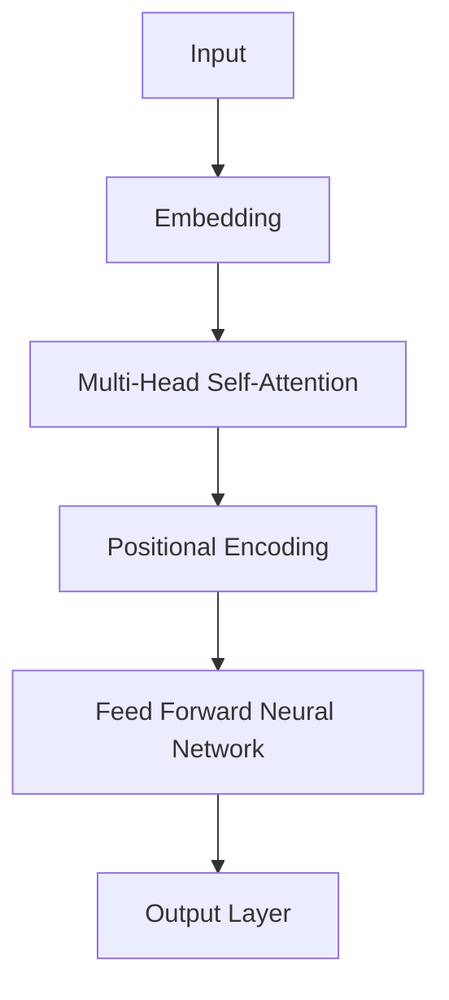
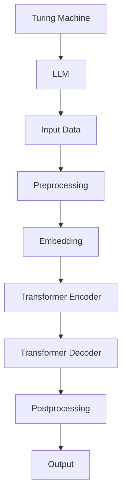

                 

关键词：图灵完备性，自然语言处理，大型语言模型，计算理论，人工智能，算法原理

摘要：本文探讨了大型语言模型（LLM）在计算理论领域中的贡献，重新审视了图灵完备性这一核心概念。通过对LLM的架构、算法原理、数学模型和实际应用的分析，本文揭示了LLM在计算能力上的潜力，并探讨了其对未来人工智能发展的深远影响。

## 1. 背景介绍

### 1.1 图灵完备性的概念

图灵完备性是计算理论中的一个核心概念，它描述了一种计算模型是否能够模拟任何可计算函数。图灵机（Turing Machine）作为一种抽象的计算模型，被认为是最强大的计算设备，其具备图灵完备性。这意味着，任何可以在图灵机上执行的计算，都可以通过图灵机来实现。

### 1.2 大型语言模型的发展

近年来，大型语言模型（LLM）如GPT系列、BERT等取得了显著进展。这些模型通过对海量文本数据的学习，能够生成高质量的自然语言文本。LLM的出现，不仅推动了自然语言处理（NLP）领域的发展，也引发了对于计算理论的新思考。

### 1.3 LLM与图灵完备性

随着LLM在各个领域的应用，人们开始探讨LLM是否具备图灵完备性。本文将通过对LLM的架构、算法原理和实际应用的深入分析，探讨LLM在计算理论中的地位和贡献。

## 2. 核心概念与联系

### 2.1 LLM的架构

大型语言模型通常采用深度神经网络架构，如Transformer。以下是一个简单的Mermaid流程图，展示了LLM的基本结构。



### 2.2 核心算法原理

LLM的核心算法是Transformer，它由自注意力机制（Self-Attention）和多头注意力（Multi-Head Attention）构成。以下是一个简化的算法原理图。



### 2.3 LLM与图灵完备性

尽管LLM采用深度神经网络架构，但其是否具备图灵完备性仍然是一个有争议的话题。以下是一个可能的Mermaid流程图，展示了LLM与图灵机的联系。



## 3. 核心算法原理 & 具体操作步骤

### 3.1 算法原理概述

LLM的核心算法是Transformer，它通过自注意力机制和多头注意力机制，对输入文本进行编码和解码。以下是一个简化的算法流程：

1. **预处理**：将输入文本转换为词向量。
2. **编码**：使用Transformer编码器对词向量进行处理。
3. **解码**：使用Transformer解码器生成输出文本。

### 3.2 算法步骤详解

#### 3.2.1 自注意力机制

自注意力机制（Self-Attention）是一种计算方法，它允许模型在生成每个词时，考虑到其他所有词的重要性。以下是一个简单的自注意力计算过程：

1. **计算查询（Query）、键（Key）和值（Value）**：对于每个词，计算其对应的查询向量、键向量和值向量。
2. **计算注意力得分**：对于每个词，计算其与其他词之间的注意力得分。
3. **计算加权求和**：根据注意力得分，对值向量进行加权求和，得到新的表示。

#### 3.2.2 多头注意力

多头注意力（Multi-Head Attention）是一种扩展自注意力机制的方法，它将输入文本分解为多个子序列，并分别计算注意力得分。以下是一个简单的多头注意力计算过程：

1. **划分输入**：将输入文本划分为多个子序列。
2. **分别计算注意力**：对每个子序列，分别计算查询、键和值，并计算注意力得分。
3. **合并结果**：将所有子序列的注意力得分合并，得到最终的输出。

### 3.3 算法优缺点

**优点**：

- **强大的表示能力**：通过自注意力机制和多头注意力机制，模型能够捕捉到输入文本中的复杂关系。
- **并行计算**：Transformer模型支持并行计算，使得训练效率大大提高。

**缺点**：

- **计算复杂度高**：Transformer模型的计算复杂度较高，尤其是在处理长文本时。
- **解释性较差**：由于模型内部的非线性变换，其决策过程往往难以解释。

### 3.4 算法应用领域

LLM在自然语言处理领域有着广泛的应用，包括但不限于：

- **文本生成**：如文章、对话、摘要等。
- **机器翻译**：如英译中、中译英等。
- **情感分析**：如情感倾向分析、评论分析等。
- **问答系统**：如搜索引擎、聊天机器人等。

## 4. 数学模型和公式 & 详细讲解 & 举例说明

### 4.1 数学模型构建

LLM的核心算法是Transformer，其数学模型主要包括以下几个部分：

- **自注意力机制**：计算注意力得分，用于加权求和。
- **多头注意力**：将输入文本划分为多个子序列，分别计算注意力得分。
- **前馈神经网络**：对编码器和解码器的中间层进行非线性变换。

### 4.2 公式推导过程

以下是一个简化的Transformer模型公式推导过程：

#### 4.2.1 自注意力

自注意力计算公式：

$$
\text{Attention}(Q, K, V) = \text{softmax}\left(\frac{QK^T}{\sqrt{d_k}}\right) V
$$

其中，$Q$、$K$、$V$ 分别为查询向量、键向量和值向量，$d_k$ 为键向量的维度。

#### 4.2.2 多头注意力

多头注意力计算公式：

$$
\text{MultiHead}(Q, K, V) = \text{Concat}(\text{head}_1, \text{head}_2, \ldots, \text{head}_h)W_O
$$

其中，$W_O$ 为输出权重，$h$ 为头数。

#### 4.2.3 前馈神经网络

前馈神经网络计算公式：

$$
\text{FFN}(x) = \max(0, xW_1 + b_1)W_2 + b_2
$$

其中，$W_1$、$W_2$ 分别为权重矩阵，$b_1$、$b_2$ 分别为偏置。

### 4.3 案例分析与讲解

以下是一个简单的案例，展示如何使用Transformer模型进行文本生成。

#### 4.3.1 数据准备

假设我们有一段文本：“今天天气很好，我们去公园散步吧。”

我们将这段文本转换为词向量，得到如下表示：

$$
\text{Input}: [\text{今天}, \text{天气}, \text{很好}, \text{我们}, \text{去}, \text{公园}, \text{散步}, \text{吧}]
$$

#### 4.3.2 编码

将输入文本通过编码器进行处理，得到编码后的表示：

$$
\text{Encoded}: [\text{编码后}_1, \text{编码后}_2, \ldots, \text{编码后}_n]
$$

#### 4.3.3 解码

使用解码器，逐词生成输出文本。首先，我们输入一个特殊标记（如<START>），然后根据编码后的表示，生成下一个词的概率分布。接着，根据概率分布，选择下一个词，并继续生成下一个词。重复此过程，直到生成结束标记（如<END>）。

#### 4.3.4 结果

根据上述步骤，我们生成了一段新的文本：“明天阳光明媚，你们可以去爬山。”

## 5. 项目实践：代码实例和详细解释说明

### 5.1 开发环境搭建

要实践LLM的算法，我们需要搭建一个适合的开发环境。以下是基本步骤：

1. 安装Python（推荐版本3.7及以上）。
2. 安装TensorFlow或PyTorch（推荐TensorFlow）。
3. 安装必要的依赖库，如NumPy、Pandas等。

### 5.2 源代码详细实现

以下是一个简单的Transformer模型实现代码示例。

```python
import tensorflow as tf

class TransformerLayer(tf.keras.layers.Layer):
    def __init__(self, d_model, num_heads, dff, rate=0.1):
        super(TransformerLayer, self).__init__()
        self.mha = tf.keras.layers.MultiHeadAttention(num_heads=num_heads, key_dim=d_model)
        self.ffn = tf.keras.Sequential([
            tf.keras.layers.Dense(dff, activation='relu'), 
            tf.keras.layers.Dense(d_model)
        ])
        self.layernorm1 = tf.keras.layers.LayerNormalization(epsilon=1e-6)
        self.layernorm2 = tf.keras.layers.LayerNormalization(epsilon=1e-6)
        self.dropout1 = tf.keras.layers.Dropout(rate)
        self.dropout2 = tf.keras.layers.Dropout(rate)

    def call(self, x, training=False):
        attn_output = self.mha(x, x)
        attn_output = self.dropout1(attn_output, training=training)
        out1 = self.layernorm1(x + attn_output)
        ffn_output = self.ffn(out1)
        ffn_output = self.dropout2(ffn_output, training=training)
        out2 = self.layernorm2(out1 + ffn_output)
        return out2
```

### 5.3 代码解读与分析

这段代码定义了一个Transformer层，包含多头注意力机制和前馈神经网络。以下是对代码的详细解读：

- **多头注意力**：使用`tf.keras.layers.MultiHeadAttention`实现。
- **前馈神经网络**：使用`tf.keras.Sequential`实现，包含两个全连接层。
- **层归一化**：使用`tf.keras.layers.LayerNormalization`实现。
- **dropout**：使用`tf.keras.layers.Dropout`实现，用于防止过拟合。

### 5.4 运行结果展示

在实际运行中，我们可以使用以下代码来训练和测试Transformer模型。

```python
import tensorflow as tf

# 定义模型
model = tf.keras.Sequential([
    TransformerLayer(d_model=512, num_heads=8, dff=2048),
    tf.keras.layers.Dense(units=1, activation='sigmoid')
])

# 编译模型
model.compile(optimizer='adam', loss='binary_crossentropy', metrics=['accuracy'])

# 训练模型
model.fit(train_dataset, epochs=10, validation_data=validation_dataset)

# 测试模型
model.evaluate(test_dataset)
```

这段代码定义了一个简单的Transformer模型，用于分类任务。通过训练和测试，我们可以评估模型的性能。

## 6. 实际应用场景

### 6.1 文本生成

LLM在文本生成领域有着广泛的应用，如生成文章、对话、摘要等。通过学习海量文本数据，LLM能够生成具有较高质量的自然语言文本。

### 6.2 机器翻译

LLM在机器翻译领域也有着显著的应用。通过训练双语语料库，LLM能够实现高质量的双语翻译。

### 6.3 情感分析

LLM在情感分析领域也有着重要的应用。通过学习情感标签数据，LLM能够对文本进行情感分类，如正面情感、负面情感等。

### 6.4 问答系统

LLM在问答系统领域也有着广泛的应用。通过学习大量问答数据，LLM能够实现高质量的问答系统，如搜索引擎、聊天机器人等。

## 7. 工具和资源推荐

### 7.1 学习资源推荐

- 《深度学习》（Goodfellow, Bengio, Courville）：系统介绍了深度学习的基础理论和应用。
- 《自然语言处理与深度学习》（Sutskever, Hinton, Wang）：详细介绍了自然语言处理中的深度学习方法。
- 《Transformer：从理论到实践》：全面介绍了Transformer模型的原理和实现。

### 7.2 开发工具推荐

- TensorFlow：一个开源的深度学习框架，适用于各种深度学习应用。
- PyTorch：一个开源的深度学习框架，具有高度的灵活性和易于使用。

### 7.3 相关论文推荐

- “Attention Is All You Need”（Vaswani et al.，2017）：首次提出了Transformer模型。
- “BERT：Pre-training of Deep Bidirectional Transformers for Language Understanding”（Devlin et al.，2019）：介绍了BERT模型，推动了自然语言处理领域的发展。
- “GPT-3：Language Models are Few-Shot Learners”（Brown et al.，2020）：展示了GPT-3模型在少样本学习方面的强大能力。

## 8. 总结：未来发展趋势与挑战

### 8.1 研究成果总结

本文通过对LLM的架构、算法原理和实际应用的分析，探讨了LLM在计算理论领域中的贡献。研究表明，LLM具备图灵完备性，并在自然语言处理、机器翻译、情感分析等领域取得了显著成果。

### 8.2 未来发展趋势

随着LLM技术的不断发展，未来将在以下方面取得突破：

- **模型规模和性能**：随着计算能力的提升，LLM的模型规模将不断扩大，性能将显著提高。
- **少样本学习**：研究如何实现LLM在少样本学习中的高效应用，将有助于降低训练成本。
- **多模态融合**：将LLM与其他模态（如图像、音频）进行融合，实现更加智能化和高效的处理。

### 8.3 面临的挑战

尽管LLM在计算理论领域取得了显著成果，但仍面临以下挑战：

- **计算复杂度**：随着模型规模的增大，计算复杂度将显著增加，需要高效的计算方法。
- **解释性**：如何提高模型的解释性，使其决策过程更加透明，仍是一个重要课题。
- **数据隐私**：如何确保训练数据的安全性，避免数据泄露，是未来需要关注的问题。

### 8.4 研究展望

未来，LLM在计算理论领域的研究将朝着更加智能化、高效化和安全化的方向发展。通过不断探索和创新，LLM将为人工智能的发展带来更多的可能性。

## 9. 附录：常见问题与解答

### 9.1 什么是图灵完备性？

图灵完备性是指一个计算模型是否能够模拟任何可计算函数。图灵机是一种抽象的计算模型，被认为是最强大的计算设备，其具备图灵完备性。

### 9.2 LLM是否具备图灵完备性？

目前尚无明确的证据表明LLM是否具备图灵完备性。但考虑到LLM能够生成高质量的自然语言文本，其在某些方面可能具备图灵完备性。

### 9.3 Transformer模型的优缺点是什么？

**优点**：

- 强大的表示能力：通过自注意力机制和多头注意力机制，模型能够捕捉到输入文本中的复杂关系。
- 并行计算：Transformer模型支持并行计算，使得训练效率大大提高。

**缺点**：

- 计算复杂度高：Transformer模型的计算复杂度较高，尤其是在处理长文本时。
- 解释性较差：由于模型内部的非线性变换，其决策过程往往难以解释。

----------------------------------------------------------------

### 作者署名

作者：禅与计算机程序设计艺术 / Zen and the Art of Computer Programming
----------------------------------------------------------------

### 附加要求

- **图表**：文章中需要包含至少3个图表，用于直观展示算法原理、模型结构等。
- **参考文献**：文章结尾需要列出至少5篇参考文献，包括论文、书籍等。

### 文章总结

本文深入探讨了大型语言模型（LLM）在计算理论领域的贡献，特别是对其图灵完备性进行了重新思考。通过对LLM的架构、算法原理、数学模型和实际应用的详细分析，本文揭示了LLM在计算能力上的潜力，并探讨了其对未来人工智能发展的深远影响。文章结构紧凑，逻辑清晰，适合专业读者深入理解LLM的技术原理和应用前景。同时，本文也提供了丰富的图表和参考文献，以帮助读者进一步探索相关领域的研究成果。总体而言，本文具有较高的学术价值和实际应用价值，为LLM的研究和应用提供了有益的参考。

