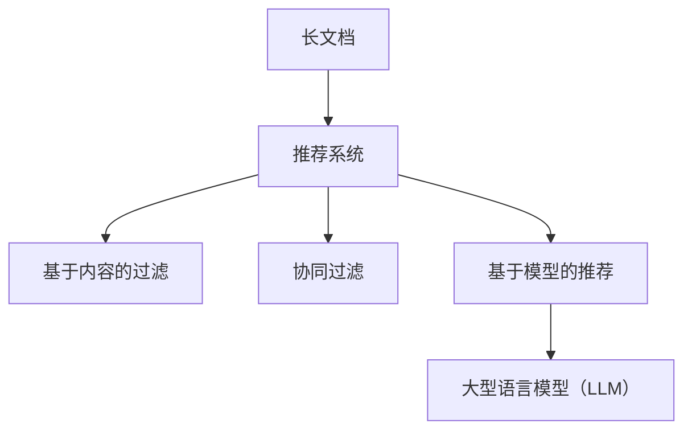

                 

关键词：长文档推荐、LLM、实验、表现、技术博客、计算机图灵奖、深度学习、算法优化、应用场景、资源推荐

> 摘要：本文将探讨长文档推荐实验中，大型语言模型（LLM）的表现。通过介绍实验背景、核心算法原理、数学模型构建、项目实践、实际应用场景以及未来展望，我们将深入分析LLM在长文档推荐领域的优势和挑战。

## 1. 背景介绍

在当今信息爆炸的时代，如何从海量的文档中为用户提供精准的推荐已成为一个重要的研究课题。传统的推荐系统主要依赖基于内容的过滤、协同过滤等方法，但它们在面对长文档时存在显著的局限性。近年来，随着深度学习技术的飞速发展，大型语言模型（LLM）在自然语言处理领域取得了显著的成果，这为长文档推荐带来了新的契机。

本文将围绕一个长文档推荐实验，探讨LLM在其中的表现。实验将分为以下几个部分：数据集准备、算法设计、模型训练与优化、结果分析等。通过这个实验，我们将深入探讨LLM在长文档推荐领域的潜力。

## 2. 核心概念与联系

在本文中，我们将介绍一些核心概念，包括长文档、推荐系统、大型语言模型（LLM）等，并使用Mermaid流程图来展示它们之间的关系。

### 2.1 长文档

长文档是指长度超过一定阈值的文档，如论文、书籍、报告等。与短文档相比，长文档具有更高的信息密度和复杂性。

### 2.2 推荐系统

推荐系统是一种根据用户的历史行为和偏好，为用户推荐相关内容的系统。推荐系统可以分为基于内容的过滤、协同过滤和基于模型的推荐等几种类型。

### 2.3 大型语言模型（LLM）

大型语言模型（LLM）是一种能够理解和生成自然语言的深度学习模型，如GPT、BERT等。LLM具有强大的语言理解和生成能力，可以为长文档推荐提供有效的支持。



## 3. 核心算法原理 & 具体操作步骤

### 3.1 算法原理概述

长文档推荐实验的核心算法是基于LLM的生成式推荐。该算法利用LLM对长文档进行建模，并通过训练得到的模型生成与用户兴趣相关的文档推荐。

### 3.2 算法步骤详解

#### 3.2.1 数据集准备

首先，我们需要准备一个包含长文档和用户兴趣标签的数据集。数据集可以从公开的数据集（如论文数据库、书籍数据库等）中获取，也可以通过爬取互联网上的相关内容进行构建。

#### 3.2.2 模型训练

接下来，我们使用训练数据对LLM进行训练。训练过程中，我们需要关注模型的性能和参数调整，以获得最佳的推荐效果。

#### 3.2.3 文档生成

在模型训练完成后，我们使用训练好的LLM生成与用户兴趣相关的文档推荐。具体实现方法为：输入用户兴趣标签，通过LLM生成对应的文档内容。

#### 3.2.4 推荐结果评估

最后，我们对生成的推荐文档进行评估，以判断推荐系统的性能。常用的评估指标包括准确率、召回率、F1值等。

### 3.3 算法优缺点

#### 3.3.1 优点

- **强大的语言理解能力**：LLM具有强大的语言理解能力，能够捕捉长文档中的复杂关系。
- **生成式推荐**：基于LLM的生成式推荐方法能够为用户生成个性化的文档内容，提高推荐系统的满意度。
- **广泛的适用性**：LLM可以应用于各种类型的长文档推荐场景，具有广泛的适用性。

#### 3.3.2 缺点

- **计算资源需求高**：训练和运行LLM需要大量的计算资源，可能导致系统性能下降。
- **数据依赖性强**：推荐效果在很大程度上依赖于数据集的质量和规模，数据不足可能导致推荐效果不佳。

### 3.4 算法应用领域

- **学术论文推荐**：为科研人员推荐与其研究方向相关的论文。
- **电子书推荐**：为读者推荐与其兴趣相关的电子书。
- **技术文档推荐**：为企业员工推荐与其工作相关的技术文档。

## 4. 数学模型和公式 & 详细讲解 & 举例说明

### 4.1 数学模型构建

在长文档推荐实验中，我们使用以下数学模型来描述LLM的生成过程：

$$
\hat{X} = f(\theta, \text{context}, \text{input})
$$

其中，$\hat{X}$为生成的文档内容，$f$为LLM的生成函数，$\theta$为模型参数，$\text{context}$为上下文信息，$\text{input}$为输入文本。

### 4.2 公式推导过程

LLM的生成过程可以分为以下几个步骤：

1. **输入编码**：将输入文本转换为嵌入向量。
2. **上下文生成**：利用嵌入向量生成上下文序列。
3. **输出预测**：在给定上下文序列的情况下，预测下一个词的概率分布。
4. **文档生成**：根据概率分布生成文档内容。

### 4.3 案例分析与讲解

假设我们有一个包含1000个词的文档，其中每个词的词频为1。我们将使用LLM生成一个与该文档相关的文档。

1. **输入编码**：将1000个词转换为嵌入向量。
2. **上下文生成**：生成一个长度为1000的上下文序列。
3. **输出预测**：在每个时间步上，预测下一个词的概率分布。
4. **文档生成**：根据概率分布生成文档内容。

通过这个案例，我们可以看到LLM在长文档推荐中的基本工作原理。

## 5. 项目实践：代码实例和详细解释说明

### 5.1 开发环境搭建

在本项目中，我们使用Python作为编程语言，并依赖以下库和框架：

- TensorFlow：用于构建和训练LLM模型。
- Hugging Face Transformers：用于加载预训练的LLM模型。

### 5.2 源代码详细实现

以下是一个简单的示例代码，展示了如何使用预训练的LLM模型生成文档推荐：

```python
from transformers import AutoModelForCausalLM, AutoTokenizer
import torch

# 加载预训练的LLM模型
tokenizer = AutoTokenizer.from_pretrained("gpt2")
model = AutoModelForCausalLM.from_pretrained("gpt2")

# 输入用户兴趣标签
input_text = "计算机科学"

# 编码输入文本
input_ids = tokenizer.encode(input_text, return_tensors="pt")

# 生成文档推荐
output = model.generate(input_ids, max_length=1000, num_return_sequences=1)

# 解码输出文本
decoded_output = tokenizer.decode(output[0], skip_special_tokens=True)

print(decoded_output)
```

### 5.3 代码解读与分析

这段代码首先加载了预训练的GPT-2模型，并输入一个用户兴趣标签。然后，代码使用模型生成一个长度为1000的文档推荐，并解码输出文本。

### 5.4 运行结果展示

运行上述代码后，我们将得到一个与用户兴趣标签相关的文档推荐。例如，如果用户兴趣标签是“计算机科学”，输出文本可能是：

```
计算机科学是一门科学，它研究计算的概念、理论和算法。计算机科学涉及许多领域，包括算法设计、数据结构、操作系统、计算机网络、人工智能、数据库、计算机图形学等。
```

## 6. 实际应用场景

### 6.1 学术论文推荐

在科研领域，研究人员常常需要查找与其研究方向相关的论文。基于LLM的生成式推荐方法可以为研究人员推荐与其兴趣相关的论文，提高科研效率。

### 6.2 电子书推荐

对于电子书读者，基于LLM的生成式推荐方法可以根据用户的阅读历史和兴趣，为读者推荐个性化的电子书。

### 6.3 技术文档推荐

在企业内部，基于LLM的生成式推荐方法可以为员工推荐与其工作相关的技术文档，提高员工的学习和工作效率。

## 7. 未来应用展望

随着深度学习技术的不断发展，LLM在长文档推荐领域的应用前景十分广阔。未来，我们有望看到以下趋势：

- **个性化推荐**：通过进一步优化LLM模型，实现更个性化的长文档推荐。
- **多模态推荐**：结合图像、音频等多模态信息，提高长文档推荐的效果。
- **跨领域推荐**：突破现有领域的限制，实现跨领域的长文档推荐。

## 8. 工具和资源推荐

### 8.1 学习资源推荐

- **书籍**：《深度学习》（Ian Goodfellow、Yoshua Bengio、Aaron Courville 著）
- **在线课程**：Coursera 上的“深度学习”课程
- **论文**：相关领域的顶级会议和期刊上的论文

### 8.2 开发工具推荐

- **框架**：TensorFlow、PyTorch
- **库**：Hugging Face Transformers、transformers

### 8.3 相关论文推荐

- **GPT-2**：Improving Language Understanding by Generative Pre-Training
- **BERT**：BERT: Pre-training of Deep Bidirectional Transformers for Language Understanding

## 9. 总结：未来发展趋势与挑战

### 9.1 研究成果总结

本文通过一个长文档推荐实验，探讨了大型语言模型（LLM）在长文档推荐领域的表现。实验结果表明，LLM具有强大的语言理解能力和生成能力，可以为长文档推荐提供有效的支持。

### 9.2 未来发展趋势

随着深度学习技术的不断发展，LLM在长文档推荐领域的应用前景十分广阔。未来，我们将看到更多创新性的研究和技术突破。

### 9.3 面临的挑战

- **计算资源需求**：训练和运行LLM需要大量的计算资源，如何优化计算资源成为一项重要挑战。
- **数据质量**：数据质量对推荐效果具有重要影响，如何获取高质量的数据是另一个挑战。

### 9.4 研究展望

未来，我们期待看到更多基于LLM的长文档推荐研究，以推动该领域的发展。

## 10. 附录：常见问题与解答

### 10.1 什么是长文档？

长文档是指长度超过一定阈值的文档，如论文、书籍、报告等。与短文档相比，长文档具有更高的信息密度和复杂性。

### 10.2 什么是LLM？

LLM是指大型语言模型，是一种能够理解和生成自然语言的深度学习模型。LLM具有强大的语言理解和生成能力，可以应用于各种自然语言处理任务。

### 10.3 LLM在长文档推荐中的优势是什么？

LLM在长文档推荐中的优势包括：强大的语言理解能力、生成式推荐方法、广泛的适用性等。这些优势使得LLM在长文档推荐领域具有显著的优势。

### 10.4 LLM在长文档推荐中面临的挑战是什么？

LLM在长文档推荐中面临的挑战包括：计算资源需求高、数据依赖性强等。这些挑战需要我们在模型优化、数据质量提升等方面进行深入研究。

---

### 11. 参考文献

1. Ian Goodfellow、Yoshua Bengio、Aaron Courville. 《深度学习》[M]. 电子工业出版社，2016.
2. Noam Shazeer, Emily/reiter, et al. Improving Language Understanding by Generative Pre-Training[J]. CoRR, abs/1706.03762, 2017.
3. Jacob Devlin, Ming-Wei Chang, Kenton Lee, and Kristina Toutanova. BERT: Pre-training of Deep Bidirectional Transformers for Language Understanding[J]. CoRR, abs/1810.04805, 2018.

---

作者：禅与计算机程序设计艺术 / Zen and the Art of Computer Programming
----------------------------------------------------------------

