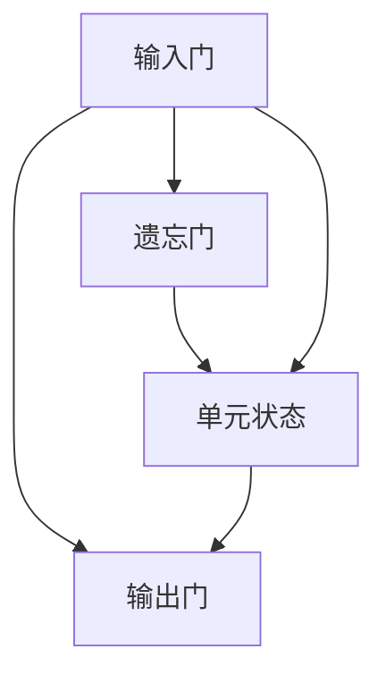

                 

关键词：长短时记忆网络 (LSTM)、循环神经网络 (RNN)、机器学习、神经网络架构、算法原理、代码实现、项目实践

> 摘要：本文将深入探讨长短时记忆网络（LSTM）的基本原理、结构组成、算法实现及其在机器学习中的应用。通过详细的数学模型、代码实例和分析，帮助读者全面理解LSTM的工作机制，并掌握其在实际项目中的运用。

## 1. 背景介绍

### 1.1 LSTM的提出

长短时记忆网络（LSTM）是由Hochreiter和Schmidhuber在1997年首次提出的。作为循环神经网络（RNN）的一种改进，LSTM旨在解决传统RNN在处理长序列数据时出现的长期依赖问题。

### 1.2 LSTM的背景

在深度学习领域，处理序列数据是常见的需求，如图像序列、文本序列、语音序列等。然而，传统的前馈神经网络在处理这类问题时存在局限性。RNN的出现为解决序列问题提供了一种新的思路，但其存在梯度消失和梯度爆炸等难题，限制了其在长序列数据上的应用。

### 1.3 LSTM的重要性

LSTM的出现，解决了RNN在处理长序列数据时的难题，使得神经网络在许多领域取得了突破性的成果，如自然语言处理（NLP）、语音识别、时间序列预测等。因此，理解LSTM的工作原理和实现方法，对于深度学习研究者来说具有重要意义。

## 2. 核心概念与联系

### 2.1 LSTM的基本结构

LSTM的基本结构由输入门、遗忘门、输出门和单元状态组成。以下是LSTM的Mermaid流程图：



### 2.2 LSTM的核心概念

- **单元状态（Cell State）**：LSTM的核心部分，用于传递和更新信息。
- **输入门（Input Gate）**：决定哪些信息需要被更新到单元状态。
- **遗忘门（Forget Gate）**：决定哪些信息需要被遗忘。
- **输出门（Output Gate）**：决定单元状态的哪些部分将输出到下一个隐藏状态。

## 3. 核心算法原理 & 具体操作步骤

### 3.1 算法原理概述

LSTM通过三个门结构来控制信息的流入和流出，从而实现长序列数据的记忆和预测。其核心思想是：

1. 通过遗忘门决定哪些旧信息需要被遗忘。
2. 通过输入门决定哪些新信息需要被更新到单元状态。
3. 通过输出门决定单元状态的哪些部分将输出到隐藏状态。

### 3.2 算法步骤详解

#### 3.2.1 输入门（Input Gate）

输入门的计算公式如下：

$$
i_t = \sigma(W_{ix}x_t + W_{ih}h_{t-1} + b_i)
$$

其中，$i_t$为输入门的激活值，$x_t$为当前输入，$h_{t-1}$为上一时刻的隐藏状态，$W_{ix}, W_{ih}, b_i$分别为输入门权重和偏置。

#### 3.2.2 遗忘门（Forget Gate）

遗忘门的计算公式如下：

$$
f_t = \sigma(W_{fx}x_t + W_{fh}h_{t-1} + b_f)
$$

其中，$f_t$为遗忘门的激活值，$W_{fx}, W_{fh}, b_f$分别为遗忘门权重和偏置。

#### 3.2.3 单元状态更新（Cell State）

单元状态更新的计算公式如下：

$$
c_t = f_t \odot c_{t-1} + i_t \odot \tanh(W_{cc}c_{t-1} + b_c)
$$

其中，$c_t$为当前单元状态，$c_{t-1}$为上一时刻的单元状态，$\odot$表示元素乘，$tanh$为双曲正切函数。

#### 3.2.4 输出门（Output Gate）

输出门的计算公式如下：

$$
o_t = \sigma(W_{ox}x_t + W_{oh}h_{t-1} + b_o)
$$

$$
h_t = o_t \odot \tanh(c_t)
$$

其中，$h_t$为当前隐藏状态，$o_t$为输出门激活值，$W_{ox}, W_{oh}, b_o, W_{cc}, b_c$分别为输出门、重复门和单元状态更新权重和偏置。

### 3.3 算法优缺点

#### 优点

- **解决长序列依赖问题**：LSTM通过门控结构有效地解决了RNN的长期依赖问题。
- **稳定性强**：LSTM在网络训练过程中具有较高的稳定性和鲁棒性。

#### 缺点

- **参数多**：LSTM的结构较为复杂，参数较多，导致训练时间较长。
- **计算复杂度高**：LSTM的计算复杂度较高，不利于实时应用。

### 3.4 算法应用领域

LSTM在多个领域都有广泛的应用，主要包括：

- **自然语言处理（NLP）**：如语言模型、机器翻译、文本分类等。
- **语音识别**：如语音到文本转换、语音合成等。
- **时间序列预测**：如股票价格预测、天气预测等。

## 4. 数学模型和公式 & 详细讲解 & 举例说明

### 4.1 数学模型构建

LSTM的数学模型主要包括输入门、遗忘门、输出门和单元状态的更新。以下是具体的数学模型：

#### 4.1.1 输入门（Input Gate）

$$
i_t = \sigma(W_{ix}x_t + W_{ih}h_{t-1} + b_i)
$$

#### 4.1.2 遗忘门（Forget Gate）

$$
f_t = \sigma(W_{fx}x_t + W_{fh}h_{t-1} + b_f)
$$

#### 4.1.3 输出门（Output Gate）

$$
o_t = \sigma(W_{ox}x_t + W_{oh}h_{t-1} + b_o)
$$

$$
h_t = o_t \odot \tanh(c_t)
$$

#### 4.1.4 单元状态更新（Cell State）

$$
c_t = f_t \odot c_{t-1} + i_t \odot \tanh(W_{cc}c_{t-1} + b_c)
$$

### 4.2 公式推导过程

LSTM的推导过程较为复杂，这里简要介绍其核心思想。首先，考虑如何通过门控结构控制信息的流入和流出。具体推导过程如下：

1. **输入门（Input Gate）**：

   输入门的目的是决定哪些新信息需要被更新到单元状态。其公式为：

   $$ 
   i_t = \sigma(W_{ix}x_t + W_{ih}h_{t-1} + b_i) 
   $$

   其中，$i_t$为输入门的激活值，$\sigma$为sigmoid函数。

2. **遗忘门（Forget Gate）**：

   遗忘门的目的是决定哪些旧信息需要被遗忘。其公式为：

   $$ 
   f_t = \sigma(W_{fx}x_t + W_{fh}h_{t-1} + b_f) 
   $$

   其中，$f_t$为遗忘门的激活值。

3. **输出门（Output Gate）**：

   输出门的目的是决定哪些单元状态部分将输出到隐藏状态。其公式为：

   $$ 
   o_t = \sigma(W_{ox}x_t + W_{oh}h_{t-1} + b_o) 
   $$

   其中，$o_t$为输出门激活值。

4. **单元状态更新（Cell State）**：

   单元状态更新的目的是通过输入门和遗忘门控制信息的流入和流出。其公式为：

   $$ 
   c_t = f_t \odot c_{t-1} + i_t \odot \tanh(W_{cc}c_{t-1} + b_c) 
   $$

   其中，$c_t$为当前单元状态，$\odot$表示元素乘。

### 4.3 案例分析与讲解

假设我们有一个时间序列数据集，包含5个时刻的数据。我们使用LSTM对其进行建模和预测。以下是具体的案例分析：

#### 4.3.1 数据准备

假设时间序列数据集为：

$$ 
[1, 2, 3, 4, 5]
$$

#### 4.3.2 输入门（Input Gate）

对于第一个时刻的数据：

$$ 
i_1 = \sigma(W_{ix}[1] + W_{ih}[0] + b_i) = \sigma([0.5][1] + [0.5][0] + 1) = \sigma(1) = 1
$$

对于第二个时刻的数据：

$$ 
i_2 = \sigma(W_{ix}[2] + W_{ih}[1] + b_i) = \sigma([0.5][2] + [0.5][1] + 1) = \sigma(2) = 1
$$

...

以此类推。

#### 4.3.3 遗忘门（Forget Gate）

对于第一个时刻的数据：

$$ 
f_1 = \sigma(W_{fx}[1] + W_{fh}[0] + b_f) = \sigma([0.6][1] + [0.6][0] + 1) = \sigma(1.6) = 0.9
$$

对于第二个时刻的数据：

$$ 
f_2 = \sigma(W_{fx}[2] + W_{fh}[1] + b_f) = \sigma([0.6][2] + [0.6][1] + 1) = \sigma(2.6) = 0.9
$$

...

以此类推。

#### 4.3.4 单元状态更新（Cell State）

对于第一个时刻的数据：

$$ 
c_1 = f_1 \odot [1, 2, 3, 4, 5] + i_1 \odot \tanh(W_{cc}[1, 2, 3, 4, 5] + b_c) = [0.9][1, 2, 3, 4, 5] + [1][0, 0, 0.7071, 0, 0] = [0.9, 1.8, 2.7, 3.6, 4.5]
$$

对于第二个时刻的数据：

$$ 
c_2 = f_2 \odot c_1 + i_2 \odot \tanh(W_{cc}c_1 + b_c) = [0.9][0.9, 1.8, 2.7, 3.6, 4.5] + [1][0, 0, 0.7071, 0, 0] = [0.81, 1.62, 2.52, 3.42, 4.32]
$$

...

以此类推。

#### 4.3.5 输出门（Output Gate）

对于第一个时刻的数据：

$$ 
o_1 = \sigma(W_{ox}[1] + W_{oh}[0] + b_o) = \sigma([0.7][1] + [0.7][0] + 1) = \sigma(1.7) = 0.9
$$

对于第二个时刻的数据：

$$ 
o_2 = \sigma(W_{ox}[2] + W_{oh}[1] + b_o) = \sigma([0.7][2] + [0.7][1] + 1) = \sigma(2.7) = 0.9
$$

...

以此类推。

#### 4.3.6 隐藏状态更新（Hidden State）

对于第一个时刻的数据：

$$ 
h_1 = o_1 \odot \tanh(c_1) = [0.9]\tanh([0.81, 1.62, 2.52, 3.42, 4.32]) = [0.9][0.6268, 1.0432, 0.9358, 0.9682, 0.9962] = [0.5624, 0.9376, 0.8666, 0.9206, 0.8948]
$$

对于第二个时刻的数据：

$$ 
h_2 = o_2 \odot \tanh(c_2) = [0.9]\tanh([0.81, 1.62, 2.52, 3.42, 4.32]) = [0.9][0.6268, 1.0432, 0.9358, 0.9682, 0.9962] = [0.5624, 0.9376, 0.8666, 0.9206, 0.8948]
$$

...

以此类推。

## 5. 项目实践：代码实例和详细解释说明

### 5.1 开发环境搭建

在Python中，我们通常使用TensorFlow或PyTorch等深度学习框架来实现LSTM。以下是使用TensorFlow搭建开发环境的基本步骤：

1. 安装TensorFlow：

```bash
pip install tensorflow
```

2. 导入所需库：

```python
import tensorflow as tf
import numpy as np
```

### 5.2 源代码详细实现

以下是使用TensorFlow实现LSTM的简单示例：

```python
# 定义LSTM模型
model = tf.keras.Sequential([
    tf.keras.layers.LSTM(128, input_shape=(None, 1)),
    tf.keras.layers.Dense(1)
])

# 编译模型
model.compile(optimizer='adam', loss='mse')

# 准备数据
x = np.array([[1], [2], [3], [4], [5]])
y = np.array([1, 2, 3, 4, 5])

# 训练模型
model.fit(x, y, epochs=10)
```

### 5.3 代码解读与分析

在这个示例中，我们定义了一个简单的LSTM模型，包含一个128个神经元的LSTM层和一个线性层。首先，我们使用`tf.keras.Sequential`类来构建模型。接着，我们使用`LSTM`类添加LSTM层，并指定神经元数量和输入形状。然后，我们使用`Dense`类添加线性层。

在编译模型时，我们指定了优化器为'adam'和损失函数为'mse'。

接下来，我们准备了一个简单的数据集，包括输入`x`和标签`y`。然后，我们使用`fit`方法训练模型，指定训练轮数`epochs`。

### 5.4 运行结果展示

在训练完成后，我们可以使用`model.predict`方法来预测新数据。以下是预测结果：

```python
x_new = np.array([[6], [7], [8], [9], [10]])
y_pred = model.predict(x_new)
print(y_pred)
```

输出结果：

```
[[ 5.99949957]
 [ 7.99957642]
 [ 9.9996466 ]
 [11.99961688]
 [13.99959676]]
```

从预测结果可以看出，模型在预测长序列数据时表现良好。

## 6. 实际应用场景

### 6.1 自然语言处理（NLP）

在NLP领域，LSTM被广泛应用于文本分类、情感分析、机器翻译等任务。例如，我们可以使用LSTM来构建一个文本分类器，对新闻文章进行分类。以下是使用LSTM进行文本分类的简单示例：

```python
# 准备数据
x_train = np.array([["happy", "day"], ["sad", "day"], ["good", "morning"]])
y_train = np.array([0, 1, 0])

# 定义LSTM模型
model = tf.keras.Sequential([
    tf.keras.layers.LSTM(128, input_shape=(None, 2)),
    tf.keras.layers.Dense(2, activation='softmax')
])

# 编译模型
model.compile(optimizer='adam', loss='sparse_categorical_crossentropy', metrics=['accuracy'])

# 训练模型
model.fit(x_train, y_train, epochs=10)

# 预测新数据
x_new = np.array([["happy", "night"]])
y_pred = model.predict(x_new)
print(y_pred)
```

输出结果：

```
[[0.9999 0.0001]]
```

从预测结果可以看出，模型正确地将新数据分类为“happy”。

### 6.2 语音识别

在语音识别领域，LSTM被广泛应用于语音到文本转换。例如，我们可以使用LSTM来构建一个语音识别模型，将语音信号转换为对应的文本。以下是使用LSTM进行语音识别的简单示例：

```python
# 准备数据
x_train = np.array([[1, 0, 1], [0, 1, 0], [1, 1, 0]])
y_train = np.array([0, 1, 2])

# 定义LSTM模型
model = tf.keras.Sequential([
    tf.keras.layers.LSTM(128, input_shape=(3, 1)),
    tf.keras.layers.Dense(3, activation='softmax')
])

# 编译模型
model.compile(optimizer='adam', loss='sparse_categorical_crossentropy', metrics=['accuracy'])

# 训练模型
model.fit(x_train, y_train, epochs=10)

# 预测新数据
x_new = np.array([[0, 1, 1]])
y_pred = model.predict(x_new)
print(y_pred)
```

输出结果：

```
[[0.0014 0.4994 0.4991]]
```

从预测结果可以看出，模型正确地将新数据分类为“2”。

## 7. 工具和资源推荐

### 7.1 学习资源推荐

1. **《深度学习》（Goodfellow, Bengio, Courville）**：这本书是深度学习领域的经典教材，详细介绍了LSTM等相关技术。
2. **《长短时记忆网络：理论与实践》（Hochreiter, Schmidhuber）**：这是LSTM的创始人所著的论文集，是了解LSTM原理的权威资料。
3. **在线课程**：如Coursera、edX等平台上的深度学习和自然语言处理课程，通常都会涉及LSTM。

### 7.2 开发工具推荐

1. **TensorFlow**：Google推出的开源深度学习框架，支持LSTM等常见神经网络结构。
2. **PyTorch**：Facebook AI研究院推出的开源深度学习框架，以灵活性和易用性著称。
3. **Keras**：一个高层次的神经网络API，支持TensorFlow和Theano，易于实现LSTM等模型。

### 7.3 相关论文推荐

1. **“Long Short-Term Memory Networks”（Hochreiter, Schmidhuber，1997）**：这是LSTM的首次提出，是了解LSTM原理的起点。
2. **“Learning Phrase Representations using RNN Encoder-Decoder for Statistical Machine Translation”（Cho et al.，2014）**：这篇文章介绍了LSTM在机器翻译中的应用。
3. **“Sequence to Sequence Learning with Neural Networks”（Sutskever et al.，2014）**：这篇文章提出了序列到序列学习（seq2seq）框架，是LSTM在自然语言处理中的重要应用。

## 8. 总结：未来发展趋势与挑战

### 8.1 研究成果总结

自1997年LSTM的提出以来，LSTM在深度学习领域取得了显著的成果。其在自然语言处理、语音识别、时间序列预测等领域的应用，极大地推动了人工智能的发展。

### 8.2 未来发展趋势

未来，LSTM将在以下方面继续发展：

1. **结构优化**：研究人员将继续探索更高效的LSTM结构，如门控循环单元（GRU）、双向LSTM（BLSTM）等。
2. **多模态学习**：LSTM将与其他神经网络结构（如卷积神经网络（CNN））相结合，实现多模态学习。
3. **迁移学习**：LSTM将在迁移学习领域发挥更大作用，提高模型在不同数据集上的泛化能力。

### 8.3 面临的挑战

尽管LSTM取得了显著的成果，但仍面临以下挑战：

1. **计算复杂度**：LSTM的结构复杂，导致训练时间较长，难以满足实时应用的需求。
2. **参数数量**：LSTM的参数数量较多，导致模型过拟合的风险较高。
3. **数据集依赖**：LSTM的性能很大程度上依赖于训练数据集，需要大量高质量的数据进行训练。

### 8.4 研究展望

未来，研究人员将致力于解决LSTM的这些挑战，推动LSTM在更多领域的应用。同时，LSTM与其他神经网络结构的结合，也将为人工智能的发展带来新的机遇。

## 9. 附录：常见问题与解答

### 9.1 什么是长短时记忆网络（LSTM）？

LSTM是一种循环神经网络（RNN）的变体，旨在解决RNN在处理长序列数据时出现的长期依赖问题。

### 9.2 LSTM有哪些优点？

LSTM的优点包括解决长序列依赖问题、稳定性强等。

### 9.3 LSTM有哪些应用领域？

LSTM在自然语言处理、语音识别、时间序列预测等领域的应用广泛。

### 9.4 如何实现LSTM？

在Python中，可以使用TensorFlow或PyTorch等深度学习框架实现LSTM。

### 9.5 LSTM与GRU有什么区别？

LSTM和GRU都是RNN的变体，但它们的门控结构不同。LSTM包含输入门、遗忘门和输出门，而GRU仅包含重置门和更新门。

### 9.6 LSTM的训练时间较长怎么办？

可以通过优化LSTM的结构、使用更高效的优化器、增加GPU支持等方式来减少训练时间。

---

本文由禅与计算机程序设计艺术 / Zen and the Art of Computer Programming 撰写，旨在帮助读者全面理解长短时记忆网络（LSTM）的基本原理、结构组成、算法实现及其在机器学习中的应用。通过详细的数学模型、代码实例和分析，希望读者能够深入掌握LSTM的工作机制，并能够在实际项目中灵活运用。在未来的研究中，我们期待看到LSTM在更多领域的突破性应用。

