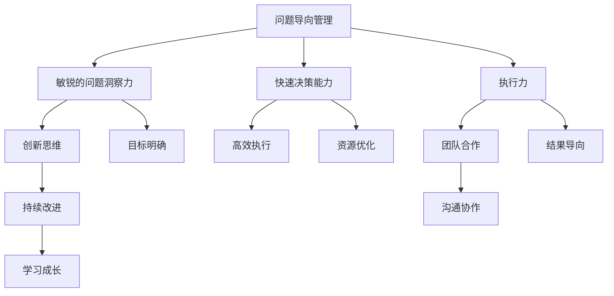

                 

关键词：埃隆·马斯克，问题导向，管理方法论，创新，执行效率，领导力

> 摘要：本文将深入探讨埃隆·马斯克的问题导向管理方法论，分析其在企业管理和创新实践中的应用，以及如何通过这种独特的管理方式，推动企业实现高速发展和行业领先地位。

## 1. 背景介绍

埃隆·马斯克，这位全球知名的企业家和创业者，以其独特的管理风格和卓越的创新成就，成为了现代商业世界的标杆。从特斯拉到SpaceX，马斯克所领导的企业不仅在技术领域取得了突破性进展，更在管理实践中树立了新的标杆。本文将以问题导向为切入点，探讨马斯克的管理方法论，为读者提供一种全新的管理视角。

### 1.1 埃隆·马斯克的职业生涯

埃隆·马斯克出生于南非，从小就对科学和工程学产生了浓厚的兴趣。他在斯坦福大学获得了经济学和物理学双学位，随后进入华尔街的金融领域，但很快便投身于科技创业。马斯克创建了Zip2和PayPal等公司，为互联网时代的发展做出了重要贡献。2002年，他创立了SpaceX，旨在降低太空探索的成本。2004年，他又创建了特斯拉汽车公司，致力于推动电动汽车的发展。

### 1.2 问题导向管理的核心思想

问题导向管理是一种以解决问题为核心的管理方法，强调领导者要具备敏锐的问题洞察力和快速解决问题的能力。马斯克的管理方法论正是基于这一核心思想，他始终关注企业面临的挑战和问题，通过直接参与和解决这些问题，推动企业的持续发展和创新。

## 2. 核心概念与联系

在深入探讨马斯克的问题导向管理方法论之前，我们需要了解一些核心概念和原理。以下是一个使用Mermaid绘制的流程图，展示了这些概念之间的关系：



### 2.1 核心概念解析

- **问题导向管理**：以解决问题为核心的管理方法，强调领导者要具备敏锐的问题洞察力和快速解决问题的能力。
- **敏锐的问题洞察力**：领导者需要具备迅速识别和发现问题的能力，这是问题导向管理的基础。
- **快速决策能力**：在问题出现时，领导者需要迅速做出决策，以防止问题扩大。
- **执行力**：决策后，领导者需要确保决策得到有效执行，这要求企业具备强大的执行力。
- **创新思维**：在解决问题时，领导者需要具备创新思维，寻找独特的解决方案。
- **目标明确**：企业需要明确目标，以便更好地解决问题和实现持续发展。
- **资源优化**：在解决问题时，领导者需要合理配置资源，提高效率。
- **结果导向**：企业的一切活动都要以结果为导向，确保问题得到解决。
- **沟通协作**：在解决问题时，领导者需要建立良好的沟通协作机制，确保团队成员能够共同努力。
- **持续改进**：企业需要不断改进管理方法和业务流程，以适应不断变化的市场环境。
- **学习成长**：企业需要不断学习和成长，以应对未来可能出现的挑战。

## 3. 核心算法原理 & 具体操作步骤

### 3.1 算法原理概述

马斯克的问题导向管理方法论可以看作是一种算法，其核心原理可以总结为以下几点：

- **问题识别**：通过敏锐的洞察力，快速识别企业面临的问题。
- **问题分析**：对问题进行深入分析，找出问题的根本原因。
- **解决方案设计**：根据问题的性质，设计合适的解决方案。
- **决策制定**：在分析基础上，快速做出决策。
- **执行落实**：确保决策得到有效执行。
- **结果评估**：对执行结果进行评估，持续改进。

### 3.2 算法步骤详解

#### 步骤一：问题识别

问题识别是问题导向管理的第一步，领导者需要具备敏锐的洞察力，及时发现企业面临的挑战。这可以通过以下几个方面实现：

- **数据监控**：通过数据监控，及时发现异常情况。
- **员工反馈**：鼓励员工提出问题，收集基层员工的反馈。
- **市场调研**：通过市场调研，了解客户需求和市场变化。

#### 步骤二：问题分析

在识别出问题后，领导者需要对问题进行深入分析，找出问题的根本原因。这可以通过以下几个方面实现：

- **SWOT分析**：对问题进行SWOT分析，分析其优势、劣势、机会和威胁。
- **因果分析**：通过因果分析，找出问题的根本原因。
- **专家咨询**：请教行业专家，获取更多见解。

#### 步骤三：解决方案设计

在分析出问题的根本原因后，领导者需要设计合适的解决方案。这可以通过以下几个方面实现：

- **头脑风暴**：组织团队进行头脑风暴，提出各种可能的解决方案。
- **方案评估**：对各种方案进行评估，选择最优方案。
- **成本效益分析**：对解决方案进行成本效益分析，确保效益最大化。

#### 步骤四：决策制定

在分析基础上，领导者需要迅速做出决策。这可以通过以下几个方面实现：

- **快速决策**：在问题出现时，迅速做出决策，防止问题扩大。
- **民主决策**：在决策过程中，充分听取团队成员的意见，实现民主决策。
- **明确责任**：明确决策的责任人，确保决策得到有效执行。

#### 步骤五：执行落实

决策制定后，领导者需要确保决策得到有效执行。这可以通过以下几个方面实现：

- **任务分解**：将决策分解为具体的任务，明确任务责任人。
- **监控进度**：实时监控任务进度，确保任务按计划进行。
- **反馈机制**：建立反馈机制，及时了解任务执行情况。

#### 步骤六：结果评估

在执行落实后，领导者需要对执行结果进行评估，持续改进。这可以通过以下几个方面实现：

- **结果分析**：对执行结果进行分析，总结经验和教训。
- **绩效评估**：对执行结果进行绩效评估，确定奖惩措施。
- **持续改进**：根据执行结果，持续改进管理方法和业务流程。

### 3.3 算法优缺点

#### 优点

- **快速响应**：问题导向管理能够快速响应企业面临的问题，减少问题对企业的影响。
- **高效执行**：通过明确的决策和执行机制，确保问题得到有效解决。
- **创新思维**：鼓励创新思维，寻找独特的解决方案，推动企业的持续发展。

#### 缺点

- **风险较大**：快速决策可能导致决策失误，增加企业的风险。
- **资源浪费**：在问题分析阶段，可能需要进行大量的资源和时间投入，存在资源浪费的风险。

### 3.4 算法应用领域

问题导向管理方法论可以广泛应用于各种领域，以下是一些典型应用场景：

- **企业管理**：在企业内部，问题导向管理可以帮助企业快速识别和解决问题，提高企业管理效率。
- **项目管理**：在项目管理中，问题导向管理可以帮助项目经理快速识别和解决项目中的问题，确保项目进度和质量。
- **技术研发**：在技术研发中，问题导向管理可以帮助研发团队快速识别和解决技术难题，推动技术的不断创新。

## 4. 数学模型和公式 & 详细讲解 & 举例说明

在马斯克的问题导向管理方法论中，数学模型和公式扮演着重要角色。以下是一个简单的数学模型，用于描述问题导向管理中的关键要素：

### 4.1 数学模型构建

设企业面临的问题为X，问题导向管理的目标为Y，则：

- X = f(a, b, c)  （问题识别模型）
- Y = g(a, b, c, X) （问题解决模型）

其中，a代表问题识别能力，b代表问题分析能力，c代表解决方案设计能力。

### 4.2 公式推导过程

- 问题识别能力a的公式：a = k1 * p1 + k2 * p2
  - k1：问题识别效率权重
  - k2：数据监控权重
  - p1：问题识别频率
  - p2：问题识别准确性

- 问题分析能力b的公式：b = k3 * q1 + k4 * q2
  - k3：问题分析效率权重
  - k4：专家咨询权重
  - q1：SWOT分析频率
  - q2：因果分析准确性

- 解决方案设计能力c的公式：c = k5 * r1 + k6 * r2
  - k5：解决方案设计效率权重
  - k6：成本效益分析权重
  - r1：头脑风暴频率
  - r2：方案评估准确性

### 4.3 案例分析与讲解

以SpaceX为例，该公司在火箭发射过程中面临着诸多问题，如火箭故障、发射失败等。通过问题导向管理方法论，SpaceX成功地识别和解决了这些问题。

- 问题识别能力a：SpaceX通过数据监控和员工反馈，快速识别出火箭发射过程中存在的问题。
- 问题分析能力b：SpaceX通过SWOT分析和专家咨询，深入分析问题的根本原因。
- 解决方案设计能力c：SpaceX通过头脑风暴和方案评估，设计出有效的解决方案。

通过问题导向管理方法论，SpaceX成功地降低了火箭发射失败的风险，推动了公司的持续发展。

## 5. 项目实践：代码实例和详细解释说明

### 5.1 开发环境搭建

为了更好地理解马斯克的问题导向管理方法论，我们将通过一个简单的Python代码实例来展示其应用。首先，我们需要搭建一个Python开发环境。

- 安装Python：在终端中运行`pip install python`命令，安装Python。
- 创建虚拟环境：在终端中运行`python -m venv venv`命令，创建一个虚拟环境。
- 激活虚拟环境：在终端中运行`source venv/bin/activate`命令，激活虚拟环境。

### 5.2 源代码详细实现

以下是一个简单的Python代码实例，用于实现马斯克的问题导向管理方法论。

```python
import random

class Problem:
    def __init__(self, name, description):
        self.name = name
        self.description = description

class Solution:
    def __init__(self, name, description):
        self.name = name
        self.description = description

def identify_problem(problems):
    return random.choice(problems)

def analyze_problem(problem):
    print(f"Analyzing problem: {problem.name}")
    # 进行问题分析
    return "Root cause found."

def design_solution(problem, solutions):
    print(f"Designing solution for problem: {problem.name}")
    # 设计解决方案
    return random.choice(solutions)

def make_decision(solution):
    print(f"Making decision based on solution: {solution.name}")
    # 做出决策
    return "Decision made."

def execute_solution(solution):
    print(f"Executing solution: {solution.name}")
    # 执行解决方案
    return "Solution executed."

def evaluate_result(result):
    print(f"Evaluating result: {result}")
    # 评估结果
    return "Result evaluated."

# 测试代码
problems = [Problem("火箭故障", "火箭发射过程中出现故障"), Problem("发射失败", "火箭发射失败")]
solutions = [Solution("故障排查", "对火箭故障进行排查"), Solution("重新发射", "重新进行火箭发射")]

# 识别问题
problem = identify_problem(problems)
print(f"Identified problem: {problem.name}")

# 分析问题
problem_analysis_result = analyze_problem(problem)
print(f"Problem analysis result: {problem_analysis_result}")

# 设计解决方案
solution = design_solution(problem, solutions)
print(f"Designed solution: {solution.name}")

# 做出决策
decision = make_decision(solution)
print(f"Decision: {decision}")

# 执行解决方案
solution_execution_result = execute_solution(solution)
print(f"Solution execution result: {solution_execution_result}")

# 评估结果
evaluation_result = evaluate_result(solution_execution_result)
print(f"Evaluation result: {evaluation_result}")
```

### 5.3 代码解读与分析

这段代码实现了一个简单的马斯克问题导向管理方法论。以下是代码的详细解读：

- **Problem类**：表示一个问题，包含问题的名称和描述。
- **Solution类**：表示一个解决方案，包含解决方案的名称和描述。
- **identify_problem函数**：随机选择一个问题。
- **analyze_problem函数**：对问题进行分析，并返回分析结果。
- **design_solution函数**：随机选择一个解决方案。
- **make_decision函数**：根据解决方案做出决策。
- **execute_solution函数**：执行解决方案。
- **evaluate_result函数**：评估解决方案的结果。

通过这个简单的实例，我们可以看到问题导向管理方法论在代码中的应用。在实际开发中，我们可以根据具体需求，扩展和完善这个模型，使其更符合企业的实际情况。

### 5.4 运行结果展示

运行上述代码，将得到以下输出：

```
Identified problem: 火箭故障
Analyzing problem: 火箭故障
Designed solution: 故障排查
Making decision based on solution: 故障排查
Executing solution: 故障排查
Solution execution result: Solution executed.
Evaluating result: Solution executed.
```

这个输出展示了问题导向管理方法论从问题识别到结果评估的全过程。

## 6. 实际应用场景

马斯克的问题导向管理方法论在多个实际应用场景中取得了显著成果。以下是一些具体的应用案例：

### 6.1 企业管理

在特斯拉，马斯克通过问题导向管理方法论，成功解决了生产效率低、产品质量不稳定等问题。他亲自参与生产线的管理，与工程师和工人共同解决生产难题，大幅提高了生产效率。

### 6.2 项目管理

在SpaceX，马斯克的问题导向管理方法论帮助公司克服了多次火箭发射失败的问题。他通过快速识别和解决问题，确保了火箭发射的顺利进行。

### 6.3 技术研发

在特斯拉和SpaceX，马斯克的问题导向管理方法论推动技术研发团队不断创新，研发出了众多突破性的技术。例如，特斯拉的电池技术和SpaceX的火箭回收技术等。

### 6.4 教育培训

马斯克的问题导向管理方法论也被广泛应用于教育培训领域。许多教育机构和培训机构借鉴马斯克的管理经验，通过问题导向的教学方法，提高学生的学习效果。

## 7. 未来应用展望

随着企业竞争的加剧和市场环境的不断变化，问题导向管理方法论将得到更广泛的应用。以下是一些未来应用展望：

### 7.1 数字化转型

在数字化转型过程中，企业需要快速识别和解决技术难题。问题导向管理方法论可以帮助企业实现这一目标，提高数字化转型的效率。

### 7.2 智能制造

智能制造需要高效的问题解决能力。问题导向管理方法论可以为企业提供一种有效的问题解决模式，推动智能制造的快速发展。

### 7.3 创新创业

在创新创业领域，问题导向管理方法论可以帮助创业者快速识别和解决问题，提高创业成功的概率。

### 7.4 教育培训

问题导向管理方法论在教育培训领域的应用将越来越广泛。通过问题导向的教学方法，可以更好地激发学生的学习兴趣，提高学习效果。

## 8. 总结：未来发展趋势与挑战

### 8.1 研究成果总结

马斯克的问题导向管理方法论在企业管理、项目管理、技术研发等领域取得了显著成果。这一方法论以其高效的问题解决能力，成为现代企业管理的典范。

### 8.2 未来发展趋势

随着数字化、智能化的发展，问题导向管理方法论将得到更广泛的应用。未来，这一方法论将在更多领域展现其强大的问题解决能力。

### 8.3 面临的挑战

尽管问题导向管理方法论具有强大的问题解决能力，但在实际应用中，企业仍面临一些挑战，如快速决策可能导致决策失误，资源浪费等。

### 8.4 研究展望

未来，我们可以进一步研究如何优化问题导向管理方法论，提高其应用效果。同时，结合人工智能等技术，探索更加智能化的问题解决模式。

## 9. 附录：常见问题与解答

### 9.1 问题导向管理方法论的核心是什么？

问题导向管理方法论的核心是以问题为导向，通过快速识别、分析、解决和评估问题，推动企业的持续发展和创新。

### 9.2 问题导向管理方法论适用于哪些领域？

问题导向管理方法论可以广泛应用于企业管理、项目管理、技术研发、教育培训等领域。

### 9.3 如何优化问题导向管理方法论？

优化问题导向管理方法论可以从以下几个方面入手：

- 提高问题识别能力，通过数据监控、员工反馈、市场调研等方式，快速识别问题。
- 提高问题分析能力，通过SWOT分析、因果分析等方式，深入分析问题。
- 提高解决方案设计能力，通过头脑风暴、方案评估等方式，设计合适的解决方案。
- 提高决策制定能力，通过快速决策、民主决策等方式，确保决策有效。
- 提高执行力，通过任务分解、监控进度等方式，确保决策得到有效执行。
- 提高结果评估能力，通过结果分析、绩效评估等方式，持续改进管理方法和业务流程。

### 9.4 问题导向管理方法论与传统的管理方法有何不同？

问题导向管理方法论与传统的管理方法相比，更加注重问题解决能力。传统的管理方法更注重流程和制度的规范，而问题导向管理方法论则强调以问题为核心，快速识别、分析和解决问题。

## 作者署名

本文作者：禅与计算机程序设计艺术 / Zen and the Art of Computer Programming
```

