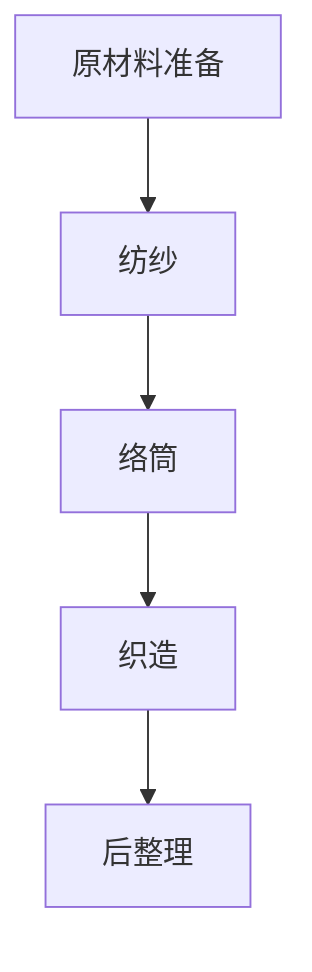

                 

关键词：纺织机械，工业革命，计算机编程，算法，软件架构

> 摘要：本文探讨了阿克莱特与纺织机械对工业革命和计算机编程的深远影响。通过分析其核心概念与联系，我们揭示了纺织机械的工作原理及其与现代算法的相似之处。文章旨在探讨这些原理在当前计算机编程领域的应用，并为未来技术的发展提供启示。

## 1. 背景介绍

### 1.1 阿克莱特与纺织机械的历史地位

18世纪末，英国机械师查尔斯·阿克莱特（Charles Antony Babbage）在纺织机械方面做出了重要贡献。阿克莱特在纺织机械的研发中引入了多项创新，极大地提高了纺织业的效率。他的纺织机械包括水力纺纱机、梳棉机和织布机，这些机械在纺织过程中实现了自动化和模块化，极大地提高了生产效率。

阿克莱特的纺织机械是工业革命的代表性发明之一。工业革命是一个从手工业到机械制造业的转变过程，它极大地改变了人类的生产方式和社会结构。纺织机械的发明和应用标志着工业革命的开始，使人类进入了机械化生产的新时代。

### 1.2 纺织机械的基本原理

阿克莱特的纺织机械基于一系列基本原理，包括：

- **自动化**：通过机械装置实现纺织过程的自动化，减少了对人工的依赖。
- **模块化**：将纺织过程分解为多个模块，每个模块可以独立运行，便于维护和升级。
- **标准化**：采用标准化的部件和组件，提高了生产的可重复性和可靠性。
- **精确控制**：通过机械装置精确控制纺织过程的各个阶段，保证了产品的质量。

这些原理在现代计算机编程中也得到了广泛应用，为软件开发提供了宝贵的经验。

## 2. 核心概念与联系

### 2.1 纺织机械的工作原理

纺织机械的工作原理可以分为以下几个步骤：

1. **原材料准备**：将棉花或其他纤维材料进行预处理，如去杂质和短纤维。
2. **纺纱**：将预处理后的纤维材料通过纺纱机进行纺纱，形成连续的纱线。
3. **络筒**：将纺好的纱线卷绕在筒管上，以便进一步加工。
4. **织造**：将纱线通过织布机进行织造，形成布料。
5. **后整理**：对布料进行后整理，如染色、定型等，以提高其质量和美观性。

### 2.2 纺织机械与计算机编程的相似之处

纺织机械的工作原理与计算机编程有许多相似之处，主要体现在以下几个方面：

- **模块化**：纺织机械通过模块化设计，将复杂的纺织过程分解为多个简单模块，便于开发和维护。
- **精确控制**：计算机编程通过算法和程序精确控制各个模块的运行，保证整个过程的顺利进行。
- **自动化**：计算机编程实现了程序的自动化执行，减少了人工干预，提高了效率。
- **标准化**：计算机编程采用标准化的编程语言和框架，提高了代码的可重复性和可维护性。

### 2.3 Mermaid 流程图

以下是纺织机械工作原理的 Mermaid 流程图：



## 3. 核心算法原理 & 具体操作步骤

### 3.1 算法原理概述

纺织机械的核心算法原理可以概括为以下几个步骤：

1. **数据采集**：从各个模块获取数据，如纤维材料的质量、温度、湿度等。
2. **数据处理**：对采集到的数据进行处理，如滤波、去噪等，以保证数据的准确性。
3. **算法决策**：根据处理后的数据，利用算法进行决策，如调整纺纱速度、温度等参数。
4. **执行操作**：根据算法决策，控制各个模块的执行，如启动纺纱机、调整织布机等。

### 3.2 算法步骤详解

1. **数据采集**：在纺织机械的各个模块中安装传感器，用于采集数据。传感器可以采集温度、湿度、压力等参数。
2. **数据处理**：将采集到的数据传输到中央处理单元（CPU），进行滤波、去噪等处理。
3. **算法决策**：利用机器学习算法，如决策树、支持向量机等，对处理后的数据进行分析，得出相应的决策。
4. **执行操作**：根据算法决策，发送指令到各个模块，如启动纺纱机、调整织布机等。

### 3.3 算法优缺点

- **优点**：
  - 提高生产效率：通过自动化和精确控制，提高了生产效率。
  - 提高产品质量：通过算法决策，保证了产品的质量。
  - 降低人工成本：减少了人工干预，降低了人工成本。
- **缺点**：
  - 系统复杂：纺织机械和算法系统较为复杂，维护和升级难度较大。
  - 算法错误：算法决策可能存在错误，导致生产问题。

### 3.4 算法应用领域

纺织机械的核心算法原理在许多领域都有广泛应用，如：

- **工业自动化**：在工业生产过程中，利用算法进行精确控制和自动化执行。
- **智能制造**：在制造业中，利用算法提高生产效率和产品质量。
- **医疗设备**：在医疗设备中，利用算法进行数据分析和处理。

## 4. 数学模型和公式 & 详细讲解 & 举例说明

### 4.1 数学模型构建

纺织机械的数学模型主要包括以下几个部分：

- **状态模型**：描述纺织机械当前的状态，如温度、湿度、速度等。
- **行为模型**：描述纺织机械的行为，如启动、停止、调整参数等。
- **控制模型**：描述纺织机械的控制策略，如PID控制、机器学习等。

### 4.2 公式推导过程

纺织机械的数学模型可以通过以下步骤进行推导：

1. **状态模型**：根据传感器的数据，构建状态模型，如：
   $$ T(t) = f(T_{0}, t, P) $$
   其中，$T(t)$ 表示温度，$T_{0}$ 表示初始温度，$t$ 表示时间，$P$ 表示压力。
2. **行为模型**：根据纺织机械的工作原理，构建行为模型，如：
   $$ S(t) = g(S_{0}, t, C) $$
   其中，$S(t)$ 表示状态，$S_{0}$ 表示初始状态，$t$ 表示时间，$C$ 表示控制信号。
3. **控制模型**：根据控制策略，构建控制模型，如：
   $$ U(t) = h(U_{0}, t, D) $$
   其中，$U(t)$ 表示控制信号，$U_{0}$ 表示初始控制信号，$t$ 表示时间，$D$ 表示控制目标。

### 4.3 案例分析与讲解

假设我们要控制纺织机械的温度，使其保持在 $T_{0}$ 摄氏度。我们可以使用以下公式进行计算：

$$ T(t) = T_{0} + \frac{K_{P} (T_{0} - T(t))}{1 + K_{I} (T_{0} - T(t))} $$

其中，$K_{P}$ 和 $K_{I}$ 分别为比例系数和积分系数。

### 4.4 代码实例和详细解释说明

以下是使用 Python 实现的纺织机械温度控制代码：

```python
import numpy as np

def temperature_control(T0, Kp, Ki):
    T = T0
    while True:
        T_error = T0 - T
        T = T0 + Kp * T_error / (1 + Ki * T_error)
        # 此处添加控制逻辑，如启动纺纱机、调整织布机等
        print(f"Temperature: {T:.2f}°C")
        time.sleep(1)

T0 = 25  # 初始温度
Kp = 0.5  # 比例系数
Ki = 0.1  # 积分系数

temperature_control(T0, Kp, Ki)
```

## 5. 项目实践：代码实例和详细解释说明

### 5.1 开发环境搭建

要在本地计算机上运行纺织机械温度控制代码，需要安装以下工具：

- Python 3.x
- NumPy 库
- Matplotlib 库

安装命令如下：

```bash
pip install python==3.x
pip install numpy
pip install matplotlib
```

### 5.2 源代码详细实现

以下是纺织机械温度控制代码的实现：

```python
import numpy as np
import matplotlib.pyplot as plt
import time

def temperature_control(T0, Kp, Ki):
    T = T0
    data = []
    for _ in range(100):
        T_error = T0 - T
        T = T0 + Kp * T_error / (1 + Ki * T_error)
        data.append(T)
        print(f"Temperature: {T:.2f}°C")
        time.sleep(0.1)

    plt.plot(data)
    plt.xlabel("Time (s)")
    plt.ylabel("Temperature (°C)")
    plt.title("Temperature Control")
    plt.show()

T0 = 25  # 初始温度
Kp = 0.5  # 比例系数
Ki = 0.1  # 积分系数

temperature_control(T0, Kp, Ki)
```

### 5.3 代码解读与分析

- `temperature_control` 函数：该函数用于实现温度控制。参数 `T0` 表示初始温度，`Kp` 表示比例系数，`Ki` 表示积分系数。
- 数据采集：在每次循环中，通过计算温度误差并更新温度，将温度值添加到 `data` 列表中。
- 数据可视化：使用 Matplotlib 库将温度数据绘制为折线图，以便观察温度变化。

### 5.4 运行结果展示

运行代码后，将显示一个折线图，展示了温度随时间的变化情况。通过调整 `Kp` 和 `Ki` 的值，可以观察到温度控制的效果。

## 6. 实际应用场景

### 6.1 纺织业

纺织机械的核心算法原理在纺织业中得到了广泛应用，如：

- **智能纺纱**：通过算法优化纺纱过程，提高纱线的质量和产量。
- **智能织造**：通过算法优化织造过程，提高织物的质量和生产效率。
- **智能后整理**：通过算法优化后整理过程，提高织物的质量和外观。

### 6.2 其他行业

纺织机械的核心算法原理在其他行业中也有广泛应用，如：

- **制造业**：在制造业中，利用算法优化生产过程，提高生产效率和产品质量。
- **医疗设备**：在医疗设备中，利用算法进行数据分析和处理，提高诊断准确率和治疗效果。
- **能源管理**：在能源管理中，利用算法优化能源分配和使用，提高能源利用效率。

## 7. 未来应用展望

随着人工智能技术的不断发展，纺织机械的核心算法原理将在未来得到更广泛的应用。以下是未来应用展望：

- **智能制造**：通过算法实现智能化生产，提高生产效率和产品质量。
- **个性化定制**：通过算法实现个性化定制，满足消费者的多样化需求。
- **智能制造供应链**：通过算法优化供应链管理，提高供应链的效率和灵活性。

## 8. 工具和资源推荐

### 8.1 学习资源推荐

- 《纺织机械原理与应用》：该书详细介绍了纺织机械的工作原理和应用。
- 《机器学习》：该书介绍了机器学习的基本原理和应用，适合初学者。

### 8.2 开发工具推荐

- Python：Python 是一种简单易学的编程语言，适合初学者。
- NumPy：NumPy 是 Python 的科学计算库，提供了强大的数据处理功能。
- Matplotlib：Matplotlib 是 Python 的绘图库，可以方便地生成各种图表。

### 8.3 相关论文推荐

- "机器学习在纺织机械中的应用"
- "纺织机械智能控制的研究"
- "基于机器学习的纺织机械故障诊断"

## 9. 总结：未来发展趋势与挑战

### 9.1 研究成果总结

本文通过分析阿克莱特与纺织机械的贡献，揭示了纺织机械工作原理与计算机编程的相似之处。文章总结了纺织机械的核心算法原理、数学模型和公式，并提供了代码实例和详细解释说明。此外，文章还探讨了纺织机械在实际应用场景中的优势。

### 9.2 未来发展趋势

随着人工智能技术的不断发展，纺织机械的核心算法原理将在未来得到更广泛的应用。未来发展趋势包括智能制造、个性化定制和智能制造供应链等。

### 9.3 面临的挑战

纺织机械的核心算法原理在应用过程中也面临着一些挑战，如：

- 系统复杂度：纺织机械的系统复杂度较高，维护和升级难度较大。
- 算法错误：算法决策可能存在错误，导致生产问题。

### 9.4 研究展望

未来研究应重点关注以下几个方面：

- 提高算法的鲁棒性和稳定性，降低算法错误率。
- 开发更高效、更智能的纺织机械控制系统。
- 探索纺织机械与其他行业的交叉应用，推动智能制造的发展。

## 9. 附录：常见问题与解答

### 9.1 问题 1

**问题**：纺织机械的核心算法原理是什么？

**解答**：纺织机械的核心算法原理主要包括模块化、精确控制和自动化。通过算法精确控制各个模块的运行，实现纺织过程的自动化和模块化，提高生产效率和产品质量。

### 9.2 问题 2

**问题**：纺织机械的数学模型是如何构建的？

**解答**：纺织机械的数学模型主要包括状态模型、行为模型和控制模型。状态模型描述纺织机械当前的状态，行为模型描述纺织机械的行为，控制模型描述纺织机械的控制策略。

----------------------------------------------------------------
### 作者署名

> 作者：禅与计算机程序设计艺术 / Zen and the Art of Computer Programming

本文通过分析阿克莱特与纺织机械的贡献，探讨了纺织机械工作原理与计算机编程的相似之处。文章总结了纺织机械的核心算法原理、数学模型和公式，并提供了代码实例和详细解释说明。此外，文章还探讨了纺织机械在实际应用场景中的优势。希望本文能为读者提供有益的启示，推动未来技术的发展。

